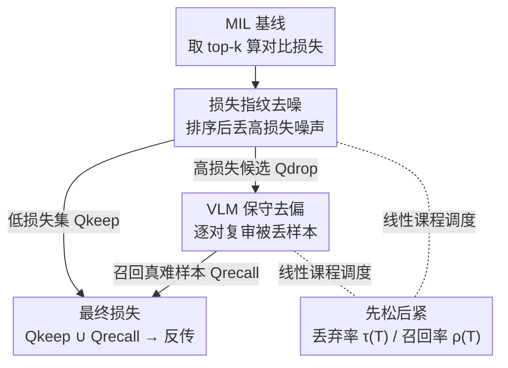

# Learning from Noisy Supervision: A Denoising-Debiasing Framework for Weakly Supervised Video Anomaly Detection

**会议**: CVPR 2026  
**论文**: [CVF Open Access](https://openaccess.thecvf.com/content/CVPR2026/html/Zhao_Learning_from_Noisy_Supervision_A_Denoising-Debiasing_Framework_for_Weakly_Supervised_CVPR_2026_paper.html)  
**领域**: 视频理解  
**关键词**: 弱监督视频异常检测, 多示例学习, 噪声标签, VLM 去偏, 课程学习

## 一句话总结
针对弱监督视频异常检测中 MIL 框架"把异常包里的正常片段错当异常"的噪声监督问题，本文提出即插即用的 D2MIL 框架：先用"噪声样本损失更高"这一规律动态丢弃高损失噪声，再用冻结 VLM 把被误删的难样本捞回来，在 ShanghaiTech / UCF-Crime / MSAD 上稳定提升五种主流 MIL 基线。

## 研究背景与动机
**领域现状**：弱监督视频异常检测（WS-VAD）只用视频级二元标签（正常/异常）训练，却要在测试时定位到帧级异常。主流做法是多示例学习（MIL）：把一段视频当作一个"包"（bag），里面的片段（snippet）当作"示例"（instance）；正常视频的所有示例都正常，异常视频则至少含一个异常示例。模型对正常包和异常包各取 top-k 高分示例，用对比损失拉开二者分数。

**现有痛点**：这套范式的隐患在于监督信号本身带噪。异常视频里其实大部分片段是正常的，但模型早期打分不准，常把异常包里的正常片段误判成高分异常并选进训练对。这些被错选的片段就是"噪声样本"，它们提供了错误的监督方向，污染了对真实异常模式的学习。绝大多数 MIL 方法（RTFM、MGFN、UR-DMU 等）都忽略了这种训练噪声。

**核心矛盾**：作者观察到一个关键现象——噪声样本在训练中表现出**更高、更震荡**的损失曲线，而真异常样本的损失平稳收敛（见原文 Figure 1b）。但矛盾在于：**有一部分真正的"难异常"样本同样是高损失**，因为它们是模型还没学会识别的困难模式。于是高损失集合里"鱼龙混杂"——既有该丢的噪声，也有该留的难样本。简单粗暴地把所有高损失样本都丢掉，会一并删掉宝贵的难例，导致模型只会拟合简单样本、泛化变差。

**本文目标**：在不引入额外标注的前提下，(1) 把噪声样本从训练中过滤掉；(2) 又不能误伤高损失的难异常样本。

**切入角度**：用损失高低做第一道粗筛（去噪），再用一个**冻结的视觉语言模型**做第二道精筛（去偏）——既然 VLM 有强大的零样本跨模态推理能力，就让它来判断"被丢掉的这帧到底像不像异常"，把误删的难样本召回。

**核心 idea**：先按损失动态丢高损失噪声，再用 VLM 重新审判被丢的候选、把真异常捞回来——"先去噪、再去偏"的两阶段协作，且作为通用策略可插进任何 MIL 方法。

## 方法详解

### 整体框架
D2MIL（Denoising–Debiasing in MIL）不是一个新的 MIL 模型，而是一个**套在已有 MIL 基线训练过程外面的两阶段插件**。给定一个 batch（b 个正常包 + b 个异常包），基线照常取 top-k 高分示例、按对比损失算出每个正常-异常包对的损失。D2MIL 接管"哪些样本该参与反传"这一步：第一阶段（去噪）按损失排序丢掉高损失的可疑噪声，留下低损失集合 $Q_{keep}$，同时把丢掉的高损失对存成候选噪声集 $Q_{drop}$；第二阶段（去偏）把 $Q_{drop}$ 里的每一对送进冻结 VLM 逐个复审，被判定为真异常的难样本召回成 $Q_{recall}$；最终用 $Q_{keep} \cup Q_{recall}$ 计算损失并反传更新模型。两个阶段的"丢弃比例"和"召回比例"都由同一种线性课程调度控制，在每个 epoch 内先松后紧。

### 关键设计

**1. 损失指纹去噪：用"高损失"这条线索动态丢掉噪声**

这一步直接对应"异常包里的正常片段被误选为噪声"的痛点。作者先固定 MIL 的对比损失形式（以 top-1 为例）：

$$L(B_a,B_n)=\max\!\big(0,\ 1-\max_{i\in B_a} f(v_i^a)+\max_{i\in B_n} f(v_i^n)\big)$$

其中 $f(\cdot)$ 是异常打分函数，损失鼓励异常包里最高分示例显著高于正常包里最高分示例。对 batch 内每个正常-异常包对算出一串损失 $Q=\{l_1,\dots,l_b\}$，**升序排序**得 $Q_s$，然后按当前丢弃率保留低损失子集：

$$Q_{keep}=Q_s\big[:\,(1-\tau(T))\,b\big]$$

依据就是那个核心观察——噪声样本损失高且震荡，真异常样本损失低且平稳，所以排序后排在尾部的高损失对更可能是噪声。被丢掉的高损失部分 $Q_{drop}$ 不是直接扔掉，而是存下来交给第二阶段。和"硬给一个固定阈值"相比，这里用排序+比例的方式自适应到每个 batch 的损失分布，不需要预设损失绝对值的门槛。

**2. VLM 保守去偏：把被误删的难样本捞回来**

去噪虽然干净，但会连带删掉那些"长得像噪声"的真难异常样本（它们也是高损失）。这一步专门补救。对 $Q_{drop}$ 里每个被丢的损失项，取回它对应的正常-异常示例对 $(s_i'^n, s_i'^a)$：正常示例来自正常包，是可信的真负样本；异常示例则是被怀疑成噪声、需要复审的对象。作者取每个 snippet 的**中间帧**作为代表关键帧（中间帧更可能捕获局部动作的语义中心），把正常帧和异常帧一起喂给冻结的 **Qwen-VL-Max**，用一个刻意保守的提示词问它"哪张图明显是异常事件？返回 0/1，只有高度确信才回答，不确定就返回 2"。如果 VLM 判定那个异常示例确实更像异常，就当作被误删的真异常召回进 $Q_{recall}$；否则（VLM 觉得正常帧更异常、或不确定）就当噪声永久丢弃。这种"宁可漏掉难样本也不放回噪声"的保守策略，避免了召回环节反而把噪声重新引回来。整个 VLM 只做零样本推理、不做任何微调，所以是真正零额外标注、零训练开销的语义先验。

**3. 线性课程调度：让去噪与去偏都"先易后难"**

两个阶段如果一上来就猛丢/猛召回，会让训练剧烈震荡。作者用同一套线性课程把两个比例都做成随 epoch 内迭代数 $T$ 递增：

$$\tau(T)=\tau_{max}\cdot\frac{T}{T_{total}-1}$$

去噪的丢弃率 $\tau(T)$ 和去偏的召回率 $\rho(T)$ 共用这个形式（$\tau_{max}$、$\rho_{max}$ 为各自上限，$T_{total}$ 是一个 epoch 内总迭代数）。这意味着每个 epoch 开头几乎不丢样本、让模型先用全量数据学通用模式，随后逐步加大噪声过滤强度；召回侧同样从少到多地引入难样本，避免难例被一次性塞进来导致模型崩。用线性而非更复杂的调度，是为了不引入额外超参、好调好用。

### 损失函数 / 训练策略
基础损失就是 MIL 的 hinge 式对比损失（Eq.1）。D2MIL 不改损失形式，只改"哪些样本对进入这个损失"：每个 epoch 内按 Alg.1 流程——取 top 示例算损失 → 升序排序 → 按 $\tau(T)$ 留低损失对、存高损失对 → VLM 复审高损失对、按 $\rho(T)$ 课程式召回难样本 → 用 $Q_{keep}\cup Q_{recall}$ 反传。每个基线沿用其原始超参，D2MIL 只额外引入 $\tau_{max}$ 和 $\rho_{max}$ 两个超参；top-1 类方法（Sultani）最优为 $\tau_{max}=0.5,\rho_{max}=0.1$，top-k 类方法 $\tau_{max}$ 通常取 0.1–0.2、$\rho_{max}$ 取约 0.1。

## 实验关键数据

### 主实验
三个数据集（ShanghaiTech、UCF-Crime、MSAD），帧级 AUC 为主指标，D2MIL 以插件形式套进五种主流 MIL 基线。下表为 UCF-Crime（最大规模真实世界数据集，1900 段视频）结果：

| 方法 | 特征 | AUC(%) | 相比原基线 |
|------|------|--------|-----------|
| UMIL (CVPR 2023) | I3D | 86.75 | — |
| VERA (CVPR 2025, VLM) | VLM | 86.55 | — |
| ProDisc-VAD (2025) | ViT | 87.12 | — |
| Sultani et al. + D2MIL | I3D | 85.24 | +1.90 |
| RTFM + D2MIL | I3D | 84.30 | +1.16 |
| TEVAD + D2MIL | I3D+Text | 84.76 | +0.22 |
| MGFN + D2MIL | I3D | 83.70 | +0.40 |
| **UR-DMU + D2MIL** | I3D | **87.80** | **+1.61** |

UR-DMU+D2MIL 的 87.80% 刷新了 MIL 类方法在 UCF-Crime 上的 SOTA，并超过 LLM 类 Holmes-VAD（84.61%）和 VLM 类 VERA。MSAD 上 RTFM+D2MIL 达 88.52%（+1.87）也是该集 SOTA。ShanghaiTech 因基线已接近饱和，提升较小但仍稳定为正（UR-DMU +1.29、RTFM +0.90）。

### 消融实验
核心消融是把流程拆成"原基线 Raw → 仅去噪 Denoise-only → 完整 D2MIL"三档，验证两个模块各自贡献（下表为 UCF-Crime，Table 5）：

| 基线 | Raw(%) | Denoise-only(%) | D2MIL(%) | 去噪增益 | 去偏增益 |
|------|--------|-----------------|----------|---------|---------|
| Sultani et al. | 83.34 | 84.77 | 85.24 | +1.43 | +0.47 |
| RTFM | 83.14 | 83.96 | 84.30 | +0.82 | +0.34 |
| TEVAD | 84.54 | 85.72 | 85.83 | +1.18 | +0.11 |
| MGFN | 83.44 | 83.60 | 83.70 | +0.16 | +0.10 |
| UR-DMU | 86.19 | 87.53 | 87.90 | +1.34 | +0.37 |

另有超参分析（Table 7，Sultani+D2MIL，UCF-Crime）：扫了 9 档丢弃率 × 2 档召回率共 18 组，$\tau_{max}=0.5,\rho_{max}=0.1$ 取得最高 AUC 85.24% 与最高 AP 31.60%；丢弃率过高（0.9）时 AUC 跌到 83.94%，说明丢太狠会误伤。

### 关键发现
- **去噪是主力，去偏是补刀**：三个数据集上去噪模块都贡献了大头（UCF-Crime 上 +0.16%~+1.34%），VLM 去偏再稳定补 +0.11%~+0.47%。即使在 ShanghaiTech 接近饱和（去噪后已很高）的情况下，去偏仍能再加约 +0.09%，说明召回难样本是与去噪互补的、独立有效的环节。
- **越复杂的场景增益越大**：MSAD（多场景航拍、跨视角）上整体相对提升最显著，去噪平均 +1.1%、去偏再 +0.4%~0.7%，印证了"过滤噪声 + 保住难例"对泛化的帮助在困难分布上更突出。
- **即插即用**：对从最早的 Sultani 到 SOTA 的 UR-DMU、再到带文本的 TEVAD，五种结构各异的 MIL 基线统统稳定为正，证明这是一种与具体 MIL 设计解耦的通用去噪策略。
- **定性上更"干净"**：RTFM+D2MIL 在异常区间内的峰更尖锐集中、更贴合真值边界，正常视频里则把原 RTFM 常见的"把光照/运动波动误当异常"的假阳性压了下去。

## 亮点与洞察
- **"高损失里鱼龙混杂"这个观察很有价值**：作者是首个在 MIL 框架里明确区分"噪声样本"与"难异常样本"的——二者都表现为高损失，但一个该丢一个该留。光靠损失值无法区分，于是请来语义更强的 VLM 当裁判，这个分工很自然。
- **用冻结 VLM 当"复审法官"而非"主模型"**：很多工作把 VLM/LLM 当成主干去微调（开销大），这里只让它做零样本二选一判断、且提示词刻意保守（不确定就弃权），把强语义先验用在了刀刃上，零训练开销、零额外标注。这个"小而精"的用法可迁移到其他带噪标签场景。
- **训练时数据筛选 vs 推理时模型改进的解耦**：D2MIL 完全不碰模型结构和损失公式，只改"哪些样本进损失"，因此能即插即用。这种"在训练管线里做样本治理"的思路，对任何 MIL/弱监督任务都有借鉴意义。
- **课程调度复用同一线性式**：去噪丢弃率和去偏召回率共用一个无额外超参的线性 schedule，"先用全量学通用、再渐进治理"，工程上简洁可控。

## 局限与展望
- **去偏天花板受限于 VLM 能力**：作者自己承认，去偏效果取决于底层 VLM（Qwen-VL-Max）的推理能力；VLM 看错时召回就会出错。换更弱的 VLM 可能掉点。
- **只看中间帧的单帧判断**：去偏把一个 snippet 压缩成中间一帧喂给 VLM，对"需要时序上下文才能判定"的异常（如缓慢演化、依赖前后动作的事件）可能力不从心——单帧静态画面里看不出"异常发生中"。
- **保守策略偏向高精度、可能牺牲召回**：提示词要求"不确定就弃权"，这意味着一部分真难样本会被永久丢弃，在异常本就稀少的场景下可能错过有价值的难例。
- **VLM 推理引入的额外开销未量化**：每个高损失对都要调一次 VLM，训练时这部分的时间/算力成本论文没给出明确数字，大规模数据上的可扩展性存疑。
- **改进方向**：把单帧复审换成短片段（多帧/光流）输入、或让 VLM 输出置信度而非硬标签来软加权召回，可能比"二选一+弃权"更稳。

## 相关工作与启发
- **vs 普通 MIL（Sultani/RTFM/MGFN/UR-DMU）**：它们都默认 top-k 选出的就是可信监督，忽略了异常包里正常片段被误选成噪声的问题；D2MIL 不替换它们，而是在其训练外面加一层样本治理，因此能给每一种都带来稳定增益。
- **vs ProDisc-VAD（处理标签歧义）**：ProDisc-VAD 用渐进差异学习缓解标签模糊，但没有刻画噪声样本独特的损失模式、也不区分难异常样本；D2MIL 用"损失指纹"显式识别噪声，并额外召回难样本，两个问题都治。
- **vs 提示增强方法（VadCLIP / LEC-VAD / 类别文本提示）**：这些方法依赖类别先验知识或类描述文本；D2MIL 用冻结 VLM 当通用语义先验，不需要任何额外类别标注。
- **vs LLM/VLM 主干方法（Holmes-VAD / VERA）**：Holmes-VAD 要微调多模态 LLM、开销大；VERA 用现成 VLM 做可解释检测。D2MIL 不把 VLM 当主模型，只把它当训练阶段的辅助复审模块，定位差异明显，且实验上 UR-DMU+D2MIL 反超了 Holmes-VAD 和 VERA。

## 评分
- 新颖性: ⭐⭐⭐⭐ 首个在 MIL 里显式区分"噪声样本 vs 难异常样本"，并用冻结 VLM 做零样本去偏召回，切入点扎实。
- 实验充分度: ⭐⭐⭐⭐ 三数据集 × 五基线 × Raw/去噪/完整三档消融 + 18 组超参扫描 + 定性分析，但缺 VLM 开销量化与不同 VLM 的对比。
- 写作质量: ⭐⭐⭐⭐ 动机由 Figure 1 的损失观察自然引出，方法两阶段清晰，公式与算法表完整。
- 价值: ⭐⭐⭐⭐ 即插即用、零额外标注、稳定涨点，对弱监督带噪场景实用性强，思路可迁移到其他 MIL 任务。

<!-- RELATED:START -->

## 相关论文

- [\[CVPR 2026\] The Road Less Seen: Segment Exploration for Weakly Supervised Video Anomaly Detection](the_road_less_seen_segment_exploration_for_weakly_supervised_video_anomaly_detec.md)
- [\[CVPR 2026\] Weakly Supervised Video Anomaly Detection with Anomaly-Connected Components and Intention Reasoning](weakly_supervised_video_anomaly_detection_with_anomaly-connected_components_and_.md)
- [\[CVPR 2026\] Joint Learning of General and Diverse Patterns with Mixture of Memory Experts for Weakly-Supervised Video Anomaly Detection](joint_learning_of_general_and_diverse_patterns_with_mixture_of_memory_experts_fo.md)
- [\[CVPR 2026\] TLMA: Mitigating the Impact of Weakly Labeled Information for Video Anomaly Detection](tlma_mitigating_the_impact_of_weakly_labeled_information_for_video_anomaly_detec.md)
- [\[AAAI 2026\] Learning to Tell Apart: Weakly Supervised Video Anomaly Detection via Disentangled Semantic Alignment](../../AAAI2026/video_understanding/learning_to_tell_apart_weakly_supervised_video_anomaly_detection_via_disentangle.md)

<!-- RELATED:END -->
