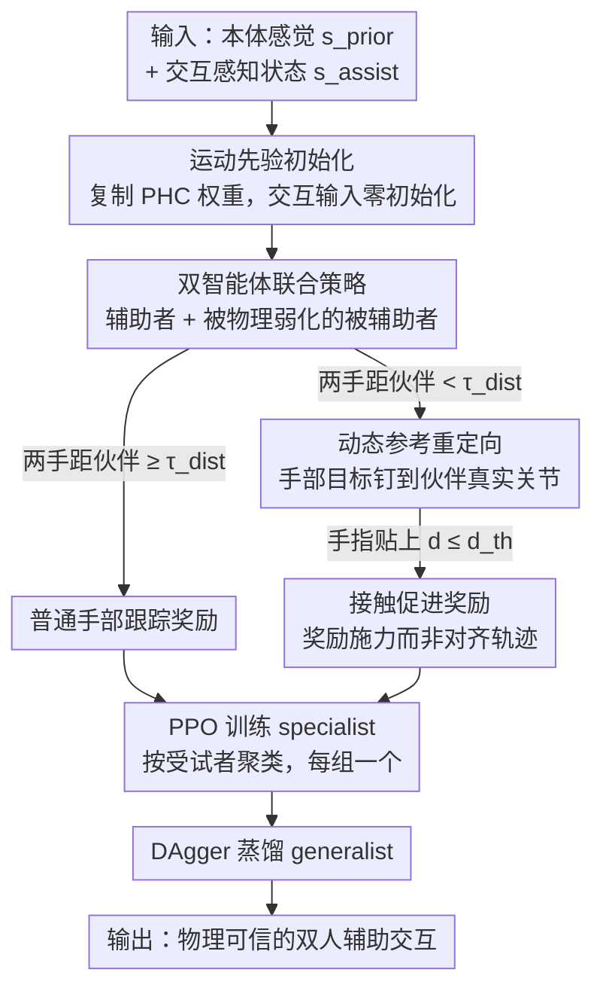

# Learning to Assist: Physics-Grounded Human-Human Control via Multi-Agent Reinforcement Learning

**会议**: CVPR 2026  
**arXiv**: [2603.11346](https://arxiv.org/abs/2603.11346)  
**代码**: [AssistMimic](https://yutoshibata07.github.io/AssistMimic/)  
**领域**: 视频理解  
**关键词**: multi-agent reinforcement learning, physics-based character control, human-human interaction, assistive motion imitation, motion tracking

## 一句话总结

提出 AssistMimic，将人-人辅助交互动作的物理模仿建模为多智能体强化学习（MARL）问题，通过运动先验初始化、动态参考重定向和接触促进奖励，首次实现了力交换型辅助动作的物理仿真跟踪。

## 研究背景与动机

- **领域现状**：基于物理引擎的人体运动模仿（如 DeepMimic、PHC）已能让虚拟角色和人形机器人高质量复现单人动作，但研究基本集中在单人场景，多人紧密接触交互几乎未被触及。
- **现有痛点**：现有多智能体交互方法（如 Human-X、Phys-Reaction）依赖"运动学回放"策略——先用单人控制器生成被辅助者动作，再固定回放训练辅助者。但辅助场景中被辅助者本身无法独立完成动作（如瘫痪者无法自行站起），单独生成其轨迹在物理上不可行。
- **核心矛盾**：辅助性人-人交互要求双方持续感知对方姿态并实时适配力/位置，解耦训练打破了物理一致性，会导致穿模、角色弹飞等严重问题。
- **本文目标**：学习物理可信的双人辅助交互控制器，使辅助者能根据被辅助者的实时状态提供有意义的物理支撑。
- **切入角度**：将问题建模为非对称动力学的多智能体 MDP，联合训练双方策略，让被辅助者也学会"如何接受帮助"。
- **核心 idea**：从单人运动先验迁移初始化 + 动态参考重定向保持接触对齐 + 接触促进奖励替代噪声手部跟踪，三者协同使 MARL 训练在高接触场景中收敛。

## 方法详解

### 整体框架

AssistMimic 要解决的是一件单人模仿框架做不到的事：让一个虚拟角色去**物理地搀扶/抬举另一个无法独立完成动作的角色**。它在物理仿真器里把辅助者（Supporter）和被辅助者（Recipient）当成两个智能体同时训练，而不是先生成一方再回放。两个智能体共享对称的 goal-conditioned 策略：输入既有自身的本体感觉 $s_{\text{prior}}$（关节状态、目标 $g$），又有一份交互感知状态 $s_{\text{assist}}$——伙伴的观测、当前接触状态、接触力、上一步动作。被辅助者被刻意"弱化"：降低 PD 增益和最大扭矩，让它物理上无法靠自己站起来，从而必须依赖外部支撑。整条流水线先用 PPO 为每类受试者训练一个 specialist 策略，再用 DAgger 把多个 specialist 蒸馏成一个通用 generalist。

真正让这套联合训练跑得通的，是下面三个互相咬合的设计：先靠运动先验把策略放到一个会站会走的起点上，再靠动态重定向让辅助者的手始终对准不断偏移的伙伴身体，最后靠接触奖励把"严格复现噪声手部轨迹"换成"在对的位置施对的力"。

### 关键设计

**1. 运动先验初始化：先让策略会走路，再学怎么帮人**

辅助交互的 MARL 探索空间太大，从零训练根本收敛不了——消融里去掉这一项，成功率直接是 0%，策略全程在地上扭动做 reward hacking。AssistMimic 的做法是把预训练好的单人跟踪控制器 PHC 当成起点：把 PHC 输入层的权重原样复制到新策略中对应 $s_{\text{prior}}$ 的那部分，而新增的交互感知输入 $s_{\text{assist}}$ 对应的权重初始化为零，即 $\mathbf{W}_{\text{new}}^{\text{input}} = [\mathbf{W}_{\text{prior}}^{\text{input}} \mid \mathbf{0}]$。零初始化意味着训练刚开始时交互输入还不起作用，策略的行为和单人 PHC 完全一致——已经会站、会走、会平衡。RL 于是从一个"会基本运动"的策略出发去学辅助，而不是从随机乱动出发，探索一下子变得可行。

**2. 动态参考重定向：让辅助者的手追的是伙伴本人，而不是录像里的坐标**

被辅助者因为被物理弱化，实际姿态会持续偏离参考动作；如果辅助者仍然死板地去够参考里那个固定的全局手部位置，手就会扑空、完全错过该接触的身体部位。重定向只在两人距离低于阈值 $\tau_{\text{dist}}$ 时启动：先在参考空间里找到离辅助者手腕最近的被辅助者身体关节 $k^*$，量出此刻参考给出的相对偏移 $\Delta\hat{\mathbf{p}}$，再把这个偏移加到仿真中被辅助者**实际**关节位置上，得到辅助者手部的新目标

$$\hat{\mathbf{p}}_{h_i,t}^{(S)} = \mathbf{p}_{k^*,t}^{(R)} + \Delta\hat{\mathbf{p}}_{h_i,t}.$$

这样辅助者追的目标随着伙伴真实身体一起动，无论被辅助者被推到哪儿，手始终钉在该扶的部位上，接触才不会丢。

**3. 接触促进奖励：在该接触的地方，奖励"施力"而不是"对齐轨迹"**

动捕里的手部轨迹遮挡严重、噪声很大，离得很近时还死磕跟踪误差，反而会逼策略去复现抖动的错误轨迹，妨碍真正有效的支撑甚至撞到对方。于是当辅助者手部进入近距离范围（$d_{i,t} \leq d_{\text{th}}$）时，把标准手部跟踪奖励换成接触促进奖励：

$$r = \beta f_{i,t} \exp(-\alpha d_{i,t}) + b_{\text{contact}},$$

其中 $f_{i,t}$ 是手指接触力经安全饱和后的聚合值，$\exp(-\alpha d_{i,t})$ 鼓励手贴得更近，$b_{\text{contact}}$ 是成功接触的常数奖励。距离较远时仍用普通跟踪奖励保证手大致走到位。这一切换让策略学的是"在正确位置施加正确的力"——这恰恰是搀扶/抬举的本质，而不是逐帧复刻一段本来就不可靠的运动学轨迹。

### 一个完整示例：辅助者把被辅助者扶起来

设想被辅助者蹲坐在地、双臂被弱化扭矩无法自行撑起。① 训练起点上，得益于运动先验，辅助者一开始就稳稳站着、不会乱倒；② 它朝伙伴走近，当手腕到伙伴某个上臂关节的距离跌破 $\tau_{\text{dist}}$，动态重定向启动，辅助者的手部目标从"录像里那个固定坐标"切换为"伙伴此刻真实的上臂位置加偏移"——即便被辅助者因失衡比参考更往下沉，手依然对准它真实的胳膊；③ 当手指真正贴上（$d_{i,t} \leq d_{\text{th}}$），奖励从跟踪切到接触促进，策略不再纠结手指是否逐帧吻合噪声轨迹，而是被奖励去施加托举力 $f_{i,t}$；④ 两个智能体同时调整：辅助者发力上托，被辅助者也学会顺势借力起身，二者在物理仿真里完成一次没有穿模、没有弹飞的搀扶。

### 损失函数与训练策略

基础是跟踪奖励 $r_{\text{track}}^{(m)} = \exp(-D(\hat{\mathbf{q}}_t^{(m)}, \mathbf{q}_t^{(m)}))$，$D$ 衡量关节旋转/位置/速度与参考的加权距离。两个智能体的总奖励略有不同：被辅助者用"跟踪 + 功率惩罚 + 辅助稳定性项"，辅助者则在远距离用跟踪、近距离切换为上面的接触促进奖励（公式 11）。训练时按受试者 ID 聚类，每组训练一个 specialist（PPO），用 0.25m 姿态偏差阈值做 early termination，并用 Physical State Initialization（PSI）从近期 rollout 采样初始状态以避免一开局就穿模；最后由 DAgger 把多个 specialist 蒸馏成一个 generalist。

## 实验关键数据

### 主实验：Specialist 策略评估

| 方法 | Inter-X SR(%)↑ | Inter-X MPJPE(mm)↓ | Mass×1.2 SR(%)↑ | Kp/Kd×0.5 SR(%)↑ |
|---|---|---|---|---|
| Sequential Training | 62.4 | 92.3 | 49.9 | 50.5 |
| **AssistMimic** | **83.4** | 107 | **73.1** | **83.3** |
| (−) Dynamic Retargeting | 74.9 | 113 | 57.9 | 72.8 |
| (−) Contact Reward | 81.6 | 80.4 | 66.3 | 77.1 |
| (−) Weight Init | 0.0 | 248 | 0.0 | 0.0 |

| 方法 | HHI-Assist SR(%)↑ | MPJPE(mm)↓ | Mass×1.5 SR(%)↑ | Hip torque×0.5 SR(%)↑ |
|---|---|---|---|---|
| **AssistMimic** | **97.7** | 89.5 | **67.8** | **73.2** |
| (−) Dynamic Retargeting | 85.4 | 125 | 49.1 | 62.9 |
| (−) Contact Reward | 85.8 | 127 | 56.4 | 27.7 |
| (−) Weight Init | 19.1† | 364† | - | - |

### 消融实验：Generalist 策略与 COM 稳定性

| 方法 | Inter-X Generalist SR(%)↑ | MPJPE(mm)↓ |
|---|---|---|
| AssistMimic | 39.8 | 103 |
| + DAgger 蒸馏 | **64.7** | 106 |

| 方法 | COM Std(seen)↓ | COM Std(Mass×1.5)↓ | COM Std(Hip τ×0.5)↓ |
|---|---|---|---|
| **AssistMimic** | **0.0921** | **0.0738** | **0.0865** |
| (−) Dyn Retarget | 0.1038 | 0.0902 | 0.0924 |
| (−) Contact | 0.0938 | 0.0838 | 0.0849 |

## 亮点与洞察

1. **首次实现力交换型辅助交互的物理跟踪**：在 Inter-X 和 HHI-Assist 两个基准上，AssistMimic 是第一个能成功跟踪紧密接触、力交换人-人动作的方法，填补了该领域空白。
2. **"被辅助者也要学"的 insight 很深刻**：联合训练 vs 解耦训练的对比（83.4% vs 62.4%）清楚表明，即使是"被帮助的一方"也需要主动学习如何配合接受支撑，单向适配远远不够。
3. **运动先验初始化是不可或缺的**：去掉后成功率直接降为 0%，说明在高维双人交互空间中，没有良好的初始化，RL 根本无法有效探索。
4. **接触促进奖励大幅提升鲁棒性**：在 unseen dynamics（质量增加、扭矩降低）条件下优势尤为明显（HHI-Assist 上 hip torque×0.5: 73.2% vs 27.7%），说明学会"主动接触施力"比"精确跟踪手部轨迹"更重要。
5. **可泛化到生成式动作**：能跟踪扩散模型生成的交互轨迹，将运动学输出转化为物理可信动作，展现了框架的通用性。

## 局限与展望

1. **手部灵巧性不足**：当前模型在需要抓握并举起被辅助者手臂的场景中失败率高，精细手指协调难以从噪声示范中学到，需要更高自由度的手部模型或专门的抓取策略。
2. **缺乏视觉观测输入**：当前策略依赖精确的本体感觉和伙伴状态信息，未引入视觉观测，这限制了 sim-to-real 迁移到真实人形机器人的可行性。
3. **规划与控制解耦**：高层运动规划器和底层跟踪控制器之间缺乏紧密集成，无法做到真正的实时自适应协调，未来可探索端到端规划-控制联合学习。
4. **Generalist 策略成功率仍有提升空间**：30 个多样交互 clip 上的 generalist 成功率为 64.7%，距离 specialist 的 83.4% 仍有差距，扩展训练数据和策略容量是重要方向。

## 相关工作与启发

| 方面 | AssistMimic | Human-X (2025) | Phys-Reaction (2024) |
|---|---|---|---|
| 交互建模 | 联合 MARL，双方共同优化 | 扩散规划器+单智能体跟踪 | 单智能体+运动学回放 |
| 物理一致性 | 完全物理仿真，支持力反馈 | 部分物理，开环反应 | 回放打破物理一致性 |
| 适用场景 | 力交换辅助（搀扶/抬举） | 社交交互（击掌等） | 非接触社交交互 |
| 关键局限 | 手部灵巧性不足 | 无法处理力耦合交互 | 被辅助者轨迹不可独立生成 |

**vs PHC**：AssistMimic 直接继承 PHC 的单人跟踪框架作为运动先验，在此基础上扩展为多智能体架构，说明优秀的单人控制器可以作为多人交互的强力基础。

**vs CooHOI**：CooHOI 处理的是人-物协作操控，本文则面向人-人辅助交互，挑战在于被辅助者本身是一个有自主动力学的智能体而非被动物体，需要双向适配。

## 评分

- **新颖性**: ⭐⭐⭐⭐ — 将辅助交互建模为非对称 MARL 问题是该领域首次，三个核心组件的设计都有清晰的物理直觉支撑
- **实验充分度**: ⭐⭐⭐⭐ — 两个数据集、四种评估设定、完整消融、unseen dynamics 鲁棒性测试；但缺少 sim-to-real 和真实机器人实验
- **写作质量**: ⭐⭐⭐⭐ — 问题定义清晰，各组件动机充分，图表直观展示了方法优势和基线失败模式
- **价值**: ⭐⭐⭐⭐⭐ — 辅助机器人是重要应用方向，首次解决了物理可信双人辅助交互的控制问题，为后续 sim-to-real 奠定基础

<!-- RELATED:START -->

## 相关论文

- [\[CVPR 2026\] VideoChat-M1: Collaborative Policy Planning for Video Understanding via Multi-Agent Reinforcement Learning](videochatm1_collaborative_policy_planning_for_vide.md)
- [\[CVPR 2026\] Dual-Agent Reinforcement Learning for Adaptive and Cost-Aware Visual-Inertial Odometry](dual-agent_reinforcement_learning_for_adaptive_and_cost-aware_visual-inertial_od.md)
- [\[CVPR 2026\] Efficient Frame Selection for Long Video Understanding via Reinforcement Learning](efficient_frame_selection_for_long_video_understanding_via_reinforcement_learnin.md)
- [\[CVPR 2026\] Incentivizing Versatile Video Reasoning in MLLMs via Data-Efficient Reinforcement Learning](incentivizing_versatile_video_reasoning_in_mllms_via_data-efficient_reinforcemen.md)
- [\[CVPR 2026\] MaskAdapt: Learning Flexible Motion Adaptation via Mask-Invariant Prior for Physics-Based Characters](maskadapt_learning_flexible_motion_adaptation_via_mask-invariant_prior_for_physi.md)

<!-- RELATED:END -->
