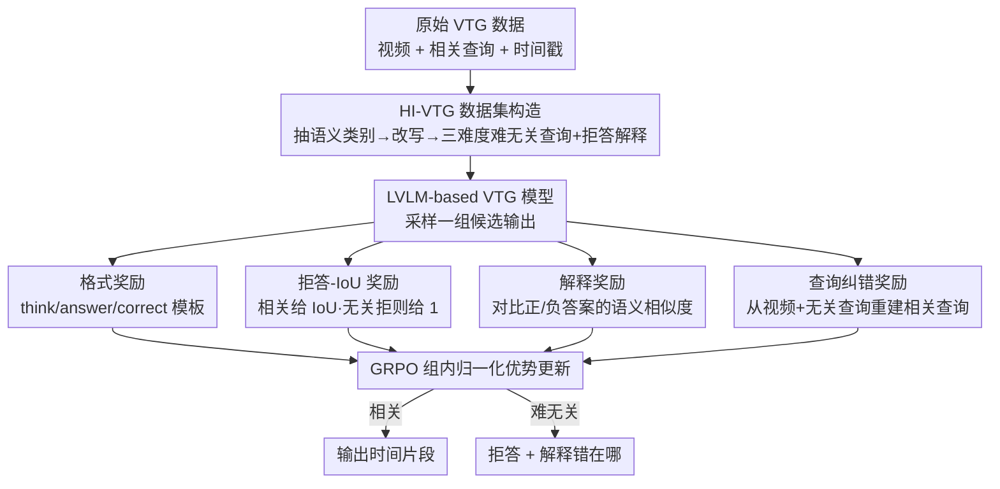

<!-- 由 tmp/gen_cvf_stubs.py 自动生成（CVF-only，无 arXiv） -->
# Learning to Refuse: Refusal-Aware Reinforcement Fine-Tuning for Hard-Irrelevant Queries in Video Temporal Grounding

**会议**: CVPR 2026  
**论文**: [CVF Open Access](https://openaccess.thecvf.com/content/CVPR2026/html/Lee_Learning_to_Refuse_Refusal-Aware_Reinforcement_Fine-Tuning_for_Hard-Irrelevant_Queries_in_CVPR_2026_paper.html)  
**代码**: 待确认  
**领域**: 视频理解  
**关键词**: 视频时序定位, 拒答, 强化微调, GRPO, 细粒度语义

## 一句话总结
针对视频时序定位（VTG）模型「凡查询必给一段时间」的盲目假设，本文用基于 GRPO 的强化微调（RA-RFT）配合四个奖励（格式、拒答-IoU、解释、查询纠错）和一个专门构造的「难无关查询」数据集 HI-VTG，让模型学会拒绝那些**语义高度相似但实际不匹配**的查询并解释原因，在多个 relevance-aware VTG 场景上把拒答与解释质量大幅拉高，同时不损伤正常的定位精度。

## 研究背景与动机
**领域现状**：视频时序定位（Video Temporal Grounding, VTG）的任务是给定一段视频和一句自然语言查询，输出查询对应的时间片段 $[t_s, t_e]$。近年主流从特征融合的小模型转向 LVLM（大视觉语言模型）路线，又进一步分成 SFT 派和 RFT 派——后者把 GRPO 那套「带奖励的强化微调」搬进 VTG（如 Time-R1、VideoChat-R1），靠时间感知奖励显著提升了定位推理能力。

**现有痛点**：几乎所有 VTG 模型都内置了一个危险假设——**视频里一定存在与查询相关的片段**。于是哪怕查询跟视频八竿子打不着，模型也会硬给出一段时间戳。少数工作（RaTSG、NA-VMR）想做「拒答」，但它们只能拒掉**完全无关**的查询（通过跨视频随机打乱 query 来构造负样本），学到的是粗粒度差异。

**核心矛盾**：现实里最棘手的是**难无关查询（hard-irrelevant query）**——查询和视频在高层语义上高度重合，只在细节上错位。例如视频是「厨师在厨房煮意面」，查询是「厨师在厨房切牛排」：都是「厨师在厨房做菜」，但动作（煮 vs 切）和宾语（意面 vs 牛排）都不对。现有方法只学了粗粒度的「相关/不相关」二分，根本捕捉不到这种细粒度错位，于是照样输出一个错误片段。

**本文目标**：让 VTG 模型在查询相关时准确定位、在查询（哪怕是难无关）时拒绝输出片段，并能**说清楚为什么不匹配**。这需要同时解决两件事——一套能驱动细粒度语义辨别的训练策略，以及一个含难无关样本的数据集。

**切入角度**：作者观察到 SFT 会因模仿指令格式而灾难性遗忘泛化能力、退化成「来者不拒」；而 RFT（GRPO）通过奖励信号调整输出，更容易把「拒答」这种行为泛化出去。所以作者选择在 RFT 模型上做文章，用精心设计的奖励把「何时拒、如何解释、错在哪」一并教给模型。

**核心 idea**：用「拒答-IoU + 解释 + 查询纠错」三类语义奖励替代单纯的定位奖励，强迫模型去做查询与视频之间的细粒度语义比对，从而学会拒绝难无关查询——同时配套构造分三个难度等级的 HI-VTG 数据集来喂这套奖励。

## 方法详解

### 整体框架
方法由两块拼成：一条**数据构造管线**先把现成 VTG 数据集「升级」成带难无关查询和拒答解释的 HI-VTG 数据集；一套**强化微调（RA-RFT）**再用 GRPO 在这个数据集上后训练 LVLM-based VTG 模型，靠四个奖励同时学会「相关就定位、无关就拒答、并解释清楚」。

数据侧：原始 VTG 样本是三元组 $\{v, q_r, a_{time}\}$（视频、相关查询、带时间戳的答案）。作者先用 LLM 从相关查询里抽出语义相关类别，再据此改写出难无关查询 $q_{ir}$ 和对应的拒答解释 $a_{refusal}$，最终拼成 $\{v, q_r, a_{time}, q_{ir}, a_{refusal}\}$。训练侧：模型对每条输入采样一组候选输出（GRPO 的 group），由四个奖励打分，按组内归一化优势更新策略。模型被要求按固定模板 `<think>…</think><answer>…</answer><correct>…</correct>` 输出，其中 `<answer>` 要么给时间戳要么给拒答理由，`<correct>` 在无关情形下重建出本该相关的查询。

GRPO 的训练目标延续标准形式：对每条输入 $q$，策略 $\pi_\theta$ 生成一组候选 $\{o_1,\dots,o_G\}$，奖励函数对每个候选打分后做组内归一化，最大化加权奖励并加 KL 正则约束不偏离参考策略：

$$R(o)=\sum_i \frac{\pi_\theta(o_i)}{\pi_{\theta_{old}}(o_i)}\cdot\frac{r(o_i)-\mathrm{mean}(\{r(o_j)\})}{\mathrm{std}(\{r(o_j)\})},\quad \max_{\pi_\theta}\mathbb{E}\big[R(o)-\beta D_{KL}(\pi_\theta\|\pi_{ref})\big]$$

本文真正的创新全在奖励 $r(o)=r_{for}+r_{R\text{-}IoU}+r_{exp}+r_{cor}$ 的设计和 HI-VTG 数据上。

### 关键设计

**1. 拒答-IoU 奖励：把「该定位」和「该拒答」统一进一个分数**

朴素的 VTG 奖励只会鼓励模型输出准的时间戳，结果就是「来者不拒」——对无关查询也硬给一段。本文把奖励改成对相关/无关两种情形分别打分：

$$r_{R\text{-}IoU}(o)=\begin{cases} \mathrm{IoU}(a_{time},\hat a), & q\in\text{Rel.}\ \text{且}\ \{t_s,t_e\}\in\hat a\\ 1, & q\in\text{Irre.}\ \text{且}\ \{t_s,t_e\}\notin\hat a\\ 0, & \text{otherwise}\end{cases}$$

其中 $\hat a$ 是从 `<answer>` 标签里抽出的答案。相关查询且模型给出了有效时间戳时，奖励就是预测段与真值段的 IoU，鼓励定位准；无关查询且模型**没有**输出任何时间戳时给满分 1，直接奖励「拒答」这个行为本身；其余（相关却拒、无关却给段）给 0。这一个分段函数就把「何时该定位、何时该闭嘴」这对相互冲突的目标捏进了同一个标量，让 GRPO 在采样组内自然区分出两类正确行为。

**2. 解释奖励：用对比相似度逼模型说清「错在哪」**

光会拒还不够，难无关查询和视频共享高层语义，只有指出**具体哪个细节对不上**才算真的理解了细粒度差异。作者用一个对比式的解释奖励：

$$r_{exp}(o)=\mathrm{sim}(a_{pos},\hat a)-\mathrm{sim}(a_{neg},\hat a)$$

$\mathrm{sim}$ 是 SentenceBERT 嵌入的余弦相似度。对相关查询，正样本是时间戳答案 $a_{time}$、负样本是拒答 $a_{refusal}$；对难无关查询则反过来，正样本是拒答解释、负样本是时间戳答案。奖励要求生成答案 $\hat a$ 既靠近正参考又远离负参考——这就把模型从「随便拒一句」推向「生成贴近参考拒答、明确点出语义错位」的解释，从而间接训练它捕捉细粒度差异。

**3. 查询纠错奖励：让模型把「本该是什么」重建出来，逼它做语义比对**

要判断查询哪里错了，最彻底的办法是知道「正确的查询本该长什么样」。作者让模型在 `<correct>` 标签里根据视频 $v$ 和难无关查询 $q_{ir}$ 重建出原始相关查询 $q_r$，并用相似度奖励：

$$r_{cor}(o)=\begin{cases} 0, & q\in\text{Rel.}\\ \mathrm{sim}(q_r,\hat c), & q\in\text{Irre.}\end{cases}$$

$\hat c$ 是 `<correct>` 段里抽出的纠正查询，该奖励只在无关情形生效（相关查询无需纠正故为 0）。要重建出 $q_r$，模型必须把视频内容和错误查询逐元素对照——「视频里是煮、查询说切」「视频里是意面、查询说牛排」——这种重建任务天然强迫细粒度推理，比单纯让它输出「不相关」三个字学到的语义辨别力强得多。消融里它对 F1 和解释质量都有额外加成。

**4. HI-VTG 数据集：语义类别 + 三难度梯度，造出可控的「难无关」样本**

没有合适的难无关数据，上面的奖励就无米下锅。作者用 LLM（GPT-5-mini）两步造数据：先定义 11 个语义相关类别、归到动作/物体/场景/属性四大类（如动作顺序、细粒度动作、物体存在、计数、属性值、场景切换等），让 LLM 从原始查询里挑出 top-3 最能刻画查询-视频关系的类别；再据这些类别和视频描述，修改查询里 1/2/3 个语义元素，对应造出**Strong / Moderate / Weak** 三个难度等级的难无关查询（改得越少越难拒，因为越像），并同步生成逐点说明错位的拒答解释。最终数据集含 2.5K 相关 + 7.5K 难无关（三档各占）共 10K 对，覆盖 HowTo100M、DiDeMo、InternVID 等多源视频。这个分级设计既给训练提供了由易到难的语义梯度，也让后续分析能验证「越难的无关查询、本方法相对增益越大」。

> 补充：格式奖励 $r_{for}$（输出符合 `<think>/<answer>/<correct>` 模板给 1，否则 0）是辅助性的脚手架，目的是把推理、判断、纠错三步固定成一致结构，便于后续从标签里抽取 $\hat a$、$\hat c$ 来算上面三个奖励，本身不承担语义学习。

### 损失函数 / 训练策略
后训练统一用 GRPO，目标如整体框架中的 $\max_{\pi_\theta}\mathbb{E}[R(o)-\beta D_{KL}(\pi_\theta\|\pi_{ref})]$，$\beta$ 控制对参考策略的偏离。骨干用 7B 规模的 RFT-based VTG 模型（Time-R1、VideoChat-R1、VideoChat-R1-Thinking）。视频按 2 FPS 均匀采帧、缩放到约 2.8M 像素；后训练 3 个 epoch、batch size 16，取最终 checkpoint 评测，**不在任何下游基准上单独微调**；实验在 8×A100 上配 ZeRO-3。

## 实验关键数据

### 主实验
在三类 relevance-aware VTG 场景上评测：难无关 VTG（HI-ActivityNet / HI-TVGBench / HI-Charades）、简单打乱 RA-VTG（SS-*）、以及人工标注 RA-VTG。指标用 RA-IoU（联合评估相关判断与定位）和 F1，解释质量另用 RT-IoU、SentenceBERT、LLM score。下表摘 HI-VTG 三基准上 RA-RFT 给各 RFT 骨干带来的增益（F1 avg）：

| 数据集 | 骨干 | F1(基线) | F1(+RA-RFT) | 提升 |
|--------|------|----------|-------------|------|
| HI-ActivityNet | Time-R1 | 70.5 | 76.3 | +5.8 |
| HI-TVGBench | Time-R1 | 64.5 | 70.0 | +5.5 |
| HI-Charades | VideoChat-R1 | 62.3 | 73.3 | +11.0 |
| HI-ActivityNet | VideoChat-R1 | 64.4 | 72.9 | +8.5 |
| HI-ActivityNet | VideoChat-R1-think | 62.5 | 71.8 | +9.3 |

人工标注集（Tab. 3）上不仅 F1 涨，解释质量提升更醒目——以 Time-R1 为例：F1 avg 57.1→71.2，RT-IoU 12.0→19.8，SBert 0.27→0.47，LLM score 1.16→2.13，说明生成的拒答理由更贴近人写的解释。SFT 类基线（TimeChat / TimeSuite / TRACE）几乎全军覆没（无关查询 F1 普遍接近 0），印证了「SFT 灾难性遗忘、来者不拒」的判断。

### 消融实验
奖励逐项叠加（Tab. 4，HI-ActivityNet，Time-R1 骨干）：

| 配置 | F1 | mIoU | RT-IoU | LLM | 说明 |
|------|----|----|--------|-----|------|
| Time-R1 基线 | 70.5 | 45.8 | 30.4 | 2.00 | 原始 RFT 模型 |
| +GRPO w/o HI-VTG | 70.0 | 46.4 | 28.3 | 1.85 | 只用简单打乱数据，反而略降 |
| +GRPO w/ R.IoU | 75.1 | 50.9 | 34.5 | 2.29 | 换 HI-VTG + 拒答-IoU，相关判别大涨 |
| +GRPO w/ R.IoU-Exp | 75.6 | 52.2 | 36.0 | 2.37 | 加解释奖励，解释质量上来 |
| +GRPO w/ R.IoU-Exp-Cor | 76.3 | 51.9 | 37.1 | 2.44 | 再加纠错奖励，F1 与解释进一步提升 |

### 关键发现
- **数据比奖励先决**：只用简单打乱的无关查询（w/o HI-VTG）即便配上拒答-IoU 奖励也压不住难无关情形（F1 70.0、甚至略低于基线），换上 HI-VTG 后同样的奖励立刻跳到 75.1——说明难无关样本本身才是学会细粒度拒答的前提。
- **奖励三件套各有分工且互补**：拒答-IoU 主攻「相关判别」（F1 +4.6），解释奖励主攻「为什么」（RT-IoU、LLM score 继续涨），纠错奖励再补 F1 与解释、且不掉 RA-IoU。
- **越难增益越大**：按难度分层（Tab. 5/6），Strong（最像、最难拒）档位的相对提升最大（如 Time-R1 F1 60.0→70.6），正好对应方法初衷——专治细粒度错位。
- **不伤正常定位**：标准 VTG（ActivityNet Captions, Tab. 7）上加 RA-RFT 后 mIoU 基本持平（Time-R1 41.2→41.3），证明拉高拒答能力没有以牺牲定位精度为代价。

## 亮点与洞察
- **把「拒答」做成可被奖励的行为**：拒答-IoU 用一个分段函数同时编码「相关给 IoU、无关拒则给满分」，干净地把两个对立目标塞进 GRPO 的同组比较里，是整套方法的支点——这个「分段奖励统一冲突目标」的套路可迁移到任何「该做/该弃权」的判别式生成任务。
- **查询纠错是最巧的一招**：与其让模型空喊「不相关」，不如逼它把「正确查询本该是什么」重建出来。重建任务天然要求逐元素语义比对，是一种把「细粒度理解」转化为可监督信号的聪明代理目标。
- **难度可控的数据合成**：用「语义类别抽取 → 改 1/2/3 个元素」造出 Strong/Moderate/Weak 三档难无关样本，既给训练制造语义梯度，又让分析能定量验证「越难越受益」，数据构造和评测闭环设计得很完整。
- **即插即用**：方法不绑定特定骨干，对三个不同 RFT-based VTG 模型都稳定增益，工程上是「后训练加奖励」而非改架构，落地成本低。

## 局限性 / 可改进方向
- **依赖 LLM 造数据**：HI-VTG 的难无关查询和拒答解释全由 GPT-5-mini 生成，训练与（部分）评测共用同一套构造流程，可能引入分布偏置；作者已意识到这点并补了人工标注集，但训练数据本身的偏置仍在。
- **拒答是「不输出时间戳」的硬判定**：拒答-IoU 对无关查询只看「有没有给时间戳」（$\{t_s,t_e\}\notin\hat a$ 给 1），是个二值信号，对「拒得有多准/解释有多对」靠另两个奖励间接约束，奖励之间的权重直接等权相加、未做调参敏感性分析。
- **解释奖励受限于 SentenceBERT**：用句向量余弦相似度衡量解释质量，可能对「语义对但措辞不同」的好解释惩罚、对「措辞像但点错」的坏解释放行；更细的事实一致性校验仍是空白。
- **VideoChat-R1 在标准 VTG 上略降**：Tab. 7 里该骨干加 RA-RFT 后 mIoU 36.4→35.5，说明「拒答能力」与「定位精度」并非对所有骨干都完全无损，存在轻微 trade-off。

## 相关工作与启发
- **vs RaTSG / NA-VMR（拒答式 VTG）**: 它们靠多任务/额外预测头判断相关性，但训练负样本是跨视频随机打乱的查询，只学到粗粒度「相关/无关」二分；本文用难无关数据 + 细粒度语义奖励，专门攻克「像但不对」的查询，且能给出解释。
- **vs SFT-based VTG（TimeChat / TimeSuite / TRACE）**: SFT 模仿指令格式答案，灾难性遗忘泛化能力、对无关查询照样输出片段（实验里无关 F1 近 0）；本文走 RFT 路线，用奖励信号把拒答行为泛化出去。
- **vs 普通 RFT-based VTG（Time-R1 / VideoChat-R1）**: 它们的时间感知奖励只优化定位、隐含「片段总存在」假设，故只能拒完全无关查询；本文在同样的 GRPO 框架上换上拒答-IoU/解释/纠错奖励，把目标从「定位准」扩成「该定位时准、该拒时拒、并说清原因」。

## 评分
- 新颖性: ⭐⭐⭐⭐ 把「难无关查询拒答」这一被忽视但现实的问题形式化，并用奖励设计（尤其查询纠错代理目标）+ 分级数据巧妙落地。
- 实验充分度: ⭐⭐⭐⭐ 三类场景、三个骨干、逐项奖励消融、难度分层、标准 VTG 不退化都覆盖到了，证据链完整。
- 写作质量: ⭐⭐⭐⭐ 动机递进清晰，奖励公式和数据构造交代明确，图表充分。
- 价值: ⭐⭐⭐⭐ 即插即用、不改架构、对多个 RFT 骨干稳定增益，对走向「可信/可解释」的视频-语言理解有实际意义。

<!-- RELATED:START -->

## 相关论文

- [\[CVPR 2026\] CVA: Context-aware Video-text Alignment for Video Temporal Grounding](cva_context-aware_video-text_alignment_for_video_temporal_grounding.md)
- [\[CVPR 2026\] Efficient Frame Selection for Long Video Understanding via Reinforcement Learning](efficient_frame_selection_for_long_video_understanding_via_reinforcement_learnin.md)
- [\[NeurIPS 2025\] TempSamp-R1: Effective Temporal Sampling with Reinforcement Fine-Tuning for Video LLMs](../../NeurIPS2025/video_understanding/tempsampr1_effective_temporal_sampling_with_reinforcement_fi.md)
- [\[CVPR 2026\] T2SGrid: Temporal-to-Spatial Gridification for Video Temporal Grounding](t2sgrid_temporal-to-spatial_gridification_for_video_temporal_grounding.md)
- [\[CVPR 2026\] VideoChat-M1: Collaborative Policy Planning for Video Understanding via Multi-Agent Reinforcement Learning](videochatm1_collaborative_policy_planning_for_vide.md)

<!-- RELATED:END -->
