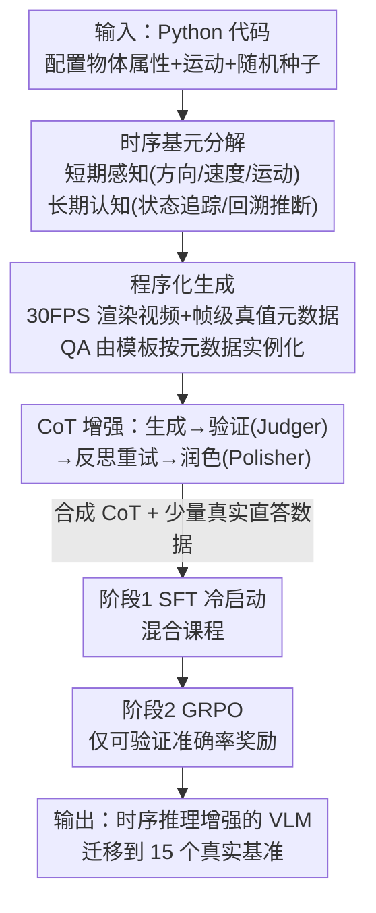

# Learning Transferable Temporal Primitives for Video Reasoning via Synthetic Videos

**会议**: CVPR 2026  
**论文**: [CVF Open Access](https://openaccess.thecvf.com/content/CVPR2026/html/Jiang_Learning_Transferable_Temporal_Primitives_for_Video_Reasoning_via_Synthetic_Videos_CVPR_2026_paper.html)  
**代码**: https://github.com/jiangsongtao/Synthetic-Video  
**领域**: 视频理解 / 多模态VLM  
**关键词**: 时序推理, 合成视频, 时序基元, 数据高效, GRPO

## 一句话总结
本文提出 SynRL：用纯代码程序化生成的合成视频（几何形状的运动/状态变化）教 VLM 学会"时序基元"（方向、速度、状态追踪等），核心发现是这些从抽象合成视频学到的基本时序技能能**直接迁移**到真实世界视频，仅用约 7.7K 合成 CoT 样本就在 15 个基准上全面提升，甚至胜过 Video-R1 的 165K 真实样本（约 21× 数据效率）。

## 研究背景与动机
**领域现状**：VLM 从静态图像理解走向视频理解，要求模型从"识别静态模式"转到"对时序动态推理"——运动轨迹、速度变化、状态转移。RL 后训练（如 GRPO）是增强这类能力的有希望路径。

**现有痛点**：高质量、带时序标注的视频数据稀缺，逼得现有方法**依赖专有模型**（GPT-4V、Gemini-2.5-Pro）来合成训练数据（生成 QA 或 CoT 标注）。但这里有两个致命问题：（1）**专有模型自己的基础时序感知就系统性出错**——论文 Figure 1 显示 Gemini-2.5-Pro 连一个简单几何形状的运动轨迹都会描述错、会把运动方向搞反，这种"流畅但错误"的标注会把错误**注入**训练数据，教出同样"fluent-but-wrong"的推理风格；（2）现有视频数据集**缺乏时序中心性**，很多问题从单个关键帧就能答出来，模型靠静态模式匹配就能绕过真正的时序整合。

**核心矛盾**：想用 RL 后训练提升时序推理，却拿不到既正确又真正考时序的监督信号——靠专有模型标注，错误和"伪时序"两个问题同时存在。

**本文目标**：在不依赖专有模型的前提下，拿到**高质量、时序中心**的训练数据，并让模型学到能迁移的时序能力。

**切入角度**：既然"用代码生成视频"能完全掌握每一帧的真值元数据（状态快照、事件时间戳、操作序列），那就**程序化生成**合成视频，绕开专有模型的错误感知；并把问题刻意设计成"单帧答不出、必须跨帧整合"，天然满足时序中心性。关键假设：方向/速度/状态追踪这些**抽象时序基元**虽然在简单几何场景里学，却能迁移到真实视频。

**核心 idea**：把时序理解**分解成可学习的时序基元**，用程序化合成视频（带真值）做 SFT+RL 后训练，让基元从合成迁移到真实——为视频后训练立一个"合成数据更省钱"的新范式。

## 方法详解

### 整体框架
SynRL 是一条三阶段流水线：**程序化生成**合成视频（带帧级真值，覆盖短期感知基元与长期认知基元）→ **CoT 增强**（用元数据条件化地生成推理链，经验证-反思-润色迭代过滤）→ **两阶段训练**（在 CoT 上 SFT 冷启动，再用可验证奖励做 GRPO）。整条流水线最妙的地方是真值完全来自代码模拟日志（碰撞次数从事件计数器、轨迹形状从位置轨迹分析、旋转数从累计角位移直接算出），所以监督信号严格正确，不经过任何专有模型的"感知"。

### 关键设计

**1. 时序基元分解：短期感知 + 长期认知**

针对"现有数据缺时序中心性、考不出真正的时序能力"，作者把时序理解拆成两层可学习基元。**短期感知基元**测短时窗内的基础运动感知，实现了 12 种合成视频类型：碰撞计数（追踪运动中撞墙次数）、方向识别、轨迹形状识别（线性/圆形/锯齿）、速度感知、运动计数、属性变化检测、旋转感知、相对位置追踪、加速度检测、速度比较、距离估计、时序事件排序。**长期认知基元**测跨长序列的持续推理，实现 6 类场景：抽象数据结构追踪（牌堆/筹码容器/文件系统/数学符号操作）、带遮挡的网格物体追踪（如 shell game）、回溯身份推断（滑块数字谜题需逆向推理）。长期视频统一建模为状态转移序列 $\{S_t, o_t, S_{t+1}\}$：**只显示初始或最终状态之一**，但操作序列全程可见，逼模型在脑内模拟完整状态演化、不能靠比对可见状态偷懒。合起来 ⚠️ 论文称共 8 大类 18 子类（Figure 3）。

**2. 程序化生成 + 帧级真值，天生时序中心**

这是绕开专有模型错误的根本手段。物体属性（形状/颜色/大小/位置/速度）在 Python 里初始化，用基本物理方程迭代更新位置、几何相交测试判边界碰撞、累加旋转角；关键事件（撞墙、变向）都打上帧级时间戳。真值答案**直接从模拟日志算出**，不经任何模型感知。短期视频用 Matplotlib 渲染、30 FPS、H.264 编码；长期视频分初始揭示(2s)/操作动画(每步 0.5–1s)/最终揭示(2s) 三段，用 FFmpeg 合成，多选题靠"对正确状态施加随机替代操作"自动造干扰项。由于问题被设计成单帧答不出（必须跨帧追踪），数据天然时序中心。

**3. CoT 增强的"生成-验证-反思-润色"四阶段闭环**

光有 QA 还不够，要教模型**怎么一步步推理**。给定合成视频 + 其代码导出的元数据（帧级事件、毫秒时间戳、状态快照、完整操作序列）+ 真值答案，四阶段构造高质量 CoT：(1) **生成**——用多模态大模型（Qwen3-VL-235B-A22B）以元数据为参考，生成"像人看视频一样"显式引用时间戳（如"在 00:00""在 00:02"）逐步推理的链；(2) **验证**——另一个 LLM 评审（Qwen3-235B-A22B）检查 CoT 是否到达正确答案、是否准确贴合事件时间线；(3) **反思**——验证失败则给出不一致的反馈送回生成器重试，最多 5 轮，仍不过则丢弃；(4) **润色**——把验证通过的链润色得更自然流畅但保留全部逻辑和时序依赖。这个元数据条件化 + 迭代过滤的闭环保证了 CoT 既正确又时序对齐，从根上避免了"专有模型流畅但错"的污染。

**4. 两阶段训练：混合课程 SFT + 可验证奖励 GRPO**

⚠️（数据量在原文不同处略有出入，以原文为准：摘要/引言称约 6.7K–7.7K CoT + 7K RL，3.2 节又写 5K SFT + 5K RL）。**阶段 1 SFT**：用生成的 CoT 教模型逐步时序推理；为防分布漂移、保住通用视频理解，采用**混合课程**——合成时序视频给完整 CoT 监督，掺约 15% 来自 LLaVA-Video 的通用视频但**只给直答监督、不给 CoT**（避免通用数据上模型生成的可能错误推理传播）。**阶段 2 GRPO**：模型已会生成结构化推理，RL 只专注提升推理**正确性**而非教格式，仅用**准确率奖励**在合成视频上做 GRPO。合成数据的可验证性保证了奖励信号完全正确，让模型在严格可靠的监督下精炼推理。实现上用 VeRL 框架、去掉 KL 正则和熵损失以更激进更新、batch 512、lr $1\times10^{-6}$、每 prompt 采 8 个候选。

## 实验关键数据

### 主实验
在 15 个视频基准上评测，覆盖时序定位 / 复杂推理 / 通用视频理解三类。SynRL（叠在 Qwen3-VL-4B/8B 上）一致提升（数值为准确率 %，↑ 为相对 base 增益）：

| 基准 | Qwen3-VL-4B | +SynRL | Qwen3-VL-8B | +SynRL |
|------|-------------|--------|-------------|--------|
| TOMATO（复杂推理） | 32.1 | 36.7 ↑4.6 | 33.2 | 38.1 ↑4.9 |
| Video-TT | 38.9 | 40.7 ↑1.8 | 40.6 | 41.5 ↑0.9 |
| MVBench | 65.4 | 67.1 ↑1.7 | 67.2 | 69.1 ↑1.9 |
| VideoMME | 60.9 | 62.0 ↑1.1 | 63.4 | 65.2 ↑1.8 |
| vinoground | 40.8 | 43.2 ↑2.4 | 43.4 | 47.6 ↑4.2 |
| AoTBench | 52.7 | 54.4 ↑1.7 | 54.8 | 57.7 ↑2.9 |

时序定位（RexTime / Charades-STA，提升最显著）：

| 基准 / 指标 | Qwen3-VL-4B | +SynRL | 增益 |
|------|------|------|------|
| RexTime R@0.3 | 26.2 | 38.8 | ↑12.6 |
| RexTime mIoU | 20.9 | 28.9 | ↑8.0 |
| NExTGQA mIoU | 23.5 | 28.1 | ↑4.6 |
| Charades-STA R@0.3 | 65.1 | 73.7 | ↑8.6 |
| Charades-STA mIoU | 41.9 | 47.0 | ↑5.1 |

### 数据效率对照
| 训练数据 | 规模 | 类型 | 结论 |
|------|------|------|------|
| Video-R1 CoT | 165K | 真实视频 | baseline |
| SynRL CoT | ~7.7K | 合成几何视频 | 用约 1/21 的量取得更优结果（约 21× 效率） |

### 关键发现
- **时序定位增益最大**：RexTime R@0.3 +12.6、Charades-STA R@0.3 +8.6，说明代码导出的帧级时间戳 + 显式时序 CoT 直接教会了精确的"事件落在哪一帧"，且能迁移到真实人类活动视频。
- **抽象→真实的迁移真的成立**：训练只见简单几何形状，却在含人体动作、相机运动、复杂场景的真实基准上普遍提升——印证"逐帧追踪、速度比较"这类基本技能是可迁移的。
- **不牺牲通用能力**：时序提升的同时 MVBench/VideoMME 等通用理解维持或提升，归功于混合课程里掺入只给直答的通用数据。

## 亮点与洞察
- **用代码当"完美标注器"**：真值从模拟日志直接算出而非靠模型感知，从源头消灭了"专有模型流畅但错"的标注污染——这个思路对任何需要可验证时序/空间真值的任务都通用。
- **"训练上极简、迁移上强"的反直觉结论**：在几何小球上学方向/速度，却能涨真实视频的时序定位——把"时序能力"抽象成基元再迁移，是很有启发的范式，暗示视频后训练不必死磕昂贵真实数据。
- **CoT 的验证-反思闭环可复用**：Judger + Reflection + Polisher 三件套（带最多 5 轮重试和最终润色），是一套通用的"自动造高质量带 CoT 数据"管线，可搬到其他需要可验证推理链的领域。

## 局限与展望
- ⚠️ **数据规模在原文多处不一致**（摘要 7.7K CoT/7K RL、引言 6.7K CoT+1K 真实=7.7K、3.2 节 5K+5K），可能是 OCR 或版本笔误，具体以官方代码/论文为准。
- 合成视频是抽象几何形状，缺真实纹理、光照、复杂语义；虽然基础时序基元迁移得好，但依赖丰富外观/语义先验的时序任务（如细粒度人类意图、跨物体因果）能否同样迁移，证据相对间接。
- 改进思路：把合成基元从几何运动扩展到带语义的程序化场景（如带动作语义的骨架动画），或把"可验证真值"机制用到更长、更复杂的多事件叙事视频，进一步缩小合成-真实差距。

## 相关工作与启发
- **vs Video-R1**：同走 SFT 冷启动 + RL 两阶段，但 Video-R1 用 165K 真实视频 CoT；本文用约 7.7K 合成 CoT 反而更优，核心区别是**数据来源**——程序化合成保证真值正确且时序中心，换来约 21× 数据效率。
- **vs Video-Jigsaw**：它在 10 万打乱视频上做 RL 增强时序理解；本文不靠"打乱"这种代理任务，而是直接用带真值的合成视频显式教方向/速度/状态等基元，监督更精准。
- **vs 用专有模型（GPT-4V/Gemini）标注合成训练数据**：本文正是要反对这条路——Figure 1 证明专有模型基础时序感知会系统性出错并污染数据，程序化代码生成从源头规避了这个问题。

## 评分
- 新颖性: ⭐⭐⭐⭐⭐ "程序化合成视频教可迁移时序基元、抽象→真实迁移"是很新颖且反直觉的范式
- 实验充分度: ⭐⭐⭐⭐ 15 个基准 + 两个 base 模型 + 数据效率对照很扎实；消融（基元类别贡献、混合课程比例）相对略简
- 写作质量: ⭐⭐⭐⭐ 动机和 pipeline 讲得清楚；但训练数据规模在多处数字不自洽，需读者对照原文
- 价值: ⭐⭐⭐⭐⭐ "合成数据省 21× 还更好"的结论对视频后训练的数据成本有实际指导意义

<!-- RELATED:START -->

## 相关论文

- [\[CVPR 2026\] Incentivizing Versatile Video Reasoning in MLLMs via Data-Efficient Reinforcement Learning](incentivizing_versatile_video_reasoning_in_mllms_via_data-efficient_reinforcemen.md)
- [\[CVPR 2026\] StreamReady: Learning What to Answer and When in Long Streaming Videos](streamready_learning_what_to_answer_and_when_in_long_streaming_videos.md)
- [\[ACL 2026\] TemporalVLM: Video LLMs for Temporal Reasoning in Long Videos](../../ACL2026/video_understanding/temporalvlm_video_llms_for_temporal_reasoning_in_long_videos.md)
- [\[CVPR 2026\] Learning to Refuse: Refusal-Aware Reinforcement Fine-Tuning for Hard-Irrelevant Queries in Video Temporal Grounding](learning_to_refuse_refusal-aware_reinforcement_fine-tuning_for_hard-irrelevant_q.md)
- [\[CVPR 2026\] Streaming Video Crime Anticipation with Spatio-Temporal Causal Reasoning](streaming_video_crime_anticipation_with_spatio-temporal_causal_reasoning.md)

<!-- RELATED:END -->
