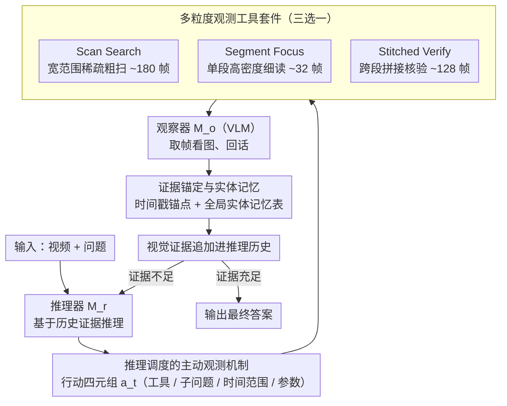

# LensWalk: Agentic Video Understanding by Planning How You See in Videos

**会议**: CVPR 2026  
**arXiv**: [2603.24558](https://arxiv.org/abs/2603.24558)  
**代码**: 无  
**领域**: 视频理解  
**关键词**: 视频智能体, 主动观测, 视觉语言模型, 长视频理解, 工具调用

## 一句话总结

提出LensWalk，一个让LLM推理器主动控制视频观测范围和采样密度的智能体框架，通过reason-plan-observe循环实现自适应视频理解，无需微调即可在长视频基准上带来5%以上的即插即用性能提升。

## 研究背景与动机

视频理解是计算机视觉的核心任务，但视频的密集时序性质给自动分析带来巨大挑战。现有视频理解方法面临一个根本矛盾：推理与感知之间存在断裂。

现有方法主要存在三类问题：(1) 单次前向方法将视频均匀采样为固定视觉上下文，容易遗漏关键事件或被冗余信息淹没；(2) 启发式关键帧选择方法虽更精细，但仍是一次性静态采样，无法随中间假设变化而调整；(3) 基于检索的智能体虽可动态获取信息，但操作的是预处理过的静态表征（如ASR转录、clip级caption），无法从源视频中按需生成新的观测。

核心矛盾：模型的推理过程应该驱动它"看什么"和"怎么看"，但现有管线将观测和推理割裂——观测在推理之前一次性完成，或受限于固定的预处理工件。本文的切入角度是借鉴人类的视觉认知策略：人类通过有目的的信息搜寻来应对信息过载，不断在宏观扫视和精细聚焦之间切换，并在过程中持续反思和校验。核心idea：让LLM推理器自主决定观测的时间范围和采样密度，将视频理解转化为主动的推理-计划-观测循环。

## 方法详解

### 整体框架

LensWalk要解决的是"推理和观测割裂"这件事：传统管线先把视频采样成固定的视觉上下文，再让模型一次性推理，模型没有机会根据自己推到一半的假设回头去"重新看一眼"。LensWalk把它改造成一个多轮闭环——推理器($M_r$)看着当前问题和手上已有的证据，先想清楚"接下来该看视频的哪一段、看多细、想确认什么"，把这个想法写成一个结构化的行动计划$a_t$；计划交给 VLM 观察器($M_o$)真正去视频里取帧、看图、回话；观察器吐出的视觉证据再追加进历史，喂给下一轮推理。如此 reason → plan → observe 循环往复，直到推理器认为证据足够、给出最终答案。为了让这个长循环不至于在"时间定位"和"人物指代"上跑偏，系统还在历史之外挂了时间戳锚点和一张全局实体记忆表做支撑。

### 关键设计

**1. 多粒度观测工具套件：让"怎么看"有三档不同的镜头**

如果只给智能体一种采样方式，它要么在长视频里漏掉关键事件，要么在该看细节时分辨率不够。LensWalk 于是提供三种互补的观测工具，对应"发现—聚焦—验证"三种认知动作。Scan Search 在一段很宽的时间范围内并行抽稀疏切片（每次约 180 帧）做粗扫，用来快速定位线索大概在哪；Segment Focus 锁定单个时间段做高密度采样（约 32 帧），把那一小段的细粒度动作、文字、物体看清楚；Stitched Verify 则把几个**不连续**时间段的帧拼进同一批次（约 128 帧），让观察器能跨段对比、做因果核验（比如"前面出现的那个人是不是后面摔倒的那个"）。三者各管一档粒度，组合起来覆盖了从全局搜索、局部细读到跨段整合的完整链条，而不是逼一种采样策略去同时满足相互冲突的需求。

> ⚠️ 三个工具的具体帧预算（180 / 32 / 128）以原文为准。

**2. 推理调度的主动观测机制：把观测计划写成可追踪的结构化动作**

光有工具还不够，关键是让推理器在每一步都能**显式**决定看哪里、怎么看，并且这个决定要能被后续步骤回溯。LensWalk 把每一轮的行动参数化成一个四元组

$$a_t = (o_t,\; q_t,\; \mathcal{I}_t,\; \rho_{o_t})$$

其中 $o_t$ 是选哪个观测工具，$q_t$ 是引导观察器的子问题，$\mathcal{I}_t$ 是要观测的时间范围，$\rho_{o_t}$ 是该工具特有的参数（如采样密度）。这等于把"推理状态 → 观测计划"做成了一次端到端映射：推理器想确认什么，就直接翻译成对视频的一次具体调度。更重要的是，这些带参数的计划会原样留在历史里，于是智能体能看见自己已经扫过哪些区间、哪些区间还没碰过，从而把后续的观测预算优先投到尚未探索的地方，而不是盲目重复。

**3. 证据锚定与实体记忆：让长循环里的"时间"和"人物"不漂移**

多轮推理最容易出两种错：一是答案说不清事件到底发生在第几秒，二是同一个人/物体在不同轮里被反复重新识别、甚至指代混乱。LensWalk 用两个机制兜底。时间戳锚点在观察器读帧时插入帧间时间标记，于是观察器的回话天然带着精确的时间引用，既让后续能据此再精确地回看那一段，也避免了"看到了但说不出在哪"。全局实体记忆表则独立挂在推理历史之外，专门记录各实体的属性和出现时间；这样跨轮时不必每次都从头辨认同一个对象，省掉重复识别的开销，也防止越来越长的历史上下文把实体指代搅乱。

### 一个完整示例：在一段长视频里回答"谁先离开了房间"

假设输入是一段几十分钟的会议录像，问题是"会议中第一个离开房间的人穿什么颜色的衣服"。LensWalk 大致会这样走一遍循环：

1. **第 1 轮（粗扫定位）**：推理器判断"先得找到有人起身离场的时刻"，发出 $a_1$＝(Scan Search, "有人起身走向门口的片段在哪", 整段 0–40min, 稀疏密度)。观察器在约 180 帧上粗扫，回话"约 18–22min 间门口有人活动"，并带回时间戳锚点。
2. **第 2 轮（聚焦细读）**：推理器据此发出 $a_2$＝(Segment Focus, "谁起身离开、穿什么颜色", 18–22min, 高密度)。观察器在约 32 帧上细看，回话"21:05 一名穿深蓝外套的男士走出房门"，该实体被写入全局实体记忆表。
3. **第 3 轮（跨段核验）**：为确认"第一个"，推理器要排除更早是否有人离场，发出 $a_3$＝(Stitched Verify, "0–18min 内是否还有人离开", 拼接 0–6 / 6–12 / 12–18min, 约 128 帧)。观察器跨段对比后确认更早没有离场事件。
4. **收束**：证据已闭环，推理器输出"深蓝色"。整个过程只对真正相关的区间做了高密度观测，峰值上下文远小于把全片均匀塞进模型。

可以看到，是推理器的中间假设在一步步驱动"看哪里、看多细"，而记忆表和时间锚点保证了三轮之间指的是同一个人、同一个时刻。

### 损失函数 / 训练策略

LensWalk 是无需训练的即插即用框架，不微调任何模型，推理器同时兼任实体记忆表的更新器。运行时智能体最多调用 20 次工具、每轮一次；Scan Search / Segment Focus / Stitched Verify 单次调用的帧预算分别约为 180 / 32 / 128（⚠️ 具体数值以原文为准）。

## 实验关键数据

### 主实验

| 数据集 | 指标 | 本文(最佳配置) | 之前SOTA | 提升 |
|--------|------|------|----------|------|
| LVBench | Accuracy | 68.6% (o3自身) | 60.8% (MR.Video) | +7.8% |
| VideoMME Long | Accuracy(w/o sub) | 71.4% (o3自身) | 67.3% (DVD) | +4.1% |
| LongVideoBench | Accuracy | 70.6% (o3自身) | 68.6% (DVD) | +2.0% |
| MMVU (MC) | Accuracy | 80.9% (o3/GPT-4.1) | 78.9% (o3) | +2.0% |
| Video-MMMU | Overall | 78.33% (o3自身) | 75.44% (o3) | +2.89% |
| EgoSchema | Val | 77.2% (o3/Qwen2.5-VL-72B) | 76.6% (DVD) | +0.6% |

### 消融实验

| 配置 | 关键指标(VideoMME Long) | 说明 |
|------|---------|------|
| 完整LensWalk (o3/GPT-4.1) | 70.0% | 基线 |
| 去掉Scan Search | 65.4% | 下降4.6%，定位线索最关键 |
| 去掉Stitched Verify | 66.8% | 下降3.2%，跨时间段整合重要 |
| 去掉Segment Focus | 68.1% | 下降1.9%，细粒度提取有贡献 |
| 无Timestamp Anchor | 69.4% | 下降0.6% |
| 无Subject Memory | 69.7% | 下降0.3% |

### 关键发现

- o3作为自我观测者（推理器和观察器为同一模型）时表现极好，LVBench上提升11.5%，VideoMME Long上提升6.7%，作为"免费午餐"
- 开源推理器Qwen3-235B-A22B对弱观察器（Qwen2.5-VL-7B提升4.3%）有效，但对强观察器（GPT-4.1仅+0.1%）帮助有限
- 智能体展现出六种行为模式：直接查询、渐进缩放、范围分割、策略反思、整合验证和静态重复
- 框架自适应分配观测预算：简单问题用少量帧快速解决，复杂问题投入更多观测轮次

## 亮点与洞察

- 将"如何观测"纳入推理循环的核心设计理念非常优雅，类比人类有目的的视觉搜索策略
- 无需微调的即插即用特性使其可以直接提升现有模型，工程价值很高
- 涌现出的多样化认知策略（渐进缩放、策略反思等）展示了智能体的自主推理能力
- Token消耗与单次前向方法相当，同时大幅降低了每轮峰值Token数，缓解了长上下文的内存压力

## 局限与展望

- 框架效果高度依赖推理器的认知能力——弱推理器可能生成无效的观测计划
- 仍存在少量"静态重复"行为（反复观测相同区域），虽然比例低但表明规划机制仍不完美
- 当前的观测工具仅适用于视觉模态，未利用音频、字幕等多模态信息
- 最大20次工具调用的限制在极端长视频场景下可能不够

## 相关工作与启发

- **vs Deep Video Discovery**: DVD通过预生成整个视频的caption来支持推理，消耗百万级Token；LensWalk按需观测，Token消耗近似单次前向方法，同时精度更高
- **vs MR.Video**: MR.Video依赖预处理的clip检索，观测粒度和范围固定不变；LensWalk可以动态调整观测的时间范围和采样密度
- **vs VideoAgent**: VideoAgent的工具仅操作预处理产物；LensWalk直接从源视频中调度新的观测
- **启发**: "可扩展的视觉认知"理念——不仅要扩大模型规模，还要让模型学会主动观测

## 评分

- 新颖性: ⭐⭐⭐⭐⭐ 将视频理解重新定义为主动观测调度问题，理念创新且实现优雅
- 实验充分度: ⭐⭐⭐⭐⭐ 6个基准、多种模型组合、详细消融和行为分析
- 写作质量: ⭐⭐⭐⭐⭐ 叙事流畅，原理阐述清晰，实验分析深入
- 价值: ⭐⭐⭐⭐⭐ 即插即用框架，可直接提升现有强模型，实用性极高

<!-- RELATED:START -->

## 相关论文

- [\[CVPR 2026\] Do You See What I Am Pointing At? Gesture-Based Egocentric Video Question Answering](do_you_see_what_i_am_pointing_at_gesture-based_egocentric_video_question_answeri.md)
- [\[CVPR 2026\] VideoARM: Agentic Reasoning over Hierarchical Memory for Long-Form Video Understanding](videoarm_agentic_reasoning_over_hierarchical_memory_for_long-form_video_understa.md)
- [\[CVPR 2026\] VideoChat-M1: Collaborative Policy Planning for Video Understanding via Multi-Agent Reinforcement Learning](videochatm1_collaborative_policy_planning_for_vide.md)
- [\[ICML 2026\] VideoTemp-o3: Harmonizing Temporal Grounding and Video Understanding in Agentic Thinking](../../ICML2026/video_understanding/videotemp-o3_harmonizing_temporal_grounding_and_video_understanding_in_agentic_t.md)
- [\[CVPR 2026\] How Should Video LLMs Output Time? An Analysis of Efficient Temporal Grounding Paradigms](how_should_video_llms_output_time.md)

<!-- RELATED:END -->
