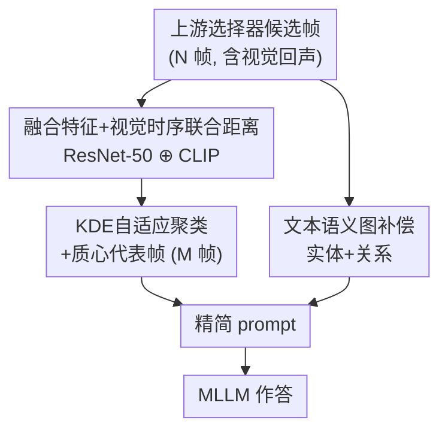

# Less is More: Token-Efficient Video-QA via Adaptive Frame-Pruning and Semantic Graph Integration

**会议**: CVPR 2026  
**arXiv**: [2508.03337](https://arxiv.org/abs/2508.03337)  
**代码**: https://github.com/shaoguangwang/Adaptive-Frame-Pruning (有)  
**领域**: 视频理解 / 多模态VLM / LLM效率  
**关键词**: Video-QA, 关键帧剪枝, 视觉冗余, 文本语义图, Token 效率

## 一句话总结
针对视频问答中关键帧选择器普遍产生的"视觉回声"（temporally-proximate 近重复帧），本文提出一个即插即用的精炼层：用自适应帧剪枝（AFP）把冗余帧聚类合并，再用一张轻量文本语义图补偿被剪掉的语义，最高把输入 token 砍掉 82.2% 的同时，常常还反过来提升上游选择器的准确率。

## 研究背景与动机

**领域现状**：把多模态大模型（MLLM）用到视频问答（Video-QA）上时，每帧都要吃掉大量视觉 token——按 OpenAI 计价，一张低清图就要 85 token，一小时视频 1 fps 采样有 3600 帧，远超上下文窗口。于是 **query-aware 关键帧选择**（AKS、T*、VSLS 等）成了主流预处理：先用一个选择器从海量帧里挑出 Top-K 候选，再喂给 MLLM。

**现有痛点**：作者发现即使是 SOTA 选择器，挑出来的关键帧里也充满了**时间邻近、视觉高度相似的近重复帧**——他们把这种视频特有的冗余命名为 **"visual echoes"（视觉回声）**。比如一个 32 帧的选择结果里，富士山、坐着的人、红色鸟居可能各自重复出现好几张几乎一样的帧。

**核心矛盾**：选择器为了**不漏掉**决定性瞬间（最大化 recall），被设计得偏"宁滥勿缺"，结果就是冗余。而过多的视觉信息会造成 **"context dilution"（上下文稀释）**：噪声淹没了 MLLM 的推理能力，出现"帧越多反而越差"的 **"less is more" 悖论**。论文实测：LongVideoBench 上 GPT-4o 用 8 帧时，精心设计的 AKS\* 居然（47.0%）略输给朴素均匀采样（47.1%）。

**本文目标**：把一组冗余、含噪的初始关键帧，精炼成一个**既视觉精简、又语义完整**的低 token prompt——拆成两个子问题：(1) 怎么去掉视觉回声；(2) 剪枝难免丢语义，怎么低成本补回来。

**切入角度**：视觉和文本的 token 成本是**非对称**的——剪掉一帧省 ~85 token，而补一段文字摘要只花几十 token。所以"剪视觉、补文本"在 token 账本上极其划算。

**核心 idea**：用自适应聚类**剪掉**视觉回声（AFP），再用一张几十 token 的文本语义图**补偿**被剪掉的实体与关系，做成一个对任意上游选择器都通用的精炼层。

## 方法详解

### 整体框架
方法是一个挂在任意上游选择器**之后**的精炼层，分**剪枝 + 补偿**两条并行支路。输入是上游选择器给出的 N 帧候选（含视觉回声），输出是一个精简后的 prompt 喂给 MLLM。剪枝支路（AFP）做三件事：抽融合特征 → 按"视觉+时序"联合距离做自适应聚类 → 每簇选一个质心代表帧，把 N 帧压到 M 帧（M ≪ N）。补偿支路并行地用一个纯文本 LLM 调用，只看问题和选项就生成一张实体-关系语义图。两路拼成最终 prompt。

### 关键设计

**1. 融合特征 + 视觉-时序联合距离：让"近重复"被精确识别**

要剪掉视觉回声，先得能度量两帧到底有多"像"。只看像素相似度容易把"画面像但时间隔很远"的两帧误判成回声；只看高层语义又会漏掉细节差异。AFP 因此给每帧抽两路特征：ResNet-50 负责低层视觉模式、CLIP ViT-B/32 负责高层语义，各自经线性投影到 512 维后做 L2 归一化加权融合：$\mathbf{f}_{\text{fused}}=(1-\alpha)\cdot\mathbf{f}_{\text{ResNet}}+\alpha\cdot\mathbf{f}_{\text{CLIP}}$（主实验 $\alpha=0.6$）。在此之上，两帧 $i,j$ 的距离再把**时间邻近**也算进去：$D(i,j)=\beta\cdot d_{\cos}(\mathbf{f}_i,\mathbf{f}_j)+(1-\beta)\cdot d_{\text{temp}}(t_i,t_j)$，其中 $d_{\cos}$ 是余弦距离、$d_{\text{temp}}$ 是归一化的时间戳差、$\beta=0.9$。这个设计保证只有**既视觉相似又时间邻近**的帧才会被判成同一个回声簇——视觉像但时间远的帧不会被错误合并，正好对上"视觉回声 = 时间邻近的近重复"这个定义

**2. KDE 自适应阈值聚类 + 质心代表帧：剪到几帧由视频自己决定**

不同视频的冗余程度天差地别，预设一个固定簇数（剪成固定 K 帧）必然要么剪过头要么没剪干净。AFP 用凝聚式层次聚类（Agglomerative Clustering），关键是阈值 $\tau$ **不写死**：对所有帧对的视觉距离 $d_{\cos}$ 做高斯核密度估计（KDE），找到密度分布的峰值（即这段视频里"最常见的帧间距离"），把 $\tau$ 设在峰值略上方。这样算法会按**这段视频自己的相似度结构**自然分组，剪枝强度随内容自适应。聚类后每簇要选一个代表帧——作者消融后选了 **centroid（质心）策略**：取簇内到其他帧平均视觉距离最小的那一帧 $k^*=\arg\min_{k_i\in C_j}\sum_{k_m\in C_j} d_{\cos}(\mathbf{f}_i,\mathbf{f}_m)$。质心帧最"居中"、最能代表整簇，且不依赖外部打分，让 AFP 能套在任何选择器后面。实测一组 32 帧常被合并到仅 3 帧

**3. 轻量文本语义图补偿：用几十 token 补回剪掉的语义**

剪枝再聪明也可能误删携带关键语义的帧，但要补就得补得便宜——这正是"剪视觉、补文本"非对称成本的用武之地。补偿支路用一个**纯文本** LLM 调用，**只**输入问题和选项（不看视频帧），生成一张文本语义图，干两件事：**实体锚定**（identify query 相关的物体/角色）和**关系脚手架**（给出它们之间逻辑/具体关系的显式摘要）。把这段结构化文本注入 prompt，相当于提前激活 MLLM 的推理路径，让它从精简后的视觉帧里做出更稳的推断。成本极小：refine 一组 AKS\* 的 32 帧时，AFP 先把视觉 token 从 ~2877 砍到 ~505，再注入语义图只多花 ~60 token，几乎可忽略。因为只处理 query+options 且围绕显式的实体/关系抽取，文本幻觉风险也被压住——人工审计实体准确率 98%

### 损失函数 / 训练策略
本方法是**无需训练**的推理期精炼层：ResNet-50 / CLIP 均为冻结预训练模型，聚类与 KDE 是无参数算法，语义图由现成 LLM 一次文本调用生成。唯二超参 $\alpha=0.6$（融合比）、$\beta=0.9$（距离权重）经敏感性分析确定，二者在性能与效率间存在明显 trade-off。

## 实验关键数据

数据集：LongVideoBench、VideoMME 两个长视频 QA benchmark；MLLM 覆盖 GPT-4o、Qwen2.5-VL-7B、LLaVA-Video-7B。主实验上游选择器为 AKS\*（把原 AKS 的动态采样换成按 BLIP 相关性打分取 Top-K，保证帧预算恒定）。Token 成本按 $\overline{T}=\frac{1}{N}\sum_i (T_i^{\text{text}}+85\cdot F_i)$ 估计。

### 主实验
LongVideoBench，从 AKS\* Top-32 关键帧出发，准确率（%）按视频长度分 Long/Medium/Short；Avg.Frames 是实际平均用帧数：

| 模型 + 方法 | Avg.帧 | Long | Medium | Short |
|------|------|------|------|------|
| GPT-4o + Uniform | 32.0 | 50.6 | 53.5 | 74.0 |
| GPT-4o + AKS\* | 32.0 | 47.0 | 49.2 | 58.0 |
| **GPT-4o + AFP+Graph** | **4.1** | 49.1 | 53.5 | **84.0** |
| LLaVA-Video-7B + Uniform | 32.0 | 41.7 | 46.2 | 40.0 |
| LLaVA-Video-7B + AKS\* | 32.0 | 43.5 | 46.5 | 50.0 |
| **LLaVA-Video-7B + AFP+Graph** | **4.1** | **45.2** | **53.8** | **64.0** |

要点：本方法只用 **4.1 帧**（省 ~74% 帧）就在多数列上追平甚至反超用 32 帧的基线；开源模型获益最大——LLaVA-Video-7B 短视频从 AKS\* 的 50.0% 提到 **64.0%（+14 分）**，说明开源模型对上下文稀释尤其敏感。Token 上，LongVideoBench Top-32 从 AKS\* 的 **2877 降到 568**，5× 以上削减；整体最高省 **82.2%** token。跨选择器同样有效：把 T\* refine 后，VideoMME Top-32 短视频 **+13.4 分**（平均 4.1 帧）。

### 消融实验
组件级消融（GPT-4o，LongVideoBench，从 AKS\* Top-32 出发，匹配帧预算）：

| 配置 | Avg.帧 | Avg.Tok | Long | Med | Short | 说明 |
|------|------|------|------|------|------|------|
| Text Only | 0.0 | 157.05 | 42.9 | 45.8 | 48.0 | 仅文本、无视觉 |
| Graph Only | 0.0 | 219.48 | 47.0 | 53.5 | 82.0 | 仅语义图、无帧 |
| Uniform (M) | 4.1 | 505.21 | 47.0 | 47.7 | 66.0 | 同帧预算均匀采样 |
| AKS\* (Top-N, M) | 4.1 | 505.21 | 43.5 | 45.8 | 62.0 | 直接截断 Top-M |
| AFP only | 4.1 | 505.21 | 47.9 | 45.8 | 64.0 | 只剪枝、不补图 |
| **AFP + Graph** | 4.1 | 567.64 | **49.1** | **53.5** | **84.0** | 完整方法 |

### 关键发现
- **AFP 和 Graph 互补缺一不可**：AFP only 把 Long 提到 47.9% 但 Medium 仍 45.8%；补上语义图后 Medium 跳到 53.5%、Short 到 84.0%——语义补偿主要救回了那些被剪枝丢掉的关系线索。
- **"less is more" 悖论被实证**：8 帧 GPT-4o 上 AKS\*（47.0%）反输给均匀采样（47.1%），印证了高 recall 选择器制造的视觉回声确实在稀释上下文。
- **冗余被实打实压下去**：作者用 Average Maximum Similarity（AMS，越高越冗余）量化，AKS\* 的 AMS 0.950 被压到 0.826（LongVideoBench）、0.936→0.802（VideoMME）；VSLS\*、T\* 也都从 >0.93 降到 0.74~0.80。
- **事件密集场景稳健**：在动态的 Video-HOLMES 上仍有 +3.47% 提升。

## 亮点与洞察
- **"visual echoes" 这个命名抓得准**：它把"视频关键帧选择天然带时间冗余"这个被忽视的问题显式化，并和"context dilution""less is more 悖论"串成一条因果链，问题定义本身就是贡献。
- **非对称 token 成本是整个设计的支点**：剪一帧省 85 token、补一段文字只花 ~60 token——"剪视觉补文本"在账本上稳赚，这个洞察可迁移到任何"视觉密集但文本廉价"的多模态压缩场景。
- **纯文本生成语义图规避幻觉**：语义图只看 query+options、围绕显式实体/关系抽取，既省 token 又把幻觉压到实体准确率 98%，比上来就上 GNN/scene graph 的重方案优雅得多。
- **即插即用、训练-free**：作为通用精炼层套在 AKS\*/T\*/VSLS\* 之后都涨点，工程落地门槛极低。

## 局限与展望
- **依赖上游选择器质量**：本方法是精炼层，若上游 Top-K 根本没召回决定性帧，剪枝再好也无米下锅——它治冗余不治漏召回。
- **语义图"盲生成"的风险**：语义图只看问题和选项、不看任何视觉内容，对于答案高度依赖画面细节、文字描述无从猜起的问题，补偿可能落空（论文未深究这种 failure case）。
- **超参 $\alpha,\beta$ 跨数据集可迁移性存疑**：$\alpha=0.6,\beta=0.9$ 由敏感性分析定，是否对所有视频类型/选择器都最优，正文未给跨域稳健性证据（⚠️ 细节在 supplementary，正文仅一句带过）。
- **改进思路**：可让语义图条件化于剪枝后的帧（看图再补语义）、或把 KDE 阈值进一步 query-aware 化，按问题难度动态调剪枝强度。

## 相关工作与启发
- **vs AKS / T\* / VSLS（关键帧选择器）**：它们解决"从海量帧里选哪些"，偏高 recall 因而留冗余；本文不替代它们，而是做一个**下游精炼层**专治它们留下的视觉回声，二者正交互补。
- **vs TRIM（帧内 patch 级 token 缩减）**：TRIM 在单帧内部剪 patch token，本文在**帧级**整帧合并冗余，粒度不同、可叠加。
- **vs scene graph / CROSS（结构化语义表示）**：经典 scene graph 要靠 GNN 推理、CROSS 建模动态时序文本图，都偏重；本文用**纯文本、注入 prompt** 的轻量语义图，无需专用 GNN，主打最大 token 效率与对 MLLM 的兼容性。

## 评分
- 新颖性: ⭐⭐⭐⭐ 把"视觉回声"显式化并用"剪视觉+补文本"的非对称成本观巧解，问题定义和方案都新
- 实验充分度: ⭐⭐⭐⭐ 两 benchmark × 三 MLLM × 多选择器，组件消融与 AMS 冗余量化都到位，部分跨选择器结果压在 supplementary
- 写作质量: ⭐⭐⭐⭐ 概念命名清晰、动机链条完整、图表自洽
- 价值: ⭐⭐⭐⭐ 即插即用、训练-free，最高省 82.2% token 还常涨点，落地价值高

<!-- RELATED:START -->

## 相关论文

- [\[CVPR 2026\] UTPTrack: Towards Simple and Unified Token Pruning for Visual Tracking](utptrack_towards_simple_and_unified_token_pruning_for_visual_tracking.md)
- [\[CVPR 2026\] GIFT: Global Irreplaceability Frame Targeting for Efficient Video Understanding](gift_global_irreplaceability_frame_targeting_for_efficient_video_understanding.md)
- [\[CVPR 2026\] Efficient Frame Selection for Long Video Understanding via Reinforcement Learning](efficient_frame_selection_for_long_video_understanding_via_reinforcement_learnin.md)
- [\[CVPR 2026\] An Efficient Token Compression Framework for Visual Object Tracking](an_efficient_token_compression_framework_for_visual_object_tracking.md)
- [\[CVPR 2026\] HERBench: A Benchmark for Multi-Evidence Integration in Video Question Answering](herbench_a_benchmark_for_multi-evidence_integration_in_video_question_answering.md)

<!-- RELATED:END -->
