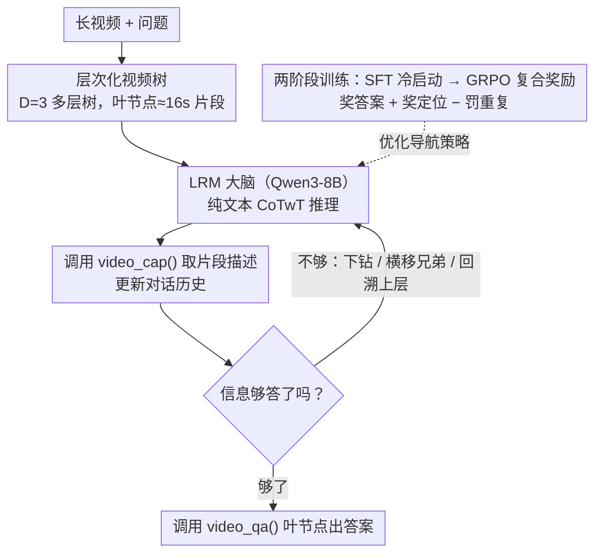

<!-- 由 src/gen_stubs.py 自动生成 -->
# LongVideo-R1: Smart Navigation for Low-cost Long Video Understanding

**会议**: CVPR2026  
**arXiv**: [2602.20913](https://arxiv.org/abs/2602.20913)  
**代码**: [qiujihao19/LongVideo-R1](https://github.com/qiujihao19/LongVideo-R1)  
**领域**: 视频理解  
**关键词**: 长视频理解, 智能导航, 多模态Agent, 层次化推理, 强化学习, Chain-of-Thought

## 一句话总结

提出 LongVideo-R1，一个配备推理能力的多模态 Agent，通过层次化视频树结构和智能导航策略，以平均仅 10.5 轮工具调用实现高效长视频问答，在精度-效率权衡上显著优于穷举式方法。

## 背景与动机

1. **长视频理解的计算瓶颈**：当前 MLLM 受限于有限上下文窗口，无法直接处理 1-2 小时的长视频，只能依赖暴力管线（切片→逐段处理→汇总），计算开销随视频时长线性增长
2. **现有方法效率低下**：Ego-R1、VideoTree 等方法虽然准确率不错，但需要穷举处理所有或大量视频片段（如 Ego-R1 每 30 秒做一次 caption，平均需要 86 个 caption 段），延迟高昂
3. **实际部署受限**：高计算成本严重制约了长视频 MLLM 在具身 Agent（需低延迟响应）和高吞吐视频聊天服务等真实场景的落地
4. **精度-效率权衡被忽视**：现有工作几乎只优化 QA 准确率，缺乏对计算预算的形式化度量和优化
5. **人类搜索策略的启发**：人类理解长视频时并非逐帧观看，而是先看整体概要、再根据问题定向"钻进"感兴趣的片段——这种主动、目标导向的策略远比穷举高效
6. **大推理模型的成熟**：LRM（如 Qwen3-8B）和 CoT 推理范式为训练能自主判断"何时停、往哪看"的 Agent 提供了技术基础

## 方法详解

### 整体框架

LongVideo-R1 要解决的是长视频理解的算力痛点：暴力管线把整段视频切片逐段处理，开销随时长线性爆炸。它换成「像人一样先看概要、再定向钻进感兴趣片段」的主动导航——把长视频组织成深度 $D=3$ 的多层树，每个非叶节点有 $K = \text{round}(\sqrt[D]{T/16s})$ 个子节点，叶节点对应约 16 秒短片段。一个 LRM（Qwen3-8B 微调）作为大脑，配两个多模态工具做 Chain-of-Thought-with-Tool（CoTwT）推理，在「取描述 → 判断信息够不够 → 不够就导航到下一片段」的闭环里迭代，平均只需约 10.5 轮调用就能答完一题。

### 关键设计

**1. 层次化视频树：把「逐段扫描」换成「按需下钻」的导航空间**

线性扫描之所以贵，是因为它不分主次地处理每一段。LongVideo-R1 先把视频建成树：深度 $D=3$、每个非叶节点 $K = \text{round}(\sqrt[D]{T/16s})$ 个子节点、叶节点约 16 秒。这棵树给 Agent 提供了一个「从根到叶逐层细化」的导航空间——它可以先在根节点看全局概要，再只朝相关分支下钻，而不必碰那些明显无关的片段，计算量因此从线性扫描降到十几轮导航。

**2. 纯文本 CoTwT + 两个多模态工具：让 LRM 专心规划，把看视频外包出去**

要让一个文本推理模型驾驭视频，得把「看」和「想」解耦。LongVideo-R1 给 LRM 配两个工具：`video_cap()` 接收任意层级片段、输出文本描述（Qwen2.5-VL-72B 生成），用来取全局/局部上下文；`video_qa()` 只在叶节点调用（Qwen2.5-VL-32B 执行），针对具体问题给最终答案。整个推理过程只在纯文本上进行，多模态部分作为外部函数调用，于是 LRM 可以心无旁骛地规划「何时停、往哪看」。

**3. GRPO 复合奖励：同时奖准答案、奖精准定位、罚重复探索**

只奖最终答案对错，模型学不会「高效」地找证据。GRPO 阶段用一个复合奖励 $$R = w_{\text{ans}} \cdot r_{\text{ans}} + w_{\text{loc}} \cdot r_{\text{loc}} + w_{\text{repeat}} \cdot r_{\text{repeat}}$$ 来塑形导航：$r_{\text{ans}}$ 答对为 1、否则 0；$r_{\text{loc}}$ 用 F1 衡量模型访问的时间段与 GT 关键段的覆盖率和精确率，既鼓励命中又惩罚冗余；$r_{\text{repeat}}$ 专罚重复访问同一片段。消融显示去掉 $r_{\text{loc}}$ 会掉 4.2% AUC，定位奖励是效率的关键来源。

### 一个完整示例

给定一段长视频和一个问题，Agent 这样走：先从根节点（整段视频）拿到顶层 caption；LRM 据当前累积上下文推理，判断信息够不够答；不够就决定下一步导航方向——向下钻入子片段、横向遍历兄弟节点、或回溯上层重新定位；调用 `video_cap()` 取目标片段描述、更新对话历史；如此重复，直到 LRM 认为信息充足才调用 `video_qa()` 出答案，或触顶最大轮次。整段过程平均约 10.5 轮（对比 Ego-R1 每 30 秒做一次 caption、平均 86 段），算力只有它的约 1/8。

### 损失函数 / 训练策略

数据上，基于 CG-Bench（含 clue-grounded 标注）的 800 视频、5.6K QA，用 Qwen2.5-VL-72B 预提各层 caption（256/128/64/32 帧采样），再用 GPT-5 零样本生成 CoTwT 轨迹、失败时借 clue-grounded 标注逐级提示，最终 5.6K 轨迹（平均 5.8 步）展开成约 33K 条 SFT 样本。训练分两阶段：先 SFT 冷启动，在 Qwen3-8B 上微调 3 epoch，学 `<think>...</think>` + `<tool>...</tool>` + `<answer>...</answer>` 的结构化格式；再 GRPO 强化学习 2 epoch，用上面的复合奖励优化导航策略。

## 实验关键数据

### 主要结果

| 基准 | LongVideo-R1 | LongVideo-R1 (new) | 最佳对比方法 |
|------|-------------|-------------------|-------------|
| LVBench 总体 | 50.0% | **60.7%** | AdaReTake-72B: 53.3% |
| LVBench-TG（时序定位）| **56.4%** | 62.7% | AdaReTake-72B: 45.5% |
| LVBench-KIR（关键信息检索）| 56.4% | **70.1%** | AdaReTake-72B: 62.2% |
| MLVU | 68.1% | **71.3%** | VideoChat-Flash-7B: 74.7% |
| Video-MME-Long (w/ sub) | 64.4% | **68.6%** | Ego-R1: 64.9% |

- 在 LVBench 上，8B 模型 LongVideo-R1 超越 GPT-4o（48.9%）和 GLM-4V-plus（48.7%）
- **时序定位（TG）子任务达 56.4%，领先第二名 10.9 个百分点**
- 升级 caption 工具为 Qwen3-VL-32B-Instruct 后，总体准确率提升至 60.7%

### 效率对比

| 指标 | LongVideo-R1 | Ego-R1 |
|------|-------------|--------|
| Video-MME 平均 caption 段数 | **10.5 轮** | 86 段 |
| LVBench 每题耗时 | **~3 分钟** | 显著更长 |

### 消融实验

| 消融项 | LVBench | Video-MME/L |
|--------|---------|-------------|
| SFT only (10K) | 39.1% | 57.7% |
| SFT only (full 33K) | 41.6% | 59.2% |
| + RL (10K data) | 47.4% | 60.2% |
| + RL (full data, 完整模型) | **50.0%** | **64.4%** |
| 去掉 $r_{\text{loc}}$ | 45.8% | 61.4% |

- SFT 数据量从 10K→33K：LVBench +2.5%；加 RL 后 +8.4%
- 定位奖励 $r_{\text{loc}}$ 贡献：LVBench +4.2%，Video-MME +3.0%
- 最大轮次从 10→30：LVBench 43.0%→50.0%，但耗时从 104s→176s

## 亮点

1. **问题定义有价值**：首次形式化"低计算预算下的长视频理解"问题，提出精度-效率 Pareto 最优的研究方向
2. **设计直觉优雅**：层次化视频树 + 主动推理导航，模拟人类"先整体后局部"的视频理解策略
3. **效率优势显著**：平均 10.5 轮即可完成 QA，仅为 Ego-R1 的 ~1/8 计算量，且在精度上持平或更优
4. **超长视频能力**：在数十小时级电视剧上仍能以 10-20 轮完成 QA，线性扫描方法在此场景下不可行
5. **数据构建策略巧妙**：利用 CG-Bench 的 grounding 标注逐级提示 GPT-5，在保证正确性的同时最小化 hint 泄露
6. **全开源**：LRM 基于 Qwen3-8B，工具基于 Qwen2.5-VL 系列，完全可本地部署

## 局限与展望

1. **均匀切分非最优**：视频树采用等长分割，语义相似内容可能落入相邻子片段，增加定位歧义
2. **工具种类单一**：仅有 caption 和 QA 两个工具，缺少实例识别、片段分割等细粒度工具
3. **对全局性问题不占优**：MLVU（含短视频）和 Video-MME（含"视频主旨"类全局问题）上不如均匀采样方法，因为这类问题不需要精准定位
4. **导航可能被误导**：LRM 有时被语义相关但无关的片段"吸引"而陷入错误区域，需人工 hint 才能修正
5. **单问题假设**：假设每个 QA 独立处理，未考虑多问题共享视频索引以分摊开头开销的场景
6. **caption 质量依赖**：框架性能高度依赖视频描述工具的质量，描述不准确会导致推理错误传播

## 相关工作对比

| 方法 | 类型 | LVBench | 计算方式 | 局限 |
|------|------|---------|---------|------|
| VideoAgent | Agent | 29.3% | 穷举+GPT | 准确率低 |
| VideoTree | Agent | 28.8% | 树形穷举 | 线性复杂度 |
| MemVid | Agent | 44.4% | 记忆增强 | 部分子任务弱 |
| Ego-R1 | Agent+RL | ~64.9%(VME) | 每30s caption | 高计算成本 |
| AdaReTake-72B | MLLM | 53.3% | 自适应采样 | 72B大模型 |
| **LongVideo-R1** | **Agent+RL** | **50.0%** | **~10轮导航** | **全局问题弱** |

## 评分

- 新颖性: ⭐⭐⭐⭐ — "低成本长视频理解"的问题定义和层次化主动导航框架有明确新意
- 实验充分度: ⭐⭐⭐⭐ — 三个主流 benchmark + 超长视频案例 + 多维消融（数据量/奖励/工具规模/最大轮次）
- 写作质量: ⭐⭐⭐⭐ — 动机清晰、方法描述完整、算法伪代码规范
- 价值: ⭐⭐⭐⭐⭐ — 解决了长视频 Agent 最核心的效率痛点，开源可复现，对实际部署有直接意义

<!-- RELATED:START -->

## 相关论文

- [\[CVPR 2026\] Toward Low-Cost yet Effective Temporal Learning for UAV Tracking](toward_low-cost_yet_effective_temporal_learning_for_uav_tracking.md)
- [\[CVPR 2026\] Efficient Frame Selection for Long Video Understanding via Reinforcement Learning](efficient_frame_selection_for_long_video_understanding_via_reinforcement_learnin.md)
- [\[CVPR 2026\] Dual-Agent Reinforcement Learning for Adaptive and Cost-Aware Visual-Inertial Odometry](dual-agent_reinforcement_learning_for_adaptive_and_cost-aware_visual-inertial_od.md)
- [\[CVPR 2026\] Thinking with Drafts: Speculative Temporal Reasoning for Efficient Long Video Understanding](thinking_with_drafts_speculative_temporal_reasoning_for_efficient_long_video_und.md)
- [\[CVPR 2026\] Video Panels for Long Video Understanding](video_panels_for_long_video_understanding.md)

<!-- RELATED:END -->
