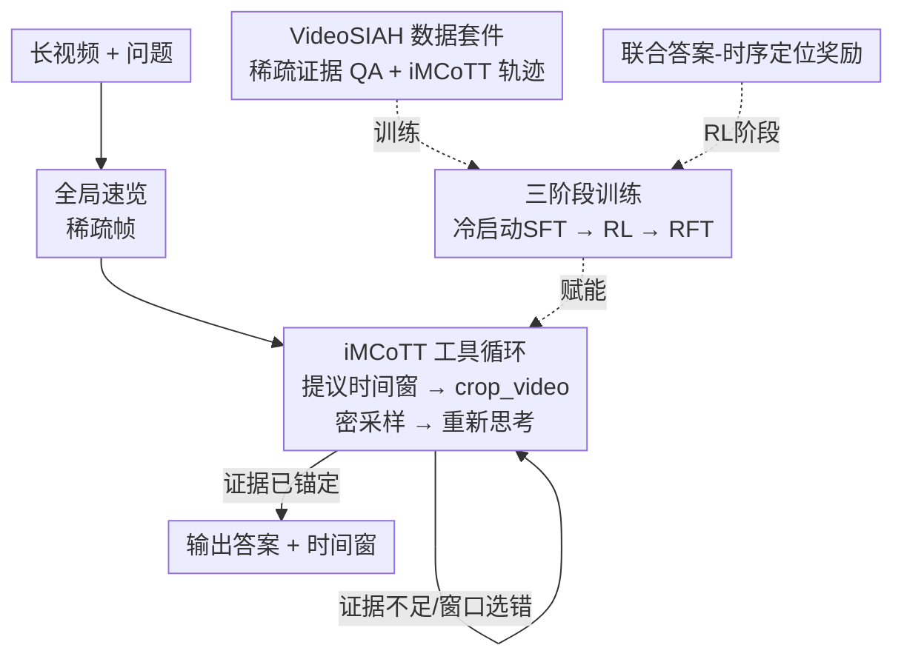

# LongVT: Incentivizing "Thinking with Long Videos" via Native Tool Calling

**会议**: CVPR2026  
**arXiv**: [2511.20785](https://arxiv.org/abs/2511.20785)  
**代码**: https://github.com/EvolvingLMMs-Lab/LongVT  
**领域**: 视频理解 / 多模态VLM / LLM推理  
**关键词**: 长视频推理、智能体、工具调用、时序定位、强化学习  

## 一句话总结
LongVT 让多模态大模型像人一样"先全局速览、再放大可疑片段"地看长视频——把模型自带的时序定位能力封装成一个原生的 `crop_video` 工具，在推理链中交错调用、反复"再看一眼"以纠错，并配套自建的 VideoSIAH 数据套件与三阶段训练，在四个长视频基准上刷新开源 SOTA。

## 研究背景与动机
**领域现状**：当前主流的视频推理走的是 R1 范式——先用文本思维链（CoT）做监督微调，再用 GRPO 做强化学习。模型对几十秒的短片段表现不错，但面对超过 15 分钟、上千帧的长视频就力不从心。

**现有痛点**：两个硬伤。其一，整条推理是"语言中心"的——模型在文本里反复改写、自说自话，并不真正回去看画面，于是在长视频里幻觉严重；其二，对长视频普遍采用均匀采样（uniform sampling），稀疏的帧很容易错过那个决定答案的关键瞬间，而证据恰恰是稀疏且时间上分散的。

**核心矛盾**：长视频推理的本质难点是 "Video Segment-In-A-Haystack"——决定性证据藏在数小时素材里一个很窄的时间窗内。但模型的上下文长度有限，不可能逐帧细看；均匀稀疏采样又看不清细节。"看得全"和"看得清"之间存在根本冲突。

**本文目标**：让 LMM 能像人类做"无声足球录像找进球用哪只脚"那样，自己决定跳着粗看哪里、放大细看哪里，把推理的每一步都锚定在"真正看到的画面"上。这又分解为三个能力：提出精确时间窗、对窗内密采样帧做推理、窗口选错时自我纠正。

**切入角度**：作者观察到，人理解长视频是"先粗略跳看找强信号（人群欢呼、球员庆祝、记分牌变化），再回退细看锁定瞬间"。把这个 global-to-local 策略投射到 LMM 上，正好能让有限上下文处理超长视频。更巧的是，LMM 本身就有时序定位（temporal grounding）的潜在能力，不需要外挂专家模型或检索器。

**核心 idea**：把模型自带的时序定位能力激活成一个**原生**的视频裁剪工具，让推理链交错地"提议时间窗→拉取片段→重新思考→决定改窗还是回答"，形成 global-to-local 的闭环——即交错式多模态工具思维链（iMCoTT）。

## 方法详解

### 整体框架
LongVT 是一个端到端的智能体框架。给定一段长视频和一个开放式问题，模型先对全局稀疏帧做一次"速览"，在推理过程中自主调用 `crop_video(start_time, end_time)` 工具：它根据当前理解提议一个时间窗，主动把该窗口内的视频以更细的帧率重新采样回来，基于新证据"再想一遍"，再判断是该继续收窄窗口、还是已有把握直接作答。这个 global-to-local 的"假设—验证"循环一直持续到答案被检索到的视觉证据所支撑为止。

要让一个原本只会写文本 CoT 的基座（Qwen2.5-VL-7B）学会这套行为，需要两根支柱：一是自建的 **VideoSIAH** 数据套件（提供工具增强的推理轨迹与稀疏证据 QA），二是**三阶段训练**（冷启动 SFT → 智能体 RL → RFT），其中 RL 阶段用一个**联合答案-时序定位奖励**把"答对"和"找准时间"绑在一起优化。

### 关键设计

**1. iMCoTT：把时序定位变成原生 crop_video 工具，让推理"回去看画面"而非空想**

针对"文本中心 CoT 在长视频里光改写不看画面、幻觉严重"这个痛点，作者设计了交错式多模态工具思维链（interleaved Multimodal Chain-of-Tool-Thought）。与传统纯文本 CoT 不同，iMCoTT 在推理流中插入对 `crop_video(start_time, end_time)` 的调用：模型先全局预览，提议一个时间窗，主动把该片段以更细帧率重采样回来，基于新看到的帧重新思考，再决定是收窄重试还是作答。关键在于这个工具不是外挂的检索器或专家模型，而是**激活模型自身潜在的时序定位能力**——通过工具集成微调把这种能力"唤醒"。这样每一步推理都锚定在"实际看到的内容"上，而不是在文本里盲目复述，因此能显著抑制幻觉，并自然涌现出类人的自我反思："意识到一开始看的片段不对，就回头再看"

**2. VideoSIAH：为"稀疏证据长视频推理"量身造一套数据，并按视频长度自适应生成多轮工具轨迹**

开源社区缺乏这类细粒度数据——现有工具增强 LMM 多用粗粒度、片段级数据训练，且多数视频基准只有多选题，不靠真正的时序定位也能蒙对、还容易被数据泄漏走捷径。作者用一条半自动、带人工核验（human-in-the-loop）的流水线构建 VideoSIAH：先用确定性的像素级场景检测切分长视频、合并短于 10 秒的片段得到语义稳定单元，再由 Qwen2.5-VL-72B 给每段生成详细描述作为 QA 生成的语义基础，随后经"文本 QA 过滤（去答案泄漏）+ 多模态 QA 过滤（GLM-4.5V 核对答案与画面一致）"两道筛，最后生成 iMCoTT 轨迹。一个巧妙之处是**多轮采样概率随视频长度自适应**：

$$P_{\text{multi}}=1-\frac{L_{\max}-\operatorname{clip}(L_{\text{video}},L_{\min},L_{\max})}{L_{\max}-L_{\min}}$$

其中 $L_{\text{video}}$ 是视频时长，$L_{\min}/L_{\max}$ 为长度阈值。视频越长，被选去做多轮工具调用生成的概率越高，从而让长视频获得成比例更多的工具调用轮次、提高时序覆盖率。最终套件含约 247.9K 工具集成冷启动 SFT 样本、1.6K RL 样本、15.4K RFT 样本，以及一个经人工核验的 652 条 QA 评测基准 VideoSIAH-Eval（平均时长约 1688 秒）。

**3. 三阶段闭环训练：冷启动 SFT 立地基、RL 学探索、RFT 自蒸馏稳行为**

作者发现直接拿 Qwen2.5-VL-7B 跑 RL 会**不升反崩**——基座的两大缺陷（定位不准、整合工具输出的推理能力不足）使原生工具调用能力太弱，无法直接 RL。于是设计三阶段：①**冷启动 SFT** 教会模型三件基本功——提议精确时间窗、对窗内密采样帧推理、窗口次优时自我纠正；②**智能体 RL**（GRPO）把模型当作"决定何时看、裁多长、如何整合证据"的工具使用智能体，提升开放式 QA 的泛化；③**智能体 RFT** 把早期 RL 轨迹中"答对且时序定位准"的高质量片段筛出来，作为自蒸馏的特权示范回灌进监督训练，稳住 RL 学到的智能体行为、巩固细粒度定位与多步推理。三个阶段层层递进、互补，RFT 让策略突破纯 SFT 的性能天花板

**4. 联合答案-时序定位奖励：把"答对"和"找准时间"绑成一个奖励，而非各管各的**

以往工作要么只奖励答案正确、要么只奖励时间对齐，二者割裂。本文在 RL 阶段把三部分统一进一个奖励：对第 $k$ 条 rollout，**答案准确度** $R_{\text{acc}}^{(k)}$ 用 LLM-as-a-Judge 给出三档判定（完全一致 F=1、部分一致 P=0.5、不一致 I=0），因为开放式 QA 无法用规则匹配可靠评判；**格式合规** $R_{\text{format}}^{(k)}$ 输出符合 schema 则为 1；**时序重叠** $R_{\text{time}}^{(k)}=\text{IoU}^{(k)}$ 直接用预测时间窗 $[t_s,t_e]$ 与真值 $[t_s',t_e']$ 的时序 IoU。总奖励 $R^{(k)}=R_{\text{acc}}^{(k)}+R_{\text{format}}^{(k)}+R_{\text{time}}^{(k)}$。这种耦合把"答案选择"绑到"证据在时间轴上的位置"，既提升最终答案正确率，又促使推理时更有效地用工具、给出更可靠精确的时间戳。作者还验证：若改用 Recall 做时序奖励会引发 reward hacking——策略只要把预测窗放大到包住真值就能单调刷高 Recall 却无视边界质量，故选用 IoU 这种对边界更"较真"的奖励

### 一个完整示例
以论文开篇的"无声足球录像，法国球员用哪只脚打进扳平球？"为例走一遍 iMCoTT：模型先对整段比赛做全局速览，粗看找强信号（人群欢呼、球员庆祝、记分牌更新）→ 提议一个疑似进球时段，调用 `crop_video` 把该窗口密采样回来 → 细看发现这一段确有庆祝但看不清触球脚，于是"再看一眼"，回退并收窄时间窗、重采样近景帧 → 锁定触球瞬间、确认是哪只脚 → 证据充分，作答。整个过程模型自己决定跳看哪里、放大哪里，每一步都锚在看到的帧上。

## 实验关键数据

### 主实验
基座统一为 Qwen2.5-VL-7B，在四个长视频基准上评测（密集采样下取 512/768 帧较优者）。下表为密集帧采样设置下的对比（Average 为综合分）：

| 模型 | VideoMME(w/sub) | VideoMMMU(perception) | LVBench | VideoSIAH-Eval | Average |
|------|------|------|------|------|------|
| Qwen2.5-VL-7B（基座） | 64.3 | 54.7 | 40.9 | 33.8 | 46.0 |
| Video-Thinker-7B | 60.8 | 55.3 | 54.3 | 6.6 | 42.9 |
| VideoRFT-7B | 49.2 | 48.7 | 18.7 | 26.9 | 37.0 |
| **LongVT-7B-SFT** | 64.9 | 49.7 | 41.1 | 34.8 | 44.1 |
| **LongVT-7B-RL** | 66.1 | 56.3 | 41.4 | 35.9 | 46.6 |
| **LongVT-7B-RFT** | **67.0** | **56.7** | 41.3 | **42.0** | **47.7** |

在最能体现"稀疏证据检索"的 VideoSIAH-Eval 上，LongVT-7B-RFT 达 42.0，比次优模型高出 6 分；综合分 47.7 创开源 SOTA，且与 GPT-4o（约 51.5）的平均差距收窄到约 4 分。作者还指出多轮工具交互**不增加推理延迟**，因避免了幻觉驱动的冗长生成，甚至可能比单轮基线更快。

### 消融实验
| 配置 | VideoSIAH-Eval | Average | 说明 |
|------|------|------|------|
| SFT w/o 自建 iMCoTT | 4.1 | 24.8 | 去掉工具轨迹，长视频理解大幅崩塌 |
| SFT w/ 自建 iMCoTT (LongVT-SFT) | 34.8 | 44.1 | 完整 SFT |
| RL w/o 自建 QA | 30.8 | 40.4 | 去掉稀疏证据 QA，定位与工具使用变弱 |
| RL only（无 SFT 冷启动） | 28.2 | 41.9 | 直接 RL，定位差 |
| SFT+RL (LongVT-RL) | 35.9 | 46.6 | 冷启动后 RL 稳步提升 |
| SFT+RL+RFT (LongVT-RFT) | 42.0 | 47.7 | RFT 突破 SFT 天花板 |

时序奖励选择（Charades-STA，mIoU）：RL w/o 解耦奖励 21.2 → Recall 奖励 21.6 → **IoU 奖励 27.2**，印证 IoU 对边界更严、Recall 易被"放大窗口"hack。

### 关键发现
- **自建细粒度数据是命脉**：SFT 去掉 iMCoTT 后 VideoSIAH-Eval 从 34.8 暴跌到 4.1，说明工具增强轨迹提供了"假设如何形成/验证/修正"这一以往缺失的监督信号。
- **冷启动 SFT 不可省**：直接对基座做 RL 会崩溃（基座工具调用能力太弱），SFT 先把地基打好，RL 才能稳步涨。
- **RFT 提供突破天花板的密集监督**：用自蒸馏的高质量轨迹（答对且 IoU≥0.3）回灌，让 VideoSIAH-Eval 再从 35.9 提到 42.0。
- **奖励要"较真边界"**：Recall 奖励会被策略钻空子（把窗放大包住真值刷分），IoU 奖励才逼出精确定位。

## 亮点与洞察
- **把"工具"变成模型的原生能力而非外挂**：crop_video 复用的是 LMM 自带的时序定位潜能，靠工具集成微调激活，不需要外部检索器或专家模型——这让"看哪里"和"怎么推理"统一在同一个模型里闭环。
- **数据生成的长度自适应概率很巧**：用 $P_{\text{multi}}$ 让越长的视频获得越多多轮工具轨迹，精准地把监督预算花在最需要多轮检索的样本上，可迁移到任何"难度随输入规模增长"的数据构造。
- **联合奖励的耦合思想**："答对"绑"找准时间"，避免模型在两个割裂目标间投机；并通过对比 Recall vs IoU 实证暴露了 reward hacking，是奖励设计的好案例。
- **三阶段闭环（SFT→RL→RFT）自蒸馏**：把 RL 自己跑出的好轨迹回灌成监督数据，是一种低成本突破 SFT 上限的范式，可推广到其他智能体训练。

## 局限与展望
- **依赖基座的时序定位潜能**：方法假设基座"本就有"可被激活的 grounding 能力；若换成定位能力很弱的基座，冷启动 SFT 的效果存疑。
- **数据流水线重度依赖闭源大模型**：QA 生成与轨迹蒸馏用到 Qwen2.5-VL-72B、Gemini 2.5、GLM-4.5V 等，复现成本与潜在偏置不可忽视。
- **未与同期工具增强方法直接对比**：因 VITAL 等并发工作未开源权重，无法做公平 head-to-head 比较，SOTA 结论主要相对非工具基线成立。
- **评测基准曾出现重复条目**：VideoSIAH-Eval 早期版本因导出重复有 1280 条，清洗后为 652 条；作者称重复近似均匀、对指标影响可忽略，但仍提示数据管线的脆弱性。
- 单工具（仅 crop_video）覆盖的是"时间维度放大"，对需要空间放大、跨模态（音频）线索的长视频推理还需扩展工具集。

## 相关工作与启发
- **vs VITAL**：同为工具增强 RL 的视频推理，但 LongVT 专攻 segment-in-a-haystack 设定并贡献大规模高质量数据与基准，还提出"SFT→RL→RFT"三阶段闭环；且证明单任务 RL + 解耦时序定位奖励即可达 SOTA，无需多任务目标或显式工具奖励。
- **vs Video-R1 / VideoRFT 等 R1 范式**：它们是纯文本 CoT + 均匀采样，定位能力和细粒度证据捕捉不足；LongVT 用原生工具把推理锚定到实际画面，长视频上幻觉更少、定位更准。
- **vs 图像侧像素级操作工具方法**：图像领域已有 zoom-in/画辅助线等像素操作来抠细节，LongVT 把这一思路迁移到时间维度（裁剪+重采样片段），是"在哪个轴上放大"的自然延伸。

## 评分
- 新颖性: ⭐⭐⭐⭐⭐ 把时序定位激活为原生工具 + 三阶段闭环 + 联合奖励，组合出"用长视频思考"的新范式
- 实验充分度: ⭐⭐⭐⭐ 四基准 + 数据/训练阶段/奖励三组消融扎实，但缺与同期工具方法的直接对比
- 写作质量: ⭐⭐⭐⭐⭐ 用足球找进球的类人场景把动机讲透，方法与数据流水线交代清晰
- 价值: ⭐⭐⭐⭐⭐ 开源 SOTA 且公开代码/数据/权重，VideoSIAH 基准对长视频推理社区价值高

<!-- RELATED:START -->

## 相关论文

- [\[CVPR 2026\] VideoSeek: Long-Horizon Video Agent with Tool-Guided Seeking](videoseek_long-horizon_video_agent_with_tool-guided_seeking.md)
- [\[CVPR 2026\] Thinking with Drafts: Speculative Temporal Reasoning for Efficient Long Video Understanding](thinking_with_drafts_speculative_temporal_reasoning_for_efficient_long_video_und.md)
- [\[CVPR 2026\] META: Meta Evolution of Tool Trajectory Adaptation for Long-Video Understanding](meta_meta_evolution_of_tool_trajectory_adaptation_for_long-video_understanding.md)
- [\[CVPR 2026\] Incentivizing Versatile Video Reasoning in MLLMs via Data-Efficient Reinforcement Learning](incentivizing_versatile_video_reasoning_in_mllms_via_data-efficient_reinforcemen.md)
- [\[CVPR 2025\] T*: Re-thinking Temporal Search for Long-Form Video Understanding](../../CVPR2025/video_understanding/re-thinking_temporal_search_for_long-form_video_understanding.md)

<!-- RELATED:END -->
