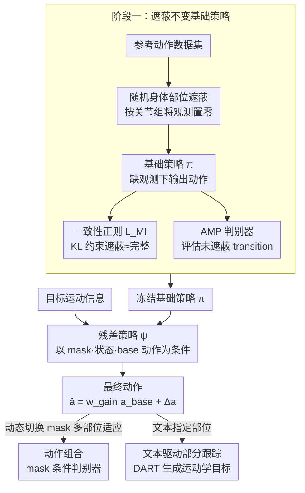

# MaskAdapt: Learning Flexible Motion Adaptation via Mask-Invariant Prior for Physics-Based Characters

**会议**: CVPR 2026  
**arXiv**: [2603.29272](https://arxiv.org/abs/2603.29272)  
**代码**: 无  
**领域**: 视频理解 / 物理仿真角色控制  
**关键词**: 物理仿真, 动作适应, 残差学习, 身体部位遮蔽, 人形控制

## 一句话总结

本文提出 MaskAdapt 框架，通过两阶段残差学习范式——先训练遮蔽不变的鲁棒基础策略，再训练冻结基础控制器上的残差策略来修改目标身体部位——实现灵活精准的物理仿真人形角色动作适应。

## 研究背景与动机

**领域现状**：基于物理仿真的人形角色控制是计算机图形学和机器人领域的核心问题。近年来，深度强化学习（DRL）驱动的物理角色控制取得了显著进展，能够模仿参考动作并产生物理上合理的运动。然而，如何在保持已有运动质量的同时，灵活地修改特定身体部位的行为（如让一个走路角色的上半身做其他动作），仍然是一个重大挑战。

**现有痛点**：现有的动作控制方法通常学习一个全身的统一策略，难以实现部分身体的独立适应。(1) 直接在现有策略上微调会导致灾难性遗忘——修改上半身动作时下半身也受影响；(2) 从头训练组合动作需要大量工程和计算成本；(3) 现有方法对目标身体部位的选择缺乏灵活性——不同应用需要修改不同部位，需要为每种组合单独训练。

**核心矛盾**：动作适应需要同时满足两个相互矛盾的目标：(1) 精确修改目标身体部位的行为以匹配新的运动目标；(2) 保持非目标部位原有运动的稳定性和自然性。全身策略的耦合特性使得二者难以兼顾。

**本文目标**：设计一个框架能够(1)训练一个对身体部位观测缺失鲁棒的基础运动先验；(2)在此先验之上通过轻量残差学习实现目标部位的灵活适应，同时不干扰其他部位。

**切入角度**：借鉴masked pretraining的思想——如果基础策略在训练时就习惯了某些身体部位的观测被遮蔽，那么在适应阶段"接管"这些部位时就能自然过渡，不会引起系统不稳定。

**核心 idea**：两阶段范式——第一阶段用随机遮蔽训练基础策略使其对缺失观测鲁棒（预期未来被适应的区域），第二阶段在冻结的基础策略上训练残差策略，仅修改目标部位。

## 方法详解

### 整体框架

MaskAdapt要解决的是这样一个矛盾：既想精确改写人形角色某个身体部位的动作（比如让走路的角色上半身改成挥手），又不想牵连其他部位、不想为每种"改哪个部位"的组合都从头训练一遍。它把问题拆成前后两段。第一段先训练一个"遮蔽不变"的基础策略：在 AMP（对抗动作先验）框架的动作模仿训练里随机把某些身体部位的观测挡住，并加一项一致性约束，逼着策略在挡与不挡时都给出相近的动作，从而得到一个即便缺了部分观测也不会崩的运动先验。第二段把基础策略整个冻住，再训一个轻量的残差策略，它以 mask 为条件、只对被指定（遮蔽）的目标部位生成修改，输出加到基础策略动作上构成最终控制信号。两段衔接的关键在于：第一段提前让基础策略"习惯"了部位观测被拿走，所以第二段残差策略来接管这些部位时，基础策略不会被陌生的输入打懵。

### 关键设计

**1. 随机身体部位遮蔽训练：让基础策略提前适应"部位被接管"**

如果基础策略只在完整观测上训过，到第二段残差策略接管某个部位时，它会收到训练时从没见过的输入模式，行为很容易失稳。这个设计就是提前把这种场景灌进训练里。具体做法是把人形角色的观测（关节角度、角速度、位置等）按身体部位分组，每个训练 step 随机挑一组或几组把观测置零（或换成默认值），遮蔽概率与组合在训练中动态变化，确保策略见过各种缺失模式。光遮蔽还不够——还要让策略在遮与不遮时动作别差太多，否则第二段的"地基"就是飘的，所以加了一项一致性（遮蔽不变）正则化 $\mathcal{L}_{MI}$，用 KL 散度约束遮蔽前后策略输出的动作分布尽量一致。训练完成后，基础策略对"少看几个部位"这件事变得不敏感，为后续接管留出了平滑的过渡空间。

**2. 残差策略适应：在冻结基座上只改目标部位**

有了鲁棒基座，第二段就用残差学习做精确改写。残差策略 $\psi$ 接收仿真状态、基础动作，以及指明"改哪些部位"的 mask 作为条件，输出残差动作 $\Delta a$，最终执行动作是基础动作与残差的组合 $\hat a = w_{gain}\cdot a_{base} + \Delta a$（$w_{gain}$ 为可学习或固定的增益系数）。让残差只动目标部位靠两点配合：一是喂给基础策略的状态把目标部位观测遮掉，等于让基座对这个部位"不发表意见"、把控制权交给残差；二是残差策略以 mask 为条件，只对被遮蔽的目标区域生成修改、其余部位维持稳定。这样安排有三重好处——基础策略冻结保证非目标部位行为原封不动；残差只学差量，训练比从头训组合高效得多；想改哪些部位，换一套遮蔽 mask 即可，不必重训。举个直观的例子：要把走路角色的上半身换成挥手，就遮掉上半身观测、让残差专门拟合挥手目标，下半身的走路则由冻结基座照常输出，二者相加得到"边走边挥手"的物理合理动作。

**3. 多应用适配：同一框架支撑动作组合与文本驱动跟踪**

前两个设计的协同让框架能直接服务两类应用，无需改动主干。动作组合（Motion Composition）靠在序列内动态切换遮蔽 mask，对不同部位先后适应不同来源的动作，把多部位、多来源的动作拼到一起，比如上半身一套动作、下半身另一套；这里残差学习配一个**条件判别器**（受 CALM 启发，但以 mask 而非技能嵌入为条件），不像 CML 那样为每个部位单独配一个判别器集成，而是用一个 mask 条件判别器在不同遮蔽配置下选择性地约束动作真实性，其真实样本由数据集动作与待适应新动作的运动学混合而成。文本驱动的部分目标跟踪（Text-Driven Partial Goal Tracking）则把目标部位的运动学目标接到预训练文本条件自回归扩散模型（DART）上、其他部位维持原动作，于是"用一句自然语言指定某个部位的新动作"成为可能；运动学目标负责"想做什么"，MaskAdapt 负责把它落成物理上站得住的动作。这两个应用之所以都成立，正是因为遮蔽不变性兜住了不同遮蔽配置下基座的稳定性，残差学习又保证了适应的精确与灵活。

### 损失函数 / 训练策略

**第一阶段（基础策略训练，沿用 AMP 对抗动作先验框架）**：
- 对抗模仿奖励：判别器始终在未遮蔽 transition 上评估，逼策略即使观测被遮也产生专家般的真实动作
- 一致性（遮蔽不变）正则化：$\mathcal{L}_{MI} = \mathbb{E}_m\big[D_{KL}(\pi(\cdot\mid s, m^0) \,\|\, \pi(\cdot\mid \bar{s}, m))\big]$，强制遮蔽后策略分布与完整观测策略分布一致
- 总目标 $\mathcal{L} = \mathcal{L}_{PPO} + \lambda_{MI}\mathcal{L}_{MI}$，用 PPO 优化

**第二阶段（残差策略训练）**：
- 目标跟踪奖励：目标部位关节角度/位置与新运动目标的匹配度
- 动作组合用 mask 条件判别器（CALM 风格，含梯度惩罚）约束适应动作的真实性
- 残差以 mask 为条件、只改目标部位；基础策略完全冻结，仅优化残差策略
- 同样使用 PPO 优化

## 实验关键数据

### 主实验（动作适应质量）

| 方法 | 目标跟踪误差↓ | 非目标保持度↑ | 物理稳定性↑ | 综合指标 |
|------|--------------|-------------|-----------|---------|
| 直接微调 | 中等 | 低（灾难性遗忘） | 低 | 差 |
| 从头训练组合 | 高（组合困难） | N/A | 中等 | 中 |
| Residual w/o Mask-inv | 低-中 | 中等 | 中等-低 | 中 |
| **MaskAdapt (Ours)** | **最低** | **最高** | **最高** | **最优** |

### 消融实验

| 配置 | 关键指标 | 说明 |
|------|---------|------|
| Full MaskAdapt | 最佳 | 完整两阶段框架 |
| w/o 遮蔽训练 | 适应时不稳定 | 基础策略无法处理观测缺失 |
| w/o 一致性正则化 | 遮蔽后动作偏差大 | 遮蔽前后动作分布不一致 |
| w/o mask 条件 | 非目标部位被改动 | 残差失去部位选择性，适应扩散到非目标区域 |
| 单阶段（无残差） | 适应不灵活 | 需要为每种部位组合重新训练 |

### 关键发现

- 遮蔽不变训练是成功适应的前提——没有它，残差策略在适应时会导致基础策略行为崩溃
- 一致性正则化的作用显著——它确保遮蔽引起的动作差异最小化，使残差策略有一个稳定的"地基"来工作
- 在动作组合任务中，MaskAdapt能在同一序列内实现多部位独立适应，产生多样化的组合行为
- 文本驱动适应展示了与运动生成模型的自然协作——运动学目标来自文本条件生成器，物理合理性由MaskAdapt保证

## 亮点与洞察

- **Masked Pretraining思想的精妙迁移**：将NLP/CV中广泛使用的masked training迁移到物理控制领域，让策略在训练时就"预期"部分观测缺失，是一个非常巧妙的跨领域类比
- **残差学习 + 选择性冻结的组合**：冻结基础策略保证稳定性，残差策略负责适应性，L2正则化控制适应范围——三重机制协同确保了精确可控的部分适应
- **实用性强**：一个基础策略可以搭配多个残差策略实现不同的适应目标，无需为每种新动作重新训练完整系统

## 局限与展望

- 当前实验主要在标准人形体型上进行，对非标准体型（如异形机器人）的适用性未验证
- 身体部位的分组方式是预定义的，可能无法覆盖所有细粒度的适应需求（如单个手指的控制）
- 基础策略的鲁棒性与遮蔽训练的设计强相关——遮蔽概率和分组策略的选择需要经验调整
- 目前残差策略与基础策略的组合是简单相加，更复杂的组合方式（如门控机制）可能带来进一步提升
- 未来可探索将MaskAdapt与大规模运动先验（如MoFlow、MotionDiffuse等）结合，实现更丰富的适应能力

## 相关工作与启发

- **vs PHC/UHC等全身模仿控制**: 这些方法追求全身动作的精确模仿，但不支持灵活的部分适应。MaskAdapt在其基础上增加了部件级控制能力
- **vs CompositeMotion/多策略组合**: 传统的多策略组合方法需要为每种组合方式设计专门的融合机制，MaskAdapt通过残差学习提供了更统一和灵活的框架
- **vs 基于MotionGPT的物理控制**: MaskAdapt将运动学生成（非物理）与物理控制解耦，通过残差策略桥接两者——这种解耦设计使系统各部分可以独立升级
- 这篇工作的思路——"先让模型对缺失信息鲁棒，再利用这个鲁棒性做选择性适应"——在模型编辑、技能组合等领域都有潜在应用

## 评分

- 新颖性: ⭐⭐⭐⭐ 遮蔽不变先验+残差适应的组合是物理控制领域的新颖设计
- 实验充分度: ⭐⭐⭐⭐ 展示了动作组合和文本驱动两种应用，有消融研究，但HTML不可用限制了细节获取
- 写作质量: ⭐⭐⭐⭐ 方法描述清晰，两阶段结构易于理解
- 价值: ⭐⭐⭐⭐ 对物理人形控制的灵活适应问题提出了优雅的解决方案，有较好的实用价值

<!-- RELATED:START -->

## 相关论文

- [\[CVPR 2026\] Learning to Assist: Physics-Grounded Human-Human Control via Multi-Agent Reinforcement Learning](learning_to_assist_physics-grounded_human-human_control_via_multi-agent_reinforc.md)
- [\[ECCV 2024\] Motion-prior Contrast Maximization for Dense Continuous-Time Motion Estimation](../../ECCV2024/video_understanding/motion-prior_contrast_maximization_for_dense_continuous-time_motion_estimation.md)
- [\[CVPR 2026\] GoalForce: Teaching Video Models to Accomplish Physics-Conditioned Goals](goal_force_teaching_video_models_to_accomplish_physics-conditioned_goals.md)
- [\[ICCV 2025\] Flow4Agent: Long-form Video Understanding via Motion Prior from Optical Flow](../../ICCV2025/video_understanding/flow4agent_long-form_video_understanding_via_motion_prior_from_optical_flow.md)
- [\[CVPR 2026\] Dual-level Adaptation for Multi-Object Tracking: Building Test-Time Calibration from Experience and Intuition](tcei_test_time_calibration_experience_intuition_mot.md)

<!-- RELATED:END -->
