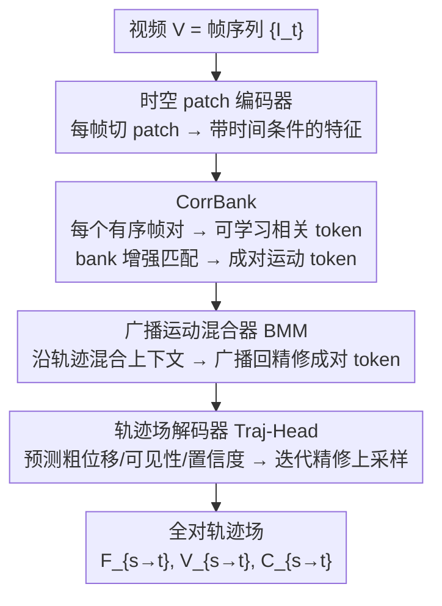

# Matching Every Pair to Track Every Point: PairFormer for All-Pairs Tracking and Video Trajectory Fields

**会议**: CVPR 2026  
**论文**: [CVF Open Access](https://openaccess.thecvf.com/content/CVPR2026/html/Wu_Matching_Every_Pair_to_Track_Every_Point_PairFormer_for_All-Pairs_CVPR_2026_paper.html)  
**代码**: 待发布（论文称 will be released upon publication）  
**领域**: 视频理解 / 点追踪  
**关键词**: 全对追踪, 点追踪 TAP, 轨迹场, 前馈 Transformer, 合成数据

## 一句话总结
PairFormer 把视频运动建模从"追查询的几个点"升级成"预测任意帧对的稠密位移+可见性场"（All-Pairs Tracking, APT），用一个前馈 Transformer（时空编码器 + CorrBank + 广播运动混合器 + 轨迹场解码器）一次前向就吐出全序列一致的稠密轨迹场，并配套合成数据平台 PAIRender 提供 all-to-all 监督与基准，在 APT-Bench 上 SOTA、在标准 TAP 基准上也有竞争力。

## 研究背景与动机
**领域现状**：理解视频运动主要有两条路。**TAP（Tracking-Any-Point）** 给定查询点输出长程、抗遮挡的稀疏轨迹；**光流** 只算相邻两帧的稠密对应。两者各管一摊：TAP 稀疏且依赖用户给的查询点，光流稠密但只看相邻帧。

**现有痛点**：真正理解运动需要"每个像素位置如何关联到序列里每一帧"的表示，而现有范式都给不全。TAP 把追踪建模成对查询点的条件预测，稠密结构是**隐式**的；从单一起始帧传播（propagation）出去的轨迹，在多关键帧编辑/重建场景下会出现**跨源帧不一致**的对应。光流则被锁死在相邻帧，链式拼接成长轨迹时要靠独立的光流模型做预处理、再后处理检测遮挡防漂移。

**核心矛盾**：把"稠密 + 长程 + 全序列一致"同时拿到很难——帧对数随序列长度**二次增长**，每个对应的相关上下文又散布在远处帧和远处空间位置，加上重复纹理、大运动、遮挡带来的歧义；手工设计的代价体（cost volume）和局部传播方案难以聚合这种非局部上下文、也难维持整段序列尺度的一致性。

**本文目标**：把稠密对应抬升为一等公民——给定视频，对**每个有序帧对** $(s,t)$ 预测稠密位移 $F_{s\to t}$ 和可见性 $V_{s\to t}$，从这个显式全对场里任意像素的轨迹都能"按需读出"，而非从单帧传播。

**切入角度**：作者提出 **APT（All-Pairs Tracking）** 这个新任务表述——它严格泛化两帧光流、并涵盖 TAP 式点追踪，让"任意时间偏移下的匹配"被统一处理，把全序列时间一致性变成首要建模目标。

**核心 idea**：遵循一个简单原则——**先构造成对对应，再在整段序列上强制全局一致**，用一个前馈 Transformer（PairFormer）一次前向产出全局一致的全对轨迹场，并造一个能提供 all-to-all 稠密监督的合成数据平台来喂它。

## 方法详解

### 整体框架
输入是视频 $V=\{I_t\}_{t=1}^T$，输出是对每个有序帧对 $(s,t)$ 的稠密位移 $F_{s\to t}$、可见性 $V_{s\to t}$、置信度 $C_{s\to t}$——即一个显式的全对轨迹场。PairFormer 由四个组件串成，贯穿"先成对、后全局"的原则：**时空 patch 编码器（ST-Patch Encoder）** 先把所有帧映成带时间条件的 patch 特征；**CorrBank** 把每个有序帧对转成一组可学习相关 token 并做 bank 增强匹配，产出成对运动 token；**广播运动混合器（BMM）** 沿轨迹做上下文混合再广播回去精修成对 token；**轨迹场解码器（Traj-Head）** 先预测粗的稠密位移/可见性/置信度，再迭代精修成全分辨率输出。

### 关键设计

**1. CorrBank：用可学习相关 bank 替代显式 4D 代价体**

帧对数二次增长，传统显式 4D cost volume 既贵又难上高效注意力核。CorrBank 的做法：对每个有序对 $(s,t)$，先用小卷积网络做残差特征图 $R_{s,t}=h(Z_t-Z_s)$ 突出局部运动线索；再维护一组**所有帧对共享**的可学习相关 token $A\in\mathbb{R}^{K\times D}$，让残差特征做 query 去 cross-attention 这些 token，得到对条件化的相关特征 $M_{s,t}=\text{Attn}(Q{=}R_{s,t},K{=}A,V{=}A)$；最后做 **bank 增强匹配**——源特征 $Z_s$ 当 query、目标特征 $Z_t$ 当 key、对条件化的 bank 特征 $M_{s,t}$ 当 value，产出成对运动 token $Y_{s,t}=\text{Attn}(Q{=}Z_s,K{=}Z_t,V{=}M_{s,t})$。这样就把 4D 代价体换成基于 token 的相关模块，能直接吃 FlashAttention 这类高效核。消融显示相关 token 数取 64 最优（32 欠参数化、128 无额外增益），说明收益主要来自"怎么用这个 bank"而非无限堆容量。

**2. 广播运动混合器（BMM）：先沿轨迹聚上下文，再广播回成对 token**

成对运动 token 只编码了局部对应，缺全序列尺度的全局一致性。BMM 分两步精修。**轨迹级混合**：对每个源帧 $s$、每个 patch $p$，取它在时间上的运动 token 序列 $\{Y_{s,\tau}(p)\}_{\tau=1}^T$，再拼上 $K$ 个所有轨迹共享的可学习上下文 token $U$，过若干自注意力块；前 $K$ 个输出位置作为**轨迹上下文 token** $H_{s,p}$（吸收所有时间步信息、形成该轨迹的紧凑摘要），其余 $T$ 个位置是更新后的运动 token。**上下文混合**：对每个源帧 $s$ 收集所有 $P$ 个 patch 的轨迹上下文 token，在源帧内做自注意力得到精修的 $H^*_{s,p}$。**广播精修**：在选定深度上把 $H^*_{s,p}$ 当广播上下文，用 cross-attention 精修运动 token $\tilde{Y}^*_{s,\cdot}(p)=\text{Attn}(Q{=}\tilde{Y}_{s,\cdot}(p),K{=}H^*_{s,p},V{=}H^*_{s,p})$，再 reshape 回成对运动 token $Y^*_{s,t}$。这一步把每个成对 token 都条件化在"它的轨迹摘要 + 源帧上下文"上，从而注入全序列一致性。消融发现把深度从编码器挪给 BMM（9/24 优于 24/9）同时提升 $\delta_{avg}$ 和降 EPE——说明算力花在序列级推理上比继续加深逐帧编码器更值。

**3. 轨迹场解码器 + 对应正则：粗到细解码并强制同轨迹一致**

把精修后的成对运动 token 映成稠密逐像素输出：轻量稠密头先在 patch 网格上预测粗位移/可见性/置信度，再用 AllTracker 式的迭代更新模块读取运动 token 和当前估计周围的局部源-目标证据预测残差更新，最后学习式上采样到全分辨率，得到 $F_{s\to t}, V_{s\to t}, C_{s\to t}$。训练侧除位移 $\ell_1$ 损失外，关键是**对应正则 $L_{corr}$**：合成监督提供时间一致的轨迹，可识别跨帧对应同一物理点的像素对；对在同一真值轨迹上的匹配像素对 $((s,x),(t,x'))$，定义轨迹描述子 $q_s(x)=[\phi_{s\to1}(x),\dots,\phi_{s\to T}(x)]$，要求 $L_{corr}=\mathbb{E}\|q_s(x)-q_t(x')\|_1$ 小——即同一物理轨迹上的点应共享一致的全对预测，超出逐对监督所能强制的范围。消融显示加 $L_{corr}$ 在长时间范围产出更平滑的轨迹、重复访问同一区域时更少小幅不一致。长视频用 query-centric 滑窗推理（窗长 $L$，重叠区用边界状态初始化后续窗口）。

### 损失函数 / 训练策略
总目标 $L=\lambda_{traj}L_{traj}+\lambda_{conf}L_{conf}+\lambda_{vis}L_{vis}+\lambda_{corr}L_{corr}$。其中 $L_{traj}$ 是逐像素位移 $\ell_1$ 损失；**置信度调整** $\ell_{conf}=r_{s\to t}(x)C_{s\to t}(x)-\alpha\log C_{s\to t}(x)$（$\alpha=0.3$），把预测的置信度 $C$ 当残差的学习权重、用 log 项防止它塌到 0——残差小的像素鼓励大置信度；$L_{vis}$ 是可见性的逐像素 BCE；$L_{corr}$ 为上面的对应正则。权重取 $(\lambda_{traj},\lambda_{conf},\lambda_{vis},\lambda_{corr})=(1,1,1,0.3)$。训练用 π-R10K 与 Kubric 按 1:1 混合、采 30–60 帧 $384\times512$ 片段，8 卡 H100-80G 训 5 万 iter，AdamW（weight decay 0.01），学习率 $2\times10^{-4}$ cosine 衰减 + 1000 步 warmup。

### 一个完整示例
取一段 APT-Bench 序列，源帧 $s=0$、看 $t=30,60$ 的长时跨对应：PairFormer 先由 ST-Patch 编码器把每帧切 patch 编码；CorrBank 对每个 $(0,t)$ 对生成成对运动 token；BMM 沿 patch 0 的整条时间序列 $\{Y_{0,\tau}(p)\}$ 聚成轨迹摘要再广播回去，让 $t=60$ 的预测不只看局部、还借到 $t=1\dots59$ 的全程上下文；Traj-Head 粗预测后迭代精修上采样。结果（论文图 4）相比 CoTracker3 Offline，PairFormer 在 $t=30,60$ 的长跨度上轨迹更平滑连贯、更贴物体几何，导出的光流图运动边界更锐、和起始帧的结构边缘对得更齐。

## 实验关键数据

> 自定义/关键指标说明：$\delta_{avg}$ 为 TAP 式 δ-精度，在像素阈值 $k\in\{1,2,4,8,16\}$ 上平均、按 $256\times256$ 规范尺度算，衡量预测点落在真值 $k$ 像素内的比例（越高越好）；**AJ**（Average Jaccard）联合评定位与可见性；**OA**（Occlusion Accuracy）为可见/遮挡状态预测正确率；$\Delta^{epe}_g$ 为帧间隔 $|s-t|=g$ 时的平均 EPE（端点误差，越低越好）。

### 主实验
TAP 基准（$\delta_{avg}$，越高越好，8 数据集均值）：

| 方法 | Bad. | Ego. | Rgb. | Rob. | 8 集均值 |
|------|------|------|------|------|----------|
| CoTracker3 | 48.3 | 60.4 | 84.2 | 81.6 | 67.2 |
| **PairFormer** | **49.7** | **63.2** | **89.1** | **83.8** | **68.1** |

PairFormer 在 8 个数据集中 6 个取得最佳 $\delta_{avg}$，在 Rgb.、Rob. 这类需要稠密空间上下文与长程推理的场景增益尤其大；TAP-Vid 子集上 AJ 65.9 vs 63.1、OA 91.1 vs 89.3，均稳超 CoTracker3。

APT 基准（APT-Bench，越高越好 / EPE 越低越好）：

| 方法 | $\delta_{avg}$↑ | EPE↓ | AJ↑ | $\Delta^{epe}_1$↓ | $\Delta^{epe}_5$↓ | $\Delta^{epe}_{25}$↓ |
|------|------|------|------|------|------|------|
| CoTracker3 Offline | 75.2 | 4.25 | 72.5 | 2.47 | 4.18 | 6.48 |
| DOT | 76.7 | 3.68 | 75.4 | 2.18 | 3.69 | 6.02 |
| **PairFormer** | **77.5** | **3.26** | **76.3** | **2.03** | **3.21** | **5.39** |

在 CVO、CVO-Extended、APT-Bench 三套稠密标注上 PairFormer 全指标最优；APT-Bench（100 帧长视频）增益最显著，CVO/CVO-Ext（<50 帧短片）margin 较小但一致。所有方法 EPE 都随间隔 $g$ 从 1 增到 25 单调上升，但 **PairFormer 的增长率始终更低**——长时距下累积误差更少、轨迹更稳。

### 消融实验
固定训练预算，在 APT-Bench held-out split 上（$\delta_{avg}$↑ / EPE↓）：

| 消融维度 | 配置 | $\delta_{avg}$↑ | EPE↓ | 结论 |
|---------|------|------|------|------|
| 深度分配 | 编码器/BMM 24/9 | 66.9 | 4.4 | 偏向深编码器 |
| 深度分配 | 编码器/BMM 9/24 | 67.6 | 4.2 | 算力给 BMM 更优 |
| 对应正则 | w/o $L_{corr}$ | 67.2 | 4.3 | 去掉略降 |
| 对应正则 | w/ $L_{corr}$ | 67.8 | 4.1 | 加上一致提升 |
| CorrBank 容量 | 32 / 64 / 128 token | 67.1 / 67.6 / 67.5 | 4.3 / 4.2 / 4.2 | 64 最优 |

### 关键发现
- **算力该花在序列级推理**：把深度从编码器（24/9）挪给 BMM（9/24）同时涨 $\delta_{avg}$、降 EPE——逐帧特征已够强，继续加深编码器只是细化逐帧描述子，不如强化跨帧的轨迹混合。
- **$L_{corr}$ 改善长程时间一致性**：虽只是二级正则，却让长时间范围轨迹更平滑、重访同一区域时少小幅抖动，帮模型解模糊匹配。
- **CorrBank 容量适中即可**：64 个相关 token 已够，128 不再涨且增内存——建模收益来自"如何用 bank"（CorrBank+BMM）而非无界容量。

## 亮点与洞察
- **把任务本身重新定义**：从"追查询点（TAP）"上升到"全对稠密场（APT）"，让光流与点追踪成为它的特例，任意时间偏移统一处理、全序列一致性变成一等目标——这个 reframing 比单纯改模型更有牵引力。
- **可学习相关 bank 替代 4D 代价体**：CorrBank 用共享可学习 token + cross-attention 表达成对相似结构，既省掉显式代价体的二次开销、又能上 FlashAttention，是把光流里的 cost volume 范式"Transformer 化"的干净做法。
- **"先成对、后全局"两段式**：CorrBank 管局部成对、BMM 沿轨迹聚上下文再广播回去注入全局一致，这个解耦思路可迁移到任何"局部匹配 + 全序列一致"的稠密对应任务（如 4D 重建、运动编辑）。
- **配套合成数据平台是隐形主角**：PAIRender 提供 RGB + 稠密 2D/3D 轨迹 + 深度 + 可见性 + 语义 + 相机参数的同步真值，才让 all-to-all 监督与 $L_{corr}$ 成为可能；π-R10K（1 万场景 ×60 帧）和 APT-Bench（100 序列 ×120 帧、all-to-all 协议）解决了 APT 没数据的死结。

## 局限与展望
- 作者承认 PairFormer 对**超长视频面临二次计算开销**，靠 query-centric 滑窗缓解但未根治。
- 训练强依赖**合成 PAIRender 数据**，可能与真实场景存在 domain gap；真实世界稠密全对真值难获取，泛化边界待验证。
- APT-Bench 与训练集 π-R10K 同管线渲染（虽资产/场景不重叠），评测仍偏"合成内分布"，对真实视频的全对追踪质量缺直接量化。
- 改进思路：对帧对做稀疏化/层次化选择降二次开销；引入真实视频的自监督一致性约束缩小 domain gap；把全对场直接接到下游 4D 重建/运动编辑验证实用价值。

## 相关工作与启发
- **vs 光流（RAFT / SEA-RAFT）**：它们构造相邻帧的相关体、用卷积循环更新低分辨率光流再上采样；本文针对**所有有序帧对**而非仅相邻帧，并用 Transformer 的 CorrBank + 全局运动场替代手工代价体和循环卷积精修。
- **vs TAP 式点追踪（CoTracker3 等）**：它们在用户选的**稀疏**查询点上工作、性能依赖查询分布，且内存/算力把同时追踪点数限在几千；PairFormer 一次前向给出稠密全对场，任意像素轨迹按需读出，避免单帧传播的跨源帧不一致。
- **vs 稠密对应追踪器（DELTA / AllTracker / DOT）**：本文 Traj-Head 借用 AllTracker 式迭代更新，但叠加 CorrBank（替代代价体）+ BMM（全序列广播）+ $L_{corr}$（同轨迹一致），在 APT-Bench 上全指标超 DOT。

## 评分
- 新颖性: ⭐⭐⭐⭐⭐ 提出 APT 新任务 + CorrBank/BMM 架构 + 配套数据平台，三位一体的范式级贡献
- 实验充分度: ⭐⭐⭐⭐ TAP + APT 双线评测 + 三组消融较扎实，但真实视频量化与超长视频开销分析偏弱
- 写作质量: ⭐⭐⭐⭐⭐ 任务动机、原则、架构层层递进，公式与消融对应清晰
- 价值: ⭐⭐⭐⭐⭐ 全对轨迹场作为序列级表示，对 4D 重建/多关键帧编辑等下游有明确牵引

<!-- RELATED:START -->

## 相关论文

- [\[ECCV 2024\] Local All-Pair Correspondence for Point Tracking](../../ECCV2024/video_understanding/local_all-pair_correspondence_for_point_tracking.md)
- [\[CVPR 2026\] Efficient All-Pairs Correlation Volume Sampling for Optical Flow Estimation](efficient_all-pairs_correlation_volume_sampling_for_optical_flow_estimation.md)
- [\[CVPR 2026\] TAPFormer: Robust Arbitrary Point Tracking via Transient Asynchronous Fusion of Frames and Events](ttapformer_robust_arbitrary_point_tracking_via_transient_asynchronous_fusion_of_.md)
- [\[CVPR 2026\] ProgTrack: A Multi-Object Tracking Algorithm with Progressive Matching Strategy](progtrack_a_multi-object_tracking_algorithm_with_progressive_matching_strategy.md)
- [\[CVPR 2026\] MV-TAP: Tracking Any Point in Multi-View Videos](mv-tap_tracking_any_point_in_multi-view_videos.md)

<!-- RELATED:END -->
