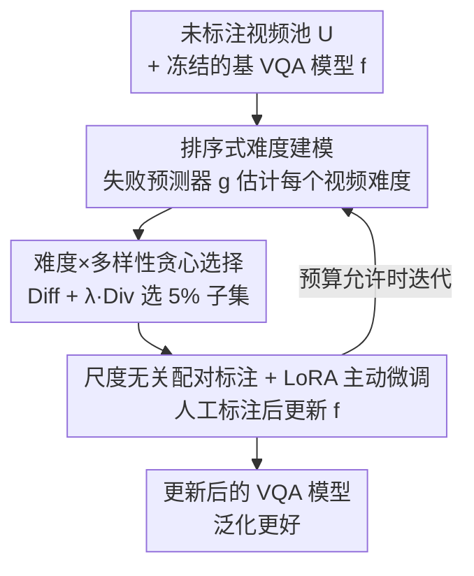

# MDS-VQA: Model-Informed Data Selection for Video Quality Assessment

**会议**: CVPR 2026  
**论文**: [CVF Open Access](https://openaccess.thecvf.com/content/CVPR2026/html/Zou_MDS-VQA_Model-Informed_Data_Selection_for_Video_Quality_Assessment_CVPR_2026_paper.html)  
**代码**: https://github.com/Multimedia-Analytics-Laboratory/MDS-VQA  
**领域**: 视频理解 / 视频质量评估 / 主动学习  
**关键词**: 视频质量评估, 模型驱动数据选择, 失败预测, 主动微调, 学习排序

## 一句话总结
MDS-VQA 让 VQA 模型"自己指出哪些视频它评不准"，用一个排序式失败预测器估计难度、再叠加内容多样性做贪心选择，只标注 5% 的"难且多样"子集做主动微调，就把多目标域平均 SRCC 从 0.651 提到 0.722 并拿到 gMAD 竞赛第一。

## 研究背景与动机

**领域现状**：视频质量评估（VQA）要预测和人类主观判断一致的感知质量。模型侧一路从手工特征、2D/3D CNN、Transformer（FAST-VQA）演进到视觉语言模型（VisualQuality-R1 等用强化学习对齐 MOS）；数据侧则不断做新的主观实验、采集均值意见分（MOS, Mean Opinion Score）。

**现有痛点**：两条线是脱节的。模型侧在一小撮被反复复用的基准上迭代架构/损失/训练配方，容易过拟合数据集的特异性；数据侧花大量人力采新标注，却很少**系统地针对当前最强模型真正会评错的样本**。结果是"易数据集问题"——数据里充斥着失真容易识别的内容，连不带时空分析的简单基线都能打得有声有色，掩盖了高级架构的短板，新标注的边际价值越来越低。

**核心矛盾**：标注预算有限，但被动采样（按代表性或随机）会把预算浪费在模型本就评得准的"同质化简单样本"上，无法照亮模型真正的盲区，也就无法可靠驱动跨域泛化。

**本文目标**：在固定标注预算下，挑出一个对基模型最"有信息量"的子集去标注，使得主动微调后既提升平均相关性、又改善最坏情况泛化。

**切入角度**：作者主张让数据筛选**模型感知（model-aware）**——优先标注 1) 对基模型困难、2) 内容多样的视频。难度可以用一个辅助"失败预测器"估计；多样性可以用深层语义特征度量。

**核心 idea**：用一个"失败预测器 + 多样性度量"闭环把模型的弱点反向引导数据采集，再用采到的数据回头改进模型——即"难且多样"的主动微调闭环。

## 方法详解

### 整体框架
MDS-VQA 把数据筛选写成一个子集优化问题：在未标注视频池 $\mathcal{U}$ 上，求子集 $\mathcal{D}\subset\mathcal{U}$ 最大化 $\mathrm{Diff}(\mathcal{S};f)+\lambda\,\mathrm{Div}(\mathcal{S})$，其中 $\mathrm{Diff}$ 衡量子集对基模型 $f(\cdot)$ 有多难、$\mathrm{Div}$ 鼓励内容覆盖、$\lambda$ 调和两者。整条管线分三步落地：先冻结基质量模型、训练一个辅助失败预测器 $g(\cdot)$ 估计每个视频的难度；推理时把难度分和内容多样性结合、用贪心规则选出 5% 子集；对这批子集做人工标注后，用 LoRA 做主动微调更新 $f(\cdot)$，必要时还能再迭代一轮。

### 关键设计

**1. 排序式难度建模：用失败预测器估计"模型会评错多少"**

痛点是怎么量化"这个视频对基模型有多难"。直接回归绝对预测误差，会被不同数据集 MOS 量纲差异带偏；二分"易/难"又太粗、难样本之间没有区分度。作者把难度学习改成**学习排序**：给基模型 $f(\cdot)$（主实验用 VisualQuality-R1，基于 Qwen2.5-VL）挂上 LoRA 模块得到失败预测器 $g(\cdot)$，权重 $W_{\mathrm{LoRA}}=W_0+\frac{\alpha}{r}BA$，只训练低秩 $A,B$、冻结原权重。对一对视频 $(x,y)$，$g$ 输出两个标量，在 Thurstone 模型下把它们当作单位方差高斯的均值，得到 $x$ 比 $y$ 更难的概率 $\hat p(x,y)=\Phi\!\big(\frac{g(x)-g(y)}{\sqrt2}\big)$。监督信号来自 $f$ 的真实预测误差：若 $|f(x)-\mu(x)|\ge|f(y)-\mu(y)|$（$\mu$ 为 MOS）则 $p=1$ 否则 $0$，再用保真度损失 $\ell=1-\sqrt{p\hat p}-\sqrt{(1-p)(1-\hat p)}$ 优化。这样只需相对比较、天然免疫量纲差异，让 $g$ 给"让 $f$ 误差更大的视频"打更高难度分。训练时还用一段固定结构化提示词，要求模型在 `<answer>` 标签里输出 1~5 的难度分。

**2. 难度×多样性贪心选择：避免反复标注近似重复的难样本**

只挑最难的视频会陷入"一堆近似重复的硬样本"，浪费预算。作者把多样性也量化进来：每个视频用 CLIP 视觉编码器抽帧级语义特征 $\mathcal{F}_x$，两视频间用 Chamfer 距离 $d_{\mathrm{CD}}$ 度量帧级特征的不相似度（捕捉超出单一池化描述子的语义差异），子集多样性 $\mathrm{Div}(\mathcal{S})$ 取所有配对的平均 Chamfer 距离；子集难度 $\mathrm{Diff}(\mathcal{S})=\frac{1}{|\mathcal{S}|}\sum_{x\in\mathcal{S}}g(x)$ 取平均失败分。由于原始子集优化是组合 NP-hard，作者用贪心近似：从空集出发，每步加入最大化 $g(x)+\frac{\lambda}{|\mathcal{D}_k|}\sum_{y\in\mathcal{D}_k}d_{\mathrm{CD}}(\mathcal{F}_x,\mathcal{F}_y)$ 的视频，直到预算用尽（$\lambda=0.25$）。这样选出的子集**既难又不冗余**，更全面地覆盖基模型的盲区。

**3. 尺度无关配对标注 + LoRA 主动微调：把新标注无缝并入已有数据并闭环**

选完子集后做主观实验拿到人类质量判断。关键技巧是把新标注表示成**尺度无关的配对形式**：从标注视频构造比较对，这种成对表达对任意单次实验的绝对评分尺度不变，于是新子集可以直接和已有的成对 VQA 数据**合并**，不需要跨数据集的感知尺度对齐。微调沿用 VisualQuality-R1 的训练配方（提示、批内即时配对、强化学习排序优化），但把全量微调换成 LoRA，缓解过拟合/灾难性遗忘的同时保持高效适配。整个流程闭环：模型弱点引导数据采集、采到的数据回头改进模型；预算允许时可用更新后的模型重新估难度、再选再标，逐步把标注力气转向不断演化的失败模式。

## 实验关键数据

评测涉及五个 VQA 数据集：YouTube-UGC（约 1500 段，作源域训基模型）、CGVDS（云游戏流）、LIVE-Livestream（4K 体育直播）、YouTube-SFV+HDR（短视频 SDR/HDR）、AIGVQA-DB（AI 生成视频），后四者共 4 万余段作目标域"未标注池"；最坏情况评测额外用 LSVQ-1080p 做 gMAD。基模型为在 YouTube-UGC 上训的 VisualQuality-R1（LoRA：$r=64,\alpha=128$，AdamW，lr $1\times10^{-5}$，10 epoch）。对比 8 种数据选择策略。

**指标说明**：SRCC（Spearman 秩相关）、PLCC（Pearson 线性相关）衡量预测与 MOS 的一致性；gMAD（group maximum differentiation，群体最大区分竞赛）专门搜出两模型分歧最大的样本，探测最坏情况泛化。

### 主实验

失败识别（在选出的 5% 子集上算基模型预测与 MOS 的 SRCC/PLCC，**越低越好**，说明越聚焦失败样本）：

| 方法 | CGVDS | LIVE-Livestream | YT-SFV SDR | YT-SFV HDR2SDR | AIGVQA-DB | 平均 |
|------|-------|-----------------|-----------|----------------|-----------|------|
| Base model | 0.544/0.635 | 0.473/0.493 | 0.665/0.710 | 0.538/0.591 | 0.733/0.740 | 0.591/0.634 |
| Random sampling | 0.673/0.782 | 0.521/0.555 | 0.642/0.787 | 0.438/0.407 | 0.652/0.729 | 0.585/0.652 |
| Core-set [23] | 0.415/0.599 | 0.289/0.378 | 0.599/0.741 | 0.516/0.555 | 0.676/0.742 | 0.499/0.603 |
| FreeSel [45] | 0.252/0.450 | 0.232/0.418 | 0.546/0.690 | 0.262/0.422 | 0.565/0.643 | 0.371/0.525 |
| **MDS-VQA (Ours)** | **0.162/0.316** | **0.133/0.288** | **0.264/0.361** | **0.161/0.354** | **0.487/0.487** | **0.241/0.361** |

MDS-VQA 在所有目标域都拿到最低 SRCC/PLCC：CGVDS 上 SRCC 从随机的 0.673 降到 0.162（↓70.2%）。值得注意的是基模型和失败预测器都**没见过目标域数据和标注**，说明不确定性/不一致性模式比质量映射本身更"域无关"、更易迁移。

主动微调（在 YouTube-UGC 训练集 + 5% 目标域子集上微调后各测试集 SRCC/PLCC，**越高越好**）：

| 方法 | YT-UGC | CGVDS | LIVE-LS | YT-SFV SDR | YT-SFV HDR2SDR | AIGVQA-DB | 平均 |
|------|--------|-------|---------|-----------|----------------|-----------|------|
| Base model | 0.708/0.709 | 0.766/0.780 | 0.561/0.587 | 0.666/0.718 | 0.495/0.557 | 0.711/0.748 | 0.651/0.683 |
| Random | 0.760/0.756 | 0.807/0.804 | 0.569/0.628 | 0.703/0.761 | 0.518/0.588 | 0.756/0.751 | 0.686/0.715 |
| FreeSel [45] | 0.814/0.798 | 0.832/0.849 | 0.627/0.646 | 0.719/0.787 | 0.498/0.590 | 0.789/0.785 | 0.713/0.742 |
| **MDS-VQA (Ours)** | 0.819/0.807 | **0.874/0.875** | **0.632/0.654** | **0.731/0.794** | 0.507/0.595 | 0.769/0.769 | **0.722/0.749** |

平均 SRCC 由基模型 0.651 提到 0.722、为所有方法最高，说明选出的样本提供了广泛可迁移的监督而非窄域过拟合。⚠️ 在 AIGVQA-DB 上 MDS-VQA（0.769）略低于 FreeSel/NoiseStability（0.789/0.790），即"难且多样"在 AI 生成视频这一域上并非全局最优，但平均仍领先。

### 消融实验

| 配置 | SRCC Rank | gMAD Rank | ΔRank | 说明 |
|------|-----------|-----------|-------|------|
| **MDS-VQA (Ours)** | 1 | 1 | 0 | 平均相关与最坏情况都第一 |
| FreeSel [45] | 2 | 2 | 0 | 次优，两榜一致 |
| NoiseStability [13] | 3 | 6 | -3 | 平均强但最坏情况掉队 |
| Core-set [23] | 5 | 8 | -3 | SRCC-gMAD 排名明显错位 |
| Base model | 10 | 7 | 3 | — |

gMAD 在 LSVQ-1080p 上做：MDS-VQA 同时拿 SRCC 与 gMAD 双榜第一（ΔRank=0），而若干竞品出现明显的 SRCC-gMAD 排名错位（如 NoiseStability、Core-set 的 gMAD 排名远落后于 SRCC 排名），说明只看平均相关会掩盖罕见但要命的失败。

### 关键发现
- 难度与多样性缺一不可：只靠不确定性（MC dropout）或只靠多样性（Core-set/RD/FreeSel）都不如二者结合——多样性约束避免反复标注近似重复的硬样本，鼓励覆盖互补的失败模式。
- 跨域可迁移：失败预测器在源域训练即可在未见目标域有效挑出难样本，因为"模型在哪不确定/不自洽"比"质量映射"本身更域无关。
- 平均 vs 最坏：MDS-VQA 在 gMAD 上同样第一，定性分析显示当它作攻击者时，能暴露 Core-set 诱导的模型严重低估高 MOS 的动画/抽象画面，而自身诱导的模型在被攻击时更贴合人类感知。

## 亮点与洞察
- 把"哪些数据值得标"交给模型自己回答：用学习排序训失败预测器，规避了绝对误差回归对 MOS 量纲的敏感，是一个干净的"模型→数据"反馈接口。
- 尺度无关配对标注是被低估的工程巧思：让新采的标注能直接并入已有成对数据集，免去跨数据集感知尺度对齐这一老大难，复用性很强。
- 用 gMAD 而不仅是平均 SRCC 来证明泛化，揭示了很多选择策略"平均好、最坏差"的隐患——这个评测视角可迁移到任何质量/打分类任务。

## 局限与展望
- ⚠️ 在 AI 生成视频（AIGVQA-DB）这一域，"难且多样"主动微调略逊于 FreeSel 等纯多样性方法，说明语义/逻辑型失真下难度信号的有效性可能下降。
- 失败预测器依赖基模型自身的预测误差作监督，若基模型本身系统性偏置，难度估计可能继承同样的盲点。
- 迭代式选择需要额外标注预算，论文中作为可选项；多轮选择的成本-收益曲线未充分展开。
- 多样性用 CLIP 语义特征 + Chamfer 距离度量，对纯信号级失真（如压缩块效应）的区分度是否足够，值得进一步验证。

## 相关工作与启发
- **vs 纯不确定性选择（MC dropout [21]）**：他们只按模型不确定性挑样本，本文额外引入排序式失败预测与多样性约束，区别在于难度信号更细粒度且避免冗余，平均与最坏情况都更优。
- **vs 纯多样性/代表性选择（Core-set [23] / RD [42] / FreeSel [45]）**：他们只追内容覆盖、不感知模型在哪评错，本文把模型失败信号显式纳入目标，在失败识别上大幅领先（CGVDS SRCC 0.162 vs 0.252~0.673）。
- **vs VisualQuality-R1 [44]**：本文以它为基模型，不改架构而是改"喂什么数据"，证明数据侧的模型感知筛选能在强 VLM 基础上再榨出可观增益。

## 评分
- 新颖性: ⭐⭐⭐⭐ 把失败预测+多样性闭环成模型感知数据选择，接口干净但单个组件（LoRA、排序、Chamfer）均为已知技术的组合。
- 实验充分度: ⭐⭐⭐⭐⭐ 五数据集、8 个对比方法、失败识别/主动微调/gMAD 三视角，且加了最坏情况评测。
- 写作质量: ⭐⭐⭐⭐ 动机与公式清晰，闭环叙事完整；部分实现细节（迭代成本、AIGVQA 偏弱原因）展开不足。
- 价值: ⭐⭐⭐⭐ 仅 5% 标注就显著提升泛化，对"标注预算受限的质量评估"很实用，方法可迁移到其他打分任务。

<!-- RELATED:START -->

## 相关论文

- [\[CVPR 2026\] CoCoVideo: The High-Quality Commercial-Model-Based Contrastive Benchmark for AI-Generated Video Detection](cocovideo_the_high-quality_commercial-model-based_contrastive_benchmark_for_ai-g.md)
- [\[CVPR 2026\] SkillSight: Efficient First-Person Skill Assessment with Gaze](skillsight_efficient_first-person_skill_assessment_with_gaze.md)
- [\[CVPR 2026\] VAST: Video Ability-Stratified Taxonomy for Data-Efficient Video Reasoning](vast_video_ability-stratified_taxonomy_for_data-efficient_video_reasoning.md)
- [\[CVPR 2026\] Towards Data-Efficient Video Pre-training with Frozen Image Foundation Models](towards_data-efficient_video_pre-training_with_frozen_image_foundation_models.md)
- [\[CVPR 2026\] Efficient Frame Selection for Long Video Understanding via Reinforcement Learning](efficient_frame_selection_for_long_video_understanding_via_reinforcement_learnin.md)

<!-- RELATED:END -->
