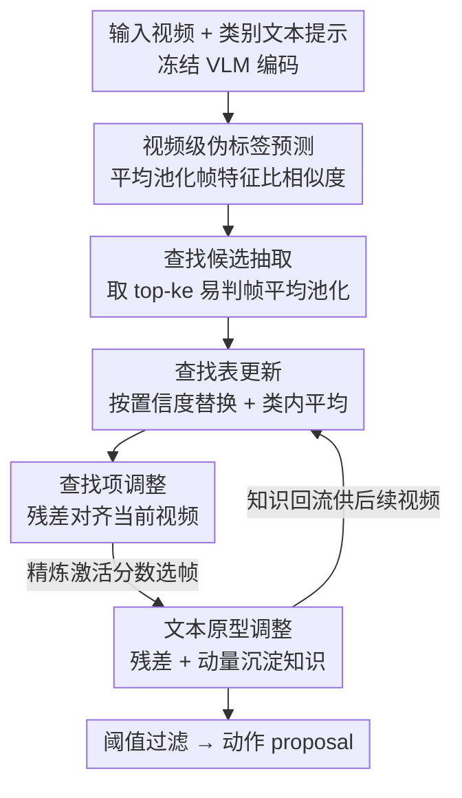

# Memory Matters: Boosting Training-Free Zero-Shot Temporal Action Localization with a Learnable Lookup Table

**会议**: CVPR 2026  
**论文**: [CVF Open Access](https://openaccess.thecvf.com/content/CVPR2026/html/Jiang_Memory_Matters_Boosting_Training-Free_Zero-Shot_Temporal_Action_Localization_with_a_CVPR_2026_paper.html)  
**领域**: 视频理解  
**关键词**: 零样本时序动作定位、训练无关、测试时自适应、可学习查找表、视觉语言模型

## 一句话总结
针对"训练无关零样本时序动作定位（TF ZS-TAL）逐视频独立适配、用完即丢、无法积累历史知识"的问题，本文用一张**按动作类别维护、随测试流在线更新的可学习查找表（LLT）**把高置信度"易判帧"聚合成类别原型，再配一个轻量残差模块把查找项和文本原型对齐到当前视频，从而在不微调 VLM 的前提下让训练无关 ZS-TAL 跨视频复用知识，在 THUMOS'14（75/25 划分）上把平均 mAP 从 T3AL 的 9.2 提到 12.8（相对 +40%）。

## 研究背景与动机

**领域现状**：时序动作定位（TAL）要在未裁剪长视频里找出动作片段并切出起止边界。零样本 TAL（ZS-TAL）进一步要求识别训练时没见过的动作类别，分两条路线：训练型（先在有标注的 $D_{seen}$ 上微调 VLM，再迁到 $D_{unseen}$）和训练无关型（直接拿冻结的视觉语言模型在测试时做适配，完全不需要标注训练数据）。代表性的训练无关方法是 T3AL：对每个测试视频，只在线微调 VLM 的投影层来做自适应。

**现有痛点**：训练型方法把模型拟合到 $D_{seen}$ 的有标注类别上，反而损害了 VLM 的泛化能力——表里 EffPrompt、STALE 一旦换到跨域（OOD）场景，平均 mAP 从 23 直接掉到 4 甚至 0.3，几乎崩溃。而训练无关的 T3AL 虽然解决了泛化问题，却有个致命缺陷：**它对每个视频独立适配，处理完一个视频就把学到的东西重置清零**，下一个视频从头再来。

**核心矛盾**：不同视频之间其实藏着大量可共享的潜在知识——篮球和足球视频都含"跑动"动作，"投篮""运球"片段共同支撑了对"打篮球"的整体理解。这种跨视频知识能隐式地帮助后续视频更好地区分动作与背景。但逐样本适配天生没有知识积累机制，遇到相似类别时无法调用历史经验，性能被白白浪费。

**本文目标**：给训练无关 ZS-TAL 装一个"记忆"，让它在处理测试视频流时把可靠的类别知识攒下来、复用起来，同时不破坏 VLM 的零样本泛化（即不反向传播穿过编码器）。

**切入角度**：作者观察到——在一个测试视频里，激活分数最高的那批帧（top-k）往往就是最不含糊、最具判别性的动作片段（"易判帧"）。这些易判帧比固定的文本原型更能稳健地代表一个动作类别。于是可以把跨视频积累的易判帧聚合成类别表示，作为"先验知识"去消解后续视频里模糊帧的歧义。

**核心 idea**：把训练无关 ZS-TAL 重新表述成**记忆增强的检索**——维护一张按类别分桶、容量固定、按置信度替换的可学习查找表（LLT），在线收集高置信易判帧构造"动作正例查找项"；再用两个轻量可学习残差把查找项和文本原型微调对齐到当前视频。冻结 VLM，只更新查找表和残差，既高效又不伤泛化。

## 方法详解

### 整体框架
LLT 框架把测试流分成两大阶段循环处理每个视频。**阶段一·查找表收集**：先对当前视频做视频级伪标签预测（确定它属于哪个动作类），再从该视频里抽取"动作正例查找候选"（易判帧聚合），最后按置信度感知的替换策略决定要不要把这个候选塞进对应类别的缓冲区，并把缓冲区内所有候选平均成该类的"查找项"。**阶段二·当前视频内的可学习残差**：从查找表取出当前类的查找项后，用一个可学习残差向量把它对齐到当前视频上下文（查找项调整），用调整后的查找项重新算每帧激活分数来做帧选择；同时对文本原型也学一个残差并做动量更新（文本原型调整），把本次学到的知识沉淀回去供后续视频用。整个过程 VLM 全程冻结，只优化查找表、两个残差向量。

### 关键设计

**1. 查找候选抽取：把当前视频里最"硬"的帧蒸成一个动作正例表示**

痛点是：固定的文本原型（"a video of action [CLS]" 编码出的向量）容易被场景上下文或无关动作误激活，单凭它判别动作/背景不够稳。作者的做法是：对当前视频 $V_n$ 先做视频级伪标签预测——把帧特征 $\{x_{n;i}\}$ 平均池化成 $\bar{x}_n$，与各类文本嵌入 $y_c$ 算余弦相似度取 argmax 得伪标签 $\hat{c}_n$（公式 1），并对相似度做 softmax，取最高值作为视频级置信度 $\xi_v^{(n)}$。然后用伪标签的文本嵌入 $y_{\hat{c}_n}$ 给每帧打激活分数 $p_{n;t}=\langle y_{\hat{c}_n}, x_{n;t}\rangle / (\|y_{\hat{c}_n}\|\,\|x_{n;t}\|)$（公式 2），按降序排序取 top-$k_e$ 个位置作为易判帧，其中 $k_e=\max(1,\lfloor T_n\times\gamma_e\rfloor)$ 由采样比 $\gamma_e$ 控制。最后把这些易判帧特征平均池化成查找候选 $z_n=\frac{1}{k_e}\sum_{x\in E_n^{ea}} x$（公式 4）。这一步之所以有效，是因为 top-$k$ 激活帧对应的正是最不含糊的动作段，把它们聚合得到的 $z_n$ 比文本原型更鲁棒、更能锚定这个类别，为后续消歧提供视觉先验。

**2. 置信度感知的查找表更新：用一个固定容量缓冲区在线攒跨视频知识**

这是"记忆"的核心载体，要解决的是 T3AL 用完即丢、没法积累历史的问题。作者为每个动作类 $c$ 维护一个容量为 $B$ 的固定大小缓冲区，只接收伪标签 $\hat{c}_n=c$ 的候选。每处理完一个视频就拿到三元组 $(z_n,\hat{c}_n,\xi_v^{(n)})$，按置信度替换策略入桶：缓冲区没满就直接插入；满了则把 $\xi_v^{(n)}$ 和当前桶里最低置信度比，更高就**踢掉最不自信的那条**、把新候选放进去，否则不动。该类的查找项就是桶里所有候选的平均 $v_c=\frac{1}{N_c}\sum_{m=1}^{N_c} z_c^{(m)}$（公式 5）。这个设计妙在两点：其一，它对每个伪标签类做了一个**隐式瓶颈**——聚合多个视频里同类的共享知识，缓解了只靠固定文本原型带来的背景干扰；其二，**省存储**——只存聚合后的类原型，比缓存每个视频的逐帧特征省得多，而且只更新查找项和文本原型两个表示，完全不用反传穿过 VLM 编码器。随测试视频流推进，查找表里的候选越来越可靠、判别性越来越强（论文 Table 4 的 DETAD 误差分析印证：处理越多视频，背景误差和定位误差稳步下降、真阳性上升）。

**3. 可学习残差：把"通用类原型"动态对齐到"当前视频"的双残差微调**

查找项 $v_{\hat{c}_n}$ 是跨视频平均出来的"通用"表示，但当前测试视频可能有分布偏移，直接用会对不准。作者给查找项配一个可学习残差向量 $r_v$，得到自适应查找项 $\tilde{v}_{\hat{c}_n}=\mathrm{Norm}(v_{\hat{c}_n}+r_v)$（公式 6）。怎么优化 $r_v$？借鉴 TTA 的熵最小化思想，利用同一视频内帧的天然多样性构造自监督信号：用 $\tilde{v}_{\hat{c}_n}$ 给每帧重算激活分数，取 top-$K$ 最激活帧和 bottom-$K$ 最不激活帧，拼成置信向量 $p_{con}^{vis}$（公式 8），让它去对齐一个理想二值目标 $s_{bin}^{vis}=[1,\dots,1,0,\dots,0]$（前 $K$ 个理想上像动作、后 $K$ 个像背景，公式 9），用分离损失 $L_{sep}^{vis}=2-2\cdot\langle p_{con}^{vis},s_{bin}^{vis}\rangle/(\|p_{con}^{vis}\|\,\|s_{bin}^{vis}\|)$（公式 10）拉大动作/背景的可分性；再加一个对齐损失 $L_{align}^{vis}$（公式 11）把 $\tilde{v}_{\hat{c}_n}$ 直接拉近 top-$K$ 代表性动作帧，总目标 $L=L_{sep}^{vis}+\lambda\cdot L_{align}^{vis}$（公式 12）。

$$\tilde{v}_{\hat{c}_n}=\mathrm{Norm}(v_{\hat{c}_n}+r_v),\qquad L=L_{sep}^{vis}+\lambda\cdot L_{align}^{vis}$$

对文本原型同理学一个残差 $r_y$ 得 $\tilde{y}_{\hat{c}_n}=\mathrm{Norm}(y_{\hat{c}_n}+r_y)$（公式 13），用类似的分离损失 $L_{sep}^{text}$（公式 14）优化，再以动量方式把知识沉淀回原型：$y_{\hat{c}_n}\leftarrow m\cdot y_{\hat{c}_n}+(1-m)\cdot\tilde{y}_{\hat{c}_n}$（公式 15），且**仅当视频级置信度超过阈值 $\delta$ 时才更新**（$\xi_v^{(n)}>\delta$），保证沉淀进去的都是可信知识、防止噪声污染。这个双残差设计有效是因为它把"跨视频积累的稳定先验"和"当前视频的特异性"解耦：查找表负责长期记忆，残差负责短期对齐，二者协同既稳又准。

### 推理流程
给定视频 $V_n$，先预测伪标签 $\hat{c}_n$、抽查找候选、按策略判断是否更新查找表；取出查找项 $v_{\hat{c}_n}$ 做残差调整得 $\tilde{v}_{\hat{c}_n}$，用它给每帧算精炼激活分数，再用阈值 $\theta$（设为整段视频的平均激活分数）过滤出候选帧，把连续帧分组成动作 proposal。

## 实验关键数据

### 主实验
backbone 用 CoCa（ViT-L/14），跟 T3AL 保持一致；在 THUMOS'14（20 类、413 视频）和 ActivityNet v1.3（200 类、约 2 万视频）上分 50/50 和 75/25 两种类别划分，每个划分重复 10 次取平均。"†"表示训练型方法在 OOD 场景下的复现，"T=0"表示不做任何优化步。

| 数据集 (划分) | 方法 | 设定 | Avg mAP |
|--------|------|------|------|
| THUMOS'14 (75/25) | EffPrompt† | OOD 训练型 | 4.6 |
| THUMOS'14 (75/25) | STALE† | OOD 训练型 | 0.3 |
| THUMOS'14 (75/25) | T3AL | 训练无关+TTA | 9.2 |
| THUMOS'14 (75/25) | **LLT (Ours)** | 训练无关+TTA | **12.8** |
| THUMOS'14 (50/50) | T3AL | 训练无关+TTA | 10.4 |
| THUMOS'14 (50/50) | **LLT (Ours)** | 训练无关+TTA | **12.6** |
| ActivityNet (75/25) | T3AL | 训练无关+TTA | 15.4 |
| ActivityNet (75/25) | **LLT (Ours)** | 训练无关+TTA | **17.1** |
| ActivityNet (50/50) | T3AL | 训练无关+TTA | 14.3 |
| ActivityNet (50/50) | **LLT (Ours)** | 训练无关+TTA | **15.7** |

THUMOS'14 75/25 划分上相对 T3AL 提升 40%（9.2→12.8），且全部 IoU 阈值上都稳定领先。值得注意的是即便 $T=0$（不做任何残差优化、纯靠查找表）LLT 也能拿到 12.1，已经远超 T3AL 完整版的 9.2——说明跨视频知识积累本身就是主要增益来源。

### 消融实验
LC=查找候选抽取，LT=查找表，LA=查找项调整，TA=文本原型调整（THUMOS'14，Avg mAP）：

| LC | LT | LA | TA | 75/25 Avg | 50/50 Avg | 说明 |
|----|----|----|----|------|------|------|
| ✗ | ✗ | ✗ | ✗ | 9.4 | 9.2 | 文本原型直接比帧特征（baseline） |
| ✓ | ✗ | ✗ | ✗ | 10.3 | 10.2 | 加易判帧聚合 |
| ✓ | ✓ | ✗ | ✗ | 12.1 | 11.8 | 加查找表记忆，跳变最大 |
| ✓ | ✓ | ✓ | ✗ | 12.6 | 12.1 | 加查找项残差 |
| ✓ | ✓ | ✗ | ✓ | 12.5 | 12.3 | 加文本原型残差 |
| ✓ | ✓ | ✓ | ✓ | **12.8** | **12.6** | 完整模型 |

### 查找表演化（DETAD 误差分析，THUMOS'14）
随处理视频数增加，假阳性持续下降、真阳性上升，证明攒进表里的候选越来越可靠：

| 误差类型 (%) | 50 视频 | 100 视频 | 150 视频 | 200 视频 |
|------|------|------|------|------|
| 背景误差 | 56.62 | 55.66 | 55.77 | 55.77 |
| 定位误差 | 23.25 | 23.57 | 22.48 | 22.45 |
| 真阳性 | 18.27 | 18.68 | 19.83 | 19.86 |

### 关键发现
- **查找表（LT）贡献最大**：从 LC 单模块的 10.3 跳到 LC+LT 的 12.1（+1.8），是单步增益最大的组件，直接验证"跨视频记忆"才是核心。LA、TA 两个残差各再贡献约 0.5，且二者互补（同时加比单加都好）。
- **超参鲁棒**：采样比 $\gamma_e=0.05$ 最优，但在很宽范围内性能稳定；缓冲区 $B$ 从 1 增到 4 涨 1.7%，再增到 7 反而掉 0.2%——少量高质量候选就够，过大反而引入低置信噪声。最终 $B=4$、$\delta=0.7$、$m=0.6$（THUMOS）。
- **Oracle 上限分析**：依次给完美类别（+2.3%）、完美查找表（+1.6%）、完美正负样本（+9.6%，最终 Avg 达 22.2%）——说明帧级正负样本选择是最大瓶颈，框架本身潜力很大但受限于伪标签和帧选择质量。

## 亮点与洞察
- **把"测试时自适应"从逐样本升级成跨样本记忆**：这是和 T3AL 最本质的区别——别人是"每个视频学完即扔"，本文用一张按类分桶的查找表把流式测试视频里的可靠知识攒下来复用，记忆机制让训练无关方法第一次能积累历史。这个"流式 TTA + 类别记忆桶"的思路可迁移到任何流式测试的零样本任务（如零样本检测/分割的测试时增强）。
- **置信度感知的固定容量替换策略很巧**：用 $B=4$ 的小缓冲区 + 踢掉最低置信度的策略，既省存储又自动过滤噪声，比无脑缓存全部帧特征优雅得多。小而精的缓冲区反而比大缓冲区更好，是个反直觉但有数据支撑的发现。
- **冻结 VLM、只学两个残差向量**：把可训练量压到极致（每个视频只优化 $r_v$、$r_y$ 两个 $1\times D$ 向量），既不伤 VLM 泛化又能做测试时对齐，是训练无关范式里很务实的工程取舍。
- **DETAD 误差随视频数演化的可视化**很有说服力：直接证明"记忆确实在变好"，而不是靠最终数字硬说，这种过程性证据值得学习。

## 局限与展望
- **绝对精度仍很低**：THUMOS'14 上最好也才 12.8 Avg mAP，离全监督 ActionFormer 的 66.8 差一个数量级，训练无关 ZS-TAL 整体还远未可用。Oracle 分析也显示完美正负样本能到 22.2，说明帧选择质量是硬天花板。
- **背景误差几乎没降**：Table 4 里背景误差从 56.62 到 55.77 基本纹丝不动，真正改善的是定位误差和真阳性——说明查找表对"区分动作 vs 背景"帮助有限，主要在帮"定位边界"。论文对此未深入。
- **依赖伪标签质量**：视频级伪标签一旦错了，整条链路（候选抽取、入桶类别）全错，且查找表会把错误知识固化进去。缺乏伪标签纠错机制是潜在风险。
- **类别桶假设单一动作类**：每个视频按一个伪标签入一个类桶，对含多类动作的复杂视频可能不适配；采样比 $\gamma_e$、动量 $m$ 等超参在两个数据集上还需分别调（论文只给了 THUMOS 的 $\gamma_e=0.05,m=0.6$）。
- 可改进方向：引入伪标签置信度的软入桶、跨类共享子动作（如多类共有的"跑动"）、或把残差学习换成更强的测试时优化目标。

## 相关工作与启发
- **vs T3AL（最相关）**：T3AL 是第一个训练无关 ZS-TAL，靠在每个视频上微调投影层做 TTA，但逐视频独立、历史知识丢失。本文最核心的区别就是加了"记忆"——用查找表跨视频积累知识，且冻结投影层只学查找表和残差。结果上 THUMOS 75/25 相对提升 40%，且 $T=0$ 版就已超过 T3AL 完整版。
- **vs 训练型 ZS-TAL（EffPrompt / STALE / DeTAL）**：它们在 $D_{seen}$ 上微调（prompt tuning / adapter tuning），同域内分数高（23~25），但一换 OOD 就崩（掉到 0.3~4.6）。本文完全不碰训练数据，OOD 鲁棒性碾压，体现"训练无关"在真实泛化上的价值。
- **vs VLM 测试时自适应（Tent / DMN / BCA）**：这些是图像 TTA 方法（熵最小化、动态记忆、后验更新类嵌入），本文把记忆+残差的思路专门适配到 TAL 的流式视频场景，填补了 TAL 领域 TTA 研究的空白。DMN 的动静态记忆和本文查找表思路相近，但本文是按动作类分桶 + 置信度替换的离散缓冲，更贴合 TAL 的类别结构。

## 评分
- 新颖性: ⭐⭐⭐⭐ 把训练无关 ZS-TAL 重构成"跨视频记忆检索"，查找表 + 双残差的组合在该子领域是清晰的增量创新，但记忆/查找表本身在 TTA 里非全新。
- 实验充分度: ⭐⭐⭐⭐ 两数据集两划分各重复 10 次、消融/超参/演化/Oracle/定性俱全，DETAD 误差分析和 Oracle 上限分析尤其扎实；缺与更多近期训练无关基线的横向对比。
- 写作质量: ⭐⭐⭐⭐ 动机层层递进、公式完整、图表清晰，"记忆"主线贯穿始终；个别符号（如 $\xi$ 上下标）排版略密。
- 价值: ⭐⭐⭐⭐ 给训练无关 ZS-TAL 提供了一个简单有效且可复用的记忆范式，40% 相对提升说服力强；但绝对精度仍低，距实用尚远。

<!-- RELATED:START -->

## 相关论文

- [\[CVPR 2026\] TF-CADE: Foreground-Concentrated Text-Video Alignment for Zero-Shot Temporal Action Detection](tf-cade_foreground-concentrated_text-video_alignment_for_zero-shot_temporal_acti.md)
- [\[CVPR 2026\] SkeletonContext: Skeleton-side Context Prompt Learning for Zero-Shot Skeleton-based Action Recognition](skeletoncontext_skeleton-side_context_prompt_learning_for_zero-shot_skeleton-bas.md)
- [\[CVPR 2026\] MTLLFM: Multimodal-Temporal Laughter Localization](mtllfm_multimodal-temporal_laughter_localization_ur-funny-temporal_and_smile-tem.md)
- [\[CVPR 2025\] VideoGEM: Training-Free Action Grounding in Videos](../../CVPR2025/video_understanding/videogem_training-free_action_grounding_in_videos.md)
- [\[ECCV 2024\] Online Temporal Action Localization with Memory-Augmented Transformer](../../ECCV2024/video_understanding/online_temporal_action_localization_with_memory-augmented_transformer.md)

<!-- RELATED:END -->
