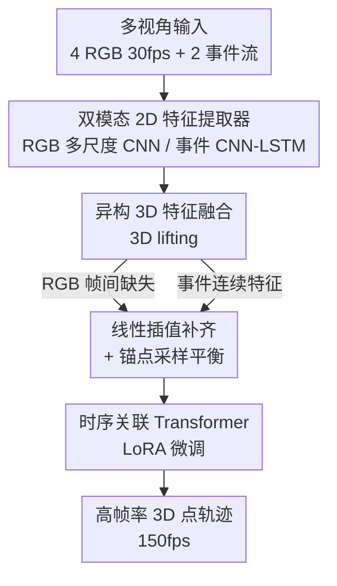

# MER-Tracker: Towards High-Speed 3D Point Tracking via Multi-View Event-RGB Hybrid Cameras

**会议**: CVPR 2026  
**论文**: [CVF Open Access](https://openaccess.thecvf.com/content/CVPR2026/html/Chang_MER-Tracker_Towards_High-Speed_3D_Point_Tracking_via_Multi-View_Event-RGB_Hybrid_CVPR_2026_paper.html)  
**领域**: 视频理解 / 3D视觉  
**关键词**: 3D点跟踪, 事件相机, 多视角, 高速运动, 多模态融合

## 一句话总结
针对普通 RGB 相机帧率低（约 30fps）、拍高速运动会糊掉且帧间漏掉关键动态的问题，本文用「4 台 RGB + 2 台事件相机」搭了个长方体拍摄装置，并提出 MER-Tracker——把 RGB 的纹理保真和事件流的微秒级时间分辨率融合起来，在 150fps 下输出准确的高速 3D 点轨迹，是首个系统化的高速 3D 点跟踪工作。

## 研究背景与动机
**领域现状**：3D 点跟踪要从视觉观测中估计任意点在三维空间里随时间连续、时序一致的轨迹。近年单目方法（如 SpatialTracker、TAPIP3D、DELTA）把 2D 点 lift 到 3D 再跟踪，多视角方法（如 MVTracker、Dynamic 3DGS）用多个固定视点拿到更完整、遮挡更少的覆盖，整体进展很快。

**现有痛点**：这些成功几乎都局限在普通的低速运动上。真正高速的现象——奔跑的人、昆虫振翅、旋转的转子——很难忠实重建。瓶颈出在**感知端**：商用 RGB 传感器帧率只有约 30fps，导致运动模糊和大的帧间间隔，把快速运动里关键的动态信息漏掉了。

**核心矛盾**：想靠堆高速 RGB 相机提帧率，又会带来巨大的存储/带宽开销，并且要求很强的照明，实验条件过于苛刻。另一边，事件相机（DVS）有微秒级时间分辨率和极大动态范围，但它编码的是亮度变化的时间导数——擅长捕捉边缘和运动起始，却缺乏稠密纹理、对静止区域几乎不敏感。两种模态各有死穴。

**本文目标**：(1) 造一个能做多视角、多模态时空同步的 Event–RGB 融合装置；(2) 从两种模态各自抽取互补的 3D 运动特征并融合成精确的高帧率时空表示；(3) 在高帧率 3D 时空表示与每个查询点之间建立时序连续的关联，引导 Transformer 学出可泛化的高速 3D 轨迹。

**切入角度**：既然 RGB 有纹理保真、事件流有时间锐度，那能不能把两者融合，去恢复高速运动的高帧率 3D 点轨迹？

**核心 idea**：用「低帧率但有纹理的 RGB」补空间结构、用「连续但稀疏的事件流」补时间细节，在 3D 空间里做异构融合，再用带时序关联的 LoRA Transformer 把离散观测续成 150fps 的连续 3D 轨迹。

## 方法详解

### 整体框架
MER-Tracker 要解决的是「输入 4 路低帧率（30fps）带模糊的 RGB 图 + 2 路连续事件流，输出高帧率（150fps）的 3D 点轨迹」。整体分三段串行：先用**双模态 2D 特征提取器**在各自原生帧率上分别抽 RGB 和事件的运动变化特征；再做**异构 3D 特征融合**——把两模态特征 lift 到统一 3D 空间，用线性插值补齐缺失的高帧率 RGB 特征、用锚点采样平衡空间分布，得到紧凑的时空描述子；最后用一个**时序关联 Transformer（LoRA 微调）**，基于时序最近邻关联把查询点续成完整的高帧率 3D 轨迹。装置侧用 VGGT 拿初始点云（即查询 3D 点）和深度图，相机内外参由时空标定得到。

### 关键设计

**1. 双模态 2D 特征提取器：让两种模态在各自原生节奏下各取所长**

RGB 给的是低帧率离散图、纹理稠密，事件相机给的是连续异步事件流、时序依赖强但单步纹理极少——硬塞进一个网络会互相拖累。本文先做时间对齐再分别抽特征。事件侧把一段窗口 $(t_{start}, t_{end})$ 内的异步事件均匀填入 $B=5$ 个连续不重叠的 bin 构成 event voxel grid，每个事件按时间贡献给相邻两个 bin；因为事件流有强时序依赖、单帧纹理稀薄，所以用一个 CNN-LSTM（三层卷积 + LSTM，隐藏维 256）抽出有时序依赖的细粒度 2D 特征 $\psi(E_m)$，并投影到与 RGB 同维。RGB 侧则用普通 CNN $\phi(I_n(t_i))$ 抽 4 个尺度的稠密外观特征。这样 RGB 负责"长什么样"、事件负责"怎么动"，两条支路各自发挥，不被对方的弱点稀释。

**2. 异构 3D 特征融合：用「插值 + 合并 + 采样」治时序不平滑与空间不均衡两个病**

把多视角 2D 特征用深度和相机参数 lift 到 3D 后，每个有效像素 $(u_x, u_y)$ 通过

$$x_v = E_t^{v-1}\,(K_t^{v-1}\,(u_x, u_y, 1)^\top \cdot D_t^v[u_y, u_x])$$

抬到三维并挂上对应的 2D 特征，得到各相机各时刻的 3D 特征点云 $X_I^n(t)$、$X_E^m(t)$。但作者发现，若只是把所有视角的点云在每个高帧率时刻简单拼接，会出两个毛病：**Q1 时序不平滑**——当低帧率 RGB 帧缺席时融合特征会突然劣化；**Q2 空间不均衡**——简单合并会让某些局部区域点过密、另一些过疏。

针对 Q1，本文假设高速运动轨迹时序相干性更强，把 RGB 特征空间的演化近似为线性，用线性插值恢复缺失的高帧率特征点云：设 $t_1, t_2$ 是相邻两个低帧率时刻、$t_T \in (t_1, t_2)$ 是目标高帧率时刻，则 $X_I^n(t_T) = \alpha X_I^n(t_1) + (1-\alpha) X_I^n(t_2)$，其中 $\alpha = (t_T - t_1)/(t_2 - t_1)$。针对 Q2，采用「先合并后锚点采样」：两模态先聚合，再用最远点采样 FPS 重采样——$X(t_T) = \mathrm{FPS}(\{X_I^i(t_T)\}_i, \{X_E^j(t_T)\}_j)$。如 PointNet++ 里那样，FPS 通过最大化采样点间的最小距离迭代选点，既得到更均衡的空间分布，又保留原始点云的几何结构。三步合起来（图 3 的 (c)）让融合点云时序更平滑、分布更均衡、原始空间结构不丢。

**3. 时序关联 Transformer + LoRA 微调：把"慢动作"里的逐帧耦合显式建进关联，并低成本迁移大模型**

拿到 3D 特征后要把它和查询点关联起来做轨迹预测。本文没有只靠空间关联模块（如 triplane 投影或 kNN 邻域聚合），而是额外引入**时序关联**，构成联合的时空最近邻关联：对目标时刻 $t_T$ 的每个查询点，分别在 $t_{T-1}, t_T, t_{T+1}$ 三个相邻帧的融合 3D 特征点云里找 $K$ 个最近邻 $C_{t_T}$。直觉是：在高帧率下运动本质上是"慢动作"，每一帧的位置和它紧邻的前后帧紧密耦合，把这种时序相干性建模进来能得到更强的表示、保住轨迹连续性。随后构造关系 token $G_{t_T} = \mathrm{Enc}(C_{t_T})$ 迭代喂给 Transformer 得到完整高帧率轨迹。为了既蹭大规模数据集的泛化能力、又压低训练和数据准备成本，本文用 MVTracker 预训练的 Transformer 权重初始化，再在自建合成数据上用 LoRA（低秩适配）做参数高效微调，最后把 LoRA adapter 和 Transformer 权重一起存下来评估。

### 损失函数 / 训练策略
模型在 70 个自制 FMV-Kubric 合成场景上训练 20k 步，用 2 张 NVIDIA A6000（60GB 显存）跑约 40 小时，batch size 为 2，PyTorch 实现；轨迹预测阶段沿用 MVTracker 的 token 构造与同款 Transformer 设计、迭代式训练 schedule；FPS 的下采样率取 0.3。

## 实验关键数据

### 主实验
作者在三个数据集上比较：合成的 FMV-Kubric（70 训练 / 30 测试，多物体高处自由落体）、对 Panoptic 改造而成的 FMV-Panoptic（抽帧+加模糊+v2e 转事件流，6 视角，篮球/抛球/放箱等人体动作）、以及自采的 Real Object（5 个真实小快物体，无真值，用额外 150fps 高速相机 + Depth-Anything 重投影算 masked RMSE 作代理指标）。竞争者是两阶段方案：要么对低帧率轨迹做线性插值，要么用 Repeat/Inter(RIFE)/E2V(e2vid) 补出高帧率视频再跑 MVTracker / triplane-SpaTracker。

| 数据集 | 指标 | 之前最好（MVTracker+Frame.Inter+E2V） | MER-Tracker | 提升 |
|--------|------|------|------|------|
| FMV-Kubric (30) | AJ ↑ | 63.5 | **72.3** | +8.8 |
| FMV-Kubric (30) | δavg ↑ | 75.2 | **82.4** | +7.2 |
| FMV-Kubric (30) | MTE ↓ | 2.0 | **1.2** | −0.8 |
| FMV-Panoptic (6) | AJ ↑ | 65.2 | **76.3** | +11.1 |
| FMV-Panoptic (6) | OA ↑ | 82.6 | **91.5** | +8.9 |
| Real Object (5) | RMSE ↓ | 0.307 | **0.228** | −0.079 |

注意所有竞争者用的是 MV-Kub 5K 场景训练的模型直接评估，而 MER-Tracker 是从 MVTracker 初始化、仅在 70 个 FMV-Kubric 场景上 LoRA 微调，跨数据集直接测，仍全面领先。

### 消融实验
逐步加模块（FMV-Kubric，AJ↑）：

| 配置 | AJ↑ | 说明 |
|------|------|------|
| Baseline（仅 RGB → MVTracker） | 61.9 | 起点 |
| + 直接 3D 合并 | 65.8 | 引入事件 3D 特征，+3.9 |
| + 3D 插值 | 68.3 | 补齐缺失高帧率 RGB 特征，+2.5 |
| + 3D 插值 + 锚点采样 | 71.2 | 平衡空间分布，+2.9 |
| + 插值 + 采样 + 时序 TF（Full） | 72.3 | 加时序关联 Transformer，+1.1 |

相机数量消融（FMV-Kubric）：

| RGB 数 | DVS 数 | AJ↑ | δavg↑ | OA↑ | MTE↓ |
|--------|--------|------|------|------|------|
| 4 | 0 | 61.9 | 72.7 | 87.9 | 2.3 |
| 4 | 1 | 68.1 | 78.6 | 89.9 | 1.6 |
| 3 | 2 | 70.6 | 81.1 | 91.0 | 1.4 |
| 4 | 2 | **72.3** | **82.4** | **91.5** | **1.2** |

### 关键发现
- 引入事件模态本身（直接 3D 合并）带来最大单步增益（AJ +3.9），印证"事件流补时间细节"是这个任务的核心杠杆；之后插值、锚点采样各再加约 2.5–2.9，时序 Transformer 锦上添花 +1.1。
- 相机数量实验显示：一旦有了基本数量的 RGB 视角，**多加事件相机的边际作用越来越主导**——`4 RGB + 0 DVS`（61.9）加到 `4 RGB + 2 DVS`（72.3）涨了 10.4，而 `3 RGB + 2 DVS`（70.6）已逼近 4+2，说明方法可向更多视角扩展。
- 跨数据集泛化是亮点：只在 70 个合成场景上 LoRA 微调，就在 FMV-Panoptic 和真实物体上都领先用 5K 场景训练的 baseline，说明融合表示 + LoRA 迁移有效。

## 亮点与洞察
- **任务即贡献**：首次系统化提出"高速 3D 点跟踪"任务，并配齐装置、方法、真实+合成数据集和完整评测协议——开辟了一个有明确科学价值（捕捉昆虫振翅、旋转体等物理过程）的新方向。
- **用模态互补对冲单传感器死穴**很干净：RGB 给纹理/空间结构、事件给微秒级时间锐度，两者在 3D 空间融合，正好各补对方短板，比"硬堆高速 RGB"省存储/带宽、对照明要求低。
- **"插值+合并+采样"三步**针对性强：先看出简单拼接会同时引发时序不平滑(Q1)和空间不均衡(Q2)，再用线性插值和 FPS 锚点采样分别对症，思路可迁移到任何"异步+离散多模态点云在 3D 空间对齐"的场景。
- **真实数据无真值时的代理评测**有借鉴价值：加一台 150fps 高速相机做新视角、用 Depth-Anything 出深度、重投影算 masked RMSE，给"没有高帧率深度真值"的真实高速场景提供了可量化的间接评测。

## 局限与展望
- **依赖外部模块的精度**：初始查询点云、深度图都来自 VGGT，事件相机深度还是从 RGB 反投影来的，这些上游误差会直接传到 3D lifting 和轨迹；真实物体数据集的"真值"本身也是 Depth-Anything 估出来的代理，绝对精度存疑。
- **线性插值的假设**：把 RGB 特征空间演化近似为线性，仅在"高速运动时序相干性强"的前提下成立；遇到突变、碰撞、形变剧烈的运动，线性插值可能补出错误的中间特征。
- **装置与规模受限**：当前 6 相机长方体装置只服务实验室小尺度测试，缺高帧率深度相机导致真实数据集无法做标准定量 benchmark；要外推到人/车等大目标还需装到 mocap 框架或室外。
- **合成依赖**：训练主要靠 Kubric 自由落体合成场景，运动类型相对单一，真实复杂高速运动（多物体交互、非刚体）下的表现仍待验证。

## 相关工作与启发
- **vs MVTracker**：MVTracker 在已知相机参数的同步多视角 RGB 上做在线 3D 点跟踪，但受限于 RGB 低帧率，高速场景会因丢帧和模糊失败；本文复用其 token 构造与 Transformer 骨架并用其权重初始化，但加了事件模态、异构 3D 融合和时序关联，把场景从低速推到高速。
- **vs SpatialTracker / TAPIP3D / DELTA**：这些是单目 3D 点跟踪（triplane lift、多尺度特征、coarse-to-fine 稠密轨迹），假设单目视频输入且低速；本文是多视角 + 多模态 + 高速，定位完全不同。
- **vs 事件相机 3D 重建（E2NeRF / EventNeRF / Evagaussians / E-4DGS）**：这些用事件流做（多为静态/准静态）3D 重建或去模糊；本文把事件流用在"高速 3D 点级对应"上，且强调动态 3D 重建本就依赖准确的逐点时序对应，反过来印证点跟踪在事件立体视觉里的价值。

## 评分
- 新颖性: ⭐⭐⭐⭐⭐ 首个系统化高速 3D 点跟踪任务，Event-RGB 多视角融合 + 配套装置/数据集/协议，开辟新方向。
- 实验充分度: ⭐⭐⭐⭐ 三数据集对比 + 两组消融 + 跨域泛化齐全，但缺真实高帧率深度真值、合成运动类型偏单一。
- 写作质量: ⭐⭐⭐⭐ Q1/Q2 痛点拆解清晰、图 2/图 3 对照到位，公式记号偶有粗糙。
- 价值: ⭐⭐⭐⭐⭐ 高速场景的科学观测与机器人/重建应用价值高，装置+数据集+方法成套利于后续研究复现。

<!-- RELATED:START -->

## 相关论文

- [\[CVPR 2026\] MV-TAP: Tracking Any Point in Multi-View Videos](mv-tap_tracking_any_point_in_multi-view_videos.md)
- [\[CVPR 2026\] SpikeTrack: High-performance and Energy-efficient Event-Based Object Tracking with Spiking Neural Network](spiketrack_high-performance_and_energy-efficient_event-based_object_tracking_wit.md)
- [\[CVPR 2026\] SMV-EAR: Bring Spatiotemporal Multi-View Representation Learning into Efficient Event-Based Action Recognition](smv-ear_bring_spatiotemporal_multi-view_representation_learning_into_efficient_e.md)
- [\[CVPR 2026\] SDTrack: A Baseline for Event-based Tracking via Spiking Neural Networks](sdtrack_a_baseline_for_event-based_tracking_via_spiking_neural_networks.md)
- [\[CVPR 2026\] Event6D: Event-based Novel Object 6D Pose Tracking](event6d_event-based_novel_object_6d_pose_tracking.md)

<!-- RELATED:END -->
