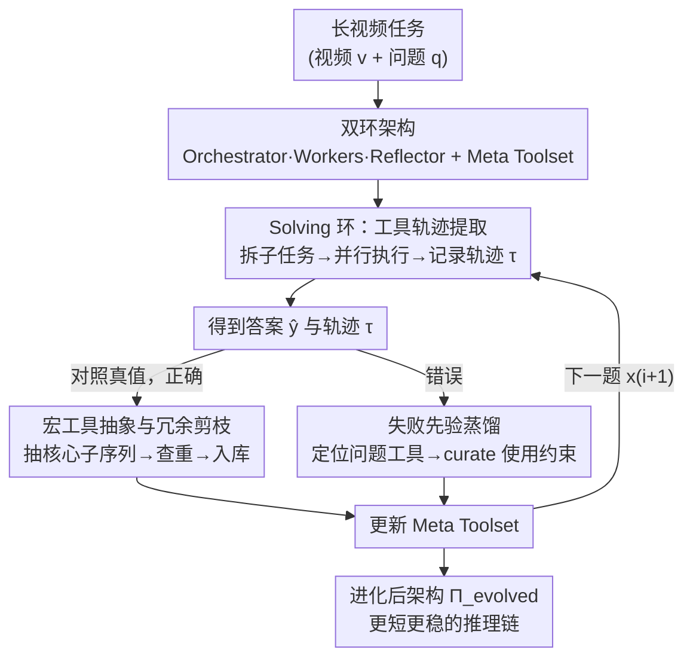

# META: Meta Evolution of Tool Trajectory Adaptation for Long-Video Understanding

**会议**: CVPR 2026  
**论文**: [CVF Open Access](https://openaccess.thecvf.com/content/CVPR2026/html/Huang_META_Meta_Evolution_of_Tool_Trajectory_Adaptation_for_Long-Video_Understanding_CVPR_2026_paper.html)  
**领域**: 视频理解 / Agent  
**关键词**: 长视频理解, 工具智能体, 宏工具进化, 工具轨迹, 免训练

## 一句话总结
META 让一个免训练的视频理解 agent 在反复解题中"自我进化工具箱"——把成功轨迹里反复出现的多步工具组合凝练成可复用的宏工具，把失败轨迹蒸馏成工具使用约束，不更新任何参数就在三个长视频 benchmark 上把强 VLM 提升 4.6%~7.6%。

## 研究背景与动机

**领域现状**：长视频理解（动辄数十分钟到 2 小时）目前有两条路。一条是端到端 MLLM（LLaVA-OneVision、Qwen2.5/3-VL 等）直接吞下采样帧；另一条是 agent 式工具流水线，把任务拆成子任务，调用 shot segmentation、object detection、tracking/ReID、OCR 这些"微工具"（micro-tool）去抠细粒度视觉证据，再用 LLM 做"think–act–reflect"循环推理。

**现有痛点**：agent 路线虽然能拿到细粒度信息，但**工具箱是静态的**——它不会随经验长大。每来一个新任务，agent 都要从零把"分镜 → 检测 → 跟踪/ReID"这样的长链微工具重新拼一遍。长视频里关键证据往往只在几小时画面里闪现几秒，而这种几十步的原子操作链一旦在某一步出小错，错误会沿着推理链不断累积放大，导致 drift 或幻觉。论文里那个定性例子很典型：baseline agent 为了找"她脱外套时介绍的是哪件首饰"，连发 10 次 `frame_query` 反复确认"她是不是正在脱外套"，全部 Failure，直到触顶调用次数任务失败。

**核心矛盾**：跨长视频任务里，像"分镜 → 物体检测 → 跟踪"这种多步工具轨迹模式其实**反复出现**，它本质是一种任务无关的感知技能；但现有系统只把它们当成一次性的孤立工具调用，没有任何机制去抽象、固化、复用这些多步结构。于是 agent 永远停在"工具使用者"，无法变成"工具创造者"。

**本文目标**：让 agent 能从自己过去的工具轨迹里学习——把反复出现的多步结构升格成更高层、可复用的能力，从而缩短推理链、抑制长程误差累积，且**不碰任何模型参数**（免训练、模型无关）。

**切入角度 / 核心 idea**：作者把"轨迹"本身当作监督信号。一句话概括就是——**用对自己工具轨迹的符号化反思，把成功模式抽象成宏工具、把失败模式蒸馏成失败先验**，让工具箱随解题经验持续"元进化"（meta-evolution）。

## 方法详解

### 整体框架

META 是一个多智能体架构 $\Pi_i = (\pi_o, \{\pi_w\}, A_i)$，由三类角色 + 一个会进化的工具箱组成，且**只有工具箱在变，所有 agent 都冻结**：

- **Orchestrator $\pi_o$**（冻结 VLM）：负责把任务拆成子任务、分派工具、判断证据是否够、最后给出答案；
- **Workers $\{\pi_w\}$**（冻结感知/VLM 模块）：每个 Worker 拿着分到的工具去视频上执行子任务，彼此独立、可并行；
- **Reflector $\pi_r$**（冻结）：解完一题后对轨迹做符号化分析，更新工具箱；
- **Meta Toolset $A_i$**：唯一会进化的部件，里面既有原子的微工具，也有逐渐长出来的宏工具（macro-tool）。

系统对一串任务 $Q=\{(x_i,y_i)\}_{i=1}^N$（$x_i=(v_i,q_i)$ 是视频+问题）做"解题→进化"的双环循环：先 **Solving** 跑出答案和工具轨迹 $(\hat{y}_i,\tau_i)=\mathrm{Sol}(\Pi_{i-1},x_i)$，再 **Evolving** 用轨迹和真值更新架构 $\Pi_i=\mathrm{Evo}(\Pi_{i-1},(x_i,y_i),\tau_i)$。初始 $A_0$ 里只有微工具，跑完全部任务后得到进化版 $\Pi_{\text{evolved}}=\Pi_N$，目标是它在同分布未见任务上泛化更好：

$$\max_{\text{META}}\ \mathbb{E}_{(x',y')\sim D}\big[\mathbb{I}(f_{\Pi_{\text{evolved}}}(x')=y')\big]$$

### 关键设计

**1. 双环架构：冻结 agent + 唯一可进化的工具箱**

要让 agent "免训练地变强"，最直接的诱惑是去微调模型，但那既贵又破坏了模型无关性。META 的取舍是：**把所有智能体冻结，让进化全部发生在工具箱这一层**。Orchestrator 负责决策（拆任务、判停、出答案），Workers 负责并行执行感知子任务，Reflector 负责事后反思改工具箱，四者职责分离。这样设计的妙处在于：能力的累积被外化成一个可读、可检索、可剪枝的符号化对象（工具列表 + 经验注记），而不是塞进模型权重里。也正因如此，进化出来的工具箱可以原样拔下来插到别的 agent 框架（ReAct、Plan&Execute）上用——能力是"可移植的技能"，不是"专属于某个模型的权重"。

**2. Solving 环：把一次解题落成结构化工具轨迹**

这个环要解决的是"如何在执行的同时，留下可供反思的证据链"。在第 $t$ 轮，Orchestrator 用分解策略 $\pi_o^{dec}$ 把问题和当前上下文 $C_t$ 映射成一组子任务–工具分配 $\{(s_j,A_j)\}_{j=1}^{n_t}=\pi_o^{dec}(q_i,C_t)$，其中 $s_j$ 是子指令、$A_j\subseteq A_{i-1}$ 是为该子任务选的工具。每个子任务交给一个 Worker 执行 $r_j=\pi_w^j(s_j,v_i,A_j)$，Workers 相互独立所以天然并行，对长视频证据收集很关键。结果聚合回共享上下文 $C_{t+1}=C_t\cup\{(s_j,r_j)\}_{j=1}^{n_t}$，再由 Orchestrator 判断证据是否已足够回答：$\text{Proceed}=\neg\pi_o^{judge}(C_{t+1},q_i)$，够了就出答案 $\hat{y}_i=\pi_o^{ans}(C_T,q_i)$，否则 $t\leftarrow t+1$ 继续。整个过程记录下结构化轨迹 $\tau_i=\{(s_j,A_j,r_j)\}_t$——它精确记下了"哪些微/宏工具以什么方式被组合调用"，正是 Evolving 环的监督信号。换句话说，Solving 不只是为了答题，更是为了**产出一份可被符号化分析的操作记录**。

**3. Evolving 环·正确轨迹：抽象宏工具并做冗余剪枝**

这是 META 变强的主引擎，针对的痛点是"反复出现的多步模式被当成一次性调用、白白浪费"。解完题先判对错 $z_i=\mathbb{I}(\hat{y}_i=y_i)$。当 $z_i=1$（答对），Reflector 从轨迹里抽出真正起作用的核心子序列并固化成一个新宏工具：

$$a_{\text{new}}=\mathrm{abstract}\big(\mathrm{extract\_core}(\tau_i)\big)$$

其中 $\mathrm{extract\_core}(\cdot)$ 会剔除冗余、失败、试探性的步骤，只保留那些"可证明对成功推理有贡献"的操作。关键是入库前要做**功能查重**，只有当新工具不被任何已有工具覆盖时才加入：

$$A_{i+1}=\begin{cases}A_i\cup\{a_{\text{new}}\}, & \text{若 }\forall a\in A_i,\ a_{\text{new}}\not\sqsubseteq a\\ A_i, & \text{否则}\end{cases}$$

正是这个 $\not\sqsubseteq$（不被包含）的查重，让工具箱不会为了拟合数据无限膨胀——实验里宏工具数量随样本增加先快后慢、最终收敛，说明它在"抽象可复用技能"而非"背任务专属流程"。宏工具把高频多步模式压成单个高层操作（如把 `dense_caption ⇒ clip_caption ⇒ slide_window` 压成一个 `locate_specific_action`），直接缩短了后续推理链。

**4. Evolving 环·失败轨迹：蒸馏结构化失败先验**

光会"做加法"还不够，agent 还得知道"什么时候某个工具不靠谱"。当 $z_i=0$（答错），Reflector 不去造新工具，而是定位出问题工具并蒸馏出一条结构化失败先验，刻画对应的失败条件/模式：

$$(a_{\text{problem}},e_{\text{new}})=\pi_{\text{ref}}^{distill}(\tau_i)$$

然后**按工具粒度**更新经验库 $E$，只动那个出问题的工具：

$$E_{i+1}(a)=\begin{cases}\mathrm{curate}(E_i(a),e_{\text{new}}), & \text{若 }a=a_{\text{problem}}\\ E_i(a), & \text{否则}\end{cases}$$

这里 $E_i(a)$ 是挂在工具 $a$ 上的经验库（与工具箱 $A_i$ 一一对应）。这些先验会以 "Experience Note" 的形式写进工具描述（例如 OCR 工具的注记"设 `extract_all=False` 可能漏掉细节信息"、`locate_specific_action` 的"避免用模糊词描述动作以免检索出错"），直接收窄了后续工具的使用边界。正负两路一起作用：正确轨迹让工具箱长出新能力，失败轨迹给每个工具加上"使用说明书"，二者叠加才让轨迹越来越短、越来越稳。论文还报告随着宏工具涌现，Worker 的平均轨迹长度下降了 **25.9%**，宏工具使用率和轨迹长度最终都收敛（约 0.6 和 3.5），佐证它学到的是可复用技能。

## 实验关键数据

### 主实验

三个长视频 benchmark：Video-MME（254 小时、2700 个多模态 QA）、MLVU（分钟到 2 小时、9 类下游任务）、LongVideoBench（最长 1 小时、6678 道选择题）。指标分别为 M-Avg / Avg(无字幕) / Total Avg Acc。META 接在 Qwen2.5-VL-7B 和 Qwen3-VL-8B 上都稳超同规模方法。

| 方法 | 参数 | MLVU | Video-MME | LongVideoBench |
|------|------|------|-----------|----------------|
| Qwen2.5-VL-Instruct | 7B | 68.8 | 65.1 | 56.0 |
| Qwen3-VL-Instruct | 8B | 78.1 | 71.4 | 58.0 |
| VideoRAG | 7B | 72.4 | 62.1 | 58.7 |
| Vgent | 7B | 72.1 | 68.9 | 59.7 |
| VideoLucy | 7B | 76.1 | 72.5 | 58.8 |
| **Qwen2.5-VL + META** | 7B | 78.0 | 73.7 | 61.9 |
| **Qwen3-VL + META** | 8B | **83.6** | **77.7** | **63.6** |

相对各自 backbone，META 在 MLVU/Video-MME/LongVideoBench 上分别带来约 +4.6% / +5.9% / +7.6% 的提升，且在最考验长程稳定推理的 LongVideoBench 上增益最大——正切中"宏工具压缩长链、抑制 drift"的设计意图。

### 消融实验

逐组件加上去（Qwen3-VL-8B），看 Orchestrator-Worker 框架、微工具进化、宏工具进化各自的贡献：

| Orch-Worker | 微工具进化 | 宏工具进化 | MLVU | Video-MME |
|:---:|:---:|:---:|------|-----------|
| – | – | – | 78.1 | 71.4 |
| ✓ | – | – | 80.8 | 73.5 |
| ✓ | ✓ | – | 81.9 | 75.7 |
| ✓ | – | ✓ | 83.0 | 76.6 |
| ✓ | ✓ | ✓ | **83.6** | **77.7** |

只上 Orchestrator-Worker 框架先拿到 +2.7/+2.1；再开微/宏工具进化继续涨，**宏工具进化的贡献尤其突出**（单开宏工具进化 83.0 比单开微工具进化 81.9 更高），印证"把多步模式抽象成宏工具"才是核心增益来源。

### 进化迭代与鲁棒性

| 设置 | MLVU | Video-MME |
|------|------|-----------|
| 迭代 1 轮 | 79.7 | 72.5 |
| 迭代 3 轮 | 83.6 | 77.7 |
| 迭代 5 轮 | 83.8 | 78.0 |
| Reflector 用 Qwen3-8B（弱） | 81.6 | 75.8 |
| Reflector 用 235B（强） | 83.6 | 77.7 |

迭代到 3 轮后基本收敛（默认设 3 轮），因为 META 不会重复添加同功能宏工具，同数据集上进化收益递减。组件换 LLM 的消融显示：**把 Reflector 从强模型换成弱模型掉点最明显**，说明"从轨迹里提炼经验"比执行更难、更吃高层能力，高质量经验是持续进化的核心。

### 关键发现

- **宏工具进化 > 微工具进化**：消融里宏工具单独贡献更大，且其使用率随测试样本上升时模型相对 baseline 的优势持续扩大（Figure 3），轨迹长度同步降 25.9%（Figure 4），三者共同构成性能增益的因果链。
- **数据可扩展**：进化样本从 100 增到 1000，Qwen2.5-VL-7B 在 MLVU/Video-MME 上从 +1.8/+3.2 一路涨到 +8.5/+8.9；换到 Qwen3-VL-30B 仍有 +2.5/+4.6，说明对更大 backbone 也有效。
- **进化不靠刷测试集**：离线评测（在 1k CG-Bench 上进化、严格 train-test 隔离）和"无真值进化"（进化时不给 GT 标签）两种协议下增益依旧稳定，证明收益来自进化框架本身而非测试集适配。
- **宏工具会移植**：把 META 进化好的工具箱原样接到 ReAct、Plan&Execute 上（保留它们原本的规划/推理策略），两者都明显涨点（如 ReAct +3.3/+2.7、Plan&Execute +2.8/+2.5），说明宏工具是跨 agent 通用的高层技能，不是 META 工作流的专属产物。

### 宏工具的进化轨迹

定性上（Figure 6），宏工具的功能呈现清晰的成长：早期是把几个微工具线性拼接的"单任务组合"（如 `summarize_video_by_sampling`）；之后升级为单任务内协调多条微工具流水线的"多步宏工具"（如 `generate_contextual_item_verification_report`）；最高层泛化成"交叉校验"模式（如 `cross_validate_video_query`），并行交叉引用多条微工具流水线、评估答案可靠性、检测潜在幻觉——反映出从"功能封装"到"系统级鲁棒性/可信度"的目标迁移。

## 亮点与洞察

- **把"轨迹"当一等公民**：大多数 agent 把工具调用记录当临时草稿，META 却把结构化轨迹 $\tau_i=\{(s_j,A_j,r_j)\}$ 当成核心监督信号——成功轨迹喂给"抽象宏工具"、失败轨迹喂给"蒸馏失败先验"。这个视角让"经验"变成可读可剪枝的符号对象，而非黑箱权重，可直接迁移到任意需要工具学习的 agent。
- **进化只发生在工具箱、模型全冻结**：能力增长被外化成符号化的工具列表 + 经验注记，因此天然模型无关、可移植（拔下来插到 ReAct/Plan&Execute 上照样涨点）。这对"不想/不能微调大模型"的落地场景极有吸引力。
- **冗余查重是防膨胀的关键开关**：$a_{\text{new}}\not\sqsubseteq a$ 这一步看似不起眼，却是宏工具数量能收敛、增益不退化的根本原因——它把"无限造工具拟合数据"和"抽象可复用技能"区分开。这个"加新能力前先查重"的思路可迁移到任何记忆/技能库系统。
- **正负双路反思的分工很干净**：对了就做加法（造宏工具）、错了就做约束（加失败先验到具体工具），两路都不碰参数却互补，把长链推理的"误差累积"从两个方向同时压下去。

## 局限与展望

- **进化只停在工具层**：作者自己承认，META 进化的是工具箱，但 Orchestrator/Workers 的架构本身是固定的；未来想做"结构进化"——让一个 Meta-Agent 的架构本身随长视频任务需求自适应。
- **强依赖 Reflector 的高层能力**：消融显示弱 Reflector 掉点最多，意味着这套自进化要工作，得有一个足够强的反思模型（论文用 Qwen3-235B-A22B），在算力受限场景下可能打折扣。
- **同数据集收益递减**：迭代超过 3 轮后基本收敛、宏工具不再新增，说明在固定分布上进化空间有限；跨分布/持续开放世界下能否持续进化，论文未充分验证。
- **正确性信号依赖真值**：核心 Evolving 用 $z_i=\mathbb{I}(\hat{y}_i=y_i)$ 判对错来触发造工具/加约束。虽然"无真值进化"实验显示去掉 GT 仍有增益，但只小幅下降的原因、以及无 GT 时如何可靠判对错，论文交代得不够细。

## 相关工作与启发

- **vs 静态工具 agent（VideoAgent / Deep Video Discovery / VideoRAG / Vgent / VideoLucy）**：它们都在"think–act–reflect"里调用固定工具箱，工具集不随经验长大；META 的区别是让工具箱自我进化，把高频多步模式固化成宏工具，从根上缩短推理链、压住长程 drift。
- **vs Agent 进化类工作（Alita / Memento）**：Alita 靠动态生成 MCP 实现自进化、Memento 靠记忆式在线 RL 免微调适配，都验证了"免训练、经验驱动"的可行；META 把这条路专门带到长视频这种多模态、长时依赖场景，并显式建模工具的使用边界（失败先验），这是文本/短程任务方法所缺的。
- **vs 端到端长视频 MLLM（LLaVA-NeXT-Video / InternVL3 / Qwen-VL 系列）**：端到端模型直接吞采样帧、能力固化在权重里；META 在不改权重的前提下，用工具级进化把同一 backbone 的长视频准确率拉高一截，证明"工具能力的进化"是一条与"模型能力"正交、可叠加的提升维度。

## 评分
- 新颖性: ⭐⭐⭐⭐⭐ 首个免训练、工具级元进化框架，"成功抽宏工具 / 失败蒸先验"的双路符号反思视角新颖且自洽。
- 实验充分度: ⭐⭐⭐⭐ 三 benchmark + 组件/迭代/LLM/样本量/评测协议/可移植性多维消融扎实；但只在 Qwen 系 backbone 验证，跨家族泛化和无 GT 机制细节略欠。
- 写作质量: ⭐⭐⭐⭐ 动机—方法—证据链条清晰，公式与定性案例配合好；个别符号（如经验库 $E_i$ 与工具箱 $A_i$ 的关系）首次出现略突兀。
- 价值: ⭐⭐⭐⭐⭐ 免训练、模型无关、工具可移植，对长视频 agent 落地和"经验驱动自进化"研究都有直接借鉴意义。

<!-- RELATED:START -->

## 相关论文

- [\[CVPR 2026\] VideoSeek: Long-Horizon Video Agent with Tool-Guided Seeking](videoseek_long-horizon_video_agent_with_tool-guided_seeking.md)
- [\[CVPR 2026\] Video Panels for Long Video Understanding](video_panels_for_long_video_understanding.md)
- [\[CVPR 2026\] LongVT: Incentivizing "Thinking with Long Videos" via Native Tool Calling](longvt_incentivizing_thinking_with_long_videos_via_native_tool_calling.md)
- [\[CVPR 2026\] TrajTok: Learning Trajectory Tokens Enhances Video Understanding](trajtok_learning_trajectory_tokens_enables_better_video_understanding.md)
- [\[CVPR 2026\] Efficient Frame Selection for Long Video Understanding via Reinforcement Learning](efficient_frame_selection_for_long_video_understanding_via_reinforcement_learnin.md)

<!-- RELATED:END -->
