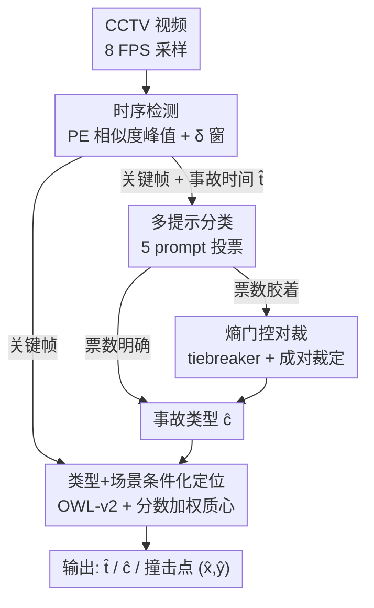

# Metadata-Aware Multi-Prompt Reasoning for Zero-Shot Accident Understanding

**会议**: CVPR 2026  
**arXiv**: [2606.12047](https://arxiv.org/abs/2606.12047)  
**代码**: 无  
**领域**: 视频理解 / 多模态VLM / 交通事故理解  
**关键词**: 零样本事故理解、任务分解、多提示推理、开放词表检测、时序定位

## 一句话总结
本文把"看监控视频理解交通事故"拆成 when/what/where 三个独立子任务——先用视觉-语言相似度框出撞击时刻、再用 5 个互补提示 + 熵门控对裁判定事故类型、最后用事故类型和场景条件化的开放词表检测器定位撞击点，全程零微调、单张 24GB 显卡可跑，在 ACCIDENT@CVPR 2026 上把调和平均分从画面中心 baseline 的 0.349 提到 0.402。

## 研究背景与动机
**领域现状**：监控/行车记录仪里的交通事故分析，传统做法（DSAR-NN、CADP、DoTA、TAD 等）主要回答"有没有发生事故"以及"事故什么时候发生"，事故**类型**常被当成附属标签，撞击**位置**更是很少被显式建模。而 ACCIDENT@CVPR 2026 挑战赛要求一次性输出三件事：事故时间、碰撞类型（rear-end / T-bone / head-on / sideswipe / single）、撞击点像素坐标。

**现有痛点**：视觉-语言模型（VLM）天然适合用文本 query 解读视觉证据，但如果把事故分析写成**一条端到端的整句 prompt** 让模型一次回答全部问题，模型要同时做多个复杂判断，输出非常不稳定，且容易走捷径——盯着画面里显眼的车或背景线索，而不是真正发生交互的那两个路面主体。事故类别本身就视觉相似，决定性的撞击又往往只出现在几帧里，更放大了这个问题。

**核心矛盾**：单次整体 prompt 让 VLM 既要定时间、又要分类型、又要定位置，三个目标互相干扰，单点错误会污染整个输出；而真实 CCTV 画面低分辨率、有压缩伪影、遮挡、镜头俯角浅，更不允许这种"一锅炖"。

**本文目标**：在没有任何真实世界标注（只有 CARLA 合成开发集）的零样本设定下，把"何时撞、撞的什么、撞在哪"三件事**解耦**，每个子任务用最合适的工具和最聚焦的 query 单独解决。

**核心 idea**：用 when→what→where 三阶段流水线代替单条端到端 prompt——每一阶段输入更窄、问题更具体，于是 VLM 推理更可靠、且每一阶段可独立替换升级。

## 方法详解

### 整体框架
系统是一条三阶段串行流水线，输入一段定点 CCTV 视频，输出 (事故时间 $\hat{t}$、事故类型 $\hat{c}$、撞击点 $(\hat{x},\hat{y})$)。**when 阶段**用 Meta 的 Perception Encoder（类 CLIP 的对比式视觉-语言模型）给每帧打"和 traffic accident 文本的相似度"分，挑出峰值帧并向两侧各扩 $\delta=2$ 秒，得到一个以撞击为中心的短时间窗，时间取窗中点；窗内的关键帧同时喂给后两阶段。**what 阶段**在这些关键帧上用 5 个互补结构化 prompt 查询 Qwen-3.5-VL 9B 投票分类，票数胶着时再用熵/边际门控触发轻量对裁。**where 阶段**用预测出的事故类型 + 场景布局条件化 OWL-v2 开放词表检测器，跨关键帧聚合检测框、取分数加权质心作为撞击点。三阶段只用开源权重、不微调。

### 关键设计

**1. 时序检测：用语义相似度峰值 + δ 扩窗把事故"框"出来**

事故在监控里时间上是稀疏的，绝大多数帧对 VLM 毫无信息量，直接全片喂模型既贵又被无关帧带偏。本文先用 Perception Encoder（PE-Core-G14-448）把 8 FPS 采样的每帧 $f_i$ 编码成 $\mathbf{v}_i$，把文本 query "traffic accident" 编码成 $\mathbf{t}$，算余弦相似度 $s_i=\frac{\mathbf{v}_i^\top \mathbf{t}}{\|\mathbf{v}_i\|\,\|\mathbf{t}\|}$，按 $s_i$ 降序取 top-5 峰值帧（同分取更早时间戳）。关键在于不直接信单帧，而是把这些峰值时间戳的最早 $\min_j\tau_j$ 和最晚 $\max_j\tau_j$ 各向外扩 $\delta=2$ 秒得到时间窗 $[\min_j\tau_j-\delta,\ \max_j\tau_j+\delta]$，事故时间取窗中点 $\hat{t}=\frac{\min_j\tau_j+\max_j\tau_j}{2}$。这样既保留了撞击周围的上下文、又丢掉大部分无关帧；消融显示这个 δ 扩窗比"只取 PE top-1 帧"高 0.039，说明最高相似度的单帧其实是个很噪的时间估计，扩窗起到了平滑作用

**2. 结构化多提示分类 + 熵门控对裁：用互补视角投票，只在真胶着时才花更多算力**

事故类别取决于很多不同线索——车辆运动、接触几何、撞击角度、单车还是多车，单个 prompt 抓不全，所以本文对同一组关键帧 + 元数据 $M$（场景布局、天气、时段、画质）用 5 个互补 prompt 查询 Qwen-3.5-VL 9B：直接分类、时序运动、几何接触推理、对比排除、tiebreaker，每个 prompt 给出一个类别 $y_i=p_i(\mathcal{F}_{\text{key}},M)$。痛点是直接多数投票在票数分散时（比如 2:2:1）很不可靠。本文用**不确定性感知聚合**：统计每类票数 $n_c$，算 top-2 边际 $m=n_{(1)}-n_{(2)}$ 和归一化熵 $\tilde{H}=-\frac{1}{\log_2 K}\sum_c \hat{p}_c\log_2\hat{p}_c$（$\hat{p}_c=n_c/|\mathcal{Y}|$，$K$ 为出现的不同类数）。若 $m>\tau_m$ 或 $\tilde{H}\le\tau_H$（默认 $\tau_m{=}2,\tau_H{=}0.75$），直接返回多数类；否则才两级升级，且都只在至多 6 帧均匀子集上跑：(i) 加一个 tiebreaker prompt 投一票后重新多数表决；(ii) 仍胶着就对 top-2 类 $(c_1,c_2)$ 做一次聚焦的**成对裁定**（条件化撞击几何和接触点），裁定结果只要落在 $\{c_1,c_2\}$ 内就覆盖多数票。这套门控的巧妙在于：明确的样本走廉价快路，只有真正模糊的样本才付出额外推理，且全程不需要标注校准数据

**3. 类型+场景条件化定位：用事故类型把检测器从"找车"扭向"找撞击点"**

撞击位置定位的难点是，如果拿"car crash"这种泛词去查开放词表检测器，它会把画面里每辆车都圈出来（前景偏置），质心落在最显眼的车而非真正接触区。本文用 Stage 2 预测的类型 $\hat{c}$ 和从元数据恢复的场景布局 $\ell$（高速、信号交叉口等）来条件化 OWL-v2 的 query：基础短语按类型定制（rear-end 用 "car crashing into back of another car"、T-bone 用 "side impact crash"），再缀上场景短语如 "on a highway"。这把检测器引向接触区域而非满场的车。对每个关键帧 OWL-v2 返回带置信度 $s_\ell$ 的框，保留 $s_\ell>\theta=0.05$ 的，跨所有关键帧汇总后取分数 top-$K$（$K{=}5$）框，撞击点取分数加权质心 $\hat{x}=\frac{\sum_\ell s_\ell c^x_\ell}{\sum_\ell s_\ell}$、$\hat{y}$ 同理（$c^x_\ell,c^y_\ell$ 为框中心）。这种加权聚合隐式强制了时序一致性——在多帧里都被自信检出的区域主导质心，偶发误检被压低权重。消融里这一阶段贡献最大，比画面中心 baseline 高 0.053

### 损失函数 / 训练策略
全流程零训练、零微调，只用开源权重模型推理。Stage 1 用 PE-Core-G14-448 半精度、8 FPS；Stage 2 用 Ollama 本地服务的 qwen3.5vl:9b（4-bit 量化、num_ctx=12288、temperature 0.2），每段至多 8 个运动评分关键帧 + 5 prompt；Stage 3 用 owlv2-base-patch16-ensemble，score 阈值 0.05、top-5 聚合。全部跑在单张 NVIDIA L4 24GB 上。

## 实验关键数据

### 主实验
数据集为零样本 ACCIDENT@CVPR 2026：只给 CARLA 合成开发集（含碰撞时间、撞击坐标、类型、逐帧框），测试在真实定点 CCTV 片段上。评测三个 $[0,1]$ 分数——时序分 $\mathcal{T}$、空间分 $\mathcal{S}$（均为基于误差的高斯式相似度）、分类分 $\mathcal{C}$（top-1 准确率），最终榜分取调和平均 $\text{score}=\frac{3}{1/\mathcal{T}+1/\mathcal{S}+1/\mathcal{C}}$。

| 方法 | Public LB | Private LB | $\mathcal{C}$ | $\mathcal{T}$ | $\mathcal{S}$ |
|------|-----------|------------|------|------|------|
| Baseline A（中点时间+画面中心） | 0.2714 | 0.2734 | 0.5807 | 0.1896 | 0.2505 |
| Baseline B（四分点时间+画面中心） | 0.3107 | 0.3188 | 0.5807 | 0.2664 | 0.2505 |
| **本文** | **0.3852** | **0.4015** | 0.5057 | 0.3689 | 0.3498 |

注：本文的分类分 $\mathcal{C}$（0.5057）反而**低于** baseline 的 0.5807——⚠️ 这点论文未明确解释，可能是 baseline 固定猜某高频类碰巧分类分更高；但本文在 $\mathcal{T}$（0.19→0.37）和 $\mathcal{S}$（0.25→0.35）上的大幅提升把调和平均拉了上去。

### 消融实验
所有消融只动一个组件、另两个保持完整配置，因榜单只回传调和平均，故只报这一个指标。

| 阶段 | 变体 | Public | Private |
|------|------|--------|---------|
| 时序 | Uniform midpoint | 0.3444 | 0.3592 |
| 时序 | PE Top-1 frame | 0.3435 | 0.3627 |
| 时序 | **PE δ-window 中点（本文）** | **0.3852** | **0.4015** |
| 分类 | 1-prompt structured | 0.3801 | 0.3961 |
| 分类 | 3-prompt 多数投票 | 0.3809 | 0.3978 |
| 分类 | 5-prompt + tiebreaker | 0.3849 | 0.4001 |
| 分类 | **+ 熵门控成对裁定（本文）** | **0.3852** | **0.4015** |
| 空间 | Molmo2 pointing | 0.2589 | 0.2647 |
| 空间 | 画面中心 (0.5, 0.5) | 0.3358 | 0.3487 |
| 空间 | **OWL-v2 类型+场景条件化（本文）** | **0.3852** | **0.4015** |

### 关键发现
- **空间定位贡献最大**：OWL-v2 类型+场景条件化比画面中心 baseline 高 0.053，是三阶段里增益最大的；有趣的是直接用 Molmo2 pointing（0.265）反而比画面中心（0.349）还差，印证了 pointing 模型的前景偏置——会指向最显眼的车而非接触区。
- **时序扩窗次之**：δ 扩窗比 PE top-1 帧高 0.039，说明单帧时间估计太噪，向两侧扩 2 秒做平滑很关键。
- **分类集成增益最小但稳定**：从单 prompt 到全套熵门控对裁只涨 0.0054，是三者中最小的，符合"分类只是流水线一环、且 baseline 分类分本就不低"的预期。
- **残差错误集中在两类场景**：远距离碰撞（OWL-v2 漏检或选了前景车）和恶劣拍摄条件（雨、夜、遮挡）。

## 亮点与洞察
- **任务分解 + 工具专精**：把 VLM 不擅长的端到端整句推理拆成"对比模型定时间 / 生成式 VLM 定类型 / 开放词表检测器定位置"，每个子任务交给最合适的现成模型，零微调就能在真实 CCTV 上打过 baseline——这是把"用对工具"做到极致的工程范式。
- **熵门控自适应算力**：用边际 $m$ 和归一化熵 $\tilde{H}$ 做门控，明确样本走快路、只有真胶着才升级到 tiebreaker 和成对裁定，避免对每个样本都做昂贵的全套裁定，是"不确定性感知预算分配"的简洁实现，可直接迁移到任何多投票分类场景。
- **条件化 query 治前景偏置**：用上游预测的类型反过来条件化下游检测器的文本 query，把"找所有车"变成"找这种撞击的接触区"，几乎零成本地缓解了 pointing/检测模型的前景偏置——这个"用语义类型引导空间定位"的思路对任何 grounding 任务都有借鉴价值。
- **分数加权质心隐式时序一致**：跨帧自信检出的区域主导质心、偶发误检被自动降权，不需要显式的时序平滑模块。

## 局限与展望
- **作者承认的局限**：远距离碰撞下 OWL-v2 会漏检或选错前景车；雨/夜/遮挡等恶劣条件下整体退化明显。
- **分类分倒退未解释**：本文 $\mathcal{C}=0.5057$ 低于 baseline 的 0.5807（⚠️ 论文未给出原因），说明五提示集成在分类这一维上并未真正超过简单基线，最终优势主要来自时序和空间两维——分类模块的价值存疑。
- **强依赖元数据**：what/where 两阶段都吃场景布局、天气、时段等元数据条件化，若部署环境无这些元数据，条件化 prompt 退化为泛词，前景偏置可能回潮。
- **门控阈值靠经验**：$\tau_m{=}2,\tau_H{=}0.75$ 等阈值在零样本设定下无标注可校准，泛化到其他事故分布时是否仍最优未验证。
- **改进思路**：可引入显式的远距离/小目标检测分支或多尺度 query 来救远距离碰撞；用合成 CARLA 集做一次轻量校准来定门控阈值。

## 相关工作与启发
- **vs DRAMA**：DRAMA 也用"是什么/在哪/为何重要"的结构化提问来改善风险物体定位与解释，但它面向有监督的风险物体推理；本文借用同样的分解原则，但落到**零样本事故理解**的 when/what/where，且每阶段换成对应的专精模型。
- **vs Thakur & Talele（并行工作）**：他们用多提示文本描述 + CLIP 式检索做零样本事故分类；本文则把结构化 prompt 当成**生成式 VLM 的互补推理视角**，再叠投票聚合和成对裁定，且把分类嵌进"先感知后定位"的完整流水线里。
- **vs 自洽/思维树等 prompting**：本文的多提示投票 + 对裁继承了 chain-of-thought、self-consistency、Tree of Thoughts、Ask Me Anything 的"多重表述+中间推理提鲁棒"思想，但创新在于把它放进一个**先时序选帧、再分类、再空间 grounding** 的感知优先管线，而非纯文本推理。

## 评分
- 新颖性: ⭐⭐⭐ 单个组件都是现成模型，创新在于 when/what/where 分解 + 熵门控对裁 + 类型条件化定位的组合，工程巧思多于方法突破
- 实验充分度: ⭐⭐⭐ 三阶段逐项消融清晰，但只在单个 benchmark、且榜单只回传调和平均，缺少更细粒度分析
- 写作质量: ⭐⭐⭐⭐ 结构清楚、公式完整、动机和消融对应得上
- 价值: ⭐⭐⭐⭐ 给出一套零微调、单卡可跑、每阶段可替换的实用零样本事故理解流水线，工程落地价值高

<!-- RELATED:START -->

## 相关论文

- [\[CVPR 2026\] SkeletonContext: Skeleton-side Context Prompt Learning for Zero-Shot Skeleton-based Action Recognition](skeletoncontext_skeleton-side_context_prompt_learning_for_zero-shot_skeleton-bas.md)
- [\[CVPR 2026\] Protect to Adapt: Orthogonal Subspace Control with Ranked Negative-Prompt Curriculum for Few-Shot Action Recognition](protect_to_adapt_orthogonal_subspace_control_with_ranked_negative-prompt_curricu.md)
- [\[CVPR 2026\] No Need For Real Anomaly: MLLM Empowered Zero-Shot Video Anomaly Detection](no_need_for_real_anomaly_mllm_empowered_zero-shot_video_anomaly_detection.md)
- [\[CVPR 2026\] TF-CADE: Foreground-Concentrated Text-Video Alignment for Zero-Shot Temporal Action Detection](tf-cade_foreground-concentrated_text-video_alignment_for_zero-shot_temporal_acti.md)
- [\[CVPR 2026\] Memory Matters: Boosting Training-Free Zero-Shot Temporal Action Localization with a Learnable Lookup Table](memory_matters_boosting_training-free_zero-shot_temporal_action_localization_wit.md)

<!-- RELATED:END -->
