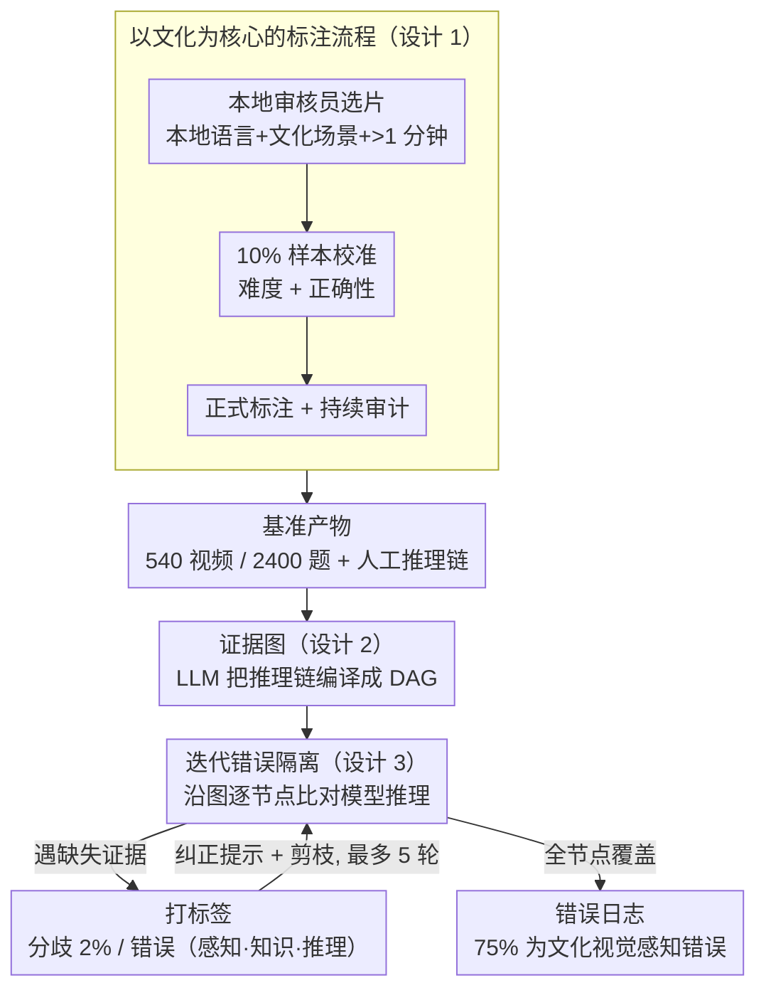

# MINERVA-Cultural: A Benchmark for Cultural and Multilingual Long Video Reasoning

**会议**: CVPR 2026  
**arXiv**: [2601.10649](https://arxiv.org/abs/2601.10649)  
**代码**: 即将公开  
**领域**: 视频理解 / 多文化基准  
**关键词**: 视频问答, 多文化理解, 多语言推理, 长视频, 证据图错误分析

## 一句话总结

提出 MINERVA-Cultural 基准，包含 18 个语种/地区的 2400 个人工标注视频推理问题，通过证据图（evidence graph）和迭代错误隔离策略揭示当前 SOTA Video-LLM 在文化视觉感知上的严重不足（最强模型 Gemini-2.5-Pro 仅 45.07% vs 人类 95.22%）。

## 研究背景与动机

1. **领域现状**：视频理解取得显著进展，长视频理解成为热点。EgoSchema、LongVideoBench、MLVU 等基准推动了模型发展。GPT-5、Gemini-2.5 等前沿模型在标准基准上表现强劲。

2. **现有痛点**：(a) 现有视频基准以西方内容和英语为主导，引入严重的评估偏差；(b) 跨文化基准如 ViMUL-Bench 依赖自动翻译，且视觉内容仍为西方概念；(c) 仅关注最终答案的正确性，忽略推理过程中的具体失败模式。

3. **核心矛盾**：模型在训练数据中欧美/英语内容占主导，导致对低资源语言和文化（如泰米尔语、泰卢固语）的理解严重不足。而简单的准确率指标无法揭示"模型到底在哪一步出了错"。

4. **本文目标** (a) 构建真正由本地专家标注的多文化多语言视频推理基准；(b) 提供人工推理链作为诊断工具；(c) 开发细粒度错误分析方法定位模型失败原因。

5. **切入角度**：要求每个问题都必须具备"视觉文化理解"技能，将感知与文化紧密绑定。通过有向无环图（DAG）建模人工推理过程，迭代式地隔离和分类错误。

6. **核心 idea**：用 18 个地区本地专家全人工标注（非翻译）的长视频推理基准+证据图迭代分析方法，暴露并量化 Video-LLM 在文化视觉感知上的系统性不足。

## 方法详解

### 整体框架

这篇工作想回答一个被现有视频基准回避的问题：当前 Video-LLM 在“非西方、非英语”的文化视频上到底能推理到什么程度，又是在哪一步出错的。为此它交付两样东西。一是基准本身——540 个视频、2400 个问题，覆盖 18 个语种/地区、6 大文化领域，每个问题都配一条由本地专家手写的多步推理链，而不是只给一个标准答案。二是配套的诊断方法：先把那条人工推理链编译成一张证据图（evidence graph），再让模型作答，然后沿着这张图把模型的推理逐节点和人工证据对齐，用迭代错误隔离的方式把模型每一处失败都揪出来并归类。前者保证“题目真的需要看懂文化视觉”，后者保证“我们能说清模型错在感知还是错在推理”。

### 关键设计

**1. 以文化为核心的标注流程：让“看懂文化视觉”成为答题的硬门槛**

很多号称跨文化的基准其实是“英文题目自动翻译 + 西方图像”的伪多文化，模型靠常识或音频就能蒙对，根本测不到文化视觉理解。本文用一条四阶段流水线堵住这些捷径：先由本地审核员按文化分类法从 YouTube 选片，硬性要求本地语言、含文化场景、时长超 1 分钟；再做难度校准，拿 10% 样本先标，确认问题对 LLM 足够难——不能靠单帧看出、不能只听音频、不能凭常识推；接着做正确性校准，让独立审核员在看不到答案的情况下重新作答，出现分歧就反复修订直到达成共识；最后才进入正式标注和审计。每道题都被强制至少需要两种推理技能，且其中必须包含“视觉文化理解”这一项，从源头上把感知和文化绑死。

**2. 证据图：把人工推理链编译成可定位错误的有向无环图**

光看最终准确率，你分不清模型是“压根没看见那件文化服饰”还是“看见了但逻辑推错”。证据图就是为了把这两类错误拆开。具体做法是用 LLM 把人工写的推理链拆成原子证据节点——带时间戳的视觉观察、外部知识检索、逻辑推理三类，节点之间连上前提依赖边：上游证据一旦错了，依赖它的下游推理就被阻断。这样一条线性的人类推理就变成了一张能表达因果依赖和时空关系的 DAG。统计上平均每题需要 5.0 个原子证据，其中 63% 直接挂在某个具体视频时间戳上——这也侧面说明题目确实压在视觉证据上，而非纯文本常识。

**3. 迭代错误隔离：避免早期错误把后面的失败一起“盖住”**

单次错误分析有个致命问题：模型一旦在前面踩错，后续推理全建立在错的前提上，你只看得到第一个错，后面真正的推理缺陷被感知错误遮住了。迭代错误隔离用一个三阶段循环来穷举所有失败模式：先沿证据图把模型推理和人工证据逐节点比对，遇到缺失证据就停下；再给这一处打标签，区分“分歧”（模型走了另一条合理路径，只占约 2%）和“错误”（按分类法归到时间定位、空间定位、属性误识别、幻觉等）；然后给模型一条针对性纠正提示，把已评估的节点剪掉，让它在补正后的前提上继续评估剩下的节点。如此循环到所有节点都被覆盖，实测最多 5 轮就能处理 99.7% 的情况。这套迭代相比一次性分析多挖出了 22% 的错误，其中 78 个本来被感知错误盖住的推理错误得以浮出水面。举个具体的走法：一道题的证据图有若干节点，模型在“识别某仪式道具”这个视觉节点上先错了，第一轮就停在这里并标为属性误识别；第二轮喂入“该道具是什么”的纠正提示、剪掉该节点后继续，结果发现它在后续“由道具推断仪式含义”的推理节点上又错了一次——这第二处错误正是单次分析永远看不到的。

### 损失函数 / 训练策略

本文是基准论文，不涉及模型训练。评估侧用 LLM Judge（Gemini-2.5-Flash）对开放式回答在 0–2 三级量表上打分，并以多数投票缓解单次评估的偏差。

## 实验关键数据

### 主实验

**18 个地区的模型表现（准确率 %）：**

| 模型 | Aggregate | 最高地区 | 最低地区 |
|------|-----------|---------|---------|
| Qwen-2.5-VL | 12.75 | en-GB (25.70) | ta-IN (3.60) |
| Qwen-3-VL | 21.50 | en-GB (34.58) | te-IN (12.40) |
| Claude-Sonnet-4 | 23.36 | en-GB (29.91) | te-IN (14.40) |
| GPT-5-mini | 36.64 | ko-KR (51.90) | ta-IN (16.40) |
| GPT-5 | 42.20 | id-ID (56.34) | te-IN (23.60) |
| Gemini-2.5-Flash | 35.84 | de-DE (51.90) | ta-IN (20.00) |
| **Gemini-2.5-Pro** | **45.07** | **ko-KR (64.29)** | **te-IN (28.00)** |
| **人类基准** | **95.22** | it-IT (98.24) | de-DE (90.51) |

### 消融实验

| 分析维度 | 关键发现 |
|---------|---------|
| 音频 vs 纯视频 | 加入音频平均提升 4.32%（zh-TW +8.15%，id-ID +7.09%） |
| 思考预算 (token) | 128→2k token 准确率从 35.9% 升到 45.9%，之后饱和 |
| 帧数 (1→512) | 单调递增但增益递减，说明需要时序推理 |
| 错误类型分析 | 75% 错误归因于文化视觉感知（时间定位+空间定位+属性误识别+幻觉） |

### 关键发现

- **人机差距巨大**：最强 Gemini-2.5-Pro（45.07%）与人类（95.22%）差距达 50 个百分点
- **文化差异极其显著**：同一模型在韩语（ko-KR, 64.29%）和泰卢固语（te-IN, 28.00%）上的表现差距达 36 个百分点，暴露出严重的文化偏见
- **南印语言是重灾区**：ta-IN (31.60%)、te-IN (28.00%)、mr-IN (38.72%) 均远低于英语地区
- **75% 的错误是文化视觉感知**：不是推理能力不足，而是模型根本"看不见"或"看不懂"文化特定的视觉元素（服饰、仪式、标志等）
- **迭代错误分析至关重要**：22% 的错误在首次分析中被遗漏，尤其是推理错误被感知错误遮蔽
- **低资源语言感知错误是高资源的 1.4 倍**：ar-EG、ta-IN 的文化感知错误比 en-GB、ja-JP 等多 40%

## 亮点与洞察

- **"文化理解是视觉感知问题"的重要发现**：不是模型不会推理，而是模型看不见文化特定的视觉元素。这指出了改进方向——需要在预训练数据中增加文化多样性，而非仅提升推理能力
- **证据图+迭代错误隔离的诊断方法论**：远超简单准确率的分析深度。这套方法可迁移到任何需要多步推理的基准（如数学推理、代码生成）
- **完全人工标注的高标准**：每个问题由本地文化专家标注，经独立审核员校准，避免了翻译伪影。这是资源密集但对社区极有价值的贡献

## 局限与展望

- **规模有限**：2400 个问题 / 18 个地区，每个地区约 130 个问题，可能不足以覆盖所有文化场景
- **评估依赖 LLM Judge**：虽然使用多数投票缓解，但 LLM 评估本身可能对某些语言有偏见
- **未覆盖所有文化地区**：非洲、南美部分地区、东南亚小语种未纳入
- **可改进方向**：(a) 扩展到更多地区和语种；(b) 开发文化感知的视觉预训练数据策略；(c) 基于证据图的自动化诊断工具开源；(d) 探索在预训练数据中平衡文化分布的策略

## 相关工作与启发

- **vs ViMUL-Bench**: ViMUL-Bench 覆盖 14 个语种但混合使用了非文化视频+部分翻译标注，MINERVA-Cultural 完全用本地专家原语标注，且视频内容都是文化特定的
- **vs MINERVA**: MINERVA 提供推理链和错误分类，MINERVA-Cultural 在此基础上增加了多文化维度和证据图分析方法，诊断更精细
- **vs LongVideoBench/MLVU**: 这些基准关注通用视频理解，不涉及文化和多语言维度，MINERVA-Cultural 补充了这一空白

## 评分

- 新颖性: ⭐⭐⭐⭐ 首个大规模全人工多文化多语言视频推理基准，证据图分析方法新颖
- 实验充分度: ⭐⭐⭐⭐⭐ 7 个模型、18 个地区、多维度分析（音频/帧数/思考预算/错误类型）、人类基准
- 写作质量: ⭐⭐⭐⭐⭐ 动机充分，标注流程描述详尽，分析深入且有洞察力
- 价值: ⭐⭐⭐⭐⭐ 暴露了 AI 系统的文化偏见，定义了模型改进的关键方向，对公平 AI 和全球化部署意义重大

<!-- RELATED:START -->

## 相关论文

- [\[CVPR 2026\] VideoARM: Agentic Reasoning over Hierarchical Memory for Long-Form Video Understanding](videoarm_agentic_reasoning_over_hierarchical_memory_for_long-form_video_understa.md)
- [\[CVPR 2026\] A Multi-Agent Perception-Action Alliance for Efficient Long Video Reasoning](a_multi-agent_perception-action_alliance_for_efficient_long_video_reasoning.md)
- [\[CVPR 2026\] MovieRecapsQA: A Multimodal Open-Ended Video Question-Answering Benchmark](movierecapsqa_a_multimodal_open-ended_video_question-answering_benchmark.md)
- [\[ACL 2026\] TemporalVLM: Video LLMs for Temporal Reasoning in Long Videos](../../ACL2026/video_understanding/temporalvlm_video_llms_for_temporal_reasoning_in_long_videos.md)
- [\[CVPR 2026\] HERBench: A Benchmark for Multi-Evidence Integration in Video Question Answering](herbench_a_benchmark_for_multi-evidence_integration_in_video_question_answering.md)

<!-- RELATED:END -->
