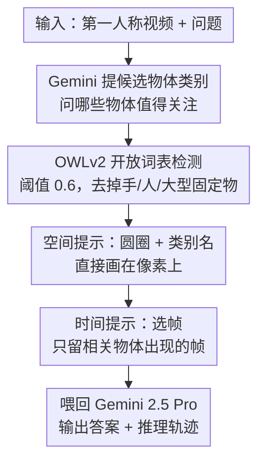

# Minerva-Ego: Spatiotemporal Hints for Egocentric Video Understanding

**会议**: CVPR 2026  
**论文**: [CVF Open Access](https://openaccess.thecvf.com/content/CVPR2026/html/Nagrani_Minerva-Ego_Spatiotemporal_Hints_for_Egocentric_Video_Understanding_CVPR_2026_paper.html)  
**代码**: https://github.com/google-deepmind/neptune (有)  
**领域**: 视频理解  
**关键词**: 第一人称视频, 视觉推理, 评测基准, 时空接地, 视觉提示

## 一句话总结
Minerva-Ego 是一个面向第一人称（egocentric）长视频复杂推理的评测基准——1,160 道纯人工标注的五选一难题，每题都配有把"何时（时间戳）"与"何处（分割掩码）"绑定起来的密集推理轨迹；作者用它揭示出 SOTA 视频模型（Gemini 2.5 Pro 仅 40.1%，人类 91.8%）的瓶颈主要在感知接地，并证明只要在像素上直接提示模型"看哪里、看哪一帧"，准确率最高可提升约 5.8%。

## 研究背景与动机

**领域现状**：视频推理模型是第一人称助理 / 具身智能体的核心组件。随着多模态 LLM 的兴起，模型已能处理小时级长视频，在 VideoMME、Neptune、LVBench 等基准上逐步逼近人类水平，并通过"思考"（推理时多花算力产生中间步骤）进一步提升表现。

**现有痛点**：现有评测几乎只看**最终答案对不对**，不评估**中间推理过程**，且答案大多只在文本域。即便是 EgoTempo 这类开始关注时间定位的工作，也无法评估"在长上下文里的推理"。更要命的是，主流推理评测（如 MINERVA）基本是 exocentric（第三人称、旁观视角），而第一人称视频充满近距离、高频率的物体交互——它要求模型**持续锁定关键物体**，这正是第三人称基准考不到的能力。

**核心矛盾**：当一道题只给最终答案的对错信号时，我们无法知道模型**到底错在哪一环**——是没看见正确物体（感知），还是看见了却定错了时间（时间接地），还是逻辑链断了。把这些错因混在一个 accuracy 数字里，评测就失去了诊断能力，也无法指导改进。

**本文目标**：(1) 造一个第一人称、长上下文、需要多步推理的高质量基准；(2) 让评测能拆解到"感知 / 时间 / 逻辑 / 完整性"四个维度；(3) 在不重训模型的前提下，验证"感知接地"是不是真正的瓶颈，并给出一条可落地的缓解路径。

**切入角度**：作者的关键观察是——既然第一人称推理的核心是"在正确的时刻盯住正确的物体"，那就把这一信息**显式标注出来**（时间戳 + 分割掩码组成的推理轨迹），既能用它做细粒度诊断，又能把它当成"提示"反向喂给模型来验证瓶颈。

**核心 idea**：用"密集时空接地的推理轨迹"替代"只有答案的标签"，从而把视频推理评测从单一 accuracy 升级为**可诊断评测**；并提出**时空提示（spatiotemporal hints）**——直接在像素上画出"看哪里"、用选帧控制"看哪一帧"——作为探测并缓解感知接地缺陷的手段。

## 方法详解

### 整体框架
本文有两条并列的线：一条是**基准与诊断评测**（数据怎么造、怎么把错因拆开看），另一条是**时空提示方法**（在推理时把"哪里 / 哪一帧"喂给冻结的前沿模型）。

基准侧：以高质量第一人称厨房数据集 HD-EPIC 为底，复用其物体分割掩码，由专业标注员纯手工写出 1,160 道五选一难题，并为每题写一条**推理轨迹**——它把答案推导的每一步绑定到具体时间戳和具体物体（物体又对应分割掩码）。这条轨迹是全文的"地基"：既支撑诊断式评测（按感知 / 时间 / 逻辑 / 完整性四维打分、再算物体召回率），又直接充当"提示"的来源。

方法侧：作者把上面的标注当成"哪里看 / 哪一帧看"的信号，**直接画在视频帧的像素上**喂给 Gemini 等冻结模型——空间上用圆圈圈出关键物体并写上类别名，时间上只保留关键物体出现的帧。先用 oracle（地面真值标注）验证上限，再换成一条**全自动 agentic 流水线**（Gemini 提类别 → OWLv2 开放词表检测 → 高亮 → 选帧 → 喂回 Gemini）验证可落地性。下图是这条实用流水线：

### 关键设计

**1. 时空接地的推理轨迹：把"哪里、哪一时刻"绑进标签**

针对"只有答案、无法诊断"的痛点，本文为每道题标注一条密集的推理轨迹：它是一串自然语言步骤，但每一步都**绑定到具体时间戳**（如"03:50 第二次冲洗鸡蛋"）和**具体物体**，而物体又链接到 HD-EPIC 的地面真值分割掩码。统计上，平均每题轨迹长 122 词、引用 6.3 个时间戳、2.8 个物体（多者达 20 个），视频长度从 10 秒跨到 75 分钟。这种结构的价值在于：它把"模型最终选了哪个选项"细化成"模型有没有在对的时刻看到对的物体"，让评测从单点变成可追溯的链路。与 VideoCoT、VideoEspresso 这类用冻结模型自动生成噪声轨迹的工作不同，本文是**纯人工标注**，用质量换可信度——这正是它敢用来当"诊断金标准"的底气。

**2. 三步纯人工流水线 + 模态偏置过滤：用质量而非规模取胜**

针对"半自动标注引入模型偏置、噪声大"的问题，作者刻意走"小而精"的路线，整条流水线全程人工：(i) **选取**——从 HD-EPIC 取视频，把已有的地面真值分割掩码叠加到帧上供标注员参考；(ii) **标注与核验**——专业标注员写问题、答案、轨迹，并被要求引用解题所需的关键物体；随后一组**独立标注员尝试作答**，对答错的题再由第三组标注员对照两份标注做**仲裁修订**（必要时改问题、改选项或改轨迹）；(iii) **后处理**——按既有最佳实践过滤掉"只看文本问答就能蒙对"的**模态偏置**题目。为控制大模型推理成本，整体规模被压到约 1,000 题。这套"作答—仲裁—去偏置"的闭环，是它区别于 EgoTaskQA、EgoMemoria 等机器生成基准的核心。

**3. MiRA 诊断式评估：把错因拆成感知 / 时间 / 逻辑 / 完整性四维**

针对"accuracy 把错因混成一个数字"的痛点，作者借用 MINERVA 的 MiRA 评分准则，用一个 LLM 按**感知正确性（Perceptual correctness）、时间接地（Temporal grounding）、逻辑推理（Logical reasoning）、完整性（Completeness）**四个维度，对模型生成的推理轨迹打 3 级 Likert 分；并额外计算**物体召回率**——把地面真值轨迹里的物体，看模型轨迹里召回了多少（object-level 用完整描述如"左半个苹果"匹配，noun-level 只匹配主名词如"苹果"）。结果一针见血：四个模型在逻辑推理和完整性上都不错，但**感知正确性最弱**，物体召回只有 20–50%。为排除打分器偏置，作者换 GPT-5 重评，模型排序保持一致。正是这个发现——"模型常常没盯对物体"——直接动机化了下面的时空提示方法。

**4. 时空提示注入：在像素上同时告诉模型"看哪里"和"看哪一帧"**

针对第 3 点暴露的感知接地缺陷，本文不改架构、不重训，而是**直接修改视觉输入**来探测并缓解它。空间上（"哪里"）：把关键物体用**红色掩码轮廓 / 框 / 椭圆圈**高亮，并写上**类别名**；实验发现"圆圈 + 类别名"最好——圈比框/掩码更自然（掩码有时噪声大、显得不自然），类别名单独就能带来 2.6–2.8% 提升。时间上（"哪一帧"）：在固定帧预算下，**优先保留相关物体出现的帧**，剩余预算再均匀采样，单这一项就带来约 2.9% 提升。两者正交，叠加后 oracle 设置下从 44.5% 提到 50.3%（+5.8%）。这一思路是把 Set-of-Mark 这类**单帧**视觉提示扩展到**时空域**——SoM 只解决"哪里"，本文额外解决长视频里物体进出视野、被遮挡、状态变化带来的"哪一帧"问题。落地版用 OWLv2 替代 oracle 掩码，仍能拿到 47.0%，证明这条路可在无地面真值时运行（但与 oracle 仍有差距，说明现成检测器的接地能力是新瓶颈）。

## 实验关键数据

### 主实验：SOTA 模型评测（仅看最终答案 MCQ 准确率）
五选一随机基线为 20%。除 Qwen 用全视频降到 1fps、人类看原始全帧率外，其余模型固定喂 64 帧。

| 模型 | 帧数 | Thinking | MCQ 准确率 |
|------|------|----------|-----------|
| Random | - | - | 20.0% |
| Qwen-3 | 全视频@1fps | 是 | 29.3% |
| Claude Sonnet 4 | 64 | 是 | 30.5% |
| Gemini 2.5 Flash | 64 | 否 | 31.7% |
| Gemini 2.5 Flash | 64 | 是 | 35.6% |
| GPT-4.1 | 64 | 否 | 30.8% |
| GPT-5 | 64 | 是 | 37.6% |
| **Gemini 2.5 Pro** | 64 | 是 | **40.1%** |
| **人类** | 全部 | 是 | **91.8%** |

最强模型 Gemini 2.5 Pro 也只有 40.1%，与人类 91.8% 差距巨大（约 50 个点）；开源 Qwen-3 接近 Claude / GPT-4.1。开启 thinking 对复杂题有明显帮助（Flash 从 31.7%→35.6%）。

### 帧数消融（仅 Gemini，因成本受限）

| 帧数 | Gemini 2.5 Flash（无 thinking） | Gemini 2.5 Pro |
|------|------|------|
| 0（仅 QA、无视觉） | 24.5% | 27.5% |
| 1 | 23.0% | 29.3% |
| 64 | 31.7% | 40.1% |
| 256 | 37.7% | 44.5% |
| 512 | 40.1% | 49.1% |
| 1024 | 40.8% | 49.8% |

只给问题不给画面时仅略高于随机，单帧也好不到哪去——**证明本数据集真正需要细粒度时序信息**；而且性能一路涨到 1024 帧仍未饱和（对比 MINERVA 约 256 帧就平台化），说明题目的时序密度很高。

### 时空提示消融（oracle，Gemini 2.5 Pro，256 帧）

| 可视化方式 | 无时间选帧 | 有时间选帧 |
|-----------|-----------|-----------|
| none（基线） | 44.5% | 47.4% |
| masks | 44.8% | 47.3% |
| boxes | 45.1% | 47.6% |
| circles | 45.9% | 48.6% |
| classes | 47.1% | 49.2% |
| **circles + classes** | 47.3% | **50.3%** |
| boxes + classes（文本形式） | 46.6% | 48.4% |

最佳组合"圆圈 + 类别名 + 时间选帧"达 50.3%（+5.8%）。把框和类别以**文本**形式穿插在帧之间，反而不如直接画在像素上——作者推测文本框格式更适配单图、不适配长视频。

### 落地版（OWLv2 预测物体）与汇总

| 设置 | Gemini 2.5 Pro 准确率 |
|------|------|
| 基线（256 帧） | 44.5% |
| + 空间提示 | 44.8% |
| + 时间提示 | 47.0% |
| + 空间提示（oracle） | 47.3% |
| + 时间提示（oracle） | 50.3% |

落地版（OWLv2，阈值 0.6，约 26% 的帧检到物体）下，时间选帧把 44.5% 提到 46.5%，再加类别名到 47.0%；但**圆圈在这一设置下不再有效**（检测噪声使高亮失真）。在 EgoTempo 上的初步迁移（32 帧）也呈现同样趋势：空间提示 39.9%→41.1%，再加时间提示→42.1%。

### 关键发现
- **感知接地是主瓶颈，不是逻辑**：MiRA 四维中感知正确性最弱、物体召回仅 20–50%；模型经常"没盯对物体 / 定错时间"，而非逻辑推不通。
- **时间选帧比空间高亮更稳**：oracle 与落地版里，"看哪一帧"几乎都带来稳定增益（约 2–2.9%），而"看哪里"的空间高亮在有检测噪声时会失效——说明把算力花在选对帧上回报更可靠。
- **oracle 与落地版之间仍有缺口**（50.3% vs 47.0%）：这个差距不在 LLM 的利用能力，而在**现成开放词表检测器的接地质量**——指向了下一个可攻克的环节。
- **高亮要"自然"**：圆圈优于框优于掩码，掩码噪声反而帮倒忙；类别名（语义）的增益比纯几何高亮更大。

## 亮点与洞察
- **把"标注"和"提示"做成同一份资产**：同一套时空接地轨迹，既当诊断金标准（算物体召回、四维打分），又当 oracle 提示反向喂模型验证瓶颈——一份昂贵的人工标注被压榨出两重价值，设计很经济。
- **不重训就能做因果性探测**：直接在像素上画 hint，把"模型不行"细分成"感知不行"还是"利用能力不行"——oracle 提示把感知信息补齐后还涨分，反过来证明感知接地确实是因。这套"在输入端做干预"的思路可迁移到任何冻结的多模态模型诊断。
- **"看哪一帧"被低估**：长视频社区常聚焦于"看哪里"（空间 grounding），本文用消融指出在固定帧预算下，**选对帧**（时间 grounding）的回报往往更稳健、更可落地，值得作为一个独立的提示维度。
- **像素提示 > 文本坐标提示**：同样的框信息，画在帧上比写成文本坐标穿插更有效——提醒我们多模态模型对"视觉域内的标注"远比"跨模态对齐的文本描述"更敏感。

## 局限与展望
- **规模偏小、域单一**：仅约 1,160 题、156 个视频，且全部来自 HD-EPIC 厨房场景，结论能否推广到非厨房第一人称场景未充分验证（EgoTempo 仅作初步迁移）。
- **依赖 LLM 当裁判**：MiRA 打分和 EgoTempo 的判分都用 LLM（GPT-5 / Gemini Flash），虽做了换裁判验证排序一致，但绝对分数仍可能带打分器偏置。
- **方法是"提示"而非"能力"**：时空提示需要外部检测器提供"哪里 / 哪一帧"，并未真正提升模型自身的接地能力；oracle 与落地版的缺口说明检测器一旦不准，增益就缩水甚至变负（落地版圆圈失效即是例证）。
- **可改进方向**：把时空提示从推理时技巧变成训练信号（用轨迹做监督训练接地能力）、用更强的视频分割 / 跟踪器替代 OWLv2 缩小 oracle 缺口、扩展到带音频 / ASR 的第一人称场景。

## 相关工作与启发
- **vs MINERVA / 一般视频推理基准**：MINERVA 等主要是 exocentric 且约 256 帧就性能饱和；Minerva-Ego 聚焦 egocentric、需要 1024 帧仍未饱和的细粒度时序，并把评测从"答案对错"升级为四维诊断 + 物体召回。
- **vs EgoSchema / HourVideo / EgoTempo 等第一人称基准**：它们大多只评最终答案或仅关注时间定位；本文独有的是**每题一条时空接地的人工推理轨迹**，把"何时 + 何处"绑进标签。
- **vs VideoCoT / VideoEspresso / Visual CoT**：那些用冻结模型自动生成噪声轨迹、主要服务于训练；本文是**纯人工高质量轨迹、服务于评测诊断**，且强调与具体问题相关、不堆砌无关信息。
- **vs Set-of-Mark (SoM) 及单帧视觉提示**：SoM 只在静态图上解决"看哪里"；本文把视觉提示扩展到时空域，额外解决长视频里物体进出视野 / 遮挡 / 状态变化带来的"看哪一帧"，且不改架构、不重训。
- **vs "Look, Remember, and Reason"**：后者通过训练专用编码器在代理任务上隐式学接地；本文用显式像素级时空高亮，可直接在 Gemini / GPT 等固定前沿模型上探测感知失败。

## 评分
- 新颖性: ⭐⭐⭐⭐ 第一个把密集时空接地推理轨迹与第一人称复杂多步问答配对的基准，"标注即提示"的双重用法很巧。
- 实验充分度: ⭐⭐⭐⭐⭐ 覆盖 6 个 SOTA 模型 + 人类、四维 MiRA、帧数 / oracle / 落地 / 跨数据集多组消融，证据链完整。
- 写作质量: ⭐⭐⭐⭐ 动机—诊断—缓解的逻辑闭环清晰，图例丰富；个别统计（如 5.6% vs 5.8%）在不同段落略有出入。
- 价值: ⭐⭐⭐⭐ 给第一人称视频推理提供了可诊断的硬基准，并指出"感知接地"才是当前瓶颈，对评测与方法两端都有指导意义。

<!-- RELATED:START -->

## 相关论文

- [\[CVPR 2026\] Ego-Grounding for Personalized Question-Answering in Egocentric Videos](ego-grounding_for_personalized_question-answering_in_egocentric_videos.md)
- [\[CVPR 2026\] Mistake Attribution: Fine-Grained Mistake Understanding in Egocentric Videos](mistake_attribution_fine-grained_mistake_understanding_in_egocentric_videos.md)
- [\[CVPR 2026\] MINERVA-Cultural: A Benchmark for Cultural and Multilingual Long Video Reasoning](minerva-cultural_a_benchmark_for_cultural_and_multilingual_long_video_reasoning.md)
- [\[ICCV 2025\] Fine-grained Spatiotemporal Grounding on Egocentric Videos](../../ICCV2025/video_understanding/fine-grained_spatiotemporal_grounding_on_egocentric_videos.md)
- [\[CVPR 2026\] Unified Spatiotemporal Token Compression for Video-LLMs at Ultra-Low Retention](unified_spatiotemporal_token_compression_for_video-llms_at_ultra-low_retention.md)

<!-- RELATED:END -->
