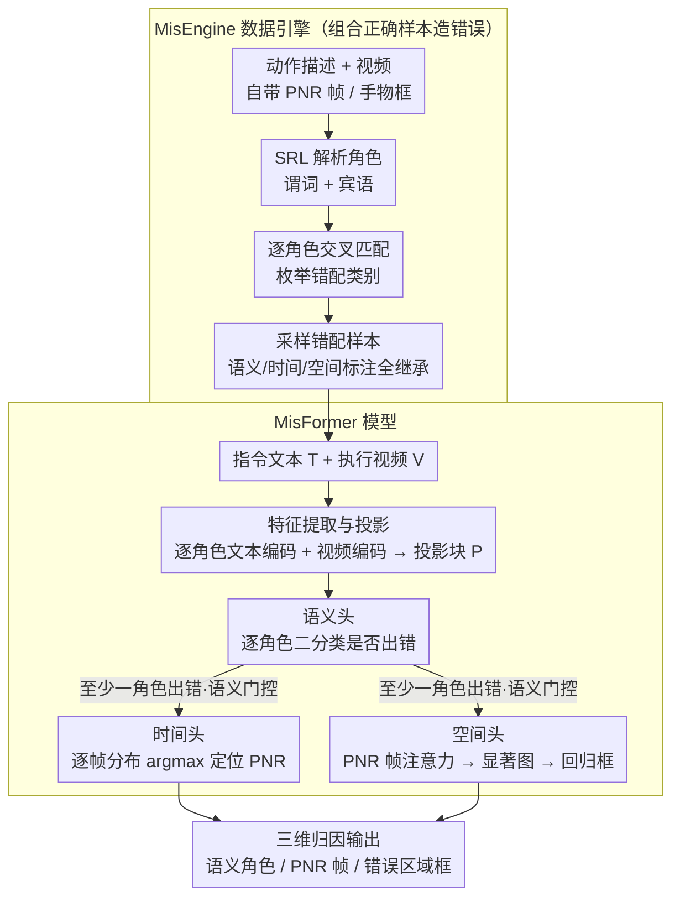

# Mistake Attribution: Fine-Grained Mistake Understanding in Egocentric Videos

**会议**: CVPR 2026  
**arXiv**: [2511.20525](https://arxiv.org/abs/2511.20525)  
**代码**: [https://yayuanli.github.io/MATT](https://yayuanli.github.io/MATT)  
**领域**: 视频理解  
**关键词**: 错误归因、第一人称视频、语义角色标注、时空定位、指令对齐

## 一句话总结

本文提出 Mistake Attribution (MATT) 任务，将第一人称视频中的操作错误归因到语义（违反了指令的哪个成分）、时间（不可逆转点 PNR 在哪一帧）和空间（PNR 帧中错误区域在哪里）三个维度，通过 MisEngine 数据引擎自动从已有动作数据集构建大规模错误样本，并设计统一的 Transformer 模型 MisFormer 同时完成三个归因子任务，在多个基准上超越各子任务的专用 SOTA 方法。

## 研究背景与动机

1. **领域现状**：物理环境下的 AI 辅助系统（如烹饪指导、组装指导）需要理解人类在执行指令时犯的错误。现有方法主要停留在错误检测层面——判断某步骤是否出错——或者给出粗粒度的错误类别（如"步骤遗漏"、"动作偏差"）。
2. **现有痛点**：粗粒度检测无法告诉用户"指令的哪个部分没有被正确执行"（语义维度）、"错误在什么时候变得不可挽回"（时间维度）以及"PNR 帧中错误具体出现在哪个区域"（空间维度）。例如指令是"拿起锤子"但实际拿了螺栓，现有方法只能告诉你"出错了"，无法指出是"物体"角色出错、出错在第 17 帧、错误区域是红色框中的螺栓。
3. **核心矛盾**：构建细粒度错误数据集极其困难——真实错误随着收集者经验增长变得越来越稀少，而人为注入的错误又会引入视觉偏差。已有错误数据集（EgoPER 599 样本、Assembly101 707 样本）规模比通用动作数据集小两个数量级。
4. **本文目标** (a) 如何大规模自动构建含语义-时间-空间三元组标注的错误数据集；(b) 如何用一个统一模型同时完成三个归因任务。
5. **切入角度**：利用语义角色标注（SRL）对动作描述进行结构化解析，然后在现有动作识别数据集中进行跨匹配（cross-matching），将"拿起筛子"的指令文本与"拿起平底锅"的视频配对，自动产生语义归因标签，同时继承原始数据集中的 PNR 时间戳和手部/物体空间标注。
6. **核心 idea**：通过语义角色交叉匹配从大规模动作语料自动构建错误样本，并用统一 Transformer 同时做语义-时间-空间三维归因。

## 方法详解

### 整体框架

这篇论文要做的事，是把"用户有没有照指令做对"从一句模糊的对错判断，拆成可解释的三问：指令里的哪个成分没执行对（语义）、错误从哪一帧起变得无法挽回（时间）、那一帧里错误具体落在画面哪个区域（空间）。给定一段指令文本 $T$（如 "cut the apple"）和用户执行视频 $V$，模型同时输出三件东西：每个语义角色是否出错的标签 $\{y_r\}$、不可逆转点（PNR）帧时间戳 $t_{PNR}$、以及该帧里错误区域的边界框 $B_{t_{PNR}}$。

整套系统由两半组成，互为表里。前半是 MisEngine 数据引擎，负责把"细粒度错误数据极难收集"这个死结解开——它不去采集真实错误，而是从现成的动作识别数据里组合出错误样本，并连带把三维标注一并继承下来。后半是 MisFormer 模型，吃下这些自动构建的数据，用一个统一 Transformer 把三个归因子任务在同一套多模态特征上一次性算完。

### 关键设计

**1. MisEngine 数据引擎：不采集错误，而是组合正确样本来"造"错误**

真实错误天生稀缺——收集者经验越长，犯错越少，而人为往视频里注入错误又会带进视觉偏差，导致已有错误数据集（EgoPER 599 条、Assembly101 707 条）比通用动作数据小两个数量级。MisEngine 的破题点是把"造错误"转化成一个组合问题：既然每条正确的动作描述都自带视频、PNR 帧和手物边界框，那么只要把"指令文本"和"另一条动作的视频"故意错配，就天然得到了一个带完整标注的错误样本。

具体走三步。第一步用 AllenNLP 的语义角色标注（SRL）把每条动作描述解析成角色组，例如把 "Pick up the sieve" 拆成谓词 "Pick up" 和宾语 "the sieve"。第二步在样本两两之间逐角色比对是否一致，从而枚举出 $C=|\mathcal{R}|^2$ 种错配类别（谓词错、宾语错、两者都错、两者都对）。第三步从每类错配里采样动作描述及其视频，当作一次"错误尝试"。这样一来，语义标注由交叉匹配直接给出（哪个角色被错配，哪个角色就是错的），时间标注沿用原数据集的 PNR 帧，空间标注沿用原有的手部/物体边界框，全程零人工标注。最终从 Ego4D 和 EPIC-KITCHENS 分别造出 257K 和 221K 样本，比现有最大错误数据集大两个数量级，既绕开了真实错误的稀缺，也躲开了注入错误的视觉偏差。

**2. MisFormer 的特征提取与投影：让指令的每个角色都"看过"视频再去判断**

要做语义级归因，光有一个句子级文本向量不够——得知道"是谓词错还是宾语错"，所以文本侧必须保留角色粒度。MisFormer 用 InternVideo2 的文本编码器对每个语义角色子串分别编码，得到 $F_R^T \in \mathbb{R}^{|\mathcal{R}| \times d}$；视频侧用其视频编码器抽出 $F^V \in \mathbb{R}^{L \times K \times d}$。InternVideo2 的多模态预训练已经把文本和视频拉到同一嵌入空间，这是后面跨模态对齐能成立的前提。

真正适配错误理解任务的是投影块 $\mathcal{P}$（2 层 Transformer 解码器，无因果掩码）：它先对各角色文本特征做自注意力，让角色之间交换信息（比如"宾语对不对"得参考"谓词是什么动作"）；再对视频特征做交叉注意力，把视觉上下文注入每个角色，得到 $F_R^{T'} \in \mathbb{R}^{|\mathcal{R}| \times d}$。换句话说，经过投影块后，每个角色的表示都已经"看过"视频，携带了指令与执行之间的细微偏差——消融里去掉这一块各项指标全面下滑，正说明原始文本嵌入不足以捕捉这种偏差。

**3. 三个归因头共享特征、各取所需，并用语义门控省算力**

三个子任务挂在同一套投影特征上，各自只接一个轻量的头。语义头最直接：对每个角色的投影特征 $F_r^{T'}$ 过 FFN 加 sigmoid 做二分类，判断该角色是否出错，用 BCE 损失训练。时间头要定位 PNR 帧，先用 2 层自注意力把逐帧视频特征 $F^V$ 下采样成帧级特征 $F^{V'} \in \mathbb{R}^{L \times d}$，再用 2 层 Transformer 解码器（以 $F^{V'}$ 为 query、投影文本 $F_R^{T'}$ 为 key/value）算出逐帧概率分布，取 argmax 即 PNR 帧，用交叉熵损失训练。空间头则复用投影块最后一层交叉注意力中 PNR 帧对应的注意力权重，与投影文本特征拼接后过两层自注意力生成空间显著图，上采样后与 PNR 帧 RGB 拼成 4 通道，喂给一个轻量 CNN 回归边界框坐标，用 Huber 损失训练。

这样设计的好处除了三头共享主干、参数省（仅 41M 加投影头），还在推理时加了一道语义门控：时间头和空间头只在语义头判定至少有一个角色出错时才触发。逻辑很自然——既然这两个头只关心"错误发生在何时何地"，那么没有错误时它们根本不需要跑，省下大量无谓计算。

### 一个完整示例

以指令 "Pick up the sieve" 走一遍。MisEngine 先用 SRL 把它解析为谓词 "Pick up" + 宾语 "the sieve"，再去库里找一条宾语不一致的动作——比如视频内容其实是 "Pick up the pan"。把这条 pan 的视频配上 sieve 的指令文本，就生成了一个"宾语错"样本：语义标签自动标成谓词对、宾语错；PNR 帧时间戳直接抄 pan 视频原有的标注（比如手真正抓住锅的那一帧）；错误区域边界框抄 pan 视频里那只锅的框。整个标注没动一次人工。

推理时 MisFormer 拿到这对（"Pick up the sieve" 文本 + 某段执行视频）：投影块让 "Pick up" 和 "the sieve" 两个角色各自看过视频，语义头先判断——发现宾语角色概率超阈值、判为出错。语义门控被触发，于是时间头接着在逐帧分布上取 argmax 定位到 PNR 帧，空间头再从该帧的交叉注意力里生成显著图、回归出错误区域框。最终给用户的反馈不再是一句"做错了"，而是"宾语对象不对（拿成了别的东西），错误在第 X 帧不可逆，问题区域在画面这个框里"。

### 损失函数 / 训练策略

总损失 $\mathcal{L} = \mathcal{L}_S + \mathcal{L}_T + \mathcal{L}_{spatial}$ 三项相加：$\mathcal{L}_S$ 为语义的二元交叉熵，$\mathcal{L}_T$ 为时间的交叉熵（只对错误样本计算，正确样本没有 PNR 可定位），$\mathcal{L}_{spatial}$ 为空间边界框回归的 Huber 损失。

## 实验关键数据

### 主实验

| 数据集 | 任务 | 指标 | MisFormer | 之前最佳 | 提升 |
|--------|------|------|-----------|----------|------|
| EPIC-KITCHENS-M | 语义归因 | F1@0.5 | **83.89** | 77.23 (ChatGPT-4o) | +6.66% |
| Ego4D-M | 语义归因 | F1@0.5 | **56.24** | 50.95 (ChatGPT-4o) | +5.29% |
| Ego4D-M | 时间归因 | MAE(s) | **0.638** | 0.816 (EgoT2) | -21.81% |
| Ego4D-M | 空间归因 | mIoU | **59.21** | 49.88 (MediaPipe-U) | +18.70% |
| Ego4D-M | 错误检测 | F1@0.5 | **57.55** | 15.62 (EgoPED) | +41.93% |

### 消融实验

| 配置 | 语义 F1 | 时间 MAE(s) | 空间 mIoU | 检测 F1 |
|------|---------|-------------|-----------|---------|
| MisFormer (完整) | 56.24 | 0.438 | 59.21 | 57.55 |
| 换为 LaViLa 骨干 | 49.16 | 0.561 | 51.37 | 46.05 |
| 去掉投影块 $\mathcal{P}$ | 51.34 | 0.457 | 55.43 | 52.75 |
| 去掉时间归因训练 | 51.29 | 0.623 | 57.78 | 57.46 |
| 用 GradCAM 代替注意力热图 | 55.52 | 0.482 | 55.03 | 57.51 |

### 关键发现
- InternVideo2 骨干（多模态预训练）对 MATT 至关重要，换为 LaViLa 后各子任务全面下降
- 投影块 $\mathcal{P}$ 不可或缺——原始文本嵌入不足以捕捉指令与视频间的细微偏差
- Object 角色的归因始终比 Predicate 容易，表明细粒度动作理解仍是第一人称视频的难点
- 在现有小规模错误数据集 EgoPER 上从头训练效果不佳，但在 EPIC-KITCHENS-M 上预训练后微调可达到竞争力

## 亮点与洞察
- **MisEngine 的"零成本标注"设计**非常巧妙：通过语义角色交叉匹配，把已有动作识别数据变成了错误理解数据，三维标注全部继承，无需任何人工标注。这种"不采集真实错误，而是组合正确样本以模拟错误"的思路可以迁移到其他需要稀缺负样本的任务。
- **统一模型 vs 组合专家**：MisFormer 以一个统一模型在语义/时间/空间/检测四个任务上均超越或接近各自的专用 SOTA，且仅 41M+投影头参数，运行效率高（空间头 68.9 FPS）。
- 将错误理解形式化为"指令-执行偏差"的三维归因框架，为 AI 助手提供了可解释、可操作的反馈信息。

## 局限与展望
- 当前仅支持简短指令（谓词+宾语），真实场景中的长句、多步骤指令需要更丰富的角色集合
- 空间归因比专用手-物交互检测器（SSDA）弱（mIoU 59.21 vs 64.54），可考虑引入专用物体检测先验
- 数据引擎假设错误仅来自角色交叉匹配，无法覆盖"程度错误"（如切得太厚）等连续性偏差
- 预训练表征是通用视频语言对齐目标，设计专门面向错误理解的预训练目标或许能进一步提升

## 相关工作与启发
- **vs EgoPED / AMNAR**: 这些方法将错误检测视为 OOD 检测问题，未利用错误监督信号，在大规模多活动场景下失效；MisFormer 通过 MisEngine 的大规模监督学习扩展能力
- **vs MistScene**: MistScene 生成自然语言解释但无结构化归因，且不与指令对齐；MATT 提供结构化的语义-时间-空间三元组
- **vs ChatGPT-4o**: 闭源商业模型在语义归因上被 MisFormer 超越 6.66%，说明任务特定设计优于通用大模型

## 评分
- 新颖性: ⭐⭐⭐⭐⭐ 提出全新任务定义+数据引擎+统一模型，三维贡献完整
- 实验充分度: ⭐⭐⭐⭐ 覆盖四个子任务+人类验证+消融，但空间归因对比还可更深入
- 写作质量: ⭐⭐⭐⭐⭐ 问题定义清晰，图示优秀，逻辑递进流畅
- 价值: ⭐⭐⭐⭐ 为第一人称 AI 助手的错误反馈提供了完整方法论，数据引擎思路可广泛复用

<!-- RELATED:START -->

## 相关论文

- [\[ICCV 2025\] Fine-grained Spatiotemporal Grounding on Egocentric Videos](../../ICCV2025/video_understanding/fine-grained_spatiotemporal_grounding_on_egocentric_videos.md)
- [\[CVPR 2026\] UFVideo: Towards Unified Fine-Grained Video Cooperative Understanding with Large Language Models](ufvideo_towards_unified_fine-grained_video_cooperative_understanding_with_large_.md)
- [\[CVPR 2026\] Text-guided Fine-Grained Video Anomaly Understanding](text-guided_fine-grained_video_anomaly_understanding.md)
- [\[CVPR 2026\] Frame2Freq: Spectral Adapters for Fine-Grained Video Understanding](frame2freq_spectral_adapters_for_fine-grained_video_understanding.md)
- [\[CVPR 2026\] StreamGaze: Gaze-Guided Temporal Reasoning and Proactive Understanding in Streaming Videos](streamgaze_gaze-guided_temporal_reasoning_and_proactive_understanding_in_streami.md)

<!-- RELATED:END -->
