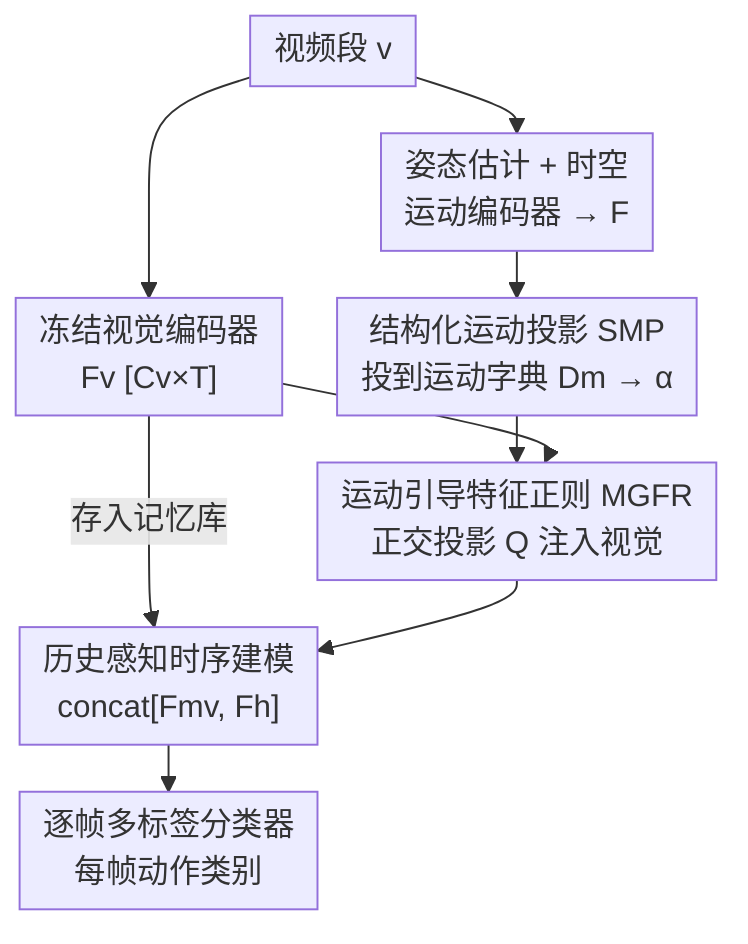

# MoVie: Broaden Your Views with Human Motion for Action Detection

**会议**: CVPR 2026  
**论文**: [CVF Open Access](https://openaccess.thecvf.com/content/CVPR2026/html/Yang_MoVie_Broaden_Your_Views_with_Human_Motion_for_Action_Detection_CVPR_2026_paper.html)  
**领域**: 视频理解  
**关键词**: 时序动作检测, 骨架运动, 运动基元字典, 正交特征正则, 多模态融合

## 一句话总结
MoVie 把人体骨架运动拆解成一组「运动基元」（可学习的运动字典），再用一个正交投影把这些细粒度运动信号当作「正则器」去校正 RGB 视觉特征，而不是粗暴地把两路特征拼接/融合——在 TSU、Charades、Multi-THUMOS、PKU-MMD 四个真实场景数据集上把帧级动作检测推到新 SOTA（TSU-CS 上比纯视觉基线提升约 +15.9% mAP）。

## 研究背景与动机
**领域现状**：未剪辑视频的人体动作检测（temporal action detection）目前主流是「两阶段」：先用冻结的视频基础模型（I3D、ViCLIP 等）抽每帧视觉特征，再把动作检测当成 seq2seq 任务，用 TCN / Transformer（MS-TCT、DualDETR 等）做时序建模、给每帧打多标签。

**现有痛点**：这些纯视觉方法只会描述「画面里能看到什么」，却抓不住「动作在时间上怎么物理地展开」。同一个动作在不同视角、不同人、不同光照下，RGB 空间里可能长得几乎一样，差别其实藏在运动动力学里。骨架序列本来能显式提供身体结构和运动，但直接把骨架当作额外模态拼进来，提升非常有限。

**核心矛盾**：作者点出两个具体障碍。其一，**运动表示太粗**——现有骨架编码器（如 AGCN）是用全局动作标签训练的，只学到「这是哪一类动作」，没学到运动本身的内在结构，得到的运动特征把不同物理模式混在一起；而且预训练 AGCN 是在受控环境的 NTU-RGB+D 上训的，挪到 TSU、Charades 这类真实复杂场景就大幅掉点。其二，**两种模态特征空间异质**——骨架运动表达的是方向性的运动幅度，视觉嵌入表达的是高层语义，直接拼接/晚融合会相互干扰，污染视觉特征里宝贵的语义多样性。

**切入角度**：真实动作是由更小的运动单元（抬手、弯腰、迈步……这些「运动基元」motion primitives）组合、重叠而成的。如果能把运动分解成这些基元、再把基元当成「物理先验」去引导视觉，而不是当成第二路输入去融合，运动就能从「辅助模态」升级为连接物理运动与视觉感知的「结构桥梁」。

**核心 idea**：用「运动基元字典 + 正交投影正则」代替「拼接/晚融合」，让结构化的细粒度运动去校正视觉特征的时序演化，而不破坏其语义。

## 方法详解

### 整体框架
给定一段视频，MoVie 走两条并行支路：视觉支路用冻结编码器 $E_V$（I3D 或 ViCLIP）抽出每帧视觉特征 $\mathbf{F_v}\in\mathbb{R}^{C_v\times T}$；运动支路从姿态估计器拿到 2D/3D 骨架序列，经时空运动编码器得到运动特征 $\mathbf{F}$。第一阶段的 **Structural Motion Projection (SMP)** 把运动特征投影到一个预训练的运动字典上，得到「每个运动基元被激活了多强」的结构化系数 $\hat{\boldsymbol{\alpha}}$；第二阶段的 **Motion-Guided Feature Regularization (MGFR)** 用一个正交变换把这些运动基元注入视觉空间，校正得到运动正则化视觉特征 $\mathbf{F_{mv}}$；最后接一个「带历史记忆」的时序模块和逐帧多标签分类器，输出每帧的动作类别。

### 关键设计

**1. 结构化运动投影 SMP：把粗糙的标签驱动运动特征拆成细粒度运动基元**

针对「运动表示太粗」这个痛点，SMP 不再用全局动作标签去学运动，而是借一个预训练的**运动分解网络**（ViA [59]，通过跨视角运动重建训练）得到的**运动字典** $\mathbf{D_m}\in\mathbb{R}^{K\times C_m}$。字典里每个基向量代表一种「与视角、体型无关」的原始运动方向（如躯干弯曲、腿部伸展）。给定运动特征 $\mathbf{F}\in\mathbb{R}^{C_m\times T\times M}$（$T$ 帧、$M$ 人），SMP 把它投到字典上算出每个基元的激活幅度：

$$\boldsymbol{\alpha} = \lVert \mathbf{D_m}\,\mathbf{F} \rVert_2,\quad \boldsymbol{\alpha}\in\mathbb{R}^{K\times T\times M}$$

其中 $\alpha_k$ 表示第 $k$ 个运动基元在某帧某人身上的激活强度。这个表示只编码几何/运动学动态、和静态外观解耦、对相机视角不变，描述的是「人怎么动」而非「这是哪类动作」。之后再过一个轻量 MLP $\sigma(\cdot)$ 细化为 $\tilde{\boldsymbol{\alpha}}=\sigma(\boldsymbol{\alpha})$，并对多人做池化（先选 top-$M$ 个高置信骨架、不足补零，再线性投影 + max/mean 池化）得到稳定的逐帧描述子 $\hat{\boldsymbol{\alpha}}\in\mathbb{R}^{K\times T}$。之所以有效：把动作显式拆成可复用、可重组的基元后，模型能匹配运动的细粒度本质，并泛化到训练中没见过的基元组合。

**2. 运动引导特征正则 MGFR：用正交投影让运动「校正」视觉而不是「污染」视觉**

针对「两种模态空间异质、直接融合互相干扰」的痛点，MGFR 不做拼接也不做晚融合，而是让运动当**正则器**。它引入一个可学习的**正交变换** $\mathbf{Q}\in\mathbb{R}^{K\times C_v}$，定义一个「基元对齐」的坐标系，使运动信号能沿着互相解耦的运动方向去调制视觉特征。两路先各过一个浅层 MLP（运动用 $\sigma$、视觉用 $\epsilon$）归一化尺度，再得到运动正则化视觉特征：

$$\mathbf{F_{mv}} = \epsilon(\mathbf{F_v}) + \lambda\,(\mathbf{Q}^\top \hat{\boldsymbol{\alpha}})$$

$\lambda$ 控制调制强度。关键在于 $\mathbf{Q}$ 被约束为正交（$\langle \mathbf{q_i},\mathbf{q_j}\rangle = 1$ 当 $i=j$，否则为 $0$），每轮迭代用 Gram-Schmidt 重新正交化。正交约束让每个运动基元只沿一个独立方向去调整视觉特征，避免把相关的视觉通道混在一起、避免过拟合；消融显示去掉正交约束 TSU-CS 掉 2.8%。这样运动以「结构正则」的方式注入视觉通道空间，既保留视觉的丰富语义，又加上几何/物理一致性。

**3. 一致性正则 + 历史感知时序建模：让运动诱导的变化对齐视觉的自然演化，并跨长程稳住**

为进一步稳住对齐，MGFR 配一个**时序一致性损失**，要求「运动基元投影出的变化」与「视觉特征相对其时间均值的变化」一致：

$$\mathcal{L}_{align} = \frac{1}{T}\sum_{t=1}^{T}\left\lVert \mathbf{Q}^\top \hat{\boldsymbol{\alpha}}_t - \big(\epsilon(\mathbf{F}_{\mathbf{v},t}) - \mathbf{F_{mv}}^{mean}\big)\right\rVert_2^2$$

它强制运动基元暗示的时序演化和外观/语义的实际变化对得上。正则后的 $\mathbf{F_{mv}}$ 送进沿用 MS-TCT 的时序模块（Transformer 与 TCN 交替，兼顾全局与局部动态）。为处理长视频，视觉特征被存进一个固定**记忆库**作为历史 $\mathbf{F_h}$，沿通道维与当前 $\mathbf{F_{mv}}$ 拼接后再做时序建模：$\mathbf{F'_{mv}} = \mathrm{TM}(\mathrm{concat}[\mathbf{F_{mv}}, \mathbf{F_h}])$，从而支持在线推理并保持长程时序一致。

### 损失函数 / 训练策略
运动字典先独立用跨视角运动重建预训练好、训练中**冻结**。其余组件端到端训练，总损失 $\mathcal{L} = \mathcal{L}_{det} + \lambda_{align}\mathcal{L}_{align}$。检测损失 $\mathcal{L}_{det}$ 是逐帧多标签的二元交叉熵（BCE），对每帧每类预测概率 $P_{t,c}$ 与真值 $y_{t,c}$ 计算。

## 实验关键数据

### 主实验
在 TSU、Charades、Multi-THUMOS 上用 I3D 和 ViCLIP 两种 backbone 与各模态 SOTA 比较帧级 mAP（节选）：

| 方法 | 模态 / 特征 | TSU-CS | TSU-CV | Charades | Multi-THUMOS |
|------|------------|--------|--------|----------|--------------|
| MS-TCT | Visual / I3D | 33.7 | - | 25.4 | 43.1 |
| DualDETR | Visual / I3D | 34.8 | - | 23.2 | 45.5 |
| LAC | Motion / UNIK | 36.8 | 23.1 | 25.6 | 23.4 |
| Augmented-RGB | Flow&Motion&Visual / I3D | 32.8 | 24.6 | - | 44.6 |
| **MoVie** | **Motion&Visual / I3D** | **49.6** | **28.6** | **29.2** | **46.8** |
| MMFF | Motion&Visual / ViCLIP | 41.6 | 25.7 | 29.2 | 46.3 |
| **MoVie** | **Motion&Visual / ViCLIP** | **50.1** | **30.1** | **33.5** | **48.3** |

I3D 下 MoVie 比之前 SOTA（MS-TCT）在 TSU-CS 上 +15.9%、Multi-THUMOS 上 +3.7%；比纯运动模型 LAC 在 TSU-CS 上 +12.8%，说明结构化运动「拿来引导视觉」远胜「单独使用」。事件级评测（Table 5）上 MoVie 在 PKU-MMD 达 92.8、TSU 达 25.6，全面超越各模态多模态基线。

### 消融实验
| 配置 | TSU-CS (%) | Charades (%) | 说明 |
|------|-----------|--------------|------|
| Baseline（仅视觉） | 35.8 | 16.4 | ViCLIP 视觉基线 |
| Late Fusion | 37.1 | 20.8 | 晚融合，提升有限 |
| Concatenation [Fv, F] | 41.2 | 29.3 | 直接拼接 |
| MGFR only（w/ F） | 44.1 | 29.6 | 仅 MGFR、不分解 |
| SMP+MGFR, K=64 | 41.4 | 30.4 | 基元数偏少 |
| **SMP+MGFR, K=128** | **50.1** | **33.5** | 最优配置 |
| SMP+MGFR, K=256 | 49.6 | 33.1 | 基元数过多无增益 |
| SMP+MGFR w/o Orth. | 47.3 | 31.1 | 去正交约束 |
| SMP+MGFR w/ Orth. | 50.1 | 33.5 | 加正交约束 |

### 关键发现
- **融合方式比加模态更关键**：晚融合/拼接相对纯视觉只是中等提升（35.8→37.1/41.2），而 MGFR 把它推到 +8.3%（TSU-CS）、+13.2%（Charades），证明「正交正则」让运动当结构调节器而非冗余信号。
- **SMP 与 MGFR 协同**：只用 MGFR 已有提升，但先经 SMP 把运动分解成基元后大幅增强；$K=128$ 最优，太少（64）表达力不足、太多（256）引入冗余基。
- **正交约束不可省**：换成稠密线性层 TSU-CS 掉 2.8%，没有正交模型易过拟合并混淆相关视觉通道。
- **运动密集动作收益最大**（Table 4）：「起身」+46.9%、「搅锅」+32.8%、「坐下」+31.1%——这些有清晰重复的身体动力学；可视化显示「起身」时躯干弯曲（$\alpha_8$）、腿部伸展（$\alpha_{15}$）等基元激活变化 $\lVert\Delta\alpha\rVert$ 最大。反之「从瓶子喝水」「搅咖啡」等细微手部动作小幅下降（-4.1%/-5.3%），因运动线索弱或遮挡下骨架不可靠。
- **交互池化与历史是次要项**：MLP 池化略优于平均池化，历史用拼接略优于注意力，但相比主干的运动-视觉对齐都只是小幅增益。

## 亮点与洞察
- **「运动当正则器」而非「运动当输入」的范式转变**：最让人「啊哈」的是把骨架从「第二路特征」重新定位成「校正视觉时序演化的结构先验」，并用正交投影从机制上保证不污染语义——这解释了为什么前人简单拼接收益微弱。
- **可解释的运动基元**：激活系数 $\alpha$ 给了天然可视化入口（哪个基元对应躯干弯曲、哪个对应腿伸），让动作检测带上物理可解释性，这种「字典 + 激活幅度」的解耦表示可迁移到手势识别、运动质量评估等任务。
- **借用预训练跨视角运动字典**：直接复用 ViA 的视角不变运动字典并冻结，省去从零学运动结构的代价，是一个轻量却有效的工程选择。
- **对噪声姿态鲁棒**：Charades / Multi-THUMOS 没有原生骨架、全靠姿态估计，MoVie 仍稳定提升，说明结构化运动即便在估计噪声下也提供可泛化线索。

## 局限与展望
- **依赖姿态质量**：作者自己承认，大遮挡下骨架不可靠时（如「从瓶子喝水」「搅咖啡」）会小幅掉点，细微手-物交互动作受限。展望建模运动不确定性、引入手-物交互来改善。
- **运动字典外部预训练且冻结**：字典来自 ViA 在特定数据上的跨视角重建，若目标域运动分布差异大，固定字典可能不是最优；端到端微调字典 vs 冻结的权衡未充分探讨。
- **运动弱的动作几乎无增益甚至负增益**：方法本质偏向「运动密集」动作，对纯语义/静态区分的动作帮助有限，适用范围有边界。
- **超参 $K$、$\lambda$ 需调**：$K$ 的最优值（128）在不同数据集上是否稳定、$\lambda$ 调制强度的敏感性正文未给完整曲线（在附录）。

## 相关工作与启发
- **vs MS-TCT / DualDETR（纯视觉时序建模）**：它们在视觉特征上堆更强的 Transformer/TCN 时序结构，本文转而在特征层面注入物理运动先验，区别在于「改时序建模」vs「改特征本身」，MoVie 在 TSU-CS 上大幅领先（+15.9%）。
- **vs LAC / SD-TCN（纯运动模型）**：它们单独用骨架/运动做检测，本文论证运动「单用不如用来引导视觉」，TSU-CS 上 +12.8%。
- **vs MMFF / Augmented-RGB（注意力拼接式多模态融合）**：它们靠 attention 把 RGB 与骨架特征拼接，本文用正交子空间对齐运动基元，更稳定也更可解释，且用更少模态拿到更高 mAP。
- **vs AAN（文本-视觉融合）**：相比语言语义线索，本文论证物理/几何运动先验对细粒度时序理解更有效。

## 评分
- 新颖性: ⭐⭐⭐⭐ 「运动当正交正则器 + 基元字典分解」的组合在动作检测里是个清晰且有说服力的新视角，但运动字典借自已有工作。
- 实验充分度: ⭐⭐⭐⭐ 四个真实数据集 + 帧级/事件级 + 融合方式/基元数/正交/池化/历史多维消融，较充分；部分敏感性分析放在附录。
- 写作质量: ⭐⭐⭐⭐ 动机推导清晰、图表对应到位，少量公式排版（OCR）需对照原文。
- 价值: ⭐⭐⭐⭐ 在真实复杂场景动作检测上刷新 SOTA，且提供了可解释、可迁移的运动-视觉对齐范式。

<!-- RELATED:START -->

## 相关论文

- [\[CVPR 2026\] Your One-Stop Solution for AI-Generated Video Detection](your_one-stop_solution_for_ai-generated_video_detection.md)
- [\[CVPR 2026\] Seeing Motion Through Polarity for Event-based Action Recognition](seeing_motion_through_polarity_for_event-based_action_recognition.md)
- [\[CVPR 2025\] H-MoRe: Learning Human-centric Motion Representation for Action Analysis](../../CVPR2025/video_understanding/h-more_learning_human-centric_motion_representation_for_action_analysis.md)
- [\[CVPR 2026\] Self-Paced and Self-Corrective Masked Prediction for Movie Trailer Generation](self-paced_and_self-corrective_masked_prediction_for_movie_trailer_generation.md)
- [\[CVPR 2026\] TVHighlights: LLM-Guided Human-Free Collaborative Training for Video Highlight Detection in Movies and TV Dramas](tvhighlights_llm-guided_human-free_collaborative_training_for_video_highlight_de.md)

<!-- RELATED:END -->
