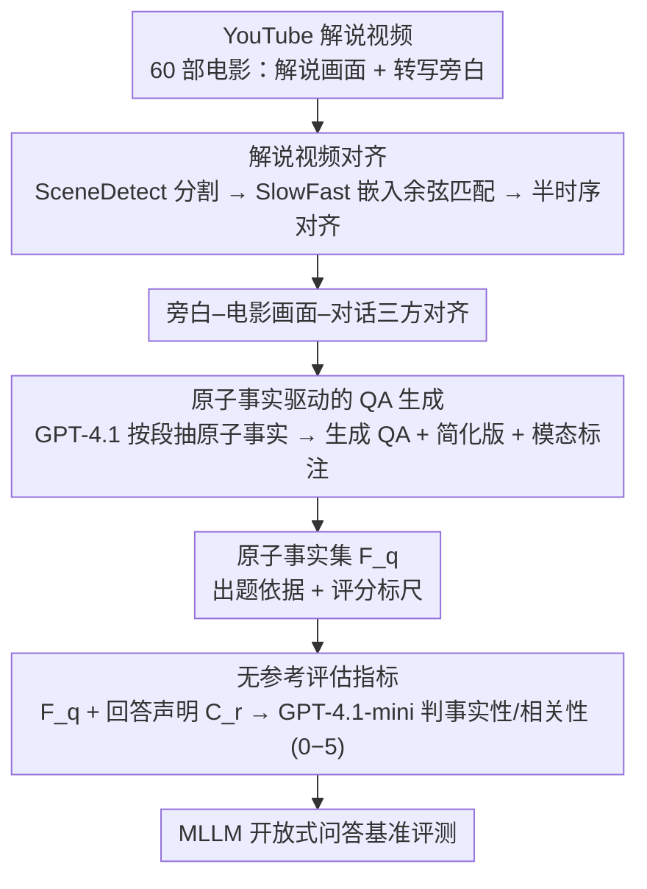

# MovieRecapsQA: A Multimodal Open-Ended Video Question-Answering Benchmark

**会议**: CVPR 2026  
**arXiv**: [2601.02536](https://arxiv.org/abs/2601.02536)  
**代码**: [MovieRecapsQA](https://github.com/MovieRecapsQA) (已开源)  
**领域**: 视频理解  
**关键词**: 视频问答, 多模态理解, 开放式评估, 电影理解, 无参考评估

## 一句话总结

提出 MovieRecapsQA，一个基于电影解说视频构建的多模态开放式视频问答基准，包含 60 部电影的约 8.2K 个问题，并设计了基于原子事实 (atomic facts) 的无参考评估指标，揭示了当前 MLLM 在视觉感知而非推理上的关键瓶颈。

## 研究背景与动机

1. **领域现状**：视频问答（VideoQA）是评估模型视频理解能力的核心代理任务。现有基准主要聚焦于单一模态或短视频，并大量采用多选题格式以简化评估复杂度。真正需要整合视觉和对话线索的多模态长视频 QA 基准非常稀少。

2. **现有痛点**：(a) 多选题提供了"捷径"——模型可以不理解视频就通过排除法作答；(b) 开放式问答由于答案非固定格式，评估极其困难；(c) 基于参考答案的评估方法（如 ROUGE、BERTScore）与人类判断的相关性很低；(d) 用 LLM 作为裁判做 VideoQA 评估时，将完整视频作为上下文既昂贵又不精确。

3. **核心矛盾**：开放式评估与可衡量性之间的矛盾——多选题容易评估但不够真实，开放式问答真实但无法可靠评估。

4. **本文目标** (a) 如何构建高质量的多模态长视频开放式 QA 数据集？(b) 如何在不依赖参考答案的情况下可靠评估开放式回答？

5. **切入角度**：利用电影解说视频（recap videos）作为数据源——解说的旁白天然提供了视频内容的文本摘要，可以自动提取原子事实来支撑无参考评估。

6. **核心 idea**：用电影解说视频的旁白提取原子事实作为中间标注层，既支撑需要多模态推理的问题生成，又使得无需参考答案即可评估回答的事实性和相关性。

## 方法详解

### 整体框架

这篇工作不训练模型，要交付的是一套"数据集 + 评估"的闭环：一头从 YouTube 收集 60 部电影的解说视频，把解说旁白对齐到原始电影的画面与对话，再让 GPT-4.1 从旁白里抽取原子事实并据此生成开放式 QA；另一头用这些原子事实当文本锚点，搭一个不依赖参考答案的 LLM 裁判，从事实性和相关性两个维度给模型回答打分。串起整条链路的关键，是"原子事实"这个中间层——它既是出题的依据，也是评分的标尺，让长视频开放式问答第一次做到了可自动构建、可可靠评估。

### 关键设计

**1. 解说视频对齐：把旁白、画面、对话三方锁到同一时间轴上**

开放式长视频 QA 想要"问题精确落到电影某个片段"，前提是知道解说的每句话对应原片的哪一段。本文先用 SceneDetect 对电影和解说视频各自做场景分割，再用 SlowFast 提取每个场景首尾帧的视觉嵌入，按余弦相似度把解说镜头匹配回原片镜头，最后加一步统计对齐强制半时序顺序，避免乱序错配。对齐后拿到的不只是视频-视频的映射，而是旁白-电影画面-对话的三方对齐。之所以选解说视频而非 Wikipedia 简介或 IMDb 剧情梗概，是因为解说天生把叙述和视觉片段紧紧耦合，能提供密集得多的场景级覆盖，也让后续问题可以被钉在电影的具体时间段上。

**2. 原子事实驱动的 QA 生成：先把旁白拆成可验证命题，再据此出题**

直接拿旁白让模型出题，容易出现"答案抄在问题里"或问题与视频脱节的情况。本文的做法是把每个解说段落喂给 GPT-4.1，先抽取出一组原子事实（简洁、可逐条验证的命题），再生成依赖这些事实的 QA 对，并给每个问题标注它需要的模态——纯视觉、纯对话、还是两者皆需。为了防止答案过于详尽把问题衬托得太简单，还额外造一批简化版 QA，采用"简化问题 + 详细答案"的搭配。原子事实在这里一身三用：它逼着问题真的去考多模态推理，它本身就是一份精确的文本表示可以替代视频去做评估，它还省掉了人工撰写参考答案这一步。

**3. 无参考评估指标：用原子事实当锚点，绕开"把整段视频塞给裁判"**

文本 QA 里成熟的 LLM-as-judge 没法直接搬到 VideoQA，因为把完整视频当验证上下文既贵又不靠谱，而 ROUGE、BERTScore 这类基于参考答案的指标和人类判断几乎不相关。本文转而让裁判只看文本锚点：对每个问题 $q$，取出它关联的原子事实集合 $\mathcal{F}_q$，并从模型回答中抽取声明集合 $\mathcal{C}_r$，再用 GPT-4.1-mini 作裁判，结合问题、原子事实和字幕，在事实性（0-5 分）和相关性（0-5 分）两个维度上打分。原子事实提供了一份紧凑、可逐条核验的替身，让裁判不必看视频也能判断回答说得对不对、答得切不切题，从而把开放式回答的评估变得既便宜又稳定。

### 损失函数 / 训练策略

本文是数据集/评估工作，不涉及模型训练。事实提取、QA 生成、评估裁判这三个环节均由 GPT 系列模型完成（构建用 GPT-4.1，裁判用 GPT-4.1-mini 以控成本）。

## 实验关键数据

### 主实验

| 模型 | ROUGE-L | BERTScore | HELMET Correct. | Factuality(ours) | Relevance(ours) |
|------|---------|-----------|-----------------|-------------------|-----------------|
| GPT-4o | 0.28 | 0.68 | 1.43 | **3.99** | **3.97** |
| Gemini-2.5-Flash | 0.22 | 0.63 | 1.82 | 3.26 | 3.70 |
| Claude 3.5 Sonnet | 0.22 | 0.63 | 1.35 | 3.76 | 3.92 |
| Amazon Nova Lite | 0.28 | 0.69 | 1.29 | 3.53 | 3.93 |
| Qwen2.5VL | 0.26 | 0.67 | 1.23 | 3.47 | 3.83 |
| MiniCPM-o | 0.24 | 0.65 | 1.27 | 3.21 | 3.61 |
| LLaVA-NeXT-Video | 0.23 | 0.65 | 0.98 | 2.96 | 3.35 |
| 人类 (平均) | 0.16 | 0.88 | 0.98 | 4.01 | 4.01 |
| 人类 (最佳) | 0.19 | 0.87 | 1.26 | 4.59 | 4.53 |

### 消融实验（按模态类型分解）

| 模态类型 | 闭源模型 Factuality | 开源模型 Factuality | 人类 Factuality |
|----------|---------------------|---------------------|-----------------|
| 对话型 | 3.63 | 3.21 | 4.17 |
| 视觉型 | 3.15 | 3.05 | 3.84 |
| 多模态 | 3.55 | 3.11 | 3.84 |

### 关键发现

- **语义指标完全失效**：ROUGE-L 范围仅 0.22-0.28，BERTScore 仅 0.63-0.69，几乎无法区分模型好坏，甚至把人类排在模型之后
- **参考评估指标反直觉**：HELMET Correctness 把 MiniCPM-o (1.27) 评得比人类最佳 (1.26) 还高，完全不符合直觉
- **本文无参考指标最有区分度**：Factuality 从 2.96 到 3.99 跨度大，且与人类得分 (4.01/4.59) 形成合理的差距
- **视觉是主要瓶颈**：所有模型在视觉型问题上的事实性得分最低，且移除视觉输入反而提升了闭源模型的事实性，说明模型看到图片后反而引入了错误信息
- **模型知道看哪里，但不知道说什么**：相关性分数在各模态间保持稳定，但事实性波动大，说明模型定位能力可以但细粒度视觉信息提取能力不足

## 亮点与洞察

- **原子事实作为中间标注层**的设计非常巧妙：它同时解决了"如何生成好问题"和"如何评估答案"两个难题。原子事实比参考答案更灵活——同一事实可以多种方式表达，避免了参考评估的刚性
- **"移除视觉反而提升事实性"**是一个极具洞察力的发现：它揭示了当前 MLLM 不是不会"推理"视觉信息，而是"感知"就出了问题——看到的信息是错的，推理自然也就错了
- **电影解说视频作为数据源**的思路有很好的可扩展性：YouTube 上有大量此类内容，且天然提供了视频-文本对齐，可以迁移到教育视频、体育解说等其他有旁白的视频类型

## 局限与展望

- 数据来自 YouTube 解说视频，可能存在解说者的主观偏差和遗漏
- 仅 60 部电影，规模有限，且电影类型的分布未详细报告
- 原子事实提取和 QA 生成完全依赖 GPT-4.1，可能引入大语言模型自身的偏差
- 评估裁判使用 GPT-4.1-mini 以降低成本，但其裁判能力可能不如更大的模型
- 缺乏对更长输入设置（完整电影）的系统性实验

## 相关工作与启发

- **vs MovieQA / TVQA**：这些经典基准使用多选题、依赖人工标注，规模受限。本文使用开放式问答 + 自动构建，且引入了模态标注和无参考评估
- **vs CinePile**：CinePile 也是自动生成的大规模基准（303K QA），但仍使用多选题，且没有模态细分。本文虽然规模较小（8.2K），但在评估设计上更先进
- **vs FactScore/VeriScore**：这些文本 QA 中的事实性评估工作启发了本文的设计，但本文首次将原子事实评估扩展到 VideoQA 领域

## 评分

- 新颖性: ⭐⭐⭐⭐ 利用解说视频构建基准+无参考评估的组合思路新颖，但核心技术（LLM提取事实、LLM裁判）并非全新
- 实验充分度: ⭐⭐⭐⭐⭐ 7个模型+人类评估、多种评估指标对比、按模态/推理类型的详细分解分析
- 写作质量: ⭐⭐⭐⭐⭐ 论文逻辑清晰，motivation推导自然，实验发现的表述精确有洞察力
- 价值: ⭐⭐⭐⭐ 为长视频多模态理解提供了重要的评估工具，"视觉感知是瓶颈"的发现对领域有指导意义

<!-- RELATED:START -->

## 相关论文

- [\[CVPR 2026\] HERBench: A Benchmark for Multi-Evidence Integration in Video Question Answering](herbench_a_benchmark_for_multi-evidence_integration_in_video_question_answering.md)
- [\[CVPR 2026\] CaST-Bench: Benchmarking Causal Chain-Grounded Spatio-Temporal Reasoning for Video Question Answering](cast-bench_benchmarking_causal_chain-grounded_spatio-temporal_reasoning_for_vide.md)
- [\[NeurIPS 2025\] EgoGazeVQA: Egocentric Gaze-Guided Video Question Answering Benchmark](../../NeurIPS2025/video_understanding/egogazevqa_egocentric_gaze_guided_video_question_answering.md)
- [\[CVPR 2026\] Ego-Grounding for Personalized Question-Answering in Egocentric Videos](ego-grounding_for_personalized_question-answering_in_egocentric_videos.md)
- [\[CVPR 2026\] Do You See What I Am Pointing At? Gesture-Based Egocentric Video Question Answering](do_you_see_what_i_am_pointing_at_gesture-based_egocentric_video_question_answeri.md)

<!-- RELATED:END -->
