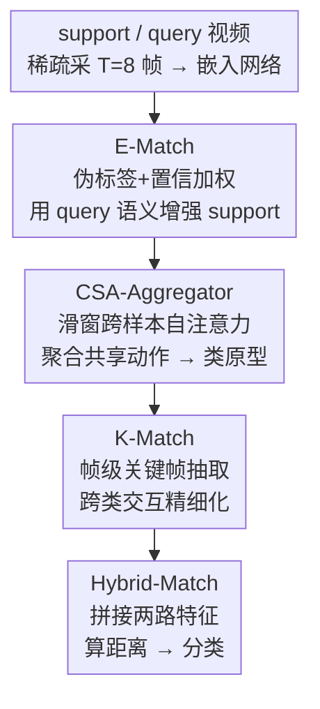

# MPL: Match-guided Prototype Learning for Few-shot Action Recognition

**会议**: CVPR 2026  
**论文**: [CVF Open Access](https://openaccess.thecvf.com/content/CVPR2026/html/Yang_MPL_Match-guided_Prototype_Learning_for_Few-shot_Action_Recognition_CVPR_2026_paper.html)  
**代码**: https://github.com/jayzh-research/MPL-FSAR （有）  
**领域**: 视频理解  
**关键词**: 少样本动作识别, 原型学习, 视频匹配, 跨样本注意力, 关键帧

## 一句话总结
针对少样本动作识别里「原型学习」和「视频匹配」各自为政、原型与匹配方法不兼容的问题，MPL 把匹配结果反过来用作原型构造的引导信号——先用样本级 E-Match 借 query 语义增强 support 原型、再用跨样本注意力聚合共享动作模式、最后用帧级 K-Match 做精细化，从粗到细地造出更判别、且天然兼容匹配机制的类原型，在四个数据集上刷到 SOTA。

## 研究背景与动机

**领域现状**：少样本动作识别（few-shot action recognition）主流走的是度量学习（metric-based）范式：把视频映射到特征空间，再用某种距离/匹配函数衡量 query 和类原型的相似度来分类。这条线上前人主要在两个方向使劲——一是**原型学习**（如 HyRSM 通过样本间交互学任务相关原型、MoLo 抽运动信息造原型），二是**视频匹配**（如 OTAM 用 DTW 按帧序对齐、HyRSM 用双向 Mean Hausdorff Metric 做柔性帧集匹配）。

**现有痛点**：作者指出两个被长期忽视的毛病。其一，原型是靠 episode 内所有样本「隐式交互」学出来的，没有语义引导——同一个 query 样本会和**不同类别**的 support 样本「一视同仁」地交互，导致学到的是类无关（class-agnostic）的嵌入，原型缺乏清晰的语义对应、判别力受限；而且这种增强是在整段视频的**样本级**做的，缺少帧级的精细打磨。其二，原型学习和匹配机制被当成**两个独立模块**分开设计，结果是学出来的原型表示和实际采用的匹配方法之间可能**不兼容**（论文 Table 6 的实验直接证明：E-Match 和 Hybrid-Match 用不同匹配函数时性能会掉）。

**核心矛盾**：原型该长什么样，本质上取决于它要被「怎么匹配」；但现有 pipeline 先闷头造原型、再挑匹配方法，两者割裂，自然容易错配。

**核心 idea**：与其让原型学习和匹配各管各的，不如**把匹配嵌进原型学习过程**——用 query-support 之间的预匹配结果作为语义引导，从粗（样本级）到细（帧级）地构造原型。这样既给原型注入了明确的类语义，又保证原型表示与下游匹配机制天然兼容。

## 方法详解

### 整体框架
MPL 解决的是「N-way K-shot」分类：给一个含 N 个类、每类 K 个标注样本的 support set，和一个待分类的 query 视频 $q$，判断 $q$ 属于哪一类。每段视频稀疏采样成 $T=8$ 个 snippet，过嵌入网络（ResNet-50 / CLIP 视觉编码器）得到 support 特征 $F_S=\{f_{s_1},\dots,f_{s_{N\times K}}\}$ 和 query 特征 $f_q$，每个特征是 $T$ 帧序列。

整条管线是「从粗到细、匹配引导」的四段串联：先 **E-Match** 用 query 语义在样本级增强 support 特征，再 **CSA-Aggregator** 把同类 K 个 shot 的相邻帧跨样本聚合成类原型，接着 **K-Match** 在帧级抽关键帧、做精细化原型，最后 **Hybrid-Match** 把 E-Match 与 K-Match 的产物拼起来算最终匹配分类分数。整个网络端到端训练。

### 关键设计

**1. E-Match：用 query 语义在样本级显式增强 support 原型**

针对「隐式交互造出类无关原型」这个痛点，E-Match 的思路是：不让一个 query 跟所有类别的 support 平等交互，而是先匹配出 query 最像哪一类，再把 query 的语义**有方向地**注入到对应类的 support 特征里。具体先用距离度量 $D_e(\cdot,\cdot)$（本文取 BiMHM）给 query 算一个伪标签——找到与之最近的 support 样本索引 $\hat{i}=\arg\min_{i}D_e(f_{s_i},f_q)$，先假设 $q$ 属于 $f_{s_{\hat i}}$ 所在类。

但伪标签可能不可靠，所以增强时按 query 与 support 的相似度做**置信加权**，越近权重越大：

$$\tilde{f}_{s_i}=f_{s_i}+\frac{\exp(-D_e(f_{s_i},f_q))\,\omega_{i,\hat i}}{\sum_{i'=1}^{N\times K}\exp(-D_e(f_{s_{i'}},f_q))}\cdot f_q,\qquad \omega_{i,j}=\begin{cases}1,&i=j\\0,&\text{otherwise}\end{cases}$$

这里 $\omega_{i,\hat i}$ 是个门控指示子——只有被伪标签命中的那类样本才接收 query 注入。这样 $\tilde f_{s_i}$ 保持和 $f_{s_i}$ 同形状，却被语义更丰富的 query 显式增强了。E-Match 之所以有效，是因为它把「匹配结果」当作引导信号写进了原型构造：原型从一开始就是冲着匹配去长的，从根上保证了原型与匹配机制的一致性，同时实现了样本级增强。它也借鉴了增强式（augmentation-based）小样本方法「拿 query 帮造原型」的精神。

**2. CSA-Aggregator：滑窗跨样本注意力，聚出同类共享的动作模式**

大多数方法直接把同类 K 个 shot 在**相同帧位**上做平均来造原型，但关键动作在不同样本里可能发生在**不同时间戳**，硬按帧位平均会错位，捞不到真正共享的关键动作特征。CSA-Aggregator（Cross-Shot Attention Aggregator）改成用注意力跨样本提取共享行为。对同类的 K 个增强特征，先用滑动采样算子 $O_t^{t+w-1}(\cdot)$ 在每个 $\tilde f_{s_i}$ 上取窗长为 $w$、步长为 1 的子序列：$O_t^{t+w-1}(\tilde f_{s_i})=\{\tilde f_{s_i}^{t},\dots,\tilde f_{s_i}^{t+w-1}\}$，保留每个样本的短程动态。

然后把 K 个样本同一起始帧 $t$ 的子序列拼成一个 $K\times w$ 的注意力窗口，在窗内做多头自注意力：

$$X_t=M\big(\text{concat}[O_t^{t+w-1}(\tilde f_{s_1}),\dots,O_t^{t+w-1}(\tilde f_{s_K})]\big)$$

最后把各滑窗输出在相同帧位上平均，聚成最终原型 $f_p=\text{Aggregate}([X_1,\dots,X_{T-w+1}])$。窗口大小 $w$ 一般设成 shot 数。它有效的关键在于让局部时间段内的跨样本特征互相做注意力——同类不同样本即使动作时间不对齐，也能在窗内被关联起来，捞出共享的时空模式，比简单平均更能抗时序错位。当每类只有 1 个 shot 时，原型直接过一次 MSA 得到。

**3. K-Match：帧级关键帧抽取，做精细化原型对齐**

只在样本级增强原型、不做帧级精化，遇到相似类别时容易在匹配阶段误判。K-Match 在 support-query 帧之间做细粒度对齐来抽关键帧。给 query $f_q$ 和类原型 $f_p$，对 query 的每一帧，从 $f_p$ 里找最近的那一帧，再平均成 support 关键特征：

$$f_p^{key}=\frac{1}{T}\sum_{b=1}^{T}\arg\min_{f_p^a\in f_p}\lVert f_p^a-f_q^b\rVert,\qquad f_q^{key}=\frac{1}{T}\sum_{b=1}^{T}f_q^b$$

其中 $\lVert\cdot\rVert$ 用余弦距离。support 侧基于「帧到帧匹配结果」挑关键帧——这步刻意复用了匹配信息，保证抽出的关键特征和匹配方法兼容；query 侧则对所有帧平均以保持匹配过程的泛化性。之后把 query 关键特征和 N-way 类原型集做跨类交互（再过一次 MSA）：$\hat f_q^{key},\hat F_P^{key}=M(\text{concat}[f_q^{key},F_P^{key}])$，得到任务相关的关键特征。K-Match 有效是因为它在帧粒度上滤掉冗余内容、只保留判别性帧，并且抽帧准则本身就是匹配结果，进一步缩小了原型与匹配之间的缝隙。

**4. Hybrid-Match：拼接两路产物算最终距离**

最后把 K-Match 交互后的关键特征与原型 $f_p$ 拼接，对融合了 E-Match 和 K-Match 信息的整体特征做一次混合匹配：

$$d_{p,q}=D_h(\text{concat}[\hat f_p^{key},f_p],\,\text{concat}[\hat f_q^{key},f_q])$$

$D_h$ 是和 $D_e$ 同类的帧级度量。它把「样本级增强 + 跨样本聚合 + 帧级精化」三路成果汇到一个距离上，既给分类提供粗细兼备的证据，又因为全程都用同一套匹配逻辑而保持兼容性。推理时按 $d_{p,q}$ 用最近邻规则分类。

### 损失函数 / 训练策略
端到端训练，把各类的负距离当 logits。总损失为：

$$L=L_H+\lambda_1 L_E+\lambda_2 L_{CE}$$

其中 $L_H$、$L_E$ 分别是 Hybrid-Match 和 E-Match 基于距离算出的交叉熵损失，$L_{CE}$ 是在真实动作类别上的交叉熵、用来稳住训练，$\lambda_1,\lambda_2\in[0,1]$ 为平衡因子。训练用 Adam 优化器，配随机裁剪、颜色抖动等基础数据增强；推理时在 10,000 个随机采样任务上取平均准确率。

## 实验关键数据

四个标准数据集：Kinetics、SSv2、UCF101、HMDB51，统一稀疏采 8 帧，骨干用 ImageNet 预训练 ResNet-50 或 CLIP 视觉编码器。

### 主实验

5-way 1/3/5-shot 下与领先方法对比（节选，单位 %）：

| 数据集 / 设置 | 之前最佳 | MPL (RN-50) | MPL (CLIP-RN50†) |
|--------------|---------|-------------|------------------|
| UCF101 1-shot | 86.6 (HM²) | **90.1** | **93.0** |
| HMDB51 1-shot | 61.8 (HM²) | **63.3** | **68.0** |
| Kinetics 5-shot | 88.9 (EGME) | **89.5** | 93.8 |
| SSv2 3-shot | 52.9 (MoLo) | **53.6** | 49.8 |

ResNet-50 下 MPL 在多数设置取得最优：UCF101 1-shot 从 86.6% 拉到 90.1%（+3.5），Kinetics 3-shot +2.3、SSv2 3-shot +1.2。换 CLIP-RN50 视觉编码器后进一步领先 CLIP-FSAR（后者还额外用了文本模态），HMDB51 5-shot 直接 +4.9%。换 CLIP-ViT-B 时，MPL 仅用视觉编码器在 Kinetics/UCF101/HMDB51 多数设置已超过双模态的 CLIP-FSAR。

### 消融实验

| 配置 | Kinetics 1-shot | SSv2 1-shot | UCF101 1-shot | HMDB51 1-shot | 说明 |
|------|----------------|-------------|---------------|---------------|------|
| Baseline (BiMHM) | 71.8 | 38.1 | 82.7 | 37.9 | 起点 |
| + E-Match | 75.8 | 41.6 | 87.2 | 40.0 | 样本级增强 |
| + K-Match | 72.4 | 40.2 | 83.6 | 38.7 | 帧级精化 |
| + E-Match + K-Match | 77.1 | 43.5 | 90.1 | 41.5 | 粗到细叠加 |

| 维度 | 对比 | 结论 |
|------|------|------|
| 原型聚合 (Table 4) | Mean vs CSA-A | CSA-A 在 Kinetics 3-shot 86.2 vs 84.7、SSv2 3-shot 53.6 vs 51.8，注意力聚合优于均值 |
| 匹配兼容性 (Table 6) | E-Match/Hybrid 同/异度量 | 两端用**相同**匹配函数（Bi-MHM/Bi-MHM）SSv2 1-shot 达 43.5，混用不同度量普遍掉点，印证「兼容性」动机 |
| 窗长 $w$ (Table 5) | $w=1\to7$ | 随 $w$ 增大单调小升、$w=7$ 最佳；因不引入可学参数，增益归功于跨样本共识而非容量 |

### 关键发现
- **E-Match 是贡献最大的单模块**：单加 E-Match 在 UCF101 上就从 82.7% 跳到 87.2%（+4.5），远超单加 K-Match 的 +0.9；K-Match 更像是在 E-Match 基础上做精细化补刀，两者叠加才把 UCF101 推到 90.1%。
- **匹配兼容性被实验直接证实**：Table 6 显示 E-Match 与 Hybrid-Match 用同一套匹配度量时最优，混用就掉点——这正是论文「原型应与匹配方法兼容」核心主张的直接证据。
- **窗长不敏感且无参代价**：$w$ 从 1 到 7 仅小幅提升（Kinetics 3-shot 86.8→87.2），说明 CSA-Aggregator 的收益来自机制本身；输入帧数则在超过 8 帧后饱和甚至略降，因冗余帧引入干扰。
- **t-SNE 可视化**：MPL 的类原型分布比 TRX/HyRSM/HyRSM++ 更紧致、类间更分得开，呼应「从粗到细、匹配引导能造更判别原型」的动机。

## 亮点与洞察
- **把「匹配」从下游评分器变成上游引导信号**，是本文最「啊哈」的地方：传统 pipeline 是「造原型 → 挑匹配」，MPL 反过来用预匹配结果回灌原型构造，一举解决「原型与匹配不兼容」这个被忽视的系统性问题，而且 Table 6 给了干净的实验支撑。
- **CSA-Aggregator 用滑窗注意力替代帧位平均**，巧妙之处在于无新增可学参数却能抗时序错位——把同类不同样本的局部时间段拼进一个注意力窗口，让动作发生在不同时刻的样本也能互相对齐，这个「跨样本共识」思路可迁移到任何需要聚合多示例的少样本任务（如少样本检测的支持集融合）。
- **置信加权的伪标签注入**（E-Match 里按相似度软加权而非硬指派）是个稳妥的工程细节：承认伪标签可能错，用 softmax 权重让不靠谱的注入自动衰减，这套「软伪标签增强」可直接搬到其他依赖 query 信息的 transductive 小样本方法。

## 局限性 / 可改进方向
- **依赖伪标签质量**：E-Match 的增强建立在「query 最近的 support 类」这个伪标签上，虽然做了置信加权，但在类间极相似、初始匹配本身就难的数据集上，错误注入仍可能污染原型；论文未深入分析伪标签错误率与最终性能的关系。
- **SSv2 上优势收窄甚至落后**：在以时序推理为主的 SSv2 上，5-shot 设置 MPL（56.6）反而不及部分方法，CLIP-ViT-B 的 SSv2 1-shot（51.1）还低于 CLIP-FSAR（54.5），说明方法对「强时序、弱外观」类动作的处理还有短板——可能 E-Match 的样本级语义注入对这类动作帮助有限。
- **窗长收益微弱**：Table 5 里 $w$ 从 1 到 7 仅提升约 0.3–0.4%，CSA-Aggregator 的实际增益主要体现在「优于均值」而非「窗长可调」，聚合设计的上限可能还没被充分挖掘。
- **改进方向**：可探索更可靠的伪标签（如多轮迭代精化）、针对强时序数据集设计帧级而非样本级的匹配引导、以及把文本模态也纳入匹配引导（当前 CLIP 仅用视觉编码器）。

## 相关工作与启发
- **vs HyRSM / HyRSM++**: 它们靠 episode 内样本隐式交互学任务相关原型、再独立设计鲁棒帧集匹配；MPL 指出这种「隐式交互」造出类无关原型且原型与匹配割裂，改用匹配结果显式引导原型构造，t-SNE 上原型更判别、四数据集多数设置反超。
- **vs OTAM / TRX**: OTAM 用 DTW 按帧序硬对齐、TRX 用支持集子序列造 query 相关原型，都把匹配当独立评分环节；MPL 把匹配嵌进原型生成，从源头保证兼容性。
- **vs MoLo / MTFAN**: 它们主攻抽运动信息造原型；MPL 不额外建运动建模，而是用 CSA-Aggregator 的跨样本注意力捞共享动作模式，思路更轻、无新增可学参数。
- **vs CLIP-FSAR**: CLIP-FSAR 靠文本+视觉双模态的 CLIP 先验造可靠原型；MPL 仅用 CLIP 视觉编码器、靠匹配引导就在多数设置追平甚至超过它，说明「匹配引导」这条结构性改进与「引入强先验」是正交且可叠加的。

## 评分
- 新颖性: ⭐⭐⭐⭐ 「用匹配反向引导原型学习」的视角新颖，且把「原型-匹配不兼容」这个隐性问题显式化并实验验证
- 实验充分度: ⭐⭐⭐⭐ 四数据集、多骨干、6 张消融表覆盖各组件与兼容性，但 SSv2 弱项缺深入分析
- 写作质量: ⭐⭐⭐⭐ 动机-方法-实验逻辑闭环，图 2/3 清晰，公式完整
- 价值: ⭐⭐⭐⭐ 多数设置 SOTA，CSA-Aggregator 等设计可迁移到其他少样本任务，代码开源

<!-- RELATED:START -->

## 相关论文

- [\[CVPR 2026\] Protect to Adapt: Orthogonal Subspace Control with Ranked Negative-Prompt Curriculum for Few-Shot Action Recognition](protect_to_adapt_orthogonal_subspace_control_with_ranked_negative-prompt_curricu.md)
- [\[AAAI 2026\] Task-Specific Distance Correlation Matching for Few-Shot Action Recognition](../../AAAI2026/video_understanding/task-specific_distance_correlation_matching_for_few-shot_action_recognition.md)
- [\[CVPR 2026\] SkeletonContext: Skeleton-side Context Prompt Learning for Zero-Shot Skeleton-based Action Recognition](skeletoncontext_skeleton-side_context_prompt_learning_for_zero-shot_skeleton-bas.md)
- [\[ICCV 2025\] Beyond Label Semantics: Language-Guided Action Anatomy for Few-shot Action Recognition](../../ICCV2025/video_understanding/beyond_label_semantics_language-guided_action_anatomy_for_few-shot_action_recogn.md)
- [\[CVPR 2025\] Temporal Alignment-Free Video Matching for Few-Shot Action Recognition](../../CVPR2025/video_understanding/temporal_alignment-free_video_matching_for_few-shot_action_recognition.md)

<!-- RELATED:END -->
