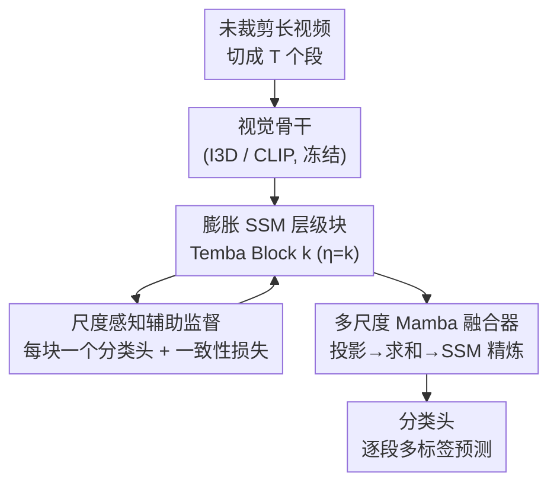

# MS-Temba: Multi-Scale Temporal Mamba for Understanding Long Untrimmed Videos

**会议**: CVPR 2026  
**论文**: [CVF Open Access](https://openaccess.thecvf.com/content/CVPR2026/html/Sinha_MS-Temba_Multi-Scale_Temporal_Mamba_for_Understanding_Long_Untrimmed_Videos_CVPR_2026_paper.html)  
**代码**: https://mstemba.github.io （项目页）

**领域**: 视频理解  
**关键词**: 时序动作检测, 状态空间模型, Mamba, 多尺度建模, 长视频

## 一句话总结
MS-Temba 把 Mamba 的状态空间模型改造成"多尺度膨胀 SSM"，用一组不同时间步幅（dilation）的并行分支堆叠成层级结构，再用一个轻量 Mamba 融合器统一各尺度特征——仅 17M 参数就在 40 分钟级的密集标注日常活动视频上把时序动作检测（TAD）做到 SOTA，比 Transformer 方案省 5 倍参数。

## 研究背景与动机

**领域现状**：长未裁剪视频里的时序动作检测（TAD）要求模型在每个时间步同时识别"现在在发生哪些动作 + 它们何时开始结束"。日常活动（ADL，如居家照护、智能家居）场景尤其难——一段视频可能长达 40 分钟，里面"喝水"这种几秒的原子动作和"用笔记本电脑"这种几十分钟的持续活动交织在一起，而且经常多个动作并发（一边走路一边玩手机）。

**现有痛点**：主流 TAD 框架建在时序 CNN 或 Transformer 上，两者都被卡住。时序卷积（PDAN、TGM）感受野有限，即使加膨胀核也抓不住跨整段视频的长程依赖；Transformer（MS-TCT、MLAD）靠全局自注意力能建模长短程，但自注意力的二次复杂度让它在超长序列上吃不消，且大模型动辄 87M 参数。Mamba 这类线性复杂度的状态空间模型（SSM）看似是理想替代，但现有视频 SSM 都在单一时间尺度上扫描，会把瞬时的细粒度动作和周围背景混在一起，丢掉精细时序结构。

**核心矛盾**：单尺度、固定感受野的扫描，无法同时兼顾"短动作要细"和"长动作要广"——这正是密集重叠 ADL 场景的死穴。模型要么细到看不见长程结构，要么广到糊掉短动作边界。

**本文目标**：在保留 Mamba 线性效率的前提下，恢复对多时间尺度的敏感性，把三大挑战一次解决——长程依赖（Challenge 1）、跨尺度动作 + 类内时序方差（Challenge 2）、密集重叠动作（Challenge 3）。

**切入角度**：与其用一个固定感受野扫整段视频，不如让多个 SSM 分支各自以不同的时间步幅（dilation rate $\eta$）去扫——短步幅分支盯瞬时细粒度动作，长步幅分支抓长程依赖。这是把空洞卷积里"膨胀"的思想第一次搬进 SSM 的扫描过程。

**核心 idea**：用"膨胀 SSM（Dilated SSM）"替代单尺度扫描，堆成逐层增大 dilation 的层级 Temba 块，再用一个 Mamba 融合器把多尺度特征加性融合 + SSM 精炼——线性效率不变，时序分辨力补回来。

## 方法详解

### 整体框架
MS-Temba 要做的是：吃进一段几十分钟的未裁剪视频，在每个时间段（segment）上输出多标签动作预测。整条管线分四步：先用**冻结的视觉骨干**把视频切成 token 序列；再过一摞 **Temba 块**，每块用一组不同 dilation 的膨胀 SSM 在不同时间尺度上学表征，且越深的块 dilation 越大、特征维度越宽；接着 **多尺度 Mamba 融合器（MS-Fuser）** 把各块输出的多尺度特征投到同一维度做加性融合、再用一个 SSM 精炼；最后**分类头**给每个时间段打出多动作预测。

### 关键设计

**1. 膨胀 SSM：让一个块里并行扫出多种时间感受野**

痛点是单尺度 SSM 把短动作和长背景搅在一起。膨胀 SSM 的做法是：给定输入序列 $x_k \in \mathbb{R}^{B\times T\times D_k}$，先用一个**非参数、可逆的映射** $\Phi_\eta$ 按步幅 $\eta$ 把时间轴拆成 $\eta$ 条互不相交的子序列。第 $i$ 条子序列取的是位置 $t = i + j\eta$（$0\le j < \lceil T/\eta\rceil$）上的 token——也就是说 $X^{(1)}$ 抓位置 $1,1+\eta,1+2\eta,\dots$，$X^{(2)}$ 从第二个 token 起按同样步幅取，于是同一段视频被切成 $\eta$ 个"膨胀相位"不同的时间流。

每条子序列交给独立参数化的 SSM 分支 $(A^{(i)}, B^{(i)}, C^{(i)})$ 处理：

$$h_t^{(i)} = A^{(i)} h_{t-1}^{(i)} + B^{(i)} X_t^{(i)}, \quad y_t^{(i)} = C^{(i)} h_t^{(i)}$$

各分支参数不同，于是天然学到互补的感受野——短 dilation 分支盯细粒度瞬时动作，长 dilation 分支抓长程依赖。算完再用逆映射 $\Phi_\eta^{-1}$ 把各分支输出重新拼回原始时间顺序，$\Phi_\eta^{-1}(\Phi_\eta(x))=x$ 保证这一步是双射、不损时序保真度。这等于在不放弃 Mamba 线性扫描的前提下，把空洞卷积的多尺度感受野塞进了 SSM。

**2. 投影一致性对齐：防止并行分支各扫各的、语义漂移**

膨胀 SSM 的各分支是异步扫描、参数独立的，容易出现"同一个动作在不同分支里激活模式对不上"的尺度漂移。作者的直觉是：如果某个动作在某分支的状态表征里在时刻 $t_s$ 被激活，那相邻时间段 $t_{s-1}$、$t_{s+1}$ 在相邻膨胀分支里也该有相似的激活模式。为此引入一个成对一致性损失，约束的是各 SSM 的**输出投影矩阵** $C_i$：

$$\mathcal{L}_{cons} = 1 - \mathrm{sim}(\hat{C}_i, \hat{C}_j), \quad i \neq j$$

其中 $\hat{C}_i, \hat{C}_j$ 是展平并 $\ell_2$ 归一化后的投影矩阵，$\mathrm{sim}$ 是余弦相似度。它鼓励同一块内各 SSM 的状态投影在语义上保持一致，同时又保留各自不同时间感受野带来的多样性——消融里它单独用提升很小（主要是个正则项，不直接影响最终预测置信度），但和辅助损失搭配能稳住对齐。

**3. 尺度感知辅助监督 + 层级堆叠：逼每个块学好自己那一档尺度**

光有膨胀分支还不够，作者把多个 Temba 块按 dilation 递增堆起来——第 $k$ 块用 $\eta = k$，$z_k = \mathrm{Temba}_{\eta=k}(z_{k-1})$，小 dilation 块抓局部短时变化，大 dilation 块整合长程依赖；同时每过一块特征维度按比例 $\gamma$ 扩张（$x_k = W_k z_{k-1} + \beta_k$），让越深的块有越强的表达力建模越复杂的时序依赖。

为了逼每个块真的学好"自己负责的那一档尺度"、而不是混着学，每块都挂一个轻量分类头产出块级预测 $\hat{Y}_k$，对它加一个二元交叉熵辅助损失：

$$\mathcal{L}_{aux} = \mathrm{BCE}(\hat{Y}_k, Y)$$

这种"中间层也要直接对齐标签"的监督，约束了中间表征的时序语义，维持每个块朝自己 dilation 尺度的归纳偏置。消融显示它是涨点主力——单加 $\mathcal{L}_{aux}$ 就把平均 mAP 从 41.9 提到 42.8。

**4. 多尺度 Mamba 融合器（MS-Fuser）：加性融合 + SSM 精炼，得到统一表征**

各块学的是不同尺度的特征，维度还不一样，得有个模块把它们拧成一股。MS-Fuser 先把每个块输出 $z_k$ 用线性变换投到统一维度 $E$（$\tilde{z}_k = W_k^f z_k + \beta_k^f$），然后**直接求和**而不是拼接：$z_f = \sum_{k=1}^{K} \tilde{z}_k$。融合后再过一个 SSM 做跨尺度时序精炼：

$$h_t^f = A^f h_{t-1}^f + B^f z_t^f, \quad y_t^f = C^f h_t^f$$

这样早期块贡献细粒度短时线索、后期块贡献粗粒度长程背景，融出一个紧凑又有表达力的多尺度时序表征。作者特意做了融合策略消融（表 7）证明"求和 + SSM"比"拼接 + 投影"好：拼接只是把特征堆在一起，求和能把不同尺度的特征在同一空间里对齐，再加 SSM 进一步强化长程建模——这个组合在两个数据集上都最好。

### 损失函数 / 训练策略
总目标把三项损失加权合并：

$$\mathcal{L} = \mathcal{L}_{BCE} + \alpha \mathcal{L}_{cons} + \frac{\beta}{K}\sum_{k=1}^{K}\mathcal{L}_{aux}$$

其中 $\mathcal{L}_{BCE}$ 是主分类损失，$\alpha$、$\beta$ 控制一致性和辅助损失强度（实验里 $\alpha=100.0$、$\beta=1$）。这三项分别对应全局判别力、局部时序连贯、尺度感知专精。配置上用 $K=3$ 个 Temba 块、特征扩张比 $\gamma=1.5$、状态维度 16；骨干用 I3D 或 CLIP-L/14（均冻结），输入先投到 $D_0=256$。TSU 输入时序长度固定 2500、Charades 256，Adam + 余弦学习率，单张 24GB RTX A5000 即可训练。

## 实验关键数据

### 主实验
在两个密集标注 ADL 数据集 TSU（51 类、单帧最多 5 个并发动作、平均时长 21 分钟）和 Charades（157 类、9848 段视频）上对比 SOTA：

| 数据集 | 骨干 | 方法 | 参数(M) | mAP |
|--------|------|------|---------|-----|
| TSU | I3D | MS-TCT | 87 | 33.7 |
| TSU | I3D | DualDETR | 21 | 34.8 |
| TSU | I3D | **MS-Temba** | **17** | **36.1** |
| TSU | CLIP | MS-TCT | 87 | 40.6 |
| TSU | CLIP | **MS-Temba** | **17** | **44.0** |
| Charades | I3D | MS-TCT | 87 | 25.4 |
| Charades | I3D | **MS-Temba** | **17** | **25.4** |
| Charades | CLIP | MS-TCT | 87 | 31.9 |
| Charades | CLIP | **MS-Temba** | **17** | **33.6** |

核心卖点：用 CLIP 骨干时 MS-Temba 仅 17M 参数（MS-TCT 的 1/5）就把 TSU 从 40.6 拉到 44.0、Charades 从 31.9 到 33.6。在最长的 TSU 上优势最明显，直接对应 Challenge 1（长程建模）。表 5 还按 tIoU 阈值看定位精度——MS-Temba 在每个阈值都超过 MS-TCT，且阈值越严（边界要求越高）领先越大（平均 40.5 vs 36.1），说明边界对齐更准。

### 消融实验
组件消融（表 3，CLIP 骨干）和损失消融（表 4）：

| 配置 | TSU mAP | Charades mAP | 说明 |
|------|---------|--------------|------|
| 无时序建模（仅分类头） | 24.7 | 22.9 | CLIP baseline |
| + Mamba 时序编码器 | 40.2 | 32.4 | 时序建模大涨 |
| + 膨胀 SSM | 42.5 | 32.5 | TSU +2.3% |
| + MS-Fuser（完整） | 44.0 | 33.6 | 再涨 |

| $\mathcal{L}_{cons}$ | $\mathcal{L}_{aux}$ | 平均 mAP | 说明 |
|------|------|---------|------|
| ✗ | ✗ | 41.9 | 仅 BCE |
| ✓ | ✗ | 41.9 | 一致性单用几乎不涨 |
| ✗ | ✓ | 42.8 | 辅助监督是涨点主力 |
| ✓ | ✓ | 43.8 | 两者合用最佳（+1.9%） |

### 关键发现
- **膨胀 SSM 直接对应"短/长动作分工"**：图 5 显示 Temba Block 1（小 dilation）在 <10s 短动作上更强，Block 3（大 dilation）在 >20s 长动作上更强——逐层增大 dilation 让模型同时吃下短时细节和长程依赖（Challenge 2）。
- **辅助损失比一致性损失贡献大**：单加 $\mathcal{L}_{cons}$ 几乎不涨（它只是投影空间正则、不碰最终置信度），但 $\mathcal{L}_{aux}$ 单加就 +0.9 平均 mAP；两者合用才把对齐和判别力都补上。
- **块数有甜点**：图 6 显示 1→3 块稳步涨，第 4 块反而掉点——过深堆叠收益递减，3 块是时序覆盖与有效性的最佳折衷。
- **不要对时序维度做缩放**：图 7 显示 max/avg 池化、strided conv 都掉点（丢细粒度线索 / 时序不连续），MS-Temba 让每块在原生分辨率上跑最好。
- **求和融合 > 拼接融合**：表 7，"求和 + 投影 + SSM"（44.0）明显优于"拼接 + 投影"（42.2），加性融合更能跨尺度对齐特征。

## 亮点与洞察
- **把"膨胀"搬进 SSM 扫描是个干净的迁移**：空洞卷积用 dilation 扩感受野是老技巧，但这里用一个非参数可逆映射 $\Phi_\eta$ 把序列重排成多个膨胀相位、各扫各的、再可逆拼回，既拿到多尺度、又不破坏 Mamba 线性扫描——这个"重排-扫描-还原"的套路可复用到任何 SSM 想要多尺度的场景。
- **参数效率是真亮点**：17M 打 87M，5× 参数压缩还涨点，说明 TAD 的瓶颈不是参数量而是"有没有合适的多尺度时序归纳偏置"。
- **辅助监督的位置选得巧**：不是在末端堆 loss，而是给每个中间块直接对齐标签，逼每个尺度的块学好自己那一档——这种"中间层显式监督"对多尺度层级网络有普适性。
- **泛化到视频摘要**：把分类头换成回归头，MS-Temba 在 TVSum、SumMe 上也刷到 SOTA，证明"多尺度膨胀 SSM"是个通用的长视频理解框架，不只为 TAD 定制。

## 局限与展望
- **dilation 设成 $\eta=k$ 偏启发式**：块的 dilation 直接绑定块序号，没探索自适应或学习式的 dilation 调度，可能不是每个数据集的最优。
- **块数被验证只能到 3**：第 4 块掉点说明这套层级堆叠不易往深扩，长程覆盖的上限受限于固定的小块数。
- **骨干仍冻结、两阶段训练**：特征抽取和时序建模分离，骨干不参与端到端优化——若联合微调骨干能否再涨、代价多大，文中没回答。
- **$\alpha=100$ 的量级偏极端**：一致性损失权重设到 100、辅助损失却只给 1，这种悬殊的权重对超参敏感性如何、跨数据集是否稳定，值得进一步分析。

## 相关工作与启发
- **vs MS-TCT**：MS-TCT 用时序卷积建局部 + 注意力建全局来做多尺度，效果好但 87M 参数、注意力二次复杂度限制了超长视频的可扩展性；MS-Temba 用膨胀 SSM 在线性复杂度下拿到同样的多尺度能力，17M 参数还更准。
- **vs Video Mamba Suite / 现有视频 SSM**：这些方法靠帧采样 + 信息压缩，只能处理约 3 分钟的视频且每段视频一个全局类别；MS-Temba 直面 40 分钟级、密集标注、动作并发的未裁剪视频，是首个把 Mamba 用于密集标注 TAD 的工作。
- **vs 时序卷积（PDAN、TGM）**：卷积共享核局限于邻近帧，即使加 dilation 也抓不住全局帧间关系；MS-Temba 的膨胀 SSM 在状态空间里做长程传播，长动作建模更强。

## 评分
- 新颖性: ⭐⭐⭐⭐ 首次把膨胀机制引入 SSM 扫描并用于密集标注 TAD，"重排-扫描-还原"的多尺度构造干净且可迁移。
- 实验充分度: ⭐⭐⭐⭐ 两个 ADL 数据集 + 多种指标 + 丰富消融（组件/损失/块数/融合/缩放），还跨任务验证到视频摘要；略缺端到端微调骨干的对照。
- 写作质量: ⭐⭐⭐⭐ 三大挑战驱动叙事清晰，公式和图（标准 vs 膨胀扫描）把核心机制讲得明白。
- 价值: ⭐⭐⭐⭐ 17M 打 87M 的参数效率 + SOTA，对长视频 TAD 和资源受限部署都有实用价值。

<!-- RELATED:START -->

## 相关论文

- [\[CVPR 2026\] HieraMamba: Video Temporal Grounding via Hierarchical Anchor-Mamba Pooling](hieramamba_video_temporal_grounding_via_hierarchical_anchor-mamba_pooling.md)
- [\[CVPR 2026\] Gamba: Mamba-based Graph Convolutional Network with Dynamic Graph Topology Learning for Action Recognition](gamba_mamba-based_graph_convolutional_network_with_dynamic_graph_topology_learni.md)
- [\[ICCV 2025\] Vamba: Understanding Hour-Long Videos with Hybrid Mamba-Transformers](../../ICCV2025/video_understanding/vamba_understanding_hour-long_videos_with_hybrid_mamba-transformers.md)
- [\[CVPR 2026\] OmniVTG: A Large-Scale Dataset and Training Paradigm for Open-World Video Temporal Grounding](omnivtg_a_large-scale_dataset_and_training_paradigm_for_open-world_video_tempora.md)
- [\[CVPR 2026\] Thinking with Drafts: Speculative Temporal Reasoning for Efficient Long Video Understanding](thinking_with_drafts_speculative_temporal_reasoning_for_efficient_long_video_und.md)

<!-- RELATED:END -->
