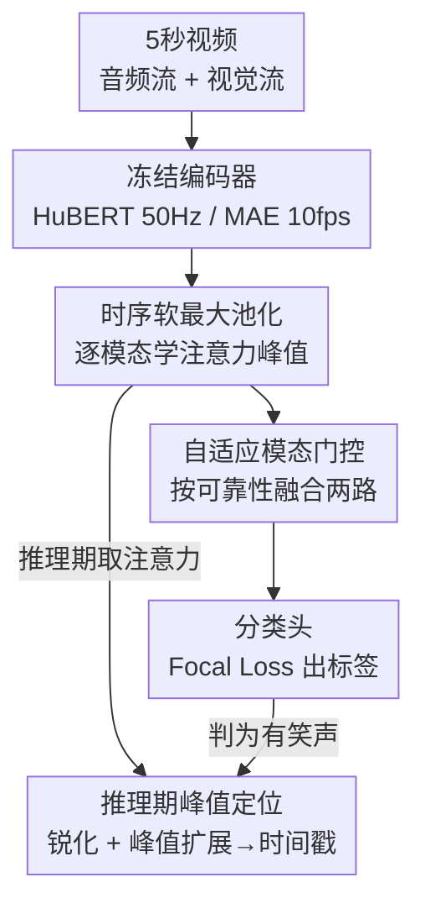

# MTLLFM: Multimodal-Temporal Laughter Localization

**会议**: CVPR 2026  
**arXiv**: [2605.25409](https://arxiv.org/abs/2605.25409)  
**代码**: https://github.com/WSCSports/MTLLFM-temporal-laughter-localization (有)  
**领域**: 视频理解 / 多模态情感计算  
**关键词**: 笑声定位, 弱监督时序定位, 多模态融合, 模态门控, 时序软最大池化

## 一句话总结
把视频中的"笑声检测"从粗粒度的片段级分类升级为亚秒级的时序定位：用冻结的 HuBERT + MAE 编码器加一套轻量的"时序软最大池化 + 自适应模态门控"，仅靠片段级标签（弱监督）就能学出每次笑声的精确起止边界，在体育广播数据上拿到 99% 分类 F1、68.1% 定位精度，超过 Gemini 3 Flash 等多模态大模型，并配套发布了 11,053 段视频的 UR-FUNNY-Temporal / SMILE-Temporal 时序标注。

## 研究背景与动机

**领域现状**：自动笑声检测是情感计算和叙事理解的重要能力。主流做法（UR-FUNNY、SMILE 等基准）把它当成**片段级二分类**——给一整段视频打一个"有/无幽默"的标签，再用文本/音频/视觉多流融合去预测。

**现有痛点**：现实里的笑声是**短暂、零星、嵌在中性语音里的瞬态事件**（本文统计平均时长仅 1.70~2.16 秒，常常是亚秒级爆发）。用整段标签去训练，标注粒度和事件时长严重错配，引入大量标签噪声，模型根本学不到精确的时序表示，也无法回答"笑声到底什么时候发生"。

**核心矛盾**：要精确定位就需要帧级（onset/offset）标注，但帧级标注极其昂贵、现有数据集也没有；而通用的 cross-attention 融合虽然表达力强，却是 $O(T^2)$ 复杂度、需要大量数据才能在弱监督下学出稀疏的亚秒结构，并不适合大规模连续视频分析。

**本文目标**：(1) 在**只有片段级标签**的弱监督设定下，定位笑声的精确起止；(2) 提供一个能区分说话人/观众、模态主导、强度的细粒度时序标注基准。

**切入角度**：作者观察到笑声是"短促的情感峰值"——与其建模所有时间步的两两交互，不如让模型学一个**显著性驱动的时序注意力分布**，把质量集中到峰值上；同时不同样本的笑声主导模态差异巨大（音频/视觉/双模态占比悬殊），需要按样本动态决定信任谁。

**核心 idea**：用"逐模态的时序软最大池化（saliency 聚合）+ 自适应模态门控"代替重型 cross-attention，把弱监督下学到的注意力分布在**推理期**当作隐式时序定位信号，从片段级标签里"读出"事件边界。

## 方法详解

### 整体框架
模型输入是一段 5 秒视频的音频流和视觉流，输出一个二分类笑声标签 $\hat{y}$，以及两路模态各自的时序注意力分布 $\boldsymbol{\alpha}^a,\boldsymbol{\alpha}^v$ 和模态权重 $w_a,w_v$。整条 pipeline 串成四段：**冻结编码器**抽特征 → 每路模态各自做**时序软最大池化**得到固定维表示 → **自适应模态门控**按可靠性融合两路 → 分类头出标签；训练只用片段级标签做分类，**推理期**再把学到的注意力分布经锐化和峰值扩展，反解出连续时间戳上的笑声区间。整套架构刻意做得轻量——冻结的大模型编码器负责语义，可训练部分只有投影层、池化打分参数和门控线性层。

### 关键设计

**1. 时序软最大池化：把质量集中到亚秒级情感峰值，而不是均摊整段**

弱监督的最大难点是只有片段标签、却要找出嵌在中性语音里的短促笑声。常规的 mean/max pooling 要么把所有时间步一视同仁、要么只取一个最极端特征，都抓不到瞬态情感的时序结构。本文为每个模态 $m$ 的每个时间步特征 $f_m^t$ 学一个标量重要度 $e_m^t = \tanh(\mathbf{w}^\top f_m^t + b)$，再 softmax 归一化成时间上的概率分布 $\alpha_m^t = \frac{\exp(e_m^t)}{\sum_j \exp(e_m^j)}$，最后加权聚合 $\mathbf{f}_m = \sum_t \alpha_m^t f_m^t$。相比从动作定位借来的原版机制，作者做了两点关键适配：**逐模态独立池化**（在融合前做，而非拼接后），让每路保留自己的时序定位；以及**在 softmax 前加 $\tanh$ 门控**把分数限制在 $[-1,1]$、防止注意力在高时间分辨率下饱和。这个机制只有 $O(T)$ 复杂度（每个时间步算一个标量分），既比 self-attention 的 $O(T^2)$ 省，又天然产出可解释的时序注意力——而这个注意力正是推理期定位的信号源

**2. 自适应模态门控：按样本动态决定信任音频还是画面**

笑声的主导模态因情境而异——有时是响亮的声音笑（音频主导）、有时是抿嘴或无声窃笑（视觉主导）；体育广播里更棘手，音频常混入高能量的解说噪声（伪装成情绪强度），画面里上镜者却面无表情（笑声来自镜头外）。固定权重融合处理不了这种模态冲突。本文用两路独立线性层从池化表示算门控 logit $g_a = \mathbf{w}_a^\top \mathbf{f}_a$、$g_v = \mathbf{w}_v^\top \mathbf{f}_v$，再 softmax 成互补权重 $[w_a, w_v] = \mathrm{softmax}([g_a, g_v])$（满足 $w_a + w_v = 1$），融合表示为 $\mathbf{f}_{\text{fused}} = w_a \mathbf{f}_a + w_v \mathbf{f}_v$。这让模型对每个实例都挑更可靠的那路模态——数据统计显示约 79%~92% 的笑声以音频为主，但仍有不可忽略的一部分需要视觉或双模态证据，门控正是把这部分救回来（消融里 full model 比 audio-only 再涨 +7.7 点定位精度就来自这里）

**3. 推理期峰值定位：把弱监督学到的注意力反解成连续时间戳**

训练全程只见过片段级标签，怎么输出起止边界？作者不额外训练定位头，而是直接复用注意力分布做**后处理定位**。对判为有笑声（$\hat{y}=1$）的片段，先做温度锐化 $\tilde{\alpha}_m^t = \frac{(\alpha_m^t)^{1/\tau}}{\sum_j (\alpha_m^j)^{1/\tau}}$ 突出峰值（实验用 $\tau=0.5$），把两路对齐到统一的 $N$ 个时间 bin（音频 max-pool、视觉线性插值），按模态权重合成信号 $\beta_n = w_a \tilde{\alpha}_a^{(n)} + w_v \tilde{\alpha}_v^{(n)}$；然后取峰值 bin $n^* = \arg\max_n \beta_n$，向左右扩展所有"注意力超过均值 $\bar\beta$"的相邻 bin，再把 bin 区间映射回连续时间戳（5 秒切 50 bin 即 0.1 秒分辨率）。这一步把"分类时顺带学到的显著性"零成本变成了可用的定位输出，是整个弱监督方案能成立的关键闭环

> ⚠️ **框架↔关键设计一致**：框架图中的"冻结编码器"和"分类头"是通用脚手架节点（HuBERT+MAE 冻结抽特征、Focal Loss 线性分类头处理类别不均衡），不单列设计点；三个贡献组件——时序软最大池化、自适应模态门控、推理期峰值定位——与关键设计一一对应。

### 损失函数 / 训练策略
仅用片段级二分类标签训练，分类头用 **Focal Loss** 处理正负样本不均衡（负样本远多于含笑声样本），并按过滤后的数据分布设类别权重。优化器 Adam，学习率 $10^{-4}$，batch size 32，投影/融合层隐藏维 1024、dropout 0.5，最多训 50 epoch、按验证损失早停。所有特征预先用冻结编码器抽好并缓存。

## 实验关键数据

### 主实验
三个数据集（SportsPress 体育广播自建集、UR-FUNNY-Temporal、SMILE-Temporal）上对比多模态基础模型，分类用 F1、定位用 Precision@IoU=0.5 和 Mean IoU（定位只在正样本上算）：

| 数据集 | 方法 | Cls.F1 | Loc@.5 | Mean IoU |
|--------|------|--------|--------|----------|
| SportsPress | Qwen2.5 Omni 7B | 0.997 | 0.208 | 0.301 |
| SportsPress | Gemini 3 Flash | 0.885 | 0.542 | 0.546 |
| SportsPress | **MTLLFM (本文)** | 0.990 | **0.681** | **0.580** |
| UR-FUNNY | Gemini 3 Flash | 0.775 | 0.393 | 0.405 |
| UR-FUNNY | **MTLLFM (本文)** | **0.849** | **0.497** | **0.466** |
| SMILE | Gemini 3 Flash | 0.724 | 0.579 | 0.540 |
| SMILE | **MTLLFM (本文)** | **0.803** | 0.567 | 0.511 |

关键对比：Qwen2.5 Omni 在 SportsPress 分类 F1 高达 99.7%，定位却只有 20.8%——说明**语义理解强不等于时序定位准**。本文在 SportsPress、UR-FUNNY 上分类+定位全面领先；SMILE 上 Gemini 定位略高（57.9% vs 56.7%），但该集以发音清晰的观众笑声为主、对语义模型更友好，本文仍保住最高分类 F1 且计算开销远更低。

### 消融实验
在 SportsPress 上逐组件消融（保持其余超参一致）：

| 配置 | F1 | P@.5 | IoU | 说明 |
|------|----|------|-----|------|
| Full Model (本文) | 0.990 | 0.681 | 0.580 | 完整模型 |
| Mean Pool | 0.968 | 0.160 | 0.347 | 无定位机制，回退整段预测 |
| Max Pool | 0.946 | 0.160 | 0.347 | 同上 |
| Self-Attention Pool | 0.653 | 0.188 | 0.274 | 通用注意力学不出稀疏结构 |
| w/o Tanh Gating | 0.979 | 0.639 | 0.562 | 去 tanh 门控，掉 4.2 点 P@.5 |
| Concat (no gate) | 0.976 | 0.618 | 0.535 | 拼接融合无门控 |
| Sigmoid Gate | 0.986 | 0.625 | 0.555 | sigmoid 门控不如 softmax |
| Cross-Attention Fusion | 0.677 | 0.248 | 0.324 | 跨模态注意力弱监督下失效 |
| Audio Only | 0.979 | 0.604 | 0.552 | 仅音频 |
| Vision Only | 0.675 | 0.257 | 0.322 | 仅视觉，远差于音频 |

### 关键发现
- **软最大池化是定位能力的来源**：mean/max pooling 没有定位机制（P@.5≈0.160），换上软最大池化直接 4× 提升到 68.1%，且分类不掉点。
- **tanh 门控防注意力饱和**：去掉它 P@.5 从 68.1% 掉到 63.9%（-4.2 点）。
- **softmax 门控 > 拼接/sigmoid 融合** 3~7 个 P@.5 点；音频单模态（60.4%）远胜视觉（25.7%），印证标注里的声学主导，而 full model 在 audio-only 上再 +7.7 点说明门控确实救回了互补视觉线索。
- **下游推理增益惊人**：把本文预测的 `<LAUGHTER>` token 按精确时间戳插进字幕喂给 LLM，GPT-3.5 在 Video Laugh Reasoning 上 CIDEr 暴涨 **+227.2%**（0.262→0.858），BLEU-4 +58.7%，且**带标签的 GPT-3.5 全面超过不带标签的 GPT-4o**——精确时序定位能跨越模型代际的能力鸿沟。

## 亮点与洞察
- **"分类顺带学定位"的零成本闭环**：模型从头到尾没见过帧级标签，却靠分类时学到的注意力分布在推理期反解出亚秒级边界——弱监督下"免费"拿到定位，工程上极省标注成本。
- **轻量专用 > 通用大模型**：在亚秒级瞬态事件上，$O(T)$ 的显著性池化打败了 Gemini/Qwen 这类通用多模态推理系统，给"特定任务用特定时序建模"提供了有力证据。
- **下游验证最让人"啊哈"**：定位精度不只是一个 benchmark 数字——把笑声时间戳显式喂给 LLM，能让弱模型 GPT-3.5 反超强模型 GPT-4o，说明"精确时序 grounding"是比"堆模型能力"更划算的一条路。
- **可迁移性**：整套框架（逐模态显著性池化 + 自适应门控 + 注意力反解定位）天然适用于其他瞬态情感信号——兴奋爆发、微表情等——把"瞬态社交信号的弱监督时序 grounding"做成了通用范式。

## 局限与展望
- **SportsPress 不公开**：核心目标域（体育广播）数据集因转播版权无法发布，外部无法在该域复现 68.1% 这个最亮眼的数字（仅公开 UR-FUNNY/SMILE 时序标注）。
- **SMILE 上未稳赢**：定位精度略低于 Gemini（56.7% vs 57.9%），在"发音清晰、观众笑声明显"的场景里通用语义模型仍有竞争力，专用架构的优势边界值得进一步研究。
- **强依赖声学主导**：标注里约 79%~92% 笑声以音频为主，vision-only 仅 25.7% P@.5；在音频缺失/嘈杂或纯视觉笑（无声窃笑）占比高的场景，方法可靠性存疑。
- **定位是后处理而非端到端**：峰值扩展依赖温度 $\tau$、bin 数 $N$ 等手工后处理超参，没有端到端优化定位目标；模型本身只学了分类，定位质量受这套启发式规则影响。
- **改进方向**：作者已释放全部帧级时序标注，可用于训练全监督/半监督 TAL 模型，或研究"少量时序标签如何 bootstrap 弱监督方法"。

## 相关工作与启发
- **vs 片段级幽默识别（UR-FUNNY / SMILE 原版）**：它们只在 clip 级做"有/无幽默"分类，本文把同样的视频补上精确 onset/offset 时序标注并升级为定位任务，区别在于**标注粒度从片段降到亚秒**，配套元数据（说话人/观众、模态主导、强度）也支撑了模态感知的新研究方向。
- **vs 多模态基础模型（Gemini 3 Flash / Qwen2.5 Omni）**：它们靠通用语义推理，分类强但亚秒定位弱（Qwen 99.7% F1 却 20.8% 定位）；本文用任务专用的时序注意力，以远低的算力拿到更高定位精度，证明语义理解不会自动转化为时序精度。
- **vs 弱监督动作定位（UntrimmedNets / 软最大池化原版）**：本文从动作定位借来软最大池化，但针对情感信号做了"逐模态独立池化 + tanh 门控"两点适配，应对笑声比动作短得多、更细微的特性。
- **vs 重型 cross-attention 融合**：cross-attention 是 $O(T^2)$、弱监督下需大量数据，消融里 cross-attention fusion 直接崩到 P@.5=0.248；本文的轻量门控融合更适合稀疏瞬态事件和大规模连续视频。

## 评分
- 新颖性: ⭐⭐⭐⭐ 把笑声从片段分类升级到弱监督亚秒定位，"分类注意力反解定位"的闭环 + 配套时序基准都是实打实的贡献，组件本身多为已有机制的巧妙适配。
- 实验充分度: ⭐⭐⭐⭐ 三数据集对比 + 完整逐组件消融 + 下游推理增益（CIDEr +227%）证据链完整，唯目标域 SportsPress 不公开略减分。
- 写作质量: ⭐⭐⭐⭐ 动机与方法叙述清晰，公式完整，标注统计详尽。
- 价值: ⭐⭐⭐⭐ 释放 11k+ 视频的细粒度时序笑声标注 + 代码，对情感计算/多模态时序 grounding 社区有实用价值，下游"小模型反超大模型"的发现也有启发性。

<!-- RELATED:START -->

## 相关论文

- [\[CVPR 2026\] VideoITG: Multimodal Video Understanding with Instructed Temporal Grounding](videoitg_multimodal_video_understanding_with_instructed_temporal_grounding.md)
- [\[CVPR 2026\] Memory Matters: Boosting Training-Free Zero-Shot Temporal Action Localization with a Learnable Lookup Table](memory_matters_boosting_training-free_zero-shot_temporal_action_localization_wit.md)
- [\[CVPR 2026\] CLCR: Cross-Level Semantic Collaborative Representation for Multimodal Learning](clcr_cross-level_semantic_collaborative_representation_for_multimodal_learning.md)
- [\[ECCV 2024\] Online Temporal Action Localization with Memory-Augmented Transformer](../../ECCV2024/video_understanding/online_temporal_action_localization_with_memory-augmented_transformer.md)
- [\[CVPR 2026\] OpenMarcie: Dataset for Multimodal Action Recognition in Industrial Environments](openmarcie_dataset_for_multimodal_action_recognition_in_industrial_environments.md)

<!-- RELATED:END -->
