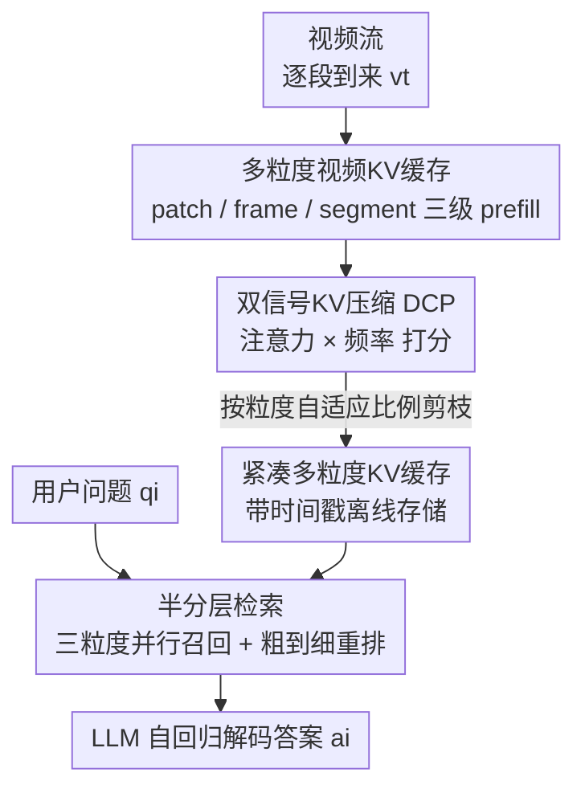

<!-- 由 tmp/gen_cvf_stubs.py 自动生成（CVF-only，无 arXiv） -->
# MuKV: Multi-Grained KV Cache Compression for Long Streaming Video Question-Answering

**会议**: CVPR 2026  
**论文**: [CVF Open Access](https://openaccess.thecvf.com/content/CVPR2026/html/Xiao_MuKV_Multi-Grained_KV_Cache_Compression_for_Long_Streaming_Video_Question-Answering_CVPR_2026_paper.html)  
**代码**: 待确认  
**领域**: 视频理解  
**关键词**: 流式视频QA, KV缓存压缩, 多粒度表示, 频域信号, 分层检索

## 一句话总结
MuKV 把流式长视频的历史 KV 缓存按 patch/frame/segment 三种粒度同时存储，再用「自注意力 + 频率」双信号剪枝压缩冗余、用「半分层检索」在线召回相关缓存，在不增加显存和在线延迟的前提下显著提升长流视频问答准确率。

## 研究背景与动机

**领域现状**：流式视频问答（streaming VideoQA）要在视频持续到来、用户随时提问的场景下作答。由于视觉 token 随时间线性增长、很快超出 LLM 的上下文窗口，主流有三条路线：端到端 MLLM（靠 token 压缩硬塞进长上下文）、Socratic/agentic 方案（离线存视觉描述或 embedding、在线检索），以及近期的 KV-cache 方案（ReKV）——后者把历史帧的 Key-Value 缓存直接存下来，在线问答时无需重新 prefill 历史 token，是目前训练免费且在线最高效的折中。

**现有痛点**：ReKV 这类 KV-cache 方法**只按帧（per-frame）粒度缓存**。单一帧级表示既编码不出帧内的区域级（region-level）空间细节，也捕捉不到跨帧的时序上下文；同时缓存量随时间线性膨胀，带来巨大存储冗余，冗余又反过来干扰检索、拖累问答准确率。

**核心矛盾**：保真度与效率之间的拉锯——想保留更细的空间/时序信息就要存更多 token（显存和检索噪声都上升），想省显存就只能粗粒度缓存（丢细节）。单一粒度的缓存无法同时兼顾两端。

**本文目标**：在 KV-cache 框架内，既保住多粒度的空间/时序保真度，又把缓存压到亚线性增长，并保证在线检索准确高效。拆成三个子问题：怎么多粒度地存、怎么压掉冗余、怎么准确召回。

**切入角度**：作者观察到不同粒度承担不同语义角色（segment 提供叙事级时序语境、patch 捕捉区域变化），而 token 的**频率分布**能反映内容变化性——静态/冗余内容频率低、动态变化内容频率高，且 FFT 计算高效。于是用频率作为一个任务无关、低开销的冗余指标，去补自注意力分数的不足。

**核心 idea**：用「多粒度缓存 + 双信号（注意力×频率）剪枝压缩 + 半分层检索」替代单一帧级缓存，把保真度和效率同时拿下，且全程训练免费、模型无关。

## 方法详解

### 整体框架
MuKV 沿用 KV-cache 流式问答框架，分**离线记忆**与**在线检索**两段。离线阶段：视频以「段（segment）」为单位增量到来，每段同时抽出三种粒度表示（整段 / 中间帧 / 中间帧的超像素 patch），分别独立 prefill 进 LLM 得到三套 KV 缓存与注意力权重；随后 DCP 模块用注意力分数与频率分数双信号给每个粒度的 token 打重要性分、按粒度自适应比例剪枝，存成紧凑的多粒度缓存。在线阶段：问题到来时，先在三种粒度上用问题做 query 并行检索 top 块，再用 segment 级全局表示对低粒度候选做粗到细重排，最终把召回的 KV 连同问题喂给 LLM 自回归解码答案。整个流程 training-free、模型无关。

### 关键设计

**1. 多粒度视频 KV 缓存：用一次编码同时拿到 patch/frame/segment 三级语境**

针对「帧级缓存编码不出区域细节和时序上下文」的痛点，MuKV 改以段为单位（实验里 4 帧、约 8 秒为一段）抽取三级表示：整段 $v_t$、段中间帧 $f_t$、中间帧的超 patch $p_{f_t}$。巧的是在 LLaVA-OV 这类 MLLM 里，每个视觉 token 本就对应一个原始帧 patch，所以三级表示**只需把视觉 token 按不同尺度分组**就能得到，不用多次跑视觉编码器：设每段 $F$ 帧、每帧 $P$ 个 patch、按 $S$ 个超 patch 划分（$S<P$），则 $v_t=\{x_i\}_{i=1}^{O}$（$O=P\times F$）、$f_t=\{x_i\}_{i=1}^{P}$、$p_{f_t}=\{x_i\}_{i=1}^{\lfloor P/S\rfloor}$ 分别表示段/中间帧/超 patch。每个粒度的 token 连同该粒度过去的 KV 一起独立喂进 LLM，得到本步 KV 缓存 $\{(K_{f_t}^{(\ell)},V_{f_t}^{(\ell)})\}_{\ell=1}^{L}$ 以及注意力权重 $A_{f_t}^{(\ell)}$（供后续压缩用）。每步三次 prefill 在实现上并行执行、不增加额外延迟。这样既保住 segment 的全局时序语境，又保住 patch 的局部空间细节。

**2. 双信号 KV 压缩 DCP：注意力分数 + 频域信号联合剪冗余**

多粒度缓存会带来沉重的显存冗余，DCP 对每个粒度独立剪枝。它用两个互补指标给 token 打分。一是**注意力指标**：自注意力天然反映 token 在序列中的重要性、且 prefill 时顺带就有、零额外开销；作者实验发现中间层注意力分布无明显规律，故取**最后一层**、跨多头多 token 聚合得到帧内每个 token 的重要性

$$I_{att}=\frac{1}{H\cdot P}\sum_{h=1}^{H}\sum_{i=1}^{P}A_{h,i}^{(L)},\quad I_{att}\in\mathbb{R}^{P\times1}$$

但注意力分数会过拟合预训练任务、对新任务泛化差，于是引入第二个**频率指标**：用 FFT 把 token 的 key 向量沿序列变到频域 $Z_{fft}=\mathrm{FFT}(k_{P\times D})$，再对每个 token 的频率表示在维度上做均值池化得到 $I_{fft}=\mathrm{Mean}(Z_{fft}^{P\times D})$。直觉是频率刻画内容变化性——静态/冗余内容频率低、动态变化内容频率高，且高频 token 在多数维度上幅值更大，故均值池化能区分。最后两信号 min-max 归一化后加权融合

$$I_{f_t}=\alpha_{f_t}\hat{I}_{att}+(1-\alpha_{f_t})\hat{I}_{fft},\quad I_{f_t}\in\mathbb{R}^{P\times1}$$

$\alpha$ 控制二者权衡。值得注意的是论文发现该任务中应**保留高频 token**（而非像处理文本时丢高频）——消融里保留高频比保留低频在 RVSEgo 上高出 3.7%。频率分数还能校正注意力的位置偏置：实验观察到早到的 token 普遍注意力偏高、晚到的偏低，而频率分布更样本特异，二者互补效果最好。

**3. 粒度自适应压缩：不同粒度用不同保留比例**

由于 segment 提供语义叙事语境、patch 捕捉区域变化，三者功能不同，统一压缩比并不合理。DCP 按融合分数 $I$ 降序，每个粒度各保留 top $\kappa=\lfloor\rho\cdot|\cdot|\rfloor$ 个 token，$\rho_{v_t},\rho_{f_t},\rho_{p_{f_t}}$ 为粒度专属超参（实验取 $\rho=\{0.1,0.1,0.8\}$，即段/帧粒度狠压、patch 粒度多留）。剪枝后的 KV 切片连同时间戳存储，形成紧凑的多粒度缓存。作者把整体缓存压到 ReKV 的约 1/3（因为有三个粒度表示），在同等缓存预算下反而获得显著精度提升。

**4. 半分层 KV 检索：并行召回打底 + 粗到细重排去噪**

纯并行检索（在所有 token 上一视同仁算相似度）会因局部视觉内容的强跨模态响应引入噪声；纯分层检索（先选 segment 再在其内找细粒度）一旦顶层选错就会错误传播。MuKV 取折中做两阶段。**阶段一并行检索**：把每个粒度块的最后一层 key 均值池化成块表示 $k_{f_t}=\frac{1}{N_p}\sum_{j}k_j$，问题 token 也均值池化成全局 query $q$，按余弦相似度 $s_{f_t}=\cos(q,K_{f_t})$ 在每个粒度各取 top-$2k_g$ 块。**阶段二分层重排**：用阶段一召回的 top-N segment 级表示平均出全局 query，对低粒度候选 $j$ 算与全局 query 的一致性分 $\gamma_j$，更新排序分

$$\tilde{s}_j=(1-\lambda_g)s_j+\lambda_g\gamma_j$$

$\lambda_g$ 是连贯性强制因子：低粒度块需要更大 $\lambda_g$ 把它锚定到全局 segment（实验取 patch/frame 为 0.3），而 segment 级本身就是全局 query 的来源故设 $\lambda_g=0$。最后按校准分 $\tilde{s}$ 每粒度取 top-$k_g$ 块。这样既用并行打底避免错误传播，又用 segment 全局语境去掉低粒度噪声。

### 一个完整示例
以 StreamingBench 上一条赛车视频问答为例：视频按段流入，离线已存好三粒度缓存。提问「现在领跑的车是什么颜色？」时，半分层检索先在三粒度并行召回候选块，再用最相关的几个 segment 块（包含「赛车在赛道飞驰」的时序语境）作全局 query，把那些只匹配到局部红色车身、但时序上对不上的 patch 候选重排压低，最终召回真正与「当前领跑」对应的帧/patch 块。结果 MuKV 答「Yellow」、而只看帧级缓存的 ReKV 误答「Blue」——这正体现了 segment 级时序语境对低粒度细节的纠偏作用。

## 实验关键数据

### 主实验
在 RVSEgo、RVSMovie（VStream-QA）和 StreamingBench（实时子集）上评测，骨干为 LLaVA-OV（0.5B/7B），效率用「推理/显存可视化 token 数」这一设备无关指标衡量（token 越少越高效）。

| 模型 | 规模 | #推理Tok↓ | #显存Tok↓ | RVSEgo | RVSMovie | StreamingBench(All) |
|------|------|-----------|-----------|--------|----------|---------------------|
| ReKV | 0.5B | 12.5K | 59K | 51.5 | 42.3 | 52.7 |
| MuKV | 0.5B | **8.3K** | 59K | **57.9** | **45.2** | **56.8** |
| ReKV | 7B | 12.5K | 59K | 56.2 | 48.2 | 62.3 |
| MuKV | 7B | **8.3K** | 59K | **59.5** | 48.5 | **64.4** |

MuKV 在 RVSEgo 和 StreamingBench 上稳定超过 ReKV，且**推理 token 从 12.5K 降到 8.3K（在线更快）、显存持平**。FVStream 在 RVSMovie 上更高（56.1）但泛化极差（StreamingBench 仅 24.3），作者判断它因额外训练而过拟合。

### 消融实验

| 配置 | Acc@Ego | Acc@Movie | 说明 |
|------|---------|-----------|------|
| 仅 patch | 51.6 | 44.1 | 单一最细粒度 |
| 仅 frame | 53.1 | 45.2 | 单一帧级 |
| 仅 segment | 54.9 | 44.8 | 单一段级，三者中最强 |
| patch+frame+segment | **56.5** | **46.0** | 三粒度全开最佳 |

| 压缩配置 | #推理Tok↓ | #显存Tok↓ | Acc@Ego | Acc@Movie |
|----------|-----------|-----------|---------|-----------|
| MuKV 无压缩 | 12.5K | 177K | 53.7 | 44.3 |
| MuKV 仅注意力 | 8.3K | 59K | 55.9 | 45.1 |
| MuKV 仅频率 | 8.3K | 59K | 56.6 | 45.3 |
| MuKV DCP(67%) | 8.3K | 59K | **57.3** | **45.6** |
| ReKV Rand(50%) | 12.5K | 29K | 46.7 | 34.7 |
| ReKV DCP(50%) | 6.3K | 29K | 56.1 | 44.9 |

### 关键发现
- **粒度互补**：单粒度里 segment 最强（说明长视频更依赖动作/事件级的高层时序语义），但三粒度全开才最佳，且因压缩机制不增加任何显存/在线开销。
- **DCP 是「有信息的压缩」而非随机丢**：随机丢一半 token（Rand 50%）准确率反掉 4.8%，而 DCP 压缩反而涨点——压缩压掉的是冗余而非信息。把 DCP 套到 ReKV 上也能稳定提升（DCP(50%) 让 ReKV 显存减半、在线提速 2×，RVSEgo +4.6%）。
- **双信号互补**：仅注意力 55.9、仅频率 56.6、融合 57.3；频率能校正注意力「早到 token 注意力偏高」的位置偏置。
- **半分层检索最优**：并行 56.5 / 纯分层 52.9（错误传播）/ 半分层 57.9（RVSEgo），半分层在去噪与避免错误传播间取得平衡。
- **失败场景**：在「计数(CT)」类问题上不及对手——压缩擅长保全局语义、却对计数所需的细粒度逐帧变化不敏感。
- **频率方向**：保留高频 token 优于保留低频（视频高频对应静态场景前景细节或动态运动）。
- **最优压缩比因数据而异**：MuKV 取 67%（2/3），ReKV 在 RVSMovie 上最优压缩比高达 90%，反映 1 小时长电影内容冗余更高。

## 亮点与洞察
- **「视觉 token 本就对应帧 patch」这一观察被用得很巧**：三粒度表示靠分组现成 token 得到、无需多跑视觉编码器，让多粒度方案几乎零额外编码成本，这是它能「不加显存还提速」的关键工程前提。
- **把频域信号引入视频 KV 压缩并发现要保高频**：与处理文本 KV（FreqKV 丢高频）相反，视频里高频对应前景细节/运动、更该留——这个反直觉结论可迁移到其他视频 token 剪枝任务。
- **频率校正注意力位置偏置**是个漂亮的诊断：注意力对早到 token 系统性偏高，而频率样本特异，二者加权恰好互补，可作为通用的「去位置偏置」剪枝思路。
- **半分层检索**把「并行不分层（有噪声）」和「严格分层（会错误传播）」的优点缝合，对任何多粒度/多层级检索系统都有借鉴意义。
- 全程 training-free、模型无关，换骨干（Qwen3-VL）、加帧率（0.5→3 FPS 时 StreamingBench 升到 71.4%）都能继续涨，落地友好。

## 局限与展望
- **计数类问题短板**：作者承认压缩对计数等需要细粒度逐帧变化的任务不利，这是「保全局语义」压缩范式的固有代价。
- **超参较多且需贪心搜索**：$\alpha$、$\rho$、$k$、$\lambda$ 都按粒度分设、在 RVSEgo 上贪心搜得再迁移，跨域是否稳健存疑；最优压缩比在不同数据集差异巨大（67% vs 90%），缺乏自适应选取机制。
- **段定义偏固定**：4 帧/8 秒一段、取中间帧代表，对快速场景切换或段内剧烈变化可能漏信息；中间帧能否代表整段值得商榷。
- **重排略降效率**：半分层比纯并行多一步重排、稍慢，作者也承认这一点。
- 主要结论依赖 GPT-3.5-turbo 作答案裁判（原 GPT-3.5-turbo-0613 已弃用导致与旧结果略有差异），评测口径变动带来的可比性 caveat 需留意。

## 相关工作与启发
- **vs ReKV**：ReKV 不加区分地按帧存 KV、不考虑信息粒度与冗余；MuKV 改为按段的多粒度紧凑表示 + 压缩，保真度更高、显存亚线性增长。把 DCP 直接套到 ReKV 上也能涨点，说明压缩模块本身是独立贡献。
- **vs InfiniPot-V**：InfiniPot-V 用 Value Norm 作高效指标，但只在空间域选显著区域、无法跨帧跨段分析；MuKV 的 DCP 在受控对比（Tab.5）上稳超 InfiniPot-V 整体方法及其核心模块（7B 上 59.5 vs 57.9）。
- **vs FreqKV**：FreqKV 同样用频率做 KV 压缩，但针对在线 NLP 解码、丢高频文本 token；MuKV 面向视频多粒度缓存、且发现要保高频，本质不同。
- **vs 端到端 / Socratic 方案**：端到端 MLLM 为长程建模牺牲视觉细节、计算二次增长；Socratic/agentic 方案存描述或 embedding 但在线要全量 LLM 计算、延迟高。MuKV 走 KV-cache 路线，在线免历史 token 重算，兼顾效率与细节。

## 评分
- 新颖性: ⭐⭐⭐⭐ 多粒度 KV + 频域双信号压缩 + 半分层检索三件套组合新颖，频域保高频的发现有洞见。
- 实验充分度: ⭐⭐⭐⭐ 三数据集、双规模骨干、8 张消融表覆盖粒度/压缩/检索/频率/层级，较扎实；但部分结论依赖 LLM 裁判、超参靠贪心搜。
- 写作质量: ⭐⭐⭐⭐ 动机与方法层层递进、图表清晰，公式与直觉解释到位。
- 价值: ⭐⭐⭐⭐ 训练免费、模型无关、可即插即用提升现有 KV-cache 流式问答系统，落地价值高。

<!-- RELATED:START -->

## 相关论文

- [\[CVPR 2026\] HERBench: A Benchmark for Multi-Evidence Integration in Video Question Answering](herbench_a_benchmark_for_multi-evidence_integration_in_video_question_answering.md)
- [\[NeurIPS 2025\] InfiniPot-V: Memory-Constrained KV Cache Compression for Streaming Video Understanding](../../NeurIPS2025/video_understanding/infinipot-v_memory-constrained_kv_cache_compression_for_streaming_video_understa.md)
- [\[ACL 2026\] HERMES: KV Cache as Hierarchical Memory for Efficient Streaming Video Understanding](../../ACL2026/video_understanding/hermes_kv_cache_as_hierarchical_memory_for_efficient_streaming_video_understandi.md)
- [\[CVPR 2026\] MovieRecapsQA: A Multimodal Open-Ended Video Question-Answering Benchmark](movierecapsqa_a_multimodal_open-ended_video_question-answering_benchmark.md)
- [\[CVPR 2026\] Ego-Grounding for Personalized Question-Answering in Egocentric Videos](ego-grounding_for_personalized_question-answering_in_egocentric_videos.md)

<!-- RELATED:END -->
