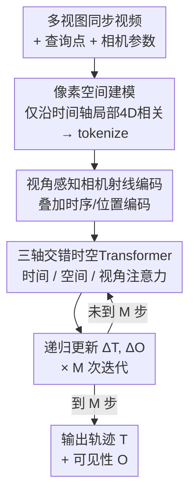

# MV-TAP: Tracking Any Point in Multi-View Videos

**会议**: CVPR 2026  
**论文**: [CVF Open Access](https://openaccess.thecvf.com/content/CVPR2026/html/Koo_MV-TAP_Tracking_Any_Point_in_Multi-View_Videos_CVPR_2026_paper.html)  
**领域**: 视频理解 / 点跟踪 / 多视图几何  
**关键词**: 任意点跟踪, 多视图, 视角注意力, 相机几何编码, 遮挡

## 一句话总结
MV-TAP 把"任意点跟踪"（Track Any Point）从单视图扩展到多视图同步视频，直接在 2D 像素空间建模，靠相机射线编码注入几何上下文、再用一层视角注意力跨视角交换信息，从而在单视角被遮挡/运动模糊处借助其他视角把轨迹补全，在 DexYCB / Panoptic Studio / Kubric / Harmony4D 上全面超过逐视角独立跟踪的单视图 SOTA。

## 研究背景与动机
**领域现状**：点跟踪（Point Tracking / TAP）是理解动态场景的基础工具——给定查询点，预测它在整段视频里的逐帧 2D 轨迹与可见性，支撑 4D 重建、机器人操作、具身智能、视频编辑等下游。CoTracker、TAPIR、LocoTrack、TAPNext 等近期方法已经把单视图视频里的时空一致性做得很好。

**现有痛点**：但这些方法**只在单视图里跑**。单目视频天然有几何歧义——频繁遮挡、剧烈/非刚体运动、深度不确定——一旦点被遮住或运动模糊，单视图跟踪器就会丢轨迹、产生碎片化的轨迹。现实里很多场景（动捕、机械臂、自动驾驶）本来就是多相机同步采集的，可惜没有方法去利用这些跨视角线索。

**核心矛盾**：一个被某个视角遮挡的点，往往在另一个视角里清清楚楚可见；但如果把单视图跟踪器**独立地**套在每个视角上、视角之间不交换任何信息，就完全浪费了这种互补性。已有的尝试要么走多视图匹配（假设静态/刚性场景、需要几何先验，不适合动态点跟踪），要么像 MVTracker 那样把点抬到 3D 世界坐标去跟踪——而这强依赖预先估计的深度质量，把 3D 点重投影回 2D 像素时还会引入重投影误差。

**本文目标**：在**只有多视图视频 + 相机参数、不依赖深度输入**的前提下，直接在 2D 像素空间里把一组查询点跨多个同步视频跟踪出来，既要保住单视图跟踪器已经很强的时空一致性，又要把多视角的互补信息用上。

**切入角度**：作者的关键直觉是——多视角观测对一个动态场景提供的是**互补线索**，跨视角同时推理就能消解单目里的歧义。与其抬到 3D 世界空间承担深度估计的不确定性，不如就留在像素空间、把"跨视角"做成网络里的一种注意力。

**核心 idea**：在一个强 2D 跟踪骨干（CoTracker3）之上，加两件东西——**相机射线编码**把每个跟踪点的几何上下文喂给模型，**视角注意力**让不同视角的 token 互相交换信息——就把单视图跟踪升级成像素空间的多视图跟踪。

## 方法详解

### 整体框架
输入是 $V$ 个**时间同步**的视角视频 $I=\{I_{v,t}\in\mathbb{R}^{H\times W\times3}\}$、每视角独立定义的查询点 $Q=\{q_{v,n}\}$（每个查询 $q=(t_q,x_q,y_q)$ 是"在第 $t_q$ 帧的像素坐标 $(x_q,y_q)$"），以及相机内外参 $G=\{G_{v,t}=K[R_{v,t}|t_{v,t}]\}$。输出是全部点在所有视角、所有时刻的 2D 轨迹 $\mathcal{T}\in\mathbb{R}^{V\times T\times N\times2}$ 和可见性 $\mathcal{O}\in\mathbb{R}^{V\times T\times N\times1}$。注意：不同视角的查询点虽然各自独立定义，但它们指向的是**同一批 3D 场景点**，只是各视角能看见它的起始时刻不同。

整条 pipeline 是"提相关 → 加几何/时序编码 → 三轴注意力迭代精修"的循环：CNN 编码器从每个视角抽特征，对每个查询点沿**时间轴**算局部 4D 相关体得到匹配代价；把代价和当前轨迹位置 tokenize 成 token $X\in\mathbb{R}^{V\times T\times N\times d}$，再叠加相机射线编码与时序位置编码；token 进入一个交错"时间注意力 / 空间注意力 / 视角注意力"的 Transformer，每一步预测轨迹与遮挡的增量 $\Delta\mathcal{T},\Delta\mathcal{O}$ 并加回当前估计，迭代 $M=4$ 次得到最终结果。

### 关键设计

**1. 像素空间建模 + 仅沿时间轴的局部 4D 相关：避开深度依赖，也避开大基线带来的相关噪声**

作者刻意不把点抬到 3D 世界坐标去跟踪（那是 MVTracker / TAPIP3D 的路线），因为抬升强依赖深度估计质量、重投影回像素还会累积误差。MV-TAP 直接在 2D 像素空间预测轨迹，几何信息通过相机参数"软注入"而不是硬抬升。匹配表征沿用单视图跟踪器的局部 4D 相关：给定查询点 $q$ 与假设匹配 $p$，在各自半径 $r_p,r_q$ 的邻域里算归一化相关
$$\mathcal{L}_t(i,j;p,q)=\frac{F_t(i)\cdot F_{t_q}(j)}{\lVert F_t(i)\rVert_2\,\lVert F_{t_q}(j)\rVert_2},$$
其中 $i\in N(p,r_p),\,j\in N(q,r_q)$。一个值得注意的设计抉择是：相关体**只沿时间维构造，不沿视角维**。原因很直接——视角之间基线一大，对应局部 patch 的外观相似度就急剧下降，跨视角的相关会变得不可靠、反而往模型里灌噪声。所以跨视角的信息交换不靠"算外观相关"，而是留给后面的视角注意力去做。

**2. 视角感知的相机射线编码：用 Plücker 射线把跨视角几何上下文喂进 token**

要让网络"知道"各视角之间的相对几何关系，作者把相机参数编码成每个跟踪点对应的射线。每条射线 $r_{v,t,n}\in\mathbb{R}^6$ 用方向 + 矩量（Plücker 坐标）表示：
$$r=\begin{bmatrix}\mathbf{d}\\ \mathbf{m}\end{bmatrix},\quad \mathbf{m}=\mathbf{o}\times\mathbf{d},$$
其中方向与原点由相机参数算出 $\mathbf{d}=R^\top K^{-1}\mathbf{x}$、$\mathbf{o}=-R^\top t$（$\mathbf{x}=(u,v,1)^\top$ 是齐次像素坐标），方向 $\mathbf{d}$ 归一化为单位长度以保证尺度无关。把全部轨迹的坐标张成 $R\in\mathbb{R}^{V\times T\times N\times6}$，过一层 MLP 投到特征维，再与正弦位置编码一起加到输入 token 上。这样每个 token 不只带着"我长什么样"（相关体），还带着"我从哪个视角、哪条射线看出去"的几何上下文，为后面跨视角对齐铺路。

**3. 三轴交错的时空 Transformer，核心是视角注意力：跨视角交换信息消解遮挡歧义**

编码后的 token 进入一个把注意力沿三个轴交错施加的 Transformer——做某个轴的注意力时保持特征维 $d$ 不变，把其余轴拍进 batch 维。**时间注意力**沿帧轴 $T$ 聚合，$\mathrm{Attn}_{\text{temp}}(X)=\mathrm{Softmax}(Q_TK_T^\top/\sqrt{d})V_T$，保证轨迹时序平滑；**空间注意力**沿点轴 $N$ 在同一帧内聚合，把运动模式一致的点联系起来，隐式捕捉刚性先验。但这两者本质上只建模**视角内**关系。真正的关键是**视角注意力**，沿视角轴 $V$ 做 $\mathrm{Attn}_{\text{view}}(X)=\mathrm{Softmax}(Q_VK_V^\top/\sqrt{d})V_V$，让不同视角的表征显式对齐、互相交换信息——某个视角里被遮挡/模糊的点，可以从另一个视角清晰可见的对应 token 那里"借"到正确证据，从而克服视角相关的歧义。消融里去掉视角注意力或相机编码都会掉点，二者叠加最好，说明它们是互补的（射线编码给"几何对得上"的依据，视角注意力做"真正去对齐"的动作）。

### 损失函数 / 训练策略
轨迹与遮挡的迭代更新由 Transformer 每步预测增量 $\Delta\mathcal{T},\Delta\mathcal{O}=\mathrm{Transformer}(X)$，加回上一步估计 $\mathcal{T}^{(m+1)}=\mathcal{T}^{(m)}+\Delta\mathcal{T}$、$\mathcal{O}^{(m+1)}=\mathcal{O}^{(m)}+\Delta\mathcal{O}$，迭代 $M$ 步。训练同时监督两支：轨迹用带迭代折扣的 Huber 损失
$$\mathcal{L}_{\mathrm{track}}=\sum_{m=1}^{M}\gamma^{M-m}\,\ell_{\mathrm{Huber}}\big(\mathcal{T}^{(m)},\mathcal{T}^*\big),$$
遮挡用对 logits 过 sigmoid 后的 BCE，同样按迭代折扣
$$\mathcal{L}_{\mathrm{occ}}=\sum_{m=1}^{M}\gamma^{M-m}\,\mathrm{BCE}\big(\sigma(\mathcal{O}^{(m)}),\mathcal{O}^*\big).$$
由于现有点跟踪训练集只有单视图，作者用 Kubric 引擎自建了 **5,000 个场景的同步多视图合成数据集**（含轨迹、遮挡状态、内外参标注）。模型从 CoTracker3 预训练权重初始化，冻结特征提取网络、其余全更新；在 4×A6000 上训 50K 步，batch=1/卡，AdamW（lr=1e-4、weight decay=1e-4）+ 余弦调度 + 1000 步 warm-up + 梯度裁剪 1.0；训练时输入视角数在 1~4 间随机，分辨率 384×512，轨迹数 384，$M=4$，相关半径 $r_p=r_q=3$。靠注意力机制，推理时可处理任意视角数（即便 >4）。

## 实验关键数据

### 主实验
在 DexYCB、Panoptic Studio、Kubric、Harmony4D 四个数据集、统一 8 视角设置（最远采样）下对比。AJ 是联合位置与遮挡的综合分，$<\delta^x_{avg}$ 是位置精度（PCK），OA 是遮挡判别精度。

| 数据集 | 指标 | MV-TAP | CoTracker3(单视图最强) | CoTracker3+Tri.(三角化) | CoTracker3+Flat.(拍平) |
|--------|------|--------|------------------------|-------------------------|------------------------|
| DexYCB | AJ / $<\delta^x_{avg}$ / OA | **44.2 / 61.9 / 78.3** | 41.5 / 59.6 / 76.4 | 39.2 / 57.1 / 76.4 | 2.7 / 7.1 / 35.7 |
| Panoptic Studio | AJ / $<\delta^x_{avg}$ / OA | **40.3 / 62.8 / 73.1** | 39.6 / 61.4 / 72.3 | 37.9 / 59.5 / 72.3 | 1.0 / 12.7 / 38.8 |
| Kubric | AJ / $<\delta^x_{avg}$ / OA | **87.8 / 94.0 / 96.3** | 83.5 / 90.7 / 94.1 | 70.2 / 82.6 / 94.3 | 19.6 / 29.3 / 34.6 |
| Harmony4D | AJ / $<\delta^x_{avg}$ / OA | **42.6 / 74.9 / 65.8** | 41.4 / 73.5 / 63.2 | 39.2 / 70.4 / 63.2 | 2.1 / 20.7 / 46.4 |

MV-TAP 在四个数据集上几乎全面领先。需要深度输入的 3D 方法（SpatialTracker、TAPIP3D）和 MVTracker 在部分数据集上崩得很厉害（如 TAPIP3D 在 Harmony4D 上 AJ 仅 5.0，MVTracker 在 Harmony4D 上 $<\delta^x_{avg}$ 仅 13.3），说明依赖深度抬升在真实复杂人体场景下很脆弱。最暴露问题的是"拍平"基线（CoTracker3+Flat. 把视角和时间拍成一条序列），几乎全线崩盘——盲目把多视角当长序列处理反而有害。

### 消融实验
| 配置 | DexYCB (AJ / $<\delta^x_{avg}$ / OA) | Panoptic (AJ / $<\delta^x_{avg}$ / OA) | 说明 |
|------|--------------------------------------|----------------------------------------|------|
| CoTracker3 (基线) | 41.5 / 59.6 / 76.4 | 39.6 / 61.4 / 72.3 | 单视图逐视角独立跑 |
| + 视角注意力 | 43.6 / 61.5 / 77.4 | 38.6 / 61.6 / 69.4 | 单加跨视角交互 |
| + 相机编码 | 42.2 / 60.6 / 78.0 | 39.9 / 60.9 / 73.0 | 单加几何上下文 |
| MV-TAP (两者都加) | **44.2 / 61.9 / 78.3** | **40.3 / 62.8 / 73.1** | 完整模型 |

视角数消融（DexYCB）也很关键：MV-TAP 从 2→8 视角，AJ 由 39.2 稳步升到 44.2；而 CoTracker3 几乎不随视角增加而提升（37.5→41.5，增益边际），拍平基线甚至越多视角越差（9.5→2.7）。

### 关键发现
- **视角注意力是主贡献，相机编码是补强**：单加视角注意力在 DexYCB 上 AJ +2.1，但在 Panoptic 上 OA 反而掉（77.4→…实为相对基线 +1.0，而单加时 OA 69.4 低于基线）；两者合用才在所有数据集稳定最好——几何编码像是给跨视角对齐提供了"对得上"的依据，缺它时视角注意力会乱借证据。
- **能借多视角消解遮挡**：在"画面内被遮挡点"上评位置精度（$<\delta^x_{occ}$），MV-TAP 在 DexYCB 上 38.4 vs CoTracker3 的 33.9；在高遮挡频率轨迹（按可见性翻转次数筛）上 AJ 29.7 vs 26.2，验证了跨视角线索确实在补救单视图丢失的点。
- **增益来自架构而非多训**：从同一预训练权重出发、Table 4 控制训练量后，MV-TAP 仍稳定高于 CoTracker3（DexYCB AJ 44.2 vs 41.8），说明涨点来自设计而非额外训练步数。
- **多视角不能盲目拍平**：CoTracker3+Flat. 全线崩溃，且视角越多越差，说明把多视角当长序列硬塞会破坏视角内时序结构；必须像 MV-TAP 这样把"跨视角"显式做成独立的注意力轴。

## 亮点与洞察
- **"跨视角信息交换不靠算相关、靠注意力"是核心洞察**：作者发现大基线下跨视角外观相关不可靠，于是把相关体限制在时间轴、把跨视角交互完全交给视角注意力——这个分工很干净，也解释了为什么简单的三角化/拍平基线打不过它。
- **相机射线（Plücker 坐标）作为几何 token 的复用价值高**：把内外参编码成方向+矩量射线再 MLP 投影加到 token 上，是一种"软注入几何"的通用做法，可迁移到任何需要多视角一致性的视频任务（如多视图视频分割、4D 重建的对应建立）。
- **三轴交错注意力的可扩展性**：训练只用 1~4 视角，推理却能吃任意视角数，这种"轴拍 batch"的设计天然对视角数解耦，工程上很友好。
- **配套数据集填补空白**：合成 5000 场景多视图同步数据 + 真实评测集，把"多视图 2D 点跟踪"这个任务的训练/评测基建一起建起来了，对后续研究是实打实的资产。

## 局限与展望
- **依赖时间同步与已知相机参数**：方法假设各视角严格时间同步、且内外参已知准确，casual in-the-wild 的非标定/不同步多机视频还用不了，几何编码会失真。
- **训练几乎全靠合成数据**：5000 场景来自 Kubric 引擎，真实域与合成域的差距、以及真实评测集规模有限，泛化边界还需更大规模真实数据验证。
- **个别强基线在特定指标仍领先**：TAPIP3D / TAPNext 在少数指标上略高于 MV-TAP（虽各有依赖 GT 深度、或架构重的代价），说明像素空间方案并非在所有维度都占优。
- **跨视角外观相关被直接放弃**：当基线较小、外观仍可靠时，完全不用跨视角相关可能浪费了线索；一个自适应"何时该用跨视角相关"的机制或许能再涨点。
- **视角注意力的可解释性与开销**：随视角数增长，全连接的视角注意力计算量上升，论文未深入分析大量视角下的效率与注意力是否真的"借对了"视角。

## 相关工作与启发
- **vs CoTracker3 [20]（单视图骨干）**：MV-TAP 直接基于它初始化，差别在于补了相机射线编码 + 视角注意力两个模块，把"逐视角独立跑再聚合"升级成"视角之间互通有无"；在遮挡/剧烈运动场景明显更鲁棒。
- **vs MVTracker [29]（最相关的多视图工作）**：MVTracker 在 3D 世界坐标跟踪、强依赖预计算深度、只能给跨视角聚合后的可见性；MV-TAP 留在 2D 像素空间、不要深度、能给逐视角可见性，且在 Harmony4D 等人体场景下远更稳（MVTracker 在那里几乎失效）。
- **vs 多视图匹配方法 [7,27,30,31,34]（SIFT/SuperGlue/LoFTR 等）**：它们针对静态/刚性场景做跨视角对应，与单视图跟踪器拼起来会忽略每视角内的时序一致性、且逐帧重复匹配低效；MV-TAP 把视角与时间一起放进同一个注意力框架联合建模。
- **vs 三角化/拍平基线**：三角化（CoTracker3+Tri.）显式用几何但受单视图预测噪声拖累、可见点上反而掉；拍平（+Flat.）破坏时序结构全线崩溃——两者一起反证了"把跨视角做成独立注意力轴 + 软注入几何"这条路线的必要性。

## 评分
- 新颖性: ⭐⭐⭐⭐ 首个只用多视图视频+相机参数、在 2D 像素空间做任意点跟踪的范式，"时间轴相关 + 视角注意力"的分工是清晰的新点，但模块本身（射线编码、轴向注意力）多为成熟组件的组合。
- 实验充分度: ⭐⭐⭐⭐⭐ 四数据集主对比 + 视角数/点数/遮挡频率/架构消融 + 多种基线（含三角化、拍平、3D 方法）覆盖很全，证据链扎实。
- 写作质量: ⭐⭐⭐⭐ 动机与设计抉择（为何不算跨视角相关、为何不抬 3D）讲得清楚，公式规整；个别消融数值（如单加视角注意力时 Panoptic 的 OA）需对照表格细读。
- 价值: ⭐⭐⭐⭐ 定义了一个有现实需求（动捕/机械臂/自驾多机）的新任务，并给出数据集 + 强基线，对多视图视频理解是有用的起点。

<!-- RELATED:START -->

## 相关论文

- [\[CVPR 2026\] MER-Tracker: Towards High-Speed 3D Point Tracking via Multi-View Event-RGB Hybrid Cameras](mer-tracker_towards_high-speed_3d_point_tracking_via_multi-view_event-rgb_hybrid.md)
- [\[CVPR 2025\] ETAP: Event-based Tracking of Any Point](../../CVPR2025/video_understanding/etap_event-based_tracking_of_any_point.md)
- [\[CVPR 2026\] TAPFormer: Robust Arbitrary Point Tracking via Transient Asynchronous Fusion of Frames and Events](ttapformer_robust_arbitrary_point_tracking_via_transient_asynchronous_fusion_of_.md)
- [\[NeurIPS 2025\] TAPVid-360: Tracking Any Point in 360 from Narrow Field of View Video](../../NeurIPS2025/video_understanding/tapvid-360_tracking_any_point_in_360_from_narrow_field_of_view_video.md)
- [\[CVPR 2026\] Real-World Point Tracking with Verifier-Guided Pseudo-Labeling](realworld_point_tracking_with_verifierguided_pseud.md)

<!-- RELATED:END -->
