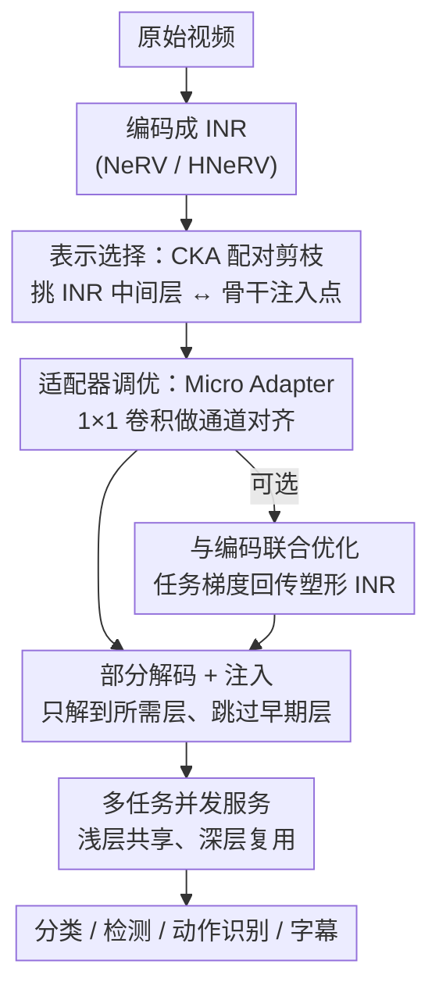

# Neural-Centric Video Processing Pipeline for Unified Multi-Task Inference

**会议**: CVPR 2026  
**论文**: [CVF Open Access](https://openaccess.thecvf.com/content/CVPR2026/html/Lee_Neural-Centric_Video_Processing_Pipeline_for_Unified_Multi-Task_Inference_CVPR_2026_paper.html)  
**领域**: 视频理解 / 视频编码 / 推理效率  
**关键词**: 隐式神经表示, 视频编码, 多任务推理, 部分解码, 特征适配器

## 一句话总结
把视频直接编码成隐式神经表示（INR/NeRV），用 CKA 挑出"INR 中间层 ↔ 下游骨干网络注入点"的最佳配对，再训练极轻量的 1×1 卷积 Micro Adapter 做特征转换，从而在推理时**只解码到所需中间层**、跳过像素重建和骨干早期层，让同一份表示同时服务分类/检测/动作识别/字幕等多任务，端到端延迟最多降 89.5%、推理 FLOPs 最多降 29.9%。

## 研究背景与动机
**领域现状**：视频越来越多地作为机器学习系统的输入，而真实部署（点播、监控、内容审核）普遍是 **Write-Once-Read-Many（WORM）**模式——视频在服务器编码一次，之后被各种任务、模型、时间区间、分辨率反复查询。在这种负载下，主导成本不是一次性编码，而是**反复解码 + 推理**。

**现有痛点**：现行管线是"传统编解码器（H.264/HEVC）存储 → 按需解码成像素 → 预处理 → 骨干网络早期层抽特征"。这套范式是为人眼感知（PSNR/SSIM）设计的，对机器视觉而言每一步都在做冗余功：神经网络在特征提取阶段会丢掉超过 50% 的像素级细节，却仍被迫先把它们完整重建出来。更糟的是，同一段视频上跑 N 个任务，每个任务都要重走一遍 decode→preprocess→extract，计算被严重重复。

**核心矛盾**：两条已有路线都没解决"统一表示"问题。**压缩域推理（CDI）**直接在码流副产物（运动矢量、残差）上推理，绕过解码，但被特定编解码器结构死死绑定，换任务就要重设计；**面向机器的视频编码（VCM）**把像素编码整体换成任务优化的学习特征，但要为每个领域定制编码器、从头训练，无法复用预训练 RGB 骨干，且大多只针对静态图、很少支持人眼可视化。两者都无法提供"一份表示服务任意下游任务且无需重编码"。

**切入角度**：作者观察到 INR（如 NeRV）天然由 CNN 层级构成，**它解码视频的层级方向恰好与下游视觉模型抽象特征的方向相反**——NeRV 早层先生成粗粒度全局语义、深层再细化空间细节，而 YOLO/ResNet 等是从细节走向抽象。这意味着 NeRV 的中间层激活**本身就是多个抽象层级上的语义特征**，且都活在"神经特征空间"里（是 CNN 激活而非像素），可以直接喂给下游网络，根本不必先还原成像素。

**核心 idea**：把视频直接存成 INR，让它成为一个能在任意抽象层级吐特征的连续函数；推理时只解码到任务需要的那一层，用轻量适配器桥接到下游骨干的对应位置，从而一份表示统一了压缩、存储、可视化与多任务推理。

## 方法详解

### 整体框架
NVP（Neural-Centric Video Pipeline）分两阶段。**编码阶段（离线、一次性）**：给定一段已编码成 INR 的视频（训到收敛或达到 PSNR≥33dB 阈值）和一组下游任务模型，为每个任务产出三样东西——(1) INR 层级里最优的特征抽取层、(2) 任务骨干里对应的注入点、(3) 一个把两个表示空间对齐的训练好的适配器。其中靠 **Representation Selection（CKA 剪枝）**确定"哪层配哪层"，靠 **Adapter Tuning** 训练 Micro Adapter 完成数值映射；还可选地把 INR 权重和任务损失一起**联合优化**，让表示本身被下游目标塑形。**推理阶段（在线）**：来了任务请求就查编码阶段存下的路由信息，**部分解码**到指定中间层 → 过对应 Micro Adapter 转换 → 直接注入目标骨干的中间层。多任务并发时，浅层特征算一次、深层任务复用浅层结果，跨任务共享计算。

### 关键设计

**1. 表示选择：用 CKA 把"哪层配哪层"的指数搜索空间剪到可承受**

痛点很现实：不同任务要的抽象层级不同（分类要粗语义、检测要细空间细节），每段视频的时空特性又不一样，要穷举所有"INR 层 × 骨干层"组合，每个任务得训练评估上百个适配器，部署成本爆炸。NVP 改用 **Centered Kernel Alignment（CKA）**——一个衡量两组神经激活表示相似度的指标——在**核空间**而非原始特征距离上度量对齐，因此对尺度变化和部分重叠都鲁棒。对每个候选配对计算

$$\mathrm{CKA}(F_{\text{INR}}, F_{\text{backbone}}) = \frac{\lVert F_{\text{backbone}}^{\top} F_{\text{INR}}\rVert_F^2}{\lVert F_{\text{backbone}}^{\top} F_{\text{backbone}}\rVert_F \,\lVert F_{\text{INR}}^{\top} F_{\text{INR}}\rVert_F}$$

其中 $\lVert\cdot\rVert_F$ 是 Frobenius 范数。按 CKA 相似度排序后只保留每个任务的 top-k（如 top 10%，论文实现取 top-K=10），把上百个候选剪成一小撮再去真正训练适配器。消融显示：只训 top 5%/10%/20% 的候选就能拿到最优或在 2% 误差内的精度，而相比穷举节省 68.8% 计算——说明 CKA 排序确实抓住了"哪些配对值得训"。

**2. Micro Adapter：解耦空间与通道变换的 1×1 卷积桥**

即便两组特征"看起来像"，要真正喂进下游模型仍需一个数值上的特征到特征映射。NVP 的适配器刻意做得极简：**先用双线性插值把 INR 中间特征在空间维度 resize 到目标骨干期望的尺寸，再用 1×1 卷积做通道维变换**——把空间和通道两件事拆开，避免像复杂特征迁移方法那样调 kernel size、stride、pooling。需要更强映射时就堆几层卷积加容量，结构始终简单。代价极低：适配器只占骨干参数的 0.02%–0.96%（ResNet-50 仅 0.02%，最大的 BLIP 也只 0.20%）。这一解耦让"视频表示"与"任务建模"彻底分离——加新任务只需训一个轻量适配器（5 分钟内），完全不用动已存好的视频表示，更不用重训大骨干。

**3. 特征迁移复合损失：让适配器又快又稳地对齐**

只用 MSE 训适配器在特征通道尺度差异大时容易不稳、收敛慢。NVP 用三项复合损失

$$\mathcal{L}_{\text{feat}}(\hat{F}, F) = \alpha\,\lVert \hat{F} - F\rVert_2^2 + \beta\left(1 - \frac{\hat{F}\cdot F}{\lVert\hat{F}\rVert\,\lVert F\rVert}\right) + \gamma\,\mathrm{SmoothL1}(\hat{F}, F)$$

MSE 提供主学习信号保证数值重建，余弦距离负责让特征在隐空间里的**朝向**对齐，Huber（SmoothL1）项鲁棒地处理 INR 与骨干特征间的离群与错配；后两者实为正则。权重 $(\alpha,\beta,\gamma)=(1.0,0.2,0.1)$。效果：相比纯 MSE，平均**收敛快 60%**且伪标签 top-1 精度更高——因为单靠 MSE 在通道尺度悬殊时会震荡，余弦+Huber 把"方向对齐"补上后适配更平滑、更语义。

**4. 与编码联合优化 + 部分解码的多任务共享推理**

因为视频表示本身就是一个神经网络，梯度能从任务预测一路回传到 INR 权重，于是可做**任务感知的视频编码**——让表示在固定码率预算下被下游目标塑形。联合目标为

$$\mathcal{L}_{\text{multi}} = \lambda_{\text{recon}}\mathcal{L}_{\text{recon}} + \sum_{i=1}^{T} w_i\big(\lambda^{(i)}_{\text{task}}\mathcal{L}^{(i)}_{\text{task}} + \lambda^{(i)}_{\text{feat}}\mathcal{L}^{(i)}_{\text{feat}}\big)$$

取 $\lambda_{\text{recon}}=1.0,\ \lambda_{\text{task}}=0.5,\ \lambda_{\text{feat}}=0.2$，既保留可视化的视觉保真又让任务梯度塑形特征。推理时落到"部分解码"：INR 只解到所需深度，多任务时浅层算一次、深层任务复用浅层输出向下延伸；同时**跳过骨干早期层**（CNN 早期卷积层算量占比大），由适配器直接把特征注入中间层。两件事叠加——少解码 + 少跑骨干——才是延迟和 FLOPs 大降的来源。

### 损失函数 / 训练策略
两种训练模式：(a) **冻结 INR、只训适配器**——30 epoch、早停、lr 1e-4；(b) **联合优化**——先 100 epoch INR warm-up，再 100 epoch 联合训练，INR 用 lr 1e-5、适配器用 lr 1e-4。两者 batch size 均为 4，损失权重 $(\lambda_{\text{recon}},\lambda_{\text{task}},\lambda_{\text{feat}})=(1.0,0.5,0.2)$、特征迁移权重 $(\alpha,\beta,\gamma)=(1.0,0.2,0.1)$，CKA 剪枝取 top-K=10。INR 骨架用 NeRV / HNeRV，含 3–6 个层级解码块（卷积 + pixel-shuffle 逐级升分辨率）。

## 实验关键数据

评测 4 个任务：分类（ResNet-50 / CLIP-RN50 / ViT-B/16）、动作识别（SlowFast / I3D）、检测（DETR）、字幕（BLIP），数据来自 ImageNet-VID 2015、UCF101、MSR-VTT，全部用标准预训练模型不微调，硬件为 Xeon 4210R + RTX 4090。

### 主实验

总延迟与计算量对比（节选 Table 1，括号内为相对 CPU codec / INR 全解码的降幅）：

| 模型/任务 | 路径 | 总延迟(ms) | 总计算(GFLOPs) | 精度 |
|--------|------|------|------|------|
| ResNet-50 分类 | CPU/GPU Codec | 60.59/17.17 | — | 74.59% |
| ResNet-50 分类 | NVP(HNeRV) | 7.81 (87.1%↓/47.9%↓) | 5.11 (90.0%↓) | **76.74%** |
| CLIP-RN50 分类 | CPU/GPU Codec | 65.17/18.45 | — | 89.65% |
| CLIP-RN50 分类 | NVP(HNeRV) | 6.87 (89.5%↓/52.3%↓) | 7.07 (86.6%↓) | **90.86%** |
| SlowFast 动作识别 | NeRV 全解码 | 130.08/86.66 | 1668.99/511.8 | 62.0% |
| SlowFast 动作识别 | NVP(NeRV) | 34.61 (—/73.4%↓) | 176.93 (89.4%↓) | 61.72% |
| DETR 检测 | CPU/GPU Codec | 108.72/42.05 | — | 0.4436 mAP |
| DETR 检测 | NVP(HNeRV) | 34.99 (67.8%↓/9.4%↓) | 97.66 (25.8%↓) | 0.4395 mAP |

低码率下的率-精度优势（Table 2 节选）：

| 任务 | 码率(bpp) | H.264 | NVP |
|------|------|------|------|
| CLIP-RN50 分类 | 0.025 | 82.60% | **90.12%** (+7.52) |
| SlowFast 动作识别 | 0.02 | 52.89% | **63.38%** (+10.49) |
| DETR 检测 | 0.05 | 0.4005 | **0.4283** |

### 消融实验

| 配置 | 关键指标 | 说明 |
|------|---------|------|
| CKA top-5/10/20% | 最优或 ≤2% 误差内 | 相比穷举省 68.8% 计算 |
| 特征迁移损失 vs 纯 MSE | 收敛快 60% + 更高 top-1 | 余弦+Huber 补朝向对齐 |
| 适配器参数占比 | 0.02%(ResNet)~0.96%(SlowFast) | 最大 BLIP 仅 0.20% |
| 联合优化 vs 仅适配器 | ResNet 83.27% / DETR 0.4438 | 任务梯度塑形 INR 进一步涨点 |

与机器中心方法对比（Table 3/4）：NVP 参数仅 0.42M/0.48M（DeepSVC 为 59.3M），动作识别/检测分别跑到 833/564 FPS，且同时支持可视化与多任务；加新任务只需训轻量适配器 < 5 分钟，而 Compressed Vision 加任务要在 Kinetics-600 上重训 S3D、耗时数天。

### 关键发现
- **延迟大降来自三处叠加**：少解码（INR 按需直解目标帧 + 部分解码）、零预处理（适配器隐式吸收 resize/normalize）、跳骨干早期层（对 CNN 尤其明显，早期卷积算量大）。FLOPs 总降最高 89.98% 主要来自部分解码，骨干跳层额外再降 29.9%。
- **神经表示有时反超像素输入**：ResNet-50 上 NVP 达 76.74% 超过 H.264 的 74.59%，且未用任务标签监督——连续表示让同一物体在视频内预测更稳定，逐帧一致性精度高 4.8%。
- **压缩率与任务精度解耦**：选哪一 INR 层做部分解码决定码率，但不影响下游精度，可按带宽/存储灵活调档。
- **检测是相对弱项**：纯特征到特征映射对像素敏感任务（检测）精度略有损失，作者建议把 bbox 回归等任务损失也加进适配器训练。

## 亮点与洞察
- **"层级反向"这一观察是全文支点**：NeRV 解码 coarse→fine，恰是下游视觉模型 fine→coarse 的镜像，所以中间层激活天然就是多层级语义——把"INR 当编解码器替代"重构成"INR 当可直接对接下游的神经原生表示"，一句话点破了 CDI/VCM 都没抓住的机会。
- **用 CKA 当"配对搜索的廉价代理"很巧**：不去真训上百个适配器，而是先用一个表示相似度指标排序剪枝，把指数级搜索压成训一小撮，且实测近最优——这种"先用便宜指标筛、再精训"的思路可迁移到任何"模块拼接点搜索"问题。
- **解耦空间/通道 + 1×1 卷积适配器**：把跨表示对齐拆成"双线性 resize 管空间 + 1×1 卷管通道"，参数低到 0.02%，让"加任务=训个小适配器"成立，是该框架可扩展性的工程关键。
- **WORM 视角下的成本摊销论证诚实**：作者直面 INR 编码昂贵（10s 1080p 视频 NeRV 30 分钟），用 break-even 查询数（NeRV 约 150K、HNeRV 约 60K）+ NeRV 提速趋势（E-/H-/Meta-NeRV 8×/16×/30×）说明在大规模反复查询场景能摊平，没有回避。

## 局限与展望
- **像素敏感任务掉点**：纯特征映射在检测上精度略降，作者自己也承认需把 bbox 回归等任务损失并入适配器训练。
- **NeRV 编码器对 Transformer 骨干未必最优**：ViT 上的加速幅度（FLOPs 降 59~70%）明显不如 CNN（降 86~90%），因为跳早期卷积层的红利在 ViT 上小；未来需要 backbone-aware 的 INR 架构。
- **一次性编码成本高**：单视频 12~30 分钟编码，只有在 WORM/高查询量场景才划算，低查询量或单次分析场景不适用。
- **可改进**：当前每个 INR 是 per-video 拟合，跨视频的元学习/快速拟合（MetaNeRV 类）若成熟会大幅压低编码门槛；多任务联合训练的协同收益（作者提到"潜在进一步增益"）还没充分挖掘。

## 相关工作与启发
- **vs CDI（CoViAR / DMC-Net）**：CDI 在码流副产物（运动矢量/残差）上推理虽部署友好，但被编解码器结构绑死、表示为重建而非语义优化、换任务要重设计；NVP 在神经特征空间操作、一份表示服务任意任务，且支持端到端联合优化。
- **vs VCM（Compressed Vision / Omnipotent / DeepSVC）**：VCM 用学习特征替代像素编码，但要定制编码器、从头训练、无法复用预训练 RGB 骨干、多不支持可视化；NVP 复用现成预训练骨干（只加适配器）、同时支持人眼可视化与多任务、参数少两个数量级（0.42M vs 59.3M）。
- **vs 把 INR 当编解码器（C3 / NeRV 系压缩）**：以往把 INR 仅当像素重建的码字替代；NVP 把 INR 的中间层当神经原生表示直接对接下游，统一了压缩、可视化与多任务推理。

## 评分
- 新颖性: ⭐⭐⭐⭐⭐ "层级反向"观察 + 把 INR 中间层当神经原生多任务表示，重构了 CDI/VCM 的问题框架，角度新且自洽
- 实验充分度: ⭐⭐⭐⭐ 覆盖 4 任务 7 模型 + 率-精度 + 充分消融，但数据集规模偏小（3K clips）、检测/Transformer 上的弱项未深挖
- 写作质量: ⭐⭐⭐⭐⭐ 动机推导清晰、图示直观、对编码成本等局限直面不回避
- 价值: ⭐⭐⭐⭐ WORM/大规模视频分析场景下系统价值明确、适配器即插即用工程友好；但一次性编码成本和像素敏感任务限制了通用性

<!-- RELATED:START -->

## 相关论文

- [\[CVPR 2026\] SDTrack: A Baseline for Event-based Tracking via Spiking Neural Networks](sdtrack_a_baseline_for_event-based_tracking_via_spiking_neural_networks.md)
- [\[CVPR 2026\] Scene-Centric Unsupervised Video Panoptic Segmentation](scene-centric_unsupervised_video_panoptic_segmentation.md)
- [\[CVPR 2026\] UniVBench: Towards Unified Evaluation for Video Foundation Models](univbench_towards_unified_evaluation_for_video_foundation_models.md)
- [\[CVPR 2026\] VecAttention: Vector-wise Sparse Attention for Accelerating Long Context Inference](vecattention_vector-wise_sparse_attention_for_accelerating_long_context_inferenc.md)
- [\[CVPR 2025\] MLVU: Benchmarking Multi-task Long Video Understanding](../../CVPR2025/video_understanding/mlvu_benchmarking_multi-task_long_video_understanding.md)

<!-- RELATED:END -->
