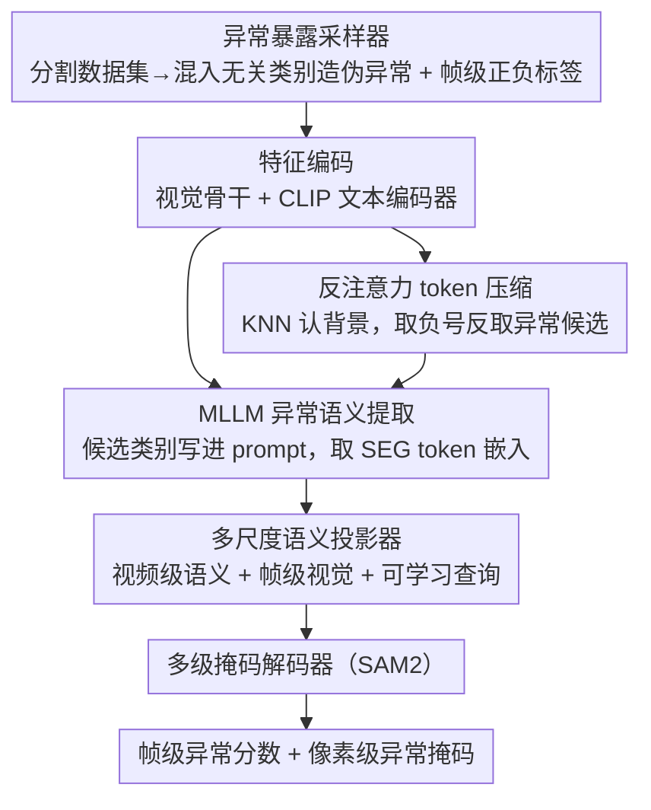

# No Need For Real Anomaly: MLLM Empowered Zero-Shot Video Anomaly Detection

**会议**: CVPR 2026  
**arXiv**: [2602.19248](https://arxiv.org/abs/2602.19248)  
**代码**: [https://github.com/VitaminCreed/LAVIDA](https://github.com/VitaminCreed/LAVIDA)  
**领域**:视频理解
**关键词**: 视频异常检测, 零样本, MLLM, 伪异常, token压缩

## 一句话总结
提出端到端零样本视频异常检测框架 LAVIDA，通过异常暴露采样器将语义分割数据集转化为伪异常进行训练，结合 MLLM 提取深层异常语义特征和反注意力 token 压缩处理时空稀疏性，无需任何真实 VAD 数据即实现帧级/像素级 SOTA。

## 研究背景与动机

**领域现状**：视频异常检测（VAD）面临数据稀缺和场景多变两大挑战。传统方法分为无监督（学习正常模式）和弱监督（视频级标注），但都受限于训练场景和异常类型。近期开放集/开放词汇 VAD 尝试处理未见异常类型，基于 MLLM 的训练免方法直接用 LLM 打分，但依赖逐帧/逐片段文本输出，推理成本高且无法定位。

**现有痛点**：(1) 现有 VAD 数据集场景和异常类型有限，模型泛化差；(2) 异常语义依赖上下文（同一行为在不同场景可能正常或异常），当前方法缺乏深度语义理解；(3) 异常在时空上极度稀疏，大量背景 token 增加计算成本并干扰检测。

**核心矛盾**：真实异常数据稀缺 vs 模型需要见过足够多样的异常才能泛化。

**本文目标**：完全不使用 VAD 数据训练，实现跨场景、跨异常类型的零样本帧级+像素级检测。

**切入角度**：语义分割数据集拥有丰富的场景语义和像素级标注，可以将分割目标重新定义为"异常"进行训练。

**核心 idea**：将分割数据集通过异常暴露采样器转化为伪异常训练集 + 用 MLLM 理解异常语义 + 反注意力压缩背景 token。

## 方法详解

### 整体框架
LAVIDA 想回答一个反直觉的问题：能不能完全不碰真实异常视频，就训练出一个跨场景、跨异常类型的视频异常检测器？它的答案是借道语义分割数据集——那里有海量场景语义和像素级标注，只要把"分割目标"重新解释成"异常"，就能凭空造出训练信号。整条流水线是这样转的：先由**异常暴露采样器**把一段视频和它的分割标注重组成一条带帧级正/负标签的伪异常样本，喂给视觉骨干与 CLIP 文本编码器做**特征编码**；编码后的视觉 token 一路经过**反注意力 token 压缩**滤掉密集背景、只留下异常候选，再连同"可能的异常类别"描述送进 **MLLM 做异常语义提取**，得到一个上下文相关的视频级异常语义特征；这个视频级特征还缺帧级粒度，于是**多尺度语义投影器**把它和逐帧视觉特征、一组可学习查询融合成帧级专属特征，最后送进由 SAM2 初始化的**多级掩码解码器**，同时吐出帧级异常分数和像素级异常掩码。几个关键模块各管一段：采样器解决"没有真异常数据"，token 压缩解决"异常太稀疏、背景太吵"，MLLM 解决"异常语义依赖上下文"，投影器解决"MLLM 只给视频级语义、检测却要帧/像素级粒度"。

### 关键设计

**1. 异常暴露采样器：用分割数据凭空造出伪异常训练集**

真实 VAD 数据集场景和异常类型都太有限，模型很难泛化到没见过的场景。采样器换了个思路——既然分割数据集里每个像素都有类别标注，那就把"出现了不该出现的类别"定义成异常。具体分两步：先从其它样本里随机采 $K_E - 1$ 个与当前样本无关的类别，凑成一个异常类别集合 $c_i$；再以概率 $p$ 决定这条样本是异常还是正常——异常样本里既保留图像真实存在的类别、又混入这些无关类别，帧标签记为正；正常样本则只含无关类别（即声称要找的异常其实都不在画面里），帧标签记为负。这样模型被迫学会的不是"记住某几种异常长什么样"，而是"在一堆声称可能出现的类别里，判断哪些真的出现了"——恰好模拟了真实场景中绝大多数异常类别其实都不出现的稀疏情形。$K_E$ 取随机值，让模型适应"异常类型数量任意"的开放设定。

**2. 反注意力 token 压缩：靠"识别背景"反向锁定异常**

异常在时空上极度稀疏，但视觉 token 里塞满了密集背景，既抬高 MLLM 的计算开销又干扰检测。难点在于异常本身难直接识别，可背景反过来很好认——它数量多、彼此相似、在特征空间里扎堆。于是采样器先用 KNN 密度估计找出高密度区域，把它们判定为背景 token 集合 $Z^b$；再对每个背景 token 做一次"反"注意力，关键在权重取负号：

$$Z_i' = \mathrm{Softmax}\!\left(-\frac{Z_i^b Z_{\mathcal{N}_i}^T}{\sqrt{D_z}}\right) \cdot Z_{\mathcal{N}_i}$$

负号让聚合权重偏向与当前背景**最不相似**的邻居，也就是把藏在背景邻域里的异常候选特征捞出来、聚到压缩后的 token 上。整个过程把 $L_z$ 个 token 压成 $L_r$ 个，背景被吸收、异常候选被保留。本质上它绕开了"直接找异常"这件难事，改成"先认出好认的背景，再反着取它的补集"。

**3. MLLM 异常语义提取：让大模型按场景动态决定什么算异常**

同一个行为在不同场景里可能正常也可能异常，纯视觉特征缺乏这种上下文判断力。LAVIDA 借 MLLM 的开放世界理解来补这一层：在词表里加一个特殊 token `<SEG>`，构造提示 "Find the anomaly in this video. Anomaly types may contain {c_i}"，把采样器给出的候选异常类别 $c_i$ 直接写进 prompt；模型前向后取 `<SEG>` 在最后一层的嵌入 $f_{sem}$，作为这段视频的异常语义特征。好处是检测目标不再写死，而是随场景描述和候选类别动态调整——同一套权重换个 prompt 就能去找另一类异常，这也是它能零样本跨异常类型的根本原因。

**4. 多尺度语义投影器：把视频级语义对齐到帧级，喂给掩码解码器**

MLLM 给出的 $f_{sem}$ 是整段视频共享的语义特征，没有帧级粒度，可异常检测要精确到哪一帧、哪些像素，直接拿视频级特征去监督就会"知道有异常、却定位不到时刻"。多尺度语义投影器负责架这座桥：它把视频级语义特征 $f_{sem}$、逐帧视觉特征 $f_v$ 和一组可学习查询向量融合，先经投影矩阵得到帧级语义特征 $f_a\in\mathbb{R}^{T\times K\times D_a}$，再投影成帧级专属特征 $f_{proj}\in\mathbb{R}^{T\times D_m}$，送进掩码解码器的隐空间引导逐帧检测。可学习查询的数量是个敏感超参——太少表达力不足、太多反而收敛困难，需要折中。消融显示它比直接用 MLP 或 Q-Former 都更能同时抓住时间维的异常线索和空间上稀疏的异常区域；最终由 SAM2 初始化的多级掩码解码器把 $f_{proj}$ 当作稀疏 prompt、再融合视觉特征 $f_v$，一并输出帧级异常分数（取目标存在置信度）和像素级异常掩码。

### 一个完整示例：一条"街道打架"视频怎么被判异常

为了把整条流水线怎么串起来讲清楚，跟一条样本走一遍（类别数等为示意，⚠️ 具体取值以原文为准）：

1. **采样器造样本**：取一段街景分割视频，真实类别含 `person / road / car`。采样器从别处随机抓 $K_E-1$ 个无关类别 `fire / explosion / fight`，按概率 $p$ 把它标成异常样本——异常类别集 $c_i = \{fire, explosion, fight, \dots\}$，因为画面里其实出现了打斗，帧标签记为正。
2. **编码 + token 压缩**：视觉编码器把这帧切成一大堆 token，其中绝大多数是 `road / sky / building` 这类密集背景。KNN 密度估计把这些扎堆的背景挑成 $Z^b$，反注意力对它们逐个取负号聚合，背景被吸收，只有打斗区域那一小撮"与背景最不像"的 token 被保留进 $L_r$ 个压缩 token。
3. **MLLM 出语义**：prompt 写成 "Find the anomaly in this video. Anomaly types may contain fire, explosion, fight…"，MLLM 结合画面判断 `fight` 确实发生，`fire / explosion` 没有，`<SEG>` 嵌入 $f_{sem}$ 编码出"此处异常=打斗"的语义。
4. **出结果**：投影器把 $f_{sem}$ 与可学习查询融合，掩码解码器在打斗发生的帧给出高异常分数，并在像素层定位到打斗的人身上。整个过程没用过任何一条真实 VAD 标注。

### 损失函数 / 训练策略
- 仅在异常暴露数据集上训练，完全不接触任何真实 VAD 数据
- 帧级与像素级两路同时监督
- $K_E$ 取随机值，迫使模型适应任意数量的候选异常类型

## 实验关键数据

### 帧级零样本性能

| 数据集 | 指标 | 最优无监督 | 最优弱监督 | LAVIDA(零样本) |
|--------|------|-----------|-----------|---------------|
| UBnormal | AUC | 72.8 (MULDE) | - | **76.45** |
| ShanghaiTech | AUC | 81.3 (MULDE) | - | **85.28** |
| UCF-Crime | AUC | 78.5 (MULDE) | 90.33 (PI-VAD) | 82.18 |
| XD-Violence | AP | - | 88.96 (Holmes) | **90.62** |

### 像素级零样本性能

| 数据集 | 指标 | LAVIDA |
|--------|------|--------|
| UCSD Ped2 | pixel-AUC | **87.68** |

### 关键对比
- 零样本超越所有无监督方法（无需场景特定训练）
- 在 XD-Violence 上甚至超越弱监督方法（90.62 vs 88.96 AP）
- 相比训练免 MLLM 方法（LAVAD 80.82），UCF-Crime 上提升 1.36%

### 消融实验
- 去除异常暴露采样器：性能显著退化
- 去除 token 压缩：计算成本上升且精度下降（背景噪声干扰）
- 去除 MLLM 语义提取：跨场景泛化能力大幅下降
- 多尺度语义投影器换成 MLP / Q-Former：帧级与像素级性能均下降，说明其在捕捉时序异常线索和空间稀疏异常上更有效

## 亮点
- 完全不需要真实 VAD 数据训练，是真正的零样本框架
- 异常暴露采样器的设计巧妙——将"分割目标"重新定义为"异常"，复用了丰富的分割数据集
- 反注意力 token 压缩同时降低计算成本和背景干扰
- 同时支持帧级和像素级检测，实际部署价值高
- 在多个基准上零样本性能超越有监督方法

## 局限与展望
- 伪异常与真实异常的分布差异可能影响特定场景的检测精度
- MLLM 推理仍有一定计算开销，实时性受限
- 当前仅将分割目标作为伪异常，可进一步引入合成异常（如视频扰动）
- 可探索将反注意力压缩思想推广到其他视频理解任务

<!-- RELATED:START -->

## 相关论文

- [\[AAAI 2026\] HeadHunt-VAD: Hunting Robust Anomaly-Sensitive Heads in MLLM for Tuning-Free Video Anomaly Detection](../../AAAI2026/video_understanding/headhunt-vad_hunting_robust_anomaly-sensitive_heads_in_mllm_.md)
- [\[NeurIPS 2025\] A Unified Reasoning Framework for Holistic Zero-Shot Video Anomaly Analysis](../../NeurIPS2025/video_understanding/a_unified_reasoning_framework_for_holistic_zeroshot_video_an.md)
- [\[CVPR 2026\] Weakly Supervised Video Anomaly Detection with Anomaly-Connected Components and Intention Reasoning](weakly_supervised_video_anomaly_detection_with_anomaly-connected_components_and_.md)
- [\[CVPR 2026\] Alert-CLIP: Abnormality-aware Latent-Enhanced Representation Tuning of CLIP for Video Anomaly Detection](alert-clip_abnormality-aware_latent-enhanced_representation_tuning_of_clip_for_v.md)
- [\[CVPR 2026\] TLMA: Mitigating the Impact of Weakly Labeled Information for Video Anomaly Detection](tlma_mitigating_the_impact_of_weakly_labeled_information_for_video_anomaly_detec.md)

<!-- RELATED:END -->
