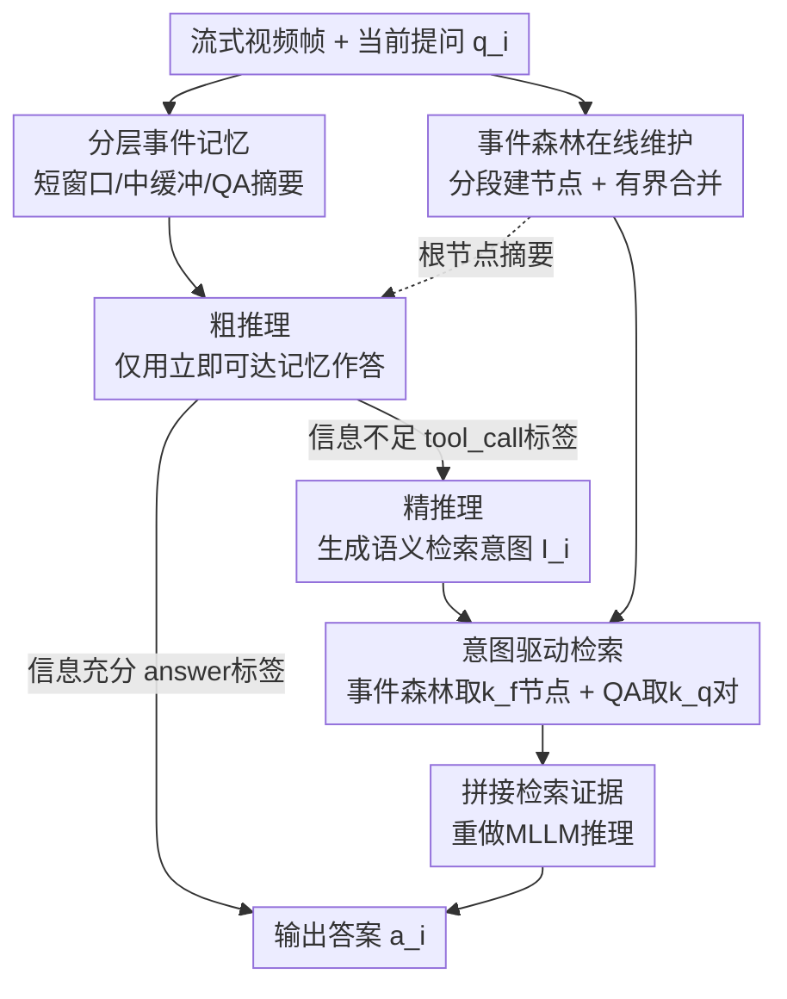

# OASIS: On-Demand Hierarchical Event Memory for Streaming Video Reasoning

**会议**: CVPR 2026  
**arXiv**: [2604.17052](https://arxiv.org/abs/2604.17052)  
**代码**: https://github.com/Solus-sano/OASIS (有)  
**领域**: 视频理解  
**关键词**: 流式视频推理, 分层事件记忆, 按需检索, 两阶段推理, 训练免费

## 一句话总结
OASIS 把流式视频推理重新定义为"时序路由"问题，用一个在线维护的分层事件森林作为长期记忆，配合"先短上下文粗推理、不确定时再按语义意图精检索"的两阶段策略，在不改 MLLM、不训练的前提下，让多个流式 MLLM backbone 在长程准确率和组合推理上大幅提升，同时把 token 成本压到恒定。

## 研究背景与动机
**领域现状**：流式视频推理（自动驾驶、安防、AR 眼镜、具身智能）要求模型在视频连续到来、无法回放的设定下随时回答问题。主流做法分两类：一类是全上下文堆叠（Full Context），把所有历史帧塞进 MLLM；另一类是外部记忆 + RAG 检索，把检索到的历史片段和当前帧拼在一个上下文窗口里。

**现有痛点**：流式视频的本质矛盾是——历史无界增长，但对每个查询真正有用的证据极度稀疏。全上下文堆叠会让注意力淹没在"冗余的沙漠"里发生 attention collapse（注意力被历史里某个显著但无关的事件带偏，当前问题答错）；激进压缩则会永久抹掉那些细小却决定性的证据。而现有 RAG 类方法用固定策略（如 top-k）按 embedding 相似度检索，既不随任务自适应，又总是把检索结果和当前帧硬拼进同一窗口，污染推理。

**核心矛盾**：单纯放大 token 预算或提高压缩率，只是把失败点从"存不下"挪到"找不到"，没解决根本难题——长视频绝大部分是冗余的，但每个查询往往只依赖过去某个极其局部的区域。所以关键操作不是存储、压缩或调度，而是**按需定位长期经验里那块正确的区域**。

**切入角度**：作者从人类记忆方式出发——人不试图记住全部过去，而是先在一个短工作窗口上操作，只有当变得不确定时，才主动回忆某个具体的、含决定性事实的历史片段。"我们不背着整片沙漠走，而是在当下需要时去找一处绿洲（oasis）。"

**核心 idea**：把流式视频推理建模为**时序路由**——找出能定夺查询的那个唯一历史事件。用一个分层事件记忆 + 两阶段精化协议，实现由高层意图（而非 embedding 相似度）驱动的、按需的事件级检索。

## 方法详解

### 整体框架
OASIS 是一个 training-free 的 agent 系统：处理流式视频，并对视频任意时刻提出的交错问题作答。它由两大支柱组成——一套**分层动态记忆**（把视频流压成紧凑但语义可导航的过去表示），和一套**两阶段推理策略**（默认在短上下文上粗推理，不确定时才进入精推理去事件森林里检索证据）。整套机制挂在 MLLM 之上，不改 backbone、不需训练，可即插即用接到不同流式 MLLM 上。

记忆有四种分辨率：高保真**短窗口** $\mathbf{W}_s$（捕捉当下）、中分辨率**缓冲区** $\mathbf{W}_m$（保留近期但非即时的结构）、**多分辨率事件层级**（Event Forest，总结长期历史）、以及 **QA 摘要**（记录历史问答）。随着视频流推进，事件森林通过在线分段和结构性合并不断更新。推理时，系统先用立即可达的记忆（短窗口 + 中缓冲 + 根节点摘要 + QA 摘要）做**粗推理**；若信息不足，则**推断需要什么额外证据**，把这个语义假设当作检索意图，精准跳进事件森林取证，再生成最终答案。

### 关键设计

**1. 分层事件记忆：四种分辨率分工，从当下到长期**

针对"全存淹没注意力、全压抹掉证据"的两难，OASIS 不在单一窗口里做取舍，而是把记忆拆成四层各管一段时间尺度。短窗口 $\mathbf{W}_s=\{\mathbf{X}_t\}_{t=t_i-\tau_s}^{t_i}$ 以高帧率 $r_s$ 保留最近 $\tau_s$ 秒，提供当前时刻推理所需的细粒度视觉/时序细节；中缓冲 $\mathbf{W}_m$ 以更小帧率 $r_m<r_s$ 覆盖更宽的 $\tau_m$ 秒范围，扩大感知野但不爆 token。真正解决无界增长的是**多分辨率事件层级**（Event Forest）：视频流被切成顺序、不重叠的时间窗，每个 $t_m$ 帧的窗均匀采 $n_f$ 个关键帧，抽象成一个事件节点

$$\mathbf{R}_j=\big([t^{(j)}_s,t^{(j)}_e],\mathbf{F}_j,s_j,\mathbf{e}_j,d_j\big)$$

其中 $\mathbf{F}_j$ 是 $n_f$ 个关键帧的 4D 张量，$s_j$ 是 MLLM 生成的描述该窗可观察事实的文本摘要，$\mathbf{e}_j=\mathbf{E}(s_j)$ 是摘要的 embedding，$d_j$ 是层级（流上直接生成的都是 level-0 叶节点）。这样长期历史被压成一组紧凑、可按语义检索的节点，而非线性堆积的原始帧。

**2. 有界在线节点合并：用层级感知打分防止过度抽象**

针对根节点无限增长导致检索代价爆炸的问题，OASIS 在根节点数 $|\mathcal{R}|$ 超过阈值 $n_r$ 时触发合并。它**贪心地合并时序相邻、合并分数最高的一对根节点**，分数定义为

$$\text{score}(\mathbf{R}_j,\mathbf{R}_k)=\cos(\mathbf{e}_j,\mathbf{e}_k)-\lambda(d_j+d_k)$$

前一项 cosine 相似度鼓励融合语义连贯的相邻事件；后一项以 $\lambda$ 惩罚高层级节点（$d_j$、$d_k$ 大）参与合并——这是关键：它**避免过度抽象**，保住记忆的层级粒度，不至于把已经很抽象的大事件再揉成更糊的一团。合并后生成父节点 $\mathbf{R}_l$，时间区间取并，关键帧 $\mathbf{F}_l=\mathrm{Uniform}(\mathbf{F}_j\oplus\mathbf{F}_k)$，摘要 $s_l=\mathrm{Merge}(s_j,s_k)$ 由 LLM 融合，层级 $d_l=\max(d_j,d_k)+1$。父子关系更新进森林，使其能自适应组织长视频，并用根节点摘要 $\{s_j\}$ 聚合出一份有限大小的全局摘要。

**3. 两阶段推理：先短上下文粗推理，用特殊 token 决定是否深挖**

这是 OASIS"找绿洲"的核心。粗推理阶段，MLLM 只用立即可达记忆 $\mathbf{C}_{\text{coarse}}$（短窗 + 中缓冲所有帧、所有根节点摘要 $\{s_j\}$、QA 历史摘要 $s_{\text{qa}}$）和问题 $q_i$ 生成初步响应 $Think,\hat{a}_i\leftarrow\mathrm{MLLM}(p_{\text{sys}},\mathbf{C}_{\text{coarse}},q_i)$。由于事件森林让 $\{s_j\}$ 规模有界，避免了长上下文的 token 开销和 attention collapse。提示词强制模型二选一：若立即可达记忆已含答案所需全部事实，就直接给最终答案（包在 `<answer></answer>` 标签里）；若信息不足或问题涉及久远细节，**禁止猜测**，必须通过发出 `<tool_call>` token 来发起更深的记忆检索。系统靠解析这两个特殊 token 来路由。这个设计**强迫模型优先用高分辨率的近期信息**，从根本上压住"拿旧证据答当前问题"的注意力错位。

**4. 意图驱动的精检索：用语义假设而非原始问题去取证**

针对 naïve RAG"直接拿原始问题做检索 query 往往匹配到视觉相似却语义无关的记忆"的失败，精推理改用**模型推断出的检索意图** $I_i$。$I_i$ 可直接从初步响应 $\hat{a}_i$ 中提取，是一个任务导向的高层语义内部查询，比原问题 $q_i$ 提供更精确的线索（如 $q_i$="刚才那儿有人吗？"配客厅画面，$I_i$ 被设为"客厅里的人"）。编码 $\mathbf{E}(I_i)$ 后用于打分检索两处：事件森林中按 $\text{argmax}_j\cos(\mathbf{E}(I_i),\mathbf{e}_j)$ **贪心选 $k_f$ 个节点**，每选一个就把它的祖先和后代从候选池移除（**剪枝避免取到直系血缘的父子节点**，保证信息多样性）；QA 历史中按 $\text{TopK}_j\cos(\mathbf{E}(I_i),\mathbf{e}^q_j)$ 取 $k_q$ 对。检索内容 $\mathbf{C}_{\text{fine}}$（$k_f$ 节点的关键帧张量 + $k_q$ 个 QA 对）拼进上下文，重做 $a_i\leftarrow\mathrm{MLLM}(p_{\text{sys}},\mathbf{C}_{\text{coarse}},q_i,\mathbf{C}_{\text{fine}})$ 得最终答案。此外 QA 摘要 $s_{\text{qa}}\leftarrow\mathrm{LLM}(s_{\text{qa}},(q_i,a_i))$ 提供低成本对话上下文，保证多轮指代命名一致。

### 损失函数 / 训练策略
OASIS **完全 training-free**，不改动底层 MLLM 也不需任何额外训练，纯粹作为结构化记忆策略挂在 backbone 之上。实现上用同一个 MLLM 实例完成所有管理任务（摘要、合并、QA 更新）和最终推理。关键超参：短窗 $\tau_s=8$s @ $r_s=2$ fps，中缓冲 $\tau_m=32$s @ $r_m=1$ fps，每节点关键帧预算 $n_f=16$，根集上限 $n_r=4$，合并惩罚 $\lambda=0.1$；精推理检索 $k_f=2$ 个事件节点、$k_q=1$ 个 QA 对；embedding 编码器用 Qwen3-Embedding-0.6B。全部实验在单张 A800 80GB 上完成。

## 实验关键数据

### 主实验
在三个流式视频基准（OVO-Bench、StreamingBench、StreamBench）上评测，backbone 用 Qwen3-VL-8B、Qwen2.5-VL-7B、GLM-4.6V。OVO-Bench 重点看 Real-Time Understanding（Perception，测能否抗 attention collapse、精准锚定当下）和 Backward Tracing（测长期记忆检索）。

| 基准 | backbone | 指标 | 基线 | + OASIS | 提升 |
|------|----------|------|------|---------|------|
| OVO-Bench | Qwen3-VL-8B | Perception Avg | 66.79 | **78.14** | +11.35 |
| OVO-Bench | Qwen3-VL-8B | Backward Avg | 51.19 | **57.21** | +6.02 |
| OVO-Bench | Qwen2.5-VL-7B | Perception Avg | 60.93 | 67.26 | +6.33 |
| OVO-Bench | Qwen2.5-VL-7B | Backward Avg | 50.24 | 52.61 | +2.37 |
| OVO-Bench | GLM-4.6V | Perception Avg | 54.96 | 68.39 | +13.43 |
| OVO-Bench | GLM-4.6V | Backward Avg | 51.35 | 55.27 | +3.92 |
| StreamingBench | Qwen3-VL-8B | Real-Time All | 72.83 | **78.22** | +5.39 |
| StreamingBench | Qwen3-VL-8B | MCU | 35.74 | **49.60** | +13.86 |
| StreamingBench | Qwen3-VL-8B | SQA | 43.90 | 48.40 | +4.50 |

Perception 上 Qwen3-VL-8B +11.35 最有说服力——它直接测"锚定当下不被历史带偏"的能力，证明粗推理强制聚焦高分辨率短窗能从根本上解决 attention collapse；Backward +6.02 证明精推理的 plan-driven RAG 有效克服了不可逆的信息丢失。Qwen2.5-VL-7B 增益更温和，因为 OASIS 的 agentic 策略重度依赖 base LLM 的指令跟随能力。StreamingBench 上 MCU（专门用高度相似的连续画面诱发 attention collapse）涨 +13.86 最显著。

### 消融实验
**记忆系统消融**（OVO-Bench / Qwen3-VL-8B）：

| Medium Buffer | Event Forest | Short Window | Perception Avg | Backward Avg |
|:---:|:---:|:---:|:---:|:---:|
| ✓ | ✗ | ✗ | 74.31 | 54.00 |
| ✗ | ✗ | ✓ | 77.66 | 51.93 |
| ✗ | ✓ | ✓ | 76.52 | 48.65 |
| ✓ | ✗ | ✓ | 77.18 | 54.15 |
| ✓ | ✓ | ✗ | 70.37 | 56.89 |
| ✓ | ✓ | ✓ | **78.14** | **57.21** |

**推理策略消融**（OVO-Bench / Qwen3-VL-8B）：

| 方法 | Perception Avg | Backward Avg | 说明 |
|------|:---:|:---:|------|
| Flatten Memory | 76.70 | 55.78 | 去掉根节点上限 $n_r$，根节点无限增长 |
| w/o RAG | 76.19 | 55.22 | 只用短窗+中缓冲+根摘要，不检索 |
| Naïve RAG | 78.01 | 56.13 | 直接拿原问题文本检索 |
| OASIS | **78.14** | **57.21** | 完整模型 |

### 关键发现
- **短窗 vs 中缓冲是一对权衡**：只用短窗 Perception 77.66 但 Backward 仅 51.93；只用中缓冲 Perception 掉到 74.31、Backward 升到 54.00——说明更长采样利于长期记忆问题，却会诱发 attention collapse 损害即时场景表现。加入 Event Forest 后 Backward 进一步升到 57.21，证明其建模长期依赖有效。
- **意图检索 > 原问题检索**：Naïve RAG 把 Backward 从 57.21 拉到 56.13，证明基于历史摘要生成检索线索能定位到比原问题更相关的过去事件。
- **分层 > 扁平**：Flatten Memory 让根节点无限增长，会撑大粗摘要 token 数、检索变低效、父子去重失效，Perception/Backward 双双下降。
- **Token 与延迟**：全上下文基线 token 随时长线性增长（StreamingBench 达 29,517），OASIS 跨数据集稳定在约 10k；请求处理延迟 RPD 仅 0.19s，检索本身仅 0.11s，端到端 4.14s→6.52s（多了粗到精阶段），记忆维护（建节点 7.73s、合并 6.52s）查询无关、可与视频流异步重叠。

## 亮点与洞察
- **重新定义问题**：把流式视频推理从"存多少/压多少"重构为"时序路由——定位定夺查询的那一个历史事件"。这个 reframing 本身就把研究焦点从容量转到了访问结构，是全文最"啊哈"的地方。
- **用特殊 token 做粗→精的门控**：`<answer>` 直接答 / `<tool_call>` 触发深挖，让 MLLM 自己判断"信息够不够"，既省 token 又强制优先用高分辨率近期信息——这个轻量门控可迁移到任何"默认便宜、必要时昂贵"的 agent 流程。
- **合并打分里的层级惩罚项** $-\lambda(d_j+d_k)$ 很巧：用一个标量就同时实现了"融合语义连贯事件"和"防止过度抽象"，保住记忆粒度。
- **意图检索 vs embedding 相似检索**：用模型推断出的语义假设 $I_i$ 而非原始问题去检索，绕开了 naïve RAG"视觉相似但语义无关"的陷阱，这个思路可直接搬到文本/多模态 RAG。
- **完全即插即用、训练免费**：跨 Qwen2.5/Qwen3/GLM 三个家族都涨点，证明收益来自记忆策略而非某个 backbone 的实现细节。

## 局限与展望
- **重度依赖 base LLM 的指令跟随能力**：作者自己点出 Qwen2.5-VL-7B 上增益明显小于 Qwen3-VL-8B，因为粗推理的特殊 token 门控、意图生成都靠 LLM 听话；换到弱指令模型上收益会缩水。
- **端到端延迟上升**：每查询 4.14s→6.52s（+57%），虽然记忆维护可异步重叠，但粗到精两遍 MLLM 推理在真正实时（如自动驾驶）场景下是否够快存疑。
- **检索预算很小**（$k_f=2$、$k_q=1$）：对需要综合多个分散历史片段的组合查询，2 个节点可能不够；论文未充分探讨预算放大时精度/成本的曲线。
- **依赖 MLLM 生成的文本摘要**：节点语义全靠摘要 embedding，若摘要漏掉某个细小决定性事实，后续无论怎么检索都找不回来——压缩阶段的信息丢失只是被推迟而非消除。

## 相关工作与启发
- **vs VideoTree / VideoMind（query-adaptive 长视频检索）**：它们假设视频固定、完全可观测，流增长时需重新处理整段；OASIS 维护一个在线、有界的事件森林，支持连续流式下的跨查询复用，无需重建搜索结构。
- **vs 早期流式方法（堆叠/压缩，如 Flash-VStream、VideoLLM-online）**：堆叠让 token 预算暴涨被迫激进压缩、不可逆丢细节；OASIS 用分层 + 按需检索，token 恒定且保住细粒度。
- **vs 外部记忆 + 固定检索（StreamChat 等）**：它们的"检索即拼接"策略总把检索线索和当前帧硬拼，纠缠异质时序信息诱发 attention collapse；OASIS 只在不确定时才检索，且用意图而非相似度路由。
- **vs 标准 / Iterative RAG**：标准 RAG 假设用户原始 query 本身就是好检索 query，复杂多步交互下失效；OASIS 受 iterative/agentic 检索启发，为流式视频实例化了意图驱动检索 + 在线分层记忆。

## 评分
- 新颖性: ⭐⭐⭐⭐⭐ 把流式视频推理重构为时序路由，分层事件森林 + 意图驱动两阶段检索是一套自洽的新范式。
- 实验充分度: ⭐⭐⭐⭐ 三基准、三 backbone、记忆/策略双消融、token 与延迟分析齐全；但 StreamBench 细节挪到附录，弱 backbone 上增益偏小。
- 写作质量: ⭐⭐⭐⭐⭐ "沙漠中找绿洲"的隐喻贯穿全文，动机推导清晰，公式与失败案例图配合到位。
- 价值: ⭐⭐⭐⭐⭐ 训练免费、即插即用、token 恒定，对实时流式 MLLM 部署有直接落地价值。

<!-- RELATED:START -->

## 相关论文

- [\[CVPR 2026\] FluxMem: Adaptive Hierarchical Memory for Streaming Video Understanding](fluxmem_adaptive_hierarchical_memory_for_streaming_video_understanding.md)
- [\[CVPR 2026\] VideoARM: Agentic Reasoning over Hierarchical Memory for Long-Form Video Understanding](videoarm_agentic_reasoning_over_hierarchical_memory_for_long-form_video_understa.md)
- [\[ACL 2026\] HERMES: KV Cache as Hierarchical Memory for Efficient Streaming Video Understanding](../../ACL2026/video_understanding/hermes_kv_cache_as_hierarchical_memory_for_efficient_streaming_video_understandi.md)
- [\[CVPR 2026\] Streaming Video Crime Anticipation with Spatio-Temporal Causal Reasoning](streaming_video_crime_anticipation_with_spatio-temporal_causal_reasoning.md)
- [\[ICCV 2025\] Hierarchical Event Memory for Accurate and Low-latency Online Video Temporal Grounding](../../ICCV2025/video_understanding/hierarchical_event_memory_for_accurate_and_low-latency_online_video_temporal_gro.md)

<!-- RELATED:END -->
