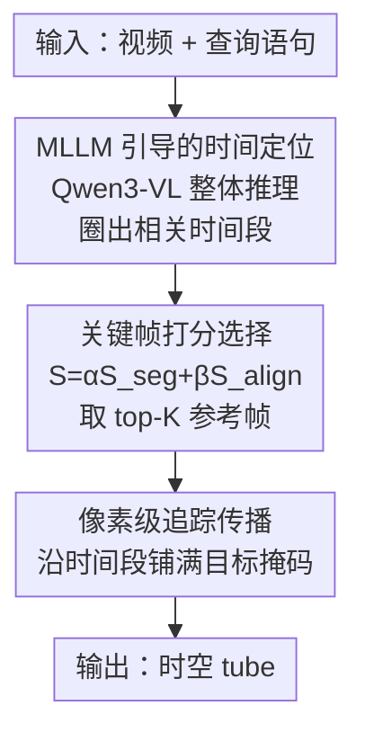

# OmniGround: A Comprehensive Spatio-Temporal Grounding Benchmark for Real-World Complex Scenarios

**会议**: CVPR 2026  
**论文**: [CVF Open Access](https://openaccess.thecvf.com/content/CVPR2026/html/Gao_OmniGround_A_Comprehensive_Spatio-Temporal_Grounding_Benchmark_for_Real-World_Complex_Scenarios_CVPR_2026_paper.html)  
**代码**: 无  
**领域**: 视频理解  
**关键词**: 时空视频定位、STVG benchmark、多模态大模型、标注流水线、训练无关基线

## 一句话总结
针对时空视频定位（STVG）现有数据集类别单一、场景过简的问题，本文构建了覆盖 81 类、3,475 段真实复杂视频的 OmniGround 基准，配套提出前-后-精修（FBR）标注流水线、四维数据质量评估框架 DeepSTG，并给出一个训练无关的两阶段基线 PG-TAF，在四个基准上把 SOTA 在 OmniGround 上的定位精度拉回 25.6%/35.6%（m_tIoU/m_vIoU 相对提升）。

## 研究背景与动机
**领域现状**：时空视频定位（Spatio-Temporal Video Grounding, STVG）要求根据一句自然语言描述，在视频里同时定位目标物体的**时间区间**和**逐帧空间框**（即一条 spatio-temporal tube）。随着多模态大模型（MLLM）兴起，这个任务靠 MLLM 的跨模态语义理解和结构化空间推理大幅超过了传统轻量方法。

**现有痛点**：尽管模型在进步，但在真实复杂场景下仍频繁翻车——定位不了不常见物体（"风筝""剪刀"）、分不清多个相似目标（"三个人里右边穿红衣服的男人"）、读不懂带嵌套空间关系的长句。作者把锅扣在**基准本身太窄**上：HC-STVG 几乎只标注"人"这一类，VidSTG 场景简单、物体多样性有限。这让 STVG-MLLM 没法在复杂现实里真正落地。

**核心矛盾**：现有评测停留在"视频时长、片段数"这类表层统计上，无法刻画数据集真正的难度与多样性——比如类别是否均衡、前景是否容易混淆、语言线索（时间 vs. 空间）是否平衡、标注与文本是否真的对齐。统计指标看着漂亮，模型一上真实场景就掉 10% 以上，说明现有数据"测不出"真实能力。

**本文目标**：拆成三件事——① 造一个类别均衡、查询复杂、贴近真实的 STVG 基准；② 给出一套能量化数据集"深层质量"的评估体系，而不只是数片段；③ 提供一个能在这个难基准上 work 的基线方法，指出改进方向。

**切入角度**：作者观察到模型在复杂场景平均掉 10.4%，且掉点集中在三类困难——类别偏置（掉 8.42%）、推理过简（掉 13.1%）、语言鲁棒性差（掉 9.42%）。这说明问题可被结构化拆解、并被针对性地度量与缓解。

**核心 idea**：用"均衡复杂的数据集（OmniGround）+ 深层质量度量（DeepSTG）+ 解耦时间/空间的训练无关基线（PG-TAF）"三件套，把 STVG 评测从"看统计"推进到"看真实难度"。

## 方法详解
本文不是单一模型工作，而是"基准 + 评估体系 + 基线"三位一体。下面先讲数据集怎么造、再讲标注流水线和质量评估怎么设计，最后讲那个训练无关的两阶段基线方法。

### 整体框架
OmniGround 的构建分四步：① 数据采集（Pexels 无版权视频 + 少量 RVOS 数据补充稀有类）；② 数据清洗与过滤（视频 ≥3s、事件 ≥1s）；③ 用 FBR 流水线做高质量时空 tube 标注；④ 外部数据增广与人工验证（给 RVOS 视频合成负样本片段，补出时间边界）。最终得到 3,475 段视频、平均 18.2s、81 个均衡类别、caption 平均 16.2 词。

在数据之上，作者再叠两层：DeepSTG 从四个维度量化数据质量（用来证明 OmniGround 比别的基准更难更均衡），PG-TAF 则是在这个难基准上跑得动的两阶段基线。其中 PG-TAF 把 STVG 拆成"先粗定时间、再细定空间"的两段式推理流水线，框架图如下：

### 关键设计

**1. OmniGround 数据集：用类别均衡 + 真实复杂查询逼出模型短板**

针对"HC-STVG 只标人、VidSTG 太干净"的痛点，OmniGround 刻意往"难"和"均衡"两头拉。类别上覆盖 81 个均衡类（是 VidSTG 的两倍、ST-Align 的六倍），采集时优先挑"自然光照+相机运动、多物体交互、复杂背景"的视频；查询上让 caption 富含空间关系和多样动作谓词，句子级语言均衡度（NEI 0.918）远高于 VidSTG 的 0.659。为补稀有类（如"键盘"），作者还从 RVOS 数据集少量引入并改造成 STVG 格式。这种"刻意造难"让基准能区分出模型在不常见类别、多相似目标、深层句法这三类真实困难下的真实水平——而这正是旧基准测不出来的。

**2. FBR 前-后-精修标注流水线：多向追踪 + 智能纠错换高质量 tube**

逐帧手标时空 tube 成本高、还会因遮挡和运动模糊导致追踪漂移、误差累积。FBR 用"双向追踪 + 主动纠错"三步解决：**Step 1 多点初始化**——标注员只在首帧 $F_{start}$ 和尾帧 $F_{end}$ 手标框，再用 DAM4SAM 追踪器从两端各跑出前向轨迹 $T_f$ 和后向轨迹 $T_b$；**Step 2 自适应精修**——自动找出 $T_f$ 与 $T_b$ 之间 IoU 差异最大的帧 $F_{mid}$（最可能追丢的地方），让标注员补一个校正框、生成中间轨迹 $T_m$；**Step 3 融合平滑**——三条轨迹按帧做 IoU 投票聚类（IoU ≥0.5 归一簇，取主簇均值为融合结果），对连续丢失 ≤3 帧的短缺口用卡尔曼滤波插值补回，使轨迹能穿过短暂遮挡。相比单向追踪，FBR 把 IoU 一致性提升 16.8%，目标被遮挡 50% 时仍能维持 ≥0.8 IoU。其本质是用"两端各追一遍 + 在分歧最大处人工补一刀"代替"全程盯着标"，把人力花在刀刃上。

**3. DeepSTG 四维数据质量评估：跳出"数片段"，量化标注/视觉/语言/分布**

为了证明"OmniGround 真的更好"且让基准之间可客观对比，DeepSTG 设计了四个互补维度，每个对应 STVG 任务的一个关键能力：

- **CMA（跨模态语义对齐分）**——衡量标注是否可信。对 video-caption-tube 三元组采 $N$ 个关键帧，用 GPT-4o 给每帧三方面打分：物体是否存在（$S_{obj}$）、动作是否准确（$S_{act}$）、上下文/空间关系是否一致（$S_{ctx}$），取均值：$CMA = \frac{1}{N}\sum_{i=1}^{N}\frac{S_{obj}(f_i)+S_{act}(f_i)+S_{ctx}(f_i)}{3}$。
- **FCI（前景复杂度指数）**——衡量同类物体有多难区分。每秒采 1 帧、用 YOLOv11 检出前景物体，对每类计算类内余弦相似度均值 $S_{in}(C)$，再跨类平均：$FCI = \frac{1}{|C|}\sum_{C\in\mathcal{C}}S_{in}(C)$，值越高说明同类越像、越难 grounding。
- **VSBI（动作-空间平衡指数）**——衡量语言线索是否偏科。把词分成动作（A）、空间（S）、混合（M）三类，实际分布 $P_{actual}=[P_A,P_S,P_M]$ 与理想分布 $P_{ideal}=[1/4,1/4,1/2]$ 比距离：$VSBI = 1 - \frac{\lVert P_{actual}-P_{ideal}\rVert_2}{\sqrt{7/8}}$。
- **NEI（归一化熵指数）**——衡量类别/时长/句长的分布均匀度，用香农熵归一化：$NEI = \frac{H}{\log N}$，其中 $H = -\sum_{i=1}^{N} p_i \log p_i$，越高越不偏。

这四维让"OmniGround 比别的基准更难更均衡"从一句口号变成了可复现的数字——实测 OmniGround 在四维上全面领先（见实验）。

**4. PG-TAF 训练无关两阶段基线：把时间推理和空间定位拆开各用所长**

作者观察到一个核心权衡：MLLM 擅长整体时间推理但空间定位粗，专用追踪器空间精准但不懂语义。PG-TAF 干脆把 STVG 解耦成两段、且全程不训练。**Stage 1 时间定位**——用 Qwen3-VL-8B 对整段视频做整体理解，圈出查询相关的粗时间段，过滤掉无关帧。**Stage 2 空间传播**——在这个时间段内做细粒度定位：先用一个多模态打分机制选关键参考帧，融合 EVF-SAM 的分割分 $S_{seg}$（保证目标清晰）和 Alpha-CLIP 的图文相似分 $S_{align}$（保证语义匹配），按 $S_{frame} = \alpha S_{seg} + \beta S_{align}$（$\alpha=0.6,\beta=0.4$，验证集网格搜索）取 top-K=3 帧作参考，再用像素级追踪器把目标掩码沿整段时间传播，生成最终 tube。这套"MLLM 定时间 + 追踪器定空间"的组合，不微调就能在 OmniGround 上反超需要专门训练的模型。

## 实验关键数据

### 数据集质量对比（DeepSTG 四维）
OmniGround 在所有维度上全面领先现有 STVG 与 RVOS 基准（节选）：

| 基准 | #类别 | NEI | FCI | VSBI | CMA |
|------|-------|-----|-----|------|-----|
| HC-STVG | 1 | - | - | 0.778 | 0.754 |
| VidSTG | 40 | 0.569 | 0.780 | 0.659 | 0.720 |
| ST-Align | 14 | 0.628 | 0.731 | 0.757 | 0.718 |
| Ref-YT-VOS | 38 | 0.900 | - | 0.859 | 0.719 |
| **OmniGround** | **81** | **0.992** | **0.807** | **0.918** | **0.770** |

类别均衡度 NEI 近乎满分（0.992 vs. VidSTG 0.569），FCI 最高（前景最难区分），VSBI 最高（语言线索最平衡），CMA 最高（标注质量最好，验证了 FBR 的有效性）。

### 模型在 OmniGround 上的整体与分场景表现
现有 SOTA 在 OmniGround 上普遍掉点，且在三类困难场景进一步崩盘（m_tIoU/m_vIoU，节选）：

| 模型 | Overall m_tIoU | Overall m_vIoU | 不常见类 m_tIoU | 多相似目标 m_vIoU | 深层句法 m_tIoU |
|------|---------------|----------------|----------------|------------------|----------------|
| CG-STVG（任务专用） | 47.5 | 30.4 | 29.5 | 14.2 | 20.6 |
| Qwen2.5-VL（7B MLLM） | 36.6 | 23.2 | 21.4 | 13.5 | 13.9 |
| VideoMolmo（7B MLLM） | 30.2 | 15.7 | 21.2 | 13.5 | 11.1 |
| LLaVA-ST（7B MLLM） | 19.7 | 8.7 | 17.8 | 6.6 | 14.7 |

任务专用模型（CG-STVG）整体反超 MLLM；但所有模型在高 vIoU 阈值下空间精度都差（最好 CG-STVG 仅 23.4%@0.5），且在"多相似目标"和"深层句法"场景掉幅最大（CG-STVG 在深层句法上 m_tIoU 从 47.5 跌到 20.6，掉 26.9 个点）。

### PG-TAF 在四基准上的对比
| 模型 | HC-STVG m_vIoU | VidSTG(陈述) m_vIoU | OmniGround m_tIoU | OmniGround m_vIoU | 平均 m_vIoU |
|------|---------------|---------------------|-------------------|-------------------|-------------|
| LLaVA-ST | 7.6 | 14.2 | 19.7 | 8.7 | 9.5 |
| Qwen2.5-VL | 13.0 | 10.9 | 36.6 | 23.3 | 13.9 |
| VideoMoLMO | 26.8 | 15.6 | 30.2 | 11.7 | 16.5 |
| **PG-TAF（本文）** | **34.0** | **28.1** | **49.2** | **36.2** | **28.2** |

PG-TAF 全程训练无关，却在 OmniGround 上 m_tIoU/m_vIoU 双双登顶（49.2/36.2），相对原 SOTA 提升 25.6%/35.6%，并在四个基准上一致领先需要专门微调的 MLLM。

### 关键发现
- **模型间方差极大**：Qwen2.5-VL（36.6% m_tIoU）远超 LLaVA-ST（19.7%），说明 STVG 能力高度依赖架构和训练数据，并非随规模自然涌现。
- **时间对了空间也常错**：所有模型在 vIoU@0.5 都很差，OmniGround 的高 FCI（前景难区分）是主因。
- **MLLM 对语言复杂度更鲁棒**：深层句法场景里任务专用模型掉得比 MLLM 更狠，反映 MLLM 在整体语言理解上的优势——这恰好支撑了 PG-TAF "让 MLLM 管时间推理"的设计动机。
- **解耦有效**：PG-TAF 不训练就反超训练过的模型，验证了"时间推理（MLLM 强项）与空间定位（追踪器强项）解耦"的思路。

## 亮点与洞察
- **FBR 的"在分歧最大处补一刀"很巧**：不靠全程人工，而是用前后向追踪的 IoU 最大分歧帧自动定位最可能出错的地方，把宝贵人力精准投到那一帧——这种"用模型分歧指导人工标注"的思路可迁移到任何需要时序标注的任务（轨迹、动作分割等）。
- **DeepSTG 把"数据集好坏"变成了可复现的数字**：CMA/FCI/VSBI/NEI 四维分别对应标注可信度、视觉难度、语言均衡、分布均衡，是一套可直接复用到其他 grounding/检索数据集的"体检表"。
- **负样本合成补时间边界**：RVOS 视频天然全程标注、没有时间边界，作者用"改语义→LLM 改写 caption→WAN 生成负片段→拼接"造出合理但错误的时间段，让 RVOS 数据能用于 STVG——这是把生成模型用于数据增广的实用范式。
- **训练无关基线的现实价值**：PG-TAF 不微调就 SOTA，意味着可即插即用地组合现成的 MLLM + 分割 + 追踪器，对真实部署友好。

## 局限与展望
- **基准规模仍偏小**：3,475 段视频对训练大模型而言更像评测集而非训练集，作者也主要把它当 benchmark 用。
- **多处依赖闭源/重型模型**：CMA 用 GPT-4o 打分、负样本用 WAN 生成、PG-TAF 用 Qwen3-VL-8B+EVF-SAM+Alpha-CLIP，复现成本和评估客观性都受这些外部模型影响（⚠️ CMA 由 MLLM 自评标注质量，存在"用模型评模型"的循环风险）。
- **PG-TAF 的打分权重靠网格搜索**：$\alpha=0.6,\beta=0.4$ 是在自家验证集上搜的，跨基准是否最优未充分验证。
- **改进方向**：可探索把 FBR 标注与 DeepSTG 度量纳入训练目标（如按 FCI 难度做课程学习），或把 PG-TAF 的两阶段端到端化以减少级联误差。

## 相关工作与启发
- **vs HC-STVG**：HC-STVG 是 STVG 的奠基基准但几乎只标"人"（类别 NEI=0），且 Ambiguity/HC 等指标用二值标志或简单特征计数，刻画不了真实难度；OmniGround 覆盖 81 均衡类并用 DeepSTG 做深层质量度量。
- **vs VidSTG / ST-Align**：VidSTG 物体多样性有限、分布不均（NEI 0.569），ST-Align 用 GPT-4-turbo 增强 VidSTG 文本但仍只 14 类；OmniGround 在类别、前景复杂度、语言均衡四维全面更优。
- **vs LLaVA-ST / SpaceVLLM 等 MLLM 方法**：它们让 MLLM 同时建模时空（语言对齐位置编码、时空打包器、查询引导空间解码器），但在多目标/复杂前景/难句上仍吃力；PG-TAF 反其道而行，**解耦**时间与空间、且训练无关，用现成组件组合反超。
- **启发**：把"数据集质量"从统计指标升级为任务感知的多维度量，是评测类工作可推广的方法论；"用模型分歧引导人工标注"和"用生成模型补数据缺口"则是数据工程层面可直接借用的两招。

## 评分
- 新颖性: ⭐⭐⭐⭐ 基准+评估体系+训练无关基线三件套组合扎实，DeepSTG 四维度量和 FBR 标注思路有新意，但单看每件均属工程性创新。
- 实验充分度: ⭐⭐⭐⭐ 七个基准做 DeepSTG 横评、多模型分场景诊断、四基准验证 PG-TAF，覆盖全面；缺少更大规模训练集验证。
- 写作质量: ⭐⭐⭐⭐ 动机—数据—度量—基线逻辑清晰，公式与图表齐全；个别笔误（signifficantly 等）。
- 价值: ⭐⭐⭐⭐ 给 STVG 社区提供了更贴近真实、可客观对比的评测标准和一个即用基线，落地价值明确。

<!-- RELATED:START -->

## 相关论文

- [\[CVPR 2026\] VISTA: Video Interaction Spatio-Temporal Analysis Benchmark](vista_video_interaction_spatio-temporal_analysis_benchmark.md)
- [\[CVPR 2026\] Towards Spatio-Temporal World Scene Graph Generation from Monocular Videos](towards_spatio-temporal_world_scene_graph_generation_from_monocular_videos.md)
- [\[AAAI 2026\] R-AVST: Empowering Video-LLMs with Fine-Grained Spatio-Temporal Reasoning in Complex Audio-Visual Scenarios](../../AAAI2026/video_understanding/r-avst_empowering_video-llms_with_fine-grained_spatio-temporal_reasoning_in_comp.md)
- [\[CVPR 2026\] Real-World Point Tracking with Verifier-Guided Pseudo-Labeling](realworld_point_tracking_with_verifierguided_pseud.md)
- [\[CVPR 2026\] OmniVTG: A Large-Scale Dataset and Training Paradigm for Open-World Video Temporal Grounding](omnivtg_a_large-scale_dataset_and_training_paradigm_for_open-world_video_tempora.md)

<!-- RELATED:END -->
