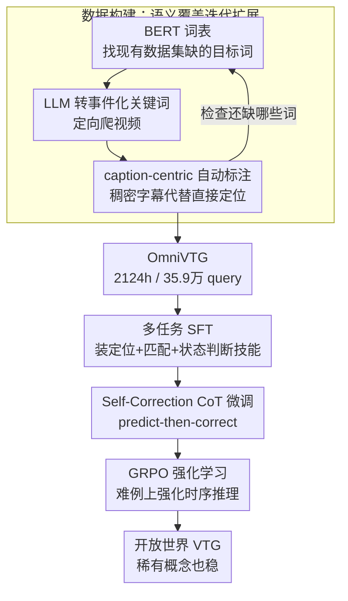

# OmniVTG: A Large-Scale Dataset and Training Paradigm for Open-World Video Temporal Grounding

**会议**: CVPR 2026  
**arXiv**: [2604.25276](https://arxiv.org/abs/2604.25276)  
**代码**: https://github.com/oceanflowlab/OmniVTG  
**领域**: 视频理解 / 视频时序定位  
**关键词**: 视频时序定位、开放世界、稀有概念、自我纠错CoT、MLLM

## 一句话总结
针对视频时序定位（VTG）在开放世界里"稀有概念定不准"的瓶颈，作者用"语义覆盖迭代扩展"管线造了一个 2124 小时、35 万条 query、词表远超现有数据集总和的大规模数据集 OmniVTG，并提出"先预测再自我纠错"的三阶段（SFT→CoT→RL）训练范式，让 Qwen2.5-VL-7B 在四个公开 VTG benchmark 上零样本拿下 SOTA，且稀有概念上几乎不掉点。

## 研究背景与动机

**领域现状**：视频时序定位（Video Temporal Grounding, VTG）的目标是：给一段未裁剪长视频和一句自然语言 query，预测事件发生的起止时间戳 $[t_s, t_e]$。近期主流做法是把这件事交给多模态大模型（MLLM），靠它强大的跨模态理解能力来定位，代表工作有 TimeChat、UniTime、Time-R1 等。

**现有痛点**：在开放世界场景里，真实视频包含的事件极其多样——从日常常见动作到罕见、抽象、领域特定的概念都有。但现有方法一碰到稀有概念就明显掉点（图 1a）。根子在数据：① **语义覆盖窄**，Charades-STA 局限于室内活动、TACoS 只有烹饪、QVHighlights 只有 vlog/新闻，词表都很小；② **规模与质量难两全**，纯人工标注（ActivityNet、Charades-STA）贵且难扩；自动化管线又多依赖 ASR（语音识别），query 来自字幕，无法保证和画面内容精确对齐。

**核心矛盾**：开放世界要求模型认识海量稀有概念，但现有数据集的词表根本没覆盖这些概念——模型没见过，自然定不准。即便用现有数据 SFT 微调，常见概念和稀有概念之间的定位鸿沟依然存在。

**切入角度**：作者抓住了两个关键观察。其一（数据侧）：现代 MLLM（Gemini-2.5-Pro）做**稠密字幕（dense captioning）时给出的时间戳，远比直接做 grounding 准**（图 1c）——那不如把标注任务"反过来"用 captioning 来做。其二（模型侧）：MLLM 的**视频理解能力（判断片段是否匹配 query、判断某时刻事件是"未开始/进行中/已结束"）明显强于它的直接定位能力，而且理解能力在稀有 vs 常见概念间的差距小得多**（图 1b）。

**核心 idea**：数据上用"先找缺词→定向搜视频→用稠密字幕自动标注"的迭代扩展造大规模高覆盖数据集；模型上让它"先粗定位、再调用更鲁棒的理解能力自我反思纠错"，把强的理解能力迁移去补弱的定位能力。

## 方法详解

### 整体框架

OmniVTG 由两条管线组成：**一条造数据，一条训模型**。

数据管线（Semantic Coverage Iterative Expansion）三步走：先从 BERT 词表里挑出现有 VTG 数据集**没覆盖的目标词**，再借 LLM 把这些词翻译成"可定位事件"的搜索关键词去网上**定向爬视频**，最后用"稠密字幕替代直接定位"的 caption-centric 引擎**自动生成带时间戳的标注**；跑完一批就回头检查还缺哪些词，迭代扩张。最终 2124 小时、35.9 万条 query，并人工校验 1 万多条作为测试集。

训练管线（Self-Correction CoT）也是三阶段：**SFT** 先用多任务把基础定位能力和自我纠错所需的理解技能（匹配判断、事件状态分类）一起装进模型；**CoT 微调**教会模型走"先预测一个粗结果 A，再放大纠正成精确答案 B"的显式推理路径；**RL**（GRPO）在难例上进一步强化这套时序推理。三阶段串行、能力层层叠加。

### 关键设计

**1. 语义覆盖迭代扩展：把"缺什么词"变成"搜什么视频"**

现有数据集词表窄、随机爬视频又覆盖不到稀有概念，这一步要主动补缺口。作者先用 BERT tokenizer 的词表当"全集"（再用拼写检查库清洗掉太生僻无用的词），与现有主流 VTG 数据集的实际词表求差，得到一大批"未覆盖的目标词"。难点在于：拿目标词直接去视频平台搜效率很低——搜 "candle" 会返回整段都有蜡烛、没有可定位事件的视频；搜抽象词 "meticulous" 则返回一堆无关内容。作者的解法是让 LLM（Gemini-2.5-Pro）把目标词翻译成**事件化的搜索关键词**：'candle'→'birthday vlog'，'meticulous'→'watchmaker meticulous assembly movement'，这样爬回的视频里大概率有清晰、可定位的事件。每爬完一批就回头统计还缺哪些词、再重复，形成闭环迭代。效果上，在目标词表上 OmniVTG 覆盖率达 95%，而 ActivityNet Captions 只有 48%；名词/动词/形容词的唯一词表甚至超过其他所有数据集之和。

**2. caption-centric 自动标注：用模型更擅长的稠密字幕反向生成时间戳**

要在 4.6 万段视频上做高质量时序标注，人工不可行、ASR 又对不齐画面。作者的关键观察是：同一个 Gemini-2.5-Pro，**做稠密字幕时输出的时间戳明显比它直接做 grounding 时准**（图 1c）。于是把任务"反过来"——不让 MLLM 去定位某条 query，而是让它**给视频生成多条带时间戳的稠密字幕，并显式鼓励它在描述里用上目标稀有词**。这样既保证了全自动、可扩展，又把高质量时间戳"白嫖"了过来。为验证质量，随机抽 10,871 段视频人工校正边界与描述，结果 **93.82% 的自动时间戳与人工修正后的结果 IoU > 0.5**，这个人工子集即官方测试集。

**3. 多任务 SFT：为"自我纠错"预先装好理解技能**

光有数据还不够——直接 SFT 后稀有 vs 常见概念的定位鸿沟仍在。作者让 SFT 阶段同时训四个任务，前一个练定位、后三个专门为后续的自我纠错"备料"：① **Temporal Grounding**（给 query 预测 $[t_s,t_e]$，练基础定位）；② **Event Captioning**（给时间区间生成描述，练对时间戳和开放事件的理解）；③ **Query-Clip Matching**（给 query 和区间，输出 match / partial match / mismatch，按 IoU $>0.7$、$0.3\le \text{IoU}\le 0.7$、$<0.3$ 三档，练"验证自己预测对不对"）；④ **Event Status Classification**（给 query 和某个时刻 $t$，判断事件是 Not Started / In Progress / Ended——比如若预测起点处事件"尚未开始"，就说明起点要往后挪）。后两个技能正是纠错阶段要调用的"理解能力"，而它们在稀有概念上更稳。

**4. Self-Correction CoT + RL：先粗定位，再调用理解能力放大纠正**

这是把"理解强、定位弱"这一观察落到训练里的核心。作者把 OmniVTG 数据重排成显式的"predict-then-correct"CoT 模板：对一条目标事件 $B$（$t_s^B$ 到 $t_e^B$），在同一视频里找一个**视觉相似但更宽**的负例事件 $A$，要求 $B$ 时序上被 $A$ 包住，即 $t_s^A \le t_s^B$ 且 $t_e^B \le t_e^A$；CoT 文本写成"我发现 $A$ 在 $t_s^A$ 到 $t_e^A$；再放大看，事件 $B$ 发生在 $t_s^B$ 到 $t_e^B$"。在这种数据上微调，等于显式教模型用理解能力去**验证并修正自己的初步定位**。最后用 RL 巩固：沿用 Time-R1 的设置，从训练集采难例（平均 IoU≈0.3），用 GRPO 优化策略，奖励沿用时间戳感知的 IoU 奖励加格式奖励
$$r(o) = r_{tIoU}(o) + r_{format}(o), \quad r_{tIoU}(o) = IoU \cdot \left(1 - \frac{|t_s - t_s'|}{t}\right)\cdot\left(1 - \frac{|t_e - t_e'|}{t}\right)$$
其中 $t$ 为视频总时长，$t_s',t_e'$ 为 GT 起止时间。与 Time-R1 的区别在于：Time-R1 的 think 常退化成"复述视频/重复 query"、没有显式的预测校验与纠正，而本文的 CoT 把"先预测后纠正"的结构显式写死，RL 只是在此基础上强化。

### 损失函数 / 训练策略
基座为 Qwen2.5-VL-7B，全程冻结视觉编码器。SFT 与 CoT 微调用 LoRA（rank=8，$\alpha=8$），学习率 2e-4；RL 阶段用 GRPO 对 LLM 做全参数微调，学习率 1e-6。

## 实验关键数据

### 主实验

四个公开 benchmark 零样本（模型只在 OmniVTG 上训练，未见这些数据），指标 R1@IoU：

| 数据集 | 指标 | OmniVTG(本文) | Time-R1 | Qwen2.5-VL-7B |
|--------|------|------|---------|---------------|
| Charades-STA | R1@0.5 / @0.7 | **63.2 / 37.0** | 60.8 / 35.3 | 53.6 / 28.5 |
| ActivityNet | R1@0.5 / @0.7 | **39.8 / 21.4** | 39.0 / 21.4 | 13.6 / 6.7 |
| QVHighlights | R1@0.5 / @0.7 | **67.0 / 47.3** | 66.2 / 44.8 | 7.10 / 4.19 |
| TVGBench | R1@0.3 / @0.5 | **54.5 / 37.6** | 41.8 / 29.4 | 35.3 / 20.0 |

在多源、多题型的 TVGBench 上提升最猛（R1@0.3 从 41.8→54.5），说明泛化性强。

稀有概念对比（OmniVTG 测试集 + ActivityNet，R1@IoU；Rare 子集用 wordfreq 库定义，query 中出现频率 < 1e-7 的词判为稀有）：

| 数据集 | 子集 | 指标 | OmniVTG(本文) | Time-R1 | Qwen2.5-VL |
|--------|------|------|------|---------|------------|
| OmniVTG Test | Full | R1@0.5 | **63.3** | 33.9 | 34.5 |
| OmniVTG Test | Rare | R1@0.5 | **62.4** | 29.4 | 31.5 |
| ActivityNet | Full | R1@0.5 | **39.8** | 39.0 | 13.6 |
| ActivityNet | Rare | R1@0.5 | **39.5** | 36.1 | 12.9 |

关键看 Full→Rare 的掉点：本文几乎不掉（63.3→62.4、39.8→39.5），Time-R1 则明显掉（33.9→29.4、39.0→36.1）——验证了"用更鲁棒的理解能力纠错能抹平稀有概念鸿沟"。

### 消融实验
（OmniVTG 测试集 + ActivityNet，指标 R1@0.5）

| 配置 | OmniVTG Full | OmniVTG Rare | ActivityNet |
|------|------|------|------|
| Qwen2.5-VL-7B（基座） | 34.5 | 31.5 | 13.6 |
| + SFT | 62.3 | 59.6 | 25.6 |
| + SFT + CoT | 62.4 | 61.3 | 32.5 |
| + SFT + RL | 62.8 | 60.6 | 37.2 |
| + SFT + CoT + RL（完整） | **63.3** | **62.4** | **39.8** |
| SFT 10% 数据 | 41.9 | 37.8 | 15.3 |
| SFT 50% 数据 | 58.7 | 55.4 | 21.9 |
| SFT 100% 数据 | 62.3 | 59.6 | 25.6 |
| w/o Reasoning | 62.3 | 59.6 | 25.6 |
| Rule-base reflection | 62.4 | 61.0 | 37.9 |
| Content-aware reflection（本文） | **63.3** | **62.4** | **39.8** |

### 关键发现
- **多任务 SFT 贡献最大**：基座 13.6→25.6（ActivityNet），一跃提升靠它；CoT 主要补稀有概念与未见数据集（Rare 59.6→61.3、ActivityNet 25.6→32.5）。
- **CoT 不可跳过**：直接 SFT+RL（跳过 CoT）在 OmniVTG Rare 和 ActivityNet 上都比完整模型差，说明显式的"先预测后纠正"提供了更优的推理路径，RL 只是强化它而非替代它。
- **数据规模真有用**：SFT 10%→50%→100% 数据，R1@0.5 从 41.9→58.7→62.3 稳定上升，ActivityNet 上同趋势，印证大规模数据集的价值。
- **纠错策略 content-aware 最好**：用"语义相似片段"做初始预测（content-aware）优于"随机平移 GT 边界"（rule-base），说明初始粗预测越贴近真实越利于纠正。

## 亮点与洞察
- **"任务反转"造标注**：发现 MLLM 做稠密字幕的时间戳比直接定位准，于是用 captioning 反向生成 grounding 标注——把模型的强项当标注器、避开它的弱项，是个可直接复用的数据工程 trick。
- **"理解强、定位弱"→迁移**：核心洞察是 MLLM 的视频理解（匹配/状态判断）比直接定位更强、且在稀有概念上更稳；整套方法本质是把鲁棒的理解能力"借"给脆弱的定位能力，这个"用强能力纠错弱能力"的思路可迁移到其他"判别易、生成难"的任务。
- **负例包住正例的 CoT 构造**：用"$B$ 被 $A$ 时序包住、且视觉相似"来自动造 predict-then-correct 数据，把"放大镜逐步聚焦"的纠错过程显式写进 CoT，比让 RL 自己摸索推理结构更可控。
- **定向爬虫的关键词翻译**：直接搜目标词没用，让 LLM 把词翻译成"事件化关键词"再搜——解决了"稀有词→可定位视频"的检索难题。

## 局限与展望
- **标注质量上限受 Gemini 限制**：自动标注全靠 Gemini-2.5-Pro 的稠密字幕，虽然抽检 93.82% IoU>0.5，但训练集整体未人工校验，可能继承教师模型的系统性偏差。
- **测试集与训练集同分布的隐患**：作者自己也承认 OmniVTG 测试集与训练数据同分布，可能高估性能；好在额外用未见的 ActivityNet Rare 子集做了交叉验证缓解这一点。
- **稀有概念定义偏机械**：用 wordfreq 频率 < 1e-7 一刀切定义"稀有"，未必对应人类直觉上的语义难度，可能把生僻但简单的词也算进去。
- **改进方向**：可探索把人工校验扩展到部分训练数据、或引入多教师交叉验证降低单一教师偏差；纠错 CoT 目前只针对边界微调，对"完全定错段落"的纠错能力仍有提升空间。

## 相关工作与启发
- **vs Time-R1**：两者都用 RL + CoT，但 Time-R1 的 think 常退化成"复述视频/重复 query"、没有显式校验纠正，开放世界稀有概念上掉点明显；本文把"先预测后纠正"的结构显式写进 CoT 数据、再用 RL 强化，稀有概念几乎不掉点（OmniVTG Rare 62.4 vs 29.4）。
- **vs UniTime / TimeChat / TRACE**：它们多走"显式编码时间戳 / 多阶段 SFT"路线，仍受限于封闭域数据，零样本泛化弱；本文靠大规模高覆盖数据 + 自我纠错推理，四个公开 benchmark 零样本全面 SOTA。
- **vs MAD 数据集**：MAD 规模和词表与 OmniVTG 接近，但其标注来自音频描述、事件极短（平均 4.1s）有偏，且视频不开放只给预提取特征；OmniVTG 释放原始视频、事件时长更合理（平均 10.7s）、词表更均衡。

## 评分
- 新颖性: ⭐⭐⭐⭐ "任务反转造标注"+"用理解纠错定位"两个观察都很扎实，组合成数据+训练的完整方案
- 实验充分度: ⭐⭐⭐⭐⭐ 四个公开 benchmark 零样本 + 自建 Rare 子集 + 三组消融（阶段/数据量/纠错策略），覆盖全面
- 写作质量: ⭐⭐⭐⭐ 动机—观察—方法逻辑链清晰，图 1 的三个观察支撑有力
- 价值: ⭐⭐⭐⭐⭐ 开源大规模开放世界 VTG 数据集 + 即插即用的自我纠错范式，对整个 VTG 社区有基础设施价值

<!-- RELATED:START -->

## 相关论文

- [\[CVPR 2026\] VideoNet: A Large-Scale Dataset for Domain-Specific Action Recognition](videonet_a_large-scale_dataset_for_domain-specific_action_recognition.md)
- [\[CVPR 2026\] T2SGrid: Temporal-to-Spatial Gridification for Video Temporal Grounding](t2sgrid_temporal-to-spatial_gridification_for_video_temporal_grounding.md)
- [\[CVPR 2026\] CineSRD: Leveraging Visual, Acoustic, and Linguistic Cues for Open-World Visual Media Speaker Diarization](cinesrd_leveraging_visual_acoustic_and_linguistic_cues_for_open-world_visual_med.md)
- [\[CVPR 2026\] HERO: Hierarchical Embedding-Refinement for Open-Vocabulary Temporal Sentence Grounding in Videos](hero_hierarchical_embedding-refinement_for_open-vocabulary_temporal_sentence_gro.md)
- [\[CVPR 2026\] OmniGround: A Comprehensive Spatio-Temporal Grounding Benchmark for Real-World Complex Scenarios](omniground_a_comprehensive_spatio-temporal_grounding_benchmark_for_real-world_co.md)

<!-- RELATED:END -->
