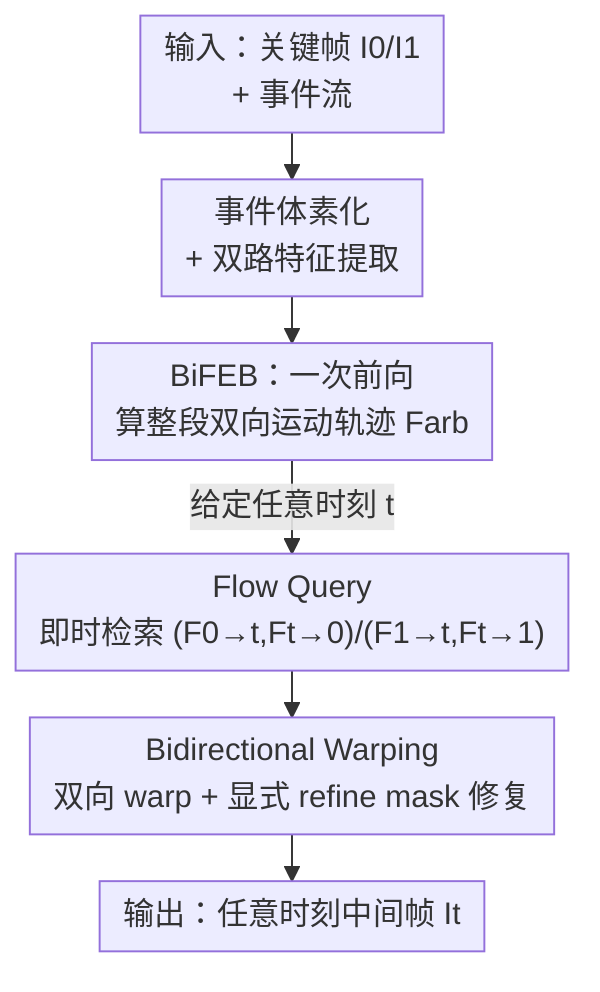

# One-Shot Flow, Any-Time Frame: A Bidirectional Warping Framework for Event-Based Video Frame Interpolation

**会议**: CVPR 2026  
**论文**: [CVF Open Access](https://openaccess.thecvf.com/content/CVPR2026/html/Fu_One-Shot_Flow_Any-Time_Frame_A_Bidirectional_Warping_Framework_for_Event-Based_CVPR_2026_paper.html)  
**代码**: https://github.com/Sudadaaaa/OF-AF  
**领域**: 视频理解 / 事件相机 / 视频帧插值  
**关键词**: 事件相机插帧、双向光流、前向/后向 warping、任意时刻插帧、运动轨迹表征

## 一句话总结
针对事件相机视频帧插值（E-VFI）里"前向 warping 快但有空洞、后向 warping 质量高但每帧都要重算光流"的两难，本文用一次前向计算把整段时间区间的双向运动轨迹（BiFEB）算出来，再用 Flow Query 对任意时刻 $t$ 即时检索双向光流，最后用 Bidirectional Warping 显式定位错误区域并修复，做到任意时刻、低成本、高质量插帧，在 GOPRO / SNU-FILM / BS-ERGB / HS-ERGB 上同时刷新质量和效率。

## 研究背景与动机

**领域现状**：视频帧插值（VFI）里基于光流的方法是主流——它先估计帧间光流，再把已有帧的像素 warp 到目标时刻，结果比直接合成像素的 kernel/diffusion 方法更锐利、几何更一致。事件相机（event camera）以微秒级精度捕捉逐像素亮度变化，提供稠密连续的运动线索，缓解了普通 VFI 关键帧之间运动信息稀疏的瓶颈，催生了 E-VFI 这条路线。

**现有痛点**：光流插帧分成两派，各有死穴。**前向方法**只估一次 $I_0 \to I_1$ 的光流、再按比例线性缩放到任意 $t$，所以插很多帧也只算一次、很快；但线性假设撑不住复杂运动，而且 forward warping 会留下没被覆盖的区域，产生空洞（hole），画质退化。**后向方法**对每个目标像素用反向光流 $I_1 \to I_0$ 去源帧采样，保证全像素覆盖、质量高；但要为**每一个**插值帧都预测一次光流，多帧插值时计算成本爆炸。

**核心矛盾**：效率和质量之间存在结构性 trade-off。现有 E-VFI 方法（CBM-Net、TLXNet、TimeTracker 等）骨子里都是后向 warping，为省掉逐帧光流估计而引入迭代式策略，虽然提了速却带来随插帧数快速膨胀的显存开销——TLXNet 在插 63 帧时直接 OOM（>24GB）。只要还困在后向 warping 范式里，就无法真正统一效率与质量。

**切入角度与核心 idea**：作者抓住两个观察——(1) 前向光流的线性运动假设会累积误差，但稠密事件流提供连续非线性运动线索，可以纠正它；(2) 前向 warping 的空洞，恰好能用后向光流信息来填补。于是提出 **"One-Shot Flow, Any-Time Frame"**：用一次前向计算得到覆盖整段时间区间的**双向**运动轨迹表征，任意时刻的光流按需检索，再用双向 warping 取长补短。一句话——**把"算一次轨迹 + 任意时刻查询 + 双向互补修复"三件事拼起来，同时拿下前向的效率和后向的保真。**

## 方法详解

### 整体框架
输入是两个关键帧 $I_0$、$I_1$ 和它们之间的事件流，输出是任意数量、任意时刻的中间帧。整条 pipeline 分两大阶段：**双向光流估计**和**双向 warping**。

原始事件先被处理成体素网格（voxel grid），然后两个独立特征提取器分别从关键帧和体素网格抽出 1/4 尺度特征。**BiFEB**（Bidirectional Flow Estimation Block）在两个关键帧之间、对任意时刻 $t$ 预测稠密双向光流——关键在于这步**只跑一次**，不管后面要插多少帧，所以计算高效。给定目标时刻 $t$，**Flow Query** 模块即时检索出两组双向光流 $(F_{0\to t}, F_{t\to 0})$ 和 $(F_{1\to t}, F_{t\to 1})$。最后 **BiW**（Bidirectional Warping）拿这些光流前向/后向各 warp 一次，显式算出需要修复的区域并引导网络合成高保真中间帧。

### 关键设计

**1. BiFEB：一次前向算出整段双向运动轨迹，用事件把线性运动假设升级成分段非线性**

这一设计直击前向方法的死穴——为了不对每个 $t$ 重复算光流，BiFEB 像前向方法那样**一次**就估出两关键帧之间任意时刻的双向光流；但前向方法假设帧间运动线性均匀，碰到非匀速/曲线运动就错。BiFEB 的破法是借事件的高时间分辨率：把物体在整段时间上的运动切成 $n$ 个连续时间片（与目标插帧数 $N$ 无关），每片用片内事件估计局部光流，背后是一个温和且合理的假设——**在极短区间内运动可近似为线性匀速**，把整段曲线运动分解成 $n$ 段简单运动来逼近。

具体地，对第 $t$ 个时间片，BiFEB 先把当前事件特征 $E_t$ 与上一片 $(t-1)$ 传来的上下文特征 $\theta_{t-1}$、运动信息 $V_{t-1}$ 聚合，更新出 $\theta_t$、$V_t$，再从关键帧 $I_0$ 出发估计双向光流：

$$\theta^0_t = \text{Res}(\theta^0_{t-1}, E_t),\quad V^0_t = \text{Res}(V^0_{t-1}, E_t, \theta^0_t)$$
$$F_{0\to t} = \text{FFE}(V^0_t, \theta^0_t),\quad F_{t\to 0} = \text{BFE}(V^0_t, \theta^0_t, D^0_{t-1}, F_{t-1\to 0})$$

其中 Res 是残差块，前向光流估计器 FFE 用 GRU 估 $F_{0\to t}$，后向光流估计器 BFE 估 $F_{t\to 0}$，上标 $(\cdot)^0$ 表示从 $I_0$ 出发处理的变量。把事件按相反顺序输入、并以 $I_1$ 的特征初始化，就同样得到从 $I_1$ 出发的 $F_{1\to t}$、$F_{t\to 1}$。最终所有时间片拼成对象在任意时刻的双向运动轨迹表征 $F_{arb}$。这种"片内残差递推 + 双向"的设计，让一次前向就刻画了整段非线性轨迹，是后面"任意时刻 O(1) 查询"的物理基础。

**2. Flow Query：从一次算好的轨迹里按需检索任意时刻光流，线性插值落到正确时间片**

BiFEB 算出的 $F_{arb}$ 是离散时间片上的轨迹，但用户要的 $t \in (0,1)$ 可能落在两片之间。Flow Query 的作用就是把"连续时间查询"映射到"离散片 + 片内插值"，从而避免后向方法的逐帧光流预测。它先确定包含 $t$ 的时间片的起点 $t_l$、终点 $t_r$，按 $t_l, t_r$ 从 $F_{arb}$ 和上下文 $\theta$ 里查出端点处的双向光流和上下文特征：

$$F_{0\to t_l}, F_{t_l\to t_r} = Q(F_{arb}, 0\to t),\quad F_{t_r\to t_l}, F_{t_l\to 0} = Q(F_{arb}, t\to 0),\quad \theta^0_{t_l}, \theta^0_{t_r} = Q(\theta, 0, t)$$

再用片内归一化权重 $\lambda = \frac{t - t_l}{t_r - t_l}$ 把端点量线性混合成 $t$ 时刻的最终光流与上下文：

$$F_{0\to t} = F_{0\to t_l} + \lambda \cdot F_{t_l\to t_r},\quad F_{t\to 0} = (1-\lambda)\cdot F_{t_r\to t_l} + F_{t_l\to 0},\quad \theta^0_t = (1-\lambda)\cdot\theta^0_{t_l} + \lambda\cdot\theta^0_{t_r}$$

因为查询只是查表加一次轻量插值，所以插任意多帧都不再触发光流重算——这正是"插帧数越多、每帧成本越摊薄"的来源（Tab. 3 里插 127 帧时每帧 MACs 反而比插 31 帧更低）。

**3. BiW：用前向/后向各自的弱点互算出显式 refine mask，定向修复而非让网络盲猜**

预测光流不可能完美，warp 出的中间帧通常质量差。先前工作（Fig. 4a）直接把 warped 帧丢进 refinement 网络，指望它**隐式**找出并改正错误区域，这很难。BiW 的思路是把"哪里错了"显式算出来再喂给网络。它先用 $F_{0\to t}$、$F_{t\to 0}$ 分别前向/后向 warp 得到低质量帧 $I^f_t$、$I^b_t$，再算两个 mask：

$$R^0_h = \text{where}(I^f_t = 0),\quad R^0_d = \text{where}(|I^f_t - I^b_t| > Y)$$

$\text{where}(\cdot)$ 把满足条件的像素置 1，$Y$ 是阈值。$R^0_h$ 是前向 warp 留下的**空洞 mask**，$R^0_d$ 是前后向 warp 的**差异 mask**。关键的取舍是：填前向帧 $I^f_t$ 的空洞很难，于是改用 $R^0_h$、$R^0_d$ 去修**后向** warp 的 $I^b_t$——因为空洞区往往就是遮挡区，后向 warping 在那儿同样易错，所以拿空洞位置去引导修后向帧既合理又有效。Mask Guide 网络 $\text{MG}(\cdot)$ 综合两个 mask 与上下文输出修复帧和 refine mask：$R^0, I^0_t = \text{MG}(R^0_h, R^0_d, \theta^0_t, \theta^1_t)$。其中先用 $R^0_h$ 引导 Reference 块从 $\theta^0_t$、$\theta^1_t$ 对应区域抽参考信息（顺带修正光流误差带来的 $R^0_h$ 偏差），而 $R^0_d$ **不**进 Reference 块，只用来让网络多关注差异区（因为 $I^b_t$ 在这些区不一定是错的）。

对 $I_0$、$I_1$ 两端各做一遍得到 $I^0_t$、$I^1_t$ 及各自 refine mask $R^0$、$R^1$，最后融合：

$$M = \text{softmax}\big((1-R^0)\cdot(1-t),\ (1-R^1)\cdot t\big),\quad I_t = I^0_t \cdot M^0 + I^1_t \cdot M^1$$

直觉很清楚：$t$ 越小、中间帧越接近 $I_0$，就给 $I^0_t$ 更高权重；同时用 $1-R^0$、$1-R^1$ 压低需要修复区域的权重——越"没问题"的区域越被信任。最后再接一个轻量 Refine 模块兜底，处理"空洞没发生、但前后向帧在同一处犯同样错误、没被 mask 抓到"的残余情况。

### 损失函数 / 训练策略
在 GOPRO 上端到端训练，用 $L_1$ + LPIPS 损失；Adam 优化，学习率 $10^{-4}$ 余弦退火到 $10^{-6}$，训 20 个 epoch；图像与事件随机裁到 $256\times256$；BiFEB 的时间片数 $n=16$（保证时间间隔足够小）；单张 RTX 3090。

## 实验关键数据

### 主实验

合成数据集（GOPRO / SNU-FILM）上全面领先，warping 类型一栏可见本文是唯一的 F&B（前向+后向）：

| 数据集 / 设置 | 指标 | 本文 (F&B) | TimeTracker (CVPR'25, B) | TLXNet (ECCV'24, B) |
|--------------|------|-----------|--------------------------|---------------------|
| GOPRO Skip 7 | PSNR / SSIM | **37.66 / 0.976** | 37.13 / 0.962 | 37.06 / 0.970 |
| GOPRO Skip 15 | PSNR / SSIM | **36.90 / 0.970** | 36.54 / 0.958 | 36.43 / 0.968 |
| SNU-FILM hard | PSNR / SSIM | **38.32 / 0.975** | 37.92 / 0.967 | 37.67 / 0.971 |
| SNU-FILM extreme | PSNR / SSIM | **36.96 / 0.967** | 36.47 / 0.959 | 36.10 / 0.962 |

真实数据集（BS-ERGB / HS-ERGB）上，HS-ERGB 全设置第一，BS-ERGB 稳居前二：

| 数据集 / 设置 | 指标 | 本文 (F&B) | TimeTracker* (B) |
|--------------|------|-----------|------------------|
| BS-ERGB Skip 1 | PSNR / SSIM | 29.76 / **0.823** | **29.85** / 0.823 |
| BS-ERGB Skip 3 | PSNR / SSIM | 29.03 / **0.815** | **29.14** / 0.807 |
| HS-ERGB Skip 5 | PSNR / SSIM | **34.63 / 0.889** | 33.59 / 0.872 |
| HS-ERGB Skip 7 | PSNR / SSIM | **34.19 / 0.881** | 32.68 / 0.861 |

计算成本（GOPRO，插不同帧数）——"一次估流 + 摊薄"的优势在帧数变多时体现得淋漓尽致：

| 方法 | 31 帧 Mem / Time/f | 63 帧 Mem / Time/f | 127 帧 Mem / MACs/f |
|------|--------------------|--------------------|---------------------|
| Timelens (后向) | 1.93GB / 1.065s | 1.93GB / 1.031s | 1.93GB / 1535.28G |
| TLXNet (后向) | 11.70GB / 0.079s | **OOM** | **OOM** |
| **本文** | 5.29GB / 0.137s | 5.95GB / 0.117s | 7.27GB / **665.35G** |

TLXNet 在 31 帧时靠堆显存换速度（MACs/f、Time/f 更低），但插 63 帧就 OOM；本文显存平稳、每帧 MACs 随帧数增多反而下降（887G→738G→665G），还能在 $t=0.51$、$t=0.88$ 这类任意时刻插帧——这是 TLXNet 做不到的。

### 消融实验

| 变体 | 光流估计器 | 插值方式 | PSNR / SSIM | 说明 |
|------|-----------|---------|-------------|------|
| A | RAFT + Timelens | BiW | 36.27 / 0.962 | 线性光流误差拖累 |
| B | BiFEB (n=4) | BiW | 29.75 / 0.892 | 时间片太少、非线性逼近差 |
| C | BiFEB (n=8) | BiW | 35.24 / 0.954 | n 增大、流更准 |
| D | BiFEB (n=16) | 仅前向 warp | 30.54 / 0.912 | 空洞严重 |
| E | BiFEB (n=16) | 仅后向 warp | 35.78 / 0.959 | 缺空洞引导 |
| F | BiFEB (n=16) | BiW (w/o $R_h$) | 36.01 / 0.961 | 去空洞 mask 掉点 |
| G | BiFEB (n=16) | BiW (w/o $R_d$) | 36.74 / 0.966 | 去差异 mask 小掉点 |
| **H (Ours)** | BiFEB (n=16) | BiW | **36.96 / 0.967** | 完整模型 |

### 关键发现
- **时间片数 $n$ 是非线性逼近的命门**：$n=4$ 时只有 29.75 dB，$n=8$ 升到 35.24，$n=16$ 达 36.96——片越多、把曲线运动切得越细，局部线性假设越成立，光流越准。
- **前向/后向单独都不够，BiW 的互补才是关键**：仅前向 30.54（空洞重）、仅后向 35.78（缺引导），合起来 36.96。空洞 mask $R_h$（去掉掉到 36.01）比差异 mask $R_d$（去掉到 36.74）贡献更大，印证"用前向空洞去定向修后向帧"是核心机制。
- **极端运动下优势放大**：细绳（thin structure）高速运动、人体遮挡等场景，CBM-Net/TLXNet 出现断裂、错误预测人物出现，本文靠 BiFEB 把复杂运动分解成多段简单运动，轨迹估计更准。

## 亮点与洞察
- **把"前向 vs 后向"从二选一改成显式互补**：前向的空洞位置恰好是后向也容易错的遮挡区，于是用前向空洞 mask 去引导修后向帧——一个方法的弱点变成另一个方法的"错误定位器"，思路很巧。
- **"一次算轨迹 + 任意时刻查询"解耦了运动估计与插帧数**：光流估计成本从 $O(N)$ 降到 $O(1)$，插帧数越多每帧成本越摊薄，这是对后向范式逐帧估流的根本性改写，可迁移到任何"需要在连续时间上反复采样同一运动场"的任务（如视频超分时间维、新视角连续渲染）。
- **显式 refine mask 替代隐式纠错**：与其让 refinement 网络盲猜哪里错，不如用前后向 warp 的差异/空洞直接算出错误区再定向修——这种"先定位再修复"的范式在很多 restoration 任务里都比端到端隐式修复更可控。

## 局限与展望
- **片内仍是局部线性假设**：$n=16$ 已经不错，但对极端非线性/高频抖动运动，分段线性可能仍有残差；增大 $n$ 会增加 BiFEB 递推开销，存在精度-成本权衡 ⚠️。
- **依赖事件质量**：合成数据集的事件由 V2E 仿真生成，真实事件相机的噪声、带宽限制下表现是否同样稳健，正文未深入分析。
- **兜底 Refine 模块暴露 mask 盲区**：当前后向帧在非空洞区犯**相同**错误时，差异 mask 抓不到，只能靠额外 Refine 兜底——说明 mask 机制对"同向错误"无能为力，可考虑引入更强的不确定性估计。
- **BFE 细节在补充材料**：后向光流估计器 BFE 的具体结构正文未给全 ⚠️ 以原文为准。

## 相关工作与启发
- **vs 前向方法（M2M-PWC / UPR-Net / IQ-VFI）**：它们一次估流、线性缩放到任意 $t$，快但被线性假设和空洞限制；本文同样"一次估流"，但用事件做分段非线性轨迹、并用后向 warp 填空洞，质量明显更高（消融 A 的 RAFT+Timelens 仅 36.27）。
- **vs 后向 E-VFI（CBM-Net / TLXNet / TimeTracker）**：它们逐帧预测后向光流，质量高但成本随帧数线性增长、易 OOM（TLXNet 63 帧 OOM）；本文用 Flow Query 把逐帧估流换成查表插值，效率与质量兼得。
- **vs 迭代式多帧估计（TimeTracker）**：迭代策略靠存大量中间变量提速但显存爆炸；本文一次性算整段轨迹、按需检索，显存平稳（127 帧仅 7.27GB），且能插任意非整数时刻。

## 评分
- 新颖性: ⭐⭐⭐⭐⭐ "一次轨迹 + 任意时刻查询 + 前后向互补修复"系统性破解 E-VFI 效率-质量两难，范式层面有新意。
- 实验充分度: ⭐⭐⭐⭐⭐ 合成+真实 4 个数据集、计算成本分析、极端运动、7 组消融，覆盖全面。
- 写作质量: ⭐⭐⭐⭐ 逻辑清晰、图示到位，但公式与符号密集、BFE 细节外放补充材料，纯看正文略吃力。
- 价值: ⭐⭐⭐⭐⭐ 给资源受限的多帧/慢动作插帧提供了既快又好的可落地方案，思路可迁移到其他连续时间采样任务。

<!-- RELATED:START -->

## 相关论文

- [\[CVPR 2026\] From Contrast to Consistency: Rethinking Event-based Continuous-Time Optical Flow Estimation](from_contrast_to_consistency_rethinking_event-based_continuous-time_optical_flow.md)
- [\[AAAI 2026\] VTinker: Guided Flow Upsampling and Texture Mapping for High-Resolution Video Frame Interpolation](../../AAAI2026/video_understanding/vtinker_guided_flow_upsampling_and_texture_mapping_for_high-resolution_video_fra.md)
- [\[CVPR 2026\] Envisioning the Future, One Step at a Time](envisioning_the_future_one_step_at_a_time.md)
- [\[ECCV 2024\] IAM-VFI: Interpolate Any Motion for Video Frame Interpolation with Motion Complexity Map](../../ECCV2024/video_understanding/iam-vfi_interpolate_any_motion_for_video_frame_interpolation_with_motion_complex.md)
- [\[CVPR 2026\] GIFT: Global Irreplaceability Frame Targeting for Efficient Video Understanding](gift_global_irreplaceability_frame_targeting_for_efficient_video_understanding.md)

<!-- RELATED:END -->
