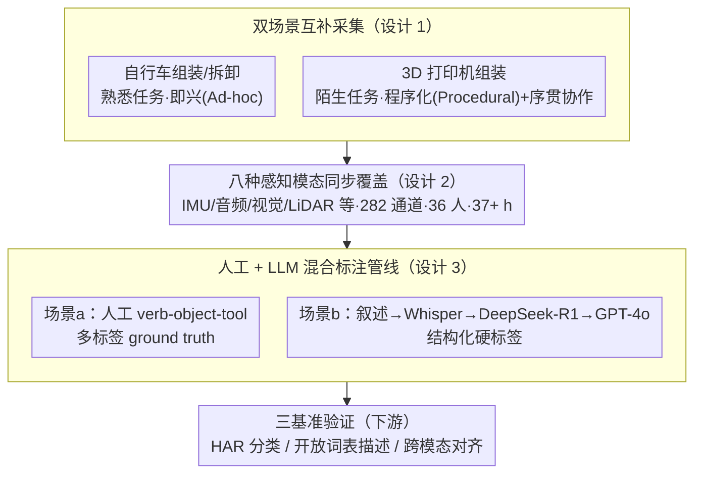

# OpenMarcie: Dataset for Multimodal Action Recognition in Industrial Environments

**会议**: CVPR 2026  
**arXiv**: [2603.02390](https://arxiv.org/abs/2603.02390)  
**代码**: 有（OpenMarcie 官网提供数据集与代码）  
**领域**: 视频理解  
**关键词**: 多模态数据集, 人体动作识别, 工业制造, 可穿戴传感器, 跨模态对齐

## 一句话总结

提出目前最大规模的工业场景多模态动作识别数据集 OpenMarcie，融合可穿戴传感器与视觉数据共 8 种模态、200+ 通道、37+ 小时录制，并在 HAR 分类、开放词表描述、跨模态对齐三个基准上验证了惯性+视觉融合的优越性。

## 研究背景与动机

### 1. 领域现状
智能工厂依赖人类活动识别（HAR）来量化工人表现、提升效率并保障安全。视频数据长期是 HAR 的主要信息来源，但单一视觉模态在工业场景中面临隐私泄露和技术泄漏风险。近年来已涌现多个工业 HAR 数据集（InHARD、LARa、OpenPack、Assembly101、IKEA-ASM 等），但均存在明显短板。

### 2. 痛点
现有工业 HAR 数据集存在三大局限：
- **缺乏真正的多模态同步数据**：多数仅覆盖视觉或 IMU 单一模态，缺少可穿戴传感器+视觉+音频的协同采集
- **任务过度受限**：依赖高度控制的协议驱动任务，无法反映真实工业中开放式、程序化的工作流程
- **人口多样性和任务复杂度不足**：多数数据集仅采集短时孤立动作，未能捕捉制造业中长时间、多步骤的连续活动

### 3. 核心矛盾
人类动作本质上是多模态的——整合了视觉、听觉、触觉以及认知和情绪状态——但现有数据集要么模态单一，要么缺乏自然变异性和真实工业噪声。要让 AI 系统真正理解工业场景中的人类活动，需要一个涵盖多种传感器、多视角视频、自然语言叙述的综合性数据集。

### 4. 要解决什么
构建一个统一的大规模工业多模态基准，同时支持活动分类、开放词表描述生成和跨模态对齐三大任务，填补当前数据集在模态丰富度、任务多样性和标注细粒度上的空白。

### 5. 切入角度
设计两个互补的实验场景——自行车组装拆卸（开放式临场发挥）和 3D 打印机组装（程序化依照说明书）——分别捕捉自由目标导向行为和程序化知识获取过程，并通过序贯协作组装引入真实制造业动态。

### 6. 核心 idea
OpenMarcie 是首个同时覆盖可穿戴传感器 + 自中心/外中心多视角视频 + 多动作重叠标注的全工业场景数据集，通过 8 种感知模态、282 个原始通道、36 名参与者和超过 37 小时的数据，为工业 HAR 提供最全面的多模态基准。

## 方法详解

### 整体框架

OpenMarcie 本质上不是一个"模型"，而是一套**采集—标注—验证**的数据流水线，目标是把工业现场里同时发生的运动、声音、视觉、距离等信号尽量完整地录下来，并配上能直接拿来训练的标签。整条管线分三段：前端在两个真实组装场景里同步采集 8 种模态、282 个原始通道的信号，覆盖 36 名参与者、37+ 小时；中段把录下来的视频/叙述转成结构化动作标签（人工 + LLM 混合）；后端则在 HAR 分类、开放词表描述、跨模态对齐三个任务上跑出基线，用来验证"这批多模态数据到底有没有用、哪些模态组合最有用"。下面三个关键设计分别对应这条管线里最关键的三个取舍：采什么场景、采哪些模态、怎么标注。

### 关键设计

**1. 双场景互补采集：用一个熟悉任务 + 一个陌生任务覆盖工业里的两种行为模式**

现有工业 HAR 数据集大多依赖高度受控的协议任务，工人按固定脚本走一遍，捕捉不到真实车间里既有熟练工即兴操作、又有新手照说明书摸索的自然变异。OpenMarcie 因此特意设计了两个对照场景：自行车组装/拆卸是参与者熟悉的任务，鼓励自由决策和目标导向的即兴操作（Ad-hoc）；3D 打印机组装是陌生任务，参与者必须一边读详细说明书一边获取程序化知识（Procedural）。这两类正好对应工业中的开放式维修和结构化流水线作业。更进一步，3D 打印机场景引入了**序贯协作组装**——下一位参与者从上一位停手的地方接着干，必须先判断别人已经做到哪、再决定下一步——这把真实产线上的"工位交接"动态也录了进来，是单人孤立动作数据集做不到的。

**2. 八种感知模态同步覆盖：靠互补信号补上单模态的盲区**

工业动作天然是多模态的，但单一模态各有盲区：只看视觉分不清"拧紧"还是"松开"，只看 IMU 又不知道手在操作哪个对象。OpenMarcie 因此在每位参与者身上同步部署 IMU（手腕、前额）、磁力计、气压计、温度传感器、光谱仪、热成像、RGB-LiDAR、立体麦克风等可穿戴设备，外加 3 台 ZED X AI 立体相机提供外中心 RGBD 视角，合计 282 个原始通道。这些模态携带的是互补信息——IMU 抓运动动力学、视觉抓空间上下文、音频抓工具使用声、LiDAR 提供距离——融合后才可能完整刻画一个动作。这种冗余还有一层实用价值：当视觉因遮挡或隐私限制不可用时，惯性/音频模态可以作为替代继续支撑识别。

**3. 人工 + LLM 混合标注管线：用 LLM 当"结构化翻译器"把 37 小时叙述变成可训练标签**

纯人工逐帧标注 37 小时多模态数据成本高到不现实，但只靠自动标注又保证不了质量，所以两个场景用了不同策略并互相校准。Scenario (a) 由人工在最佳外中心视角上用 verb-object-tool 方案手动标注，且支持多标签（如"边走边搬"同时成立），保证精确的 ground truth；Scenario (b) 则由外部观察者实时口头叙述动作，经 Whisper large-v3 转录后，送进两阶段 LLM 管线——先用 DeepSeek-R1 从自然语言里提取动作类，再用 GPT-4o 生成结构化硬标签。这里 LLM 扮演的是"把自然语言叙述翻译成训练标签"的角色，而不是凭空生成内容。为了确认这套自动标签靠谱，作者做了双向一致性检验（结构化标签 → 描述 → 再还原结构化），实测 Scenario (a) Macro F1 = 0.715、Scenario (b) METEOR = 0.531，说明 LLM 标签质量足以支撑下游训练。

### 三个基准的训练策略

数据集本身不训练，但为了证明这批数据可用，作者在三个任务上各搭了一套基线：

- **HAR 分类**：每种模态先各自用专属编码器独立训练——视频用 ViT、IMU 用 DeepConvLSTM、音频用 EnCodec 接时序分类器——再用一个 late-fusion transformer 把单模态特征晚融合，分 12 类动作，按被试划分训练/测试集以检验跨人泛化。
- **开放词表描述**：采用 OV-HAR 思路，让模态专用编码器直接回归叙述文本的句子嵌入，再通过 Vec2Text 做嵌入检索解码生成描述，整条链路不依赖大语言模型。
- **跨模态对齐**：受 ImageBind 启发，用多模态对比学习（InfoNCE loss）把视频、IMU、音频、语言一起拉进共享嵌入空间，从而支持跨模态检索。

## 实验关键数据

### 主实验

**表1：HAR 分类 Macro F1（↑）**

| 模态 | Scenario (a) No Null | Scenario (a) Null | Scenario (b) No Null | Scenario (b) Null |
|------|---------------------|-------------------|---------------------|-------------------|
| Inertial (I) | 0.834 | 0.811 | 0.750 | 0.674 |
| Acoustic (A) | 0.489 | 0.469 | 0.425 | 0.432 |
| Vision (V) | 0.757 | 0.729 | 0.705 | 0.655 |
| I + A | 0.803 | 0.782 | 0.744 | 0.666 |
| A + V | 0.739 | 0.714 | 0.695 | 0.646 |
| **I + V** | **0.882** | **0.851** | **0.773** | **0.685** |
| I + A + V | 0.859 | 0.831 | 0.763 | 0.676 |

**表2：跨模态对齐 Recall 与 Top-1 准确率**

| 模态组合 | Scenario (a) R@1 | R@5 | Top-1 | Scenario (b) R@1 | R@5 | Top-1 |
|---------|-----------------|-----|-------|-----------------|-----|-------|
| I + T | 0.324 | 0.655 | 0.481 | 0.312 | 0.642 | 0.468 |
| A + T | 0.241 | 0.583 | 0.342 | 0.227 | 0.567 | 0.329 |
| V + T | 0.437 | 0.768 | 0.556 | 0.421 | 0.751 | 0.541 |
| I + A + T | 0.347 | 0.679 | 0.495 | 0.334 | 0.663 | 0.479 |
| A + V + T | 0.412 | 0.740 | 0.533 | 0.395 | 0.723 | 0.517 |
| **I + V + T** | **0.485** | **0.803** | **0.587** | **0.467** | **0.787** | **0.570** |
| I + A + V + T | 0.470 | 0.795 | 0.579 | 0.453 | 0.779 | 0.563 |

### 消融实验

开放词表描述的 Cosine Similarity 结果进一步验证模态互补性：
- **I + V 最优**：Scenario (a) 0.561、Scenario (b) 0.655，始终超过三模态融合(I+A+V = 0.547 / 0.647)
- **Acoustic 单独最弱**：Scenario (a) 仅 0.361，远低于 Inertial 的 0.518 和 Vision 的 0.479
- **加入 Acoustic 收益有限**：I+A (0.512) 略低于单独 I (0.518)，说明音频在当前设置下甚至可能引入噪声
- 去除 Null 类后所有指标均有提升，表明空活动段是分类中的主要困难来源

### 关键发现

1. **Inertial + Vision 是黄金组合**：在 HAR、描述、对齐三个任务中均一致地取得最佳性能，表明运动动力学和视觉空间信息高度互补
2. **三模态融合反而不如双模态**：I+A+V 在多数指标上低于 I+V，说明噪声较大的音频模态在 late fusion 中可能稀释有效信号
3. **Ad-hoc 场景普遍优于 Procedural 场景**：自行车组装的 HAR F1 (0.882) 远高于 3D 打印机 (0.773)，因后者涉及更多不熟悉的小部件操作和认知挑战
4. **音频模态表现有限但非无用**：独立性能差主要因为数据在实验台而非真实工厂采集，缺乏真实工业噪声（机器振动等）；在融合中仍有边际贡献

## 亮点与洞察

- **规模与覆盖最全**：8 种模态、282 通道、37+ 小时、36 名参与者，是已知最大的工业多模态 HAR 数据集
- **生态效度高**：序贯协作组装设计（后一位从前一位处继续）真实反映产线交接场景
- **标注方法创新**：人工标注 + LLM 两阶段管线 + 双向一致性检验，平衡了标注成本与质量
- **多标签动作支持**：独特的 verb-object-tool 方案允许重叠标注（如边走边搬运），更贴近真实工业场景
- **三个互补基准**：HAR + 描述 + 对齐的组合全面评估数据集的多方面价值

## 局限与展望

1. **参与者多样性有限**：以右利手工程师为主（72%工程师、86%右利手），人口统计泛化性受限
2. **音频模态效果弱**：实验室环境缺乏真实工业噪声，音频信号在实际工厂中的表现仍待验证
3. **标注覆盖不完全**：当前标注仅利用了部分数据集潜力，多视角录制还可支持物体、交互、姿态等更丰富的标注
4. **传感器配置跨场景不完全一致**：两个场景的可穿戴设备放置有差异，虽然关键模态（手腕 IMU、胸部 LiDAR、立体麦克风）一致，但增加了跨场景比较难度
5. **基准方法较为基础**：HAR 用 ViT + DeepConvLSTM 的 late fusion，未探索更先进的早期融合或注意力融合策略

## 相关工作与启发

- **与 Ego-Exo4D 互补**：Ego-Exo4D 规模更大（1200h）但工业数据仅占约 6%，OpenMarcie 则 100% 工业覆盖且包含可穿戴传感器
- **OpenPack 的拓展**：OpenPack 专注物流场景 50h+ IMU/IoT，但缺少视觉和自中心视角；OpenMarcie 补充了视觉+自中心模态
- **ImageBind 的实际应用检验**：将 ImageBind 的多模态对齐理念从互联网规模数据迁移到结构化工业传感器数据
- **对未来研究的启发**：可探索早期融合策略以更好利用音频信号；可基于 3D 打印机 STL 零件模型做物体检测增强；序贯协作设计可延伸为人机协作数据集

## 评分

⭐⭐⭐⭐ 高质量的工业多模态数据集贡献，模态覆盖和场景设计均为同领域最全面，三个验证基准系统化程度高；主要不足是音频模态实用性待验证且基准方法偏基础，作为 dataset paper 整体贡献突出。

<!-- RELATED:START -->

## 相关论文

- [\[CVPR 2026\] DarkAct: A RGB-Thermal Dataset and Fusion Framework for Multimodal Low-Light Action Recognition](darkact_a_rgb-thermal_dataset_and_fusion_framework_for_multimodal_low-light_acti.md)
- [\[CVPR 2026\] VideoNet: A Large-Scale Dataset for Domain-Specific Action Recognition](videonet_a_large-scale_dataset_for_domain-specific_action_recognition.md)
- [\[CVPR 2026\] Seeing Motion Through Polarity for Event-based Action Recognition](seeing_motion_through_polarity_for_event-based_action_recognition.md)
- [\[CVPR 2026\] SkeletonContext: Skeleton-side Context Prompt Learning for Zero-Shot Skeleton-based Action Recognition](skeletoncontext_skeleton-side_context_prompt_learning_for_zero-shot_skeleton-bas.md)
- [\[CVPR 2026\] SHANDS: A Multi-View Dataset and Benchmark for Surgical Hand-Gesture and Error Recognition Toward Medical Training](shands_a_multi-view_dataset_and_benchmark_for_surgical_hand-gesture_and_error_re.md)

<!-- RELATED:END -->
