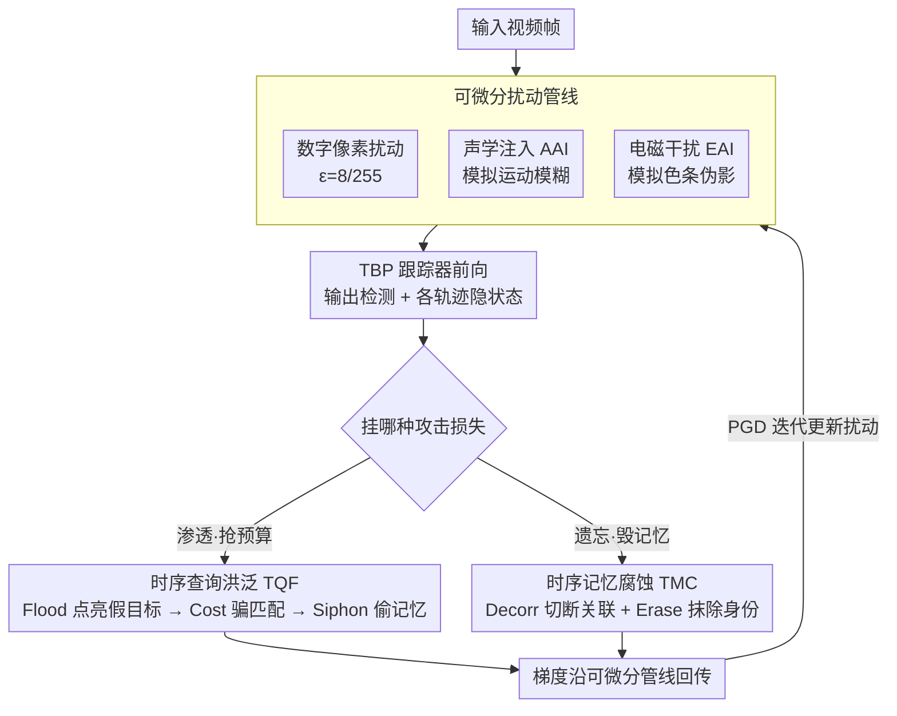

# Out of Sight, Out of Track: Adversarial Attacks on Propagation-based Multi-Object Trackers via Query State Manipulation

**会议**: CVPR 2026  
**arXiv**: [2604.00452](https://arxiv.org/abs/2604.00452)  
**代码**: 无  
**领域**: 视频理解 / 多目标跟踪 / 对抗攻击  
**关键词**: 多目标跟踪, 对抗攻击, 查询传播, 时序记忆腐蚀, 物理攻击

## 一句话总结

首次系统分析 Tracking-by-Query-Propagation（TBP）跟踪器的对抗脆弱性，提出 FADE 攻击框架，通过时序查询洪泛（TQF）耗尽固定查询预算和时序记忆腐蚀（TMC）破坏隐状态传播两种策略，在 MOT17/MOT20 上对 MOTR/MOTRv2/MeMOTR/Samba/CO-MOT 造成最高约 30 点 HOTA 下降和 10 倍以上身份切换。

## 研究背景与动机

1. **领域现状**：多目标跟踪（MOT）从传统的 Tracking-by-Detection（TBD）范式发展到更先进的 Tracking-by-Propagation（TBP）范式。TBP 跟踪器（如 MOTR、MOTRv2、MeMOTR、Samba、CO-MOT）通过自回归传播 track query 实现端到端检测与关联，避免了 Kalman 滤波等启发式关联。

2. **现有痛点**：现有的 MOT 对抗攻击（Daedalus、Hijacking、F&F、BankTweak）均针对 TBD 架构设计——攻击 NMS 阈值、Kalman 滤波预测、或独立的外观特征库——这些组件在端到端 TBP 跟踪器中不存在。

3. **核心矛盾**：TBP 跟踪器引入了全新的结构性脆弱点：(1) **固定查询预算**形成零和博弈——分配给虚假轨迹的 query 必然减少合法轨迹的容量；(2) **循环隐状态传播**创建时序依赖链——状态腐蚀会跨帧传播；(3) **内置时序记忆**放大攻击持久性。

4. **本文目标** 针对 TBP 特有的查询预算和时序记忆机制设计专用攻击方法。

5. **切入角度**：从 TBP 的核心机制（query 预算分配 + query 更新器的记忆传播）出发，设计两种互补攻击：一种"渗透"（制造假轨迹占预算），一种"遗忘"（破坏真轨迹的记忆）。

6. **核心 idea**：通过洪泛虚假查询耗尽预算或腐蚀时序记忆，从 TBP 的架构内部瓦解跟踪。

## 方法详解

### 整体框架

FADE 想做的事很直接：不去攻击 TBP 跟踪器看得见的检测框，而是攻击它看不见的内部状态——那一组在帧间自回归传播的 track query 和隐状态。整条流水线是一个标准的 PGD 优化循环：先在输入帧上叠加一层扰动（数字像素扰动，或物理传感器欺骗），把扰动后的帧喂给目标跟踪器；跟踪器照常吐出检测预测和每条轨迹的隐状态，FADE 在这些中间量上挂一个攻击损失（耗预算的 $\mathcal{L}_{TQF}$ 或毁记忆的 $\mathcal{L}_{TMC}$）；梯度沿着可微分的跟踪管线一路回传到扰动参数，迭代更新扰动。换句话说，攻击者借的就是 TBP 自己的查询匹配和记忆传播机制，让跟踪器的结构优势变成它的命门。

### 关键设计

**1. 时序查询洪泛（TQF）：用持久的假轨迹把固定查询预算挤爆**

TBP 跟踪器的查询预算是固定的——一帧里能维持的 track query 数量有上限，分给假轨迹的每一个 query，都是从合法轨迹那里抢来的容量。所以攻击的着力点不是"多检测出几个框"，而是"造出一批能赖着不走的假轨迹"占住名额。难点在于单帧假阳性会被下一帧的匹配淘汰，必须让假轨迹真正融进 query 的传播状态。TQF 用三个子损失协同实现这件事：$\mathcal{L}_{Flood}$ 最大化那些未匹配查询的检测置信度，先凭空"点亮"一批高置信假目标；$\mathcal{L}_{Cost}$ 进一步让这些对抗查询对真实目标呈现极低的匹配代价，从而骗过二部图匹配，把本该属于真实目标的身份分派给假查询；$\mathcal{L}_{Siphon}$ 则把当前对抗查询的隐状态向上一帧某条合法轨迹的隐状态对齐，相当于"窃取"那条轨迹的历史记忆，让假轨迹获得时序连续性而持久化下来。三者合起来，假轨迹不只是冒出来一帧，而是带着偷来的身份在帧间存活，真正把预算耗干。

**2. 时序记忆腐蚀（TMC）：直接切断并擦除真轨迹的隐状态**

如果说 TQF 是"渗透"——往里塞假轨迹抢资源，TMC 就是互补的"遗忘"——不造新轨迹，而是把现有合法轨迹的记忆链直接打断。TBP 靠 query 更新器在帧间维持隐状态来重新关联同一目标，TMC 正是攻击这条传播链。$\mathcal{L}_{Decorr}$ 最小化当前帧隐状态 $\mathcal{H}^t$ 与上一帧 $\mathcal{H}^{t-1}$ 的余弦相似度，把本该平滑延续的时序关联硬生生扯断，让更新器认不出这是同一条轨迹；$\mathcal{L}_{Erase}$ 则最小化已匹配查询隐状态的 L2 范数，把它压向零向量，等于抹掉这条轨迹携带的特征身份。前者制造身份漂移、后者制造轨迹消失，两个损失从"关联"和"表征"两个层面同时腐蚀记忆，让跟踪器频繁丢轨、重标 id。

**3. 从数字到物理的可微分攻击管线：把传感器欺骗也纳入同一套 PGD 优化**

数字像素扰动在真实世界里难以落地，传统物理攻击又多是贴片式、只能盯单个目标。FADE 的做法是把两类传感器级欺骗建模成可微分的模拟器，从而能和数字攻击共用同一个 PGD 优化框架：声学注入（AAI）模拟相机防抖器被声波共振激发后引起的运动模糊，电磁干扰（EAI）模拟 ADC 转换受干扰后产生的色条伪影。因为这两个模拟器对其物理参数 $\theta_{AAI}$、$\theta_{EAI}$ 可微，攻击者就能像优化像素扰动一样直接对物理参数求梯度。传感器级攻击作用在成像链路上，一次扰动同时污染画面里的所有目标，这是贴片攻击做不到的全局影响。

### 损失函数 / 训练策略

- TQF: $\mathcal{L}_{TQF} = \lambda_{Flood}\mathcal{L}_{Flood} + \lambda_c\mathcal{L}_{Cost} + \lambda_s\mathcal{L}_{Siphon}$
- TMC: $\mathcal{L}_{TMC} = \lambda_{Decorr}\mathcal{L}_{Decorr} + \lambda_{Erase}\mathcal{L}_{Erase}$
- 数字攻击：ε=8/255，α=1/255，50 次 PGD 迭代，单帧施加
- 物理攻击：α=8/255，100 次迭代，连续 3 帧施加

## 实验关键数据

### 主实验

MOT17 数字攻击结果（部分关键跟踪器）：

| 跟踪器 | 攻击 | HOTA ↓ | AssA ↓ | IDSW ↑ |
|---------|------|--------|--------|--------|
| MeMOTR | Clean | 67.35 | 79.60 | 0.81 |
| MeMOTR | Daedalus | 42.41 | 51.94 | 4.09 |
| MeMOTR | FADE_TMC | 41.56 | 49.18 | **4.63** |
| MeMOTR | FADE_TQF | 41.41 | 50.03 | 4.31 |
| CO-MOT | Clean | 58.16 | 74.87 | 1.83 |
| CO-MOT | FADE_TMC | 41.73 | 55.89 | **10.94** |
| CO-MOT | FADE_TQF | 37.26 | 51.93 | 9.50 |

MOT20 高密度场景（约150目标/帧）：

| 跟踪器 | 攻击 | HOTA ↓ | IDSW ↑ |
|---------|------|--------|--------|
| MeMOTR | Clean | 69.61 | 0.46 |
| MeMOTR | FADE_TMC | 37.70 | 4.90 |
| MeMOTR | FADE_TQF | 57.67 | 1.51 |
| MOTRv2 | Clean | 59.56 | 0.73 |
| MOTRv2 | FADE_TQF | 29.64 | 5.10 |

### 消融实验

各攻击策略对比（MOT17 CO-MOT, Clean HOTA=58.16）：

| 攻击方法 | HOTA | 相对下降 | 说明 |
|---------|------|---------|------|
| Daedalus (检测逃避) | 40.01 | -18.15 | TBD攻击直接应用 |
| F&F (关联扰动) | 52.78 | -5.38 | TBD攻击效果有限 |
| FADE_TMC | 41.73 | -16.43 | 记忆腐蚀有效 |
| FADE_TQF | **37.26** | **-20.90** | 查询洪泛最强 |

### 关键发现

- **TQF 对查询预算紧张的模型最有效**：CO-MOT 上 HOTA从 58.16 降至 37.26（-20.90），因为其标签分配策略更容易被查询洪泛利用
- **TMC 擅长制造身份切换**：CO-MOT 上 IDSW 从 1.83 飙升至 10.94（约 6 倍），直接腐蚀记忆导致频繁重标id
- **高密度场景放大攻击效果**：MOT20 上 MeMOTR 被 TMC 攻击从 69.61 HOTA 降至 37.70（-31.91），超过 MOT17 的降幅
- **现有 TBD 攻击对 TBP 部分失效**：Hijacking 和 F&F 对 MOTRv2 几乎无效（HOTA仅下降约 1-4 点），证实了 TBP 需要专用攻击

## 亮点与洞察

- **首次揭示 TBP 三大脆弱点**：固定查询预算的零和博弈、循环隐状态传播、内置时序记忆的持久性放大。这些分析对 TBP 架构的安全性设计有指导意义
- **TQF 的"身份窃取"设计巧妙**：不是简单制造假目标，而是让假轨迹与真轨迹在隐状态空间中对齐来窃取身份，利用了 TBP 自身的匹配和传播机制
- **可微分物理攻击管线**：将声学/电磁传感器欺骗建模为可微分函数纳入 PGD 优化，是将数字攻击转化为物理攻击的通用范式

## 局限与展望

- 物理攻击仍停留在仿真层面，未在真实传感器上验证
- 攻击优化需要白盒访问跟踪器权重，对黑盒场景的可迁移性未探讨
- 未提出针对这些攻击的防御方法
- 对于有外部检测器增强的 MOTRv2，TQF 效果不如其他跟踪器，说明攻击对架构变体的鲁棒性有待提升

## 相关工作与启发

- **vs Daedalus/Hijacking/F&F**: 这些是 TBD 专用攻击，依赖 NMS/Kalman/外观库，在 TBP 上效果有限或完全失效。FADE 直接攻击 query 传播和时序记忆
- **vs BankTweak**: BankTweak 假设可以直接访问推理管线注入噪声到外观特征，不实际。FADE 通过图像级扰动攻击
- 这项工作为 TBP 跟踪器的鲁棒性研究开辟了新方向，可激发防御方法如查询预算动态调整、隐状态安全校验等

## 评分

- 新颖性: ⭐⭐⭐⭐⭐ 首次针对 TBP 跟踪器的专用对抗攻击，TQF/TMC 设计精巧
- 实验充分度: ⭐⭐⭐⭐⭐ 5 种 SOTA 跟踪器 × 2 个数据集 × 数字+物理攻击，对比全面
- 写作质量: ⭐⭐⭐⭐ 结构清晰，但公式符号较多需要仔细阅读
- 价值: ⭐⭐⭐⭐ 对安全关键应用（自动驾驶、监控）中 TBP 跟踪器的脆弱性提供了重要警示

<!-- RELATED:START -->

## 相关论文

- [\[CVPR 2026\] Hypergraph-State Collaborative Reasoning for Multi-Object Tracking](hypergraph-state_collaborative_reasoning_for_multi-object_tracking.md)
- [\[AAAI 2026\] Rethinking Progression of Memory State in Robotic Manipulation: An Object-Centric Perspective](../../AAAI2026/video_understanding/rethinking_progression_of_memory_state_in_robotic_manipulation_an_object-centric.md)
- [\[CVPR 2026\] ProgTrack: A Multi-Object Tracking Algorithm with Progressive Matching Strategy](progtrack_a_multi-object_tracking_algorithm_with_progressive_matching_strategy.md)
- [\[CVPR 2026\] Occlusion-Aware SORT: Observing Occlusion for Robust Multi-Object Tracking](occlusion-aware_sort_observing_occlusion_for_robust_multi-object_tracking.md)
- [\[CVPR 2026\] Dual-level Adaptation for Multi-Object Tracking: Building Test-Time Calibration from Experience and Intuition](tcei_test_time_calibration_experience_intuition_mot.md)

<!-- RELATED:END -->
