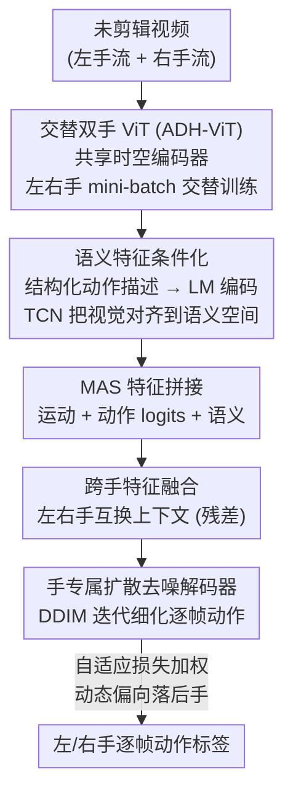

# Polyphony: Diffusion-based Dual-Hand Action Segmentation with Alternating Vision Transformer and Semantic Conditioning

**会议**: CVPR 2026  
**arXiv**: [2605.31115](https://arxiv.org/abs/2605.31115)  
**代码**: https://github.com/x-labs-xyz/Polyphony-Dual-hand-Action-Segmentation （有）  
**领域**: 视频理解 / 时序动作分割  
**关键词**: 双手动作分割、时序动作分割、扩散模型、交替训练、语义条件化

## 一句话总结
针对"从未剪辑视频里同时给左右手逐帧打动作标签"这一双手动作分割任务，本文提出三阶段方法 Polyphony——用交替训练的共享 ViT 解决主导手抢梯度、用结构化语义条件化消除细粒度动作歧义、用带跨手特征融合的扩散分割器建模双手协调，在 HA-ViD/ATTACH 双手数据集上最高提升 16.8 个点，并以 12× 更小的骨干网在单流 Breakfast 上反超 SOTA。

## 研究背景与动机

**领域现状**：时序动作分割（TAS）要给未剪辑长视频的每一帧打动作标签，是理解流程化活动（装配、烹饪、手术）的基础。主流路线从 MS-TCN 的时序卷积，到 ASFormer 的 Transformer 自注意力，再到最近 DiffAct 把分割建模成"条件去噪生成"。但这些方法几乎都把人类活动当成**单一动作流**来建模。

**现有痛点**：真实双手活动（bimanual）里两只手各自有一条动作流，且时刻在"协同 / 配合 / 独立"三种模式间切换，单流范式根本表达不了。已有的双手方法 DuHa、DuCAS 虽然针对装配场景，但都**强依赖真值物体检测框**作为输入，通用性差。

**核心矛盾**：把双手放进一个联合模型会撞上四个独有难题——① **复杂手间依赖**（两手时序关系多变）；② **视觉不对称**（同一动作在左右手上外观/运动模式不同）；③ **表征冲突**（联合模型里主导手会垄断梯度更新，非主导手特征学不好）；④ **语义歧义**（纯视觉特征分不清"screw nut onto bolt"和"screw nut onto shaft"这类视觉极相似、语义不同的细粒度动作）。

**本文目标**：用**一个统一模型、一个共享视觉骨干**同时预测左右手逐帧动作，且不依赖物体标注，并逐一拆解上面四个难题。

**切入角度**：作者借用"复调音乐（polyphony）"的隐喻——多条独立旋律同时和谐演奏，对应双手既要各自被理解、又要协同。共享编码器对应人类对双手活动的整体感知，扩散式迭代去噪对应人类"反复预测—修正"的渐进式动作理解。

**核心 idea**：把"防止主导手垄断梯度"（交替训练）+"补语义判别力"（语义条件化）+"建模手间协调"（跨手融合的扩散分割）三件事拆进三个可独立优化的阶段，组成一个端到端的双手分割管线。

## 方法详解

### 整体框架
Polyphony 把双手动作分割拆成**三个顺序训练的阶段**：**阶段 1（双手特征提取）** 用一个共享时空 ViT（ADH-ViT）配两个手专属分类头，从短视频片段里提取左右手特征，关键在于左右手 mini-batch **交替训练**以平衡梯度；**阶段 2（语义特征条件化）** 把每个动作类别解析成"动词-操作物-目标物-工具"的结构化描述，用语言模型编码成语义向量，再用 TCN 把视觉特征对齐到语义空间，最后把"运动特征 + 动作 logits + 语义特征"拼成 MAS 特征；**阶段 3（扩散式双手分割）** 用共享编码器处理 MAS 特征，经跨手特征融合交换两手信息，再由两个手专属去噪解码器以扩散方式迭代细化逐帧动作，训练时用自适应损失加权动态平衡两手。模块化设计让 ADH-ViT 可单独当动作识别模型用，整个管线也能退化到单流场景。

### 关键设计

**1. 交替双手 ViT（ADH-ViT）：用"轮流喂数据"治主导手垄断梯度**

针对表征冲突与视觉不对称：若把左右手数据混在一个 batch 里联合训练，梯度会被动作更丰富的主导手（右手）主导，非主导手（左手）特征欠训练。作者的做法是让两手**共享一个时空编码器** $\mathcal{E}_\phi$（VideoMAE V2 ViT-Base，输入用 tubelet 嵌入 + 正弦位置编码），但配两个独立线性分类头 $\hat{y}^h=\text{softmax}(\mathbf{W}_h e^h + b_h)$。训练时**每 $\Delta$ 步在左右手之间切换**：第 $j$ 步的活跃任务 $\tau(j)=\text{LH if }\lfloor j/\Delta\rfloor\bmod 2=0\text{, else RH}$，该步只从对应手的数据集采 mini-batch，且只用活跃手的头算交叉熵损失 $\mathcal{L}^{(j)}=\frac{1}{B}\sum_i \mathcal{L}_{CE}(\hat{y}_i^{\tau(j)}, y_i^{\tau(j)})$，但梯度同时更新共享骨干和活跃头。这样两手对共享骨干的梯度贡献被"轮流"地平衡，避免一只手长期压制另一只。消融证实交替训练让弱势的左手收益更大（识别 +2.5%、分割 +3.9%，远高于右手的 +1.0%/+0.3%），正好说明它对症下药地解决了梯度垄断。数据采样上还用了"分段采样 + 随机片段采样"互补（随机片段标签取中间帧类别），增强时序多样性。

**2. 结构化语义特征条件化：用"动词-物体-工具"分解补判别力**

针对语义歧义：纯视觉特征会把"视觉相似、语义不同"的细粒度动作混淆。作者把每个动作类别 $c$ 解析成结构化组合描述 $D_c=$"Action verb is $av_c$; manipulated object is $mo_c$; target object is $to_c$; tool is $tl_c$."（如"screw nut onto bolt"→动词 screw、操作物 nut、目标物 bolt、工具 null），再用预训练语言模型（MiniLM-L6）编码成语义向量 $e_c=\text{LM}(D_c)$。一个多层 TCN（带指数膨胀 $d_m=2^m$）以共享骨干特征为输入建模时序上下文，把输出投影到语义空间得到 $e_t^{h,\text{sem}}$，并用自适应对齐损失把它拉向真值类别的语义向量。关键细节：这些描述**只在训练时用作监督信号、推理时不用**，避免标签语义泄漏。消融显示结构化描述明显优于朴素描述，且在视觉相似但语义不同的细粒度动作上平均提升 3.6 个点。一个反直觉发现是小模型 MiniLM-L6（384 维）反而比 MPNet-base（768 维）更好——作者解释为语义表达力与视觉特征兼容性之间要平衡，高维语义会稀释视觉信息的贡献。

**3. 带跨手融合的扩散分割 + 自适应损失加权：建模手间协调并动态平衡两手**

针对复杂手间依赖：阶段 3 先用共享编码器 $\mathcal{E}_{seg}$（混合卷积-注意力层）处理 MAS 特征，得到初始 logits $Z^h$ 和分层特征 $H^h$。**跨手特征融合**让两手在手专属编码后交换信息：$H^{LH}=\mathcal{F}^{LH}([H^{LH};H^{RH}])+H^{LH}$（右手对称），其中 $\mathcal{F}^h$ 是两层 $1\times1$ 卷积带 ReLU，把拼接的 $2D'$ 维投回 $D'$ 维，残差连接保留手专属信息、又选择性吸收对侧上下文；且左右手用**独立**的融合网络，允许非对称信息流。分割本身沿用 DiffAct 的扩散范式：前向过程对真值动作分布（归一化到 $[-s_{de}, s_{de}]$）逐步加高斯噪声，手专属去噪解码器 $\mathcal{De}^h(\tilde{P}_k^h, k, \tilde{H}^h)$ 以时间步和融合特征为条件预测干净动作 $\hat{P}_0^h$，推理时用 5 步确定性 DDIM 迭代细化。**自适应损失加权**则解决两手训练进度不齐：维护近 $w$ 个 epoch 的验证准确率滑动窗口 $\bar{\mathcal{W}}^h$，当某手落后（性能比低于 $\Delta_{gap}$）时给它一个 boost 因子 $\beta^h=\min(\beta_{max}, \max(\beta_{min}, \bar{\mathcal{W}}^{\text{对侧}}/\bar{\mathcal{W}}^h))$，否则 $\beta^h=1.0$，总损失 $\mathcal{L}_{total}=\sum_h \beta^h(\lambda_{enc}^h \mathcal{L}_{enc}^h + \lambda_{dec}^h \mathcal{L}_{dec}^h)$ 自动给落后手加权。消融证实去掉融合或加权不仅掉点，还会让两手准确率差距扩大（从 3.5% 拉到 4.0%/4.3%），且总是非主导的左手掉得更多，印证了"没有手间建模和动态平衡，主导手就重新垄断"。

### 损失函数 / 训练策略
三阶段顺序训练。阶段 1 训 ADH-ViT 50 epoch，交替周期 $\Delta=50$ 步，AdamW + 余弦退火，lr 1e-3。阶段 2 训 TCN 100 epoch（lr 3e-4），对齐损失 $\mathcal{L}_{align}=\alpha\mathcal{L}_{cosine}+(1-\alpha)\mathcal{L}_{MSE}$（$\alpha=0.7$，余弦管方向、MSE 管幅度）。阶段 3 训 1000 epoch（Adam，lr 1e-3），扩散步数 $K=1000$、推理 DDIM 5 步；编码器损失 $\mathcal{L}_{enc}^h=\mathcal{L}_{CE}+\lambda_{sm}\mathcal{L}_{smooth}$、解码器损失再加边界 BCE 损失 $\lambda_{bd}\mathcal{L}_{boundary}$，其中 $\mathcal{L}_{smooth}(p_t)=\text{MSE}(\log p_{t+1},\log p_t)$ 强制时序平滑，$\lambda_{sm}=0.05$、$\lambda_{bd}=0.2$，自适应窗口 $w=5$、$\Delta_{gap}=0.95$、$[\beta_{min},\beta_{max}]=[1,2]$；交叉熵带按训练数据统计的手专属类别权重。

## 实验关键数据

### 主实验
HA-ViD（75 类/手）与 ATTACH（24 类/手）是双手数据集，Breakfast（48 类）是单流泛化测试。用 I3D 特征（与基线同输入）时已能领先，换上本文 MAS 特征后大幅提升。

| 数据集 | 指标（手） | 本文(MAS) | 之前SOTA | 提升 |
|--------|------|------|----------|------|
| HA-ViD | LH Acc | 57.1 | 45.1 (FACT) | +12.0 |
| HA-ViD | RH Acc | 60.6 | 43.8 (FACT) | +16.8 |
| ATTACH | LH Acc | 52.8 | 47.5 (DiffAct) | +5.3 |
| ATTACH | RH Acc | 47.3 | 42.5 (DiffAct) | +4.8 |
| Breakfast | Acc | 82.5 | 82.2 (EAST) | +0.3* |

\* Breakfast 上 EAST 用 ViT-Giant（1B+ 参数、1408 维），本文仅用 ViT-Base（86M 参数、768 维）即反超，说明增益来自架构设计与语义条件化而非堆模型规模。值得注意的是本文用**一个共享骨干的统一模型**就超过了那些"每只手训一个独立模型"的基线。

### 消融实验
在 HA-ViD 三视角平均上做渐进式组件消融（MF=运动特征、AF=动作 logits、SF=语义特征、FF=跨手融合、AW=自适应加权）：

| 配置 | LH Acc | RH Acc | 两手差距 | 说明 |
|------|---------|--------|---------|------|
| MF | 56.0 | 58.0 | 2.0 | 共享 ViT 运动特征基线 |
| MF+AF | 55.8 | 58.3 | 2.5 | 加动作 logits，主要提分段级 Edit |
| MF+AF+SF（完整） | 57.1 | 60.6 | 3.5 | 加语义特征，RH 提升更明显(+2.3) |
| 完整 w/o FF | 55.5 | 59.5 | 4.0 | 去跨手融合，差距扩大、LH 掉更多 |
| 完整 w/o FF & AW | 55.3 | 59.6 | 4.3 | 再去自适应加权，差距进一步扩大 |

### 关键发现
- **语义特征对主导手（右手）增益更大**（RH Acc +2.3 vs LH 微变）：右手做更多样的细粒度操作，更受益于语义 grounding。
- **跨手融合 + 自适应加权不仅提分，更是"平衡器"**：去掉它们后两手准确率差距从 3.5% 一路拉到 4.0%、4.3%，且总是非主导的左手掉得更多——印证没有手间建模和动态平衡，主导手就会重新垄断梯度。
- **交替训练专治梯度垄断**：联合训练始终偏向右手，交替训练不仅整体提升还**反转**了这种不平衡，弱势左手收益最大（识别 +2.5%、分割 +3.9%）。
- **随机片段采样很关键**：ADH-ViT(both) 比只用分段采样的 (seg) 在 Top-1 上左右手分别高 13.1、15.2 个点。
- **小语言模型反而更好**：MiniLM-L6（384 维、22M）优于 MPNet-base（768 维、110M），高维语义会稀释视觉信息贡献。

## 亮点与洞察
- **"交替训练"是个低成本却对症的 trick**：不改架构、不加参数，只靠"每 $\Delta$ 步轮流喂左右手数据 + 只更新活跃头"就缓解了多任务里强任务垄断梯度的老问题，这个思路可迁移到任何"一个共享骨干服务多个不对称子任务"的场景（如多模态里强模态压制弱模态）。
- **语义只在训练时用、推理时丢**：把结构化"动词-物体-工具"描述当作训练期的对齐监督而非推理输入，既补了判别力又避免标签语义泄漏，是一种干净的"语义蒸馏进视觉特征"做法。
- **自适应损失加权用验证准确率滑动窗口反馈**：直接以两手近期验证表现之比当 boost 因子动态偏向落后手，比固定权重更贴合训练动态，且天然带上下界防止震荡。
- **跨手融合用独立的左右网络**：允许非对称信息流（左手吸收右手上下文的方式 ≠ 右手吸收左手），比对称共享更符合双手不对称的本质。

## 局限与展望
- **三阶段顺序训练，非端到端**：三个阶段分别训 50/100/1000 epoch，pipeline 较重、调参面大，误差可能逐阶段累积，作者也未报告端到端联合训练的效果。
- **扩散分割训练成本高**：$K=1000$ 扩散步、1000 epoch，训练开销不小（推理靠 5 步 DDIM 缓解，但训练侧仍重）。
- **仅限双手、动作类别需可结构化解析**：语义条件化依赖能把标签拆成"动词-物体-工具"，对无法结构化的动作标签或非装配/烹饪类活动是否成立未验证；单流场景靠"复制输入"适配，略显勉强。
- **单流 Breakfast 上提升边际**（82.5 vs 82.2）：在非双手场景优势主要体现在参数效率而非绝对精度，方法的核心价值仍集中在双手任务。

## 相关工作与启发
- **vs DiffAct**：DiffAct 首次把单流 TAS 建模成扩散去噪。本文继承其前向加噪/去噪范式，但把它扩展到双手——加了跨手特征融合建模手间协调、手专属解码器、自适应损失加权，在 ATTACH 上 LH/RH 各超 DiffAct 5.3/4.8 个点。
- **vs FACT**：FACT 用从帧标签解析的视频转录构造动作级 token、靠交叉注意力增强逐帧预测，但只用简单动作标签、语义不够细。本文用结构化组合描述补语义判别力，HA-ViD 上 RH 超 FACT 达 16.8 个点。
- **vs DuHa / DuCAS**：同为双手装配分割，但它们**强依赖真值物体框**作为输入。本文无需物体标注、用统一模型同时预测两手，通用性更强。
- **vs EAST**：EAST 靠 ViT-Giant（1B+ 参数）刷 Breakfast。本文用 86M 的 ViT-Base + 语义条件化即反超（82.5 vs 82.2），证明增益来自设计而非规模。

## 评分
- 新颖性: ⭐⭐⭐⭐ 把"交替训练治梯度垄断 + 结构化语义条件化 + 跨手扩散融合"组合成首个无需物体标注的统一双手分割框架，每个组件都对症某个具体难题。
- 实验充分度: ⭐⭐⭐⭐⭐ 三数据集（双手 + 单流）、渐进式组件消融、训练策略/语言模型/采样策略多维分析，且报告了两手差距这一平衡性指标。
- 写作质量: ⭐⭐⭐⭐ "复调音乐"隐喻贯穿、四难题对四设计的对应清晰，公式与动机交代到位。
- 价值: ⭐⭐⭐⭐ 双手动作分割对装配/手术/烹饪等具身与操作场景有直接价值，统一模型 + 无物体标注的设定实用性强。

<!-- RELATED:START -->

## 相关论文

- [\[CVPR 2026\] Bootstrapping Video Semantic Segmentation Model via Distillation-assisted Test-Time Adaptation](bootstrapping_video_semantic_segmentation_model_via_distillation-assisted_test-t.md)
- [\[CVPR 2026\] Spectral Scalpel: Amplifying Adjacent Action Discrepancy via Frequency-Selective Filtering for Skeleton-Based Action Segmentation](spectral_scalpel_amplifying_adjacent_action_discrepancy_via_frequency-selective_.md)
- [\[CVPR 2026\] Prototypical Action Reasoning Facilitated by Vision-Language Alignment for Egocentric Action Anticipation](prototypical_action_reasoning_facilitated_by_vision-language_alignment_for_egoce.md)
- [\[CVPR 2026\] Robust Promptable Video Object Segmentation](robust_promptable_video_object_segmentation.md)
- [\[CVPR 2026\] Scene-Centric Unsupervised Video Panoptic Segmentation](scene-centric_unsupervised_video_panoptic_segmentation.md)

<!-- RELATED:END -->
