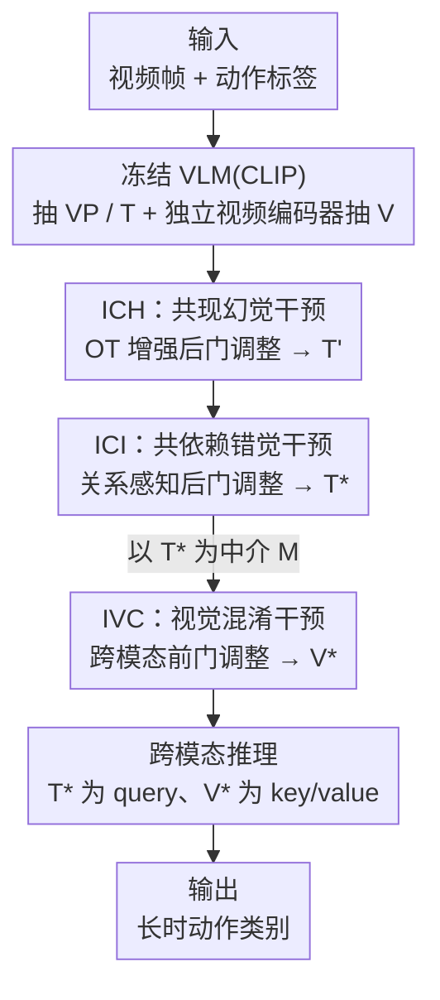

# Progressive Cross-Modal Causal Intervention for Long-Term Action Recognition

**会议**: CVPR 2026  
**论文**: [CVF Open Access](https://openaccess.thecvf.com/content/CVPR2026/html/Xu_Progressive_Cross-Modal_Causal_Intervention_for_Long-Term_Action_Recognition_CVPR_2026_paper.html)  
**代码**: https://github.com/xushaowu/PCMCI  
**领域**: 视频理解  
**关键词**: 长时动作识别、因果干预、视觉语言模型、最优传输、前门/后门调整

## 一句话总结
PCMCI 把长时动作识别中视觉语言模型(VLM)依赖的三种"伪相关"——共现幻觉、共依赖错觉、视觉混淆因子——拆成一条三段式因果干预流水线（OT 增强后门调整 → 关系感知后门调整 → 跨模态前门调整），逐级去混淆得到稳健的文本/视频表征，在 Breakfast / COIN / Charades 上 mAP 大幅刷新 SOTA（Breakfast mAP 76.32→90.51）。

## 研究背景与动机
**领域现状**：长时动作(long-term action)由一连串原子动作(atomic action)组成，时长往往数分钟。当前主流做法是借 CLIP 这类 VLM，用动作标签文本去监督视频特征——标签简洁且语义完整，理论上能帮模型对抗背景、着装等视觉混淆因子。

**现有痛点**：作者指出 VLM 学的是统计相关而非因果机制，由此暴露三个隐患。其一**共现幻觉(co-occurrence hallucination)**：与动作频繁共现但因果无关的物体（如厨师的围裙）被错绑进文本-视频匹配——论文给的反例很犀利：把真正的因果区域（炉灶）遮住、只留围裙，"炒蛋"的匹配分反而升高，说明识别靠的是混淆物而非因果因子。其二**共依赖错觉(codependency illusion)**：现有 VLM 方法孤立地处理每个标签文本，无法建模原子动作之间的关系——而"打蛋""涂黄油"这种共享动作单看判别力很弱，但其先后顺序(在"炒蛋"里 vs 在"煎饼"里相反)才是关键线索。其三**视觉混淆因子(visual confounder)**：背景、着装、个人习惯贯穿整段长视频，当文本嵌入被前两种错误污染后，监督力下降，更易被视觉混淆带偏。

**核心矛盾**：这三类问题在结构因果模型(SCM)里对应三条不同的**后门路径**——共现幻觉 $H$ 同时污染文本 $T$ 和视频 $V$、共依赖错觉 $I$ 污染 $T$、视觉混淆 $C$ 污染 $V$。已有因果方法要么只管跨模态混淆、忽略文本侧的共依赖错觉，要么反过来，没有一个框架同时切断三条路径。

**核心 idea**：用一条**渐进式(progressive)**因果干预流水线，按"先跨模态、再文本侧、最后视觉侧"的顺序依次切断三条后门，前一阶段去混淆后的文本嵌入恰好满足后一阶段做前门调整所需的 d-分离条件，从而把不可观测的混淆因子逐级"代理化"并消除。

## 方法详解

### 整体框架
PCMCI 先为 VLM-based LTAR 建立一个 SCM：理想情况下 $Y \leftarrow T \rightarrow V \rightarrow Y$（去混淆的文本是动作本质特征、决定标签），但实际编码器引入了 $H$、$I$、$C$ 三个混淆因子各自的后门路径。整套方法就是把这个含混淆的 SCM(Fig.3a)，经三次干预逐步演化成纯净的去混淆 SCM(Fig.3e)。

输入是视频帧 + 动作标签集合；CLIP 作为冻结 VLM 抽出视觉提示 $VP$ 和文本特征 $T$，外加一个 VLM-independent 视频编码器(TimeSformer)直接从原始视频抽 $V$。然后串行经过三个干预阶段——ICH 把 $T$ 精炼成 $T'$、ICI 把 $T'$ 精炼成去混淆文本 $T^*$、IVC 借 $T^*$ 当中介(mediator)把 $V$ 精炼成去混淆视频 $V^*$——最后跨模态推理模块以 $T^*$ 为 query、$V^*$ 为 key/value 做注意力，输出动作类别。三个阶段的顺序不可乱：前门调整(IVC)依赖中介与视觉混淆 $C$ 的 d-分离，而这要求文本必须先被 ICH、ICI 清洗干净，所以 IVC 必须压到最后。

### 关键设计

**1. ICH — OT 增强后门调整：先掐断共现幻觉这条跨模态后门**

共现幻觉 $H$ 是从预训练 VLM 里带出来的跨模态混淆，它同时在 $H\rightarrow V$ 和 $H\rightarrow T$ 上开后门。ICH 双管齐下：一方面引入一个**与 VLM 无关的视频编码器**直接从原始输入抽 $V$，物理上切断 $H\rightarrow V$；另一方面对 $T$ 做后门调整切断 $H\rightarrow T$，其干预分布为 $P(Y\mid V, do(T)) \approx \sum_{h\in H} P(Y\mid V, do(T), h)P(h)$。难点在于 $H$ 不可观测。作者的巧思是用**最优传输(OT)** 把它代理出来：先算视觉提示 $VP\in\mathbb{R}^{L\times D}$ 与文本 $T\in\mathbb{R}^{N\times D}$ 的跨模态相似度矩阵 $S=\langle T, VP\rangle$，再解一个带熵正则的 OT 计划

$$P^* = \arg\min_{P\in U}\ \langle P, -\log S\rangle + \lambda H(P),$$

OT 最小化传输代价后，那些"过度对齐"的跨模态特征就暴露出来，正是共现幻觉的代理 $H = S\,VP\in\mathbb{R}^{N\times D}$。最后用一个可学习权重 $W_H\in\mathbb{R}^{2D\times D}$ 编码 $H$ 的影响，并以归一化加权几何平均(NWGM)近似去混淆预测：$P(Y\mid V, do(T)) \approx P(Y\mid V, [T, H]W_H) = P(Y\mid V, T')$，得到后门调整后的文本 $T'$。用 OT 而非简单相似度阈值，好处是它从分布匹配角度找"不成比例对齐"的特征，比手工挑共现物更可靠。

**2. ICI — 关系感知后门调整：补上 VLM 缺失的动作间关系，消除共依赖错觉**

共依赖错觉 $I$ 来自 VLM 训练时把标签文本孤立处理、没编码原子动作之间的关系，在 $T\leftarrow I\rightarrow Y$ 上开后门。ICI 接在 ICH 之后，把 $T'$ 进一步精炼成去混淆的 $T^*$，干预分布 $P(Y\mid V, do(T)) \approx \sum_{i\in I} P(Y\mid V, do(T'), i)P(i)$。核心是一个**关系感知变换** $R:\mathbb{R}^{N\times D}\to\mathbb{R}^{N\times D}$，把文本投到一个潜在关系空间，用 $K$ 个关系基函数显式建模动作间的多重共依赖：

$$R(T') = \Big(\bigodot_{k=1}^{K} G_k(T';\Theta_k)\Big) W_R,$$

其中 $G_k:\mathbb{R}^{N\times D}\to\mathbb{R}^{N\times D_R}$ 是第 $k$ 个关系基函数（每关系维度 $D_R=D/K$），通过注意文本特征间的成对交互来捕捉一种独立的潜在关系，$\bigodot$ 是 $K$ 路关系投影的聚合，$W_R\in\mathbb{R}^{KD_R\times D}$ 为可学习变换矩阵。这 $K$ 个关系基集合起来当作 $I$ 的代理。最后同样用 NWGM 近似：$P(Y\mid V, do(T)) \approx P(Y\mid V, [T', R(T')]W_I) = P(Y\mid V, T^*)$，$W_I\in\mathbb{R}^{2N\times N}$。这样"打蛋""涂黄油"等共享动作的顺序/搭配关系就被显式编码进 $T^*$，模型不再把无关动作误绑在一起。实验中 $K=8$ 个关系效果最佳。

**3. IVC — 跨模态前门调整：用清洗后的文本当中介，隔离视觉混淆因子**

视觉混淆 $C$（着装、背景、个人习惯）粒度跨度大、难以在视觉表征里定位，所以 ICH/ICI 用的后门调整对它失效。IVC 改用**前门调整**：找一个中介 $M$，要求它既与 $C$ d-分离(能挡住后门)、又对 $Y$ 有直接因果效应。前两阶段去混淆得到的 $T^*$ 恰好满足——它已脱离 $H$、$I$，捕捉了独立于 $C$ 的动作语义本质，且作为动作文本的语义核心直接决定 $Y$。于是令 $M=T^*$，跨模态前门干预分布为

$$P(Y\mid do(V), T) = \sum_{m\in T^*}\sum_{v'\in V'} P(Y\mid m, v', T)\,P(m\mid V)\,P(v').$$

其中视觉强化特征 $V'$ 由一个条件变换算子 $\mathcal{T}$ 生成：$V' = \mathcal{T}(V, M;\Theta_M) = \sigma\big(\mathcal{A}(M, \mathcal{F}(V);\Theta_M)\big)\,\mathcal{F}(V)$，$\mathcal{F}$ 是与 ICI 里 $R(\cdot)$ 同构的层次关系编码器(在视觉侧也建模原子动作间共依赖)，对齐函数 $\mathcal{A}$ 量化视觉特征与中介 $M$ 的相关性、$\sigma$ 归一化后重新加权。关键在于 $\mathcal{F}$ 让视觉侧的关系结构与文本侧对齐，使 $V'$ 条件独立于 $C$，满足有效前门调整的条件。最后 NWGM 近似得 $P(Y\mid do(V), T) \approx P(Y\mid [M, V']W_C, T) = P(Y\mid V^*, T)$，$W_C\in\mathbb{R}^{2N\times N}$，输出去混淆视频嵌入 $V^*$。

### 损失函数 / 训练策略
去混淆得到 $V^*$、$T^*$ 后，跨模态推理算子 $\mathcal{I}$ 以 $T^*$ 为 query、$V^*$ 为 key/value 做注意力，再用分组线性映射投到类别空间，训练用交叉熵形式的推理损失：

$$\mathcal{L} = -\sum_{y\in Y}\mathbb{1}_{\{Y=y\}}\log\big(\mathcal{I}(V^*, T^*;\Theta_\mathcal{I})_y\big).$$

VLM(CLIP)主干冻结，仅训独立视频编码器(TimeSformer)与三个干预模块；Adam(lr=1e-5)、cosine 衰减、100 epoch，单卡 RTX 4090D。

## 实验关键数据

### 主实验
Breakfast / COIN 上与 SOTA 对比（Acc / mAP，单位 %），同时报告推理成本：

| 数据集 | 方法 | Acc | mAP | FLOPs(G) | Params(M) |
|--------|------|-----|-----|----------|-----------|
| Breakfast | HierarQ (CVPR'25) | 97.18 | 76.32 | 37877 | 7881 |
| Breakfast | MA-LMM (CVPR'24) | 93.00 | 71.84 | 29063 | 7526 |
| Breakfast | **PCMCI (Ours)** | **97.46** | **90.51** | **650** | **211** |
| COIN | HierarQ (CVPR'25) | **94.78** | 70.10 | 37877 | 7881 |
| COIN | **PCMCI (Ours)** | 94.53 | **86.54** | **650** | **211** |

mAP 的提升尤其夸张：Breakfast 76.32→90.51（+14.2）、COIN 70.10→86.54（+16.4），且因为不需要 LLM 做生成，参数量(211M)和 FLOPs(650G)比 MA-LMM/HierarQ 小一两个数量级。Charades(只报 mAP，时序重叠更难)上 PCMCI 在不用预裁剪视频训练的方法里达 53.3，超过若干用预裁剪监督的 VLM 方法。

### 消融实验
三个干预阶段的组合消融(Breakfast / COIN)：

| 配置 | ICH | ICI | IVC | Breakfast Acc | Breakfast mAP | COIN Acc | COIN mAP |
|------|-----|-----|-----|------|------|------|------|
| Variant 1 | ✗ | ✗ | ✗ | 91.55 | 80.23 | 87.77 | 76.93 |
| Variant 2 | ✓ | ✗ | ✗ | 94.93 | 84.17 | 92.56 | 80.38 |
| Variant 3 | ✗ | ✓ | ✗ | 93.80 | 83.64 | 91.74 | 79.91 |
| Variant 4 | ✓ | ✓ | ✗ | 95.77 | 85.59 | 93.60 | 82.25 |
| Variant 5 | ✗ | ✗ | ✓ | 93.24 | 88.31 | 90.38 | 84.13 |
| **PCMCI** | ✓ | ✓ | ✓ | **97.46** | **90.51** | **94.53** | **86.54** |

干预顺序消融(Breakfast)：

| 顺序 | Acc | mAP |
|------|-----|-----|
| IVC→ICH→ICI | 92.96 | 81.76 |
| IVC→ICI→ICH | 92.39 | 80.94 |
| ICI→IVC→ICH | 94.08 | 83.13 |
| ICI→ICH→IVC | 95.49 | 87.43 |
| ICH→IVC→ICI | 96.34 | 89.72 |
| **ICH→ICI→IVC (PCMCI)** | **97.46** | **90.51** |

### 关键发现
- **ICH 比 ICI 更关键**：Variant 2(只 ICH) 始终强于 Variant 3(只 ICI)，说明跨模态共现幻觉对精度的影响比文本共依赖建模更大。
- **Acc 与 mAP 的分工**：Variant 2-4 的 Acc 更高但 mAP 低于 Variant 5——Acc 衡量整体动作理解(去文本混淆能提精度)，mAP 衡量动作间关系(视觉混淆引起时空混淆，靠 IVC 缓解)，唯有三者全开才同时最优。
- **顺序不可乱**：IVC 放最前(Order 1/2)大幅掉点，因为前门调整严格依赖中介与 $C$ 的 d-分离，必须先用 ICH、ICI 把文本清干净。
- **中介选 $T^*$ 最优**(Tab.5)：用去混淆文本当中介比用视觉记忆库/多尺度注意力(纯视觉)更好，且 PCMCI 在视觉侧也做关系建模、与文本侧结构对齐，比单纯对齐(Setup 3)再高一截。
- **关系数 $K=8$ 最佳**(Fig.5)；换更强主干 BLIP/BLIP2 可继续涨点(Breakfast mAP 90.51→91.43)但 FLOPs 显著上升。

## 亮点与洞察
- **把"哪里出错"翻译成 SCM 的三条后门**：作者没有泛泛说"VLM 有偏差"，而是精确把共现幻觉 / 共依赖错觉 / 视觉混淆映射成 $H$、$I$、$C$ 三条结构不同的后门路径，这让"该用后门还是前门调整""谁先谁后"都有了原理依据，而非拍脑袋堆模块。
- **用 OT 代理不可观测的混淆因子**：后门调整的老大难是混淆因子不可观测，用 OT 计划把"过度对齐的跨模态特征"识别为共现幻觉代理，是一个可迁移到其他跨模态去偏任务的 trick。
- **渐进顺序本身就是约束满足**：把 IVC 压到最后不是经验调参，而是前门调整的 d-分离条件强制要求的——前两步清洗文本顺带为第三步制造了合法中介，顺序消融完美佐证了这个因果逻辑。
- **轻量却高效**：不靠 LLM 生成，参数量比 MA-LMM/HierarQ 小约 35 倍，mAP 反而大涨，说明长时动作识别的瓶颈更多在"去伪相关"而非"堆大模型"。

## 局限与展望
- 作者承认 SCM 无法穷举所有潜在混淆因子，只能消除主要来源；前门调整的有效性高度依赖中介 $T^*$ 的质量，若前两阶段清洗不彻底会连累 IVC。
- ⚠️ 关系基函数 $G_k$ 的具体形式、聚合算子 $\bigodot$ 的实现原文描述较抽象（"建模成对特征交互"），细节需看代码确认；$K=8$ 的最优值可能与数据集相关，跨域是否稳定未充分验证。
- 换更强主干能涨点但计算成本同步上升，作者把"主干与干预模块协同优化、平衡表征力与效率"列为未来方向。
- 三个数据集均为日常/烹饪类活动，对更开放域、更长(数小时级)或多人交互场景的泛化性未验证。

## 相关工作与启发
- **vs 显式交互(BIKE / Text4Vis)**: 它们用 VLM 文本监督增强视觉表征，能缓解视觉混淆但不建模动作间动态，对共现幻觉和共依赖错觉无招架之力；PCMCI 用因果干预同时切三条后门，mAP 大幅领先(Breakfast 60→90)。
- **vs 隐式交互(MA-LMM / HierarQ)**: 它们把 VLM 视觉 token 喂给 LLM 在共享空间建模动作关系，解决了共依赖错觉但对视觉混淆更敏感，且需 LLM、参数量巨大；PCMCI 不用 LLM、参数小 35 倍，三类混淆一起治。
- **vs 视频因果方法(CMCIR 等)**: 现有因果方法要么只建模跨模态混淆、忽略文本侧共依赖错觉，要么反之；PCMCI 的多阶段渐进干预把跨模态与模态内混淆都覆盖，是它相对单点因果方法的核心差异。

## 评分
- 新颖性: ⭐⭐⭐⭐⭐ 把 LTAR 的三类伪相关精确建模成 SCM 三条后门并设计对应的渐进干预流水线，OT 代理混淆因子的思路有迁移价值。
- 实验充分度: ⭐⭐⭐⭐⭐ 三数据集 + 阶段消融 + 顺序消融 + 中介设置 + 关系数 + 主干 + 可视化，证据链完整。
- 写作质量: ⭐⭐⭐⭐ 因果推导与模块对应清晰，但关系基函数等部分实现细节偏抽象、需看代码。
- 价值: ⭐⭐⭐⭐⭐ 轻量却把 mAP 刷出十几个点，对去伪相关而非堆模型的方向有启发。

<!-- RELATED:START -->

## 相关论文

- [\[CVPR 2026\] SVAgent: Storyline-Guided Long Video Understanding via Cross-Modal Multi-Agent Collaboration](svagent_storyline_guided_long_video_understanding_via_cross_modal_multi_agent_collaboration.md)
- [\[CVPR 2026\] Fine-VAD: Towards Fine-Grained Video Anomaly Detection via Progressive Cross-Granularity Learning](fine-vad_towards_fine-grained_video_anomaly_detection_via_progressive_cross-gran.md)
- [\[CVPR 2025\] Cross-modal Causal Relation Alignment for Video Question Grounding](../../CVPR2025/video_understanding/cross-modal_causal_relation_alignment_for_video_question_grounding.md)
- [\[CVPR 2026\] Streaming Video Crime Anticipation with Spatio-Temporal Causal Reasoning](streaming_video_crime_anticipation_with_spatio-temporal_causal_reasoning.md)
- [\[CVPR 2026\] Understanding Temporal Logic Consistency in Video-Language Models through Cross-Modal Attention Discriminability](understanding_temporal_logic_consistency_in_video-language_models_through_cross-.md)

<!-- RELATED:END -->
