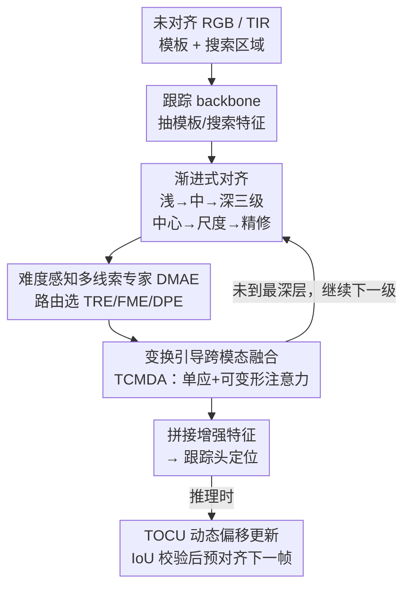

# Progressive Multi-cue Alignment for Unaligned RGBT Tracking

**会议**: CVPR 2026  
**论文**: [CVF Open Access](https://openaccess.thecvf.com/content/CVPR2026/html/Jin_Progressive_Multi-cue_Alignment_for_Unaligned_RGBT_Tracking_CVPR_2026_paper.html)  
**代码**: https://github.com/NOP1224/Unaligned_RGBT_Tracking  
**领域**: 视频理解  
**关键词**: RGBT 跟踪, 跨模态对齐, 渐进式估计, 难度感知专家, 可变形注意力

## 一句话总结
PMATrack 把"未对齐 RGBT 跟踪"里一次性回归的跨模态对齐参数拆成"中心偏移 → 尺度变换 → 全局精修"三级渐进估计，并在每一级用难度感知路由从三种对齐线索专家里挑最划算的那个，在新建的 MUART244 等基准上以更低算力刷新 SOTA。

## 研究背景与动机
**领域现状**：RGBT 跟踪靠 RGB 与热红外（TIR）两路互补信息做鲁棒目标定位，但主流数据集（LasHeR 等）都经过昂贵的人工对齐，因此现有跟踪器几乎都默认"两模态像素级完美对齐"。

**现有痛点**：真实多传感器系统里，由于安装偏移和视场差异，原始 RGB/TIR 帧存在显著空间错位；而且随着目标或相机运动，跨模态对应关系是动态变化的，一个固定的变换矩阵补偿不了。已有的未对齐跟踪方法（如 NAT 用时序迭代单应估计、Zhang 等用可变形卷积预测偏移场）共同有两个毛病：一是**所有对齐参数（平移、尺度）一次性同时回归**，没法适配跟踪过程中时高时低的错位难度；二是**静态对齐架构为了 cover 难场景往往堆大模型**，简单帧也按最贵的算，算力浪费严重、难以满足跟踪实时性。

**核心矛盾**：把强耦合的多个对齐参数塞进单个单应矩阵一把回归，既难学准又难按场景难度伸缩算力——精度与效率被锁死在一起。

**本文目标**：(1) 把跨模态对齐参数解耦成可分步估计的几项；(2) 让模型按当前帧的错位难度动态决定花多少算力。

**切入角度**：作者借鉴人类跨模态感知"先粗定位、再调尺度、最后抠细节"的分层对齐机制——浅层几何线索管全局位移，中层几何+语义管尺度，深层高级语义补残差。

**核心 idea**：用"分而治之的渐进对齐 + 难度感知的多线索专家选择"代替"一次性大模型回归单应矩阵"，同时拿到更准的对齐和更省的算力。

## 方法详解

### 整体框架
PMATrack 接收一对**未经对齐**的 RGB/TIR 模板与搜索区域，输出目标在搜索区域的定位框。它的核心是把跨模态对齐拆成三个**顺序**子任务——中心对齐（center）、尺度变换（scale）、全局精修（refine），让它们沿着跟踪 backbone 的浅→中→深层逐级估计，而不是在某一层把耦合参数一次性回归出来。

具体流转：backbone（基于 OSTrack/DropMAE 初始化）先抽出模板与搜索特征；在浅层用难度感知多线索专家（DMAE）预测中心偏移 $P_{center}=[dx,dy]$，预测出的偏移随即通过 TCMDA 引导双向跨模态融合，再把特征送往更深层；中层估计尺度变换并精修中心偏移 $P_{scale}=[\Delta dx,\Delta dy,s_x,s_y]$，深层估计全局残差 $P_{refine}$，每一级后面都接一次 TCMDA 融合。最后把增强后的多模态特征拼接送进跟踪头定位目标。推理时还维护一个动态单应矩阵做帧间预对齐（TOCU），防止偏移过大导致搜索区域丢目标。

### 关键设计

**1. 跨模态渐进式对齐：把单应矩阵拆成浅中深三级估计**

针对"所有对齐参数一次性同时回归、难以适配不同错位难度"的痛点，PMATrack 把跨模态对齐显式分解为中心偏移、尺度变换、残差精修三段，并把它们分别放到网络的浅层、中层、深层去估计，做 coarse-to-fine 的修正。理由是不同层的特征天然适配不同的对齐子任务：浅层特征保留几何信息，能靠模态间像素级相关性准确预测中心偏移；中层特征聚合了全局上下文，适合估计尺度变化并回头精修中心偏移；深层高级语义则用来全局补偿因遮挡、模态差异留下的残差错位。每一级用专家 $E(\cdot)$ 预测 $P_k=E([Z^V_i,X^V_i],[Z^I_i,X^I_i]),\ k\in\{center,scale,refine\}$，其中 refine 与 scale 级预测的是 $\Delta$ 残差量。这样从"几何驱动校正"平滑过渡到"上下文引导精修"，避免了直接回归耦合参数的单应矩阵，对齐更稳更准。

**2. 难度感知多线索对齐专家（DMAE）：按场景难度选最划算的对齐线索**

针对"静态大模型对简单帧也满负荷算、算力冗余"的痛点，DMAE 在每个对齐级里并置三个互补线索专家，再用路由按难度挑一个：
- **目标响应专家（TRE）**：算模态特定的目标响应图 $R^M=\phi((Z^MW^M)\cdot(X^MW^M)^T)$，并引入最优传输建模跨模态显著图的整体偏移结构——构造代价矩阵 $C_{ij}=\|p_i-p_j\|_2^2$，解 $T^\*=\arg\min_{T\geq0,\,T\mathbf{1}=a,\,T^\top\mathbf{1}=b}\langle T,C\rangle$，把传输矩阵送偏移头得 $P_t$，最便宜，适合简单帧粗定位。
- **特征匹配专家（FME）**：当目标被遮挡或受相似物干扰、TRE 响应结构退化时启用，对搜索特征做频率分解 $X^M_l=A^k_l(X^M),\ X^M_h=X^M-A^k_h(X^M)$，分别算高低频跨模态相关再门控融合，经金字塔相关头得精修偏移 $P_c$。
- **细节感知专家（DPE）**：模态质量低、结构信息匮乏时，用 Tiny U-Net 抽多尺度细粒度信息得偏移 $P_d$，最贵但最强。

路由 $R(\cdot)$ 产出选择概率 $r_e=R([X^V;X^I])$，最终偏移 $P=\sum_e r_e P_e,\ e\in\{t,c,d\}$。为了不让模型一味选最强最贵的专家，作者设计**代价惩罚专家选择损失（CPESL）**：$L_{CPESL}=\sum_e r_e\ell_e+\lambda_{cost}\sum_e r_e c_e$，其中 $\ell_e$ 是偏移回归误差、$c_e$ 是该专家算力开销、$\lambda_{cost}=0.01$ 控制效率-精度权衡——这才是"难度感知"真正落地的地方：简单帧路由偏向便宜的 TRE，难帧才舍得调 DPE。

**3. 变换引导跨模态可变形融合（TCMDA）：用对齐结果去引导融合，而不是融合时硬对齐**

针对"未对齐时直接做特征融合会引入噪声、而融合中做对齐又会反向引噪"的痛点，TCMDA 在每个对齐级之后，把预测偏移转成 $3\times3$ 单应矩阵 $H$，生成初始采样网格 $p_t$；每个目标点经 $p_s=H_{t\to s}p_t$ 投到源模态，坐标差 $\Delta H=p_s-p_t$ 作为采样的几何先验。再从 query 特征用小 MLP 学局部偏移与注意力权重，合成最终采样位置 $G_{h,k}=p_t+\Delta H_h+\Delta L_{h,k}$，在 $G_{h,k}$ 处采样源特征并按注意力聚合 $\hat v_h=\sum_k A_{h,k}S(G_{h,k})$，多头拼接后残差加回源模态。它把"几何先验（来自对齐）+ 可学习局部偏移"结合起来，做的是**对齐引导的跨模态融合**，在严重错位下也能有效互补、减少空间错位带来的信息损失。

### 损失函数 / 训练策略
两阶段训练：第一阶段按 OSTrack 的 $L_{track}$ 训跟踪 backbone；第二阶段冻住 backbone，只训对齐网络与 TCMDA。每个专家每级用 smooth L1 监督偏移 $L_p=L_1(P,\Delta_{gt})$（$\Delta_{gt}$ 为两模态真值相对位移）；TRE 额外用目标掩码做 BCE 监督响应图 $L_r=BCE(\sigma(R^M),M_t)$。总损失 $L_{total}=L_{track}+\lambda_p L_p+\lambda_r L_r+L_{CPESL}$，$\lambda_p=20.0$、$\lambda_r=1.0$。推理时用 **TOCU（模板-偏移对比更新）**：把历史偏移 $H_{off}$ 与当前预测偏移组合成在线偏移 $H_{on}$，各采一个模板 $T_{off}/T_{on}$，在初始帧搜索区域上比 IoU——$T_{on}$ 的 IoU 更高才认为当前偏移可靠并更新单应矩阵，否则保留旧估计，从而稳定地维护动态对齐、避免偏移突变丢目标。单 RTX 4090 训练，AdamW、batch 16、lr 1e-4，两阶段各 20/30 epoch。

## 实验关键数据

在 LasHeR-Unaligned 与自建 MUART244 两个未对齐数据集上对比 11 个 SOTA 跟踪器，指标为 PR / NPR / SR（OPE 协议）。

### 主实验

LasHeR-Unaligned（PR/NPR/SR↑，FPS）：

| Tracker | 发表 | PR | NPR | SR | FPS |
|---------|------|----|----|----|-----|
| OSTrack | ECCV22 | 59.2 | 53.8 | 46.7 | 44.4 |
| TBSI | CVPR23 | 60.3 | 55.2 | 47.7 | 36.2 |
| CAFormer | AAAI25 | 59.0 | 53.8 | 46.7 | 86.3 |
| AINet（前 SOTA） | AAAI25 | 61.4 | 55.7 | 48.3 | 38.1 |
| NAT（对齐法） | CISE24 | 58.1 | 52.3 | 44.8 | 19 |
| **PMATrack** | - | **64.4** | **58.7** | **50.6** | 28.0 |

MUART244（错位更大的新基准，PR/NPR/SR↑）：

| Tracker | 发表 | PR | NPR | SR |
|---------|------|----|----|----|
| UnTrack | CVPR24 | 54.1 | 47.9 | 39.9 |
| SUTrack | AAAI25 | 49.5 | 40.9 | 33.5 |
| AINet | AAAI25 | 57.3 | 50.4 | 41.1 |
| **PMATrack** | - | **62.7** | **55.9** | **45.8** |

相比前 SOTA AINet，LasHeR-Unaligned 上 PR/NPR/SR 各 +3.0/+3.0/+2.3；相比同样做空间对齐的 NAT，+6.3/+6.4/+5.8。在大偏移的 MUART244 上优势更大：超 SUTrack +13.2/+15.0/+12.3，超 UnTrack +8.6/+8.0/+5.9。

### 消融实验

逐组件分析（LasHeR-UA 与 MUART244 各 PR/NPR/SR + FLOPs）：

| 配置 | LasHeR PR/NPR/SR | MUART244 PR/NPR/SR | FLOPs(G) |
|------|------------------|--------------------|----------|
| Baseline | 61.5 / 56.4 / 48.5 | 58.7 / 51.1 / 42.1 | 56.4 |
| +TRE | 61.9 / 56.4 / 48.8 | 59.3 / 51.6 / 42.5 | 60.6 |
| +FME | 62.5 / 56.9 / 49.0 | 59.9 / 53.1 / 43.6 | 71.4 |
| +DPE | 63.2 / 57.4 / 49.5 | 60.9 / 54.4 / 44.5 | 81.4 |
| Full（含 TOCU） | **64.4 / 58.7 / 50.6** | **62.7 / 55.9 / 45.8** | 72.6 |

渐进策略拆解（LasHeR-Unaligned）：

| 渐进策略 | PR | NPR | SR |
|----------|----|----|----|
| Baseline | 61.5 | 56.4 | 48.5 |
| Only Center | 63.2 | 57.8 | 49.4 |
| Center+Scale | 63.6 | 58.3 | 49.4 |
| Center+Scale+Refinement | **64.4** | **58.7** | **50.6** |

### 关键发现
- **三专家算力-精度梯度清晰**：单加 TRE 仅 +4.2G FLOPs 就在 MUART244 提 +0.6/+0.5/+0.4，最省；DPE 单加涨 +24.99G 但 LasHeR 上提 +1.7/+1.0/+1.0，最强。正因如此才需要难度感知路由——完整模型（72.6G）反而比只用 DPE（81.4G）更省算力却更准，说明 CPESL 真的把贵专家只留给难帧。
- **渐进式比一次性更准**：从 Only Center 到 +Scale 再到 +Refinement，SR 从 49.4 稳步升到 50.6，验证"分而治之"逐级补偿优于耦合回归。
- **大偏移场景增益最大**：在错位更剧烈的 MUART244 上对 SUTrack 的 PR 提升高达 +13.2，说明渐进对齐对真实未对齐场景尤其有效。⚠️ 表 3 中 +TRE/+FME/+DPE 各行的勾选语义（是否单列叠加）以原文为准。

## 亮点与洞察
- **把"对齐难度"显式当成可调资源**：CPESL 用 $r_e c_e$ 把每个专家的算力开销写进损失，让模型学会"简单帧省着花、难帧才上重武器"，是少见的把效率直接写进对齐目标的做法，可迁移到任何"多专家精度参差"的场景。
- **对齐与融合解耦但互导**：先估对齐参数、再用单应矩阵 + 可变形注意力（TCMDA）去引导融合，避免了"融合时硬对齐反引噪"，这个"对齐结果当几何先验喂给融合"的思路对其他多模态错位任务（如多光谱检测）很有借鉴价值。
- **TOCU 用 IoU 自校验决定是否更新偏移**：推理时不盲目更新动态单应，而是比两个模板在初始帧上的 IoU，更可靠才更新——一个轻量但实用的防漂移 trick。

## 局限与展望
- 依赖两阶段训练且第二阶段才训对齐网络，pipeline 较重；偏移真值 $\Delta_{gt}$ 的获取方式（如何标注两模态相对位移）在正文未充分展开，⚠️ 以原文/附录为准。
- 三专家的"难度"判定由路由隐式学习，缺乏对路由选择是否符合人类直觉难度的可解释分析；CPESL 的 $\lambda_{cost}=0.01$ 较敏感，跨数据集是否需重调未讨论。
- 主要验证在地面+航拍 RGBT 序列，对极端模态失效（如红外目标完全消失）这类 MUART244 自带挑战的细分表现未单独拆开汇报。

## 相关工作与启发
- **vs AINet / TBSI 等对齐数据集跟踪器**：它们默认模态已对齐、靠 token/特征融合提性能；本文直接处理未对齐输入并显式估计对齐参数，在未对齐基准上全面领先。
- **vs NAT / Zhang 等未对齐方法**：它们一次性回归全部对齐参数（时序迭代单应或偏移场+掩码），本文把参数解耦成浅中深三级渐进估计，更能适配动态变化的错位难度。
- **vs 通用跨模态对齐（如 Yu 等分解单应估计+模态迁移）**：那些方法对简单/复杂帧一视同仁地用重模型，本文用难度感知专家选择按场景伸缩算力，更契合跟踪的实时需求。

## 评分
- 新颖性: ⭐⭐⭐⭐ 渐进解耦对齐 + 算力感知专家路由的组合在未对齐 RGBT 跟踪里是新颖且自洽的切入。
- 实验充分度: ⭐⭐⭐⭐ 两数据集、11 个 SOTA、组件/渐进双消融齐备，并自建多平台基准 MUART244。
- 写作质量: ⭐⭐⭐⭐ 动机—方法—实验逻辑清晰，公式与模块命名规整。
- 价值: ⭐⭐⭐⭐ 直面真实多传感器未对齐部署痛点，并放出代码与数据集，落地价值高。

<!-- RELATED:START -->

## 相关论文

- [\[CVPR 2026\] ProgTrack: A Multi-Object Tracking Algorithm with Progressive Matching Strategy](progtrack_a_multi-object_tracking_algorithm_with_progressive_matching_strategy.md)
- [\[CVPR 2026\] Spatio-Temporal Conditional Denoising Transformer for Modality-Missing RGBT Tracking](spatio-temporal_conditional_denoising_transformer_for_modality-missing_rgbt_trac.md)
- [\[CVPR 2026\] RAGTrack: Language-aware RGBT Tracking with Retrieval-Augmented Generation](ragtrack_language-aware_rgbt_tracking_with_retrieval-augmented_generation.md)
- [\[CVPR 2026\] Hypergraph-State Collaborative Reasoning for Multi-Object Tracking](hypergraph-state_collaborative_reasoning_for_multi-object_tracking.md)
- [\[CVPR 2026\] DETACH: Decomposed Spatio-Temporal Alignment for Exocentric Video and Ambient Sensors with Staged Learning](detach_decomposed_spatio-temporal_alignment_for_exocentric_video_and_ambient_sen.md)

<!-- RELATED:END -->
