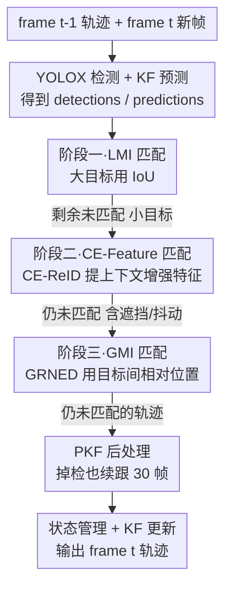

# ProgTrack: A Multi-Object Tracking Algorithm with Progressive Matching Strategy

**会议**: CVPR 2026  
**论文**: [CVF Open Access](https://openaccess.thecvf.com/content/CVPR2026/html/Zhang_ProgTrack_A_Multi-Object_Tracking_Algorithm_with_Progressive_Matching_Strategy_CVPR_2026_paper.html)  
**代码**: 无  
**领域**: 视频理解 / 多目标跟踪  
**关键词**: 多目标跟踪, 无人机, 渐进式匹配, 上下文增强ReID, 全局运动信息

## 一句话总结
ProgTrack 模仿人眼"先大后小再补漏"的跟踪习惯，把无人机多目标跟踪拆成"大目标用 IoU、小目标用上下文增强 ReID、剩余难匹配目标用目标间相对位置"三阶段渐进匹配，再配一个能扛遮挡/掉检的纯卡尔曼滤波（PKF），在 VisDrone2019 和 MDMT 上把 MOTP/IDF1 刷到 SOTA。

## 研究背景与动机
**领域现状**：无人机多目标跟踪（UAV-MOT）目前主流走 Track-by-Detection 范式——先用检测器（如 YOLOX）逐帧出框，再用卡尔曼滤波预测位置、用匈牙利算法把上一帧轨迹和当前帧检测框配对。匹配线索无非两类：运动信息（以 IoU 为代表）和外观信息（以 ReID 为代表）。

**现有痛点**：无人机视角下这套传统流程频繁翻车，作者归纳了四类典型失败场景：① 多尺度目标——小目标像素少、框小、外观特征羸弱，ReID 提不出有效特征；② 复杂背景/遮挡——背景或遮挡物干扰外观、还会改变目标框大小；③ 镜头抖动/旋转/缩放——导致相邻帧目标位置剧烈漂移，普通卡尔曼滤波和 IoU 都对不上；④ 目标高度相似——比如路上一排车，外观特征根本分不开。

**核心矛盾**：这四类场景背后是同一个根本矛盾——**单一匹配线索（运动 or 外观）对所有目标"一视同仁"地用，但不同尺度/状态的目标对线索的可靠性截然不同**。大目标 IoU 就够了，硬上 ReID 反而慢；小目标外观弱，单看外观必错；被遮挡/抖动的目标连框都坏了，运动和外观都失效。

**切入角度**：作者从人眼跟踪机制获得灵感。人眼跟大目标时只用简单的局部运动判断（类似 IoU）；跟小目标时会下意识借助背景——背景在相邻帧几乎不变，靠"目标相对背景的位置"来锁定；遇到目标尺寸/外观突变（遮挡）时，则退而求其次看"该目标相对周围其他目标的相对位置"，因为镜头抖动和遮挡都不改变目标之间的相对位置关系。

**核心 idea**：把"用什么线索"和"目标的难度/状态"绑定起来，做**多阶段渐进匹配**——先匹配最容易的大目标（LMI/IoU），再匹配需要上下文的小目标（CE-Feature），最后用全局相对位置（GMI）兜底剩余的难匹配目标，每一阶段只处理它最擅长的那批目标，逐步收缩候选。

## 方法详解

### 整体框架
ProgTrack 接收两个输入：`frame_{t-1}`（已带 ID 和类别的上一帧轨迹）和 `frame_t`（待处理新帧）。匹配前先做两件准备：用本地训练的 YOLOX 在 `frame_t` 上检测出 `detections_t`；用改进的 PKF 策略基于上一帧轨迹预测出当前帧位置 `predictions_t`。随后核心是**三阶段渐进匹配**——把检测框按尺度分流，每阶段用一种匹配策略，匹不上的目标逐级下放到下一阶段，最后再用 PKF 后处理兜住掉检的轨迹。

第一阶段用 **LMI（局部运动信息）** 匹配大目标，具体实现就是 IoU——大目标框大、帧间重叠稳定，IoU 又快又准。第二阶段对小目标用 **CE-Feature（上下文增强特征）** 匹配，由 CE-ReID 网络提取融合了背景上下文的判别性特征。第三阶段对前两步剩下的难匹配目标用 **GMI（全局运动信息）** 匹配，由 GRNED 模块利用"目标间相对位置不变"来配对。三阶段都匹不上的轨迹交给 **PKF** 后处理：不立刻丢弃，而是继续预测跟踪一段时间，扛过短暂遮挡/掉检。

### 关键设计

**1. 三阶段渐进匹配：按目标难度分流匹配线索，逐级收缩候选**

这是 ProgTrack 的灵魂，直接针对"单一线索对所有目标一刀切"的痛点。它模仿人眼"先匹配易匹配的大目标，再匹配难匹配的小目标，最后处理剩余混合尺度目标"的渐进过程：第一阶段只用 LMI（IoU）匹配大目标——大目标框大、相邻帧重叠率高，IoU 成功率高且计算延迟低，没必要上重型 ReID；第二阶段把目光转向小目标，因为小目标外观弱，改用融合背景的 CE-Feature；第三阶段处理前两步遗留的"硬骨头"（严重遮挡、镜头抖动导致框和外观都坏掉的目标），既有大目标也有小目标，改用对位置突变鲁棒的全局相对位置匹配。

这种"分而治之"的好处是：每个阶段只面对它最擅长的目标子集，匹配难度被显著降低，且候选集逐级收缩（大→小→剩余），错误不会在一锅烩里互相污染。和 ByteTrack 那种"高分框先匹、低分框补匹"的两段式相比，ProgTrack 的分层依据是**目标的尺度/状态**而非检测置信度，更贴合无人机场景里"尺度极不均匀"的本质矛盾。

**2. CE-ReID 模块：给小目标的外观特征注入背景上下文**

这是第二阶段 CE-Feature 策略的具体实现，专治"小目标外观判别力弱"。核心观察是：小目标自身像素信息有限，但它**相对周围背景的位置在相邻帧几乎不变**——于是把背景上下文编码进特征，就能造出更有区分度的特征。模块由三部分组成：SCA（空间与通道注意力）模块借鉴 CBAM 思路，对目标区域图在空间和通道两个维度做池化，concat 后经激活得到局部注意力分数，与目标区域图点乘得到 **Local Texture Feature**（局部纹理特征）；CDSPC（上下文深度可分逐点卷积）模块输入"带上下文的目标区域图"，先用深度可分逐点卷积充分提取目标与上下文特征，再把目标区域 mask 掉只留上下文，得到 **Context Attention Feature**（上下文注意力特征），它编码了上下文本身以及"上下文—目标"的特征级关系；最后融合模块把两者拼成 **CE-Feature**。

训练时对 Local Texture Feature 和 CE-Feature 分别算损失，总损失 $\text{CombinedLoss} = \text{LocalFeatureLoss} + \text{ContextEnhancedFeatureLoss}$；推理时只输出 CE-Feature 作为 ReID 特征，送进匈牙利算法构造代价矩阵。一个反直觉但合理的结论：**背景越复杂，CE-Feature 提升越大**——因为更丰富的上下文提供了更多判别线索。实验里 CE-ReID 的 AUC 达 0.950，高于 DeepReID 的 0.917 和 FastReID 的 0.931。

**3. GRNED 模块：用目标间相对位置兜底遮挡与镜头抖动**

这是第三阶段 GMI 策略的实现，针对前两步匹不上的根因——遮挡破坏外观和框的完整性、镜头抖动（旋转/平移/缩放）让目标坐标剧烈漂移，此时单目标的运动和外观线索都废了。但作者发现一个关键不变量：**无论镜头怎么抖、目标怎么被遮，场景里目标之间的相对位置关系几乎不变**。GRNED 据此分三步匹配：① 帧内 GMI 提取——对 `frame_{t-1}` 里每个 $\text{target}_i$，算它到同帧其他所有目标的欧氏距离集合 $v_i = [d_{1-i}, d_{2-i}, \dots]$，排序后向量化，这个有序向量就成了该目标的"相对位置指纹"；② 跨帧 GMI 匹配——遍历两帧的指纹向量对 $(v, v')$ 算欧氏距离填进代价矩阵 $C$，再做 min-max 归一化以消除帧间缩放带来的距离突变：

$$C'_{ij} = \frac{C_{ij} - \min(C)}{\max(C) - \min(C)}$$

当目标全遮挡或移出视野导致两帧向量长度不等时，用贪心算法从较长向量里"以最小代价丢弃部分元素"来对齐长度、同时最大化相似度；③ 匈牙利匹配——在归一化代价矩阵上求最优一一匹配。这一招把"绝对坐标"换成"相对拓扑"，正是它抗抖动、抗遮挡的根本原因。

**4. PKF（纯卡尔曼滤波）：掉检也不丢轨迹，续跟扛过短暂遮挡**

针对"目标上一帧还在、这一帧没检出"的掉检场景。出发点是：如果目标位于画面中心区域却没检出，大概率是被遮挡而非真的离场，此时不该停止跟踪。传统做法是用高斯/线性插值后处理估位置，但对实时任务不可行。PKF 的解法是即便没有检测结果，也继续用卡尔曼滤波纯预测续跟 30 帧：若 30 帧内重新检出且匹配成功，就回到正常的状态管理与 KF 更新；否则放弃续跟、保留最后位置 30 帧。关键改动在更新公式——因为没有检测观测值 $y_t$，最终结果不再用观测加权，而是直接令 $\hat{x}_t = \hat{x}_t^-$（预测即输出）：

$$\hat{x}_t^- = F\hat{x}_{t-1} + Bu_{t-1}, \quad P_t^- = FP_{t-1}F^T + Q$$

普通 KF 一掉检就停跟，PKF 则把轨迹"撑"过短暂遮挡/掉检窗口，从而显著减少轨迹断裂和 ID 切换。

## 实验关键数据

### 主实验
在 VisDrone2019（17 序列 6635 帧）和 MDMT（28 序列 11762 帧、3581 个 ID）两个无人机数据集上对比 10 个 SOTA 跟踪器。红/青分别表示最优/次优。

| 数据集 | 方法 | MOTA↑ | MOTP↑ | IDF1↑ | IDs↓ |
|--------|------|-------|-------|-------|------|
| VisDrone2019 | StrongSORT (TMM'23) | **40.3** | 73.4 | 49.4 | 21102 |
| VisDrone2019 | GeneralTrack (CVPR'24) | 39.4 | 73.5 | 47.5 | 22803 |
| VisDrone2019 | DiffMOT (CVPR'24) | 38.8 | 73.9 | 47.2 | 21634 |
| VisDrone2019 | **ProgTrack (本文)** | 40.2 | **77.5** | **52.8** | **21295** |
| MDMT | StrongSORT | 57.1 | 74.3 | 66.8 | 26134 |
| MDMT | BoT-SORT | 56.4 | 74.7 | 67.6 | 26084 |
| MDMT | **ProgTrack (本文)** | **57.2** | **77.3** | **69.2** | **25536** |

在 VisDrone2019 上 ProgTrack 的 MOTP（77.5）和 IDF1（52.8）双双第一、MOTA（40.2）与最强的 StrongSORT（40.3）持平；在 MDMT 上三项核心指标全部第一。代价是速度——FPS 仅 6.5/6.7，明显慢于 ByteTrack（~29），属于精度换速度。

### 消融实验
在 VisDrone2019 上以 ByteTrack 为 baseline 逐模块叠加：

| 配置 | MOTA↑ | MOTP↑ | IDF1↑ | 说明 |
|------|-------|-------|-------|------|
| baseline (ByteTrack) | 34.7 | 72.1 | 47.2 | 起点 |
| + CE-ReID | 38.4 | 73.8 | 48.1 | MOTA 大涨 +3.7，外观判别增强 |
| + GRNED | 39.7 | 76.8 | 48.9 | MOTP 大涨 +3.0，抗位置漂移 |
| + PKF | 40.2 | 77.5 | 52.8 | IDF1 大涨 +3.9，轨迹连续性 |

### 关键发现
- **三个模块各管一项核心指标，分工清晰**：CE-ReID 主要拉高 MOTA（特征判别力→整体跟踪准确性），GRNED 主要拉高 MOTP（相对位置匹配→定位精度），PKF 主要拉高 IDF1（续跟→身份一致性、减少 ID 切换）。这种"一模块对一指标"的干净对应，反过来佐证了三阶段设计确实在解各自瞄准的问题。
- **CE-ReID 的优势随背景复杂度上升**：ReID 对比中 CE-ReID 的 ROC-AUC 0.950 显著高于 DeepReID（0.917）和 FastReID（0.931），且背景越复杂上下文线索越丰富、提升越明显——这与"借背景锚定小目标"的设计直觉一致。
- **精度提升以速度为代价**：6.5 FPS 远低于实时阈值，对真实无人机实时跟踪是明显短板。

## 亮点与洞察
- **把"线索选择"和"目标难度"解耦绑定**：最巧妙之处是不再纠结"哪种匹配线索更好"，而是承认不同目标该用不同线索，按尺度/状态分阶段渐进处理——这种"分而治之 + 候选逐级收缩"的思路可迁移到任何"异质样本难度差异大"的匹配/检索任务。
- **"相对位置不变量"是抗抖动的好抓手**：GRNED 把绝对坐标换成"目标间相对距离的有序指纹"，用拓扑不变性绕开镜头抖动——这个 trick 对所有"全局几何形变但局部结构稳定"的场景（如卫星图配准、动态相机 SLAM 关联）都有启发。
- **PKF 把后处理插值搬进在线滤波**：用"无观测时直接预测即输出"的极简改法实现实时续跟，避开了离线插值，适合任何对掉检敏感的在线跟踪。

## 局限性 / 可改进方向
- **速度是硬伤**：6.5 FPS 难以满足无人机机载实时需求，三阶段串行 + CE-ReID 重型特征提取是主要开销，作者也把优化 CE-ReID/GRNED 列为未来工作。
- **GRNED 依赖足够多的共视目标**：相对位置指纹需要场景里有多个目标共存，目标稀疏（只有一两个目标）时相对拓扑信息不足，第三阶段可能失效。⚠️ 论文未给出目标数极少时的退化分析。
- **贪心对齐可能引入误匹配**：当两帧目标数不等时靠贪心"丢弃元素"对齐向量长度，这一步在大量目标进出视野时的鲁棒性存疑，论文未充分量化其失败率。
- **30 帧续跟阈值是固定超参**：PKF 续跟 30 帧、保留 30 帧均为硬编码，对不同帧率/运动速度的泛化性未验证。

## 相关工作与启发
- **vs ByteTrack**：ByteTrack 按检测置信度做两段式匹配（高分先匹、低分补匹）；ProgTrack 按目标尺度/状态做三段式匹配并各配专属线索。ProgTrack 在 VisDrone2019 上把 IDF1 从 47.x 提到 52.8，但 FPS 从 ~29 掉到 6.5。
- **vs StrongSORT**：StrongSORT 走"强 ReID + 运动补偿"路线，MOTA 略高（40.3 vs 40.2）；ProgTrack 靠 GRNED 的相对位置匹配在 MOTP（77.5 vs 73.4）和 IDF1（52.8 vs 49.4）上明显领先，定位与身份一致性更强。
- **vs FairMOT（Joint-Detection-and-Track）**：FairMOT 用共享 backbone 联合优化检测与 ReID 分支；ProgTrack 坚持 Track-by-Detection 范式，把创新全压在"匹配阶段"，证明在无人机场景下精细化匹配策略比端到端联合训练更对症。

## 评分
- 新颖性: ⭐⭐⭐⭐ 渐进式三阶段匹配 + 相对位置不变量 GRNED 的组合在 UAV-MOT 里思路清新
- 实验充分度: ⭐⭐⭐⭐ 双数据集对比 10 个 SOTA + 逐模块消融 + ReID 单独 ROC 对比，较扎实
- 写作质量: ⭐⭐⭐⭐ 人眼类比贯穿全文、动机—设计映射清晰，但部分公式排版凌乱
- 价值: ⭐⭐⭐⭐ 对无人机/动态相机多尺度跟踪有实用价值，但 6.5 FPS 限制了落地

<!-- RELATED:START -->

## 相关论文

- [\[CVPR 2026\] Progressive Multi-cue Alignment for Unaligned RGBT Tracking](progressive_multi-cue_alignment_for_unaligned_rgbt_tracking.md)
- [\[CVPR 2026\] Hypergraph-State Collaborative Reasoning for Multi-Object Tracking](hypergraph-state_collaborative_reasoning_for_multi-object_tracking.md)
- [\[CVPR 2026\] Occlusion-Aware SORT: Observing Occlusion for Robust Multi-Object Tracking](occlusion-aware_sort_observing_occlusion_for_robust_multi-object_tracking.md)
- [\[CVPR 2026\] Dual-level Adaptation for Multi-Object Tracking: Building Test-Time Calibration from Experience and Intuition](tcei_test_time_calibration_experience_intuition_mot.md)
- [\[AAAI 2026\] PlugTrack: Multi-Perceptive Motion Analysis for Adaptive Fusion in Multi-Object Tracking](../../AAAI2026/video_understanding/plugtrack_multi-perceptive_motion_analysis_for_adaptive_fusion_in_multi-object_t.md)

<!-- RELATED:END -->
