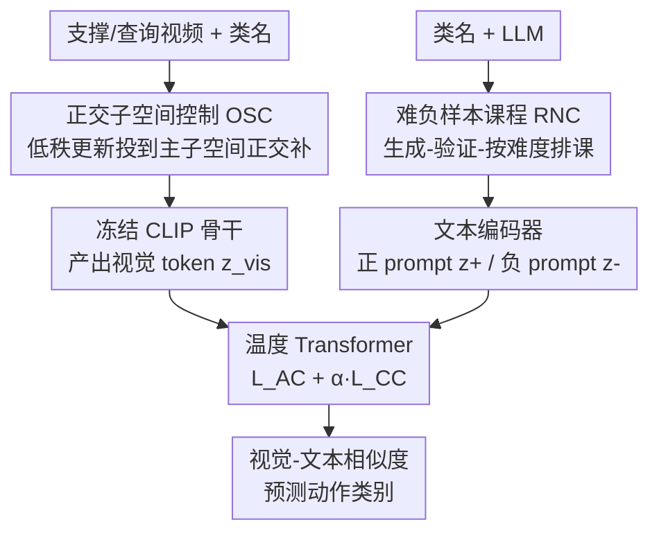

# Protect to Adapt: Orthogonal Subspace Control with Ranked Negative-Prompt Curriculum for Few-Shot Action Recognition

**会议**: CVPR 2026  
**论文**: [CVF Open Access](https://openaccess.thecvf.com/content/CVPR2026/html/Qi_Protect_to_Adapt_Orthogonal_Subspace_Control_with_Ranked_Negative-Prompt_Curriculum_CVPR_2026_paper.html)  
**代码**: 待确认  
**领域**: 视频理解  
**关键词**: 小样本动作识别, VLM微调, 正交子空间, 难负样本课程, 灾难性遗忘

## 一句话总结
P2A 把 CLIP 适配到小样本动作识别拆成两件事——用正交子空间约束（OSC）把低秩更新逼进预训练权重主子空间的正交补，从而保住通用语义、缓解灾难性遗忘；再用 LLM 生成、验证器过滤、按难度排课的负样本课程（RNC）把类间边界推开；只调 2% 参数就在 5 个 FSAR benchmark 上刷到 SOTA。

## 研究背景与动机

**领域现状**：小样本动作识别（FSAR）要在每类只有几个标注样本的条件下识别新动作类。早期做法靠元学习/度量学习，但小骨干网络的表达能力很快触顶；近两年主流转向把 CLIP 这类视觉-语言模型（VLM）的强先验迁过来，代表作 CLIP-FSAR 直接全量微调 CLIP 视觉骨干并加 prototype modulation 层。

**现有痛点**：把 VLM 适配到下游有一对此消彼长的麻烦。一是**全量微调代价大**——CLIP-FSAR 更新了骨干 58% 的参数，会破坏 CLIP 原本的零样本迁移能力、加剧灾难性遗忘，这在连续学习（一个接一个学新数据集、不能回放旧数据）场景里尤其致命；二是**反过来冻骨干 + 轻量 adapter 虽然省参数，但小样本下适配能力又不够**。更细的一层痛点在文本侧：FSAR 的 episode 里每个 query 只对比一个正类 + 几个负类，文本编码器见到的 prompt 多样性极低，几乎看不到贴着决策边界的难反例，导致类间 margin 很小、边界很糊。

**核心矛盾**：知识保留（stability）与任务适配（plasticity）之间的根本权衡。无约束的低秩更新天然会沿着预训练权重的主导方向走，等于在覆盖最稳定的通用语义；而小样本对比信号又太稀疏，撑不起清晰的决策边界。

**本文目标**：在只动极少参数的前提下，同时（a）防止适配过程覆盖通用语义、（b）在小样本下把类间边界打磨锐利。

**切入角度**：作者把这两个失败模式对应到两个正交的维度——OSC 管"**适配发生在哪里**"（参数层面：把更新限制在不伤主子空间的方向），RNC 管"**适配怎么用难负样本**"（数据层面：喂入按难度排序的负 prompt）。两者解耦、互补。

**核心 idea**：先"保护"（把低秩更新投到预训练主子空间的正交补里，保住通用语义）再"适配"（用 LLM 造的难负样本课程锐化边界）——Protect-to-Adapt。

## 方法详解

### 整体框架
给定支撑/查询视频，冻结的 CLIP 视觉骨干在 OSC 约束下产出视觉 token $z_{vis}$；文本编码器对每个类既给正 prompt 嵌入 $z_{text}^+$，也给 RNC 提供的课程难负 prompt 嵌入 $z_{text}^-$。一个温度 transformer 在复合损失（episode 内分类损失 + 课程对比损失）下训练，最后靠视觉-文本相似度在共享空间里出类别分数。OSC 作用在参数层、RNC 作用在数据层，两条线在文本-视觉对比这一步汇合。

### 关键设计

**1. 正交子空间控制 OSC：把低秩更新逼出预训练主子空间，保住通用语义**

痛点很直接：vanilla LoRA 把权重更新写成 $\Delta W = BA$（$A\in\mathbb{R}^{r\times d_2},B\in\mathbb{R}^{d_1\times r}$，秩 $r\ll\min(d_1,d_2)$），但它完全无视 $W_0$ 的谱结构，更新会沿主导奇异方向走，等于直接改写最稳定的通用语义。OSC 的做法是先对待微调权重做 SVD：$W_0=U\Sigma V^\top=\sum_i\sigma_i u_i v_i^\top$，取左奇异向量 $U$ 的前 $k$ 列张成"受保护"的主子空间 $S_p$（选左奇异是因为更新分支 $B$ 活在输出空间 $\mathbb{R}^{d_1}$ 里）。然后构造投影算子，把更新强行投到 $S_p$ 的正交补 $S_p^\perp$：

$$P_k^\perp = I_{d_1}-U_kU_k^\top,\qquad \Delta W = P_k^\perp BA = (I_{d_1}-U_kU_k^\top)BA.$$

这个约束等价于优化问题 $\min_{\Delta W}\mathcal{L}(W_0+\Delta W)\ \text{s.t.}\ U_k^\top\Delta W=0$，几何含义是：对任意输入 $x$，预激活响应在主子空间上的投影**完全不变**（$U_k^\top(W_0+\Delta W)x=U_k^\top W_0 x$）——既不动通用语义，又让任务适配在能量稀疏的正交补里自由发挥。它有效是因为正交补方向"energetically sparse"，正好是塞任务特定可塑性的理想位置，而主子空间这块稳定语义被原样冻住。

这里的关键超参是受保护秩 $k$，作者没有手调阈值，而是用**基于熵的有效秩**自动定：把奇异值归一化成概率 $p_i=\sigma_i/\sum_j\sigma_j$，取 $k=\lfloor\exp(-\sum_i p_i\log p_i)\rfloor$。它是矩阵秩对谱形状的连续推广、尺度无关：谱越平（信息越分散）的层受保护子空间越大，谱越集中的层 $k$ 越小，自动在稳定性与可塑性间逐层平衡。OSC 不增加 LoRA 的参数量（仍是 $r(d_1+d_2)$），$U_k$ 只算一次截断 SVD 并缓存复用，每层每次前向只多花 $O(d_1kr)$ FLOPs。

**2. 难负样本课程 RNC：用 LLM 造、验证器筛、按难度排课的负 prompt 锐化边界**

FSAR 的 episode 里每个 query 只见一个正原型 + 极少负类，类间分离很弱。RNC 想用难负样本补上这一课，但难点在于"难"得可控且不能泄露标签。它的核心是一个**生成器-验证器闭环**：对每个动作类 $a_i$，先定义禁忌 token 集 $F$（任何匹配 $a_i$ 本身或其词形变体的 token），LLM 在三个难度 $\ell\in\{e,m,h\}$（粗替换 / 语义反转 / 细粒度近似反事实，例如"放下大提琴"/"倒着拉大提琴"/"拉大提琴但几乎没碰到弦"）各生成 $M$ 句负样本，且每句都要排除 $F$ 里的 token。非生成式的验证器对每一轮产物做 schema 检查、禁忌词匹配、难度规则一致性、近重复过滤和长度检查，返回 JSON 决定：OK 就把负样本缓存到磁盘、训练时不再调 LLM；Revise 就把被拒的 JSON 当作下一轮生成器的 prompt，最多 5 轮，到顶还不一致就整类重启。这套设计保证负样本"难但不漏答案"，且把昂贵的 LLM 调用一次性前置、训练零额外开销。

缓存好之后用**难度退火课程**喂入：训练分三阶段，每阶段只采一个难度以避免信号打架。设阶段边界 $T_e<T_m<E$，第 $t$ 个 epoch 的活跃负样本池为 $S_{neg}(t)=S_e/S_m/S_h$（依次对应 easy/medium/hard 三段）。先用 easy 负样本对齐粗边界，再用 medium、hard 逐步收紧决策边界——这正是课程学习"由易到难"的思路落到负样本上。

**3. 复合训练目标：episode 分类 + 课程对比，把两路信号拧成一股**

最终损失 $\mathcal{L}_{total}=\mathcal{L}_{AC}+\alpha\mathcal{L}_{CC}$。$\mathcal{L}_{AC}$ 是 episode 内查询 logit 上的标准 softmax 交叉熵，负责对齐分类。$\mathcal{L}_{CC}$ 是课程对比损失，把视觉嵌入拉向正确类原型、推离当前难度的难负 prompt：

$$\mathcal{L}_{CC}=-\log\frac{e^{s_i^+}}{e^{s_i^+}+\sum_{m=1}^{M}e^{s_{im}^-}},$$

其中 $s_i^+=\cos(v_i,p_{a_i})$ 是视觉嵌入与真值类原型的余弦相似度，$s_{im}^-=\cos(v_i,\phi_{text}(s_{a_i}^{\ell(t),m}))$ 是与第 $m$ 个当前难度负 prompt 的相似度。$\alpha$（实验取 0.1）控制两个目标的平衡。这一项把 RNC 喂进来的难负样本真正转成"推开边界"的梯度，是 OSC 保住语义之外、专门提升判别力的那一半。

### 损失函数 / 训练策略
采用 episode-based 训练，5-way 1-/5-shot。OSC 的 LoRA 秩设为 2、dropout 0.25，作用在上半部分层（6–11）的 $W_qW_vW_k$ 投影上；RNC 每类每难度 $M=3$ 句负样本，课程边界 $(T_e,T_m)=(4,6)$；$\alpha=0.1$；负样本生成默认用 DeepSeek-R1。结果在 10,000 个随机 episode 上取平均。

## 实验关键数据

### 主实验
五个 FSAR benchmark（HMDB51 / UCF101 / SSv2-Small / SSv2-Full / Kinetics-100），P2A 在 10 个设置里 8 个拿第一（CLIP ViT-B 骨干）。

| 数据集 (1-shot) | CLIP-FSAR | EMP-Net | P2A (本文) | 相对 CLIP-FSAR |
|--------|-----------|---------|------------|----------------|
| HMDB51 | 75.8 | 76.8 | **82.3** | +6.5 |
| Kinetics-100 | 89.7 | 89.1 | **93.7** | +4.0 |
| SSv2-Small | 54.5 | 57.1 | **58.5** | +4.0 |
| SSv2-Full | 61.9 | 63.1 | **63.8** | +1.9 |
| UCF101 | 96.6 | 94.3 | **96.9** | +0.3 |

参数效率对比（5-way 1-shot）更能说明问题：

| 方法 | 可调参数 | HMDB51 | SSv2-Small | Kinetics-100 |
|------|---------|--------|------------|--------------|
| CLIP-FSAR (全量) | 89M (58.2%) | 75.8 | 54.5 | 89.7 |
| EMP-Net | 7.7M (4.9%) | 76.8 | 57.1 | 89.1 |
| AIM | 14.3M (8.7%) | 75.9 | 50.5 | 89.2 |
| CLIP-FSAR + vanilla LoRA | 3.1M (2.0%) | 78.6 | 56.4 | 90.7 |
| **P2A (本文)** | **3.1M (2.0%)** | **82.3** | **58.5** | **93.7** |

只调 2% 参数就超过调 89M 的全量微调、也超过调 7.7M 的 EMP-Net——作者据此论断："在参数高效微调里，**适配的位置比可调参数的数量更关键**"。

### 消融实验
组件消融（5-way 1-shot，HMDB51 / Kinetics-100）逐项验证 OSC、RNC 与课程的贡献：

| 配置 | 可调参数 | HMDB51 | Kinetics-100 |
|------|---------|--------|--------------|
| 冻结骨干 | 3M | 58.2 | 78.9 |
| + vanilla LoRA (VL) | 3.1M | 78.6 | 90.7 |
| + OSC（无 RNC） | 3.1M | 79.9 | 91.8 |
| VL + RNC(easy) | 3.1M | 77.3 | 91.0 |
| OSC + RNC(easy) | 3.1M | 80.4 | 92.2 |
| OSC + RNC(hard) | 3.1M | 80.7 | 92.8 |
| **OSC + RNC + 课程(CL)** | 3.1M | **82.3** | **93.7** |

连续学习上 P2A 同样占优（S→K→H 三任务序列，5-way 5-shot）：AvgAcc 78.0（CLIP-FSAR 74.1 / EMP-Net 70.5）、BWT −5.8（遗忘最少）、FWT −7.7（前向迁移最好，但相对冻结 CLIP 基线仍为负）。

### 关键发现
- **OSC 与 RNC 互补、缺一不可**：单加 OSC（79.9）或单加 RNC（VL+RNC easy 仅 77.3，甚至低于纯 LoRA 78.6）都不够；只有 OSC 先保住语义、再叠 RNC + 课程，才一路爬到 82.3。RNC 必须建立在 OSC 之上才发挥正作用。
- **熵有效秩 > 固定子空间维度**：把 $k$ 固定为 1/2/4/…/256 都不如自适应的 $K_{eff}$（HMDB51 79.9 vs 固定值约 79.3–79.6，且 $k$ 太大如 256 反掉到 78.5），说明逐层按谱集中度定保护维度更可靠。
- **保护高层、约束注意力投影最有效**：OSC 加在上半部分层（6–11）比加低层好（79.9 vs 77.8），加在 $W_qW_vW_k$ 比加全部投影或单个投影都好——约束注意力的形成比一视同仁地约束所有投影更划算。
- **LLM 越强负样本越好**：换 gpt-3.5→gpt-4.1→DeepSeek-R1，HMDB51 从 80.1 升到 82.3，DeepSeek-R1 最佳，但即便最弱的 gpt-3.5（80.1）也稳超 CLIP-FSAR（75.8）。

## 亮点与洞察
- **"保护 + 适配"解耦得很干净**：OSC 管"在哪改"、RNC 管"怎么用难样本"，分别落在参数层和数据层，互不纠缠却又互补——这种把一个权衡拆成两个正交维度的思路很值得借鉴。
- **正交补投影的"零改写"保证是硬的**：$U_k^\top\Delta W=0$ 让主子空间响应数学上原样不变，不是软正则而是硬约束，且参数量和 LoRA 完全一致、只多一点 FLOPs，工程上几乎免费。
- **熵有效秩自动定保护维度**：不用手调阈值、尺度无关、逐层自适应，是个可直接迁到其他 LoRA/PEFT 场景的小工具。
- **难负样本"难但不漏答案"靠验证器闭环兜底**：禁忌 token + 非生成式验证器把 LLM 幻觉和标签泄露挡在训练之外，且一次性缓存、训练零额外 LLM 开销——把"用 LLM 造数据"做成了可控、可复现的离线流程。
- **一句可迁移的论断**：参数高效微调里"位置比数量更重要"，对所有 LoRA/adapter 类方法都是有价值的设计启示。

## 局限与展望
- **依赖类名可被 LLM 理解**：RNC 造负样本要 LLM 懂动作类语义，对罕见/专业领域动作（如手术动作、工业操作）类名信息不足时，难负样本质量可能下降。
- **连续学习的 FWT 绝对值仍为负**：相对冻结 CLIP 基线，前向迁移虽是同类最好但仍是负值，说明序贯适配对新任务初始性能的正面增益还很有限。
- **SVD + 缓存的工程成本**：每个待微调层都要算截断 SVD 并缓存 $U_k$，层多、维度大时一次性预处理开销不小（虽然只算一次）。
- **难度三档是经验设定**：easy/medium/hard 三阶段、$M=3$、边界 $(4,6)$ 都是经验值，难度划分和退火节奏对不同数据集是否最优缺乏更系统的分析。

## 相关工作与启发
- **vs CLIP-FSAR**：CLIP-FSAR 全量微调 CLIP 视觉骨干（动 89M 参数）、只用正 prompt，易过拟合且破坏零样本迁移；P2A 只动 2% 参数、用正交补保护语义并加难负样本，HMDB51 1-shot 上反超 6.5%。
- **vs vanilla LoRA**：LoRA 无视权重谱结构、更新沿主导方向覆盖通用语义；OSC 把更新投到主子空间正交补，同参数预算下 HMDB51 从 78.6 升到 79.9。
- **vs EMP-Net / ST-Adapter / AIM 等 PEFT**：这些 adapter 类方法不显式保护 VLM 的主导语义子空间，跨域适配时对齐结构更脆；P2A 用更少参数（3.1M vs 7.7–14.3M）拿到更高精度和更强跨域泛化。
- **vs 已有 VLM 负学习 / 难负样本对比**：以往负学习多在小样本图像分类，未用 LLM 生成 prompt、也不考虑连续学习；RNC 把类特定反事实负样本 + 难度课程结合，并在跨数据集连续学习协议下评测灾难性遗忘。

## 评分
- 新颖性: ⭐⭐⭐⭐ 正交补保护 + LLM 难负样本课程两个角度都不算全新，但组合干净、动机扣得紧，把"位置 vs 数量"的洞察讲透了。
- 实验充分度: ⭐⭐⭐⭐⭐ 五个 benchmark + 参数效率 + 跨域 + 连续学习 + 多维消融（LLM/层位/投影/子空间维度）覆盖得很全。
- 写作质量: ⭐⭐⭐⭐ 方法推导清晰、公式完整、图示到位；个别记号（如禁忌集、验证器流程）略密。
- 价值: ⭐⭐⭐⭐ 2% 参数刷 SOTA + "位置比数量更重要"的 PEFT 设计启示，对小样本/连续学习的 VLM 适配有实用参考价值。

<!-- RELATED:START -->

## 相关论文

- [\[CVPR 2026\] MPL: Match-guided Prototype Learning for Few-shot Action Recognition](mpl_match-guided_prototype_learning_for_few-shot_action_recognition.md)
- [\[CVPR 2026\] SkeletonContext: Skeleton-side Context Prompt Learning for Zero-Shot Skeleton-based Action Recognition](skeletoncontext_skeleton-side_context_prompt_learning_for_zero-shot_skeleton-bas.md)
- [\[AAAI 2026\] Task-Specific Distance Correlation Matching for Few-Shot Action Recognition](../../AAAI2026/video_understanding/task-specific_distance_correlation_matching_for_few-shot_action_recognition.md)
- [\[ECCV 2024\] Efficient Few-Shot Action Recognition via Multi-Level Post-Reasoning](../../ECCV2024/video_understanding/efficient_few-shot_action_recognition_via_multi-level_post-reasoning.md)
- [\[CVPR 2026\] Metadata-Aware Multi-Prompt Reasoning for Zero-Shot Accident Understanding](metadata-aware_multi-prompt_reasoning_for_zero-shot_accident_understanding.md)

<!-- RELATED:END -->
