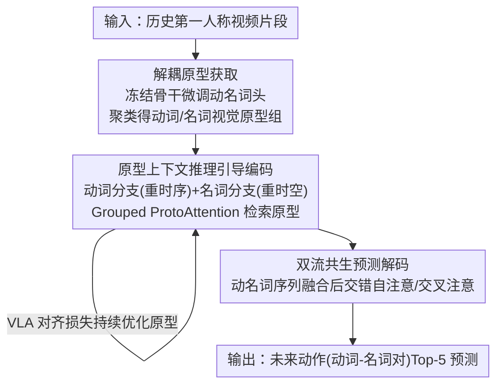

# Prototypical Action Reasoning Facilitated by Vision-Language Alignment for Egocentric Action Anticipation

**会议**: CVPR 2026  
**论文**: [CVF Open Access](https://openaccess.thecvf.com/content/CVPR2026/html/Shao_Prototypical_Action_Reasoning_Facilitated_by_Vision-Language_Alignment_for_Egocentric_Action_CVPR_2026_paper.html)  
**代码**: 待确认  
**领域**: 视频理解 / 第一人称动作预测  
**关键词**: 动作预测, 第一人称视频, 视觉-语言对齐, 原型学习, 动名词解耦

## 一句话总结
PAR-VLA 借助视觉-语言模型把动词、名词分别学成"解耦视觉原型"作为稳定语义锚点，把开放、无约束的未来动作预测，转化为由这些语义概念引导的条件预测，并用双流共生解码器细化动名词依赖，在 EPIC-KITCHENS-100 等三个数据集上刷新 SOTA。

## 研究背景与动机

**领域现状**：第一人称动作预测（Egocentric Action Anticipation）要在动作真正发生之前、仅凭历史观测视频推断未来动作，是具身智能、人机协作的核心能力。主流做法是用预训练视觉编码器 + Transformer 时序模型端到端建模时空上下文，直接回归未来动作。

**现有痛点**：未来本身具有强随机性，端到端方法缺乏显式语义推理能力，难以应对"开放式未来不确定性"。更糟的是第一人称动作有两个"维度灾难"：① 细粒度——手物交互（HOI）的细微差别会导致截然不同的结果；② 动作空间是动词-名词的组合，极其庞大且长尾稀疏。

**核心矛盾**：已有工作（如 S-GEAR）尝试用"整体动作原型"（把动词-名词对当成一个统一表示）来结构化输出空间，但整体原型有三重硬伤：长尾分布使稀有类别的原型初始化统计上不可靠；细粒度导致特征纠缠，"拿起瓶子"和"打开瓶子"在嵌入空间难以区分；最致命的是丢弃了动词与名词之间天然的语义依赖，让联合预测无从下手。

**本文目标**：与其用纠缠的整体原型，不如把动词、名词解耦成各自独立的视觉原型，再显式建模二者的依赖，把无约束的时序预测变成"有语义锚点引导"的条件预测。

**切入角度**：VLM 在大规模多模态数据上预训练，天生具备跨模态对齐能力，能提供统一稳健的语义空间——这正好为"分别学出高判别力的动词原型和名词原型"提供了理论与实践基础。

**核心 idea**：用 VLM 的视觉-语言对齐，分别学解耦的动词/名词视觉原型当语义锚点，再用原型引导的上下文推理 + 双流共生解码，把开放预测收敛成语义条件预测。

## 方法详解

### 整体框架
PAR-VLA 是一个分阶段的"原型表示学习引导时序推理"框架，训练管线串行执行三个阶段：**解耦原型获取（Disentangled Prototypes Acquisition）** → **原型上下文推理引导的动名词编码（PCR-guided Verb-Noun Encoding）** → **双流共生预测解码（Dual-Stream Symbiotic Predictive Decoding）**。输入是一段截止到观测时刻的历史视频片段，输出是未来 $\tau_a$ 秒（如 1s）后将要发生的动作（动词-名词对）的 Top-5 预测。

具体地：第一阶段冻结视觉骨干、只微调动名词识别头，让视觉嵌入与文本特征语义对齐，再对特征聚类初始化动词、名词视觉原型组；第二阶段在冻结骨干提取的时空特征上，用两条分支（动词分支重时序、名词分支重时空），通过 Grouped ProtoAttention 动态检索最相关的原型并显式建模动名词早期交互，输出未来预测特征序列，同时用视觉-语言对齐损失持续优化原型；第三阶段把动名词预测序列融合后送入双流共生解码器，用交错的自注意力/交叉注意力进一步刻画动名词互相依赖，给出联合预测。推理时原型冻结，端到端直接输出。

### 关键设计

**1. 解耦原型获取：把"动词原型"和"名词原型"分开学，根治整体原型的特征纠缠**

针对整体动作原型在细粒度下纠缠、稀有类初始化不可靠的痛点，作者不再学统一的动作原型，而是借 Ego-VLM 的跨模态对齐能力分别学动词、名词原型。实现上先冻结视觉骨干，引入一个两层 MLP 把顶层语义特征映射到动词/名词类别数维度，用交叉熵监督动名词识别：$L_{cls}=L_{ce}^{verb}+L_{ce}^{noun}$；同时让视觉特征 $(F_{verb},F_{noun})$ 与扩展文本嵌入 $(T_{verb},T_{noun})$ 的余弦相似度对齐，$L_{sim}=D_{cos}(F_{verb},T_{verb})+D_{cos}(F_{noun},T_{noun})$，其中 $D_{cos}(A,B)=1-\frac{A\cdot B}{\|A\|\|B\|}$。微调后对特征聚类，每个动词类 $v_i$ / 名词类 $n_j$ 各取 $k$ 个子原型（聚类中心）以捕捉类内多样性：$P_{v_i}=\{p^1_{v_i},\dots,p^k_{v_i}\}$。这样得到的原型是判别力强、语义对齐良好的锚点，把无约束预测转成语义条件预测。作者强调只需"少量轮次"的动名词识别微调、配上视觉-语言对齐约束，就能从整体动作帧里解出清晰的动名词语义，避免直接从帧序列抽解耦原型时的语义混淆。

**2. 原型上下文推理引导的动名词编码：用 Grouped ProtoAttention 动态检索原型 + 早期动名词交互**

这是框架的核心创新。考虑到动词语义更依赖时序、名词感知（聚焦手物交互）更依赖空间上下文，作者设计两条编码分支：动词分支强调时序建模，名词分支做整体时空建模。每层先做标准自注意力得到增强表示 $F^{sa}_v$，再加两路并行机制。其一是**早期动名词交互**：用 $F^{sa}_v$ 当 query、把名词特征经全局平均池化压成 $\bar F_n$ 当 key/value 做交叉注意力 $F^{n\to v}_v=\mathrm{CrossAtt}(\mathrm{LN}(F^{sa}_v),\mathrm{LN}(\bar F_n))$，提前注入名词上下文。其二是 **Grouped ProtoAttention**：用 $F^{sa}_v$ 与动词原型集计算余弦相似度矩阵 $M_v$，对每个原型组内 $K$ 个向量求和后 Softmax 归一化，得到对整套动词原型的相似分布 $S_v$；把 $S_v$ 当多项分布采样出相关原型子集，再做原型引导的交叉注意力 $F^{pro}_v=\mathrm{CrossAtt}(\mathrm{LN}(F^{sa}_v),P^{selected}_v)$。最后把三路相加 $F^{out}_v=F^{sa}_v+F^{n\to v}_v+F^{pro}_v$，经 FFN 构成一层，堆叠 $N_{par}$ 次（实验最优 $N_{par}=6$）。名词分支结构对称，但输入先空间池化降采样以省算力，跨分支交互时把动词输出沿空间维展开再做时序交叉注意力。该模块把"检索哪些语义概念 + 动名词怎么相互约束"显式化，是把开放预测收敛成条件预测的关键执行体。

**3. 双流共生预测解码器：在编码之后再补一个独立阶段细化动名词联合依赖**

编码分支虽已建模时序与早期交互，但动名词的最终联合预测仍需更精细的相互校正。作者在编码后接一个独立训练（仅交叉熵监督）的双流共生解码阶段。动词、名词解码分支各由两层自注意力 + 一层交叉注意力组成：先把动名词预测序列融合成混合语义序列 $\{\hat F^{vn}_\tau\}$；以动词解码为例，输入混合序列先过自注意力，再以名词预测序列当 prompt 做交叉注意力，最后再经自注意力输出解码后的动词序列；名词解码器结构对称。两条流互为提示、互相补全，形成"共生"机制，让动名词在最终预测前充分交换语义信息。

### 损失函数 / 训练策略
编码阶段引入自监督特征预测损失 $L_{feat}=\frac{1}{t-1}\sum_{\tau=2}^{t}\|\hat F_\tau-F_\tau\|^2$ 让模型逐步预测未来特征；预测的动名词序列再送分类头用 $L_{cls}$ 监督；并用视觉-语言对齐余弦相似度损失 $L_{align}=1-\frac12\left(\frac{S_v\cdot T_v}{|S_v||T_v|}+\frac{S_n\cdot T_n}{|S_n||T_n|}\right)$ 把"视觉预测特征与原型的聚合相似度"对齐到"文本标签语义相似度"，实现结构化表示学习。整体目标 $L_{total}=L_{feat}+L_{cls}+\lambda L_{align}$。训练分两阶段：阶段一独立训练 PCR 动名词编码器，阶段二引入并联合训练共生解码器；两阶段中原型都保持解冻持续微调。骨干用 Ego4D 预训练的 LaViLa 视觉骨干（笔记中记为 TSF-B），SGD（momentum 0.9，weight decay 1e-5），batch 32/GPU，base lr 1e-4，EPIC-KITCHENS-100 上 80 epoch（20 epoch warm-up + 余弦退火），4×RTX 4090。原型组大小最优 $K=5$。

## 实验关键数据

> 评测指标：**Top-5 Recall**（EPIC-KITCHENS-100 主指标，分别在 action/verb/noun 三个层级评估，预测时延 $\tau_a=1$s）、EGTEA 用 Top-5 Recall/Acc、50-Salads 用 Top-1 Acc。

### 主实验

EPIC-KITCHENS-100 验证集（Top-5 Recall %）：

| 方法 | 编码器 | 模态 | Verb | Noun | Action |
|------|--------|------|------|------|--------|
| AVT+ | ViT | RGB+Obj | 28.2 | 32.0 | 15.9 |
| RAFTformer-2B | MViTv2-16&24 | RGB | 33.8 | 37.9 | 19.1 |
| SGEAR-2B | ViT-B×2 | RGB+Obj | 32.6 | 37.8 | 19.5 |
| **PAR-VLA** | TSF-B | RGB | **40.3** | **43.2** | **22.5** |
| **PAR-VLA** | TSF-B | RGB+Flow | **44.9** | **47.6** | **24.1** |

仅用 RGB，PAR-VLA 的 action Top-5 Recall 就达 22.5%，比同样 RGB 的 RAFTformer（MViTv2-24，18.0%）高 4.5 个点、比双 ViT-B 分支的 SGEAR-2B（19.5%）高 3.0 个点，甚至超过依赖多模态融合（RGB+Flow+Obj）的诸多方法；加入光流后进一步提到 24.1%，全指标 SOTA。

跨数据集（Top-5 Recall / Top-1 Acc %）：

| 数据集 | 指标 | 之前最佳 | PAR-VLA(RGB) | PAR-VLA(RGB+Flow) |
|--------|------|----------|--------------|-------------------|
| EGTEA | Top-5 Recall | 67.4 (VS-TransGRU) | **70.2** | **72.7** |
| 50-Salads | Top-1 Acc | 63.9 (SGEAR-2B) | **65.4** | — |

EGTEA 上仅 RGB 即超此前最佳 RGB 方法 VS-TransGRU（67.4%）2.8 个点；50-Salads 上比 SGEAR-2B 高 1.5 个点、比 RAFTformer 高 10.5 个点。

### 消融实验

PAR（原型动作推理分支）与 VLA（视觉-语言对齐监督）逐组件消融：

| 配置 | EPIC Act@R5 | EPIC Verb@R5 | EPIC Noun@R5 | EGTEA R5 | EGTEA Acc |
|------|-------------|--------------|--------------|----------|-----------|
| baseline (w/o PAR & VLA) | 19.6 | 39.8 | 19.6 | 66.5 | 71.7 |
| + PAR only | 21.7 | 42.6 | 21.7 | 68.4 | 73.5 |
| + VLA only | 20.3 | 40.1 | 20.3 | 68.1 | 72.1 |
| **Full (PAR + VLA)** | **22.5** | **43.2** | **22.5** | **70.2** | **74.3** |

### 关键发现
- **PAR 与 VLA 有明显协同**：EPIC 上 baseline 19.6% → 单加 PAR 21.7% / 单加 VLA 20.3% → 两者合用 22.5%，比单用 PAR/VLA 分别再高 0.8 / 2.2 个点，说明"原型推理"和"语言对齐监督"是非线性互补而非简单叠加。
- **超参敏感性**：原型组大小最优 $K=5$（太少欠拟合类内多样性、太多冗余），编码层数最优 $N_{par}=6$（足够深度才能充分迭代上下文推理与原型交互）。
- **失败场景**：在未来高度不确定时（如观测"洗刀"却要预测"打开鸡肉包装"）模型仍会偏差，作者坦言这类情况连人类都易错。

## 亮点与洞察
- **"解耦原型 + 语义锚点"把开放预测转成条件预测**：核心洞见是动作的不确定性主要来自动名词组合空间过大，把动词、名词分别锚定到稳定原型后，预测被约束在有语义意义的概念上，这个"降不确定性"的思路可迁移到其他高维结构化预测任务。
- **借 VLM 跨模态对齐解耦语义，巧在"只微调、不重训"**：仅对动名词识别头做少量微调 + 视觉-语言对齐约束，就能从纠缠的整体动作帧里解出清晰的动名词原型，几乎零额外标注成本。
- **Grouped ProtoAttention 把"检索语义概念"做成可微采样**：用相似分布 $S_v$ 当多项分布采样原型子集再做交叉注意力，既动态又保留判别性，是把原型从"静态查找表"变成"可推理上下文"的关键 trick。
- **双流共生解码体现"动名词互为先验"**：动词解码以名词序列当 prompt（反之亦然），显式利用"洗→碗""切→土豆"这类语义共现，比独立预测更稳。

## 局限与展望
- **极端不确定场景仍偏差**：作者承认未来高熵时（观测动作与目标动作语义跳跃大）预测会错，原型锚点也无能为力。
- **依赖 Ego-VLM 质量与原型聚类**：⚠️ 解耦原型的判别力高度依赖预训练 Ego-VLM 的对齐质量与聚类的合理性，长尾类的少样本聚类原型可靠性仍待验证（论文未给长尾分层的细粒度分析）。
- **两阶段训练 + 多损失带来调参成本**：$\lambda$、$K$、$N_{par}$ 需网格搜索，迁移到新数据集时（如 50-Salads 沿用 S-GEAR 配置）需要重新适配。
- **改进方向**：可探索把目标文本/动作 schema 作为额外条件引入解码、或用不确定性估计显式建模"多个合理未来"而非单点预测。

## 相关工作与启发
- **vs S-GEAR**：S-GEAR 用 LLM 抽语言原型、约束视觉原型去模仿其几何关系，但仍是**整体动作原型**；PAR-VLA 改用 VLM 直接学**解耦的跨模态动名词原型**，避开整体原型的特征纠缠与长尾初始化问题。
- **vs UADT**：UADT 用双流 Transformer 在概率层面量化动名词预测的不确定性来引导特征融合；PAR-VLA 不止量化不确定性，而是用原型语义锚点 + 显式动名词交互从表示层面降不确定性。
- **vs IPL**：IPL 用动词原型当语义锚点引导名词预测（缓解遮挡/杂乱背景下的物体识别）；PAR-VLA 把"单向引导"扩展为动名词双向解耦原型 + 双流共生解码的对称交互。
- **vs RAFTformer / AVT 等端到端时序模型**：它们靠 Transformer 捕捉长程时序但缺显式语义推理；PAR-VLA 证明仅 RGB 就能凭语义锚定超过这些依赖多模态/密集物体标注的方法。

## 评分
- 新颖性: ⭐⭐⭐⭐ 把"动名词解耦原型 + VLM 对齐 + 双流共生解码"系统组合，思路清晰，但各组件多为已有思想的有机整合而非全新机制。
- 实验充分度: ⭐⭐⭐⭐ 三个数据集、对多模态/双分支强基线全面胜出，PAR/VLA 协同与超参消融到位；缺长尾分层与多假设未来的细粒度分析。
- 写作质量: ⭐⭐⭐⭐ 动机推导（整体原型三大硬伤）清楚，公式完整；图文符号略密集。
- 价值: ⭐⭐⭐⭐ 仅 RGB 即 SOTA、对具身/人机协作的实用价值高，"降不确定性"思路有迁移性。

<!-- RELATED:START -->

## 相关论文

- [\[CVPR 2026\] Streaming Video Crime Anticipation with Spatio-Temporal Causal Reasoning](streaming_video_crime_anticipation_with_spatio-temporal_causal_reasoning.md)
- [\[CVPR 2026\] Polyphony: Diffusion-based Dual-Hand Action Segmentation with Alternating Vision Transformer and Semantic Conditioning](polyphony_diffusion-based_dual-hand_action_segmentation_with_alternating_vision_.md)
- [\[CVPR 2026\] Decompose and Transfer: CoT-Prompting Enhanced Alignment for Open-Vocabulary Temporal Action Detection](decompose_and_transfer_cot-prompting_enhanced_alignment_for_open-vocabulary_temp.md)
- [\[CVPR 2026\] TF-CADE: Foreground-Concentrated Text-Video Alignment for Zero-Shot Temporal Action Detection](tf-cade_foreground-concentrated_text-video_alignment_for_zero-shot_temporal_acti.md)
- [\[CVPR 2026\] MPL: Match-guided Prototype Learning for Few-shot Action Recognition](mpl_match-guided_prototype_learning_for_few-shot_action_recognition.md)

<!-- RELATED:END -->
