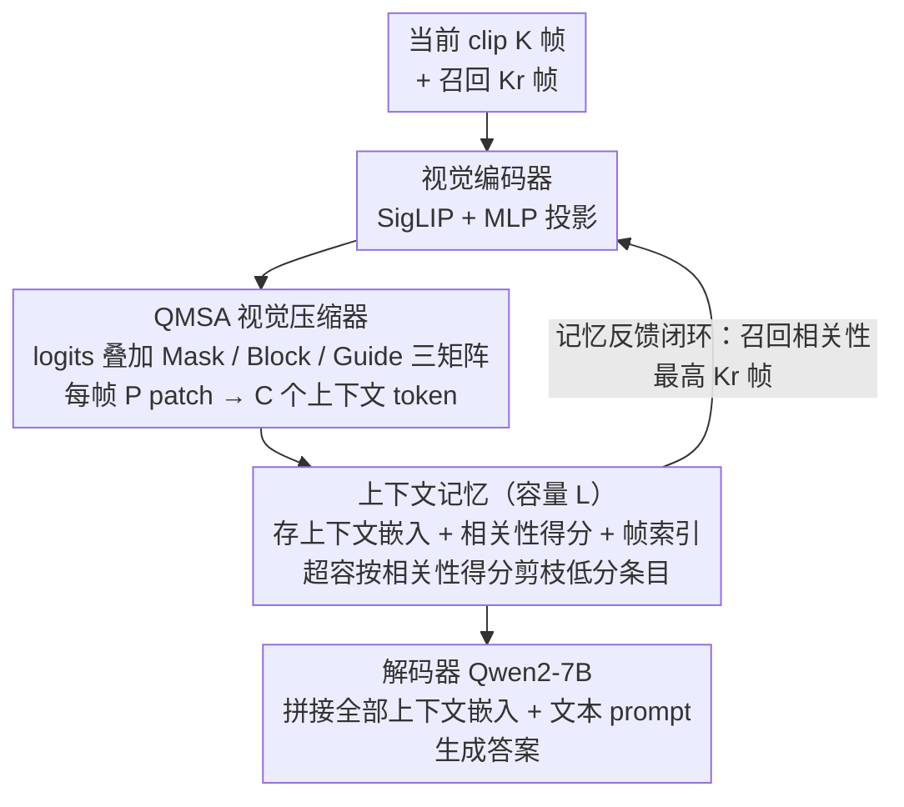

<!-- 由 src/gen_stubs.py 自动生成 -->
# Question-guided Visual Compression with Memory Feedback for Long-Term Video Understanding

**会议**: CVPR2026  
**arXiv**: [2603.15167](https://arxiv.org/abs/2603.15167)  
**代码**: [FujitsuResearch/QViC-MF](https://github.com/FujitsuResearch/QViC-MF)  
**领域**: 视频理解  
**关键词**: 长视频理解, 视觉压缩, 记忆反馈, 问题引导注意力, 大规模多模态模型

## 一句话总结

提出 QViC-MF 框架，通过问题引导的多帧视觉压缩（QMSA）和上下文记忆反馈机制，在长视频理解任务上以极少的视觉 token（每帧仅 16 个）实现了 MLVU/LVBench/VNBench 等多个基准上的 SOTA。

## 研究背景与动机

**长视频理解需求迫切**：监控分析、工业流程监测等现实应用需要模型理解数十分钟到数小时的视频，但 LMM 有限的上下文窗口难以处理完整长视频。

**现有方法逐帧独立压缩**：Transformer 视觉压缩器和记忆增强方法通常对每帧独立压缩，无法捕获跨帧时序依赖，在需要理解完整事件（如时序排列任务）的场景中表现不佳。

**单向感知→记忆的流水线局限**：传统框架将视觉信息先压缩、再存入记忆、最后推理，记忆不会反馈给感知层，一旦遗漏问题相关信息便不可恢复。

**记忆容量有限容易丢失关键帧**：固定容量的记忆在不当更新策略下会遗失与问题相关的视觉细节，影响最终推理质量。

**压缩幻觉问题**：在朴素自注意力设计中，文本 token 信息会泄漏到上下文嵌入中，导致压缩后的表示包含视觉中不存在的语义内容。

**问题不敏感的注意力**：当视觉和文本 token 联合送入自注意力模块时，上下文 token 难以根据问题自适应地关注不同视觉区域。

## 方法详解

### 整体框架

QViC-MF 面对的是「长视频塞不进 LMM 上下文窗口」这个老问题，但它的解法跳出了「压缩→存记忆→推理」的单向流水线，做成一个记忆能反哺感知的闭环。视频被切成一个个 clip 流式处理，每个 clip 只用极少的 token 表示，再靠记忆反馈把历史里和问题相关的帧召回来，喂给当前 clip 的压缩器。

具体五步：① **视觉编码器**把当前 clip（$K$ 帧）和从记忆召回的 $K_r$ 帧拼起来，过 SigLIP So400m/14-384px 提特征，再用 MLP 投影成视觉嵌入 $\mathcal{E}_{v,n} \in \mathbb{R}^{K_v \times P \times D_e}$；② **视觉压缩器**（核心是 QMSA 的 Transformer 编码器）把每帧 $P$ 个 patch token 压成 $C$ 个上下文 token（$C \ll P$），输入是视觉嵌入＋问题嵌入＋可学习上下文种子嵌入的拼接；③ **上下文记忆**存每帧的上下文嵌入、相关性得分和全局帧索引，容量 $L$，超容就剪掉相关性最低的条目；④ **记忆反馈**从记忆里挑相关性最高的 $K_r$ 帧作为下一 clip 的召回帧；⑤ **解码器**（Qwen2-7B）把记忆中所有上下文嵌入和文本 prompt 拼起来生成答案。其中 ②④③ 三步分别对应下面三个关键设计——QMSA 视觉压缩、记忆反馈闭环、相关性得分。

### 关键设计

**1. 记忆反馈闭环：让历史记忆反哺当前帧的压缩**

传统框架「先压缩、再存、最后推理」，记忆从不回流到感知层，一旦某帧漏掉了问题相关的信息就再也找不回来。QViC-MF 把记忆→感知接成回路：每处理完一个 clip，就从记忆中检索相关性最高的 $K_r$ 帧，拼进下一个 clip 一起编码、压缩。这样当前帧的压缩不再是「盲压」，而是带着历史里已知的问题相关线索去压。消融显示这一步是最大增益来源——单纯加记忆（无反馈）反而把 MLVU 从 48.8 拖到 42.4，接上反馈才回升到 52.2。

**2. QMSA：在自注意力 logits 上加三个矩阵，一次解决帧级压缩、压缩幻觉、问题自适应**

朴素自注意力把视觉和文本 token 混在一起做压缩，会带来三个毛病：跨帧信息糊在一起、文本语义泄漏进视觉表示（「压缩幻觉」）、压缩不随问题自适应聚焦。QMSA 不改注意力主体，只在 logits 上叠加三个操作矩阵：

$$\text{QMSA}(\mathbf{Q}, \mathbf{K}, \mathbf{V}) = \text{softmax}\left(\frac{\mathbf{QK}^\top}{\sqrt{D_e}} + \mathbf{M} + \mathbf{B} + \mathbf{G}\right)\mathbf{V}$$

其中 **Masking（$\mathbf{M}$）**把因果掩码扩展到多帧，既允许跨帧时序上下文、又限制每帧的上下文 token 只关注本帧的视觉/上下文 token，实现帧级压缩；**Blocking（$\mathbf{B}$）**直接切断「上下文 token → 文本 token」的注意力通路，堵住文本语义泄漏进视觉压缩表示这条路，专治压缩幻觉；**Guiding（$\mathbf{G}$）**把「文本→视觉」的注意力 logits 取均值，广播成「上下文→视觉」的引导偏置，使压缩自适应地聚焦到问题相关的视觉区域。三者在消融里层层递进，Blocking 单项贡献最大（+4.9 MLVU），Guiding 在稀疏关键事件定位的 VNBench Long 上贡献突出（+2.0）。

**3. 相关性得分：决定记忆里谁该留、谁该被召回**

记忆容量有限，必须有个标准判断哪帧值得留、哪帧值得召回。相关性得分 $r_{n,i}$ 取压缩器中间层（$L_1$ 到 $L_2$）「文本→视觉」注意力权重的 Top-$K_h$ 头均值，既用于超容时的记忆剪枝，也用于记忆反馈时的召回排序。它复用了已有的注意力，几乎零额外开销。

### 损失函数 / 训练策略

只训练上下文种子嵌入和视觉压缩器，基座模型全程冻结；在 LLaVA-Video-7B-Qwen2 上用 LoRA 微调压缩器。训练数据是 LLaVA-Video-178K 中随机抽的 83K 样本（保持领域均衡，约 5%），在 8×H200 GPU 上训练。

## 实验

### 主实验

| 方法 | LLM | Token/帧 | MLVU test | LVBench | VideoMME Long | VNBench Long |
|------|-----|----------|-----------|---------|---------------|-------------|
| LLaVA-Video | Qwen2-7B | 169 | 53.3 | 41.8 | — | 40.4 |
| Flash-VStream | Qwen2-7B | 128 | — | 42.0 | 50.3 | — |
| Video-XL | Qwen2-7B | 16 | 45.5 | — | — | — |
| **QViC-MF (2fps)** | **Qwen2-7B** | **16** | **59.4** | **50.2** | **54.0** | **58.7** |

QViC-MF 在仅使用 16 token/帧的条件下，MLVU test 超越前 SOTA 6.1%，LVBench 超 8.2%，VNBench Long 超 18.3%，VideoMME Long 超 3.7%。

### 消融实验

| 设置 | MLVU test | VNBench Long |
|------|-----------|-------------|
| Vanilla Compressor (64帧) | 48.8 | 39.3 |
| + Context Memory | 42.4 | 40.9 |
| + Memory Feedback | 52.2 | 55.1 |
| + Framewise Mask ($\mathbf{M}$) | 53.0 | 50.7 |
| + Blocking Ctx2Txt ($\mathbf{B}$) | 57.9 | 56.7 |
| + Guiding Ctx2Vis ($\mathbf{G}$) | **59.4** | **58.7** |

### 关键发现

- **记忆反馈是核心增益来源**：单纯加入记忆（无反馈）反而降低 MLVU 性能（48.8→42.4），加入反馈后大幅提升至 52.2。
- **QMSA 三组件层层递进**：Blocking 贡献最大（+4.9 MLVU），Guiding 在 VNBench Long 上贡献显著（+2.0）。
- **极端压缩仍保留高精度**：即使压缩到每帧仅 1 个 token，QMSA 在 MLVU 上仍保留 80%+ 原始准确率，远超单帧压缩和平均池化基线。
- **MLVU 细分任务**：在 Ego Reasoning（71.7）、Action Order（61.4）、Sports QA（58.3）等时序推理任务上增益尤为明显。

## 亮点

- **反馈驱动的感知-记忆闭环**：打破传统单向流水线，让记忆中的历史上下文反哺当前帧的视觉压缩，是长视频理解框架设计上的重要范式转变。
- **QMSA 设计精巧**：通过 Mask/Block/Guide 三个矩阵同时解决帧级压缩、压缩幻觉、问题自适应三个关键问题，实现简洁统一。
- **极高的 token 效率**：每帧仅 16 个 token，远低于 LLaVA-Video（169）和 Flash-VStream（128），在效率和精度之间取得优异平衡。
- **VNBench（NIAH 任务）大幅领先**：Long 子集上超出 LLaVA-Video 18.3%，证明记忆反馈机制在定位稀疏关键事件上极为有效。

## 局限性

- 仅在 7B 规模模型上验证，未探索更大 LLM（如 13B/70B）是否进一步受益。
- 流式处理架构依赖固定 clip 大小和固定召回帧数，缺乏自适应采样策略。
- 记忆容量 $L=256$、召回帧数 $K_r=32$ 等超参对不同视频长度/类型的敏感度未充分讨论。
- 训练仅用 83K 样本，在更大数据规模或多样化任务上的泛化性有待验证。
- 仅评估 MCQ 任务，未涉及开放式生成或 grounding 等更复杂的视频理解形式。

## 相关工作

- **记忆增强 LMM**：MA-LMM、MovieChat、Flash-VStream 等均采用单向记忆策略；QViC-MF 首次引入记忆→感知反馈。
- **视觉压缩**：LLaMA-VID、LLaVA-Mini 等逐帧独立压缩；Video-XL 用摘要 token 压缩长视频但不涉及问题引导。
- **问题感知编码**：InstructBLIP 的 Q-Former、IQViC 等在图像/短视频上探索了问题引导压缩，但均为单帧处理，缺乏跨帧时序建模。
- **帧选择**：Frame-Voyager 等通过关键帧选择降低冗余，与 QViC-MF 的压缩策略互补。

## 评分

- 新颖性: ⭐⭐⭐⭐ — 记忆反馈驱动感知的闭环设计是该领域的新范式，QMSA 对注意力矩阵的三重操控为视觉压缩提供了新思路
- 实验充分度: ⭐⭐⭐⭐ — 四个基准全面评测，消融实验逐层验证各组件，压缩率对比和案例分析丰富
- 写作质量: ⭐⭐⭐⭐ — 问题定义清晰，图示直观（尤其是压缩幻觉的可视化诊断），技术描述严谨
- 价值: ⭐⭐⭐⭐ — 在多个长视频基准上取得显著提升，16 token/帧的高效设计对实际部署有重要意义

<!-- RELATED:START -->

## 相关论文

- [\[ICLR 2026\] FLoC: Facility Location-Based Efficient Visual Token Compression for Long Video Understanding](../../ICLR2026/video_understanding/floc_facility_location-based_efficient_visual_token_compression_for_long_video_u.md)
- [\[CVPR 2026\] Temporally Consistent Long-Term Memory for 3D Single Object Tracking](chronotrack_temporally_consistent_long_term_memory_for_3d_single_object_tracking.md)
- [\[CVPR 2026\] VideoARM: Agentic Reasoning over Hierarchical Memory for Long-Form Video Understanding](videoarm_agentic_reasoning_over_hierarchical_memory_for_long-form_video_understa.md)
- [\[CVPR 2026\] MuKV: Multi-Grained KV Cache Compression for Long Streaming Video Question-Answering](mukv_multi-grained_kv_cache_compression_for_long_streaming_video_question-answer.md)
- [\[CVPR 2026\] StreamingTOM: Streaming Token Compression for Efficient Video Understanding](streamingtom_streaming_token_compression_for_efficient_video_understanding.md)

<!-- RELATED:END -->
