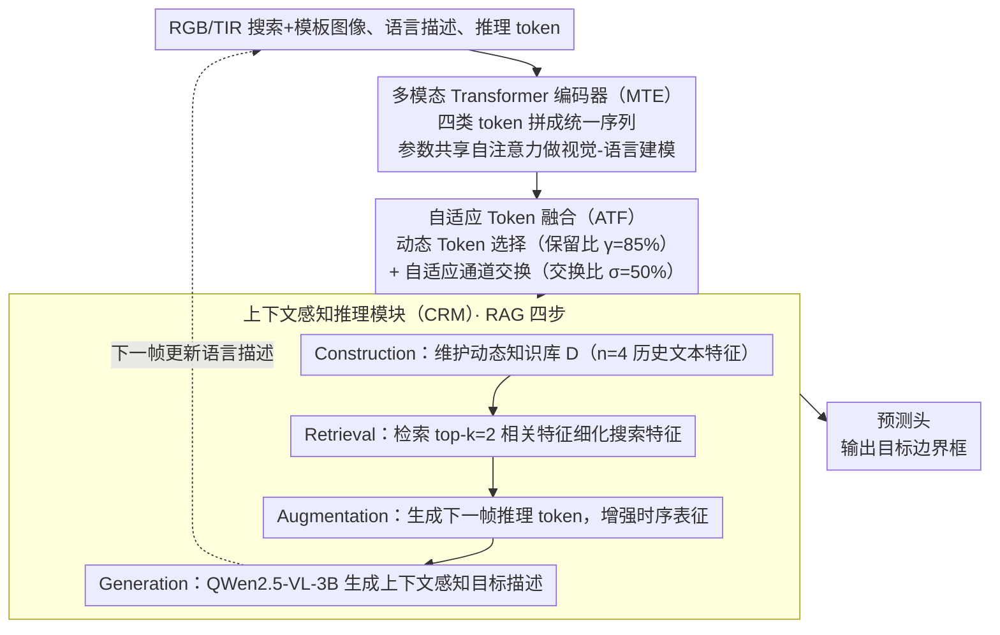

<!-- 由 src/gen_stubs.py 自动生成 -->
# RAGTrack: Language-aware RGBT Tracking with Retrieval-Augmented Generation

**会议**: CVPR2026  
**arXiv**: [2603.03617](https://arxiv.org/abs/2603.03617)  
**代码**: [IdolLab/RAGTrack](https://github.com/IdolLab/RAGTrack)  
**领域**: 视频理解 / RGBT跟踪  
**关键词**: RGBT跟踪, 检索增强生成, 多模态融合, 语言引导跟踪, 自适应Token融合

## 一句话总结

首次将文本描述引入 RGBT 跟踪，提出基于检索增强生成（RAG）的框架 RAGTrack，通过多模态 Transformer 编码器、自适应 Token 融合和上下文感知推理模块，在四个 RGBT 基准上取得 SOTA。

## 背景与动机

1. **RGBT 跟踪的局限**：现有 RGBT 跟踪器仅依赖首帧视觉信息建模目标，当目标外观发生剧烈变化时容易漂移
2. **单帧模板信息不足**：单张模板图像无法涵盖目标在不同视角下的完整外观变化，语义表达能力有限
3. **目标固有歧义**：跟踪器可能混淆前景与背景（如扫帚、簸箕、行人下半身），缺乏高层语义区分能力
4. **搜索区域冗余**：传统方法在 token 级别处理大量冗余背景区域和干扰物，降低跟踪精度
5. **异质模态差距**：RGB 与 TIR 模态之间存在显著的特征差异，阻碍有效的跨模态对应建立
6. **缺乏语言标注**：现有 RGBT 跟踪基准均无文本标注，限制了语言引导跟踪的研究发展

## 方法详解

### 整体框架

RGBT 跟踪长期只靠首帧的视觉模板建模目标，目标外观一变就容易漂、还会把前景和背景（扫帚、簸箕、行人下半身这类）搞混。RAGTrack 第一次把文本描述引进 RGBT 跟踪，并用检索增强生成（RAG）的思路让目标的语言描述跨帧动态更新。它由三块串成：多模态 Transformer 编码器（MTE）做视觉-语言联合建模，自适应 Token 融合（ATF）做跨模态特征融合与去冗余，上下文感知推理模块（CRM）用 RAG 范式做时序语言推理。输入是 RGB/TIR 搜索图像、模板图像和语言描述，输出目标边界框；CRM 末端用 MLLM 生成的新描述回流到下一帧，形成跨帧的 RAG 推理回路。

### 关键设计

**1. 多模态 Transformer 编码器（MTE）：把推理、文本、模板、搜索 token 拼成一条序列统一建模**

要让语言真正参与跟踪，就不能让文本和视觉各算各的。MTE 先用三阶段下采样把模板和搜索图像切成 patch token；语言侧用一个序列前缀 $\mathbf{E}^t$（固定文本提示＋可学习 token）与语言描述 $\mathbf{L}^t$ 拼接后过 CLIP 文本编码器；然后把推理 token $\mathbf{R}_m^t$、文本 token $\hat{\mathbf{H}}^t$、模板 token $\hat{\mathbf{Z}}_m^t$、搜索 token $\hat{\mathbf{X}}_m^t$ 拼成统一序列，RGB/TIR 两支用参数共享的多头自注意力一起做视觉-语言建模。这样文本语义从一开始就和视觉 token 在同一注意力空间里交互。

**2. 自适应 Token 融合（ATF）：无参数选目标 token，再跨模态交换关键通道**

搜索区域里大量是冗余背景和干扰物，而 RGB 与 TIR 之间又有显著模态差距，直接融合不可靠。ATF 用两步应对：**动态 Token 选择**复用自注意力已有的得分，算出搜索 token 对推理/文本/模板/搜索 token 的总注意力 $\mathbf{A}_m^{total}$，按保留比 $\gamma=85\%$ 留下目标相关 token，整步无参数开销；**自适应通道交换**计算 RGB 与 TIR 特征的跨模态通道相关性 $\mathbf{S}$，按交换比 $\sigma=50\%$ 挑出关键通道互换、再经 MLP 融合。两步部署在 HiViT-B 的第 6/12/18/24 层，实现渐进式跨层融合。融合范式对比里，ATF 仅 101.8M 参数就超过 TBSI（145.9M）等更重的方案。

**3. 上下文感知推理模块（CRM）：用 RAG 把历史描述检索回来，跨帧维持目标身份**

单帧模板信息有限，目标剧变时就跟不住。CRM 把 RAG 搬进跟踪，分四步滚动推理：**Construction** 维护一个动态知识库 $\mathbf{D}_m$（存 $n=4$ 个历史文本特征），只有当新特征与已有条目余弦相似度低于阈值 $\lambda=1.0$ 时才入库，避免冗余；**Retrieval** 从库里检索 top-$k=2$ 个最相关特征，经模态内交叉注意力 $\Phi$ 细化搜索特征；**Augmentation** 把推理/文本/模板特征平均池化后拼接、过 MLP 生成下一帧的推理 token，再用交叉注意力和哈达玛积增强时序表征；**Generation** 用 QWen2.5-VL-3B 根据搜索图像和结构化提示动态生成上下文感知的目标描述，持续更新多模态参考。正是这条 RAG 回路让 LasHeR 属性分析里全遮挡（+10.7% PR）、出视野（+5.5% SR）这些外观剧变场景明显获益。

### 损失函数

多任务联合损失 $\mathcal{L} = L_{\text{cls}} + 2 L_{\text{iou}} + 5 L_1$，分类用 focal loss，回归用 L1 + GIoU loss。

## 实验关键数据

### 四大 RGBT 基准 SOTA 对比

| 数据集 | 指标 | RAGTrack | 次优方法 | 提升 |
|---------|------|----------|----------|------|
| GTOT | MPR/MSR | **95.1/79.3** | DMD 94.2/78.6 | +0.9/+0.7 |
| RGBT210 | PR/SR | **93.2/67.1** | AETrack 90.4/66.3 | +2.8/+0.8 |
| RGBT234 | MPR/MSR | **93.8/69.5** | SUTrack 92.1/69.2 | +1.7/+0.3 |
| LasHeR | PR/NPR/SR | **76.8/73.0/61.1** | STTrack 76.0/−/60.3 | +0.8/−/+0.8 |

### 消融实验（RGBT234）

| 配置 | MPR | MSR |
|------|-----|-----|
| Baseline | 87.9 | 64.5 |
| + CRM*（无文本） | 89.1 | 65.0 |
| + MTE + CRM* | 91.1 | 66.7 |
| + MTE + CRM（含文本） | 91.8 | 67.4 |
| + MTE + CRM + ATF（完整） | **93.8** | **69.5** |

### 融合范式对比（RGBT234）

| 方法 | MPR | MSR | 参数量 |
|------|-----|-----|--------|
| TBSI | 92.8 | 67.6 | 145.9M |
| BSI | 93.1 | 68.2 | 103.6M |
| DFM | 92.7 | 67.8 | 110.3M |
| ATF（本文） | **93.8** | **69.5** | **101.8M** |

LasHeR 属性级分析显示：全遮挡（TO）+10.7% PR，出视野（OV）+5.5% SR，表明 CRM 在外观剧变下维持目标身份的能力。

## 亮点

1. **首次将语言描述引入 RGBT 跟踪**：利用 MLLM 自动生成文本标注，扩展四个现有基准（LasHeR 训练集标注 514,081 条描述）
2. **ATF 设计精巧**：无参数 token 选择（复用注意力分数）+ 自适应通道交换，在参数最少的情况下取得最佳融合效果
3. **RAG 范式新颖**：首次将检索增强生成引入 RGBT 跟踪，动态知识库 + 推理 token 传播实现持续时序推理
4. **MLLM 动态描述生成**：克服静态语言标注的局限，跨帧自适应更新目标描述

## 局限与展望

1. **推理开销**：每帧调用 QWen2.5-VL-3B 生成描述，实时性受限，论文未报告 FPS
2. **文本标注依赖 MLLM 质量**：自动生成的文本可能存在幻觉，虽经人工校验但扩展到更大规模数据集时成本高
3. **仅在 RGBT 验证**：框架理论上可迁移到其他多模态跟踪（如 RGB-Depth、RGB-Event），但未做验证
4. **知识库大小固定**：$n=4$ 为手动设定，自适应大小调整可能进一步提升长视频场景性能
5. **训练资源**：4× V100 训练，对轻量化部署场景的适配尚不明确

## 与相关工作的对比

- **vs ViPT/BAT/SDSTrack**（视觉提示学习）：这些方法仅使用视觉 prompt 增强跟踪，缺乏语言级语义；RAGTrack 引入文本描述提供更抽象的目标表示
- **vs RGBL 跟踪（CiteTracker/UVLTrack）**：RGBL 方法面临视觉-语言静态不对齐问题；RAGTrack 通过 MLLM 动态生成描述解决
- **vs TrackingMiM**（唯一引入 RAG 的跟踪工作）：仅复用预存储特征；RAGTrack 通过动态知识库和上下文推理实现真正的 RAG
- **vs SUTrack/AINet**（当前 SOTA）：在 RGBT234 上 ATF 仅 101.8M 参数即超越 SUTrack（384 分辨率），效率更优

## 评分

- 新颖性: ⭐⭐⭐⭐ — 首次在 RGBT 跟踪中引入语言描述和 RAG 范式，ATF 的无参数 token 选择设计新颖
- 实验充分度: ⭐⭐⭐⭐⭐ — 四个基准全面 SOTA，消融涵盖每个组件、超参数、融合范式、注意力分数组合
- 写作质量: ⭐⭐⭐⭐ — 结构清晰，图表丰富，公式推导完整
- 价值: ⭐⭐⭐⭐ — 为 RGBT 跟踪开辟语言引导新方向，但实时性和部署成本需关注

<!-- RELATED:START -->

## 相关论文

- [\[NeurIPS 2025\] VGEnt: Graph-Based Retrieval-Reasoning-Augmented Generation for Long Video Understanding](../../NeurIPS2025/video_understanding/vgent_graph-based_retrieval-reasoning-augmented_generation_for_long_video_unders.md)
- [\[CVPR 2026\] Occlusion-Aware SORT: Observing Occlusion for Robust Multi-Object Tracking](occlusion-aware_sort_observing_occlusion_for_robust_multi-object_tracking.md)
- [\[CVPR 2026\] FC-Track: Overlap-Aware Post-Association Correction for Online Multi-Object Tracking](fc-track_overlap-aware_post-association_correction_for_online_multi-object_track.md)
- [\[ECCV 2024\] Rethinking Video-Text Understanding: Retrieval from Counterfactually Augmented Data](../../ECCV2024/video_understanding/rethinking_video-text_understanding_retrieval_from_counterfactually_augmented_da.md)
- [\[CVPR 2026\] Towards Spatio-Temporal World Scene Graph Generation from Monocular Videos](towards_spatio-temporal_world_scene_graph_generation_from_monocular_videos.md)

<!-- RELATED:END -->
