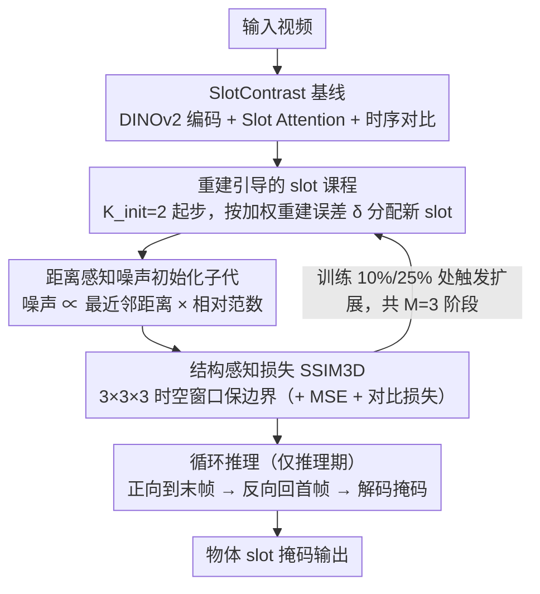

# Reconstruction-Guided Slot Curriculum: Addressing Object Over-Fragmentation in Video Object-Centric Learning

**会议**: CVPR 2026  
**arXiv**: [2603.22758](https://arxiv.org/abs/2603.22758)  
**代码**: [GitHub](https://github.com/wjun0830/SlotCurri)  
**领域**: 视频理解 / 物体中心学习  
**关键词**: 物体中心表征, 过度碎片化, 课程学习, Slot Attention, 视频分割

## 一句话总结

提出 SlotCurri，一种重建引导的 slot 数量课程学习策略，从极少 slot 开始训练并仅在重建误差高的区域逐步扩展 slot 容量，配合结构感知损失和循环推理，有效解决视频物体中心学习中单一物体被多个 slot 错误拆分的过度碎片化问题，在 YouTube-VIS 上实现 +6.8 FG-ARI 提升。

## 研究背景与动机

视频物体中心学习（VOCL）旨在将原始视频分解为紧凑的物体 slot 表征，为下游场景理解、视频分割等任务提供基础。然而现有方法面临严重的**过度碎片化**问题：

- **根本原因**：模型被隐式鼓励利用所有可用 slot 来最小化重建目标——slot 预算越大重建质量通常越高，因此多个 slot 会协同表示同一个物体
- **实际危害**：单一物体被拆分到多个 slot 中，破坏了 slot 与物体的一一对应关系，影响可解释性和计算效率
- **现有解决方案不足**：SOLV 采用先过度生产 slot 再合并的策略，但合并阶段可能失败（对比学习已将 slot 推向编码不同表示）

本文的切入点是**与其事后修补碎片化，不如从源头预防**——把 slot 数量当作课程变量从少到多渐进增加，确保新 slot 只被分配到确实需要更多表达能力的区域。

## 方法详解

### 整体框架

这篇论文要解决的是视频物体中心学习里一个反直觉的副作用：给模型越多 slot，重建越好，于是模型干脆把一个物体拆给好几个 slot 协同表示，破坏了"一个 slot 对应一个物体"的初衷。SlotCurri 的思路不是事后把碎片合并，而是从训练一开始就掐住 slot 的供给——以 SlotContrast 为基线，让 slot 数量本身成为一个课程变量，从极少（$K_{\text{init}}=2$）出发逐步放量，并且每次放量都只把新容量投到"目前重建得最差"的区域。整套训练在 SlotContrast 的时序一致性对比学习之上，叠加了三个新组件：重建引导的 slot 课程、结构感知重建损失 SSIM3D、以及只在推理期生效的循环推理。

### 关键设计

**1. 重建引导的 slot 课程：让新 slot 只长在"没表达好"的地方**

模型之所以会过度碎片化，是因为它被隐式鼓励用满所有 slot 来压低重建误差——slot 越多越好重建，自然就有多个 slot 抢着表示同一个物体。SlotCurri 直接从源头限制供给：训练从 $K_{\text{init}}=2$ 个 slot 起步，经 $M=3$ 个阶段才逐步扩到与基线相同的数量。关键在于"新 slot 给谁"不是随机的。每次阶段转换时，先按注意力权重算出每个 slot 的加权重建误差 $\delta^{(k)} = \sum_{t,h,w} \alpha^{(k,t,h,w)} \cdot \mathcal{L}_{\text{MSE}}^{(t,h,w)}$，再按误差比例把子代名额分给各 slot（误差大的分得多），并用确定性取整保证新增总数精确。比如从 2 个 slot 扩张时，那个还在硬扛大片高残差区域的 slot 会分到额外子代去分裂自己，而已经把背景重建得很干净的 slot 则原样保留——新增的表达力被定向送到真正缺容量的地方。

子代 slot 的初始化也不是简单复制父代，而是做**距离感知的噪声扰动**：

$$\hat{\mathbf{s}}^{(k^*)} = \hat{\mathbf{s}}^{(k)} + \beta \cdot d_{\text{nearest}}^{(k)} \cdot \frac{\|\hat{\mathbf{s}}^{(k)}\|}{\mu_{\text{norm}}} \cdot \mathbf{v}$$

噪声幅度同时正比于父 slot 到最近邻的距离 $d_{\text{nearest}}^{(k)}$ 和它的相对特征范数。这样设计是为了让子代既继承父代已学到的信息，又被推开去探索父代没覆盖到的欠表达区域，而不是退化成一个几乎重复的副本——后者才是真正导致碎片化的原因。

**2. 结构感知重建损失 SSIM3D：在少 slot 阶段守住物体边界**

逐像素的 MSE 把每个像素当独立目标，天然会抹平空间细节和物体边界，而这个毛病在课程早期 slot 极少、单个 slot 要扛一大片区域时尤其致命——边界一糊，后面再扩 slot 也是在模糊的语义基础上分裂。SlotCurri 因此在 $3\times3\times3$ 的时空窗口上加了一项 SSIM3D 损失，显式保留局部对比度和边缘信息，把重建目标从"逐点像素值"拉回到"结构相似"。总损失写成 $\mathcal{L} = \mathcal{L}_{\text{MSE}} + \lambda_{\text{SSC}} \mathcal{L}_{\text{SSC}} + \lambda_{\text{SSIM3D}} \mathcal{L}_{\text{SSIM3D}}$。它和课程学习是配套的：早期就把语义边界锐化清楚，后续 slot 扩张才建立在已经分离干净的物体之上。

**3. 循环推理：让早期帧也用上未来上下文**

视频里靠前的帧天生看不到后面发生了什么，slot 表征在这些帧上容易因缺乏上下文而不稳。循环推理只在推理阶段介入，不改训练：先把 slot 正向传播到最后一帧，再反向传播回第一帧，最后用反向传播得到的 slot 表征去解码掩码，相当于让首帧也"借用"了整段视频的未来信息。这一步几乎不花钱——推理时间只增加 0.3%（286s→287s）。

### 损失函数 / 训练策略

- 总损失：MSE 重建 + SlotContrast 对比 + SSIM3D 结构
- 课程调度：在总迭代的 10% 和 25% 处扩展 slot
- 加速 slot 增长规则：$K^{(m)} = K_{\text{init}} + m \cdot \sigma + 3m(m-1)/2$
- $\sigma$ 按数据集调整（YouTube-VIS: 1, MOVi-C: 3, MOVi-E: 5），保证最终 slot 数与基线一致
- 超参数：β=0.2, λ_SSIM3D=0.05，跨数据集一致
- 硬件：2 × NVIDIA RTX A6000

## 实验关键数据

### 主实验

| 方法 | YouTube-VIS FG-ARI↑ | YouTube-VIS mBO↑ | MOVi-C FG-ARI↑ | MOVi-E FG-ARI↑ |
|------|---------------------|-------------------|-----------------|-----------------|
| STEVE | 15.0 | 19.1 | 36.1 | 50.6 |
| VideoSAUR | 28.9 | 26.3 | 64.8 | 73.9 |
| SlotContrast | 38.0 | 33.7 | 69.3 | 82.9 |
| **SlotCurri** | **44.8±1.2** | **35.5±2.2** | **77.6±0.9** | **83.7±0.2** |

与反碎片化方法对比（Image FG-ARI）：

| 方法 | MOVi-C | MOVi-E |
|------|--------|--------|
| AdaSlot | 75.6 | 76.7 |
| SOLV | — | 80.8 |
| **SlotCurri** | **81.6** | **84.9** |

### 消融实验

YouTube-VIS 上各组件贡献：

| 简单课程 | 重建引导 | SSIM | 循环推理 | FG-ARI | mBO |
|----------|----------|------|----------|--------|-----|
| — | — | — | — | 36.1 | 32.7 |
| ✓ | — | — | — | 38.8 | 32.3 |
| — | ✓ | — | — | 42.6 | 33.7 |
| — | ✓ | ✓ | — | 43.6 | 35.2 |
| — | ✓ | ✓ | ✓ | **44.8** | **35.5** |

超参数敏感性：
- 课程阶段数 M：M=3 最优（44.8），M=2 不足（41.5），M=4 反下降（44.7）
- 扰动系数 β：β=0.2 最佳（44.8），过小（0.1: 42.8）子代太近似父代，过大（0.3: 40.2）噪声破坏有用信息
- SSIM 系数 λ：0.05 最优，过高（0.07）反而伤害

### 关键发现

- 仅简单课程（随机初始化新 slot）就带来 +2.7 FG-ARI 提升，证明渐进扩展本身有效
- 重建引导进一步贡献 +3.8（vs 简单课程），说明有目的地分配新 slot 比随机分配显著更好
- 过度碎片化度量（DOF@0.5）从 1.38 降至 1.26，直接验证碎片化减少
- 物体识别召回率（OIR@0.5）从 24.9% 提升至 30.3%，同时减少碎片化
- 在 MOVi-E 上增益较小，因该数据集主要挑战是欠碎片化（过多小物体），而非过度碎片化

## 亮点与洞察

- **设计哲学优雅**："预防胜于修补"——不是先碎片化再合并，而是从根源上控制 slot 分配
- **距离感知噪声初始化**精心设计——噪声幅度与最近邻距离成正比，既保证子代继承父代信息，又确保其探索新区域
- **SSIM3D 与课程学习的协同**：SSIM 在早期少 slot 阶段帮助锐化语义边界，使后续 slot 扩展建立在已清晰分离的语义基础上
- **循环推理极其轻量**（+0.3% 推理时间），却有效弥补早期帧的上下文不足

## 局限与展望

- 在 MOVi-E 等需要精细分割大量小物体的场景中增益有限（针对欠碎片化无效）
- 课程阶段数和扩展时机目前是手动设定的固定值，场景自适应的调度策略有待探索
- slot 初始数量固定为 2，对物体数量极多的场景可能初始容量不足
- 仅在 DINOv2 骨干上验证，与其他视觉基础模型的兼容性未知
- mBO 指标在合成数据集上未超过 VideoSAUR，可能因后者直接建模运动模式在合成场景下更有优势

## 相关工作与启发

- **与 SOLV 对比**：SOLV 先过度生产再合并，SlotCurri 先约束再扩展——后者在碎片化预防上更根本性
- **课程学习传统**：将样本难度作为课程变量（Bengio 2009），本文创新地将 slot 数量作为课程变量
- **与 AdaSlot 对比**：AdaSlot 自适应调整 slot 数，但不考虑在哪里分配；SlotCurri 根据重建误差定向分配
- **启发**：重建引导的容量扩展策略可推广到其他结构化表征学习（如 capsule network、graph neural network 的节点扩展）

## 评分

- **新颖性**: ⭐⭐⭐⭐ — slot 数量课程学习 + 重建引导扩展是解决过度碎片化的新颖有效方案，但组件设计相对直觉
- **实验充分度**: ⭐⭐⭐⭐⭐ — 真实/合成三个数据集，全面消融，引入 OIR 和 DOF 新指标，定量验证碎片化减少
- **写作质量**: ⭐⭐⭐⭐⭐ — 动机阐述极为清晰，方法推导循序渐进，可视化丰富直观
- **价值**: ⭐⭐⭐⭐ — 为 VOCL 社区提供了实用的训练范式，但应用场景相对垂直

<!-- RELATED:START -->

## 相关论文

- [\[ICLR 2026\] From Vicious to Virtuous Cycles: Synergistic Representation Learning for Unsupervised Video Object-Centric Learning](../../ICLR2026/video_understanding/from_vicious_to_virtuous_cycles_synergistic_representation_learning_for_unsuperv.md)
- [\[CVPR 2025\] Temporally Consistent Object-Centric Learning by Contrasting Slots](../../CVPR2025/video_understanding/temporally_consistent_object-centric_learning_by_contrasting_slots.md)
- [\[CVPR 2026\] TGTrack: Temporal Generative Learning for Unified Single Object Tracking](tgtrack_temporal_generative_learning_for_unified_single_object_tracking.md)
- [\[CVPR 2026\] Robust Promptable Video Object Segmentation](robust_promptable_video_object_segmentation.md)
- [\[AAAI 2026\] Predicting Video Slot Attention Queries from Random Slot-Feature Pairs](../../AAAI2026/video_understanding/predicting_video_slot_attention_queries_from_random_slot-feature_pairs.md)

<!-- RELATED:END -->
