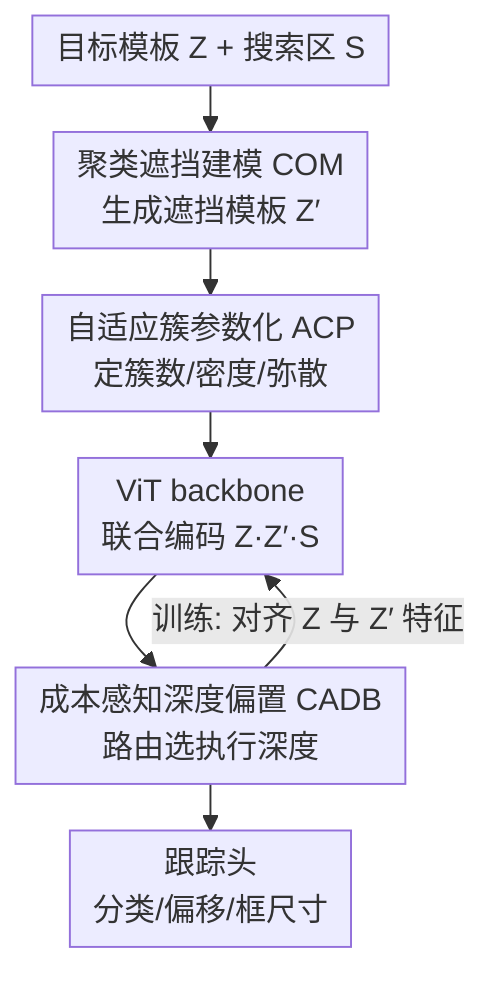

# Rethinking Occlusion Modeling for UAV Tracking

**会议**: CVPR 2026  
**论文**: [CVF Open Access](https://openaccess.thecvf.com/content/CVPR2026/html/Zhang_Rethinking_Occlusion_Modeling_for_UAV_Tracking_CVPR_2026_paper.html)  
**代码**: 无  
**领域**: 视频理解  
**关键词**: UAV跟踪, 遮挡建模, 聚类掩码, 动态深度, 单流Transformer

## 一句话总结
针对无人机视角下遮挡呈"成块出现"的真实特性，本文用聚类采样生成空间相关的遮挡掩码（COM）来训练更鲁棒的表征，再用一条与层成本挂钩的深度偏置（CADB）让推理自动停在更浅的层，二者合成的 OCTrack 在四个 UAV benchmark 上做到了精度与 265 FPS 实时速度的良好平衡。

## 研究背景与动机

**领域现状**：无人机视觉跟踪已经从相关滤波（DCF）一路走到基于 Transformer 的单流架构（MixFormer、OSTrack、DropMAE），把模板特征提取和模板-搜索区交互统一进一个网络。近期工作（AVTrack、SGLATrack、Aba-ViTrack）又在单流之上加了自适应 token 调度、动态深度控制，在机载算力受限的前提下追求实时推理。

**现有痛点**：无人机场景里目标小、运动突变、且频繁被遮挡，遮挡会切断时空连续性。但现有 Transformer 跟踪器在做遮挡增强时，普遍把遮挡当成"随机的信息丢失"——也就是在 patch 上独立、均匀地随机 mask。这种处理方式忽略了真实遮挡的结构：无人机俯视下的遮挡往往来自成片的建筑、植被、车流，是**空间上聚集、局部强相关、且有尺度连续性**的，会同时抹掉目标外观和它周围的上下文线索，导致特征表征不一致、定位抖动。

**核心矛盾**：一是"合成遮挡"与"真实遮挡物理特性"之间的鸿沟——随机 mask 模拟不出聚块遮挡；二是"精度与效率"之间的 trade-off——ViT 计算量随深度线性增长，深层特征冗余且边际收益递减，但现有动态推理（按相关性激活/跳层）并没有显式建模"算力偏好"，难以随场景复杂度自适应。

**切入角度**：作者把遮挡重新理解为"受空间依赖支配的结构化过程"。已有工作（ORTrack）用空间 Cox 过程引入了一点空间相关性，但它假设连续强度场、无法刻画真实场景里的空间聚簇。于是作者从"遮挡是成簇出现的"这个观察切入，去生成可控的、聚类的、语义一致的掩码。

**核心 idea**：用"聚类遮挡建模 + 成本感知深度偏置"代替"随机掩码 + 固定深度"，一边把表征训得对结构化遮挡鲁棒，一边让推理深度按需收缩，从而同时拿到鲁棒性和实时性。

## 方法详解

### 整体框架
OCTrack 是一个单流 Transformer 跟踪器，由一个 ViT backbone 加一个轻量的中心式预测头构成。输入是目标模板 $Z\in\mathbb{R}^{3\times H_z\times W_z}$ 和搜索区 $S\in\mathbb{R}^{3\times H_s\times W_s}$。训练时，COM 先把模板复制出一个聚类遮挡版本 $Z'=\mathcal{M}_{com}(Z)$，原模板、遮挡模板、搜索区一起被切成 patch token 送进 backbone 联合编码；COM 通过对齐 $Z$ 与 $Z'$ 的特征表征，逼模型学到"遮挡不变"的表示。CADB 则在 backbone 内部插入一个路由器，根据"算力敏感先验"决定推理走到哪一层，让简单帧停在浅层、难帧才往深层走。最后融合特征交给跟踪头输出分类置信图、位置偏移和框尺寸。关键是：COM 只在训练期工作、推理零额外开销；CADB 在推理期只激活被选中的那一层、绕过其余层来省算力。

### 关键设计

**1. 聚类遮挡建模 COM：把随机掩码换成成簇采样的空间过程**

随机 mask 把每个 patch 独立丢弃，模拟不出真实无人机场景里"一片建筑/植被同时挡住目标和上下文"的聚块遮挡，于是训练出来的特征对结构化遮挡不鲁棒。COM 的做法是把遮挡建模成一个可控的聚类空间过程。给定模板特征图 $Z\in\mathbb{R}^{C\times H\times W}$ 和掩码比例 $\rho\in(0,1)$，被遮 patch 数 $K=\lfloor\rho HW\rfloor$。空间域上的遮挡强度被建模为高斯场的混合：

$$\pi(p)\propto\sum_{i=1}^{N_p} w_i\exp\!\left(-\frac{\lVert p-c_i\rVert^2}{2\sigma^2}\right)$$

其中簇数 $N_p\sim\text{Poisson}(\lambda_p HW)$，簇中心 $c_i$ 采样得到，单簇强度 $w_i\sim\text{Poisson}(\mu)$。每个簇按 $p_{i,j}\sim\mathcal{N}(c_i,\sigma^2 I_2)$ 撒出 $w_i$ 个遮挡点，所有点的并集构成最终掩码 $M$，必要时随机下采样以维持比例 $\rho$。和 Cox 过程的固定连续强度场相比，COM 是"先定几个中心、再在中心周围成簇撒点"，天然带空间聚集和尺度连续，更贴近真实俯视遮挡。

**2. 自适应簇参数化 ACP：让遮挡风格随特征图和遮挡比例可调**

光有聚类采样还不够——不同尺寸的特征图、不同遮挡强度需要不同的遮挡形态。ACP 用三元组 $P=(\lambda_p,\mu,\sigma)$ 来参数化：$\lambda_p$ 决定期望簇数，$\mu$ 控制每簇平均遮挡强度，$\sigma$ 调节空间弥散程度，三者会根据特征图大小、掩码比例和遮挡风格联动调整。论文据此定义了三档风格：dense（30 簇、小 $\sigma$，对应小而密的遮挡）、balanced（10 簇、中 $\sigma$）、sparse（3 簇、大 $\sigma$，对应大块稀疏遮挡），$\sigma$ 随 $\min(H,W)$ 缩放。这样模型在训练中能见到从稀疏到稠密的连续遮挡分布，把"可控粒度 + 结构连贯"喂给表征学习。

**3. 遮挡鲁棒表征对齐：用一致性损失把"遮挡不变性"训进特征里**

为了让 COM 产生的遮挡真正转化为鲁棒性，COM 加了一个表征对齐目标：把原模板和聚类遮挡模板送进同一网络，最小化两者在第 $L$ 层特征的差异

$$\mathcal{L}=\big\lVert t^{(L)}_{Z}-t^{(L)}_{Z'}\big\rVert_2^2$$

其中 $t^{(L)}_{Z}$、$t^{(L)}_{Z'}$ 分别是 $Z$ 和 $Z'=\mathcal{M}_{com}(Z)$ 的特征表示。这一项强迫遮挡前后的表征对齐，抑制聚块遮挡引起的外观漂移，保住语义一致性。因为只在训练用，推理期没有任何额外开销，可即插即用进任意 ViT 跟踪器。

**4. 成本感知深度偏置 CADB：把"算力偏好"写进层路由里**

ViT 计算量随深度线性增长、深层特征冗余，但现有跳层策略只看"任务相关性/层间相似性"，没显式建模"我更想走浅层"这件事。CADB 把层选择变成一个被偏置调控的路由过程。它用一个两层 MLP 路由器（中间 ReLU）读取参考层 $i_{ref}$ 处融合序列首 token 作为全局描述子，输出后续 $L$ 个候选层的重要性分数 $y=f(x)\in\mathbb{R}^L$。再对每层加一条随深度递减的成本偏置：

$$b_i=\kappa\left[1-2(i-i_{ref})/(L-1)\right]$$

$\kappa>0$ 控制偏向浅层的强度。最终路由概率 $p=\text{softmax}((y+b)/\tau)$，温度 $\tau$ 调节选择分布的尖锐度。训练时用层间对齐信号造伪标签：对齐分 $s_i=(F_{i_{ref}}\cdot F_i)/(\lVert F_{i_{ref}}\rVert_2\lVert F_i\rVert_2)$，把对齐分最高的层 $i^\star=\arg\max_i s_i$ 当作代表层、做成 one-hot 标签 $t_i$，用偏置校正后的交叉熵优化路由器：

$$\mathcal{L}_{route}=-\sum_{i=1}^{L} t_i\log\frac{\exp(y_i+b_i)}{\sum_{j=1}^{L}\exp(y_j+b_j)}$$

机制上很巧：深度偏置往"浅"推，而对齐监督在"特征差异大（说明浅层不够）"时把路由器往"深"拉，两股力量自然博弈出"简单帧走浅、难帧走深"的行为。推理时 CADB 直接按偏置校正后的路由分选执行深度，只激活代表层、绕过其余层，不需要任何额外运行时机制。

### 损失函数 / 训练策略
跟踪头沿用中心式设计（Conv-BN-ReLU），同时预测分类置信图 $p$、位置偏移 $o$、归一化框尺寸 $s$。整体损失把跟踪目标和路由正则合在一起：

$$\mathcal{L}=\mathcal{L}_{cls}+\lambda_{iou}\mathcal{L}_{iou}+\lambda_{L1}\mathcal{L}_{L1}+\gamma\mathcal{L}_{route}$$

分类用加权 focal loss，回归用 L1 + GIoU，权重 $\lambda_{iou}=2$、$\lambda_{L1}=5$、$\gamma=0.1$。训练数据为 GOT-10k + LaSOT + COCO + TrackingNet，AdamW 优化（weight decay $10^{-4}$，初始学习率 $4\times10^{-5}$，batch 32），backbone 用 DeiT-Tiny / ViT-Tiny / Eva-Tiny 三种轻量变体，模板/搜索图分别为 128×128 / 256×256。

## 实验关键数据

### 主实验
四个 UAV benchmark（DTB70 / UAVDT / VisDrone2018 / UAV123）上与轻量跟踪器对比，OCTrack-DeiT 在精度、AUC 与速度间取得平衡（下表为平均值，FPS 为 GPU 实测）：

| 方法 | 来源 | 平均 P(%) | 平均 AUC(%) | GPU FPS | 参数量(M) |
|------|------|-----------|-------------|---------|-----------|
| RACF（DCF） | PR'22 | 75.9 | 51.8 | – | – |
| DRCI（CNN） | ICME'23 | 81.4 | 60.1 | 281.3 | 8.8 |
| AVTrack | ICML'24 | 84.2 | 63.8 | 210.5 | 7.9 |
| ORTrack（Cox 遮挡） | CVPR'25 | 85.6 | 65.0 | 182.6 | 7.9 |
| SGLATrack | CVPR'25 | – | – | 243.9 | 5.8 |
| **OCTrack-b** | 本文 | **86.0** | **65.7** | **265.2** | 5.8–8 |

OCTrack 全部变体平均精度 >84%、AUC >64%；OCTrack-b 综合最均衡，在 UAVDT 上拿到最佳 85.0% / 63.0%。在 UAVDT 的"部分遮挡"子集（OPE）上，OCTrack-DeiT 取得最高 0.656 AUC，比次优方法高约 3 个百分点。

### 消融实验
组件消融（UAVDT，逐步加入 COM 与 CADB；FPS 在加入 CADB 后报告）：

| Backbone | COM | CADB | P(%) | AUC(%) | FPS |
|----------|-----|------|------|--------|-----|
| OCTrack-DeiT | | | 80.4 | 59.6 | 197.6 |
| OCTrack-DeiT | ✓ | | 85.2 (+4.8) | 62.9 (+3.3) | – |
| OCTrack-DeiT | ✓ | ✓ | 85.0 (+4.6) | 63.0 (+3.4) | 265.2 (+34%) |
| OCTrack-ViT | ✓ | ✓ | 84.2 (+4.5) | 61.6 (+2.8) | 248.8 (+34%) |
| OCTrack-Eva | ✓ | ✓ | 80.6 (+3.0) | 59.9 (+2.6) | 280.6 (+25%) |

掩码策略对比（VisDrone2018，OCTrack-DeiT）：

| 掩码策略 | AUC(%) | 说明 |
|----------|--------|------|
| MAE 随机掩码 | 62.9 | 独立 patch 丢弃，最差 |
| CutMix | 63.6 | 区域级增强，无空间聚簇 |
| SAM | 64.8 | 语义级，仍缺聚簇 |
| Cox Process（ORTrack） | 65.9 | 有空间相关，但固定强度场 |
| **COM** | **67.0** | 聚类掩码，最佳 |

### 关键发现
- **COM 是涨点主力**：在三种 backbone 上分别带来 +4.0% / +3.6% / +4.8% 精度，证明"空间聚类掩码"比随机/语义掩码更能正则化遮挡下的特征学习；COM 只在训练用，推理不掉速。
- **CADB 是省算力主力**：加入后 GPU 吞吐 +34% / +25% / +34%，而精度几乎不变，说明很多帧走浅层就够了。
- **偏置强度 $\kappa$ 可控折中**：$\kappa$ 越大路由越偏浅层、FPS 越高（$\kappa=0\to0.5$ 时 DTB70 上 FPS 从 197.6 升到 278.4），AUC 基本稳定，$\kappa=0.3$ 是较好折中（265.2 FPS、DTB70 AUC 66.0%）。
- **遮挡风格各有所长**：dense 设置（OCTrack-d）在遮挡密集、目标交互频繁的 UAV123/VisDrone2018 上 AUC 最高（67.7% / 66.3%），balanced 设置则整体最稳。

## 亮点与洞察
- **把"遮挡的统计结构"当成可建模对象**：从"随机丢 patch"升级到"成簇撒点的高斯混合场"，这是个简洁但对路的视角转换——真实俯视遮挡确实是成片的，用 Poisson 定簇数 + Gaussian 定簇形把这件事参数化得很干净。
- **CADB 的"双向博弈"很巧**：深度偏置硬往浅推、对齐监督在特征不够时往深拉，不需要复杂的强化学习或门控，一条线性偏置 + 一个对齐伪标签就把"按需深度"训出来了，且推理零额外机制。
- **训练增强 + 推理加速解耦**：COM 管鲁棒性（只在训练）、CADB 管效率（只在推理），互不干扰、都能即插到任意 ViT 跟踪器，工程上很友好。
- 可迁移：聚类掩码思路可用于任何"遮挡/缺失有空间结构"的任务（如自动驾驶 BEV 遮挡、医学图像缺失区域增强）；成本感知深度偏置可推广到其他需要"难度自适应早退"的 ViT 推理场景。

## 局限与展望
- **遮挡风格靠手工档位**：dense/balanced/sparse 三档及其 $\lambda_p,\mu,\sigma$ 是预设的，并非真正按每帧场景在线自适应，换数据集可能要重调；ACP 的"自适应"更多是随特征图尺寸/比例缩放，而非感知真实遮挡分布。
- **CADB 在硬路由下每个 $\kappa$ 只走固定一层**：论文里 ASLI（平均选择层索引）在硬路由时退化为该层索引，意味着推理深度更像"按 $\kappa$ 选一个全局深度"，而非真正逐帧动态变化，"难帧走深"的自适应程度有待更细的实验佐证。
- **未给 arXiv/开源**：缓存中无代码链接，复现需自行实现 ACP 采样与路由伪标签，⚠️ 部分公式细节（如 $w_i$ 的取整与 $\rho$ 维持的具体下采样规则）以原文为准。
- 实验集中在轻量 backbone 与 UAV 小目标场景，遮挡建模在大模型/通用跟踪（如 LaSOT 长时跟踪）上的增益尚未验证。

## 相关工作与启发
- **vs ORTrack（CVPR'25，空间 Cox 过程遮挡）**：两者都认同"遮挡有空间结构"，但 ORTrack 用连续强度场的 Cox 过程，假设强度场固定、刻画不了聚簇；本文 COM 用"先定簇中心再成簇撒点"的高斯混合，显式建模空间聚集，VisDrone2018 上 AUC 从 65.9% 提到 67.0%。
- **vs MAE 随机掩码 / DropMAE**：MAE 式随机 patch 丢弃把遮挡当独立噪声，COM 证明在 UAV 场景这会低估遮挡的结构性，随机掩码 AUC 只有 62.9%、远低于 COM 的 67.0%。
- **vs AVTrack / SGLATrack（动态 token/深度调度）**：它们按任务相关性或层间相似性激活/跳层，但没把"算力成本"显式写进路由；CADB 用一条随深度递减的成本偏置直接编码"偏好浅层"，在保持精度的同时把 DeiT 变体 GPU 吞吐拉高 34%。

## 评分
- 新颖性: ⭐⭐⭐⭐ 把遮挡重建为"聚类空间过程"并配上成本感知深度路由，视角清晰、组合新颖，但单看每块都站在已有工作（Cox 遮挡、动态深度）肩上。
- 实验充分度: ⭐⭐⭐⭐ 四个 UAV benchmark + 三种 backbone + 掩码策略/偏置强度消融较完整，但缺通用跟踪基准与在线自适应的验证。
- 写作质量: ⭐⭐⭐⭐ 动机递进清楚、公式完整，COM 与 CADB 两条线讲得分明。
- 价值: ⭐⭐⭐⭐ 训练增强即插即用 + 推理实时（265 FPS），对机载实时 UAV 跟踪有直接落地价值。

<!-- RELATED:START -->

## 相关论文

- [\[CVPR 2026\] Occlusion-Aware SORT: Observing Occlusion for Robust Multi-Object Tracking](occlusion-aware_sort_observing_occlusion_for_robust_multi-object_tracking.md)
- [\[CVPR 2026\] FlexHook: Rethinking Two-Stage Referring-by-Tracking in RMOT](rethinking_two-stage_referring-by-tracking_in_referring_multi-object_tracking_ma.md)
- [\[CVPR 2026\] Toward Low-Cost yet Effective Temporal Learning for UAV Tracking](toward_low-cost_yet_effective_temporal_learning_for_uav_tracking.md)
- [\[CVPR 2026\] Breaking Smooth-Motion Assumptions: A UAV Benchmark for Multi-Object Tracking in Complex and Adverse Conditions](breaking_smooth-motion_assumptions_a_uav_benchmark_for_multi-object_tracking_in_.md)
- [\[CVPR 2026\] Beyond Explicit Language: Plug-and-Play Visual-to-Linguistic Modeling Toward General Object Tracking](beyond_explicit_language_plug-and-play_visual-to-linguistic_modeling_toward_gene.md)

<!-- RELATED:END -->
