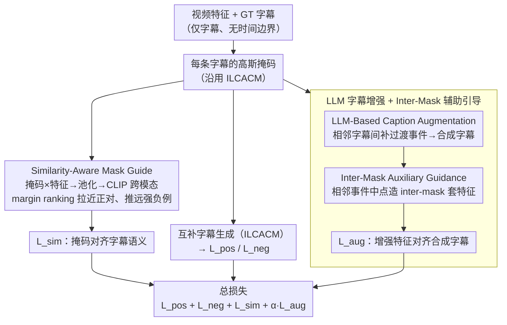

# SAIL: Similarity-Aware Guidance and Inter-Caption Augmentation-based Learning for Weakly-Supervised Dense Video Captioning

**会议**: CVPR 2026  
**arXiv**: [2603.05437](https://arxiv.org/abs/2603.05437)  
**代码**: 无  
**领域**: 视频理解  
**关键词**: 弱监督密集视频描述, 跨模态对齐, LLM数据增强, 高斯掩码, 事件定位

## 一句话总结
提出 SAIL，通过跨模态相似度引导的语义感知掩码生成和 LLM 合成字幕的辅助监督，在仅有字幕标注（无时间边界）的弱监督设置下，在 ActivityNet 和 YouCook2 上实现密集视频描述和事件定位的双 SOTA。

## 研究背景与动机
Dense Video Captioning（DVC）要求在未裁剪视频中同时定位事件并生成描述。全监督方法依赖昂贵的时间边界标注，弱监督 DVC（WSDVC）仅使用字幕标注训练。

**现有方法的核心问题**：当前 SOTA 方法 ILCACM 使用高斯掩码策略，通过互补字幕生成实现隐式事件定位。但其掩码学习存在两个根本缺陷：

**掩码缺乏语义对齐**：仅学习不重叠的掩码分布，不考虑掩码与对应事件的语义关系。实验发现，即使是固定的、不可训练的均匀分布掩码，性能也与 ILCACM 相当——说明现有方法仅学到了覆盖不同时间区域，而非捕捉语义相关区域

**标注稀疏性**：现有数据集事件标注极度稀疏。例如 ActivityNet 中一个 235 秒的视频可能仅有 3 个事件标注，大量潜在事件未被标注。尽管标注可能覆盖整个视频时长，但事件密度始终很低

## 方法详解

### 整体框架
WSDVC 的训练只有「视频 + 几条字幕」、没有事件的时间边界，前作 ILCACM 的做法是给每条字幕配一个可学的高斯掩码、靠「互补字幕生成」隐式地把掩码推到不同时间段。SAIL 沿用这套高斯掩码 + 互补生成的骨架，但针对它的两个软肋各打一个补丁：一是让掩码不再只是「占住一段时间」，而是真正对齐到字幕描述的语义内容（Similarity-Aware Mask Guide）；二是用 LLM 把稀疏的字幕标注补密，并把补出来的合成字幕安全地喂回训练（Caption Augmentation + Inter-Mask）。整条流程仍是「视频特征 → 每条字幕的高斯掩码 → 掩码后特征做互补字幕生成」，SAIL 只是在掩码这一步加了语义对齐的约束、在字幕这一侧加了更密的监督。

### 关键设计

**1. Similarity-Aware Mask Guide：用跨模态相似度逼掩码对齐语义，而不是只占时间段**

前面动机里那个扎心的实验——固定的均匀掩码竟和 ILCACM 打平——说明旧掩码学到的只是「彼此不重叠」，并不知道自己框住的那段视频到底讲的是不是对应字幕的内容。SAIL 的修法是把掩码学习直接接到 CLIP 的跨模态空间里：生成掩码 $M_i$ 后与视频特征逐元素相乘得到正掩码特征 $\boldsymbol{v}'_i = \boldsymbol{v} \cdot M_i$，平均池化成 $\bar{\boldsymbol{v}}'_i$，然后要求它和对应字幕特征 $\boldsymbol{c}_i$ 的余弦相似度尽量高、和同视频里其它字幕的相似度尽量低。用一个 margin ranking loss 把这个「亲近正对、推远强负例」的要求写实：

$$\mathcal{L}_{\text{sim}} = \frac{1}{B}\sum_{b=1}^{B}\frac{1}{N_s}\sum_{i=1}^{N_s}\max(0,\, \Delta - s^+_{b,i} + s^-_{b,i})$$

其中 $s^+ = \text{sim}(\bar{\boldsymbol{v}}'_i, \boldsymbol{c}_i)$ 是掩码特征与自己字幕的相似度，$s^- = \max_{j \neq i}\text{sim}(\bar{\boldsymbol{v}}'_i, \boldsymbol{c}_j)$ 取同视频里最像的那条「别人」字幕作强负例。这样掩码就从「覆盖不同区域」的弱约束，被升级成「框住的内容必须和这条字幕语义一致」的强约束——也正是这一项单独加上去就把 CIDEr 拉了 +1.76。

**2. LLM-Based Caption Augmentation：用 LLM 补出过渡事件，缓解标注太稀疏**

WSDVC 数据集的另一个痛点是标注密度极低——一个 235 秒的 ActivityNet 视频可能只标了 3 条字幕，掩码之间大片时间没有任何字幕能对齐。SAIL 让 LLM 来填这些缝隙：对每一对相邻 GT 字幕 $(C_i, C_{i+1})$，在它们之间的时间间隔生成一条合成字幕 $C^{syn}_i$，于是每个视频额外多出 $N_s - 1$ 条监督。prompt 把 LLM 设定成「视频上下文推理专家」，让它读懂前后两条字幕的叙事流、推断中间最可能发生的过渡动作或状态变化（实现用 Qwen3-8B ⚠️ 以原文为准）。这一步借的是 LLM 的世界知识和叙事推理能力，把「只有 1-2 个事件标注」的视频也补出可用的对齐信号。

**3. Inter-Mask Auxiliary Guidance：把合成字幕放在相邻事件之间，当辅助信号而非强负例**

补出来的合成字幕怎么用是有讲究的——作者发现若直接把它塞进主损失当强负例，噪声反而拖垮性能（Table 6 证实）。于是 SAIL 给合成字幕单独造一个「inter-mask」，专门落在相邻两个事件掩码之间的过渡地带：对每对相邻事件中心 $(c_i, c_{i+1})$，inter-mask 的中心取两者均值 $c^{inter}_i = \frac{c_i + c_{i+1}}{2}$，宽度固定为超参 $w^{inter}$。把这个 inter-mask 套到视频特征上得到增强特征，再用余弦相似度损失把它和对应的合成字幕拉近：

$$\mathcal{L}_{\text{aug}} = \frac{1}{B}\sum_{b=1}^{B}\frac{1}{N_s-1}\sum_{i=1}^{N_s-1}\bigl(1 - \text{sim}(\bar{\boldsymbol{v}}'^{inter}_{b,i}, \boldsymbol{c}^{syn}_{b,i})\bigr)$$

举个具体的：一条字幕是「厨师把面糊倒进锅里」、下一条是「厨师把煎饼翻面」，LLM 补出的过渡字幕大致是「面糊在锅里慢慢凝固成型」，对应的 inter-mask 就盖在这两个事件中心的中点附近那段时间——增强特征只需和这条过渡描述对齐，而不必去和正样本字幕争抢，所以是一种「软叙事引导」而非「硬约束」，比当强负例稳健得多。

### 损失函数 / 训练策略
- 最终目标：$\mathcal{L} = \mathcal{L}_{\text{pos}} + \mathcal{L}_{\text{neg}} + \mathcal{L}_{\text{sim}} + \alpha_{\text{aug}}\mathcal{L}_{\text{aug}}$
- $\mathcal{L}_{\text{pos}}$/$\mathcal{L}_{\text{neg}}$：正/负互补字幕生成损失（继承自 ILCACM）
- 超参数：$\Delta=0.1$, $w^{inter}=0.6$, $\alpha_{\text{aug}}=0.25$
- 字幕解码器：Distilled-GPT2，AdamW 优化器
- ActivityNet: lr=1e-4, 10 epochs; YouCook2: lr=5e-5, 5+15 epochs

## 实验关键数据

### 主实验

| 数据集 | 指标 | SAIL | ILCACM (前SOTA) | 提升 |
|--------|------|------|-----------------|------|
| ActivityNet | CIDEr | 35.38 | 33.42 | +1.96 |
| ActivityNet | SODA_c | 6.29 | 6.08 | +0.21 |
| ActivityNet | F1 (定位) | 57.00 | 56.20 | +0.80 |
| YouCook2 | CIDEr | 14.61 | 13.49 | +1.12 |
| YouCook2 | F1 (定位) | 20.94 | 17.88 | +3.06 |

SAIL 弱监督在多数指标上超越全监督方法 CM2 和 E2DVC。

### 消融实验

| 配置 | SODA_c | CIDEr | F1 | 说明 |
|------|--------|-------|-----|------|
| Baseline (ILCACM) | 6.08 | 33.42 | 56.20 | 无语义引导 |
| +Similarity-aware | 6.27 | 35.18 | 56.89 | 语义对齐掩码 |
| +Synthetic captions | 6.29 | 34.92 | 56.79 | LLM 增强监督 |
| +Both (SAIL) | 6.29 | 35.38 | 57.00 | 最佳组合 |

### 关键发现
- 语义感知掩码单独使用即可提升 CIDEr +1.76，证明对齐损失的有效性
- 合成字幕作为辅助信号（inter-mask）优于作为强负例（+HN）策略
- 即使只使用 25% 合成字幕也能改善性能，且随比例增加单调提升
- SAIL 在高斯掩码、Hard Binary 掩码、Cauchy 掩码三种设计下均一致提升，证明方法的通用性
- 训练开销几乎不变：1h41m vs ILCACM 的 1h38m，推理甚至略快（7m01s vs 7m11s）

## 亮点与洞察
1. **固定掩码实验的启示**：均匀分布的不可训练掩码与 ILCACM 性能相当，深刻揭示了现有方法"学到的"掩码其实缺乏语义信息
2. **LLM 增强的精妙用法**：不直接将合成字幕混入主损失（会引入噪声），而是通过 inter-mask 作为独立辅助信号——"软叙事引导"而非"硬约束"
3. **弱监督超越全监督**：在 ActivityNet 定位 F1 上与全监督方法持平，字幕质量部分指标超越，说明语义对齐是比时间边界标注更本质的监督信号

## 局限与展望
- SODA_c 提升幅度较小（+0.21），叙事连贯性改善有限
- LLM 生成的合成字幕质量取决于 LLM 的世界知识，可能在专业领域（如烹饪、体育）不够精确
- inter-mask 宽度 $w^{inter}$ 为固定超参，未自适应调整
- 仅在两个数据集上验证，未在更大规模或不同类型数据集上测试

## 相关工作与启发
- 建立在 ILCACM（当前 WSDVC SOTA）的互补字幕生成基础上，以最小修改获得显著提升
- 借鑒 CLIP 跨模态对齐能力引导时序掩码学习，思路可推广到其他弱监督视频理解任务
- LLM 生成过渡事件描述的思路很有启发——利用 LLM 的叙事推理能力补全稀疏标注
- 对弱监督视频 grounding、时序动作检测等任务有参考价值

## 评分
- 新颖性: ⭐⭐⭐ 核心思路直觉清晰，但技术贡献偏增量（在 ILCACM 上加损失+增强）
- 实验充分度: ⭐⭐⭐⭐ 消融全面，包括掩码类型、数据比例、利用策略等多维度
- 写作质量: ⭐⭐⭐⭐ 动机分析透彻，固定掩码实验的洞察非常有说服力
- 价值: ⭐⭐⭐ 弱监督超全监督有实际意义，但改进幅度不大
- 价值: 待评

<!-- RELATED:START -->

## 相关论文

- [\[CVPR 2026\] Weakly Supervised Video Anomaly Detection with Anomaly-Connected Components and Intention Reasoning](weakly_supervised_video_anomaly_detection_with_anomaly-connected_components_and_.md)
- [\[CVPR 2026\] Stay in your Lane: Role Specific Queries with Overlap Suppression Loss for Dense Video Captioning](stay_in_your_lane_role_specific_queries_with_overlap_suppression_loss_for_dense_.md)
- [\[AAAI 2026\] Learning to Tell Apart: Weakly Supervised Video Anomaly Detection via Disentangled Semantic Alignment](../../AAAI2026/video_understanding/learning_to_tell_apart_weakly_supervised_video_anomaly_detection_via_disentangle.md)
- [\[AAAI 2026\] Explicit Temporal-Semantic Modeling for Dense Video Captioning via Context-Aware Cross-Modal Interaction](../../AAAI2026/video_understanding/explicit_temporal-semantic_modeling_for_dense_video_captioning_via_context-aware.md)
- [\[CVPR 2025\] Progress-Aware Video Frame Captioning](../../CVPR2025/video_understanding/progress-aware_video_frame_captioning.md)

<!-- RELATED:END -->
