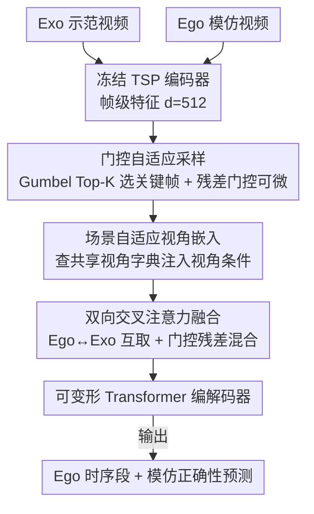

# SAVA-X: Ego-to-Exo Imitation Error Detection via Scene-Adaptive View Alignment and Bidirectional Cross View Fusion

**会议**: CVPR 2026  
**arXiv**: [2603.12764](https://arxiv.org/abs/2603.12764)  
**代码**: [GitHub](https://github.com/jack1ee/SAVAX)  
**领域**: 视频理解  
**关键词**: 跨视角, 模仿错误检测, 自适应采样, 视角嵌入, 双向交叉注意力

## 一句话总结

形式化 Ego→Exo 模仿错误检测任务，并提出 SAVA-X (Align–Fuse–Detect) 框架，通过自适应采样、场景自适应视角嵌入和双向交叉注意力融合三个模块联合解决时序不对齐、视频冗余和跨视角域差距三大挑战。

## 研究背景与动机

在工业培训、医疗操作和装配质量控制等场景中，错误检测至关重要。实际场景中常见的设置是：用第三人称（exo）示范来评估第一人称（ego）模仿执行的正确性。然而现有方法大多假设单视角设置，无法处理跨视角场景。

**核心挑战**：

1. **时序不对齐**：Ego/Exo 视频异步录制，时长不同，执行节奏不同（但时长差异并非错误）
2. **严重冗余**：长视频包含大量无信息内容，会稀释注意力机制、放大误报
3. **显著的视角域差距**：Ego 视角强调局部手-物交互，Exo 视角捕获全局姿态和场景布局，二者的外观和运动统计特征显著不同，直接融合不可靠

现有的密集视频描述（DVC）和时序动作检测（TAL）基线在这种跨视角场景下表现挣扎。

## 方法详解

### 整体框架

SAVA-X 处理的是 Ego→Exo 模仿错误检测：用第三人称（Exo）示范来判断第一人称（Ego）模仿做得对不对。这事难在三处——两路视频异步录制、时长节奏都不同（时序不对齐），长视频里大量无信息内容会稀释注意力（冗余），Ego 强调局部手-物交互、Exo 捕获全局姿态，直接融合不可靠（视角域差距）。框架按 **Align–Fuse–Detect** 三段走，三个核心模块正好一一对应这三个难点。

流程是：冻结视频编码器（TSP，预训练于 ActivityNet，特征维度 $d=512$）分别提 Exo/Ego 帧级特征；门控自适应采样选关键时段、压掉冗余；场景自适应视角嵌入注入视角条件、缓解域差距；双向交叉注意力融合对齐并聚合互补线索；最后融合序列送入可变形 Transformer 编解码器，生成 Ego 的时序段和模仿正确性预测。

### 关键设计

**1. 门控自适应采样：把长视频压成少量关键帧，还能让梯度流回选择过程**

长视频冗余会放大误报，但「硬选帧」又不可导。SAVA-X 的采样在 Exo 端用自注意力＋FFN 算显著性分数，Ego 端用以 Exo 为条件的交叉注意力分数（把示范当作挑关键帧的参照）；训练时用 Gumbel Top-K 直通估计器生成硬索引，同时用残差门控 $\mathbf{g}^{exo} = \mathbf{1} + \alpha(\text{Norm}(\boldsymbol{s}_x) - \mathbf{1})$ 留一条可微梯度路径——下游只处理硬选中的少量关键帧，损失却能通过软分数把梯度传回来。再加选择熵正则 $\mathcal{L}_{sel}$ 防止选择坍缩、VICReg 式正则 $\mathcal{L}_{vic}$ 抑制维度共线性。

**2. 场景自适应视角嵌入：用一本共享字典把「视角」显式编码进特征**

Ego 和 Exo 的外观、运动统计差很多，固定的 learned view token 不够灵活。SAVA-X 维护一本共享的视角-场景字典 $\mathbf{D} \in \mathbb{R}^{M \times d}$，每行捕获一个常见视角子因子（如「近距离手-物交互」「全身运动结构」）；每帧特征用带温度的多头交叉注意力去查这本字典 $\mathbf{VE}^u = \text{CrossAttn}(\hat{\mathbf{Z}}^u / \tau, \mathbf{D})$，得到的视角嵌入注入两处——融合前（域内对齐）和编码器各层（多层级调制）。为保证字典好用，还加了注意力熵正则 $\mathcal{L}_\text{view-ent} = \frac{1}{\log M} \mathbb{E}_t [KL(\alpha_t | U_M)]$ 让查询别太尖锐，字典多样性正则 $\mathcal{L}_\text{dict-div} = \|\hat{\mathbf{D}} \hat{\mathbf{D}}^\top - \mathbf{I}_M\|_F^2$ 抑制原型冗余。消融显示注入 SVE 后跨视角相似度分布右移且更集中，确实缩小了域差距。

**3. 双向交叉注意力融合：Ego 和 Exo 互相取长，又不让任一端被压制**

跨视角融合若只单向走，会丢掉一边的互补信息。SAVA-X 并行做对称双向交叉注意力：Ego 从 Exo 检索全局边界/步骤线索，Exo 从 Ego 检索手-物细节/局部因果；用可学习门控残差混合 $\mathbf{F}^{ego} = (1-\boldsymbol{\gamma}^e)\tilde{\mathbf{Z}}^{ego} + \boldsymbol{\gamma}^e \mathbf{E}^\star$（门控 $\boldsymbol{\gamma}^e = \sigma(\mathbf{W_e}[\tilde{\mathbf{Z}}^{ego}; \mathbf{E}^\star])$）避免任一端压制另一端，在动作边界/关键交互处更依赖跨视角证据，最后对称融合 $\tilde{\mathbf{Z}}^{fused} = \frac{1}{2}(\mathbf{F}^{ego} + \mathbf{F}^{exo})$。消融里 Exo→Ego 单向已接近双向、而 Ego→Exo 较弱，正好符合任务目标——检测 Ego 上的错误，需要示范的边界/排序线索来指导。

### 损失函数 / 训练策略

联合优化密集视频描述损失 $\mathcal{L}_{DVC}$（遵循 PDVC 配置）和模仿判别损失 $\mathcal{L}_{Imit}$（权重 $\lambda_{Imit} = 0.5$），用匈牙利集合匹配建立预测段与真值段的一对一对应。优化器 AdamW，批大小 16，学习率 $10^{-4}$，正则项权重在 $[0.01, 0.05]$ 范围内。

## 实验关键数据

### 主实验

在 EgoMe 数据集（7,902 对异步 Exo-Ego 视频，约 82.8 小时）上评估：

| 方法 | 类别 | Val AUPRC@0.3 | Val AUPRC@0.5 | Val AUPRC@0.7 | Val Mean | Val tIoU | Test Mean | Test tIoU |
|------|------|--------------|--------------|--------------|----------|----------|-----------|-----------|
| PDVC | DVC | 28.21 | 20.48 | 7.95 | 18.88 | 58.58 | 16.20 | 57.98 |
| Exo2EgoDVC | DVC | 31.33 | 20.27 | 7.49 | 19.69 | 59.06 | 15.99 | 58.15 |
| ActionFormer | TAL | 31.37 | 15.41 | 2.63 | 16.47 | 48.89 | 14.08 | 48.25 |
| TriDet | TAL | 30.04 | 14.61 | 2.44 | 15.70 | 49.05 | 13.77 | 49.02 |
| PDVC (仅Ego) | DVC | 19.35 | 13.91 | 5.11 | 12.79 | 57.63 | 13.94 | 57.19 |
| **SAVA-X** | 本文 | **33.56** | **24.04** | **9.48** | **22.36** | **59.31** | **18.50** | **58.32** |

### 消融实验

| AS | SVE | BiX | AUPRC@0.3 | AUPRC@0.5 | AUPRC@0.7 | Mean | tIoU |
|----|-----|-----|-----------|-----------|-----------|------|------|
| | | | 28.21 | 20.48 | 7.95 | 18.88 | 58.58 |
| ✓ | | | 30.90 | 22.60 | 9.21 | 20.90 | 58.88 |
| | ✓ | | 31.64 | 22.87 | 9.37 | 21.29 | 59.27 |
| | | ✓ | 33.08 | 21.86 | 8.23 | 21.06 | 58.27 |
| ✓ | ✓ | | 30.89 | 24.26 | 10.32 | 21.82 | 58.96 |
| ✓ | | ✓ | 29.98 | 22.27 | 8.70 | 20.32 | 58.14 |
| | ✓ | ✓ | 35.09 | 22.58 | 9.31 | 22.33 | 58.76 |
| ✓ | ✓ | ✓ | **33.56** | **24.04** | **9.48** | **22.36** | **59.31** |

### 关键发现

1. **三模块互补**：每个模块独立带来 +10.7%~+12.8% 相对提升，组合后达到最优，说明冗余去除、域差距缓解、双向融合分别对应不同瓶颈
2. **SVE+BiX 最强配对**：域差距缩小加上双向交叉验证效果最佳
3. **单向消融**：Exo→Ego 方向与双向性能相当，Ego→Exo 较弱——这符合任务目标（检测 Ego 流上的错误，需要示范的边界/排序线索指导模仿）
4. **仅 Ego 输入表现大幅下降**（Mean AUPRC 12.79 vs 18.88），验证了第三人称示范的关键信号对减少误报的必要性
5. **帧率与 Top-K 分析**：低帧率需保留更多帧避免信息丢失，高帧率保留少量高分帧即可
6. **SVE 域差距分析**：注入 SVE 后跨视角相似度分布右移且更集中，有效缓解域差距

## 亮点与洞察

- **任务形式化贡献**：首次系统形式化 Ego→Exo 模仿错误检测任务，清晰定义输入输出和评估协议
- **模块设计精准对应挑战**：AS→冗余、SVE→域差距、BiX→跨视角融合，三个设计一一对应三个核心挑战
- **Gumbel Top-K + 残差门控**：巧妙结合离散选择的稀疏性和连续路径的梯度信号，解决硬采样的梯度稀疏问题
- **字典视角嵌入比固定 token 更优**：通过注意力驱动的字典查询可自适应不同场景，固定 learned token 增益有限
- **消融极其充分**：不仅有模块级消融，还有帧率、Top-K 比例、字典大小、正则项、融合方式等细粒度分析

## 局限与展望

1. **仅在 EgoMe 一个数据集上验证**：泛化到其他跨视角数据集的能力未知
2. **冻结特征提取器**：端到端微调可能进一步提升但会增加计算成本
3. **未利用语义/文本信息**：结合步骤描述可能有助于更精确的错误分类
4. **单层交叉注意力**：多层堆叠可能提升跨视角对齐质量
5. **tIoU 提升有限**：时序定位质量的改进相对 AUPRC 较小，边界预测仍可优化

## 相关工作与启发

- **PDVC** 是 DVC 主流方法，SAVA-X 的编解码器结构沿用其配置
- **ActionFormer / TriDet** 是 TAL 强基线，但在跨视角场景下挣扎
- **Exo2EgoDVC** 是跨视角字幕的先驱工作，使用视角不变对抗学习
- **启发**：跨视角任务中，简单拼接 Ego/Exo 特征是不够的，需要显式的域差距建模和信息交互机制

## 评分

| 维度 | 评分 |
|------|------|
| 创新性 | ⭐⭐⭐⭐ |
| 理论深度 | ⭐⭐⭐⭐ |
| 实验充分性 | ⭐⭐⭐⭐⭐ |
| 实用价值 | ⭐⭐⭐⭐ |
| 写作质量 | ⭐⭐⭐⭐ |
| 总体 | ⭐⭐⭐⭐ |

<!-- RELATED:START -->

## 相关论文

- [\[CVPR 2026\] SHANDS: A Multi-View Dataset and Benchmark for Surgical Hand-Gesture and Error Recognition Toward Medical Training](shands_a_multi-view_dataset_and_benchmark_for_surgical_hand-gesture_and_error_re.md)
- [\[CVPR 2026\] MV-TAP: Tracking Any Point in Multi-View Videos](mv-tap_tracking_any_point_in_multi-view_videos.md)
- [\[CVPR 2025\] Bootstrap Your Own Views: Masked Ego-Exo Modeling for Fine-Grained View-Invariant Video Representations](../../CVPR2025/video_understanding/bootstrap_your_own_views_masked_ego-exo_modeling_for_fine-grained_view-invariant.md)
- [\[CVPR 2026\] SMV-EAR: Bring Spatiotemporal Multi-View Representation Learning into Efficient Event-Based Action Recognition](smv-ear_bring_spatiotemporal_multi-view_representation_learning_into_efficient_e.md)
- [\[CVPR 2026\] MER-Tracker: Towards High-Speed 3D Point Tracking via Multi-View Event-RGB Hybrid Cameras](mer-tracker_towards_high-speed_3d_point_tracking_via_multi-view_event-rgb_hybrid.md)

<!-- RELATED:END -->
