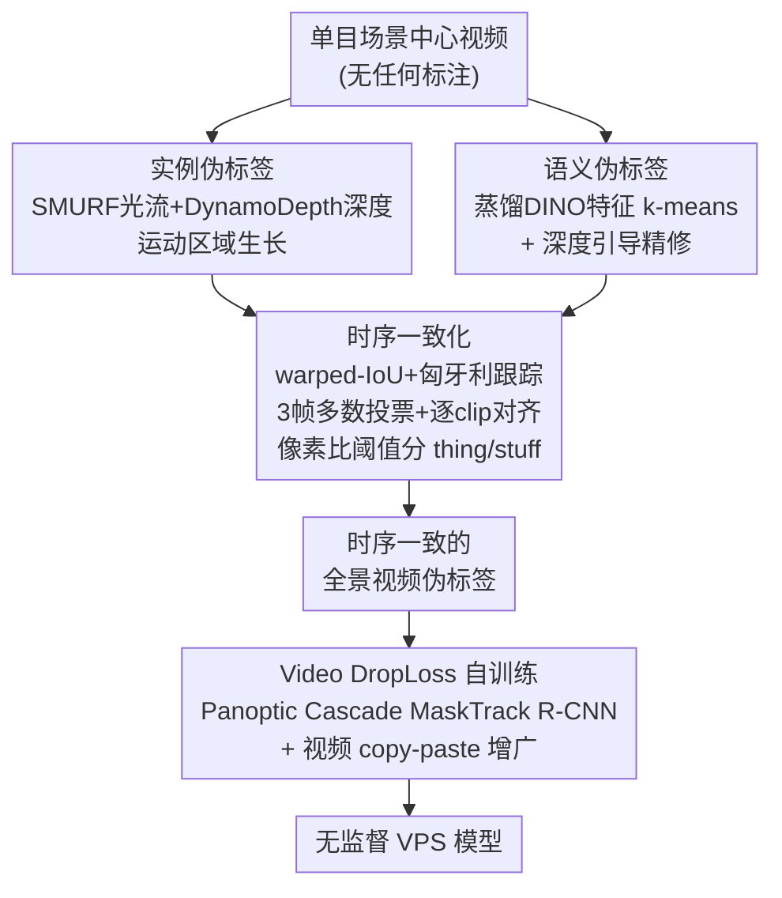

# Scene-Centric Unsupervised Video Panoptic Segmentation

**会议**: CVPR 2026  
**arXiv**: [2606.04925](https://arxiv.org/abs/2606.04925)  
**代码**: https://github.com/visinf/videocups （有，项目页 https://visinf.github.io/videocups/）  
**领域**: 视频理解 / 全景分割  
**关键词**: 无监督全景分割, 视频全景分割, 伪标签, 自监督深度与光流, 时序一致性

## 一句话总结
本文首次提出**完全无监督的视频全景分割（VPS）**任务，给出方法 VideoCUPS：从单目"场景中心"视频出发，用自监督的深度、运动和视觉线索生成**时序一致**的全景伪标签，再用一个新的 **Video DropLoss** 在伪标签上训练 VPS 模型，在 Cityscapes-VPS / KITTI-STEP / Waymo / MOTS 上全面超过四个强基线，且展现出很强的标签高效迁移能力。

## 研究背景与动机

**领域现状**：视频全景分割（Video Panoptic Segmentation, VPS）要同时做三件事——检测、分割、跨帧跟踪所有物体（things），并把整段视频划分成语义一致的区域（stuff）。主流方法全部依赖大量人工标注的逐帧全景标签，而视频逐帧标注成本极高。与此同时，无监督场景理解的研究（如 CutLER、U2Seg、CUPS 等）几乎都停留在**单张图像**的分割上。

**现有痛点**：把图像级无监督方法逐帧套到视频上，会得到**时序不一致**的结果——同一个物体在相邻帧里 ID 漂移、mask 抖动、语义类别跳变，根本无法支撑"跟踪"这一 VPS 的核心需求。而视频域里现成的无监督实例方法（如 VideoCutLER）又只管 things、不管 stuff，覆盖不了全景的语义部分。

**核心矛盾**：无监督信号（DINO 特征聚类、运动分组、深度）本身是**逐帧、带噪、且 thing/stuff 不分**的，而 VPS 需要的是**时序连贯、things 与 stuff 对齐**的完整全景标注。两者之间存在巨大的鸿沟，单纯逐帧聚类填不上。

**本文目标**：（1）定义无监督 VPS 这个新任务并给出可比的评测协议与基线；（2）造出一套时序一致的全景视频伪标签；（3）用这些伪标签训练出一个准确的无监督 VPS 模型。

**切入角度**：作者沿用其前作 CUPS（无监督全景图像分割）的"伪标签 + 自训练"范式，但关键观察是——**单目场景中心视频天然含有深度与运动线索**，把"运动+深度"用于实例分组、把"DINO 特征"用于语义、再用**几何（warped-IoU）做跨帧关联**，就能把逐帧伪标签缝合成时序一致的视频伪标签。

**核心 idea**：用自监督深度/光流/DINO 三类线索造出时序一致的全景视频伪标签，再用对伪标签噪声鲁棒的 Video DropLoss 自训练，得到第一个无监督 VPS 模型。

## 方法详解

### 整体框架
VideoCUPS 分两大阶段：**先造伪标签，再自训练**。输入是单目场景中心视频（如自动驾驶街景），不需要任何人工标注；输出是一个能直接做视频全景预测的 VPS 模型。

伪标签生成路线分两条支线再融合：**实例支线**靠运动+深度的区域生长拿到 things 掩码，**语义支线**靠 DINO 特征聚类拿到 stuff/语义图；两条支线的逐帧结果再经过**时序一致化模块**（跟踪 + 平滑 + 对齐 + thing/stuff 划分）缝成时序连贯的全景视频伪标签。最后用这些伪标签监督一个 **Panoptic Cascade MaskTrack R-CNN（DINO ResNet-50 主干）**，配合 **Video DropLoss** 和自增强视频 copy-paste 数据增广完成训练。

### 关键设计

**1. 运动+深度区域生长造实例伪标签：用几何线索把 things 抠出来**

无监督 things 分割的难点是"没有标签时怎么知道哪一块像素属于同一个物体"。VideoCUPS 不依赖逐帧检测器，而是利用**单目视频自带的运动与深度**：用自监督光流 SMURF 估计像素运动、用自监督单目深度 DynamoDepth 估计深度，然后在运动场上做**基于运动的区域生长**，把运动一致、深度连续的像素聚成一个物体实例。其依据是——独立运动的前景物体在光流和深度上会与背景产生明显边界，几何线索比纯外观（容易把同色物体粘连）更适合无监督地分出独立实例。

**2. DINO 特征聚类 + 深度引导精修造语义伪标签：补齐 stuff 与类别**

实例支线只给出"哪些像素是一个物体"，但不知道它是什么类、也不覆盖道路/天空这类 stuff。语义支线用**蒸馏后的 DINO 特征做 k-means 聚类**得到逐像素的语义分组，再用**深度引导的推理（depth-guided inference）**对聚类结果做精修——深度提供的几何先验（如同一平面、远近层次）能纠正 DINO 特征在边界、阴影处的语义错分。这条支线负责把场景的语义/stuff 部分补全，与实例支线互补。

**3. 时序一致化：把逐帧伪标签缝成时序连贯的视频全景标注**

这是从"图像伪标签"跨到"视频伪标签"的关键。它包含四个动作协同：（i）**实例跟踪**——把前一帧的实例按光流 warp 到当前帧，用 **warped-IoU + 匈牙利匹配**做跨帧关联与 ID 传播，保证同一物体 ID 不漂移；（ii）**语义平滑**——对语义图做 **3 帧多数投票**，压掉逐帧聚类的类别抖动；（iii）**语义↔实例对齐**——在每个 clip 内把实例 mask 与语义类别做一致性对齐，让每个实例拿到稳定的语义标签；（iv）**thing/stuff 划分**——用一个**像素占比阈值**把"可数物体（things）"与"背景区域（stuff）"分开。四步合起来，把两条带噪、逐帧、thing/stuff 不分的支线，缝成时序连贯、things 与 stuff 对齐的全景视频伪标签。

**4. Video DropLoss + 自增强视频 copy-paste：在带噪伪标签上稳健自训练**

伪标签必然有噪声和未覆盖区域，若直接用全图交叉熵监督，会把伪标签里的错误也学进去。作者提出 **Video DropLoss**：在时序上**丢弃**那些不可靠/未被伪标签覆盖区域的损失，只在高置信、时序一致的区域回传梯度，从而避免模型被伪标签噪声带偏（DropLoss 思想源自其前作 CUPS 的图像版，这里扩展到视频时序维度，⚠️ 具体丢弃准则与公式以原文为准）。配合**自增强的视频 copy-paste 数据增广**（把可靠实例跨帧粘贴以增加 things 多样性与时序变化），最终训练出一个准确的无监督 VPS 模型（Panoptic Cascade MaskTrack R-CNN，DINO ResNet-50 主干）。

### 损失函数 / 训练策略
- 主干：Panoptic Cascade MaskTrack R-CNN，backbone 为 DINO 预训练的 ResNet-50。
- 监督信号：完全来自上一阶段生成的时序一致全景视频伪标签，无任何人工标注。
- 关键损失：**Video DropLoss**——在带噪/未覆盖/时序不一致区域丢弃损失，仅监督可靠区域（⚠️ 精确形式以原文为准）。
- 数据增广：自增强视频 copy-paste（self-enhanced video copy-paste）。

## 实验关键数据

**评测指标**（STEP 系列，均为百分比，越高越好）：
- **STQ**（Segmentation and Tracking Quality）：分割与跟踪综合质量，$\mathrm{STQ}=\sqrt{\mathrm{AQ}\cdot \mathrm{SQ}}$（AQ 与 SQ 的几何均值，⚠️ 以原文为准）。
- **AQ**（Association Quality）：跨帧关联/跟踪质量。
- **SQ**（Segmentation Quality）：语义分割质量。

数据集：Cityscapes-VPS、KITTI-STEP、Waymo（域内），MOTS（域外泛化）。基线为 4 个把 SOTA 无监督语义/视频实例/全景图像方法配上无监督跟踪拼出来的强组合。

### 主实验
各数据集均给出 STQ / AQ / SQ 三列：

| 方法 | Cityscapes STQ/AQ/SQ | KITTI-STEP STQ/AQ/SQ | Waymo STQ/AQ/SQ | MOTS STQ/AQ/SQ |
|------|------|------|------|------|
| DepthG + VideoCutLER | 9.9 / 3.4 / 28.2 | 13.2 / 8.7 / 20.1 | 7.9 / 2.6 / 23.9 | 14.5 / 6.8 / 30.7 |
| U2Seg + SORT | 11.4 / 5.6 / 23.0 | 24.0 / 21.1 / 27.2 | 10.4 / 4.8 / 22.6 | 14.9 / 7.2 / 30.8 |
| CUPS† + SORT（单目） | 17.8 / 10.6 / 29.9 | 32.9 / 35.4 / 30.5 | 16.6 / 9.3 / 29.8 | 14.9 / 7.8 / 28.3 |
| CUPS + SORT（**用了立体视频**） | 20.6 / 13.3 / 31.8 | 34.2 / 37.7 / 31.1 | 17.5 / 9.9 / 30.8 | 16.7 / 10.4 / 27.0 |
| **VideoCUPS（ours，仅单目）** | **22.2 / 15.3 / 32.3** | **37.3 / 43.6 / 32.0** | **18.4 / 10.7 / 31.6** | **18.6 / 10.5 / 33.0** |
| _有监督参考（灰）_ | _42.0 / 27.0 / 65.3_ | _53.9 / 59.9 / 48.4_ | _22.3 / 12.6 / 39.4_ | _20.5 / 12.7 / 33.1_ |

要点：VideoCUPS **在全部 4 个数据集、全部 3 个指标上都超过所有基线**——即使是只用单目训练，也胜过**训练时用了立体视频**的 CUPS + SORT（如 Cityscapes STQ 22.2 vs 20.6，KITTI-STEP AQ 43.6 vs 37.7）。在域外 MOTS 上同样领先，显示泛化性。

### 标签高效学习（label-efficient）
把 VideoCUPS 预训练模型在不同比例的 Cityscapes-VPS 标签上微调，与同架构用 DINO 初始化对比：

| 标签比例 | 结论 |
|----------|------|
| 10% | VideoCUPS 微调即达到"随机初始化、用 100% 标签训练的有监督模型"的 STQ；比 DINO 初始化基线高 **+4.6% STQ** |
| 100% | 比 DINO 初始化仍高 **+2.6% STQ / +2.3% AQ / +3.5% SQ** |

### 消融实验
⚠️ 当前以摘要与项目页内容为准，论文正文（HTML/PDF）尚不可获取，下列消融为对方法组件作用的合理推断，**具体数值与配置以原文为准**：

| 配置 | 预期影响 | 说明 |
|------|---------|------|
| Full model | 最优 | 完整 VideoCUPS |
| w/o 时序一致化 | STQ/AQ 明显下降 | 退化为逐帧伪标签，跟踪 ID 漂移 |
| w/o Video DropLoss | 全指标下降 | 被伪标签噪声带偏 |
| w/o 深度引导精修 | SQ 下降 | 语义边界变差 |
| w/o 视频 copy-paste | things 指标下降 | 物体多样性不足 |

### 关键发现
- **几何线索（深度+运动）是无监督 things 分割的关键**：仅单目就能逼平甚至超过用立体视频的前作，说明运动+深度的区域生长抓住了物体的本质边界。
- **时序一致化决定 VPS 成败**：逐帧无监督方法（DepthG+VideoCutLER、U2Seg+SORT）在 AQ（关联质量）上极低（3.4 / 5.6），印证了"逐帧聚类→拼跟踪"的范式在时序上崩坏，而 VideoCUPS 的缝合策略把 AQ 拉到 15.3。
- **强迁移预训练**：10% 标签即追平全量有监督，说明无监督伪标签自训练学到的是可迁移的视频结构先验。

## 亮点与洞察
- **首次定义无监督 VPS 任务并配齐"协议 + 4 基线 + 方法"**：不只是提一个模型，而是把整个 benchmark 生态搭起来，对后续研究价值很大。
- **单目胜过立体**：在更弱的输入条件（单目 vs 立体）下反超前作，靠的是把深度/运动/DINO 三类自监督线索系统地组织进 things/stuff 两条支线再时序缝合——这种"线索分工 + 几何关联"的设计可迁移到其他无监督视频结构理解任务。
- **Video DropLoss 的思路普适**：在伪标签自训练里"只学可信区域、丢掉不可信区域的损失"是对抗伪标签噪声的通用手段，可迁移到其他无监督/弱监督密集预测任务。
- **warped-IoU + 匈牙利匹配做无监督跟踪**：用光流把上一帧实例 warp 过来按 IoU 关联，是一个轻量且不需要学习的跨帧 ID 传播方案。

## 局限性 / 可改进方向
- **依赖自监督深度/光流质量**：实例支线建立在 SMURF 光流和 DynamoDepth 深度之上，在弱纹理、剧烈光照变化或非刚体运动场景下，这些自监督估计若失效，区域生长会跟着错。
- **面向"场景中心"视频**：方法假设单目街景式、含明显自运动/物体运动的场景，对以物体为中心（object-centric）或静态、运动线索匮乏的视频未必适用。
- **与有监督上限仍有差距**：尤其 SQ（如 Cityscapes 32.3 vs 有监督 65.3）差距明显，无监督语义质量仍是瓶颈。
- ⚠️ **本笔记基于摘要+项目页撰写**，消融、超参与 Video DropLoss 公式等细节待正文核对。

## 相关工作与启发
- **vs CUPS（其前作，无监督全景图像分割）**：CUPS 只做单张图像、且用立体线索；本文扩展到视频，用单目+时序一致化把伪标签缝起来，并提出 Video DropLoss，在单目条件下反超用立体的 CUPS。
- **vs VideoCutLER / DepthG**：它们做无监督视频**实例**分割，只覆盖 things、不分 stuff，且时序关联弱（AQ 极低）；VideoCUPS 是全景（things+stuff）且时序一致。
- **vs U2Seg + SORT**：U2Seg 是无监督全景图像方法逐帧 + SORT 跟踪，时序由外挂跟踪器拼接，本文把时序一致性内建进伪标签生成与训练，关联质量大幅领先。

## 评分
- 新颖性: ⭐⭐⭐⭐⭐ 首次定义无监督 VPS 任务并给出完整方法+协议+基线，开辟新方向。
- 实验充分度: ⭐⭐⭐⭐☆ 4 数据集×3 指标全面对比 + 标签高效实验扎实；消融细节本笔记未能核对（⚠️ 以原文为准）。
- 写作质量: ⭐⭐⭐⭐☆ 摘要与项目页表述清晰、动机链完整（正文未读）。
- 价值: ⭐⭐⭐⭐⭐ benchmark+方法一并开源，为无监督视频全景分割打下基础设施。

<!-- RELATED:START -->

## 相关论文

- [\[CVPR 2026\] Robust Promptable Video Object Segmentation](robust_promptable_video_object_segmentation.md)
- [\[CVPR 2026\] Bootstrapping Video Semantic Segmentation Model via Distillation-assisted Test-Time Adaptation](bootstrapping_video_semantic_segmentation_model_via_distillation-assisted_test-t.md)
- [\[ICLR 2026\] From Vicious to Virtuous Cycles: Synergistic Representation Learning for Unsupervised Video Object-Centric Learning](../../ICLR2026/video_understanding/from_vicious_to_virtuous_cycles_synergistic_representation_learning_for_unsuperv.md)
- [\[CVPR 2026\] Seeing the Scene Matters: Revealing Forgetting in Video Understanding Models with a Scene-Aware Long-Video Benchmark](seeing_the_scene_matters_revealing_forgetting_in_video_understanding_models_with.md)
- [\[CVPR 2026\] Neural-Centric Video Processing Pipeline for Unified Multi-Task Inference](neural-centric_video_processing_pipeline_for_unified_multi-task_inference.md)

<!-- RELATED:END -->
