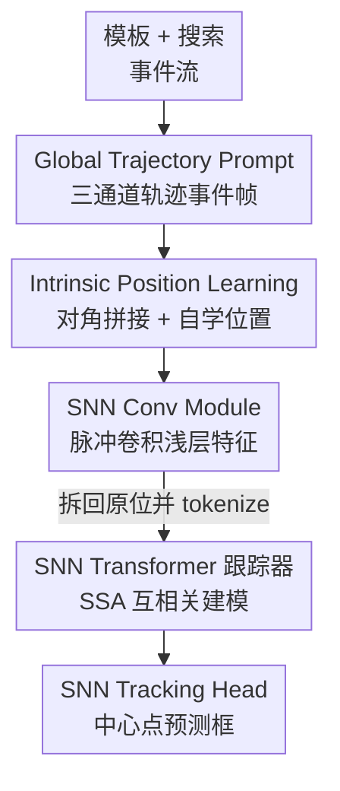

# SDTrack: A Baseline for Event-based Tracking via Spiking Neural Networks

**会议**: CVPR 2026  
**论文**: [CVF Open Access](https://openaccess.thecvf.com/content/CVPR2026/html/Shan_SDTrack_A_Baseline_for_Event-based_Tracking_via_Spiking_Neural_Networks_CVPR_2026_paper.html)  
**代码**: https://github.com/YmShan/SDTrack  
**领域**: 视频理解  
**关键词**: 事件相机, 单目标跟踪, 脉冲神经网络, Spike-driven Transformer, 事件聚合

## 一句话总结
本文提出首个完全基于脉冲神经网络（SNN）的 Transformer 事件跟踪管线 SDTrack：用 Global Trajectory Prompt（GTP）把异步事件流聚合成富含轨迹信息的三通道事件帧，再用一个全脉冲驱动的 SNN Transformer 跟踪器（含 IPL 内禀位置学习）端到端预测目标框，在三个事件跟踪基准上以最低参数量和能耗（Tiny 版 19.61M / 8.16mJ）拿到接近或达到 SOTA 的精度。

## 研究背景与动机
**领域现状**：事件相机以微秒级时间分辨率、140dB 动态范围、低功耗稀疏输出，在低光、过曝、高速运动等 RGB 相机失效的场景里跟踪目标很有优势。把异步事件流切成等长子流、聚合成同步「事件帧」，再喂给为普通相机设计的 Transformer 跟踪器，是当前主流做法。脉冲神经网络（SNN）用 0/1 二值脉冲传递激活、把乘累加（MAC）换成低能耗累加（AC），天然契合事件数据的稀疏性。

**现有痛点**：① 现有事件聚合方法信息丢失严重——Event Frame 只记每个像素「最后一次」极性，像素上发生多次方向变化时前面的运动信息全丢；Time-Surface / Event Count 缺乏鲁棒的轨迹信息；Zhu/Wang 等人用四通道记录极性变化时间，但四通道与「为三通道输入设计的预训练权重」不兼容，迁移学习能力差。② 现有 SNN 跟踪器（STNet、SNNTrack）多是 ANN+SNN 的混合架构，没法充分发挥 SNN 的能效优势，而且不用 template-search 之间的互相关建模，跟踪性能受限。

**核心矛盾**：要同时拿到「事件帧表征足够强（保留时空轨迹）」「能复用视觉预训练（三通道对齐）」「全脉冲驱动（不退化成混合架构）」三件事——但现有方法每次只能顾上一两件。

**本文目标**：拆成两个子问题：(a) 设计一种保留全局轨迹、又能对齐三通道预训练格式的事件聚合方法；(b) 设计一个纯 SNN、带自注意力互相关的跟踪器。

**切入角度**：作者观察到三通道事件帧才能最大化复用 ImageNet 预训练，于是把「正/负极性累积」放前两通道、把「全局轨迹」单独放第三通道；再观察到「模板与搜索帧的联合位置编码 + Transformer 前的残差卷积块」能让网络自学位置信息，于是干脆不用显式位置编码。

**核心 idea**：用「三通道轨迹事件帧（GTP）+ 全脉冲 Transformer 跟踪器（IPL 自学位置）」替代「信息有损的聚合 + ANN/SNN 混合架构」，做出第一个端到端、无数据增强、无后处理的纯 SNN 事件跟踪基线。

## 方法详解

### 整体框架
SDTrack 管线接收模板（template）和搜索（search）两路事件流，先由 **GTP** 各自聚合成三通道事件帧（模板 3×128×128、搜索 3×256×256）；**IPL** 把两帧沿对角线拼成一个统一矩阵（非对角填零），一起送入 **SNN Conv Module** 提取浅层特征；之后把矩阵拆回模板/搜索原位并 tokenize，送入 **SNN Transformer Module**，用脉冲自注意力（SSA）做模板-搜索互相关；最后由 **SNN Tracking Head**（中心点预测头）输出目标中心位置与尺度。整条链路全程脉冲驱动、端到端，推理时不做动态模板更新、也不加 Hanning 窗惩罚等后处理。

### 关键设计

**1. GTP（Global Trajectory Prompt）：用三通道事件帧同时保住「全部运动」和「全局轨迹」**

针对「Event Frame 只记最后一次极性、丢运动信息」和「四通道表征不兼容三通道预训练」这两个痛点，GTP 把一个事件帧设计成三通道。前两个通道分别累积时间窗 $L$ 内每个像素的正、负极性数量：$h^1_i(x,y)=\alpha\sum_{t_k\in L}\delta(x-x_k,y-y_k)\,\delta(p_k-1)$、$h^2_i(x,y)=\alpha\sum_{t_k\in L}\delta(x-x_k,y-y_k)\,\delta(p_k+1)$，其中 $\alpha$ 是既保留有效信息又抑制部分噪声的系数。和「只取最后极性」不同，累加保留了像素上来回运动的全部信息。

第三通道专门记全局轨迹，带时间衰减地从上一帧继承并叠加「本帧新激活」的像素：

$$h^3_i(x,y)=h^3_{i-1}(x,y)\cdot\beta+\alpha\sum_{j=1}^{2}C\big(h^j_{i-1}(x,y),\,h^j_i(x,y)\big)$$

其中 $C(h^j_{i-1},h^j_i)=\mathbb{I}(h^j_{i-1}=0 \text{ 且 } h^j_i\neq0)$ 只在「上一帧该通道为 0、本帧非 0」时点亮（即新出现的运动），$\beta$ 是衰减因子、$h^3_0$ 初始化为零矩阵。这样第三通道就像目标运动的「拖尾轨迹」，为跟踪提供位置和形状线索。三通道格式天生兼容视觉网络结构，跟踪器能更好地从 ImageNet 预训练继承特征提取能力。GTP 不仅服务于 SDTrack，作为通用聚合方法插到 STARK/OSTrack 等主流跟踪器上也能显著涨点。

**2. IPL（Intrinsic Position Learning）：不加任何参数让网络自学位置信息**

针对「事件跟踪对位置敏感、但显式位置编码会引入噪声」的问题，IPL 不用任何额外位置编码，而是把模板帧 $Z\in(T,C,H_z,W_z)$ 和搜索帧 $X\in(T,C,H_x,W_x)$ 沿对角线拼成一个大矩阵，非对角块填零：

$$\mathrm{IPL}(X,Z)=\begin{bmatrix} X & O_1 \\ O_2 & Z \end{bmatrix},\quad U\in(T,C,H_z+H_x,W_z+W_x)$$

这种「对角拼接 + Transformer 前的残差卷积」让网络在卷积感受野里隐式编码模板与搜索的相对位置，从而自学位置信息、还顺带学到更强的目标语义。因为 SNN 是脉冲驱动，填零的 padding 几乎不增加计算开销。消融显示：去掉 IPL（改成 Siamese 分别送入）PR 掉 2.04%；再外加可学习/正弦位置编码反而掉点（网络已自学位置，外加编码引入噪声）。作者还用注意力图和 TGRM（模板梯度响应图）可视化证明，IPL 比传统位置编码更能消除目标区域的「红色敏感区」，提升鲁棒性和语义理解。

**3. 全脉冲 Transformer 跟踪器：SNN Conv + SSA 互相关 + 中心点头，做成纯 SNN**

针对「混合架构没法发挥 SNN 能效、且缺互相关建模」的痛点，作者把整个跟踪器都做成脉冲驱动。骨干分两段：SNN Conv Module 由若干 SNN Conv Block 堆成，每个 block 用残差结构串起脉冲可分离卷积（pointwise→depthwise→pointwise，均前置脉冲神经元 $\mathrm{SN}(\cdot)$）和脉冲卷积组；SNN Transformer Module 由 SNN Transformer Block 组成，核心是脉冲自注意力 SSA——把 token 序列经三个线性层映射成脉冲化的 $Q_s,K_s,V_s$，按 $\mathrm{SSA}(Q_s,K_s,V_s)=Q_s K_s^{\top}V_s * s$ 让模板与搜索 token 互相关，提取面向目标的特征（$s$ 是与通道维和注意力头数相关的缩放因子）。作者还分析了多个候选骨干（Spike-driven Transformer V1/V2/V3），发现都不如为跟踪任务专门设计的这套结构。跟踪头采用 SNN 版中心点预测头（预测中心概率 + 尺寸 + 偏移），实验证明中心头优于角点头，且决策层用纯 Conv 即可、几乎不增能耗。

### 损失函数 / 训练策略
先在 ImageNet-1K 上预训练骨干，再在各事件跟踪数据集上用帧对匹配（pair matching）微调，全程不用数据增强或预处理。损失为分类损失 + 框回归损失：分类用加权 focal loss，回归用 L1 + 广义 IoU：

$$\mathcal{L}=\mathcal{L}_{cls}+\lambda_{iou}\mathcal{L}_{iou}+\lambda_{L1}\mathcal{L}_{L1}$$

其中 $\lambda_{iou}=2$、$\lambda_{L1}=5$。推理走标准 SOT 流程，用首帧做模板，不更新动态模板、不加后处理。所有实验在 4×RTX 4090 上完成。

## 实验关键数据

### 主实验
三个事件跟踪基准（FE108 / FELT / VisEvent）对比标准 SOT 管线。能耗在 VisEvent 上测。

| 方法 | 参数(M) | 神经元 | 能耗(mJ) | FE108 AUC | FELT AUC | VisEvent AUC | VisEvent PR |
|------|---------|--------|----------|-----------|----------|--------------|-------------|
| OSTrack256 | 92.52 | ANN | 98.90 | 54.6 | 35.9 | 32.7 | 46.4 |
| HiT-B | 42.22 | ANN | 19.78 | 55.9 | 38.5 | 34.6 | 47.6 |
| STNet | 20.55 | LIF | 103.53 | – | – | 35.0 | 50.3 |
| SNNTrack | 31.40 | BA-LIF | 8.25 | – | – | 35.4 | 50.4 |
| **SDTrack-Tiny** (I-LIF, 1×4) | **19.61** | I-LIF | **8.16** | 59.0 | 39.3 | 35.6 | 49.2 |
| **SDTrack-Base** (I-LIF, 1×4) | 107.26 | I-LIF | 30.52 | **59.9** | **40.0** | **37.4** | **51.5** |

- Tiny 版以最低参数量与能耗，在 FE108 上比之前最好模型 AUC +1.6%、PR +2.0%；Base 版在三个数据集的 AUC/PR 全部刷到 SOTA。
- 相比专为轻量部署设计的 HiT-B，SDTrack-Tiny 用不到一半的参数和能耗，在多个数据集上反超。

### 消融实验
SDTrack-Tiny（I-LIF, T=1×4）在 FE108 上的消融（Tab. 2）：

| # | 配置 | AUC(%) | PR(%) | 说明 |
|---|------|--------|-------|------|
| 1 | SDTrack-Tiny（完整） | 59.00 | 91.30 | 基准 |
| 2 | 去掉 IPL（Siamese 分别送入） | 58.10 | 89.66 | PR 掉 2.04%，缺位置信息 |
| 3 | + 可学习位置编码 | 58.79 | 89.52 | 反而掉点，引入噪声 |
| 4 | + 正弦位置编码 | 58.57 | 90.77 | 同样掉点 |
| 7 | 对角交集尺寸 0→128 | 43.91 | 73.34 | 拼接重叠过大严重崩坏 |
| 8 | 中心头→角点头 | 58.81 | 90.17 | 中心头更优 |
| 9 | 无预训练 | 47.80 | 74.50 | 预训练不可或缺 |

GTP 两个超参经搜索定为 $\alpha=30$、$\beta=0.8$（Fig. 6）。骨干对比（Tab. 3）显示同设置下 SDTrack-Tiny（59.0/91.3）优于 Spike-driven Transformer V1/V2/V3。

### 关键发现
- **GTP 是通用增益**：把 GTP 接到 STARK/OSTrack/SeqTrack/SimTrack/GRM 等主流跟踪器上都显著涨点，原本在事件跟踪上表现差的模型甚至逼近 SOTA——说明「传统聚合方法时间信息不足」正是限制 SOT 模型迁移到事件跟踪的关键瓶颈。
- **位置信息靠 IPL 自学最好**：外加任何显式位置编码都会掉点；对角拼接的交集尺寸不能过大（0→128 时 AUC 暴跌到 43.91），证明增益来自学到的位置信息而非简单特征拼接。
- **预训练和三通道格式至关重要**：无预训练 AUC 从 59.0 掉到 47.80，印证了 GTP 三通道设计「最大化复用预训练」的价值。
- **能效优势突出**：Tiny 版能耗仅 8.16mJ，与 SNNTrack（8.25mJ）相当却精度更高，远低于 ANN 跟踪器（OSTrack 98.90mJ、ODTrack 335.80mJ）。

## 亮点与洞察
- **把「全局轨迹」单独塞进第三通道**很巧妙：既保住了事件数据独有的时空动态（拖尾轨迹给位置/形状线索），又恰好对齐三通道预训练格式，一举解决「信息保留」和「迁移学习」的两难——这是 GTP 能当通用插件给别的跟踪器涨点的根本原因。
- **IPL 用「对角拼接 + 卷积」隐式编码位置、零额外参数**，反直觉地优于显式位置编码，而且因为脉冲驱动 padding 几乎不增能耗——这种「让结构自带先验、而非外挂模块」的思路可迁移到其他对位置敏感的 SNN 任务。
- **首个端到端纯 SNN 事件跟踪管线**，证明全脉冲架构在跟踪任务上不再需要靠 ANN「兜底」，为神经形态视觉立了一个能耗与精度都能打的基线。

## 局限与展望
- 作者承认：只做了纯事件输入，没探索 Event+RGB 的多模态 SNN 跟踪；也尚未在真实神经形态芯片上部署验证。
- 能耗是「理论估算」（基于 45nm 工艺 $E_{MAC}=4.6$pJ、$E_{AC}=0.9$pJ 和发放率），并非真实芯片实测，实际部署收益待验证 ⚠️。
- Tiny 版搭配 LIF / 时序 I-LIF（T=2×2）在长序列基准 FELT 上明显偏弱，说明轻量配置在长时跟踪上鲁棒性仍有缺口。
- GTP 的 $\alpha,\beta$ 是在 FE108 上网格搜索定的，跨数据集是否需要重调、对超参的敏感度作者未充分讨论。

## 相关工作与启发
- **vs Event Frame / Time-Surface / Event Count 聚合**：它们只记最后极性或缺鲁棒轨迹信息，多次方向运动会丢失；GTP 用前两通道累积全部正负极性、第三通道记全局轨迹，信息更全且兼容三通道预训练。
- **vs Zhu/Wang 等四通道聚合**：四通道记录极性变化时间，但与三通道预训练权重不兼容、复杂任务上表现差；GTP 坚持三通道，最大化迁移学习潜力。
- **vs STNet / SNNTrack（SNN 跟踪器）**：二者是 ANN+SNN 混合架构、且不用自注意力做 template-search 互相关；SDTrack 是首个全脉冲 Transformer，用 SSA 互相关建模，能效与精度都更优。
- **vs OSTrack / STARK 等 ANN SOT 跟踪器**：在事件数据上因缺纹理信息表现不佳、能耗高（百 mJ 级）；SDTrack 借 GTP 补足时间信息、靠 SNN 把能耗压到个位数 mJ。

## 评分
- 新颖性: ⭐⭐⭐⭐⭐ 首个端到端纯 SNN Transformer 事件跟踪管线，GTP 三通道轨迹聚合与 IPL 零参数位置学习都是有针对性的新设计。
- 实验充分度: ⭐⭐⭐⭐ 三数据集主对比 + GTP 通用性验证 + 详尽消融与可视化，但能耗为理论估算、缺真实芯片实测。
- 写作质量: ⭐⭐⭐⭐ 动机层层递进，公式与图示清晰，三件难事的取舍讲得明白。
- 价值: ⭐⭐⭐⭐⭐ 为神经形态事件跟踪立了能耗/精度双优的强基线，GTP 还能作为通用插件惠及现有跟踪器。

<!-- RELATED:START -->

## 相关论文

- [\[CVPR 2026\] SpikeTrack: High-performance and Energy-efficient Event-Based Object Tracking with Spiking Neural Network](spiketrack_high-performance_and_energy-efficient_event-based_object_tracking_wit.md)
- [\[CVPR 2026\] Event6D: Event-based Novel Object 6D Pose Tracking](event6d_event-based_novel_object_6d_pose_tracking.md)
- [\[CVPR 2026\] DarkShake-DVS: Event-based Human Action Recognition under Low-light and Shaking Camera Conditions](darkshake-dvs_event-based_human_action_recognition_under_low-light_and_shaking_c.md)
- [\[CVPR 2026\] TAPFormer: Robust Arbitrary Point Tracking via Transient Asynchronous Fusion of Frames and Events](ttapformer_robust_arbitrary_point_tracking_via_transient_asynchronous_fusion_of_.md)
- [\[CVPR 2026\] MER-Tracker: Towards High-Speed 3D Point Tracking via Multi-View Event-RGB Hybrid Cameras](mer-tracker_towards_high-speed_3d_point_tracking_via_multi-view_event-rgb_hybrid.md)

<!-- RELATED:END -->
