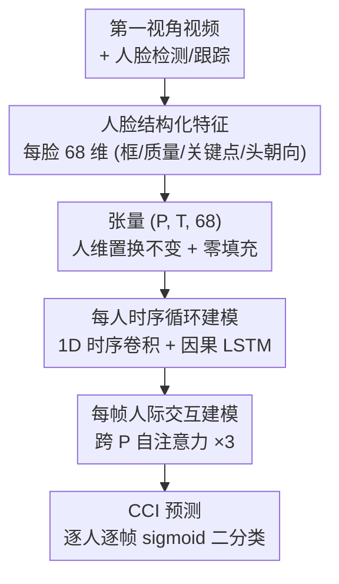

# Seeing Conversations: Communication Context Identification in Egocentric Video

**会议**: CVPR 2026  
**论文**: [CVF Open Access](https://openaccess.thecvf.com/content/CVPR2026/html/Dorszewski_Seeing_Conversations_Communication_Context_Identification_in_Egocentric_Video_CVPR_2026_paper.html)  
**代码**: https://github.com/dorszewski/cci （有）  
**领域**: 视频理解  
**关键词**: 第一视角视频, 社交场景理解, 对话上下文识别, 时序-关系建模, 助听增强

## 一句话总结
本文提出"通信上下文识别（CCI）"这一新任务——从第一视角视频里判断画面中每个人是否属于佩戴者的对话组，配套放出 68.9 小时多人多对话数据集，并设计了仅用人脸结构化特征、跨人跨时联合推理的轻量模型 CoCoNet，在 CCI 上拿到 96% 平衡准确率。

## 研究背景与动机

**领域现状**：人类在多人场景里能毫不费力地"知道自己在和谁说话"——靠的是头朝向、视线这些非语言线索，即使有人暂时沉默或走出视野，也能维持一张"谁在我对话组里"的心理地图。在计算机视觉里，与此最接近的工作是 Ego4D 的 "Talking to me"（TTM）和 Ryan 等人的 SAAL（选择性听觉注意定位），它们关注的是"此刻谁在对佩戴者说话"。

**现有痛点**：这些方法本质上都是**主动说话人检测**——只看当下谁在出声，工作在零点几秒到几秒的短窗口上，需要随着对话轮替快速切换目标。它们做不到识别**沉默的对话伙伴**，也无法在佩戴者把视线移开后继续维持"这个人仍是我的对话对象"。而真实对话组的成员关系在分钟尺度上其实是**稳定的**，瞬时说话人检测恰恰丢掉了这个稳定结构。

**核心矛盾**：要判断一个人是否属于对话组，单帧的空间线索（谁离镜头近、谁正对着镜头）有一定预测力，但远远不够——多方对话需要跨时间、跨个体的联合推理。比如佩戴者看 A，A 又看着 B，那么 A 和 B 可能都是伙伴；之后佩戴者把视线转向 C，A、B 仍然属于这个对话组，这就要求模型把过去的交互"记住"。瞬时、逐人独立的判断无法捕捉这种关系动态。

**本文目标**：把"对话组成员识别"从音频驱动的主动说话人检测里**解耦**出来，只用第一视角的视觉线索，在长时间尺度上推断每个人的对话组归属——包括沉默的、处在视野边缘的人。

**切入角度**：作者的动机来自一个具体的音频应用——**情境感知语音增强**。在嘈杂多说话人环境里，语音分离系统已经能把各个说话人分得很干净，真正的难点是"哪些说话人和用户相关"。如果视觉模型能稳定圈定对话组，助听设备就能优先增强这些人的声音，哪怕他们此刻沉默或用户没正对他们。

**核心 idea**：把每帧检测到的人脸抽成一组轻量结构化特征（框、质量分、3D 关键点、头朝向），用一个**按人维度置换不变、跨时间做循环、跨个体做自注意力**的小网络（CoCoNet）联合推理，输出每帧每人"是否属于我的对话组"。

## 方法详解

### 整体框架
CCI 任务定义为：给定一段带人脸检测框的第一视角视频流，对**每张检测到的人脸做二分类**——它属不属于佩戴者的对话组。评测按"每张脸独立样本"来算，鼓励模型基于局部时序信息做因果（在线）预测，也避免被"某人此刻没出现"干扰。由于伙伴天然比非伙伴更频繁出现在视野里（数据集里伙伴占检测人脸的 66%），存在类别不平衡，因此主指标用**平衡准确率 bAcc**（敏感度与特异度的平均），并辅以 mAP 和 **TbAcc**（在 1/5/25/125/625/3125 帧及整段约 5 分钟等指数增长的输入长度上分别算 bAcc 再平均，概括模型在长短时间尺度上的综合表现）。

CoCoNet 把整段视频组织成形状为 $(P, T, 68)$ 的张量——$P$ 是场景中识别出的人数、$T$ 是帧数，两者都是可变长维度。每个人在 $P$ 维上分到一个固定索引（即使离开又回到视野也保持一致），不在视野时对应特征零填充。整个流程是四个模块串行：特征提取 → 时序建模 → 人际交互建模 → CCI 预测。

### 关键设计

**1. 人脸结构化特征：用 68 维可解释信号代替重型视觉编码器**

CCI 的难点之一是要实时、轻量。作者没有把整张脸丢进 CNN，而是为每张检测脸抽 68 维结构化特征：人脸框坐标 $F_\text{box}=(x,y,w,h)$、检测/识别置信度 $F_\text{qual}$、20 个相对框的 3D 人脸关键点 $F_\text{lm}$（$20\times3=60$ 维）、由关键点导出的头朝向（yaw、pitch）$F_\text{dir}$。这套特征不是随便选的——外视角的社交群体检测方法早就证明头朝向和空间距离是核心线索，而在第一视角里，佩戴者朝向某张脸的程度、与它的距离，**隐式编码在 $F_\text{box}$ 里**（脸越居中越大，说明佩戴者越正对它、离得越近），$F_\text{dir}$ 则反映场景中其他人的头朝向，$F_\text{qual}$ 间接反映遮挡和朝向（非伙伴往往不正对镜头，检测置信度更低），$F_\text{lm}$ 捕捉头部倾斜和嘴部动作。这些特征都来自标准人脸检测器（YuNet）、识别器（SFace）和关键点模型的现成输出，提取极快，支撑实时部署，同时比 CNN 黑盒更可解释。

**2. 人维置换不变 + 可变长训练：让模型适配任意人数、任意时长**

真实社交场景里人数动态变化、对话时长不定。CoCoNet 在 $P$ 维上对所有人做**统一的逐人处理**——第一层线性层在 $P$ 和 $T$ 上权重共享，保持逐人逐帧独立编码，因此天然对人的顺序置换不变，也能靠零填充和掩码在固定大小张量上高效处理变化的人数（利于 GPU 批处理）。配套的训练策略进一步强化这种灵活性：每个 batch 取 16 段视频，随机截 4096 帧（约 164 秒），再切成长度 $T$ 随机取于 $[1,4096]$ 的短片，逼模型在长短上下文上都准；同时把人维 $P$ 随机取于 $[1,9]$、**随机省略个体**当数据增强。消融显示，把人维固定为数据集最大值 9 时只有 92% bAcc，而可变人维 + 随机省略把它抬到 96%，并保证推理时不依赖固定输入形状。

**3. 时序-交互因子分解：逐人做循环、逐帧做自注意力**

判断对话组既要"记住过去的交互"（时序整合），又要"看清此刻人和人之间的关系"（关系推理），但对整个时空做满注意力计算量太大、还会破坏每个人的时序连续性。CoCoNet 的核心是把这两件事**因子分解**开：时序模块先用一个核为 $(1,5)$ 的 1D 时序卷积平滑噪声、捕捉短期行为，再用 64 隐藏单元、跨个体共享的 **因果 LSTM** 沿每个人自己的时间序列独立跑，保留各自的历史记忆；交互模块则在每个时间步上，对 LSTM 输出沿 $P$ 维做**自注意力**（3 层堆叠、每层 4 头、带残差连接），让每个人"时序感知后的表示"去注意同帧其他人的表示，从而推断出"A 看 B、B 没看我，但 A、B 都属于这个对话组"这类需要联合所有人才能得出的结论。这种"逐人时序循环 + 逐帧人际注意力"的设计，既避开了完整时空注意力的高复杂度，又保住了每个人的时序连续性，还让模型能按可用时序长度自适应推理策略——上下文短时多靠交互、上下文长时可多靠个体线索。最后由两个线性层（逐人逐帧）+ sigmoid 把每人压成单标量，得到形状 $(P,T)$ 的逐帧二分类概率。

### 损失函数 / 训练策略
PyTorch 实现，潜表示维度 128，所有线性/卷积层用 ReLU + BatchNorm，内部层后接 dropout（0.5）防过拟合。用 AdamW 优化器 + **加权二元交叉熵**（应对类别不平衡），按验证损失早停。模型仅 431k 参数，5 分钟视频在 CPU 上推理 < 0.5 秒，适合资源受限的实时场景。

## 实验关键数据

### 主实验
数据集 68.9 小时（620 万帧），48 人 6 个 session，每人参与 20 段 5 分钟对话，裁成 877 段（平均 4.7 分钟）；组大小 2/3/4-5/6-10 各占约 25%/30%/24%/20%，平均组大小 4.1；测试集分"匹配测试"（训练见过的人、不同对话）与"未见测试"（完全没出现过的 8 人 session）。

| 分类器 | matched | unseen | size 2 | size 3 | size 4-5 | size 6-10 |
|--------|---------|--------|--------|--------|----------|-----------|
| center distance（纯空间） | 59 | 63 | 81 | 56 | 55 | 54 |
| feature-MLP（多空间特征） | 73 | 76 | 85 | 77 | 77 | 61 |
| ResNet18-Face | 69 | 69 | 82 | 73 | 72 | 51 |
| CoCoNet（仅 2-3 人组训练） | 79 | 82 | 98 | 97 | 86 | 27 |
| CoCoNet（仅 4+ 人组训练） | 85 | 90 | 86 | 89 | 92 | 96 |
| **CoCoNet（全量）** | **95** | **97** | **99** | **95** | **95** | **97** |

CoCoNet 在合并测试集上达 **96% bAcc**，60% 的片段单片 bAcc 超 99%，最差单片也有 50%。匹配 vs 未见（95% vs 97%）几乎无掉点，说明模型没有过拟合到特定个体或佩戴者，得益于用抽象视觉特征而非身份线索。

### 消融实验

| 配置 | bAcc | mAP | TbAcc | 说明 |
|------|------|-----|-------|------|
| 仅 $F_\text{box}$ | 86 | 93 | 79 | 只用框位置/大小 |
| 仅 $F_\text{dir}$ | 89 | 96 | 76 | 只用他人头朝向 |
| $F_\text{box}+F_\text{dir}$ | 94 | 98 | 86 | 组合后明显提升 |
| 全特征（含 ResNet） | 96 | 99 | 87 | 加 ResNet 不再涨 |
| 训练段长固定为 1 | 82 | 90 | 82 | 单帧训练，长输入差 |
| 训练段长固定为 4096 | 95 | 99 | 79 | 长训练，短输入差 |
| 人维固定为 9 | 92 | 97 | 87 | 不做随机省略 |
| w/o 时序 & 交互 | 74 | 83 | 74 | 退化为逐人逐帧 |
| w/ 仅交互 | 83 | 91 | 83 | 只去 LSTM |
| w/ 仅时序 | 92 | 98 | 81 | 只去注意力 |
| Affinity-predictor [39] | 90 | 96 | 81 | 外视角群体检测改造 |
| **CoCoNet（全量）** | **96** | **99** | **87** | — |

### 关键发现
- **时序整合在大组里最关键**：单帧输入下整体 80% bAcc，但识别单个伙伴很容易（96%）、识别大组里多个伙伴很难（约 70-80%）；把输入拉到整段后，6-10 人大组从 70% 飙到 97%，3 人小组从 80% 到 95%——成员关系越复杂越需要时序累积。
- **时序 vs 交互谁更重要看上下文长度**：去掉 LSTM 掉到 83%、去掉交互注意力掉到 93%、两者都去掉只剩 74%；但在 TbAcc（含短上下文）上两者掉幅相近（83% vs 81%），说明**关系建模在时序上下文有限时尤其重要**，长上下文时模型可更多依赖个体线索。
- **数据集多样性是刚需**：只用 2-3 人组训练的模型在 6-10 人大组上崩到 27% bAcc；即使在各自训练的组大小上，专门化模型也打不过全量 CoCoNet——组配置多样性对泛化至关重要。
- **空间重叠是主要难点**：两个对话组在空间上交叠时 bAcc 从 99% 降到 94%；50% 的小/中组片段存在这种竞争性邻近对话。

## 亮点与洞察
- **把"主动说话人检测"重构成"对话组成员识别"**：这个任务重定义很聪明——它指出真正对助听有用的是分钟尺度上稳定的对话组结构，而非瞬时谁在说话，从而把视觉推理从音频和轮替的耦合中解放出来。
- **用 68 维结构化特征打败 ResNet**：在这个任务上轻量可解释特征（96%）反而比 ResNet 视觉编码器（90%）更好，且加 ResNet 也不涨，说明社交上下文推理的瓶颈在"跨人跨时的关系"而非单脸外观——这个 trick 可迁移到其他重关系、轻外观的社交感知任务。
- **时序-交互因子分解**：逐人 LSTM + 逐帧自注意力的分解，既绕开满时空注意力的开销，又保住每人时序连续性，还让模型按上下文长度自适应——这是一种很优雅的"在哪个维度上花算力"的工程取舍。
- **用实验设计直接生成标签**：通过预分配对话组 + 人工核验参与度，免去了后期逐帧人工标注，是大规模社交数据集构建的实用范式。

## 局限与展望
- **纯视觉、无音频**：作者主动承认未来可探索音视频融合；当前在某些靠语音才能区分的场景（如沉默旁观者 vs 真伙伴）可能存在天花板。
- **数据采集偏受控**：6-10 人围桌、预分配对话组、室内坐姿——虽然有意做了组大小和座位多样性，但相比真实街头/移动场景仍偏 staged，泛化到完全自由的日常环境有待验证。
- **依赖上游人脸管线**：特征全来自 YuNet 检测、SFace 识别、关键点估计，这些环节在强遮挡、低光、侧脸时的失败会直接传导到 CCI，论文未深入分析端到端鲁棒性。
- **评测按帧独立**：把每张脸当独立样本算 bAcc 鼓励了在线推理，但也意味着指标未直接反映"整段对话组成员集合"层面的结构一致性。

## 相关工作与启发
- **vs Ego4D TTM / SAAL [31]**：它们做主动说话人检测/定位，靠音视频、短窗口（0.8s），只判断"此刻谁在对我说话"；本文做长时序、纯视觉的对话组归属推断，能处理沉默和边缘参与者。SAAL 在只有两组同时对话、且给定完美说话人定位时达 92.67% mAP，但仅限说话个体；CoCoNet 在多达 5 组同时对话、无音频下达 99% mAP。
- **vs 外视角群体检测（Affinity-predictor [39]）**：外视角方法从墙装相机看全场、靠 F-formation 空间聚类找社交群体；本文改造其 affinity 预测分支用于 CCI 得 90% bAcc，但缺自注意力交互建模，在无时序上下文时（65% vs CoCoNet 80%）差距尤其明显。区别在于 CCI 是**以用户为中心**的——只找佩戴者自己的伙伴，而非场景里所有群体。
- **vs Alletto 等早期第一视角社交群体检测 [2,3]**：他们用空间头朝向图但数据集仅 11 分钟；本文 68.9 小时、系统性变化组大小与座位，规模和多样性远超既有 5-50 小时数据集。

## 评分
- 新颖性: ⭐⭐⭐⭐⭐ 提出 CCI 新任务 + 重定义助听相关的视觉问题，任务和数据集都开了新方向
- 实验充分度: ⭐⭐⭐⭐⭐ 特征/时序/交互/人维/数据多样性全维度消融，并与外视角及说话人检测方法对比
- 写作质量: ⭐⭐⭐⭐ 任务动机和方法分解讲得很清楚，图示充分；部分指标定义（TbAcc）需对照原文细读
- 价值: ⭐⭐⭐⭐⭐ 轻量实时、可解释、直指助听增强落地，社交感知 AI 的扎实一步

<!-- RELATED:START -->

## 相关论文

- [\[CVPR 2026\] Seeing Motion Through Polarity for Event-based Action Recognition](seeing_motion_through_polarity_for_event-based_action_recognition.md)
- [\[CVPR 2026\] CVA: Context-aware Video-text Alignment for Video Temporal Grounding](cva_context-aware_video-text_alignment_for_video_temporal_grounding.md)
- [\[CVPR 2026\] Image Guides Images: Consistent Video Amodal Completion with Rectified In-Context Exemplar Guidance](image_guides_images_consistent_video_amodal_completion_with_rectified_in-context.md)
- [\[CVPR 2026\] Minerva-Ego: Spatiotemporal Hints for Egocentric Video Understanding](minerva-ego_spatiotemporal_hints_for_egocentric_video_understanding.md)
- [\[CVPR 2026\] VecAttention: Vector-wise Sparse Attention for Accelerating Long Context Inference](vecattention_vector-wise_sparse_attention_for_accelerating_long_context_inferenc.md)

<!-- RELATED:END -->
