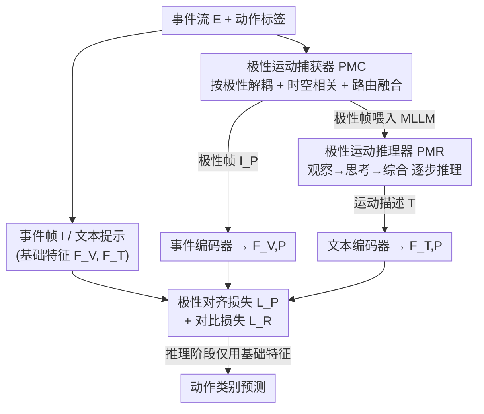

# Seeing Motion Through Polarity for Event-based Action Recognition

**会议**: CVPR 2026  
**论文**: [CVF Open Access](https://openaccess.thecvf.com/content/CVPR2026/html/Cao_Seeing_Motion_Through_Polarity_for_Event-based_Action_Recognition_CVPR_2026_paper.html)  
**代码**: 无  
**领域**: 视频理解  
**关键词**: 事件相机, 动作识别, 极性运动, 跨模态对齐, 多模态大模型

## 一句话总结
针对现有事件-文本跨模态动作识别把正负极性堆叠在一帧里、丢掉运动方向线索的问题，POKER 用一个极性运动捕获器（PMC）显式解耦正负极性并提取时空运动 primitive、再用一个极性运动推理器（PMR）让多模态大模型逐步推理出带极性意识的运动文本描述，最后用极性对齐损失把两路特征拉到类中心，在三个 EAR 基准上把 EventBind 基线稳定提升 1.3~2.6 个点。

## 研究背景与动机
**领域现状**：事件相机（event camera）异步记录每个像素的亮度变化、输出稀疏事件流，天生适合高速运动、极端光照、隐私敏感场景下的动作识别（Event-based Action Recognition, EAR）。近两年主流做法是把事件流堆叠成稠密的事件帧（event frame），再借视觉-语言模型（VLM）做事件-文本跨模态对齐学习，用语言语义来弥补事件数据语义模糊的弱点。

**现有痛点**：这些跨模态方法几乎都把事件流当成普通堆叠帧来处理。事件的核心物理量——**极性（polarity）**，即每个事件标记的是"变亮（+1）"还是"变暗（−1）"——在堆叠时被混进同一张帧里抹平了。而从运动角度看，正极性捕捉的是运动的**前缘（leading edge）**、负极性捕捉的是**后缘（trailing edge）**，二者编码了运动的方向与时序演化。把它们揉成一帧，等于把"往哪动、怎么动"这层关键信息丢掉，导致时空表征判别力不足、跨模态语义对齐不完整。

**核心矛盾**：事件的判别性信息本质上藏在极性所编码的方向运动里，但 frame-stacked 表征为了套用强大的 CNN/Transformer 编码器，恰恰牺牲了极性的可分性——表征能力与极性保真度之间存在结构性冲突。

**本文目标**：把极性所携带的运动知识，从**视觉**和**文本**两个模态同时显式地挖出来并整合进事件-文本学习框架，从而让跨模态对齐更充分、特征更具判别力。

**切入角度**：作者把方案锚定在事件生成的物理机制上——既然极性天然区分了运动的前后缘，那就别再堆叠，而是按极性把流拆开，分别建模各自的时空动态；同时让擅长语义推理的多模态大模型（MLLM）来"读懂"极性运动并写成文字。

**核心 idea**：用"显式解耦极性 + 让 MLLM 逐步推理极性运动 + 极性对齐"来替代"堆叠成帧直接对齐"，把视觉动态与语义推理通过极性这条线耦合起来。

## 方法详解

### 整体框架
POKER 在一个事件-文本对比学习基线（EventBind）之上，挂两个协同模块来注入极性运动知识：**极性运动捕获器 PMC**（管视觉侧）和**极性运动推理器 PMR**（管文本侧）。训练时网络同时跑两条数据流：一条用原始事件帧 $I$ 和普通标签提示词生成**基础特征** $F_V, F_T$；另一条用 PMC 解耦后的极性视觉流生成**极性增强视觉特征** $F_{V,P}$、用 PMR 生成的运动推理描述生成**极性增强文本特征** $F_{T,P}$。两路特征通过对比损失 $L_R$ 和极性对齐损失 $L_P$ 联合优化，达成跨模态耦合。关键是**推理阶段只用基础特征**做最终预测——极性增强只在训练时充当"知识老师"，不增加测试开销。

### 关键设计

**1. 极性运动捕获器 PMC：把正负极性拆开，分别量它们的时空相关性**

这一步直接对症"堆叠抹平极性"的痛点。PMC 先按极性值 $p$ 把原始事件流拆成正极性流 $E_{PP}=\{e_i \mid p_i=+1\}$ 和负极性流 $E_{NP}=\{e_i \mid p_i=-1\}$，各自堆成正极性帧 $I_{PP}$ 与负极性帧 $I_{NP}$。然后用帧差法（frame differencing）从两个维度提取运动 primitive：**同极性时序相关（Intra-Polarity Temporal Correlation）**度量同一极性相邻时间步的运动连续性，$I_{PTC}(t)=I_{PP}(t)-I_{PP}(t-1)$、$I_{NTC}(t)=I_{NP}(t)-I_{NP}(t-1)$；**异极性空间相关（Inter-Polarity Spatial Correlation）**度量同一时刻正负极性之间的空间差异，$I_{SC}(t)=I_{PP}(t)-I_{NP}(t)$。这三张相关图 $C=\{I_{PTC}, I_{NTC}, I_{SC}\}$ 就是 PMC 抽出的核心运动原语。

为了不让三种 primitive 等权相加，PMC 再用一个**动态极性融合（Dynamic Polarity Fusion）**：以原始事件帧 $I$ 为条件，用一个可学习路由矩阵实现的门控函数 $G(\cdot)$ 预测权重，把对判别最有贡献的 primitive 加权聚合成极性运动输入 $I_P$：

$$I_P = \sum_m W_m I_m, \quad \{W_m\}=\mathrm{Softmax}(G(I)), \quad m\in\{PTC, NTC, SC\}$$

这样模型能根据具体动作自适应地决定"该看时序连续性还是该看正负空间对比"，比简单拼接/相加更能挖出跨极性依赖。

**2. 极性运动推理器 PMR：用渐进式提示词让 MLLM 把极性运动"读"成文字**

PMC 产出的极性帧 $I_P$ 富含运动信息，但缺一个语义对齐的文本描述，跨模态潜力发挥不出来。直接把事件帧丢给 MLLM 又不行——MLLM 没在原始事件数据上训练过，零样本直接推理效果很差（论文 Tab.3 里 EventGPT 在 DVS Action 上只有 6.0%，通用 MLLM 也就 36~52%）。PMR 的做法是用一个**渐进式推理提示词（progressive reasoning prompt）** $P$，把 MLLM $\psi$ 的推理拆成三步串行引导：**观察（Observation）**——定位每帧里所有可见物体、识别其瞬时状态（如站立/下蹲）；**思考（Thinking）**——结合事件帧固有的时序相关，解读当前帧的运动区域与趋势，再和前一帧的运动关系对照（如"handing box"动作里手臂上的正极性指示手臂向前运动）；**综合（Synthesis）**——把观察和推理整合成一句完整运动描述 $T$ 并预测动作类别，且被显式约束必须严格基于视觉证据、防止细粒度动作混淆时编造。实际推理时三步合进一个提示词以保证效率。最终 MLLM 输出的是形如 `{arms, moving toward each other}->{hands, making contact}->{hands, releasing}` 的结构化运动叙事，把视觉动态翻译成带极性意识的鲁棒文本。

**3. 极性对齐损失 $L_P$：用类中心约束容忍极性带来的类内方差**

PMC 给出的多样极性帧 $I_P$ 和 MLLM 生成的多样运动描述 $T$，会在同一动作类内引入较大的类内方差，二者直接对齐很困难。$L_P$ 的思路是为每个类构建鲁棒的**极性类中心**：把同类的事件极性特征 $F_{V,P}=E_V(I_P)$ 和文本极性特征 $F_{T,P}=E_T(T)$ 各自拉向其类中心 $\mu_V^c, \mu_T^c$（类内特征均值），最小化两个中心的距离：

$$L_P = \frac{1}{C}\sum_{c=1}^{C}\left\|\mu_V^c-\mu_T^c\right\|_2^2$$

这样既完成跨模态对齐，又对类内变化保持容忍度——比起逐样本对比，类中心对齐对"同一动作不同极性表现"更稳。最终训练目标把它和任务侧的跨模态对比损失 $L_R$（带温度 $\tau$ 的 InfoNCE 形式）相加：$L = L_R + \alpha L_P$，平衡系数 $\alpha$ 在 THUE-ACT-50-CHL 上 $\alpha=1$ 最优。

## 实验关键数据

### 主实验
三个 EAR 基准（SeAct 58 类、DVS Action 10 类、THUE-ACT-50-CHL 18 人/走廊场景）。POKER 作为即插即用增强挂在 EventBind 上，在 stacked / reconstructed 两种帧表征下都涨：

| 数据集 | 表征 | EventBind 基线 | + POKER | 提升 |
|--------|------|---------------|---------|------|
| SeAct | Stacked | 67.24 | 69.82 | +2.58 |
| DVS Action | Stacked | 94.73 | 96.49 | +1.76 |
| THUE-ACT-50-CHL | Stacked | 60.77 | 62.06 | +1.29 |
| SeAct | Recon | 74.13 | 76.72 | +2.59 |
| DVS Action | Recon | 98.24 | 99.60 | +1.36 |
| THUE-ACT-50-CHL | Recon | 61.14 | 63.72 | +2.58 |

注：reconstructed-frame 配置下在 DVS Action 上达到 99.60%，逼近此前 EMP（ICCV'25）的 99.80%。

### 消融实验
逐模块拆解（reconstructed frame，基线为 EventBind 的事件/文本编码器）：

| 配置 | SeAct (%) | THUE-ACT-50-CHL (%) | 说明 |
|------|-----------|---------------------|------|
| 基线（仅编码器） | 74.13 | 61.14 | 无极性增强 |
| + PMC | 75.00 | 62.24 | 视觉侧极性运动捕获，+0.87 / +1.10 |
| + PMR | 75.86 | 62.98 | 文本侧极性推理描述 |
| + PMC + PMR（Full） | 76.72 | 63.72 | 两者协同 |

其它诊断性消融：

| 维度 | 对比 | 关键指标（THUE/SeAct） | 结论 |
|------|------|----------------------|------|
| PMC 融合策略 | Concat / Add / Router | 61.51 / 63.35 / **63.72** | 可学习路由最优 |
| 对齐损失 | 对比损失 / 极性对齐 $L_P$ | 62.62 / **63.72** | $L_P$ 优于标准对比 |
| PMR 用的 MLLM | Qwen3-VL-30B / GPT-4o-mini / Gemini-2.5-Pro | 75.00 / 75.86 / **76.72** (SeAct) | Gemini-2.5-Pro 推理最强 |

### 关键发现
- **PMC 与 PMR 互补且缺一不可**：单加 PMC（视觉侧）涨 0.87~1.1，单加 PMR（文本侧）继续涨，二者协同最高——说明"显式解耦极性建模"和"语义推理极性运动"是两个正交方向，分别补足了视觉动态与文本语义两侧的极性缺口。
- **MLLM 不能裸用**：通用 MLLM（GPT-4o-mini、Gemini-2.5-pro 等）在事件数据上零样本理解只有 36~52%，事件专用的 EventGPT 甚至只有 6.0%；必须经 PMR 的渐进式提示词引导才能把推理能力转成有效的运动描述（接入后 Ours 达 99.6%）。这印证了"MLLM 没在原始事件上训练过、需要任务特定 scaffolding"的判断。
- **路由融合的价值**：相比简单拼接/相加，可学习路由能按动作自适应分配三种运动 primitive 的权重，是 PMC 多挖出判别力的关键。
- **$\alpha$ 敏感性**：极性对齐损失权重 $\alpha$ 在 0.1~1.5 区间呈先升后降，$\alpha=1$ 时最优，过大反而扰动任务损失。

## 亮点与洞察
- **回到物理机制找信号**：本文最"啊哈"的点是把改进锚定在事件生成原理上——正极性=运动前缘、负极性=运动后缘。这不是又叠一个模块，而是指出主流 frame-stacked 范式从一开始就丢了极性方向信息，从源头给出动机，比"再加一路注意力"扎实得多。
- **训练增强、推理零开销**：极性增强的两路特征只在训练时当"老师"约束基础特征，推理只跑基础分支。这种"知识蒸馏式"挂载让 POKER 成为可即插即用的增强器（论文在 stacked / recon 两种表征上都验证了可迁移性），实用价值高。
- **MLLM 当"运动注释器"的范式**：用渐进式"观察→思考→综合"提示把 MLLM 变成结构化运动叙事生成器（`{部位, 动作}->{部位, 动作}`），这个 scaffolding 思路可迁移到其它"模态与 MLLM 训练分布不匹配"的任务（如雷达、医学时序信号），先用提示词把陌生模态翻译成模型熟悉的语义序列。
- **类中心对齐对付生成式监督的噪声**：MLLM 生成的描述天然有类内方差，用类中心而非逐样本对比来对齐，是处理"弱/噪声文本监督"的可复用 trick。

## 局限与展望
- **依赖外部强 MLLM**：PMR 的效果与所用 MLLM 强相关（Gemini-2.5-Pro > GPT-4o-mini > Qwen3-VL-30B），最佳结果建立在调用闭源大模型之上，复现成本和稳定性受外部 API 影响；论文未 report 剔除 MLLM 后纯结构化设计能达到的上限。
- **增益绝对值不大**：在已经很高的基线上（DVS Action 已 98%+）提升多在 1~2.6 个点，且最大增益出现在最难的 THUE-ACT-50-CHL；在饱和数据集上空间有限。
- **极性解耦的额外计算**：PMC 把流拆成正负两支并各算时序/空间相关，训练期计算与显存开销上升（推理虽不用，但训练成本未量化对比）。
- **生成描述的可靠性**：⚠️ MLLM 生成的运动叙事可能与真实极性运动不完全一致，论文用"必须基于视觉证据"约束缓解，但未给出描述质量的定量评估，存在语义漂移风险（以原文为准）。

## 相关工作与启发
- **vs ExACT / EZSR / EventGPT（VLM/MLLM for EAR）**: 它们率先把语言语义引入事件帧处理或零样本识别，但都把事件当堆叠帧、忽略极性内在线索；POKER 显式挖掘极性运动知识，从源头补足跨模态对齐的完整性。
- **vs EventBind（基线）**: EventBind 做事件-文本对比对齐但无极性建模；POKER 在其上挂 PMC+PMR+$L_P$，在两种帧表征、三个数据集上一致涨点，证明极性增强是正交可叠加的。
- **vs 单模态 EAR（SpikePoint / EventMamba / PAST-SSM）**: 这类方法保留事件异步性（点/体素 + SNN/GCN）或用状态空间建模帧特征，性能受限于单模态信息量；POKER 走跨模态路线、借语言语义和极性知识把判别力进一步推高。
- **vs 知识增强方法（MLLM4WTAL / ENNGINE）**: 它们用 MLLM/外部知识在 NLP 或弱监督任务里注入先验；POKER 把这套"知识中心"视角落到事件视觉，挖的是事件生成机制内在的极性运动知识，而非外部检索知识。

## 评分
- 新颖性: ⭐⭐⭐⭐ 把改进锚定在事件极性的物理机制上、并让 MLLM 做极性运动推理，角度新颖扎实
- 实验充分度: ⭐⭐⭐⭐ 三数据集 + 两种帧表征 + 模块/融合/损失/MLLM/超参多维消融，较完整
- 写作质量: ⭐⭐⭐⭐ 动机推导清晰、图示直观，但部分增益偏小处论证略一笔带过
- 价值: ⭐⭐⭐⭐ 即插即用、推理零开销，且"用提示词把陌生模态翻译给 MLLM"的范式可迁移

<!-- RELATED:START -->

## 相关论文

- [\[CVPR 2026\] SMV-EAR: Bring Spatiotemporal Multi-View Representation Learning into Efficient Event-Based Action Recognition](smv-ear_bring_spatiotemporal_multi-view_representation_learning_into_efficient_e.md)
- [\[CVPR 2026\] DarkShake-DVS: Event-based Human Action Recognition under Low-light and Shaking Camera Conditions](darkshake-dvs_event-based_human_action_recognition_under_low-light_and_shaking_c.md)
- [\[CVPR 2026\] OpenMarcie: Dataset for Multimodal Action Recognition in Industrial Environments](openmarcie_dataset_for_multimodal_action_recognition_in_industrial_environments.md)
- [\[CVPR 2026\] VideoNet: A Large-Scale Dataset for Domain-Specific Action Recognition](videonet_a_large-scale_dataset_for_domain-specific_action_recognition.md)
- [\[NeurIPS 2025\] Seeing Beyond the Scene: Analyzing and Mitigating Background Bias in Action Recognition](../../NeurIPS2025/video_understanding/seeing_beyond_the_scene_analyzing_and_mitigating_background_bias_in_action_recog.md)

<!-- RELATED:END -->
