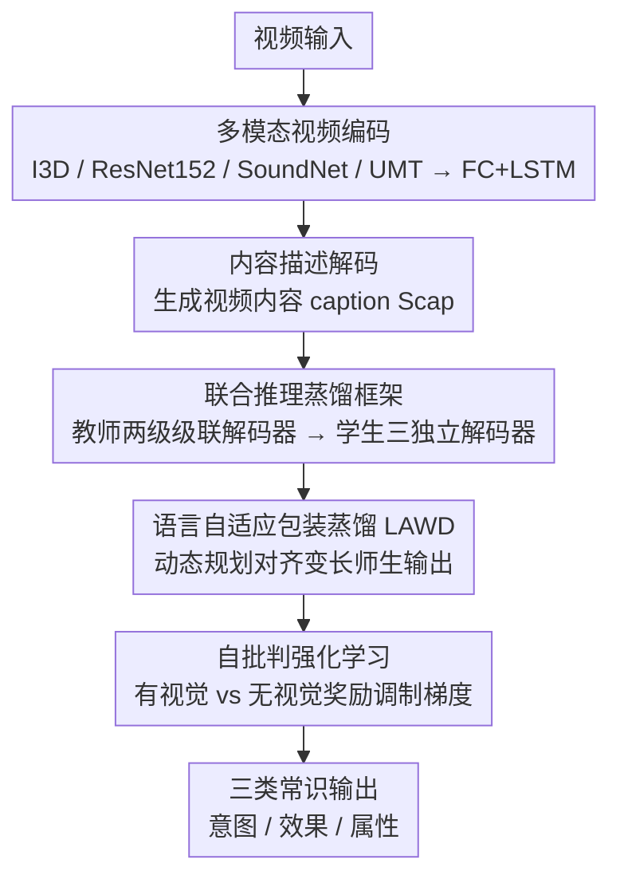

# Self-Critical Distillation Network for Video-based Commonsense Captioning

**会议**: CVPR 2026  
**论文**: [CVF Open Access](https://openaccess.thecvf.com/content/CVPR2026/html/Yuan_Self-Critical_Distillation_Network_for_Video-based_Commonsense_Captioning_CVPR_2026_paper.html)  
**代码**: https://github.com/yuan687198/scdnet  
**领域**: 视频理解 / 视频常识描述生成  
**关键词**: 视频常识描述, 自批判强化学习, 知识蒸馏, 级联解码器, 视觉接地

## 一句话总结
SCD-Net 针对"视频→内容描述→常识"推理链导致的两大问题——常识缺乏视觉接地、各类常识相互孤立——用自批判强化学习强化视觉推理、用联合推理蒸馏框架（教师级联解码器 + 学生 + 语言自适应包装蒸馏）建立类间常识关联，在 V2C 数据集上不依赖 LLM 就超过了 LLM-based 方法。

## 研究背景与动机
**领域现状**：视频常识描述（video-based commonsense captioning）要求模型不仅描述视频可见内容，还要推断事件背后的三类常识——意图（intention，为何发生）、效果（effect，导致什么变化）、属性（attribute，如何刻画施动者）。主流做法构造一条"视频 $V$ → 内容描述 $C$ → 常识 $I/E/A$"的推理链，并用编码器-解码器范式实现。

**现有痛点**：这条推理链有两个结构性缺陷。其一，**常识缺乏视觉接地**：视频模态信息量远大于文本，不同视频常共享相同的内容描述；模型为了保准确率，会对共享同一描述的不同视频生成相同常识，导致常识文本多样性下降、与视频语义脱节（"视觉无关的通用输出"）。其二，**类间常识被割裂**：现有模型为三类常识各用一个独立解码器，忽略了类别间的相互关联——而知道意图（"她想做健康餐"）和属性（"此人手很巧"）其实能帮助推断效果（"她很快就能做好吃的"）。

**核心矛盾**：要么引入 LLM（如 TKG-Net 用 GPT 知识）来补语义，但资源代价高昂；要么在不加额外资源的前提下，从推理链本身的两个薄弱环节下手。作者选择后者。

**本文目标**：(1) 让常识生成真正"用上"视觉信息，提升与视频语义的一致性；(2) 让三类常识在生成时能相互引导，同时保证测试公平（测试时拿不到其他类别的 ground-truth）。

**切入角度**：用自批判（self-critical）强化学习去"逼"模型证明自己用了视觉——对比"有视觉输入"和"无视觉输入"两种生成范式的奖励差，作为训练梯度的调制；用师生蒸馏把"测试时不可用的其他类别 ground-truth"安全地转化为可学习的类间知识。

**核心 idea**：自批判强化 + 联合推理蒸馏，双管齐下优化推理链——一条线管"视觉接地"，一条线管"类间关联"。

## 方法详解

### 整体框架
给定视频 $V$，SCD-Net 先用多个视觉编码器抽取多模态特征，经内容解码器生成视频内容描述 $S_{cap}$；随后兵分两路：一路是**联合推理蒸馏框架**——教师模型用两级级联解码器把"其他类别常识"喂进来学到类间关联，再通过知识蒸馏把这种关联迁移给一个测试时不依赖其他类别 ground-truth 的学生模型；另一路是**自批判强化学习**——构造"有视觉 / 无视觉"两种生成范式，用二者的指标分差作为奖励来强化对视觉信息的利用。两路共同优化同一条推理链，最终输出意图/效果/属性三类常识描述。

### 关键设计

**1. 联合推理蒸馏框架：把"测试时拿不到的类间 ground-truth"安全地蒸成可学知识**

直接让某类常识解码器读入其他类别的 ground-truth 能利用类间关联，但测试时其他类别真值不可得，这会造成训练-测试不公平。SCD-Net 用师生结构破这个困局。**教师**用两级级联解码器：第一级解码器输入"内容描述 + 其他类别的 one-hot ground-truth 常识"来重建目标类别常识，损失为 $L^{T1}_{cms}=-\sum_t \log p(y_t\mid y_{<t}, [S_{cap}, \tilde{S}^{cur}_{cms}]; \theta_{T1})$；第二级则把"其他类别第一级解码器的输出"$S^{oth}_{cms}$ 连同视觉特征一起作为输入，$L^{T2}_{cms}=-\sum_t \log p(y_t\mid y_{<t}, [F_{mul}, S_{cap}, S^{oth}_{cms}]; \theta_{T2})$——例如"意图"的第二级解码器吃"效果"和"属性"第一级的输出。**学生**则用三个结构相同的独立解码器，不依赖任何其他类别 ground-truth，仅凭 $[F_{mul}, S_{cap}]$ 生成常识（$L^{S}_{cms}$ 为交叉熵）。教师把类间关联知识蒸馏给学生，于是学生在测试时既享受了类间互推的好处，又保持了公平。

**2. 语言自适应包装蒸馏（LAWD）：用动态规划对齐变长师生句子，消除同义错配**

师生输出句子长度不同时，传统逐词一对一对齐会把语义等价但位置错开的词（如 "there is" 对 "a man"）算出高损失——这是"同义错配（synonym misalignment）"。LAWD 用动态规划替代 KL 散度来做变长句子的蒸馏：给定教师、学生的语言嵌入矩阵 $H^X\in\mathbb{R}^{n\times e}$、$H^Y\in\mathbb{R}^{m\times e}$，先定义师生代价矩阵 $C(H^X,H^Y)=(\|h^X_i-h^Y_j\|)_{n\times m}$（欧氏距离），再用 DP 寻找从 $(0,0)$ 到 $(n,m)$ 的最优路径代价：

$$r_{i,j}=\min\{r_{i-1,j-1}, r_{i-1,j}, r_{i,j-1}\} + c_{i,j}$$

（论文同时给出 soft 版 $\Delta=-\log(e^{-r_{i-1,j-1}}+e^{-r_{i-1,j}}+e^{-r_{i,j-1}})+c_{i,j}$，⚠️ 具体取舍以原文为准），最终蒸馏损失取 $L_{kd}=r_{n,m}$，即所有路径组合的最小总代价。这样语义相同、位置不同的词不会再被错误惩罚，变长句子间的类间知识得以稳定迁移。

**3. 自批判强化学习：用"有视觉 vs 无视觉"奖励差逼模型真正用上视觉**

针对"常识缺乏视觉接地"，SCD-Net 设计两种生成范式：一种把视频特征 + 内容描述一起输入常识解码器，另一种屏蔽视频特征、只输入内容描述。直觉是：若模型真的用上了视觉，有视觉版的生成质量应当超过纯文本版。但 CIDER 等评测指标不可微、无法直接反传，故用自批判强化学习：以两种范式的评测分差作为奖励，梯度近似为

$$\nabla_\theta L_{cms}(\theta)=-\gamma\,\tanh^{*}\!\big(r(y^{v})-r(y^{wv})\big)\,\nabla_\theta \log p_\theta(y^{v}_{1:N_{cms}})$$

其中 $r(y^{v})$、$r(y^{wv})$ 分别是有/无视觉输入生成结果的评测分，$\gamma$ 是超参。当模型有效利用视觉（分差为正）时强化其梯度、鼓励参数更新；利用低效时则同一奖励机制施加惩罚，从而把"视觉接地"直接写进优化目标。

### 损失函数 / 训练策略
总损失 $L=\lambda_1 L_{cap}+\lambda_2 L^{S}_{cms}+\lambda_3 L_{kd}$，自批判强化被并入 $L^{S}_{cms}$ 与 $L^{T}_{cms}$ 的计算。两阶段训练：先用交叉熵跑 200 epoch，再用自批判损失跑 2000 epoch；学习率 3.5e-4、Adam、300 步 warm-up，$\lambda_1{:}\lambda_2{:}\lambda_3=1{:}3{:}0.0005$，batch 64，单卡 V100。

## 实验关键数据

### 主实验
在大规模 V2C（Video-to-Commonsense）数据集（9721 个视频场景、121618 条描述）上，按意图/效果/属性三类用 CIDER(C) / ROUGE-L(R) / BLEU(B-1,B-4) 评测。SCD-Net（不含 LLM）不仅大幅超过非 LLM 基线 HybridNet，还超过用 GPT 知识的 LLM-based TKG-Net：

| 类别 | 模型 | 是否用 LLM | C | R | B-1 | B-4 |
|------|------|-----------|------|------|------|------|
| 意图 | HybridNet (baseline) | × | 92.6 | 60.1 | 69.4 | 53.1 |
| 意图 | TKG-Net | ✓ | 100.6 | 62.0 | 70.4 | 55.7 |
| 意图 | **SCD-Net** | × | **106.3** | **63.7** | **72.5** | **58.1** |
| 效果 | HybridNet (baseline) | × | 66.2 | 41.5 | 49.0 | 38.8 |
| 效果 | **SCD-Net** | × | **80.6** | **46.5** | **54.0** | **44.8** |
| 属性 | HybridNet (baseline) | × | 32.5 | 41.0 | 58.7 | 51.7 |
| 属性 | **SCD-Net** | × | **34.9** | **42.5** | **61.4** | **56.5** |

意图类 CIDER 从 92.6 提到 106.3、BLEU-4 从 53.1 提到 58.1，效果类 CIDER 更是从 66.2 跃升到 80.6。

### 消融实验
Table 2 拆解两大组件（SC=自批判强化，Dis=联合推理蒸馏；此处为 2000 epoch 结果）：

| 类别 | 配置 | C | R | B-1 | B-4 |
|------|------|------|------|------|------|
| 意图 | Baseline | 92.6 | 60.1 | 69.4 | 53.1 |
| 意图 | + SC | 103.1 | 62.2 | 69.9 | 55.2 |
| 意图 | + Dis | 98.1 | 61.9 | 70.1 | 55.5 |
| 意图 | + SC + Dis | 104.9 | 63.0 | 70.7 | 56.1 |
| 效果 | Baseline | 66.2 | 41.5 | 49.0 | 38.8 |
| 效果 | + SC | 76.3 | 44.6 | 51.6 | 41.8 |
| 效果 | + Dis | 73.4 | 43.9 | 52.1 | 42.7 |
| 效果 | + SC + Dis | 78.8 | 45.7 | 52.8 | 43.3 |

### 关键发现
- **自批判强化（SC）单独贡献最大**：在意图/效果类上，+SC 把 CIDER 分别从 92.6→103.1、66.2→76.3，涨幅显著大于 +Dis，说明"视觉接地"是该任务最薄弱也最值得补的环节。
- **两组件互补**：SC 与 Dis 叠加（+SC+Dis）几乎在所有指标上取得最佳，印证"视觉推理"与"类间关联"是两个正交的改进方向。
- **不靠 LLM 即超 LLM 方法**：SCD-Net 在意图类全指标上超过用 GPT 知识的 TKG-Net，且大幅降低资源消耗。
- Table 1 与 Table 2 中 SCD-Net / Baseline+SC+Dis 是同一方法，数值差异源于 Table 1 取延长训练后逐 epoch 测得的最优值、Table 2 固定报 2000 epoch。

## 亮点与洞察
- **自批判奖励的"有视觉 vs 无视觉"对照设计很巧**：它把"模型是否真的用了视觉"这个抽象问题，转化成一个可计算的奖励差并直接调制梯度，绕开了 CIDER 不可微的障碍——这个对照式 self-critical 思路可迁移到任何"想强制某模态被利用"的多模态任务。
- **用师生蒸馏化解"训练-测试公平"矛盾**：想用类间 ground-truth 又怕测试时拿不到，教师级联 + 学生独立解码器的设计是一个干净的解法，值得在多任务/多标签共享信息的场景借鉴。
- **LAWD 用 DP 对齐变长句子**：把"同义错配"这个蒸馏里常被忽视的小问题用动态规划路径代价优雅解决，比逐词 KL 更符合自然语言的语义对齐本质。

## 局限与展望
- 训练成本不低：第二阶段需 2000 epoch 自批判训练，强化学习的收敛与稳定性对超参（$\gamma$、$\lambda$）较敏感，论文未给充分的敏感性分析。
- 奖励依赖 CIDER 等自动指标：以指标分差当奖励可能放大指标本身的偏好（如对高频词的偏向），"视觉接地"是否被真正强化还需更细的人工/接地评测佐证。
- 只在 V2C 单一数据集上验证，三类常识的设定较固定，跨数据集 / 更开放常识类别下的泛化性未知。
- 教师两级级联解码器引入额外训练分支，虽然学生测试时轻量，但训练阶段的复杂度与显存开销有所上升。

## 相关工作与启发
- **vs HybridNet（backbone/baseline）**：HybridNet 在统一 transformer 里联合优化三类常识损失，但用共享内容描述、各类独立解码，既缺视觉接地又无类间互推；SCD-Net 在其之上加 SC + Dis，全指标大幅领先。
- **vs TKG-Net**：TKG-Net 引入 GPT 知识补语义但资源代价高；SCD-Net 不用 LLM，靠自批判 + 蒸馏达到甚至超过其性能，主打"零额外资源"。
- **vs LLCP**：LLCP 原为 VideoQA 设计、学视频到事件的映射空间，本文将其核心思想迁移到常识描述作对比；SCD-Net 在常识接地与类间关联上更针对性。
- **vs 经典 self-critical（Rennie et al.）**：经典 SCST 用模型自身推理输出归一化奖励；本文把"自批判"重定义为"有视觉 vs 无视觉"的对照奖励，专门服务于视觉接地这一任务诉求。

## 评分
- 新颖性: ⭐⭐⭐⭐ 自批判的"有/无视觉"对照奖励与教师级联蒸馏化解测试公平，是针对该任务两大痛点的有创意组合。
- 实验充分度: ⭐⭐⭐⭐ 三类常识、多基线、组件消融齐全，但仅 V2C 单数据集、超参敏感性证据偏少。
- 写作质量: ⭐⭐⭐⭐ 推理链缺陷分析清晰、公式完整、图示到位；LAWD 的 soft/hard 版本表述略需对照原文。
- 价值: ⭐⭐⭐⭐ 不依赖 LLM 即超 LLM 方法、资源友好，对资源受限的视频常识理解落地有实用意义。

<!-- RELATED:START -->

## 相关论文

- [\[CVPR 2026\] Self-Paced and Self-Corrective Masked Prediction for Movie Trailer Generation](self-paced_and_self-corrective_masked_prediction_for_movie_trailer_generation.md)
- [\[CVPR 2026\] Bootstrapping Video Semantic Segmentation Model via Distillation-assisted Test-Time Adaptation](bootstrapping_video_semantic_segmentation_model_via_distillation-assisted_test-t.md)
- [\[CVPR 2026\] Stay in your Lane: Role Specific Queries with Overlap Suppression Loss for Dense Video Captioning](stay_in_your_lane_role_specific_queries_with_overlap_suppression_loss_for_dense_.md)
- [\[CVPR 2026\] Boosting Self-Supervised Tracking with Contextual Prompts and Noise Learning](boosting_self-supervised_tracking_with_contextual_prompts_and_noise_learning.md)
- [\[CVPR 2026\] SAIL: Similarity-Aware Guidance and Inter-Caption Augmentation-based Learning for Weakly-Supervised Dense Video Captioning](sail_similarity-aware_guidance_and_inter-caption_augmentation-based_learning_for.md)

<!-- RELATED:END -->
